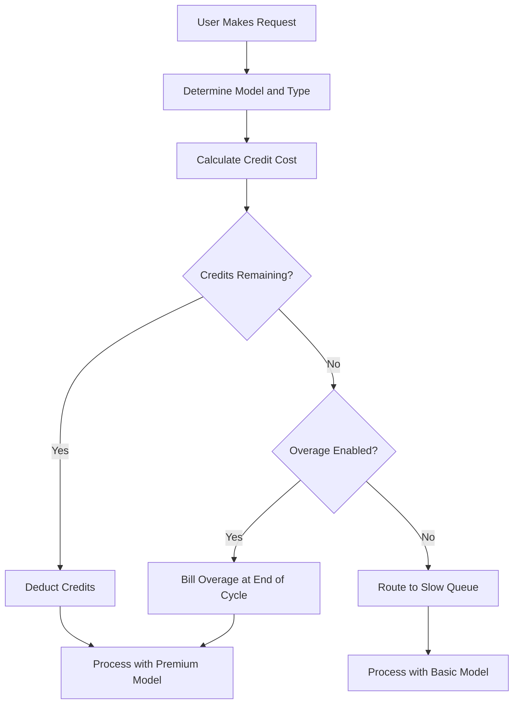

## كيف تُفوِّت كورسر

تستخدم كورسر نموذجًا هجينًا يجمع بين اشتراك شهري وحوض اعتمادات يتناقص. يوفر هذا النهج سعرًا متوقعًا للمستخدمين مع إدارة تكاليف النماذج المختلفة المتغيرة.

**طبقات التسعير**: تقدم كورسر طبقات من Hobby إلى Ultra، موازنةً بين الوصول المميز والقياسي لتناسب تدفقات العمل المختلفة.

| الخطة | السعر | الطلبات المميزة | الطلبات البطيئة |
| :--- | :--- | :--- | :--- |
| Hobby | مجاني | 50/شهر | غير محدود |
| Pro | \$20/شهر | 500/شهر | غير محدود |
| Pro+ | \$60/شهر | طلبات مميزة غير محدودة | - |
| Ultra | \$200/شهر | طلبات مميزة غير محدودة | - |

**التناقص المرجح بالنموذج**: تستهلك الطلبات المختلفة كميات مختلفة من الاعتمادات اعتمادًا على تكلفة النموذج الأساسي. يسمح هذا لكورسر بتقديم اشتراك واحد يغطي مزودين متعددين مع ضمان احتساب العمليات المكلفة.

| نوع الطلب | النموذج | تكلفة الاعتماد |
| :--- | :--- | :--- |
| إكمال التبويب | الافتراضي | 0 |
| الدردشة | GPT-4o Mini | 1 |
| الدردشة | Claude 3.5 Sonnet | 1 |
| المؤلف | GPT-4o | 5 |
| الوكيل | Claude 3.5 Sonnet | 10 |
| الوكيل | o1-preview | 25 |

**نفاد الاعتمادات والتجاوزات**: عندما تنفد الاعتمادات، ينتقل المستخدمون إلى قائمة "البطيئة" باستخدام نماذج أرخص بدلًا من الانقطاع. كما يمكنهم تفعيل تجاوزات قائمة على الاستخدام للحفاظ على الوصول المميز بتكلفة ثابتة لكل طلب.



4. **المؤسسات والأعمال**: تستخدم الفرق استخدامًا مجمعًا حيث يشارك المنظمة بأكملها سلة اعتمادات واحدة. يبسط ذلك الإدارة ويضمن ألا يصل المستخدمون الكثيفو الاستخدام إلى الحدود الفردية بينما لا يستغل الآخرون السعة المتوفرة.

## ما الذي يجعله مميزًا

يوازن نموذج كورسر تجربة المستخدم مع تكاليف البنية التحتية بحل مشكلات تواجهها نماذج فوترة SaaS التقليدية.
- **تجريد المزود**: يغلف اشتراك واحد مزودات LLM متعددة مثل OpenAI وAnthropic، مع التعامل مع التسعير المعقد ومفاتيح API من وراء الكواليس.
- **التناقص المرجح**: تتماشى التكاليف مع القيمة من خلال فرض رسوم أعلى على النماذج القوية، مما يجعل التسعير يبدو عادلاً وشفافًا لجميع المستخدمين.
- **إضمحلال سلس**: تمنع قائمة "البطيئة" الانقطاعات الحادة، مما يبقي المستخدمين في المنتج ويشجع على الترقية دون أن تكون عقابية.
- **اعتمادات مجمعة**: تقلل سلات الفريق من الاحتكاك لعملاء المؤسسات بالسماح بمشاركة الموارد بكفاءة عبر المنظمة بأكملها.

## بناء هذا باستخدام Dodo Payments

يمكنك تكرار هذا النموذج الدقيق باستخدام استحقاقات الاعتمادات والفوترة المعتمدة على الاستخدام من Dodo Payments. سترشدك الخطوات التالية خلال التنفيذ.

<Steps>
  <Step title="Create a Custom Unit Credit Entitlement">
    أولًا، حدد نظام الاعتمادات في لوحة Dodo. سيمثل هذا الاستحقاق "الطلبات المميزة" التي يحصل عليها المستخدمون مع اشتراكهم.

    *   **نوع الاعتماد:** وحدة مخصصة
    *   **اسم الوحدة:** "الطلبات المميزة"
    *   **الدقة:** 0 (لأنك لا يمكن أن تستخدم نصف طلب)
    *   **انتهاء الاعتماد:** 30 يومًا (يضمن ذلك إعادة ضبط الاعتمادات في كل دورة فوترة)
    *   **التحويل:** معطل (لا تنتقل الطلبات غير المستخدمة للشهر التالي)
    *   **التجاوز:** ممكّن
    *   **السعر لكل وحدة:** \$0.04 (تكلفة كل طلب بعد نفاد الحوض الأولي)
    *   **سلوك التجاوز:** تحصيل التجاوز مع الفوترة (يضيف ذلك تكلفة التجاوز إلى الفاتورة التالية)

    يضمن هذا التكوين أن يحصل المستخدمون على حوض ثابت من الطلبات كل شهر، مع خيار الدفع مقابل المزيد عند الحاجة. إنها أساس نموذج الفوترة الهجين.
  </Step>

  <Step title="Create Subscription Products">
    أنشئ منتجات منفصلة لكل طبقة. اربط نفس استحقاق الاعتمادات بكل منتج، لكن بمبالغ مختلفة. يتيح لك ذلك إدارة جميع الطبقات باستخدام نظام اعتماد واحد، مما يسهل ترقية أو خفض مستوى المستخدمين.

    *   **Hobby:** \$0/شهر، 50 اعتماد/دورة
    *   **Pro:** \$20/شهر، 500 اعتماد/دورة
    *   **Pro+:** \$60/شهر، 5000 اعتماد/دورة (غير محدود عمليًا لمعظم الحالات)
    *   **Ultra:** \$200/شهر، 50000 اعتماد/دورة (غير محدود عمليًا)

    عندما يشترك المستخدم في أحد هذه المنتجات، يخصص Dodo تلقائيًا عدد الاعتمادات المقابل لحسابه. يحدث ذلك فورًا، مما يوفر تجربة انضمام سلسة.
  </Step>

  <Step title="Create a Usage Meter Linked to Credits">
    أنشئ عدادًا باسم `ai.request` مع تجميع **Sum** على الخاصية `credit_cost`. اربط هذا العداد باستحقاق الاعتماد عن طريق تمكين مفتاح "تحصيل الاستهلاك بالاعتمادات". اضبط وحدات العداد لكل اعتماد على 1.

    للتعامل مع التناقص المرجح بالنموذج، ستدير تكلفة الاعتماد على مستوى التطبيق. عندما يقوم المستخدم بطلب، يحدد تطبيقك التكلفة بناءً على النموذج أو نوع الإجراء.

    ```typescript
    import DodoPayments from 'dodopayments';
    
    /**
     * Determines the credit cost for a given request type and model.
     * This logic lives in your application and can be updated without
     * changing your billing configuration.
     */
    function getCreditCost(requestType: string, model: string): number {
      const costs: Record<string, Record<string, number>> = {
        'tab_completion': { 'default': 0 },
        'chat': { 'gpt-4o-mini': 1, 'gpt-4o': 1, 'claude-sonnet': 1 },
        'composer': { 'gpt-4o-mini': 2, 'gpt-4o': 5, 'claude-sonnet': 5 },
        'agent': { 'gpt-4o': 10, 'claude-sonnet': 10, 'o1': 25 }
      };
      
      // Default to 1 credit if the combination isn't found
      return costs[requestType]?.[model] ?? 1;
    }
    
    /**
     * Ingests usage events into Dodo Payments.
     * For weighted requests, we send multiple events or use a sum aggregation.
     */
    async function trackRequest(customerId: string, requestType: string, model: string) {
      const creditCost = getCreditCost(requestType, model);
      
      // Tab completions are free, so we don't need to track them for billing
      if (creditCost === 0) return;
      
      const client = new DodoPayments({
        bearerToken: process.env.DODO_PAYMENTS_API_KEY,
      });
      
      await client.usageEvents.ingest({
        events: [{
          event_id: `req_${Date.now()}_${Math.random().toString(36).slice(2)}`,
          customer_id: customerId,
          event_name: 'ai.request',
          timestamp: new Date().toISOString(),
          metadata: {
            request_type: requestType,
            model: model,
            credit_cost: creditCost
          }
        }]
      });
    }
    ```

    <Tip>
      إذا أردت استخدام حدث واحد للطلبات المرجحة، اضبط تجميع العداد على **Sum** واستخدم خاصية مثل `credit_cost` كقيمة للجمع. غالبًا ما يكون هذا أكثر كفاءة لعمليات الاستيعاب عالية الحجم ويبسّط منطق التطبيق.
    </Tip>
  </Step>

  <Step title="Handle Credit Exhaustion (Slow Queue)">
    استمع لخدمة ويب هوك `credit.balance_low` من Dodo. عندما تصبح اعتمادات المستخدم قريبة من الصفر، يمكنك نقله إلى قائمة بطيئة في تطبيقك. هنا تُطبق منطق "الإضمحلال السلس".

    ```typescript
    import DodoPayments from 'dodopayments';
    import express from 'express';
    
    const app = express();
    app.use(express.raw({ type: 'application/json' }));
    
    const client = new DodoPayments({
      bearerToken: process.env.DODO_PAYMENTS_API_KEY,
      webhookKey: process.env.DODO_PAYMENTS_WEBHOOK_KEY,
    });
    
    app.post('/webhooks/dodo', async (req, res) => {
      try {
        const event = client.webhooks.unwrap(req.body.toString(), {
          headers: {
            'webhook-id': req.headers['webhook-id'] as string,
            'webhook-signature': req.headers['webhook-signature'] as string,
            'webhook-timestamp': req.headers['webhook-timestamp'] as string,
          },
        });
        
        if (event.type === 'credit.balance_low') {
          const customerId = event.data.customer_id;
          await updateUserTier(customerId, 'slow');
          await notifyUser(customerId, 'You have used most of your premium requests. Switching to standard models.');
        }
        
        res.json({ received: true });
      } catch (error) {
        res.status(401).json({ error: 'Invalid signature' });
      }
    });
    
    /**
     * Routes a request based on the user's current tier.
     * This function is called before every AI request to determine the model and queue.
     */
    async function routeRequest(customerId: string, requestType: string) {
      const tier = await getUserTier(customerId);
      
      if (tier === 'slow') {
        // Route to a cheaper model and a lower priority queue
        // This saves costs while keeping the user active in the product
        return { model: 'gpt-4o-mini', queue: 'standard' };
      }
      
      // Premium routing for users with remaining credits
      // This provides the best possible performance and model quality
      return { model: 'claude-sonnet', queue: 'priority' };
    }
    ```

  </Step>

  <Step title="Create Checkout">
    أخيرًا، أنشئ جلسة دفع للمستخدم للاشتراك في خطة. تتولى Dodo معالجة الدفع، والامتثال الضريبي، وتخصيص الاعتمادات تلقائيًا.

    ```typescript
    import DodoPayments from 'dodopayments';
    
    const client = new DodoPayments({
      bearerToken: process.env.DODO_PAYMENTS_API_KEY,
    });
    
    /**
     * Creates a checkout session for a new subscription.
     * This is typically called when a user clicks an "Upgrade" button.
     */
    const session = await client.checkoutSessions.create({
      product_cart: [
        { product_id: 'prod_cursor_pro', quantity: 1 }
      ],
      customer: { email: 'developer@example.com' },
      return_url: 'https://yourapp.com/dashboard'
    });
    ```

  </Step>
</Steps>

## تسريع باستخدام مخطط انسحاب LLM

يتعامل نظام الفوترة المرجح بالاعتمادات أعلاه مع تحقيق الدخل الأساسي. لتحليلات أعمق عن الاستهلاك الفعلي للتوكنات عبر المزودين، يمكن أن يعمل [مخطط انسحاب LLM](/developer-resources/ingestion-blueprints/llm) جنبًا إلى جنب مع نظام الاعتمادات الخاص بك.

```bash
npm install @dodopayments/ingestion-blueprints
```

```typescript
import { createLLMTracker } from '@dodopayments/ingestion-blueprints';
import OpenAI from 'openai';
import Anthropic from '@anthropic-ai/sdk';

// Track raw token usage for analytics alongside credit-weighted billing
const openaiTracker = createLLMTracker({
  apiKey: process.env.DODO_PAYMENTS_API_KEY,
  environment: 'live_mode',
  eventName: 'analytics.openai_tokens',
});

const anthropicTracker = createLLMTracker({
  apiKey: process.env.DODO_PAYMENTS_API_KEY,
  environment: 'live_mode',
  eventName: 'analytics.anthropic_tokens',
});

const openai = new OpenAI({ apiKey: process.env.OPENAI_API_KEY });
const anthropic = new Anthropic({ apiKey: process.env.ANTHROPIC_API_KEY });

// Wrap each provider separately
const trackedOpenAI = openaiTracker.wrap({ client: openai, customerId: 'customer_123' });
const trackedAnthropic = anthropicTracker.wrap({ client: anthropic, customerId: 'customer_123' });

// Token tracking is automatic, credit deduction still uses your weighted system
const response = await trackedOpenAI.chat.completions.create({
  model: 'gpt-4o',
  messages: [{ role: 'user', content: 'Hello!' }],
});
```

يمنحك هذا طبقتين من البيانات: فوترة مرجحة بالاعتمادات من أجل تحقيق الإيرادات وأعداد التوكنات الخام من أجل تحليل التكاليف وتتبع الهامش.

<Tip>
يدعم مخطط LLM OpenAI، Anthropic، Groq، Google Gemini، والمزيد. راجع [توثيق المخطط الكامل](/developer-resources/ingestion-blueprints/llm) للاطلاع على جميع المزودين المدعومين.
</Tip>

## اعتمادات الفريق المجمعة (المؤسسات)

تُجمّع خطط الأعمال والمؤسسات في كورسر الاعتمادات عبر الفريق. يمكنك تنفيذ ذلك باستخدام Dodo بإنشاء اشتراك واحد للمنظمة بدلاً من المستخدمين الفرديين. يضمن هذا تجميع استخدام الفريق وإدارته كوحدة واحدة، وهو مطلب رئيسي للعملاء الكبار.

### استراتيجية التنفيذ

1.  **العميل على مستوى المنظمة:** أنشئ `customer_id` واحد في Dodo للمنظمة بأكملها. يمثل هذا العميل الكيان المفوتر للفريق ويحمل حوض الاعتمادات المشترك. ترتبط جميع الفواتير وتخصيصات الاعتمادات بهذا المعرف.
2.  **الفوترة بناءً على المقاعد:** استخدم الإضافات في Dodo لتحصيل رسوم منصة لكل مستخدم. عند إضافة عضو جديد إلى الفريق، تحدّث كمية إضافة "المقعد". يضمن ذلك أن عائداتك تنمو مع عدد المستخدمين مع الحفاظ على حوض الاعتمادات منفصلًا. إنها طريقة نظيفة للتعامل مع الفوترة متعددة الأبعاد.
3.  **تتبع الاستخدام المشترك:** تُستوعب طلبات جميع أعضاء الفريق باستخدام `customer_id` الخاصة بالمنظمة. يضمن هذا أن كل طلب من أي عضو في الفريق يستنزف نفس حوض الاعتمادات المركزي. لا يزال بإمكانك تتبع استخدام كل مستخدم عبر تضمين `user_id` في بيانات الحدث من أجل التقارير والتحليلات الداخلية.

يوفر لك هذا النهج أفضل ما في العالمين: رسوم منصة متوقعة لكل مستخدم وحوض اعتمادات مشترك للموارد المكلفة للذكاء الاصطناعي. كما يبسط تجربة المستخدم لأعضاء الفريق، لأنهم لا يضطرون لإدارة حدودهم الفردية.

## المقارنة مع فوترة SaaS التقليدية

عادة ما تتضمن فوترة SaaS التقليدية طبقات ذات سعر ثابت (مثل \$10/شهر مقابل 100 وحدة). إذا احتاج المستخدم إلى 101 وحدة، غالبًا ما يضطر للترقية إلى طبقة \$50/شهر. يخلق هذا "تأثير الحافة" الذي قد يزعج المستخدمين ويؤدي إلى تسربهم. كما أنه لا يأخذ في الحسبان التكاليف المتغيرة لأنواع الاستخدام المختلفة، وهو أمر بالغ الأهمية في مجال الذكاء الاصطناعي.

نموذج كورسر، المدعوم بـ Dodo، أكثر مرونة وعدلاً بكثير:

*   **بدون "تأثير الحافة"**: لا يحتاج المستخدمون للترقية لمجرد وصولهم إلى حد. يمكنهم الدفع مقابل التجاوزات أو قبول الأداء الأبطأ. يحتفظ هذا بهم في المنتج ويقلل الاحتكاك، مما يؤدي إلى رضا عملاء أعلى وتسرب أقل.
*   **محاذاة التكاليف**: تنمو إيراداتك مباشرة مع تكاليف البنية التحتية. إذا استخدم المستخدم نماذج مكلفة، يدفع أكثر (سواء عبر الاعتمادات أو التجاوزات). يحمي هذا هوامشك ويسمح لك بتقديم ميزات عالية التكلفة بشكل مستدام دون تعريض نموذج عملك للخطر.
*   **احتفاظ أفضل**: من خلال عدم قطع المستخدمين، تبقيهم متفاعلين مع منتجك حتى عند وصولهم إلى حدهم. يمكنهم الاستمرار في العمل، مما يبني ولاء طويل الأجل ويزيد القيمة الدائمة للعميل. إنه ربح للجميع: المستخدم والمزود.

## التعامل مع تحديثات النموذج والتطور

أحد تحديات فوترة الذكاء الاصطناعي هو أن النماذج تتحدث أو تُستبدل باستمرار. قد يكون للنماذج الجديدة هياكل تكلفة أو خصائص أداء مختلفة. مع نظام اعتمادات Dodo، يمكنك التعامل مع هذا بسلاسة على مستوى التطبيق دون الحاجة إلى ترحيل بيانات الفوترة.

إذا قدمت نموذجًا جديدًا أكثر تكلفة، ما عليك سوى تحديث دالة `getCreditCost` لتخصيص تكلفة أعلى. لا تحتاج إلى تغيير تكوين الفوترة أو تحديث الاشتراكات الحالية. يمثل هذا الفصل بين الفوترة ومنطق التطبيق ميزة كبيرة، إذ يسمح لك بالتكرار على منتجك بسرعة الذكاء الاصطناعي دون أن تقيدك منظومة الفوترة.

## إشعارات المستخدمين والشفافية

لتوفير تجربة مستخدم ممتازة، من المهم إبقاء المستخدمين على اطلاع باستخدام الاعتمادات. تبني الشفافية الثقة وتساعد المستخدمين على إدارة تكاليفهم بفعالية. يمكنك استخدام خدمات الويب هوك من Dodo لتشغيل الإشعارات عند مستويات مختلفة (مثل 50%، 80%، و100% من الاستخدام).

يمكن إرسال هذه الإشعارات عبر البريد الإلكتروني أو تنبيهات داخل التطبيق أو رسائل Slack. من خلال توفير ردود فعل فورية حول الاستهلاك، تشجع المستخدمين على إدارة استهلاكهم أو ترقية خطتهم قبل وصولهم إلى "قائمة البطيئة". تقلل هذه النهج الاستباقية من طلبات الدعم وتحسن تجربة المستخدم الإجمالية، مما يجعل منتجك يبدو أكثر احترافية ومركزًا على المستخدم.

## الأمان ومنع الاحتيال

عند تنفيذ نظام يعتمد على الاعتمادات، من المهم مراعاة الأمان ومنع الاحتيال. نظرًا لأن للاعتمادات قيمة مالية مباشرة، فقد تكون هدفًا لسوء الاستخدام.

*   **التكرارية (Idempotency):** استخدم دائمًا `event_id` فريدة عند استيعاب أحداث الاستخدام لمنع العد المزدوج. تتعامل واجهة برمجة تطبيقات الاستيعاب في Dodo مع التكرارية تلقائيًا إذا وفرت معرفًا فريدًا، مما يضمن ألا تؤدي إعادة المحاولة عبر الشبكة إلى تحصيل الرسوم مرتين.
*   **تحديد المعدل:** قم بتنفيذ تحديد للمعدل على مستوى التطبيق لمنع مستخدم واحد من استنفاد اعتماده (أو ميزانية واجهة برمجة التطبيقات الخاصة بك) بسرعة كبيرة. يحمي هذا البنية التحتية والمحفظة الخاصة بالمستخدم.
*   **المراقبة:** راقب أنماط الاستخدام للكشف عن الشذوذ الذي قد يشير إلى مشاركة الحساب أو سوء استخدام آلي. يمكن أن تساعدك تحليلات Dodo في تحديد هذه الأنماط، مما يتيح لك اتخاذ الإجراءات قبل أن تصبح مشكلة كبيرة.

## أفضل الممارسات لنُظم الاعتمادات

عند بناء نظام فوترة قائم على الاعتمادات، احتفظ بهذه الممارسات المثلى في الاعتبار:

1.  **اجعلها بسيطة:** لا تجعل نظام الاعتمادات معقدًا جدًا. يجب أن يكون بإمكان المستخدمين فهم تكلفة الطلب وعدد الاعتمادات المتبقية بسهولة.
2.  **قدّم قيمة:** تأكد من أن الاعتمادات توفر قيمة حقيقية للمستخدم. إذا كانت تكلفة الطلب مرتفعة جدًا، سيشعر المستخدمون بأنهم يُستنزفون بسهولة.
3.  **كن شفافًا:** اعرض دائمًا رصيد الاعتمادات الحالي وتاريخ الاستخدام للمستخدم. تبني هذه الشفافية الثقة وتقلل الالتباس.
4.  **أتمتة كل شيء:** استخدم خدمات الويب هوك وواجهات برمجة التطبيقات في Dodo لأتمتة أكبر قدر ممكن من عملية الفوترة. يقلل هذا العمل اليدوي ويضمن أن تكون فوترك دقيقة دائمًا.

## الميزات الرئيسية لـ Dodo المستخدمة

<CardGroup cols={2}>
  <Card title="Credit-Based Billing" icon="coins" href="/features/credit-based-billing">
    إدارة أحواض الاعتمادات المتناقصة والتجاوزات بوحدات مخصصة.
  </Card>
  <Card title="Subscriptions" icon="calendar" href="/features/subscription">
    إعداد الفوترة المتكررة للطبقات المختلفة مع الاعتمادات المدمجة.
  </Card>
  <Card title="Usage-Based Billing" icon="chart-line" href="/features/usage-based-billing/introduction">
    تتبع الأحداث والفوترة بناءً على الاستهلاك في الوقت الفعلي.
  </Card>
  <Card title="Event Ingestion" icon="bolt" href="/features/usage-based-billing/event-ingestion">
    إرسال بيانات استخدام عالية الحجم إلى Dodo بزمن استجابة منخفض.
  </Card>
  <Card title="Webhooks" icon="webhook" href="/developer-resources/webhooks/intents/credit">
    الاستجابة لتغييرات رصيد الاعتمادات وأتمتة تصنيف المستخدمين.
  </Card>
  <Card title="LLM Ingestion Blueprint" icon="brain-circuit" href="/developer-resources/ingestion-blueprints/llm">
    تتبع التوكنات تلقائيًا عبر مزودات LLM متعددة.
  </Card>
</CardGroup>
