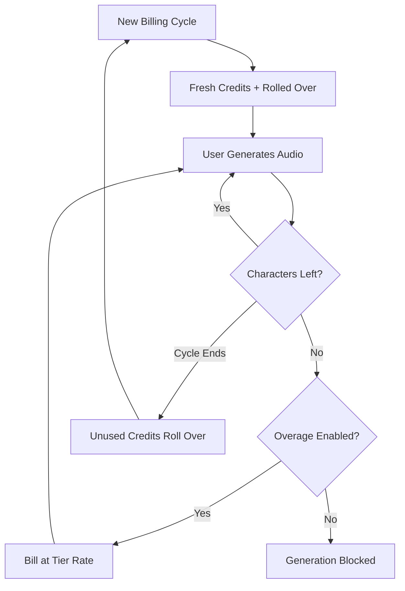

لقد بنت ElevenLabs موقعًا مهيمنًا في مجال الصوت المدعوم بالذكاء الاصطناعي من خلال جعل نظام الفوترة مرنًا بقدر مرونة توليد الكلام. يركز نموذجهم على وحدة قيمة واحدة: الحرف. سواء كنت تولّد نصًا إلى كلام أو تستنسخ صوتًا أو تزامن فيديو، فإنك تستهلك من رصيد موحد من أرصدة الأحرف.

## كيف تقوم ElevenLabs بالفوترة

تستخدم بنية التسعير في ElevenLabs حصصًا شهرية ثابتة مرتبطة بفئات الاشتراك. عندما ينتقل المستخدمون إلى فئات أعلى، يحصلون على أحرف أكثر ووصولًا إلى ميزات متقدمة مثل استنساخ صوت احترافي أو حقوق تجارية.

| الخطة | السعر | الأحرف/الشهر | سعر الاستخدام الزائد |
| :--- | :--- | :--- | :--- |
| Free | \$0 | 10,000 | Not available |
| Starter | \$5/month | 30,000 | ~\$0.30/1K chars |
| Creator | \$22/month | 100,000 | ~\$0.24/1K chars |
| Pro | \$99/month | 500,000 | ~\$0.15/1K chars |
| Scale | \$330/month | 2,000,000 | ~\$0.10/1K chars |

1. **التسعير القائم على الأحرف**: تمثل الأحرف العملة الموحدة عبر المنصة. يجمع كل من تحويل النص إلى كلام، والتزامن، واستنساخ الصوت من ذات الرصيد، مما يبسط تتبع الاستخدام.
2. **آليات التراكم**: تنتقل الأحرف غير المستخدمة إلى دورة الفوترة التالية بدلًا من أن تنتهي صلاحيتها. تطبق ElevenLabs حدًا أقصى لمنع التراكم اللانهائي، لضمان احتفاظ المستخدمين بقيمة اشتراكاتهم.
3. **تدرج الاستخدام الزائد**: تُدار الأرصدة الزائدة حسب فئة الاشتراك. يتم تعطيل الاستخدام الزائد في الخطط الأدنى افتراضيًا كأمان، بينما تسمح الفئات العليا بتفعيل رسوم للحفاظ على استمرار الخدمة.

## ما الذي يجعله فريدًا

تجعل عدة اختيارات استراتيجية نموذج فوترة ElevenLabs فعالًا للغاية في احتفاظ المستخدمين وتشجيعهم على الترقية.

- **ترحيل الأحرف**: يقلل ترحيل الأرصدة من القلق المتعلق بـ "استخدمها أو اخسرها" من خلال نقل الاستثمار غير المستخدم إلى الأمام. هذا يحافظ على قيمة الاشتراك حتى خلال فترات النشاط المحدود.
- **تدرج أسعار الاستخدام الزائد**: تنخفض أسعار الاستخدام الزائد مع زيادة حجم الخطة، مما يخلق حافزًا قويًا للترقية. كثيرًا ما يجد المستخدمون الفئات الأعلى أكثر جاذبية بسبب انخفاض تكلفة الاستخدام الإضافي.
- **الاستهلاك الموحد**: يزيل وجود رصيد أحرف واحد لكل الخدمات العبء المعرفي المتمثل في إدارة حصص منفصلة. يحتاج المستخدمون فقط إلى تتبع رقم واحد لفهم السعة المتبقية.
- **الاستخدام الزائد القابل للتفعيل**: يمكن للمحترفين تفعيل الاستخدام الزائد لاستمرارية الخدمة، بينما يستفيد المستخدمون العرضيون من أمان الحد الصارم.



## أنشئ هذا مع Dodo Payments

يمكنك إعادة إنشاء هذا النموذج المتطور باستخدام فوترة Dodo Payments القائمة على الرصيد وقياس الاستخدام.

<Steps>
<Step title="Create a Custom Unit Credit Entitlement">
أولًا، عرّف وحدة "Characters" التي ستعمل كعملة منصة خاصة بك.

1. اذهب إلى **Entitlements** في لوحة التحكم الخاصة بـ Dodo.
2. أنشئ **Credit Entitlement** جديدًا.
3. اضبط **Credit Type** على **Custom Unit**.
4. سمّ الوحدة "Characters".
5. اضبط **Precision** على 0، لأن الأحرف دائمًا وحدات كاملة.
6. اضبط **Credit Expiry** على 30 يومًا ليتوافق مع دورة الفوترة الشهرية.
7. فعّل **Rollover** مع هذه الإعدادات:
    - **Max Rollover Percentage**: 100٪ (يسمح بنقل كل الأحرف غير المستخدمة).
    - **Rollover Timeframe**: شهر واحد.
    - **Max Rollover Count**: 1 (يمكن ترحيل الأرصدة مرة واحدة ثم تنتهي صلاحيتها).
</Step>

<Step title="Create Tiered Subscription Products">
أنشئ خمسة منتجات للاشتراك. ستقوم بإرفاق نفس امتياز "Characters" بكل منها، لكن مع إعدادات مختلفة لكل فئة.

| المنتج | السعر | الأرصدة/الدورة | تمكين الاستخدام الزائد | سعر الاستخدام الزائد (لكل 1K حرف) |
| :--- | :--- | :--- | :--- | :--- |
| Free | \$0/mo | 10,000 | No | - |
| Starter | \$5/mo | 30,000 | Yes (opt-in) | \$0.30 |
| Creator | \$22/mo | 100,000 | Yes | \$0.24 |
| Pro | \$99/mo | 500,000 | Yes | \$0.15 |
| Scale | \$330/mo | 2,000,000 | Yes | \$0.10 |

عندما ترتبط امتيازات الأرصدة بكل منتج، ألغِ تحديد **Import Default Credit Settings**. هذا يسمح لك بتحديد **Price Per Unit** المخصص للاستخدام الزائد على تلك الفئة. اضبط **Overage Behavior** على **Bill overage at billing** وعيّن **Low Balance Threshold** عند 10٪ من حصة الفئة.

<Step title="Create a Usage Meter">
يربط عداد الاستخدام نشاط تطبيقك بنظام الأرصدة.

1. أنشئ عدادًا جديدًا باسم `tts.characters`.
2. اضبط **Aggregation** على **Sum**. سيجمع هذا خاصية `characters` من كل حدث ترسله.
3. اربط هذا العداد بامتياز الأرصدة "Characters".
4. اضبط **Meter units per credit** على 1. هذا يضمن أن كل حرف يُستهلك في تطبيقك يساوي رصيدًا واحدًا يُخصم من الرصيد.
</Step>

<Step title="Send Usage Events">
ادمج تتبع الاستخدام في كود تطبيقك. في كل مرة ينتج فيها المستخدم صوتًا، أرسل حدثًا إلى Dodo.

```typescript
import DodoPayments from 'dodopayments';

async function trackGeneration(
  customerId: string,
  text: string, 
  service: 'tts' | 'dubbing' | 'cloning'
) {
  const characterCount = text.length;

  const client = new DodoPayments({
    bearerToken: process.env.DODO_PAYMENTS_API_KEY,
  });

  await client.usageEvents.ingest({
    events: [{
      event_id: `gen_${Date.now()}_${Math.random().toString(36).slice(2)}`,
      customer_id: customerId,
      event_name: 'tts.characters',
      timestamp: new Date().toISOString(),
      metadata: {
        characters: characterCount,
        service: service,
        voice_id: 'voice_abc123'
      }
    }]
  });
}
```

</Step>

<Step title="Handle Low Balance and Overage">
استخدم الويب هوك لإبقاء المستخدمين مطّلعين على استخدامهم للأحرف.

```typescript
import DodoPayments from 'dodopayments';
import express from 'express';

const app = express();
app.use(express.raw({ type: 'application/json' }));

const client = new DodoPayments({
  bearerToken: process.env.DODO_PAYMENTS_API_KEY,
  webhookKey: process.env.DODO_PAYMENTS_WEBHOOK_KEY,
});

app.post('/webhooks/dodo', async (req, res) => {
  try {
    const event = client.webhooks.unwrap(req.body.toString(), {
      headers: {
        'webhook-id': req.headers['webhook-id'] as string,
        'webhook-signature': req.headers['webhook-signature'] as string,
        'webhook-timestamp': req.headers['webhook-timestamp'] as string,
      },
    });

    switch (event.type) {
      case 'credit.balance_low':
        await notifyUser(event.data.customer_id, 
          'You are running low on characters. Consider upgrading your plan for more characters and lower overage rates.'
        );
        break;
      case 'credit.deducted':
        await logUsage(event.data);
        break;
      case 'credit.overage_charged':
        await notifyUser(event.data.customer_id,
          'You have exceeded your character quota. Overage charges will appear on your next invoice.'
        );
        break;
    }

    res.json({ received: true });
  } catch (error) {
    res.status(401).json({ error: 'Invalid signature' });
  }
});
```

</Step>

<Step title="Create Checkout">
عندما يكون المستخدم جاهزًا للاشتراك، أنشئ جلسة دفع للفئة المختارة.

```typescript
const session = await client.checkoutSessions.create({
  product_cart: [
    { product_id: 'prod_elevenlabs_pro', quantity: 1 }
  ],
  customer: { email: 'creator@example.com' },
  return_url: 'https://yourapp.com/dashboard'
});
```

</Step>
</Steps>

## سرّع باستخدام مخطط إدخال البث

لتتبع إخراج الصوت جنبًا إلى جنب مع الفوترة القائمة على الأحرف، يوفر [Stream Ingestion Blueprint](/developer-resources/ingestion-blueprints/stream) طريقة مبسطة لقياس استهلاك النطاق الترددي.

```bash
npm install @dodopayments/ingestion-blueprints
```

```typescript
import { Ingestion, trackStreamBytes } from '@dodopayments/ingestion-blueprints';

const ingestion = new Ingestion({
  apiKey: process.env.DODO_PAYMENTS_API_KEY,
  environment: 'live_mode',
  eventName: 'tts.audio_bytes',
});

// After generating audio, track the output size
const audioBuffer = await generateSpeech(text, voiceId);

await trackStreamBytes(ingestion, {
  customerId: customerId,
  bytes: audioBuffer.byteLength,
  metadata: {
    voice_id: voiceId,
    service: 'tts',
    format: 'mp3',
  },
});
```

استخدم مخطط البث لتتبع عرض النطاق الصوتي إلى جانب نظام أرصدة الأحرف. يمنحك ذلك رؤية لتكاليف البنية التحتية الفعلية لكل توليد.

<Tip>
يدعم مخطط البث أيضًا التجميع للسيناريوهات عالية الحجم. راجع [full blueprint documentation](/developer-resources/ingestion-blueprints/stream) للاطلاع على أنماط الاستخدام المتقدمة.
</Tip>

## حافز الترقية: تسعير الاستخدام الزائد المتدرج

أروع جزء في نموذج ElevenLabs هو كيف يستخدم معدلات الاستخدام الزائد لدفع الترقية. بجعل تكلفة الحرف أقل في الفئات العليا، يحولون الحديث من "كم أحتاج؟" إلى "كم يمكنني توفيره؟".

| الفئة | الأحرف المضمنة | الاستخدام الزائد (لكل 1K) | التكلفة الفعلية عند 500K حرف |
| :--- | :--- | :--- | :--- |
| Creator | 100,000 | \$0.24 | \$22 + (400 * \$0.24) = \$118 |
| Pro | 500,000 | \$0.15 | \$99 (No overage) |

يدفع المستخدم الذي يستهلك بانتظام 500,000 حرف في خطة Creator مبلغ \$118 شهريًا في الاشتراك بالإضافة إلى الاستخدام الزائد. الترقية إلى خطة Pro تغطي نفس الاستخدام مقابل \$99، ما يوفر \$19 شهريًا. يعني انخفاض معدل الاستخدام الزائد في الفئات الأعلى أن الترقية تصبح القرار المالي الواضح مع زيادة الاستخدام.

مع Dodo Payments، تنفّذ ذلك من خلال إلغاء تحديد مربع **Import Default Credit Settings** عند إرفاق الأرصدة بمنتجات الاشتراك الخاصة بك. يمنحك ذلك التحكم الكامل في **Price Per Unit** لكل فئة محددة، مما يتيح لك مكافأة عملائك الأعلى دفعة بأفضل الأسعار.

## الميزات الرئيسية في Dodo المستخدمة

<CardGroup cols={2}>
  <Card title="Credit-Based Billing" icon="coins" href="/features/credit-based-billing">
    إدارة حصص الأحرف والترحيلات وانتهاء الصلاحيات.
  </Card>
  <Card title="Subscriptions" icon="calendar" href="/features/subscription">
    إعداد الطبقات الدورية التي توفر حصصًا شهرية من الأحرف.
  </Card>
  <Card title="Usage-Based Billing" icon="chart-line" href="/features/usage-based-billing/introduction">
    تتبع استهلاك الأحرف في الوقت الفعلي عبر خدماتك.
  </Card>
  <Card title="Event Ingestion" icon="bolt" href="/features/usage-based-billing/event-ingestion">
    إرسال بيانات الاستخدام عالية الحجم إلى Dodo بأقل تأخير ممكن.
  </Card>
  <Card title="Webhooks" icon="webhook" href="/developer-resources/webhooks/intents/credit">
    التفاعل مع الأرصدة المنخفضة وفعاليات الاستخدام الزائد في الوقت الفعلي.
  </Card>
  <Card title="Stream Ingestion Blueprint" icon="tower-broadcast" href="/developer-resources/ingestion-blueprints/stream">
    تتبع عرض النطاق الترددي لبث الصوت للفوترة القائمة على الاستخدام.
  </Card>
</CardGroup>
