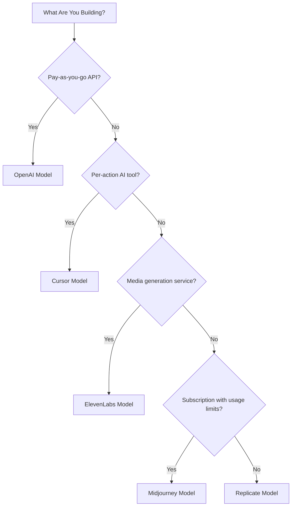

## النماذج الخمسة

| التطبيق | المقياس الأساسي | الابتكار الفريد | ميزة دودو |
| :--- | :--- | :--- | :--- |
| OpenAI | الرموز (مُقومة بالعملة الصعبة) | اعتمادات مسبقة الدفع بالعملة الصعبة مع رصيد لا ينتهي أبداً | Credit-Based Billing (Fiat Credits) |
| Cursor | طلبات مميزة | استنفاد الاعتمادات بحسب أوزان النماذج (تكاليف مختلفة حسب النموذج) | Credit-Based Billing (Custom Unit) |
| ElevenLabs | الأحرف | حصص أحرف مع ترحيل الرصيد وتسعير تصاعدي للتجاوزات | Credit-Based Billing (Rollover + Overage) |
| Midjourney | زمن وحدة معالجة الرسوميات | وضع الاسترخاء كخيار احتياطي غير محدود بعد انتهاء الحصة | Subscription + Usage Meters |
| Replicate | ثواني التنفيذ | قياس نقي خاص بالأجهزة لكل ثانية | Pure Usage-Based Billing |

## فهم أنماط الاعتمادات

| النمط | المثال | ميزة دودو | نوع الوحدة |
| :--- | :--- | :--- | :--- |
| اعتمادات مسبقة الدفع مُقومة بالعملة الصعبة | واجهة برمجة تطبيقات OpenAI (إضافة رصيد بقيمة 5 دولارات، بدون سحب) | Credit-Based Billing (Fiat Credits) | وحدات افتراضية مقومة بالدولار |
| اعتمادات استخدام افتراضية | طلبات Cursor المميزة، وأحرف ElevenLabs | Credit-Based Billing (Custom Unit) | وحدات تعسفية (طلبات، أحرف) |
| القياس النقي للاستهلاك | فوترة Replicate لكل ثانية | Usage-Based Billing (Meters) | قياس مباشر (ثوانٍ، بايتات) |
| اشتراك + تجاوز مقاس | ساعات Midjourney السريعة مع خيار الاسترخاء | Subscription + Usage Meters | قائم على الوقت مع حد مجاني |

<Info>
تمثل اعتمادات العملة الصعبة في فوترة دودو المعتمدة على الاعتمادات قيمًا بالدولار مُقومة على المنصة ولا تمتلك قيمة نقدية خارج نظامك البيئي. لا يمكن للعملاء سحبها نقدًا.
</Info>

## أي نموذج يجب أن تستخدم؟

- بناء منصة API بالدفع حسب الاستخدام: نموذج OpenAI (Fiat Credits)
- بناء أداة ذكاء اصطناعي بتسعير لكل إجراء: نموذج Cursor (Custom Unit Credits)
- بناء خدمة توليد وسائط: نموذج ElevenLabs (Rollover Credits)
- بناء خدمة اشتراك بحدود استخدام: نموذج Midjourney (Subscription + Usage Meters)
- بناء منصة بنية تحتية/حاسبة: نموذج Replicate (Pure Metering)

<CardGroup cols={2}>
  <Card title="OpenAI" icon="/images/logos/openai.svg" href="/developer-resources/billing-deconstructions/openai">
    كرر نموذج الاعتمادات المسبقة الدفع المعتمد على الرموز.
  </Card>
  <Card title="Cursor" icon="/images/logos/cursor.svg" href="/developer-resources/billing-deconstructions/cursor">
    أنشئ حدود استخدام مترتبة على أوزان النماذج.
  </Card>
  <Card title="ElevenLabs" icon="/images/logos/elevenlabs.svg" href="/developer-resources/billing-deconstructions/elevenlabs">
    طبق حصصًا للأحرف مع ترحيل الرصيد والتكاليف الزائدة.
  </Card>
  <Card title="Midjourney" icon="/images/logos/midjourney.svg" href="/developer-resources/billing-deconstructions/midjourney">
    ادمج الاشتراكات مع خيار بديل قائم على الاستخدام.
  </Card>
  <Card title="Replicate" icon="/images/logos/replicate.svg" href="/developer-resources/billing-deconstructions/replicate">
    قم بإعداد قياس نقي للاستهلاك لكل ثانية.
  </Card>
</CardGroup>

## ميزات دودو

<CardGroup cols={2}>
  <Card title="Credit-Based Billing" href="/features/credit-based-billing">
    أدر الاعتمادات المسبقة الدفع والوحدات الافتراضية.
  </Card>
  <Card title="Usage-Based Billing" href="/features/usage-based-billing/introduction">
    قِس الاستهلاك في الوقت الفعلي.
  </Card>
  <Card title="Subscriptions" href="/features/subscription">
    تولّ الفوترة المتكررة وإدارة الخطط.
  </Card>
  <Card title="Hybrid Billing" href="/features/hybrid-billing">
    ادمج نماذج فوترة متعددة لتحقيق أقصى درجة من المرونة.
  </Card>
</CardGroup>

## مخططات الاستيعاب

يتضمن كل تحليل تكاملًا مع [مخططات الاستيعاب](/features/usage-based-billing/ingestion-blueprints) من دودو، وهي SDKs جاهزة تتولى تتبع الأحداث تلقائيًا. بدلًا من بناء أحداث الاستخدام يدويًا، استخدم مخططًا للحصول على قياس جاهز للإنتاج خلال دقائق.

<CardGroup cols={3}>
  <Card title="LLM Blueprint" icon="brain-circuit" href="/developer-resources/ingestion-blueprints/llm">
    تتبع تلقائي للرموز لـ OpenAI وAnthropic وGroq والمزيد.
  </Card>
  <Card title="Stream Blueprint" icon="tower-broadcast" href="/developer-resources/ingestion-blueprints/stream">
    تتبع عرض النطاق الترددي لبث الصوت والفيديو.
  </Card>
  <Card title="Time Range Blueprint" icon="clock" href="/developer-resources/ingestion-blueprints/time-range">
    فوترة حسب مدة الحوسبة حتى الجزئية من الثانية.
  </Card>
</CardGroup>
