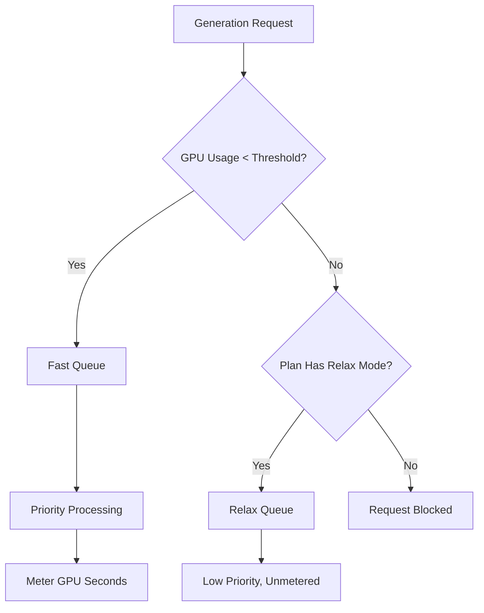

تُعد Midjourney منصةً للذكاء الاصطناعي التوليدي تستخدم نموذج فوترة فريدًا يعتمد على وقت GPU بدلًا من عدد الصور. يضمن هذا النهج أن العمليات المعقدة عالية الدقة تكلف أكثر من المسودات السريعة منخفضة الدقة.

## كيف تقوم Midjourney بالفوترة

تمنح خطط اشتراك Midjourney المستخدمين عددًا محددًا من «ساعات GPU السريعة» كل شهر. تمثل هذه الساعات الوقت الحسابي الفعلي الذي يُستغرق في عمليات الإنشاء.

| الخطة | السعر | ساعات GPU السريعة | وضع الاسترخاء | وضع التخفي |
| :--- | :--- | :--- | :--- | :--- |
| Basic | \$10/month | ~3.3 hrs | No | No |
| Standard | \$30/month | 15 hrs | Unlimited | No |
| Pro | \$60/month | 30 hrs | Unlimited | Yes |
| Mega | \$120/month | 60 hrs | Unlimited | Yes |

1. **مستويات التسعير**: تقدم Midjourney أربعة مستويات اشتراك تتراوح من 10 دولارات إلى 120 دولارًا شهريًا، مع توفير عدد محدد من ساعات GPU السريعة لكل مستوى.
2. **وضع الاسترخاء**: تتضمن الخطط من المستوى Standard فما فوق توليدًا غير محدود عبر قائمة انتظار منخفضة الأولوية بعد نفاد الساعات السريعة، ما يضمن عدم وصول المستخدمين إلى حائط استخدام صلب.
3. **ساعات GPU إضافية**: يمكن للمستخدمين شراء وقت GPU سريع إضافي بحوالي 4 دولارات للساعة إذا احتاجوا إلى نتائج فورية بعد نفاد الحصة الشهرية.
4. **القياس بالثواني**: يتم تتبع الاستخدام بناءً على الوقت الحسابي الفعلي المستغرق في عمليات الإنشاء، ما يعني أن العمليات المعقدة تكلف أكثر من المسودات البسيطة.
5. **حلقة المجتمع**: يمكن للمستخدمين النشطين كسب ساعات GPU إضافية من خلال تقييم الصور في المعرض، ما يساعد في تدريب النماذج مع مكافأة المجتمع.
## ما الذي يجعله مميزًا

يُعد نموذج Midjourney فعالًا لأنه يوازن بين التكلفة والقيمة واستخدام الموارد.

* **الفوترة حسب وقت GPU** لمواءمة التكلفة مع استخدام الموارد، ما يضمن أن العمليات المعقدة تُسعَّر بعدالة مقارنةً بالمسودات البسيطة.
* **وضع الاسترخاء** يوفر خيارًا احتياطيًا غير محدود يُقلل من التسرب من خلال الحفاظ على الوصول إلى الخدمة حتى بعد تجاوز الحدود الشهرية.
* **الانقسام بين Fast و Relax** يحفز الترقية من خلال تقديم معالجة أولوية للمستخدمين الذين يقدّرون السرعة والنتائج الفورية.
* **ساعات GPU الإضافية** توفر خيارًا مرنًا لإعادة الشحن للمستخدمين القوى الذين يحتاجون إلى سعة أولوية إضافية في منتصف الشهر.

## بناء هذا باستخدام Dodo Payments

يمكنك تكرار هذا النموذج باستخدام Dodo Payments من خلال الجمع بين الاشتراكات وأدوات قياس الاستخدام والمنطق التطبيقي.

<Steps>

<Step title="Create a Usage Meter">

أولًا، أنشئ عدادًا لتتبع ثواني GPU المستخدمة من قِبل كل عميل.

* **اسم العداد**: `gpu.fast_seconds`
* **التجميع**: **Sum** (sum the `gpu_seconds` property from each event)

سوف تتتبع فقط الأحداث التي يكون فيها وضع التوليد "سريعًا". إن توليدات وضع الاسترخاء غير مُقاسة لأغراض الفوترة.

</Step>

<Step title="Create Subscription Products with Usage Pricing">

أنشئ منتجات الاشتراك وأرفق عداد الاستخدام مع حد مجاني.

| المنتج | السعر الأساسي | الحد المجاني (بالثواني) | معدل التجاوز |
| :--- | :--- | :--- | :--- |
| Basic | \$10/month | 12,000 (3.3 hrs) | N/A (Hard Cap) |
| Standard | \$30/month | 54,000 (15 hrs) | \$0.00 (Relax Mode) |
| Pro | \$60/month | 108,000 (30 hrs) | \$0.00 (Relax Mode) |
| Mega | \$120/month | 216,000 (60 hrs) | \$0.00 (Relax Mode) |

بالنسبة لخطة Basic، ستقوم بتعطيل التجاوز لفرض حد صارم. أما بالنسبة للخطط الأخرى، فيتم التعامل مع "وضع الاسترخاء" من خلال منطق التطبيق الخاص بك عندما يُظهر العداد أن الحد قد تم تجاوزه.

</Step>

<Step title="Implement Application-Level Relax Mode">

الرؤية الأساسية هي أن وضع الاسترخاء ليس ميزة فوترة، بل هو توجيه التطبيق للطلبات إلى قائمة انتظار أبطأ عندما يُظهر عداد Dodo للاستخدام أن الحد قد تم بلوغه.

```typescript
async function handleGenerationRequest(customerId: string, prompt: string) {
  const usage = await getCustomerUsage(customerId, 'gpu.fast_seconds');
  const subscription = await getSubscription(customerId);
  const threshold = getThresholdForPlan(subscription.product_id);
  
  if (usage.current >= threshold) {
    if (subscription.product_id === 'prod_basic') {
      throw new Error('Fast GPU hours exhausted. Upgrade to Standard for Relax Mode.');
    }
    
    // Relax Mode. Route to low-priority queue
    return await queueGeneration(customerId, prompt, {
      priority: 'low',
      mode: 'relax',
      model: 'standard'
    });
  }
  
  // Fast Mode. Priority processing
  return await queueGeneration(customerId, prompt, {
    priority: 'high',
    mode: 'fast',
    model: 'premium'
  });
}
```

</Step>

<Step title="Send Usage Events (Fast Mode Only)">

أرسل أحداث الاستخدام إلى Dodo فقط عند إجراء توليد في الوضع السريع.

```typescript
import DodoPayments from 'dodopayments';

async function trackFastGeneration(customerId: string, gpuSeconds: number, jobId: string) {
  // Only track Fast mode generations. Relax mode is free and unlimited
  const client = new DodoPayments({
    bearerToken: process.env.DODO_PAYMENTS_API_KEY,
  });

  await client.usageEvents.ingest({
    events: [{
      event_id: `gen_${jobId}`,
      customer_id: customerId,
      event_name: 'gpu.fast_seconds',
      timestamp: new Date().toISOString(),
      metadata: {
        gpu_seconds: gpuSeconds,
        resolution: '1024x1024',
        mode: 'fast'
      }
    }]
  });
}
```

</Step>

<Step title="Sell Extra Fast Hours (One-Time Top-Up)">

أنشئ منتج دفع مرة واحدة باسم "ساعة GPU سريعة إضافية" بسعر 4 دولارات. عندما يشتري العميل هذا، يمكنك منح حد إضافي أو أرصدة في تطبيقك.

```typescript
// After customer purchases extra hours
const session = await client.checkoutSessions.create({
  product_cart: [
    { product_id: 'prod_extra_gpu_hour', quantity: 5 }
  ],
  customer: { customer_id: customerId },
  return_url: 'https://yourapp.com/dashboard'
});
```

</Step>

<Step title="Create Checkout for Subscription">

أخيرًا، أنشئ جلسة تحقق للشتراك.

```typescript
const session = await client.checkoutSessions.create({
  product_cart: [
    { product_id: 'prod_mj_standard', quantity: 1 }
  ],
  customer: { email: 'artist@example.com' },
  return_url: 'https://yourapp.com/studio'
});
```

</Step>

</Steps>

## تسريع الأمور باستخدام مخطط استيعاب نطاق الوقت

يبسط [مخطط استيعاب نطاق الوقت](/developer-resources/ingestion-blueprints/time-range) تتبع وقت GPU من خلال توفير مساعدات مخصصة للفوترة القائمة على المدة.

```bash
npm install @dodopayments/ingestion-blueprints
```

```typescript
import { Ingestion, trackTimeRange } from '@dodopayments/ingestion-blueprints';

const ingestion = new Ingestion({
  apiKey: process.env.DODO_PAYMENTS_API_KEY,
  environment: 'live_mode',
  eventName: 'gpu.fast_seconds',
});

// Track generation time after a Fast mode job completes
const startTime = Date.now();
const result = await runGeneration(prompt, settings);
const durationMs = Date.now() - startTime;

await trackTimeRange(ingestion, {
  customerId: customerId,
  durationMs: durationMs,
  metadata: {
    mode: 'fast',
    resolution: '1024x1024',
  },
});
```

يتولى المخطط تحويل المدة وتنسيق الأحداث. كل ما عليك هو تزويد معرف العميل والوقت المستغرق.

<Tip>
يدعم مخطط نطاق الوقت الميلي ثانية والثانية والدقيقة. راجع [التوثيق الكامل للمخطط](/developer-resources/ingestion-blueprints/time-range) للاطلاع على جميع خيارات المدة وأفضل الممارسات.
</Tip>

## بنية Fast مقابل Relax

يعمل نظام قائمة الانتظار المزدوجة عن طريق توجيه الطلبات بناءً على حالة الاستخدام الحالية.



1. تمرُّ جميع الطلبات عبر التطبيق الخاص بك.
2. يتحقق التطبيق من عداد استخدام Dodo مقابل الحد المجاني للخطة.
3. إذا كان الاستخدام أقل من الحد، يُرسل الطلب إلى قائمة Fast ويتم قياسه.
4. إذا كان الاستخدام فوق الحد، يُرسل الطلب إلى قائمة Relax، وهي غير مُقاسة ذات أولوية أقل.
5. لا تحتوي خطة Basic على بديل في وضع الاسترخاء، لذا يتم حظر الطلبات بمجرد الوصول إلى الحد.

<Info>
يعد وضع الاسترخاء نمطًا على مستوى التطبيق، وليس ميزة فوترة في Dodo. تتتبع Dodo استخدام GPU السريع وتخبرك عند تجاوز الحد. يقرر تطبيقك ما إذا كان يمنع المستخدم أو يوجهه إلى قائمة انتظار أبطأ.
</Info>

## الميزات الرئيسية في Dodo المستخدمة

<CardGroup cols={2}>
  <Card title="Subscriptions" icon="calendar" href="/features/subscription">
    إدارة الفوترة المتكررة ومستويات الخطط.
  </Card>
  <Card title="Usage-Based Billing" icon="bolt" href="/features/usage-based-billing/introduction">
    تتبع الفوترة استنادًا إلى استهلاك الموارد الفعلي.
  </Card>
  <Card title="Event Ingestion" icon="input-pipe" href="/features/usage-based-billing/event-ingestion">
    إرسال أحداث الاستخدام ذات الحجم الكبير إلى واجهة Dodo API.
  </Card>
  <Card title="Meters" icon="gauge" href="/features/usage-based-billing/meters">
    تحديد كيفية تجميع أحداث الاستخدام والفوترة عليها.
  </Card>
  <Card title="One-Time Payments" icon="credit-card" href="/features/one-time-payment-products">
    بيع الساعات الإضافية أو تعبئة الرصيد كمشتريات لمرة واحدة.
  </Card>
  <Card title="Time Range Blueprint" icon="clock" href="/developer-resources/ingestion-blueprints/time-range">
    تتبع وقت GPU المبسط بمساعدات تعتمد على المدة.
  </Card>
</CardGroup>
