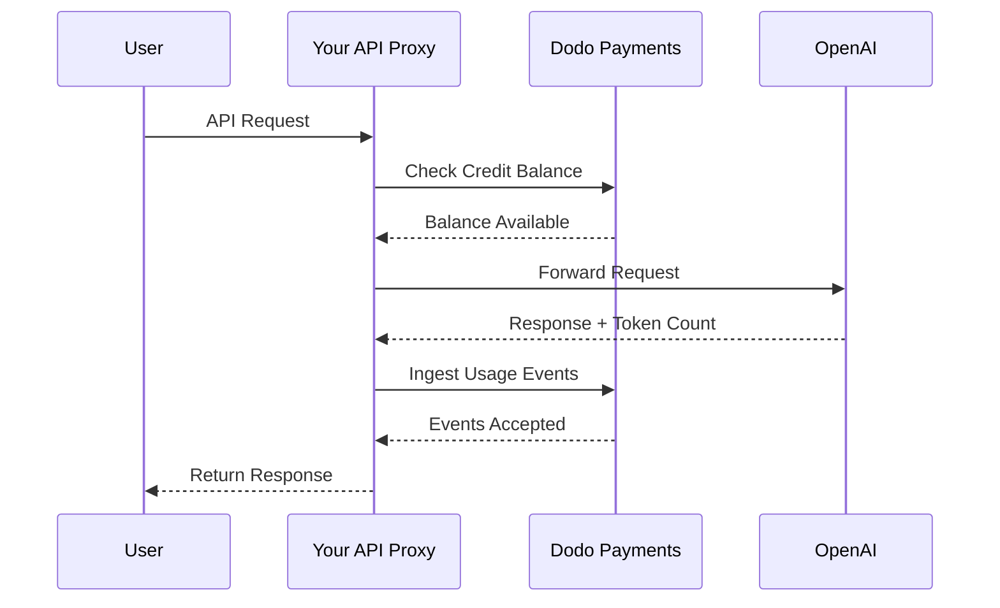
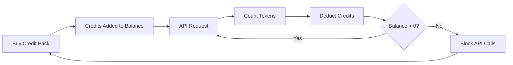

نموذج فوترة OpenAI هو المعيار الذهبي لشركات الذكاء الاصطناعي. يجمع بين أرصدة مسبقة الدفع بالعملة النقدية لاستخدام واجهات برمجة التطبيقات واشتراكات ذات سعر ثابت للمنتجات الموجهة للمستهلكين. يضمن هذا النهج الهجين إيرادات متوقعة مع السماح للمطورين بتوسيع استخدامهم دون احتكاك.

## لماذا يعد نموذج OpenAI هو المعيار

تواجه صناعة الذكاء الاصطناعي تحديات فريدة لا تُغطيها نماذج فوترة SaaS التقليدية دائمًا. يحل نموذج OpenAI عدة من هذه المشكلات في آنٍ واحد.

1. **إيرادات متوقعة ومخاطر منخفضة**: من خلال اشتراط الأرصدة مسبقة الدفع لاستخدام واجهات برمجة التطبيقات، تزيل OpenAI مخاطر تراكم فواتير ضخمة لا يستطيع المستخدمون دفعها. تحصل على المال مقدمًا، ويحصل المستخدم على الخدمة أثناء استخدامه لها.
2. **قابلية التوسع للمطورين**: شحن بقيمة \$5 هو حاجز دخول منخفض. ومع نمو تطبيقاتهم، يمكن للمطورين أتمتة عمليات الشحن أو شراء مجموعات أكبر. الاحتكاك للبدء يكاد يكون معدومًا، لكن سقف النمو لا محدود.
3. **سيكولوجية المستخدم**: تداول الأرصدة بعملة نقدية (دولار أمريكي) بدلًا من "الرموز" أو "النقاط" المجردة يجعل القيمة واضحة. يبدو الأمر كأنها حساب مصرفي لخدمات الذكاء الاصطناعي، مما يبني الثقة ويُسهل وضع الميزانية للشركات.

## كيف تقوم OpenAI بالفوترة

تدير OpenAI نموذجين فريدين للفوترة يلبيان احتياجات مستخدمين مختلفين.

1. **واجهة برمجة التطبيقات (الدفع عند الاستخدام)**: تستخدم الواجهة أرصدة مسبقة الدفع مقومة بالعملة النقدية. يُعيد المستخدم شحن حسابه بمبالغ \$5 أو \$10 أو \$50 أو أكثر. تظهر هذه الأرصدة بقيمة الدولار لكنها لا تمتلك قيمة نقدية خارج OpenAI. تقوم OpenAI بالفوترة بناءً على كل رمز، بأسعار مختلفة لرموز الإدخال والإخراج. لا تنتهي صلاحية الأرصدة أبدًا، وعندما يصل رصيد المستخدم إلى \$0، تتوقف مكالمات واجهة برمجة التطبيقات فورًا.
2. **ChatGPT Plus وTeam وEnterprise**: هذه خطط اشتراك بسعر ثابت. تبلغ تكلفة ChatGPT Plus \$20 شهريًا، بينما خطة الفريق \$25 لكل مستخدم شهريًا. تحتوي هذه الخطط على حدود استخدام ناعمة حيث يتم تخفيض المستخدمين إلى نموذج أصغر بدلًا من الحظر.
3. **طبقات الأسعار المعتمدة على الإنفاق**: كلما أنفقت المزيد من المال إجماليًا على مر الزمن، تفتح حدود معدلات أعلى لواجهة برمجة التطبيقات. هذا نظام توسيع وصول يعتمد على الثقة ويرتبط مباشرةً بتاريخ فواتيرك.

| النموذج | التسعير | رموز الإدخال | رموز الإخراج |
| :--- | :--- | :--- | :--- |
| GPT-4o | حسب الاستخدام | \$2.50 / 1M | \$10.00 / 1M |
| GPT-4o-mini | حسب الاستخدام | \$0.15 / 1M | \$0.60 / 1M |
| o1 | حسب الاستخدام | \$15.00 / 1M | \$60.00 / 1M |

| الخطة | السعر | النوع |
| :--- | :--- | :--- |
| مجاني | \$0 | وصول محدود |
| Plus | \$20 / شهريًا | اشتراك مع حدود ناعمة |
| Team | \$25 / مستخدم / شهريًا | اشتراك لكل مقعد |
| Enterprise | مخصص | فوترة بالفاتورة |
## ما الذي يجعله فريدًا

تتمتع استراتيجية فوترة OpenAI بعدة خصائص رئيسة تجعلها فعالة لخدمات الذكاء الاصطناعي.

- **الأرصدة المُقيمة بالعملة النقدية**: تبدو الأرصدة وكأنها نقود لأنها مقيمة بالدولار الأمريكي. هذا يجعل التسعير شفافًا وسهل الفهم للمطورين.
- **عدم انتهاء الصلاحية**: تزيل الأرصدة التي لا تنتهي أبدًا ضغط "استخدمها أو خسرها". يشعر المستخدمون بالراحة عند شحن مبالغ أكبر لأنهم يعلمون أن القيمة لن تختفي.
- **القياس متعدد الأبعاد**: يتم تتبع رموز الإدخال والإخراج بشكل منفصل لكن يتم خصمها من نفس الرصيد. هذا يسمح لـ OpenAI بتسعير رموز الإخراج المكلفة بشكل مختلف عن رموز الإدخال الأرخص.
- **طبقات الثقة**: ربط حدود المعدل بالإجمالي الذي أنفقته يشجع المستخدمين على البقاء على المنصة ويكافئ العملاء طويل الأمد بأداء أفضل.

## المزايا الاستراتيجية

يخلق هذا النموذج حلقة نمو قوية. تكاليف الدخول المنخفضة تجذب المطورين. الأرصدة المسبقة توفر تدفقًا نقديًا فوريًا. يضمن التوسع القائم على الاستخدام أنه كلما نجح المطورون، نجحت OpenAI أيضًا. يوفر الجانب الخاص بالاشتراكات قاعدة إيرادات ثابتة ومتوقعة من غير المطورين.

## بناء هذا النموذج باستخدام Dodo Payments

يمكنك تكرار نموذج فوترة OpenAI باستخدام Dodo Payments. سنستخدم الفوترة القائمة على الأرصدة الائتمانية لواجهة برمجة التطبيقات والاشتراكات القياسية لجزء ChatGPT Plus.

<Steps>
  <Step title="Create a Fiat Credit Entitlement">
    ابدأ بإنشاء استحقاق رصيد في لوحة تحكم Dodo Payments الخاصة بك. سيكون هذا بمثابة الرصيد المركزي لمستخدميك.
    * **نوع الرصيد:** أرصدة بالعملة النقدية (USD)
    * **انتهاء صلاحية الرصيد:** لا ينتهي
    * **الترحيل:** غير مطلوب (لأنها لا تنتهي صلاحيتها)
    * **الزيادة:** معطلة
    تعطيل الزيادة يضمن أن مكالمات واجهة برمجة التطبيقات تفشل عند وصول الرصيد إلى \$0، تمامًا كما تفعل OpenAI.
  </Step>

  <Step title="Create Top-Up Products">
    أنشئ منتجات دفع لمرة واحدة لحزم الرصيد المختلفة. قد تعرض خيارات بقيمة \$5 و \$10 و \$50 و \$100. اربط استحقاق الرصيد النقدي بكل منتج.
    حدد الأرصدة المصدرة لكل منتج بالسنتات. لحزمة بقيمة \$50، ستصدر 5000 رصيد.
    ```typescript
    import DodoPayments from 'dodopayments';

    const client = new DodoPayments({
      bearerToken: process.env.DODO_PAYMENTS_API_KEY,
    });

    const session = await client.checkoutSessions.create({
      product_cart: [
        { product_id: 'prod_credit_pack_50', quantity: 1 }
      ],
      customer: { email: 'developer@example.com' },
      return_url: 'https://yourapp.com/dashboard'
    });
    ```

  </Step>

  <Step title="Create Usage Meters">
    أنشئ عدادين منفصلين لتتبع استخدام الرموز.
    * `llm.input_tokens`: تجميع مجموع على الخاصية `tokens`.
    * `llm.output_tokens`: تجميع مجموع على الخاصية `tokens`.
    اربط العدادين باستحقاق الرصيد النقدي الخاص بك. ستحتاج إلى تكوين "وحدات العداد لكل رصيد" لكل منهما.
    ### حساب وحدات العداد لكل رصيد
    لمطابقة تسعير GPT-4o الخاص بـ OpenAI (\$2.50 لكل 1M رمز إدخال)، تحتاج إلى حساب عدد الرموز التي تساوي \$1 (100 سنت).
    * **رموز الإدخال:** 1,000,000 رمز / \$2.50 = 400,000 رمز لكل \$1.
    * **رموز الإخراج:** 1,000,000 رمز / \$10.00 = 100,000 رمز لكل \$1.
    في لوحة Dodo، ستقوم بتعيين "وحدات العداد لكل رصيد" إلى 400,000 للإدخال و100,000 للإخراج.
  </Step>

  <Step title="Send Usage Events">
    بعد كل طلب لـ LLM، أرسل بيانات الاستخدام إلى Dodo Payments. يمكنك إرسال أحداث الإدخال والإخراج في طلب واحد.
    ```typescript
    await client.usageEvents.ingest({
      events: [{
        event_id: `req_${requestId}`,
        customer_id: customerId,
        event_name: 'llm.input_tokens',
        timestamp: new Date().toISOString(),
        metadata: {
          model: 'gpt-4o',
          tokens: 1500
        }
      }, {
        event_id: `req_${requestId}_out`,
        customer_id: customerId,
        event_name: 'llm.output_tokens',
        timestamp: new Date().toISOString(),
        metadata: {
          model: 'gpt-4o',
          tokens: 800
        }
      }]
    });
    ```

  </Step>

  <Step title="Handle Balance Depletion">
    يجب عليك التحقق من رصيد المستخدم قبل معالجة طلب واجهة برمجة التطبيقات. إذا كان الرصيد صفرًا أو سالبًا، أعد خطأ 402.
    ```typescript
    async function checkCreditsBeforeRequest(customerId: string) {
      const balance = await client.creditEntitlements.balances.retrieve(customerId, {
        credit_entitlement_id: 'credit_entitlement_id',
      });

      if (balance.available <= 0) {
        throw new Error('Insufficient credits. Please top up your account.');
      }
    }
    ```

    ### معالجة ويب هوك انخفاض الرصيد
    لا تنتظر حتى يصل المستخدم إلى \$0 لإبلاغه. استخدم ويب هوكس لبدء رسالة بريد إلكتروني أو إشعار داخل التطبيق عندما ينخفض رصيده تحت عتبة معينة.
    ```typescript
    import DodoPayments from 'dodopayments';
    import express from 'express';

    const app = express();
    app.use(express.raw({ type: 'application/json' }));

    const client = new DodoPayments({
      bearerToken: process.env.DODO_PAYMENTS_API_KEY,
      webhookKey: process.env.DODO_PAYMENTS_WEBHOOK_KEY,
    });

    app.post('/webhooks/dodo', async (req, res) => {
      try {
        const event = client.webhooks.unwrap(req.body.toString(), {
          headers: {
            'webhook-id': req.headers['webhook-id'] as string,
            'webhook-signature': req.headers['webhook-signature'] as string,
            'webhook-timestamp': req.headers['webhook-timestamp'] as string,
          },
        });

        if (event.type === 'credit.balance_low') {
          const { customer_id, available_balance } = event.data;
          await sendLowBalanceEmail(customer_id, available_balance);
        }

        res.json({ received: true });
      } catch (error) {
        res.status(401).json({ error: 'Invalid signature' });
      }
    });
    ```

    <Tip>
      ترسل OpenAI هذه الرسائل عندما يكون رصيد المستخدم على وشك النفاد، مما يمنحه وقتًا للشحن دون انقطاع في الخدمة.
    </Tip>
  </Step>

  <Step title="Build the ChatGPT Subscription Side (Optional)">
    إذا أردت تقديم خطة اشتراك مثل ChatGPT Plus، أنشئ منتج اشتراك منفصل في Dodo Payments. هذه لا تحتاج إلى استحقاقات رصيد.
    لخطة Team، استخدم فوترة تستند إلى المقاعد بإضافة ملحقات لكل مستخدم إضافي.
    ```typescript
    const session = await client.checkoutSessions.create({
      product_cart: [
        { product_id: 'prod_plus_subscription', quantity: 1 }
      ],
      customer: { email: 'user@example.com' },
      return_url: 'https://yourapp.com/billing'
    });
    ```

    ### تنفيذ الحدود الناعمة
    لتكرار الحدود الناعمة الخاصة بـ OpenAI، يمكنك تتبع استخدام مشتركيك باستخدام نفس العدادات ولكن بدون ربطها باستحقاق الرصيد. في منطق التطبيق، تحقق من الاستخدام للفترة المالية الحالية.
    ```typescript
    async function checkSubscriptionUsage(customerId: string) {
      const usage = await getUsageForCurrentPeriod(customerId);
      
      if (usage > SOFT_CAP_THRESHOLD) {
        // Route to a smaller model instead of blocking
        return 'gpt-4o-mini';
      }
      
      return 'gpt-4o';
    }
    ```

  </Step>
</Steps>

## سرّع باستخدام مخطط إدخال LLM

تُظهر الخطوات أعلاه كيفية بناء وإرسال أحداث الاستخدام يدويًا. بالنسبة لنشر الإنتاج، يوفر [LLM Ingestion Blueprint](/developer-resources/ingestion-blueprints/llm) تتبعًا تلقائيًا للرموز يلتف حول عميل OpenAI الخاص بك مباشرةً.

```bash
npm install @dodopayments/ingestion-blueprints
```

```typescript
import { createLLMTracker } from '@dodopayments/ingestion-blueprints';
import OpenAI from 'openai';

const openai = new OpenAI({ apiKey: process.env.OPENAI_API_KEY });

const tracker = createLLMTracker({
  apiKey: process.env.DODO_PAYMENTS_API_KEY,
  environment: 'live_mode',
  eventName: 'llm.chat_completion',
});

const trackedClient = tracker.wrap({
  client: openai,
  customerId: customerId,
});

// Every API call now automatically tracks token usage
const response = await trackedClient.chat.completions.create({
  model: 'gpt-4o',
  messages: [{ role: 'user', content: prompt }],
});

// inputTokens, outputTokens, and totalTokens are sent automatically
console.log('Tokens used:', response.usage);
```

يلتقط المخطط `inputTokens` و`outputTokens` و`totalTokens` من كل استجابة لواجهة برمجة التطبيقات ويرسلها كبيانات وصفية للحدث. قم بتكوين العداد الخاص بك لتجميع الخاصية المناسبة للرموز.

<Tip>
يدعم مخطط LLM OpenAI وAnthropic وGroq وGoogle Gemini وOpenRouter وVercel AI SDK. راجع [full blueprint documentation](/developer-resources/ingestion-blueprints/llm) لأمثلة خاصة بالمزودين وتكوينات متقدمة.
</Tip>

## تنفيذ طبقات الأسعار المعتمدة على الإنفاق

تشكل طبقات الأسعار لدى OpenAI وسيلة قوية لإدارة السعة. يمكنك تنفيذ ذلك من خلال تتبع إجمالي إنفاق العميل طوال الحياة.

1. **تتبع الإنفاق طوال الحياة:** استمع إلى ويب هوكس `payment.succeeded` وقم بتحديث حقل `total_spend` في قاعدة بياناتك لذلك العميل.
2. **تعريف الطبقات:** أنشئ خريطة تربط مبالغ الإنفاق بحدود المعدل.
   * الطبقة 1: إنفاق \$0 - \$50 -> 3 طلبات في الدقيقة
   * الطبقة 2: إنفاق \$50 - \$250 -> 10 طلبات في الدقيقة
   * الطبقة 3: إنفاق \$250+ -> 50 طلبًا في الدقيقة
3. **فرض الحدود:** في طبقة الوسيط لواجهة برمجة التطبيقات، تحقق من طبقة العميل وطبق حد المعدل المقابل.
```typescript
async function getRateLimitForCustomer(customerId: string) {
  const customer = await db.customers.findUnique({ where: { id: customerId } });
  const totalSpend = customer.total_spend;

  if (totalSpend >= 25000) return TIER_3_LIMITS; // $250.00
  if (totalSpend >= 5000) return TIER_2_LIMITS;  // $50.00
  return TIER_1_LIMITS;
}
```

## مثال تنفيذ كامل: الوكيل الخاص بواجهة برمجة التطبيقات

في سيناريو واقعي، من المحتمل أن يكون لديك وكيل لواجهة برمجة التطبيقات يتوسط بين مستخدميك ومزود LLM. يتولى هذا الوكيل المصادقة والتحقق من الأرصدة والإبلاغ عن الاستخدام.



```typescript
import DodoPayments from 'dodopayments';
import OpenAI from 'openai';

const client = new DodoPayments({
  bearerToken: process.env.DODO_PAYMENTS_API_KEY,
});
const openai = new OpenAI({ apiKey: process.env.OPENAI_API_KEY });

export async function handleApiRequest(req, res) {
  const { customerId, prompt, model } = req.body;

  try {
    // 1. Check credit balance
    const balance = await client.creditEntitlements.balances.retrieve(customerId, {
      credit_entitlement_id: 'credit_entitlement_id',
    });

    if (balance.available <= 0) {
      return res.status(402).json({ error: 'Insufficient credits. Please top up.' });
    }

    // 2. Call OpenAI
    const completion = await openai.chat.completions.create({
      model: model,
      messages: [{ role: 'user', content: prompt }],
    });

    const { prompt_tokens, completion_tokens } = completion.usage;

    // 3. Ingest usage events to Dodo
    await client.usageEvents.ingest({
      events: [
        {
          event_id: `req_${completion.id}_in`,
          customer_id: customerId,
          event_name: 'llm.input_tokens',
          timestamp: new Date().toISOString(),
          metadata: { model, tokens: prompt_tokens }
        },
        {
          event_id: `req_${completion.id}_out`,
          customer_id: customerId,
          event_name: 'llm.output_tokens',
          timestamp: new Date().toISOString(),
          metadata: { model, tokens: completion_tokens }
        }
      ]
    });

    // 4. Return response to user
    res.json(completion);

  } catch (error) {
    console.error('API Error:', error);
    res.status(500).json({ error: 'Internal server error' });
  }
}
```

## التعامل مع الحالات الخاصة

عند بناء نظام فوترة معقد مثل نظام OpenAI، ستواجه العديد من الحالات الخاصة التي تحتاج إلى تعامل دقيق.

### حالات التنافس

إذا كان لدى المستخدم رصيد منخفض جدًا وأرسل عدة طلبات في نفس الوقت، فقد يتجاوز حد الرصيد قبل معالجة الحدث الأول. لمنع ذلك، يمكنك تنفيذ "وسادة" صغيرة أو استخدام قفل موزع على رصيد العميل أثناء الطلب.

### تأخر امتصاص الأحداث

تعالج Dodo Payments الأحداث بشكل غير متزامن. وهذا يعني أنه قد يكون هناك تأخير بسيط بين نداء واجهة برمجة التطبيقات وخصم الرصيد. بالنسبة لمعظم الحالات، هذا مقبول. إذا كنت تحتاج إلى تطبيق صارم في الوقت الحقيقي، يمكنك الحفاظ على ذاكرة تخزين محلية لرصيد المستخدم وتحديثها بتفاؤل.

### معالجة الاسترداد

إذا قمت برد عملية شراء حزمة رصيد، ستتعامل Dodo Payments تلقائيًا مع استحقاق الرصيد إذا تم تكوينه. ومع ذلك، يجب أن تضمن أن منطق التطبيق يعكس هذا التغيير فورًا لمنع المستخدمين من استخدام أرصدة لم يعودوا يمتلكونها.

### دعم النماذج المتعددة

إذا كنت تدعم نماذج متعددة بأسعار مختلفة، أمامك خياران:
1. **عدادات منفصلة:** أنشئ عدادات منفصلة لكل نموذج (مثل `gpt-4o.input_tokens` و`gpt-4o-mini.input_tokens`).
2. **الأحداث الموزونة:** استخدم عدادًا واحدًا لكن اضرب القيمة `tokens` في وزن قبل إرسالها إلى Dodo. على سبيل المثال، إذا كان GPT-4o أغلى بعشرة أضعاف من GPT-4o-mini، يمكنك إرسال 10 أضعاف الرموز لطلبات GPT-4o.


تستخدم OpenAI نهج العداد المنفصل داخليًا للحفاظ على سجلات واضحة للاستخدام لكل نموذج.

## نظرة عامة على البنية



تقوم العدادات بتتبع الرموز وخصم القيمة المقابلة من رصيد المستخدم بناءً على الأسعار التي قمت بتكوينها.

## الخاتمة

إعادة إنشاء نموذج فوترة OpenAI باستخدام Dodo Payments يمنحك أفضل ما في العالمين: مرونة الفوترة القائمة على الاستخدام وتوقعية الأرصدة المسبقة الدفع. من خلال اتباع هذا الدليل، يمكنك بناء نظام فوترة يتوسع مع مستخدميك مع حماية هوامشك.

سواء كنت تبني LLM القادم أو أداة ذكاء اصطناعي متخصصة، ستساعدك هذه الأنماط على إنشاء تجربة احترافية صديقة للمطورين. يضمن هذا النهج أن تكون بنيتك التحتية للفوترة قابلة للتوسع وموثوقة مثل نماذج الذكاء الاصطناعي التي تقدمها لعملائك.

## الميزات الرئيسية في Dodo المستخدمة

استكشف الميزات التي تجعل هذا التنفيذ ممكنًا.

<CardGroup cols={2}>
  <Card title="Credit-Based Billing" icon="coins" href="/features/credit-based-billing">
    إدارة الأرصدة النقدية المسبقة والاستحقاقات لمستخدميك.
  </Card>
  <Card title="Usage-Based Billing" icon="chart-line" href="/features/usage-based-billing/introduction">
    تتبع الاستخدام المفصل مثل الرموز واحتساب الفواتير في الوقت الفعلي.
  </Card>
  <Card title="One-Time Payments" icon="credit-card" href="/features/one-time-payment-products">
    بيع حزم الرصيد وإعادة الشحن بتجربة دفع بسيطة.
  </Card>
  <Card title="Event Ingestion" icon="bolt" href="/features/usage-based-billing/event-ingestion">
    إرسال بيانات الاستخدام ذات الحجم الكبير إلى Dodo Payments بسهولة.
  </Card>
  <Card title="Webhooks" icon="webhook" href="/developer-resources/webhooks/intents/credit">
    البقاء على اطلاع بتغيرات الرصيد والتنبيهات عند انخفاضه.
  </Card>
  <Card title="LLM Ingestion Blueprint" icon="brain-circuit" href="/developer-resources/ingestion-blueprints/llm">
    تتبع تلقائي للرموز لـ OpenAI ومزودي LLM الآخرين.
  </Card>
</CardGroup>

### Race Conditions

If a user has a very low balance and sends multiple requests simultaneously, they might exceed their credit limit before the first event is processed. To prevent this, you can implement a small "buffer" or use a distributed lock on the customer's balance during the request.

### Event Ingestion Latency

Dodo Payments processes events asynchronously. This means there might be a slight delay between an API call and the credit deduction. For most use cases, this is acceptable. If you need strict real-time enforcement, you can maintain a local cache of the user's balance and update it optimistically.

### Refund Handling

If you refund a credit pack purchase, Dodo Payments will automatically handle the credit entitlement if configured. However, you should ensure your application logic reflects this change immediately to prevent users from using credits they no longer have.

### Multi-Model Support

If you support multiple models with different pricing, you have two options:
1. **Separate Meters:** Create separate meters for each model (e.g., `gpt-4o.input_tokens`, `gpt-4o-mini.input_tokens`).
2. **Weighted Events:** Use a single meter but multiply the `tokens` value by a weight before sending it to Dodo. For example, if GPT-4o is 10x more expensive than GPT-4o-mini, you could send 10x the tokens for GPT-4o requests.

OpenAI uses the separate meter approach internally to maintain clear records of usage per model.

## Architecture Overview


The meters track tokens and deduct the corresponding value from the user's credit balance based on your configured rates.

## Conclusion

Replicating OpenAI's billing model with Dodo Payments gives you the best of both worlds: the flexibility of usage-based billing and the predictability of prepaid credits. By following this guide, you can build a billing system that scales with your users while protecting your margins.

Whether you're building the next big LLM or a niche AI tool, these patterns will help you create a professional, developer-friendly experience. This approach ensures that your billing infrastructure is as scalable and reliable as the AI models you're delivering to your customers.

## Key Dodo Features Used

Explore the features that make this implementation possible.

<CardGroup cols={2}>
  <Card title="Credit-Based Billing" icon="coins" href="/features/credit-based-billing">
    Manage prepaid fiat credits and entitlements for your users.
  </Card>
  <Card title="Usage-Based Billing" icon="chart-line" href="/features/usage-based-billing/introduction">
    Track granular usage like tokens and bill for it in real-time.
  </Card>
  <Card title="One-Time Payments" icon="credit-card" href="/features/one-time-payment-products">
    Sell credit packs and top-ups with a simple checkout flow.
  </Card>
  <Card title="Event Ingestion" icon="bolt" href="/features/usage-based-billing/event-ingestion">
    Send high-volume usage data to Dodo Payments with ease.
  </Card>
  <Card title="Webhooks" icon="webhook" href="/developer-resources/webhooks/intents/credit">
    Stay updated on credit balance changes and low balance alerts.
  </Card>
  <Card title="LLM Ingestion Blueprint" icon="brain-circuit" href="/developer-resources/ingestion-blueprints/llm">
    Automatic token tracking for OpenAI and other LLM providers.
  </Card>
</CardGroup>
