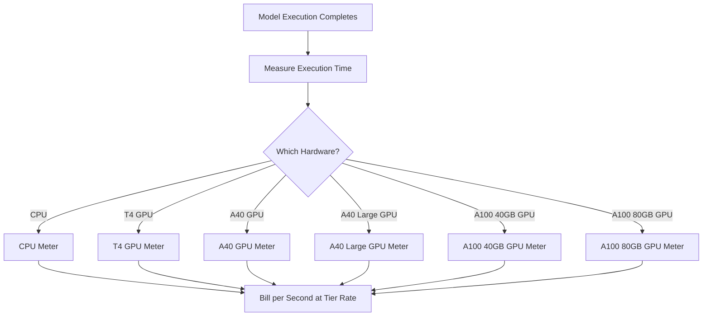

Replicate هي منصة لتشغيل نماذج التعلم الآلي مفتوحة المصدر في السحابة. يُعد نموذج الفوترة الخاص بهم أحد أنقى الأمثلة على التسعير القائم على الاستخدام في صناعة الذكاء الاصطناعي. لا توجد رسوم اشتراك شهرية ولا سعر ثابت لكل مرة تشغيل. بدلاً من ذلك، يتم فوترة الوقت الدقيق المستهلك من الحوسبة، حتى الثانية، مع أسعار تتغير بناءً على العتاد تحتها.

ينجح هذا النهج في أعباء عمل الذكاء الاصطناعي لأن أوقات التنفيذ غير متوقعة. قد يقوم مستخدم واحد بتشغيل نموذج خفيف لبضع ثوانٍ أو نموذج توليدي ضخم لعدة دقائق. بربط التكلفة بالموارد الحاسوبية عوضًا عن النموذج نفسه، يحافظ Replicate على شفافية الأسعار وقابليتها للتوسع.

## كيف تقوم Replicate بالفوترة

يتحرر تسعير Replicate من كونها مرتبطة بالنموذج المحدد قيد التشغيل. سواء كنت تولد صورة باستخدام SDXL أو تشغّل Llama 3، يتم تحديد الفوترة حسب طبقة العتاد ومدة التنفيذ. هذا يتيح لهم استضافة آلاف النماذج مفتوحة المصدر دون الحاجة لخطة تسعير منفصلة لكل منها.

| العتاد | السعر لكل ثانية | السعر لكل ساعة |
| :--- | :--- | :--- |
| معالج NVIDIA | \$0.000100 | \$0.36 |
| وحدة معالجة رسومات NVIDIA T4 | \$0.000225 | \$0.81 |
| وحدة معالجة رسومات NVIDIA A40 | \$0.000575 | \$2.07 |
| وحدة معالجة رسومات NVIDIA A40 (كبير) | \$0.000725 | \$2.61 |
| وحدة معالجة رسومات NVIDIA A100 (40GB) | \$0.001150 | \$4.14 |
| وحدة معالجة رسومات NVIDIA A100 (80GB) | \$0.001400 | \$5.04 |



1. **معدلات خاصة بالعتاد:** تتفاوت التكلفة لكل ثانية حسب الموارد الحاسوبية المطلوبة. كل طبقة من العتاد لها نقطة سعر مختلفة.
2. **نموذج قائم على الاستخدام الخالص:** لا توجد رسوم شهرية ولا رسوم إضافية ولا حدود. يتم فوترة المستخدمين مقابل الوقت الفعلي للحوسبة (مثل "12.4 ثانية على A100") بدلًا من كل توليد.
3. **دقة على مستوى الثانية:** المزودون السحابيّون التقليديون يفوترون بالساعة أو الدقيقة، مما يؤدي إلى هدر في المهام القصيرة. تبطل الفوترة بالثانية هذه الكفاءة المفقودة لكل من التجارب الصغيرة وأحمال الإنتاج الكبيرة.

<Info>
بدء التشغيل البارد أيضًا قابل للفوترة. أول طلب إلى نموذج عادةً ما يستغرق 10-30 ثانية لتحميل النموذج في الذاكرة. يتم فوترة وقت التحميل هذا بنفس معدل وقت التنفيذ.
</Info>
## ما الذي يجعله فريدًا

* **قياس خاص بالعتاد:** نفس النموذج تكلفته أعلى على العتاد الأفضل. يختار المستخدمون بين السرعة والتكلفة. تعمل وحدة T4 للمهام غير الحساسة للزمن، بينما تتعامل A100 مع التطبيقات الفورية.
* **دقة بالثانية:** يتم احتساب الفوترة حتى الثانية، فلا يُفرَض رسوم زائدة على المهام القصيرة.
* **لا اشتراك:** لا التزام للبدء. يتوسع بلا حدود مع الاستخدام، مما يجعله مثاليًا للشركات الناشئة والمطورين الذين يجربون نماذج مختلفة.
* **مستقل عن النموذج:** تبقى منطق الفوترة نفسه بغض النظر عن نوع المهمة (توليد الصور، معالجة النص، تفريغ الصوت، أو توليف الفيديو). يتيح هذا للمنصة دعم نظام بيئي واسع من النماذج دون جداول تسعير معقدة.

## بناء هذا باستخدام Dodo Payments

يمكنك إعادة إنشاء نموذج الفوترة هذا باستخدام ميزات الفوترة القائمة على الاستخدام في Dodo Payments. المفتاح هو استخدام مقاييس متعددة لتعقب طبقات العتاد المختلفة وربطها بمنتج واحد.

<Steps>
  <Step title="Create Usage Meters (One Per Hardware Class)">
    أنشئ مقاييس منفصلة لكل طبقة عتاد. كل نوع عتاد له تكلفة مختلفة لكل ثانية، لذا فإن القياس المستقل يسمح لـ Dodo بتسعير كل طبقة بشكل مختلف وتوفير فوترة مفصلة.

    | اسم المقياس | اسم الحدث | التجميع | الخاصية |
    | :--- | :--- | :--- | :--- |
    | CPU Compute | `compute.cpu` | Sum | `execution_seconds` |
    | GPU T4 Compute | `compute.gpu_t4` | Sum | `execution_seconds` |
    | GPU A40 Compute | `compute.gpu_a40` | Sum | `execution_seconds` |
    | GPU A40 Large Compute | `compute.gpu_a40_large` | Sum | `execution_seconds` |
    | GPU A100 40GB Compute | `compute.gpu_a100_40` | Sum | `execution_seconds` |
    | GPU A100 80GB Compute | `compute.gpu_a100_80` | Sum | `execution_seconds` |

    تجميع `Sum` على الخاصية `execution_seconds` يحسب إجمالي وقت الحوسبة لكل طبقة عتاد خلال فترة الفوترة.
  </Step>

  <Step title="Create a Usage-Based Product">
    أنشئ منتجًا جديدًا في لوحة تحكم Dodo Payments:

    * **نوع التسعير:** الفوترة القائمة على الاستخدام
    * **السعر الأساسي:** \$0/شهر (بدون رسوم اشتراك)
    * **وتيرة الفوترة:** شهرية

    اربط جميع المقاييس مع تسعير كل وحدة:

    | المقياس | السعر لكل وحدة (لكل ثانية) |
    | :--- | :--- |
    | compute.cpu | \$0.000100 |
    | compute.gpu_t4 | \$0.000225 |
    | compute.gpu_a40 | \$0.000575 |
    | compute.gpu_a40_large | \$0.000725 |
    | compute.gpu_a100_40 | \$0.001150 |
    | compute.gpu_a100_80 | \$0.001400 |

    اضبط **الحد المجاني** على 0 لكل المقاييس. كل ثانية من التنفيذ قابلة للفوترة.

  <Step title="Send Usage Events">
    أرسل أحداث الاستخدام إلى Dodo كلما اكتمل تنفيذ نموذج. أدرج معرفًا فريدًا `event_id` لكل توقع لضمان عدم الازدواجية.

    ```typescript
    import DodoPayments from 'dodopayments';

    type HardwareTier = 'cpu' | 'gpu_t4' | 'gpu_a40' | 'gpu_a40_large' | 'gpu_a100_40' | 'gpu_a100_80';

    const client = new DodoPayments({
      bearerToken: process.env.DODO_PAYMENTS_API_KEY,
    });

    async function trackModelExecution(
      customerId: string,
      modelId: string,
      hardware: HardwareTier,
      executionSeconds: number,
      predictionId: string
    ) {
      const eventName = `compute.${hardware}`;

      await client.usageEvents.ingest({
        events: [{
          event_id: `pred_${predictionId}`,
          customer_id: customerId,
          event_name: eventName,
          timestamp: new Date().toISOString(),
          metadata: {
            execution_seconds: executionSeconds,
            model_id: modelId,
            hardware: hardware
          }
        }]
      });
    }

    // Example: SDXL image generation on A100
    await trackModelExecution(
      'cus_abc123',
      'stability-ai/sdxl',
      'gpu_a100_80',
      8.3,  // 8.3 seconds of A100 time
      'pred_xyz789'
    );
    ```

  </Step>

  <Step title="Measure Execution Time Precisely">
    غلف تنفيذ النموذج الخاص بك بقياسات دقيقة باستخدام `performance.now()`. قم بالتقريب لأقرب عُشر من الثانية للفوترة.

    ```typescript
    async function runModelWithMetering(
      customerId: string,
      modelId: string,
      hardware: HardwareTier,
      input: Record<string, unknown>
    ) {
      const predictionId = `pred_${Date.now()}`;
      const startTime = performance.now();

      try {
        const result = await executeModel(modelId, input, hardware);
        const executionSeconds = (performance.now() - startTime) / 1000;
        const billedSeconds = Math.round(executionSeconds * 10) / 10;

        await trackModelExecution(
          customerId,
          modelId,
          hardware,
          billedSeconds,
          predictionId
        );

        return result;
      } catch (error) {
        // Still bill for compute time even on failure
        const executionSeconds = (performance.now() - startTime) / 1000;
        if (executionSeconds > 1) {
          await trackModelExecution(
            customerId,
            modelId,
            hardware,
            Math.round(executionSeconds * 10) / 10,
            predictionId
          );
        }
        throw error;
      }
    }
    ```

  </Step>

  <Step title="Create Checkout">
    عند تسجيل مستخدم، أنشئ جلسة Checkout للمنتج القائم على الاستخدام. Dodo يدير الفوترة المتكررة والفوترة تلقائيًا.

    ```typescript
    const session = await client.checkoutSessions.create({
      product_cart: [
        { product_id: 'prod_compute_payg', quantity: 1 }
      ],
      customer: { email: 'ml-engineer@company.com' },
      return_url: 'https://yourplatform.com/dashboard'
    });
    ```

  </Step>
</Steps>
## التعجيل باستخدام مخطط بلوبرينت نطاق الوقت

## Accelerate with the Time Range Ingestion Blueprint

يبسط [مخطط بلوبرينت نطاق الوقت](/developer-resources/ingestion-blueprints/time-range) تتبع الحوسبة بالثانية. أنشئ نسخة استيعاب لكل طبقة عتاد واستخدم `trackTimeRange` لتقديم أحداث أنظف.

```bash
npm install @dodopayments/ingestion-blueprints
```

```typescript
import { Ingestion, trackTimeRange } from '@dodopayments/ingestion-blueprints';

// Create one ingestion instance per hardware tier
function createHardwareIngestion(hardware: string) {
  return new Ingestion({
    apiKey: process.env.DODO_PAYMENTS_API_KEY,
    environment: 'live_mode',
    eventName: `compute.${hardware}`,
  });
}

const ingestions: Record<string, Ingestion> = {
  cpu: createHardwareIngestion('cpu'),
  gpu_t4: createHardwareIngestion('gpu_t4'),
  gpu_a40: createHardwareIngestion('gpu_a40'),
  gpu_a40_large: createHardwareIngestion('gpu_a40_large'),
  gpu_a100_40: createHardwareIngestion('gpu_a100_40'),
  gpu_a100_80: createHardwareIngestion('gpu_a100_80'),
};

// Track execution after a model run completes
const startTime = performance.now();
const result = await executeModel(modelId, input, hardware);
const durationMs = performance.now() - startTime;

await trackTimeRange(ingestions[hardware], {
  customerId: customerId,
  durationMs: durationMs,
  metadata: {
    model_id: modelId,
    hardware: hardware,
  },
});
```

يتولى المخطط تنسيق المدة وبناء الحدث. مجتمعة مع نسخ الاستيعاب المخصصة لكل عتاد، تتطابق هذه البنية بسلاسة مع القياس المتعدد الطبقات في Replicate.

<Tip>
للمهام طويلة التشغيل، اجمع مخطط نطاق الوقت مع تتبع نبضات القلب بفواصل. راجع [توثيق المخطط الكامل](/developer-resources/ingestion-blueprints/time-range) للأنماط المتقدمة.
</Tip>
## تقدير التكلفة للمستخدمين

## Cost Estimation for Users

نظرًا لأن الفوترة القائمة على الاستخدام قد تكون غير متوقعة، قدم للمستخدمين تقديرات تكلفة قبل تشغيل النموذج. هذا يقلل الفواتير المفاجئة ويعزز الثقة.

### أمثلة لحساب التكاليف

| النموذج | العتاد | متوسط الوقت | التكلفة لكل مرة |
| :--- | :--- | :--- | :--- |
| SDXL (صورة) | A100 80GB | ~8 ثوانٍ | ~\$0.0112 |
| Llama 3 (نص) | A100 40GB | ~3 ثوانٍ | ~\$0.0035 |
| Whisper (صوت) | GPU T4 | ~15 ثانية | ~\$0.0034 |

### بناء حاسبة التكلفة

```typescript
function estimateCost(hardware: HardwareTier, estimatedSeconds: number): number {
  const rates: Record<HardwareTier, number> = {
    'cpu': 0.000100,
    'gpu_t4': 0.000225,
    'gpu_a40': 0.000575,
    'gpu_a40_large': 0.000725,
    'gpu_a100_40': 0.001150,
    'gpu_a100_80': 0.001400
  };

  return Number((rates[hardware] * estimatedSeconds).toFixed(4));
}

// Show the user before running: "This will cost approximately $0.0098"
const estimate = estimateCost('gpu_a100_80', 8.5);
```

## الشركات: السعة المحجوزة

لعملاء المؤسسات الذين يحتاجون إلى توفر مضمون وعدم وجود بدايات باردة، تقدم Replicate "حالات خاصة" بسعر ثابت لكل ساعة.

مع Dodo Payments، صمّم هذا كمنتج اشتراك:

* **نوع المنتج:** اشتراك
* **السعر:** سعر شهري ثابت (مثل "مثيل A100 محجوز - \$500/شهر")
* **دورة الفوترة:** شهرية

لا يزال بإمكانك إرسال أحداث الاستخدام للمراقبة والتحليلات، لكن الاشتراك يغطي التكلفة. ومع تزايد حجم المستخدم، يصبح التحول من الدفع عند الاستخدام إلى السعة المحجوزة أكثر فعالية من حيث التكلفة.

## متقدم: قياس نبضات القلب

بالنسبة للمهام التي تستغرق عدة دقائق أو ساعات، إرسال حدث واحد في النهاية محفوف بالمخاطر. إذا تعطل العملية، تفقد بيانات الاستخدام. النهج الأفضل هو إرسال أحداث استخدام كل 30-60 ثانية أثناء التنفيذ.

```typescript
async function runLongTaskWithHeartbeat(
  customerId: string,
  modelId: string,
  hardware: HardwareTier
) {
  const predictionId = `pred_${Date.now()}`;
  let totalSeconds = 0;

  const heartbeatInterval = setInterval(async () => {
    try {
      await trackModelExecution(
        customerId,
        modelId,
        hardware,
        30,
        `${predictionId}_${totalSeconds}`
      );
      totalSeconds += 30;
    } catch (error) {
      console.error('Heartbeat tracking failed:', error, { predictionId, totalSeconds });
    }
  }, 30000);

  try {
    await executeLongTask();
  } finally {
    clearInterval(heartbeatInterval);
  }
}
```

## الميزات الرئيسية المستخدمة من Dodo

<CardGroup cols={2}>
  <Card title="Usage-Based Billing" icon="chart-line" href="/features/usage-based-billing/introduction">
    أعد إعداد منتجات تُفوتر بناءً على الاستهلاك.
  </Card>
  <Card title="Meters" icon="gauge" href="/features/usage-based-billing/meters">
    حدد المقاييس التي تريد تتبعها والفوترة عليها.
  </Card>
  <Card title="Event Ingestion" icon="bolt" href="/features/usage-based-billing/event-ingestion">
    أرسل بيانات الاستخدام إلى Dodo في الوقت الحقيقي.
  </Card>
  <Card title="Subscriptions" icon="calendar" href="/features/subscription">
    أدر الفوترة المتكررة للسعة المحجوزة وخطط المؤسسات.
  </Card>
  <Card title="Time Range Blueprint" icon="clock" href="/developer-resources/ingestion-blueprints/time-range">
    تتبع الحوسبة بالثانية مع مساعدي الوقت.
  </Card>
</CardGroup>
