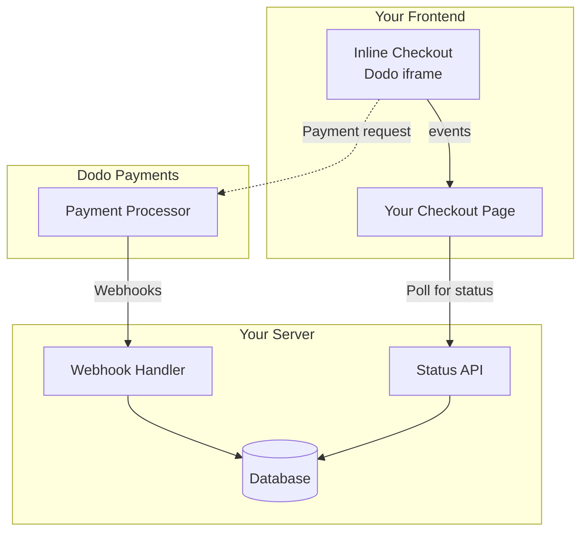

## نظرة عامة

تتيح لك عملية الدفع المباشر إنشاء تجارب دفع متكاملة تمامًا تتمازج بسلاسة مع موقعك الإلكتروني أو تطبيقك. على عكس [الدفع المنبثق](/developer-resources/overlay-checkout)، الذي يفتح كنافذة منبثقة فوق صفحتك، يقوم الدفع المباشر بتضمين نموذج الدفع مباشرة في تخطيط صفحتك.

باستخدام الدفع المباشر، يمكنك:

- إنشاء تجارب دفع متكاملة تمامًا مع تطبيقك أو موقعك الإلكتروني
- السماح لـ Dodo Payments بالتقاط معلومات العملاء والدفع بشكل آمن في إطار دفع محسن
- عرض العناصر، والمجموعات، ومعلومات أخرى من Dodo Payments على صفحتك
- استخدام طرق وأحداث SDK لبناء تجارب دفع متقدمة

<Frame>
    
</Frame>

## كيف يعمل

يعمل الدفع المباشر عن طريق تضمين إطار Dodo Payments الآمن في موقعك الإلكتروني أو تطبيقك.

يتولى إطار الدفع جمع معلومات العملاء والتقاط تفاصيل الدفع. تعرض صفحتك قائمة العناصر، والمجموعات، والخيارات لتغيير ما هو موجود في عملية الدفع. يسمح لك SDK بتفاعل صفحتك مع إطار الدفع.

تقوم Dodo Payments تلقائيًا بإنشاء اشتراك عند اكتمال عملية الدفع، جاهزًا للتوفير.

<Note>
يتولى إطار الدفع المباشر التعامل بشكل آمن مع جميع معلومات الدفع الحساسة، مما يضمن الامتثال لمعايير PCI دون الحاجة إلى شهادة إضافية من جانبك.
</Note>

## ما الذي يجعل الدفع المباشر جيدًا؟

من المهم أن يعرف العملاء من يشترون منه، وما الذي يشترونه، وكم يدفعون.

لبناء عملية دفع مباشرة متوافقة ومحسّنة للتحويل، يجب أن تتضمن تنفيذك:

<Frame caption="مثال على تخطيط الدفع المباشر يظهر العناصر المطلوبة">
    
</Frame>

1. **معلومات متكررة**: إذا كانت متكررة، كم مرة تتكرر والمبلغ المطلوب دفعه عند التجديد. إذا كانت تجربة مجانية، كم من الوقت تستمر التجربة.
2. **وصف العناصر**: وصف لما يتم شراؤه.
3. **مجموع المعاملات**: مجموع المعاملات، بما في ذلك المجموع الفرعي، والضرائب الإجمالية، والمجموع الكلي. تأكد من تضمين العملة أيضًا.
4. **تذييل Dodo Payments**: إطار الدفع المباشر الكامل، بما في ذلك تذييل الدفع الذي يحتوي على معلومات حول Dodo Payments، وشروط البيع، وسياسة الخصوصية الخاصة بنا.
5. **سياسة الاسترداد**: رابط إلى سياسة الاسترداد الخاصة بك، إذا كانت تختلف عن سياسة الاسترداد القياسية لـ Dodo Payments.

<Warning>
قم دائمًا بعرض إطار الدفع المباشر الكامل، بما في ذلك التذييل. إزالة أو إخفاء المعلومات القانونية ينتهك متطلبات الامتثال.
</Warning>

## رحلة العميل

تحدد تكوين جلسة الدفع الخاصة بك تدفق عملية الدفع. اعتمادًا على كيفية تكوين جلسة الدفع، سيختبر العملاء عملية دفع قد تعرض جميع المعلومات في صفحة واحدة أو عبر خطوات متعددة.

<Steps>
<Step title="يفتح العميل عملية الدفع">

يمكنك فتح الدفع الفوري عن طريق تمرير العناصر أو معاملة موجودة. استخدم SDK لعرض وتحديث المعلومات على الصفحة، وطرق SDK لتحديث العناصر بناءً على تفاعل العميل.
    

</Step>

<Step title="يدخل العميل تفاصيله">

يطلب الدفع المباشر أولاً من العملاء إدخال عنوان بريدهم الإلكتروني، واختيار بلدهم، و(حيثما كان مطلوبًا) إدخال الرمز البريدي أو الرمز البريدي. تجمع هذه الخطوة جميع المعلومات اللازمة لتحديد الضرائب وطرق الدفع المتاحة.

يمكنك ملء تفاصيل العملاء مسبقًا وعرض العناوين المحفوظة لتبسيط التجربة.

</Step>

<Step title="يختار العميل طريقة الدفع">

بعد إدخال تفاصيلهم، يتم تقديم طرق الدفع المتاحة للعملاء ونموذج الدفع. قد تشمل الخيارات بطاقة ائتمان أو بطاقة خصم، PayPal، Apple Pay، Google Pay، وطرق دفع محلية أخرى بناءً على موقعهم.

عرض طرق الدفع المحفوظة إذا كانت متاحة لتسريع عملية الدفع.


</Step>

<Step title="اكتملت عملية الدفع">

تقوم Dodo Payments بتوجيه كل عملية دفع إلى أفضل جهة إصدار لتلك المعاملة للحصول على أفضل فرصة للنجاح. يدخل العملاء في سير عمل النجاح الذي يمكنك بناؤه.


</Step>

<Step title="Dodo Payments تنشئ اشتراكًا">

تقوم Dodo Payments تلقائيًا بإنشاء اشتراك للعميل، جاهزًا للتوفير. يتم الاحتفاظ بطريقة الدفع التي استخدمها العميل في السجل للتجديدات أو تغييرات الاشتراك.


</Step>
</Steps>

## البداية السريعة

ابدأ مع الدفع الفوري من Dodo Payments في بضع أسطر من التعليمات البرمجية:

```typescript
import { DodoPayments } from "dodopayments-checkout";

// Initialize the SDK for inline mode
DodoPayments.Initialize({
  mode: "test",
  displayType: "inline",
  onEvent: (event) => {
    console.log("Checkout event:", event);
  },
});

// Open checkout in a specific container
DodoPayments.Checkout.open({
  checkoutUrl: "https://test.dodopayments.com/session/cks_123",
  elementId: "dodo-inline-checkout" // ID of the container element
});
```

<Tip>
تأكد من وجود عنصر حاوية مع `id` المقابل في صفحتك: `<div id="dodo-inline-checkout"></div>`.
</Tip>

## دليل التكامل خطوة بخطوة

<Steps>
<Step title="تثبيت SDK">

قم بتثبيت SDK الدفع من Dodo Payments:

<CodeGroup>

```bash npm
npm install dodopayments-checkout
```

```bash yarn
yarn add dodopayments-checkout
```

```bash pnpm
pnpm add dodopayments-checkout
```

</CodeGroup>

</Step>

<Step title="تهيئة SDK لعرض الدفع الفوري">

قم بتهيئة SDK وحدد `displayType: 'inline'`. يجب عليك أيضًا الاستماع لحدث `checkout.breakdown` لتحديث واجهة المستخدم الخاصة بك بحسابات الضرائب والمجموع في الوقت الحقيقي.

```typescript
import { DodoPayments } from "dodopayments-checkout";

DodoPayments.Initialize({
  mode: "test",
  displayType: "inline",
  onEvent: (event) => {
    if (event.event_type === "checkout.breakdown") {
      const breakdown = event.data?.message;
      // Update your UI with breakdown.subTotal, breakdown.tax, breakdown.total, etc.
    }
  },
});
```

</Step>

<Step title="إنشاء عنصر حاوية">

أضف عنصرًا إلى HTML الخاص بك حيث سيتم حقن إطار الدفع:

```html
<div id="dodo-inline-checkout"></div>
```

</Step>

<Step title="فتح الدفع">

استدعاء `DodoPayments.Checkout.open()` مع `checkoutUrl` و`elementId` للحاوية الخاصة بك:

```typescript
DodoPayments.Checkout.open({
  checkoutUrl: "https://test.dodopayments.com/session/cks_123",
  elementId: "dodo-inline-checkout"
});
```

</Step>

<Step title="اختبر تكاملك">

1. ابدأ خادم التطوير الخاص بك:

```bash
npm run dev
```

2. اختبر تدفق الدفع:
   - أدخل تفاصيل بريدك الإلكتروني والعنوان في الإطار الفوري.
   - تحقق من أن ملخص الطلب المخصص الخاص بك يتم تحديثه في الوقت الحقيقي.
   - اختبر تدفق الدفع باستخدام بيانات اعتماد الاختبار.
   - تأكد من أن عمليات إعادة التوجيه تعمل بشكل صحيح.

<Check>
يجب أن ترى أحداث `checkout.breakdown` مسجلة في وحدة تحكم المتصفح الخاصة بك إذا قمت بإضافة سجل وحدة تحكم في رد الاتصال `onEvent`.
</Check>

</Step>

<Step title="اذهب للعيش">

عندما تكون جاهزًا للإنتاج:

1. قم بتغيير الوضع إلى `'live'`:

```typescript
DodoPayments.Initialize({
  mode: "live",
  displayType: "inline",
  onEvent: (event) => {
    // Handle events
  }
});
```

2. قم بتحديث عناوين URL للدفع الخاصة بك لاستخدام جلسات الدفع الحية من الخلفية الخاصة بك.
3. اختبر التدفق الكامل في الإنتاج.

</Step>
</Steps>

## مثال كامل على React

توضح هذه المثال كيفية تنفيذ ملخص طلب مخصص بجانب الدفع المضمن، مع الحفاظ على تزامنها باستخدام حدث `checkout.breakdown`.

```tsx
"use client";

import { useEffect, useState } from 'react';
import { DodoPayments, CheckoutBreakdownData } from 'dodopayments-checkout';

export default function CheckoutPage() {
  const [breakdown, setBreakdown] = useState<Partial<CheckoutBreakdownData>>({});

  useEffect(() => {
    // 1. Initialize the SDK
    DodoPayments.Initialize({
      mode: 'test',
      displayType: 'inline',
      onEvent: (event) => {
        // 2. Listen for the 'checkout.breakdown' event
        if (event.event_type === "checkout.breakdown") {
          const message = event.data?.message as CheckoutBreakdownData;
          if (message) setBreakdown(message);
        }
      }
    });

    // 3. Open the checkout in the specified container
    DodoPayments.Checkout.open({
      checkoutUrl: 'https://test.dodopayments.com/session/cks_123',
      elementId: 'dodo-inline-checkout'
    });

    return () => DodoPayments.Checkout.close();
  }, []);

  const format = (amt: number | null | undefined, curr: string | null | undefined) => 
    amt != null && curr ? `${curr} ${(amt/100).toFixed(2)}` : '0.00';

  const currency = breakdown.currency ?? breakdown.finalTotalCurrency ?? '';

  return (
    <div className="flex flex-col md:flex-row min-h-screen">
      {/* Left Side - Checkout Form */}
      <div className="w-full md:w-1/2 flex items-center">
        <div id="dodo-inline-checkout" className='w-full' />
      </div>

      {/* Right Side - Custom Order Summary */}
      <div className="w-full md:w-1/2 p-8 bg-gray-50">
        <h2 className="text-2xl font-bold mb-4">Order Summary</h2>
        <div className="space-y-2">
          {breakdown.subTotal && (
            <div className="flex justify-between">
              <span>Subtotal</span>
              <span>{format(breakdown.subTotal, currency)}</span>
            </div>
          )}
          {breakdown.discount && (
            <div className="flex justify-between">
              <span>Discount</span>
              <span>{format(breakdown.discount, currency)}</span>
            </div>
          )}
          {breakdown.tax != null && (
            <div className="flex justify-between">
              <span>Tax</span>
              <span>{format(breakdown.tax, currency)}</span>
            </div>
          )}
          <hr />
          {(breakdown.finalTotal ?? breakdown.total) && (
            <div className="flex justify-between font-bold text-xl">
              <span>Total</span>
              <span>{format(breakdown.finalTotal ?? breakdown.total, breakdown.finalTotalCurrency ?? currency)}</span>
            </div>
          )}
        </div>
      </div>
    </div>
  );
}

```

## مرجع API

### التكوين

#### خيارات التهيئة

```typescript
interface InitializeOptions {
  mode: "test" | "live";
  displayType: "inline"; // Required for inline checkout
  onEvent: (event: CheckoutEvent) => void;
}
```

| الخيار | النوع | مطلوب | الوصف |
|--------|------|----------|-------------|
| `mode` | `"test" \| "live"` | نعم | وضع البيئة. |
| `displayType` | `"inline" \| "overlay"` | نعم | يجب تعيينه إلى `"inline"` لتضمين الدفع. |
| `onEvent` | `function` | نعم | دالة رد الاتصال لمعالجة أحداث الدفع. |

#### خيارات الدفع

```typescript
export type FontSize = "xs" | "sm" | "md" | "lg" | "xl" | "2xl";
export type FontWeight = "normal" | "medium" | "bold" | "extraBold";

interface CheckoutOptions {
  checkoutUrl: string;
  elementId: string; // Required for inline checkout
  options?: {
    showTimer?: boolean;
    showSecurityBadge?: boolean;
    manualRedirect?: boolean;
    themeConfig?: ThemeConfig;
    payButtonText?: string;
    fontSize?: FontSize;
    fontWeight?: FontWeight;
  };
}
```

| الخيار | النوع | مطلوب | الوصف |
|--------|------|----------|-------------|
| `checkoutUrl` | `string` | نعم | عنوان URL لجلسة الدفع. |
| `elementId` | `string` | نعم | `id` لعنصر DOM حيث يجب عرض الدفع. |
| `options.showTimer` | `boolean` | لا | عرض أو إخفاء مؤقت الدفع. الافتراضي هو `true`. عند التعطيل، ستتلقى حدث `checkout.link_expired` عند انتهاء الجلسة. |
| `options.showSecurityBadge` | `boolean` | لا | عرض أو إخفاء شارة الأمان. الافتراضي هو `true`. |
| `options.manualRedirect` | `boolean` | لا | عند التمكين، لن يتم إعادة توجيه الدفع تلقائيًا بعد الاكتمال. بدلاً من ذلك، ستتلقى أحداث `checkout.status` و`checkout.redirect_requested` للتعامل مع إعادة التوجيه بنفسك. |
| `options.themeConfig` | `ThemeConfig` | لا | تكوين سمة مخصصة. |
| `options.payButtonText` | `string` | لا | نص مخصص لعرضه على زر الدفع. |
| `options.fontSize` | `FontSize` | لا | حجم الخط العالمي للدفع. |
| `options.fontWeight` | `FontWeight` | لا | وزن الخط العالمي للدفع. |

### الطرق

#### فتح الدفع

يفتح إطار الدفع في الحاوية المحددة.

```typescript
DodoPayments.Checkout.open({
  checkoutUrl: "https://test.dodopayments.com/session/cks_123",
  elementId: "dodo-inline-checkout"
});
```

يمكنك أيضًا تمرير خيارات إضافية لتخصيص سلوك الدفع:

```typescript
DodoPayments.Checkout.open({
  checkoutUrl: "https://test.dodopayments.com/session/cks_123",
  elementId: "dodo-inline-checkout",
  options: {
    showTimer: false,
    showSecurityBadge: false,
    manualRedirect: true,
    payButtonText: "Pay Now",
  },
});
```

عند استخدام `manualRedirect`، تعامل مع إكمال الدفع في رد الاتصال `onEvent`:

```typescript
DodoPayments.Initialize({
  mode: "test",
  displayType: "inline",
  onEvent: (event) => {
    if (event.event_type === "checkout.status") {
      const status = event.data?.message?.status;
      // Handle status: "succeeded", "failed", or "processing"
    }
    if (event.event_type === "checkout.redirect_requested") {
      const redirectUrl = event.data?.message?.redirect_to;
      // Redirect the customer manually
      window.location.href = redirectUrl;
    }
    if (event.event_type === "checkout.link_expired") {
      // Handle expired checkout session
    }
  },
});
```

#### إغلاق عملية الدفع

يتم إزالة إطار الدفع برمجيًا وتنظيف مستمعي الأحداث.

```typescript
DodoPayments.Checkout.close();
```

#### تحقق من الحالة

يعود ما إذا كان إطار الدفع مدرجًا حاليًا.

```typescript
const isOpen = DodoPayments.Checkout.isOpen();
// Returns: boolean
```

### الأحداث

يوفر SDK أحداثًا في الوقت الحقيقي من خلال رد الاتصال `onEvent`. بالنسبة للدفع المضمن، فإن `checkout.breakdown` مفيد بشكل خاص لمزامنة واجهة المستخدم الخاصة بك.

| نوع الحدث | الوصف |
|------------|-------------|
| `checkout.opened` | تم تحميل إطار الدفع. |
| `checkout.breakdown` | تم إطلاقه عند تحديث الأسعار أو الضرائب أو الخصومات. |
| `checkout.customer_details_submitted` | تم تقديم تفاصيل العميل. |
| `checkout.pay_button_clicked` | تم إطلاقه عندما ينقر العميل على زر الدفع. مفيد للتحليلات وتتبع قنوات التحويل. |
| `checkout.redirect` | سيقوم الدفع بإجراء إعادة توجيه (على سبيل المثال، إلى صفحة بنك). |
| `checkout.error` | حدث خطأ أثناء الدفع. |
| `checkout.link_expired` | تم إطلاقه عندما تنتهي جلسة الدفع. يتم استلامه فقط عندما يتم تعيين `showTimer` إلى `false`. |
| `checkout.status` | تم إطلاقه عندما يتم تمكين `manualRedirect`. يحتوي على حالة الدفع (`succeeded`، `failed`، أو `processing`). |
| `checkout.redirect_requested` | تم إطلاقه عندما يتم تمكين `manualRedirect`. يحتوي على عنوان URL لإعادة توجيه العميل إليه. |

#### بيانات تفصيل عملية الدفع

يوفر حدث `checkout.breakdown` البيانات التالية:

```typescript
interface CheckoutBreakdownData {
  subTotal?: number;          // Amount in cents
  discount?: number;         // Amount in cents
  tax?: number;              // Amount in cents
  total?: number;            // Amount in cents
  currency?: string;         // e.g., "USD"
  finalTotal?: number;       // Final amount including adjustments
  finalTotalCurrency?: string; // Currency for the final total
}
```

#### بيانات حدث حالة الدفع

عند تمكين `manualRedirect`، ستتلقى حدث `checkout.status` مع البيانات التالية:

```typescript
interface CheckoutStatusEventData {
  message: {
    status?: "succeeded" | "failed" | "processing";
  };
}
```

#### بيانات حدث إعادة توجيه الدفع المطلوبة

عند تمكين `manualRedirect`، ستتلقى حدث `checkout.redirect_requested` مع البيانات التالية:

```typescript
interface CheckoutRedirectRequestedEventData {
  message: {
    redirect_to?: string;
  };
}
```

#### فهم حدث التفصيل

يعد حدث `checkout.breakdown` الطريقة الأساسية للحفاظ على تزامن واجهة المستخدم الخاصة بتطبيقك مع حالة الدفع في Dodo Payments.

**عندما يتم إطلاقه:**
- **عند التهيئة**: مباشرة بعد تحميل إطار الدفع واستعداده.
- **عند تغيير العنوان**: كلما اختار العميل دولة أو أدخل رمزًا بريديًا يؤدي إلى إعادة حساب الضرائب.

**تفاصيل الحقول:**

| الحقل | الوصف |
|-------|-------------|
| `subTotal` | مجموع جميع العناصر في الجلسة قبل تطبيق أي خصومات أو ضرائب. |
| `discount` | القيمة الإجمالية لجميع الخصومات المطبقة. |
| `tax` | مبلغ الضريبة المحسوب. في وضع `inline`، يتم تحديثه ديناميكيًا أثناء تفاعل المستخدم مع حقول العنوان. |
| `total` | النتيجة الرياضية لـ `subTotal - discount + tax` في العملة الأساسية للجلسة. |
| `currency` | رمز العملة ISO (على سبيل المثال، `"USD"`) لقيم المجموع الفرعي القياسية والخصومات والضرائب. |
| `finalTotal` | المبلغ الفعلي الذي يتم تحصيله من العميل. قد يتضمن ذلك تعديلات إضافية على سعر الصرف أو رسوم طرق الدفع المحلية التي ليست جزءًا من تفصيل السعر الأساسي. |
| `finalTotalCurrency` | العملة التي يدفع بها العميل فعليًا. قد تختلف هذه عن `currency` إذا كانت القدرة الشرائية أو تحويل العملة المحلية نشطة. |

**نصائح تكامل رئيسية:**

1.  **تنسيق العملة**: يتم دائمًا إرجاع الأسعار كأعداد صحيحة في أصغر وحدة عملة (على سبيل المثال، السنتات للدولار الأمريكي، والين لليابان). لعرضها، قسمها على 100 (أو القوة المناسبة لـ 10) أو استخدم مكتبة تنسيق مثل `Intl.NumberFormat`.
2.  **التعامل مع الحالات الأولية**: عند تحميل الدفع لأول مرة، قد تكون `tax` و`discount` تكون `0` أو `null` حتى يقدم المستخدم معلومات الفوترة الخاصة به أو يطبق رمزًا. يجب أن تتعامل واجهة المستخدم الخاصة بك مع هذه الحالات بشكل جيد (على سبيل المثال، عرض شرطة `—` أو إخفاء الصف).
3.  **"الإجمالي النهائي" مقابل "الإجمالي"**: بينما يعطيك `total` حساب السعر القياسي، فإن `finalTotal` هو مصدر الحقيقة للمعاملة. إذا كان `finalTotal` موجودًا، فإنه يعكس بالضبط ما سيتم تحصيله من بطاقة العميل، بما في ذلك أي تعديلات ديناميكية.
4.  **التعليقات في الوقت الحقيقي**: استخدم حقل `tax` لإظهار للمستخدمين أن الضرائب يتم حسابها في الوقت الحقيقي. يوفر هذا شعورًا "حيًا" لصفحة الدفع الخاصة بك ويقلل من الاحتكاك أثناء خطوة إدخال العنوان.

## خيارات التنفيذ

### تثبيت عبر مدير الحزم

قم بالتثبيت عبر npm أو yarn أو pnpm كما هو موضح في [دليل التكامل خطوة بخطوة](#step-by-step-integration-guide).

### تنفيذ CDN

للتكامل السريع دون خطوة بناء، يمكنك استخدام CDN الخاص بنا:

```html
<!DOCTYPE html>
<html lang="en">
<head>
    <meta charset="UTF-8">
    <meta name="viewport" content="width=device-width, initial-scale=1.0">
    <title>Dodo Payments Inline Checkout</title>
    
    <!-- Load DodoPayments -->
    <script src="https://cdn.jsdelivr.net/npm/dodopayments-checkout@latest/dist/index.js"></script>
    <script>
        // Initialize the SDK
        DodoPaymentsCheckout.DodoPayments.Initialize({
            mode: "test",
            displayType: "inline",
            onEvent: (event) => {
                console.log('Checkout event:', event);
            }
        });
    </script>
</head>
<body>
    <div id="dodo-inline-checkout"></div>

    <script>
        // Open the checkout
        DodoPaymentsCheckout.DodoPayments.Checkout.open({
            checkoutUrl: "https://test.dodopayments.com/session/cks_123",
            elementId: "dodo-inline-checkout"
        });
    </script>
</body>
</html>
```

### تخصيص السمة

يمكنك تخصيص مظهر الدفع عن طريق تمرير كائن `themeConfig` في معلمة `options` عند فتح الدفع. يدعم تكوين السمة كل من الأوضاع الفاتحة والداكنة، مما يتيح لك تخصيص الألوان والحدود والنصوص والأزرار ونصف القطر للحدود.

#### تكوين السمة الأساسية

```typescript
DodoPayments.Checkout.open({
  checkoutUrl: "https://checkout.dodopayments.com/session/cks_123",
  options: {
    themeConfig: {
      light: {
        bgPrimary: "#FFFFFF",
        textPrimary: "#344054",
        buttonPrimary: "#A6E500",
      },
      dark: {
        bgPrimary: "#0D0D0D",
        textPrimary: "#FFFFFF",
        buttonPrimary: "#A6E500",
      },
      radius: "8px",
    },
  },
});
```

#### تكوين السمة الكامل

جميع خصائص السمة المتاحة:

```typescript
DodoPayments.Checkout.open({
  checkoutUrl: "https://checkout.dodopayments.com/session/cks_123",
  options: {
    themeConfig: {
      light: {
        // Background colors
        bgPrimary: "#FFFFFF",        // Primary background color
        bgSecondary: "#F9FAFB",      // Secondary background color (e.g., tabs)
        
        // Border colors
        borderPrimary: "#D0D5DD",     // Primary border color
        borderSecondary: "#6B7280",  // Secondary border color
        inputFocusBorder: "#D0D5DD", // Input focus border color
        
        // Text colors
        textPrimary: "#344054",       // Primary text color
        textSecondary: "#6B7280",    // Secondary text color
        textPlaceholder: "#667085",  // Placeholder text color
        textError: "#D92D20",        // Error text color
        textSuccess: "#10B981",      // Success text color
        
        // Button colors
        buttonPrimary: "#A6E500",           // Primary button background
        buttonPrimaryHover: "#8CC500",      // Primary button hover state
        buttonTextPrimary: "#0D0D0D",       // Primary button text color
        buttonSecondary: "#F3F4F6",         // Secondary button background
        buttonSecondaryHover: "#E5E7EB",     // Secondary button hover state
        buttonTextSecondary: "#344054",     // Secondary button text color
      },
      dark: {
        // Background colors
        bgPrimary: "#0D0D0D",
        bgSecondary: "#1A1A1A",
        
        // Border colors
        borderPrimary: "#323232",
        borderSecondary: "#D1D5DB",
        inputFocusBorder: "#323232",
        
        // Text colors
        textPrimary: "#FFFFFF",
        textSecondary: "#909090",
        textPlaceholder: "#9CA3AF",
        textError: "#F97066",
        textSuccess: "#34D399",
        
        // Button colors
        buttonPrimary: "#A6E500",
        buttonPrimaryHover: "#8CC500",
        buttonTextPrimary: "#0D0D0D",
        buttonSecondary: "#2A2A2A",
        buttonSecondaryHover: "#3A3A3A",
        buttonTextSecondary: "#FFFFFF",
      },
      radius: "8px", // Border radius for inputs, buttons, and tabs
    },
  },
});
```

#### الوضع الفاتح فقط

إذا كنت ترغب فقط في تخصيص السمة الفاتحة:

```typescript
DodoPayments.Checkout.open({
  checkoutUrl: "https://checkout.dodopayments.com/session/cks_123",
  options: {
    themeConfig: {
      light: {
        bgPrimary: "#FFFFFF",
        textPrimary: "#000000",
        buttonPrimary: "#0070F3",
      },
      radius: "12px",
    },
  },
});
```

#### الوضع الداكن فقط

إذا كنت ترغب فقط في تخصيص السمة الداكنة:

```typescript
DodoPayments.Checkout.open({
  checkoutUrl: "https://checkout.dodopayments.com/session/cks_123",
  options: {
    themeConfig: {
      dark: {
        bgPrimary: "#000000",
        textPrimary: "#FFFFFF",
        buttonPrimary: "#0070F3",
      },
      radius: "12px",
    },
  },
});
```

#### تجاوز جزئي للسمة

يمكنك تجاوز خصائص معينة فقط. ستستخدم صفحة الدفع القيم الافتراضية للخصائص التي لا تحددها:

```typescript
DodoPayments.Checkout.open({
  checkoutUrl: "https://checkout.dodopayments.com/session/cks_123",
  options: {
    themeConfig: {
      light: {
        buttonPrimary: "#FF6B6B", // Only override primary button color
      },
      radius: "16px", // Override border radius
    },
  },
});
```

#### تكوين السمة مع خيارات أخرى

يمكنك دمج تكوين السمة مع خيارات الدفع الأخرى:

```typescript
DodoPayments.Checkout.open({
  checkoutUrl: "https://checkout.dodopayments.com/session/cks_123",
  options: {
    showTimer: true,
    showSecurityBadge: true,
    manualRedirect: false,
    themeConfig: {
      light: {
        bgPrimary: "#FFFFFF",
        buttonPrimary: "#A6E500",
      },
      dark: {
        bgPrimary: "#0D0D0D",
        buttonPrimary: "#A6E500",
      },
      radius: "8px",
    },
  },
});
```

#### أنواع TypeScript

لمستخدمي TypeScript، يتم تصدير جميع أنواع تكوين السمة:

```typescript
import { ThemeConfig, ThemeModeConfig } from "dodopayments-checkout";

const themeConfig: ThemeConfig = {
  light: {
    bgPrimary: "#FFFFFF",
    // ... other properties
  },
  dark: {
    bgPrimary: "#0D0D0D",
    // ... other properties
  },
  radius: "8px",
};
```

## معالجة الأخطاء

يوفر SDK معلومات خطأ مفصلة من خلال نظام الأحداث. دائمًا قم بتنفيذ معالجة الأخطاء المناسبة في رد الاتصال `onEvent`:

```typescript
DodoPayments.Initialize({
  mode: "test",
  displayType: "inline",
  onEvent: (event: CheckoutEvent) => {
    if (event.event_type === "checkout.error") {
      console.error("Checkout error:", event.data?.message);
      // Handle error appropriately
    }
  }
});
```

<Warning>
دائمًا تعامل مع حدث `checkout.error` لتوفير تجربة مستخدم جيدة عند حدوث مشكلات.
</Warning>

## أفضل الممارسات

1. **تصميم متجاوب**: تأكد من أن عنصر الحاوية لديك لديه عرض وارتفاع كافيين. سيتوسع iframe عادةً لملء حاويته.
2. **التزامن**: استخدم حدث `checkout.breakdown` للحفاظ على تزامن ملخص الطلب المخصص أو جداول الأسعار مع ما يراه المستخدم في إطار الدفع.
3. **حالات الهيكل العظمي**: عرض مؤشر تحميل في حاويتك حتى يتم إطلاق حدث `checkout.opened`.
4. **تنظيف**: استدعاء `DodoPayments.Checkout.close()` عند تفكيك المكون الخاص بك لتنظيف iframe ومستمعي الأحداث.

<Info>
للتنفيذ في الوضع الداكن، يُوصى باستخدام `#0d0d0d` كلون خلفية للتكامل البصري الأمثل مع إطار الدفع المضمن.
</Info>

## التحقق من حالة الدفع

<Warning>
لا تعتمد فقط على أحداث الدفع المضمنة لتحديد نجاح الدفع أو فشله. دائمًا قم بتنفيذ التحقق من صحة الخادم باستخدام webhooks و/أو الاستطلاع.
</Warning>

### لماذا يعتبر التحقق من صحة الخادم أمرًا أساسيًا

بينما توفر أحداث الدفع المضمنة مثل `checkout.status` تعليقات في الوقت الحقيقي، يجب **ألا** تكون مصدر الحقيقة الوحيد لحالة الدفع. يمكن أن تتسبب مشكلات الشبكة أو تعطل المتصفح أو إغلاق المستخدم للصفحة في فقدان الأحداث. لضمان التحقق من صحة الدفع بشكل موثوق:

1. **يجب على خادمك الاستماع إلى أحداث webhook** - ترسل Dodo Payments webhooks لتغييرات حالة الدفع
2. **تنفيذ آلية استطلاع** - يجب على الواجهة الأمامية الخاصة بك استطلاع خادمك للحصول على تحديثات الحالة
3. **دمج كلا النهجين** - استخدم webhooks كمصدر أساسي والاستطلاع كخيار احتياطي

### الهيكل الموصى به



### خطوات التنفيذ

**1. الاستماع لأحداث الدفع** - عندما ينقر المستخدم على الدفع، ابدأ في التحضير للتحقق من الحالة:

```typescript
onEvent: (event) => {
  if (event.event_type === 'checkout.status') {
    // Start polling your server for confirmed status
    startPolling();
  }
}
```

**2. استطلاع خادمك** - أنشئ نقطة نهاية تتحقق من قاعدة بياناتك لحالة الدفع (المحدثة بواسطة webhooks):

```typescript
// Poll every 2 seconds until status is confirmed
const interval = setInterval(async () => {
  const { status } = await fetch(`/api/payments/${paymentId}/status`).then(r => r.json());
  if (status === 'succeeded' || status === 'failed') {
    clearInterval(interval);
    handlePaymentResult(status);
  }
}, 2000);
```

**3. التعامل مع webhooks على جانب الخادم** - قم بتحديث قاعدة بياناتك عندما ترسل Dodo أحداث `payment.succeeded` أو `payment.failed` webhooks. راجع [وثائق webhooks](/developer-resources/webhooks) للحصول على التفاصيل.

### التعامل مع إعادة التوجيه (3DS، Google Pay، UPI)

عند استخدام `manualRedirect: true`، تتطلب بعض طرق الدفع إعادة توجيه المستخدم بعيدًا عن صفحتك للمصادقة:

- **3D Secure (3DS)** - مصادقة البطاقة
- **Google Pay** - مصادقة المحفظة في بعض التدفقات
- **UPI** - إعادة توجيه طريقة الدفع الهندية

عند الحاجة إلى إعادة التوجيه، ستتلقى حدث `checkout.redirect_requested`. قم بإعادة توجيه المستخدم إلى عنوان URL المقدم:

```typescript
if (event.event_type === 'checkout.redirect_requested') {
  const redirectUrl = event.data?.message?.redirect_to;
  // Save payment ID before redirect, then redirect
  sessionStorage.setItem('pendingPaymentId', paymentId);
  window.location.href = redirectUrl;
}
```

بعد اكتمال المصادقة (نجاح أو فشل)، يعود المستخدم إلى صفحتك. **لا تفترض النجاح لمجرد أن المستخدم عاد.** بدلاً من ذلك:

1. تحقق مما إذا كان المستخدم يعود من إعادة توجيه (على سبيل المثال، عبر `sessionStorage`)
2. ابدأ في استطلاع خادمك للحصول على حالة الدفع المؤكدة
3. عرض حالة "جارٍ التحقق من الدفع..." أثناء الاستطلاع
4. عرض واجهة المستخدم للنجاح/الفشل بناءً على الحالة المؤكدة من الخادم

<Tip>
دائمًا تحقق من حالة الدفع على جانب الخادم بعد إعادة التوجيهات. عودة المستخدم إلى صفحتك تعني فقط أن المصادقة اكتملت - لا تشير إلى ما إذا كان الدفع قد نجح أو فشل.
</Tip>

## استكشاف الأخطاء وإصلاحها

<AccordionGroup>
<Accordion title="إطار الدفع لا يظهر">
- تحقق من أن `elementId` يتطابق مع `id` ل`div` الذي يوجد بالفعل في DOM.
- تأكد من تمرير `displayType: 'inline'` إلى `Initialize`.
- تحقق من أن `checkoutUrl` صالح.
</Accordion>

<Accordion title="الضرائب لا تتحدث في واجهتي">
- تأكد من أنك تستمع لحدث `checkout.breakdown`.
- يتم حساب الضرائب فقط بعد إدخال المستخدم لبلد ورمز بريدي صالحين في إطار الدفع.
</Accordion>
</AccordionGroup>

## تمكين Apple Pay

يسمح Apple Pay للعملاء بإكمال المدفوعات بسرعة وأمان باستخدام طرق الدفع المحفوظة لديهم. عند التمكين، يمكن للعملاء فتح نافذة Apple Pay مباشرة من طبقة الدفع على الأجهزة المدعومة.

<Info>
يدعم Apple Pay على iOS 17+ وiPadOS 17+ وSafari 17+ على macOS.
</Info>

لتمكين Apple Pay لنطاقك في الإنتاج، اتبع الخطوات التالية:

<Steps>
<Step title="قم بتنزيل ورفع ملف ارتباط نطاق Apple Pay">

قم بتنزيل [ملف ارتباط نطاق Apple Pay](http://checkout.dodopayments.com/.well-known/apple-developer-merchantid-domain-association).

قم بتحميل الملف إلى خادم الويب الخاص بك في `/.well-known/apple-developer-merchantid-domain-association`. على سبيل المثال، إذا كان موقعك هو `example.com`، اجعل الملف متاحًا في `https://example.com/well-known/apple-developer-merchantid-domain-association`.

</Step>

<Step title="طلب تفعيل Apple Pay">

أرسل بريدًا إلكترونيًا إلى **support@dodopayments.com** مع المعلومات التالية:

- عنوان URL لنطاق الإنتاج الخاص بك (على سبيل المثال، `https://example.com`)
- طلب تمكين Apple Pay لنطاقك

<Check>
ستتلقى تأكيدًا خلال 1-2 يوم عمل بمجرد تمكين Apple Pay لنطاقك.
</Check>

</Step>

<Step title="تحقق من توفر Apple Pay">

بعد تلقي التأكيد، اختبر Apple Pay في الدفع الخاص بك:

1. افتح الدفع الخاص بك على جهاز مدعوم (iOS 17+ أو iPadOS 17+ أو Safari 17+ على macOS)
2. تحقق من ظهور زر Apple Pay كخيار للدفع
3. اختبر تدفق الدفع الكامل

</Step>
</Steps>

<Warning>
يجب تمكين Apple Pay لنطاقك قبل أن يظهر كخيار للدفع في الإنتاج. اتصل بالدعم قبل الذهاب للعيش إذا كنت تخطط لتقديم Apple Pay.
</Warning>

## دعم المتصفح

يدعم SDK دفع Dodo Payments المتصفحات التالية:

- Chrome (الأحدث)
- Firefox (الأحدث)
- Safari (الأحدث)
- Edge (الأحدث)
- IE11+

## الدفع المضمن مقابل الدفع العائم

اختر نوع الدفع المناسب لحالتك:

| الميزة | الدفع المضمن | الدفع العائم |
|---------|-----------------|------------------|
| عمق التكامل | مدمج بالكامل في الصفحة | نافذة منبثقة فوق الصفحة |
| التحكم في التخطيط | تحكم كامل | محدود |
| العلامة التجارية | سلس | منفصل عن الصفحة |
| جهد التنفيذ | أعلى | أقل |
| الأفضل لـ | صفحات الدفع المخصصة، تدفقات التحويل العالية | تكامل سريع، صفحات موجودة |

<Tip>
استخدم **الدفع المضمن** عندما تريد أقصى قدر من التحكم في تجربة الدفع والعلامة التجارية السلسة. استخدم **الدفع العائم** للتكامل الأسرع مع تغييرات طفيفة في صفحاتك الحالية.
</Tip>

## الموارد ذات الصلة

<CardGroup cols={2}>
<Card title="الدفع العائم" icon="layer-group" href="/developer-resources/overlay-checkout">
    استخدم الدفع العائم للتكامل السريع القائم على النوافذ المنبثقة.
</Card>

<Card title="واجهة برمجة تطبيقات جلسات الدفع" icon="code" href="/api-reference/checkout-sessions/create">
    أنشئ جلسات دفع لتشغيل تجارب الدفع الخاصة بك.
</Card>

<Card title="Webhooks" icon="webhook" href="/developer-resources/webhooks">
    تعامل مع أحداث الدفع على جانب الخادم باستخدام webhooks.
</Card>

<Card title="دليل التكامل" icon="book" href="/developer-resources/integration-guide">
    دليل كامل لتكامل Dodo Payments.
</Card>
</CardGroup>

للمزيد من المساعدة، قم بزيارة [مجتمع Discord الخاص بنا](https://discord.gg/bYqAp4ayYh) أو اتصل بفريق دعم المطورين لدينا.
