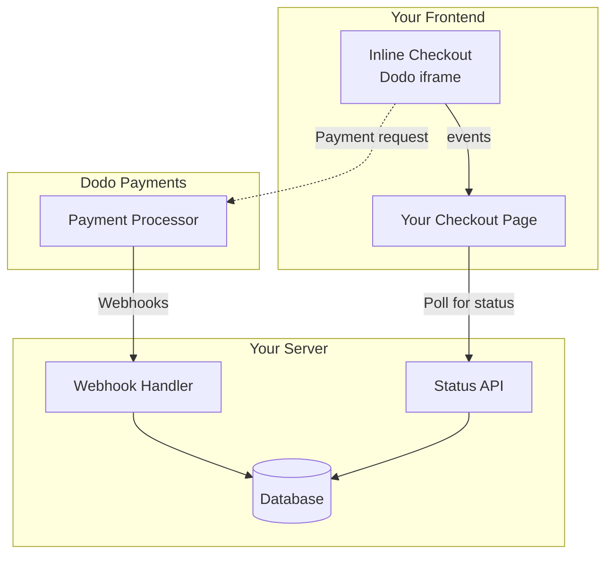

## Overview

Inline checkout lets you create fully integrated checkout experiences that blend seamlessly with your website or application. Unlike the [overlay checkout](/developer-resources/overlay-checkout), which opens as a modal on top of your page, inline checkout embeds the payment form directly into your page layout.

Using inline checkout, you can:

- Create checkout experiences that are fully integrated with your app or website
- Let Dodo Payments securely capture customer and payment information in an optimized checkout frame
- Display items, totals, and other information from Dodo Payments on your page
- Use SDK methods and events to build advanced checkout experiences

<Frame>
    
</Frame>

## How It Works

Inline checkout works by embedding a secure Dodo Payments frame into your website or app.

The checkout frame handles collecting customer information and capturing payment details. Your page displays the items list, totals, and options for changing what's on the checkout. The SDK lets your page and the checkout frame interact with each other.

Dodo Payments automatically creates a subscription when a checkout completes, ready for you to provision.

<Note>
The inline checkout frame securely handles all sensitive payment information, ensuring PCI compliance without additional certification on your end.
</Note>

## What Makes a Good Inline Checkout?

It's important that customers know who they're buying from, what they're buying, and how much they're paying.

To build an inline checkout that's compliant and optimized for conversion, your implementation must include:

<Frame caption="Example inline checkout layout showing required elements">
    
</Frame>

1. **Recurring information**: If recurring, how often it recurs and the total to pay on renewal. If a trial, how long the trial lasts.
2. **Item descriptions**: A description of what's being purchased.
3. **Transaction totals**: Transaction totals, including subtotal, total tax, and grand total. Be sure to include the currency too.
4. **Dodo Payments footer**: The full inline checkout frame, including the checkout footer that has information about Dodo Payments, our terms of sale, and our privacy policy.
5. **Refund policy**: A link to your refund policy, if it differs from the Dodo Payments standard refund policy.

<Warning>
Always display the complete inline checkout frame, including the footer. Removing or hiding legal information violates compliance requirements.
</Warning>

## Customer Journey

The checkout flow is determined by your checkout session configuration. Depending on how you configure the checkout session, customers will experience a checkout that may present all information on a single page or across multiple steps.

<Steps>
<Step title="Customer opens checkout">

You can open inline checkout by passing items or an existing transaction. Use the SDK to show and update on-page information, and SDK methods to update items based on customer interaction.
    

</Step>

<Step title="Customer enters their details">

Inline checkout first asks customers to enter their email address, select their country, and (where required) enter their ZIP or postal code. This step gathers all necessary information to determine taxes and available payment options.

You can prefill customer details and present saved addresses to streamline the experience.

</Step>

<Step title="Customer selects payment method">

After entering their details, customers are presented with available payment methods and the payment form. Options may include credit or debit card, PayPal, Apple Pay, Google Pay, and other local payment methods based on their location.

Display saved payment methods if available to speed up checkout.


</Step>

<Step title="Checkout completed">

Dodo Payments routes every payment to the best acquirer for that sale to get the best possible chance of success. Customers enter a success workflow that you can build.


</Step>

<Step title="Dodo Payments creates subscription">

Dodo Payments automatically creates a subscription for the customer, ready for you to provision. The payment method the customer used is held on file for renewals or subscription changes.


</Step>
</Steps>

## Quick Start

Get started with the Dodo Payments Inline Checkout in just a few lines of code:

```typescript
import { DodoPayments } from "dodopayments-checkout";

// Initialize the SDK for inline mode
DodoPayments.Initialize({
  mode: "test",
  displayType: "inline",
  onEvent: (event) => {
    console.log("Checkout event:", event);
  },
});

// Open checkout in a specific container
DodoPayments.Checkout.open({
  checkoutUrl: "https://test.dodopayments.com/session/cks_123",
  elementId: "dodo-inline-checkout" // ID of the container element
});
```

<Tip>
Ensure you have a container element with the corresponding `id` on your page: `<div id="dodo-inline-checkout"></div>`.
</Tip>

## Step-by-Step Integration Guide

<Steps>
<Step title="Install the SDK">

Install the Dodo Payments Checkout SDK:

<CodeGroup>

```bash npm
npm install dodopayments-checkout
```

```bash yarn
yarn add dodopayments-checkout
```

```bash pnpm
pnpm add dodopayments-checkout
```

</CodeGroup>

</Step>

<Step title="Initialize the SDK for Inline Display">

Initialize the SDK and specify `displayType: 'inline'`. You should also listen for the `checkout.breakdown` event to update your UI with real-time tax and total calculations.

```typescript
import { DodoPayments } from "dodopayments-checkout";

DodoPayments.Initialize({
  mode: "test",
  displayType: "inline",
  onEvent: (event) => {
    if (event.event_type === "checkout.breakdown") {
      const breakdown = event.data?.message;
      // Update your UI with breakdown.subTotal, breakdown.tax, breakdown.total, etc.
    }
  },
});
```

</Step>

<Step title="Create a Container Element">

Add an element to your HTML where the checkout frame will be injected:

```html
<div id="dodo-inline-checkout"></div>
```

</Step>

<Step title="Open the Checkout">

Call `DodoPayments.Checkout.open()` with the `checkoutUrl` and the `elementId` of your container:

```typescript
DodoPayments.Checkout.open({
  checkoutUrl: "https://test.dodopayments.com/session/cks_123",
  elementId: "dodo-inline-checkout"
});
```

</Step>

<Step title="Test Your Integration">

1. Start your development server:

```bash
npm run dev
```

2. Test the checkout flow:
   - Enter your email and address details in the inline frame.
   - Verify that your custom order summary updates in real-time.
   - Test the payment flow using test credentials.
   - Confirm redirects work correctly.

<Check>
You should see `checkout.breakdown` events logged in your browser console if you added a console log in the `onEvent` callback.
</Check>

</Step>

<Step title="Go Live">

When you're ready for production:

1. Change the mode to `'live'`:

```typescript
DodoPayments.Initialize({
  mode: "live",
  displayType: "inline",
  onEvent: (event) => {
    // Handle events
  }
});
```

2. Update your checkout URLs to use live checkout sessions from your backend.
3. Test the complete flow in production.

</Step>
</Steps>

## Complete React Example

This example demonstrates how to implement a custom order summary alongside the inline checkout, keeping them in sync using the `checkout.breakdown` event.

```tsx
"use client";

import { useEffect, useState } from 'react';
import { DodoPayments, CheckoutBreakdownData } from 'dodopayments-checkout';

export default function CheckoutPage() {
  const [breakdown, setBreakdown] = useState<Partial<CheckoutBreakdownData>>({});

  useEffect(() => {
    // 1. Initialize the SDK
    DodoPayments.Initialize({
      mode: 'test',
      displayType: 'inline',
      onEvent: (event) => {
        // 2. Listen for the 'checkout.breakdown' event
        if (event.event_type === "checkout.breakdown") {
          const message = event.data?.message as CheckoutBreakdownData;
          if (message) setBreakdown(message);
        }
      }
    });

    // 3. Open the checkout in the specified container
    DodoPayments.Checkout.open({
      checkoutUrl: 'https://test.dodopayments.com/session/cks_123',
      elementId: 'dodo-inline-checkout'
    });

    return () => DodoPayments.Checkout.close();
  }, []);

  const format = (amt: number | null | undefined, curr: string | null | undefined) => 
    amt != null && curr ? `${curr} ${(amt/100).toFixed(2)}` : '0.00';

  const currency = breakdown.currency ?? breakdown.finalTotalCurrency ?? '';

  return (
    <div className="flex flex-col md:flex-row min-h-screen">
      {/* Left Side - Checkout Form */}
      <div className="w-full md:w-1/2 flex items-center">
        <div id="dodo-inline-checkout" className='w-full' />
      </div>

      {/* Right Side - Custom Order Summary */}
      <div className="w-full md:w-1/2 p-8 bg-gray-50">
        <h2 className="text-2xl font-bold mb-4">Order Summary</h2>
        <div className="space-y-2">
          {breakdown.subTotal && (
            <div className="flex justify-between">
              <span>Subtotal</span>
              <span>{format(breakdown.subTotal, currency)}</span>
            </div>
          )}
          {breakdown.discount && (
            <div className="flex justify-between">
              <span>Discount</span>
              <span>{format(breakdown.discount, currency)}</span>
            </div>
          )}
          {breakdown.tax != null && (
            <div className="flex justify-between">
              <span>Tax</span>
              <span>{format(breakdown.tax, currency)}</span>
            </div>
          )}
          <hr />
          {(breakdown.finalTotal ?? breakdown.total) && (
            <div className="flex justify-between font-bold text-xl">
              <span>Total</span>
              <span>{format(breakdown.finalTotal ?? breakdown.total, breakdown.finalTotalCurrency ?? currency)}</span>
            </div>
          )}
        </div>
      </div>
    </div>
  );
}

```

## API Reference

### Configuration

#### Initialize Options

```typescript
interface InitializeOptions {
  mode: "test" | "live";
  displayType: "inline"; // Required for inline checkout
  onEvent: (event: CheckoutEvent) => void;
}
```

| Option | Type | Required | Description |
|--------|------|----------|-------------|
| `mode` | `"test" \| "live"` | Yes | Environment mode. |
| `displayType` | `"inline" \| "overlay"` | Yes | Must be set to `"inline"` to embed the checkout. |
| `onEvent` | `function` | Yes | Callback function for handling checkout events. |

#### Checkout Options

```typescript
export type FontSize = "xs" | "sm" | "md" | "lg" | "xl" | "2xl";
export type FontWeight = "normal" | "medium" | "bold" | "extraBold";

interface CheckoutOptions {
  checkoutUrl: string;
  elementId: string; // Required for inline checkout
  options?: {
    showTimer?: boolean;
    showSecurityBadge?: boolean;
    manualRedirect?: boolean;
    payButtonText?: string;
    fontSize?: FontSize;
    fontWeight?: FontWeight;
  };
}
```

| Option | Type | Required | Description |
|--------|------|----------|-------------|
| `checkoutUrl` | `string` | Yes | عنوان URL لجلسة الخروج. |
| `elementId` | `string` | Yes | `id` لعنصر DOM الذي يجب عرض الخروج بداخله. |
| `options.showTimer` | `boolean` | No | عرض أو إخفاء مؤقت الخروج. القيمة الافتراضية هي `true`. عند تعطيله، ستتلقى حدث `checkout.link_expired` عند انتهاء الجلسة. |
| `options.showSecurityBadge` | `boolean` | No | عرض أو إخفاء شارة الأمان. القيمة الافتراضية هي `true`. |
| `options.manualRedirect` | `boolean` | No | عند تمكينه، لن يعيد الخروج التوجيه تلقائيًا بعد الإكمال. بدلًا من ذلك، ستتلقى حدثي `checkout.status` و`checkout.redirect_requested` لتتعامل مع التوجيه بنفسك. |
| `options.payButtonText` | `string` | No | نص مخصص لعرضه على زر الدفع. |
| `options.fontSize` | `FontSize` | No | حجم الخط العام لواجهة الخروج. |
| `options.fontWeight` | `FontWeight` | No | سمك الخط العام لواجهة الخروج. |

### Methods

#### Open Checkout

Opens the checkout frame in the specified container.

```typescript
DodoPayments.Checkout.open({
  checkoutUrl: "https://test.dodopayments.com/session/cks_123",
  elementId: "dodo-inline-checkout"
});
```

You can also pass additional options to customize the checkout behavior:

```typescript
DodoPayments.Checkout.open({
  checkoutUrl: "https://test.dodopayments.com/session/cks_123",
  elementId: "dodo-inline-checkout",
  options: {
    showTimer: false,
    showSecurityBadge: false,
    manualRedirect: true,
    payButtonText: "Pay Now",
  },
});
```

When using `manualRedirect`, handle the checkout completion in your `onEvent` callback:

```typescript
DodoPayments.Initialize({
  mode: "test",
  displayType: "inline",
  onEvent: (event) => {
    if (event.event_type === "checkout.status") {
      const status = event.data?.message?.status;
      // Handle status: "succeeded", "failed", or "processing"
    }
    if (event.event_type === "checkout.redirect_requested") {
      const redirectUrl = event.data?.message?.redirect_to;
      // Redirect the customer manually
      window.location.href = redirectUrl;
    }
    if (event.event_type === "checkout.link_expired") {
      // Handle expired checkout session
    }
  },
});
```

#### Close Checkout

Programmatically removes the checkout frame and cleans up event listeners.

```typescript
DodoPayments.Checkout.close();
```

#### Check Status

Returns whether the checkout frame is currently injected.

```typescript
const isOpen = DodoPayments.Checkout.isOpen();
// Returns: boolean
```

### Events

The SDK provides real-time events through the `onEvent` callback. For inline checkout, `checkout.breakdown` is particularly useful for syncing your UI.

| Event Type | Description |
|------------|-------------|
| `checkout.opened` | Checkout frame has been loaded. |
| `checkout.form_ready` | Checkout form is ready to receive user input. Useful for hiding loading states and showing the checkout UI. |
| `checkout.breakdown` | Fired when prices, taxes, or discounts are updated. |
| `checkout.customer_details_submitted` | Customer details have been submitted. |
| `checkout.pay_button_clicked` | Fired when the customer clicks the pay button. Useful for analytics and tracking conversion funnels. |
| `checkout.redirect` | Checkout will perform a redirect (e.g., to a bank page). |
| `checkout.error` | An error occurred during checkout. |
| `checkout.link_expired` | Fired when the checkout session expires. Only received when `showTimer` is set to `false`. |
| `checkout.status` | Fired when `manualRedirect` is enabled. Contains the checkout status (`succeeded`, `failed`, or `processing`). |
| `checkout.redirect_requested` | Fired when `manualRedirect` is enabled. Contains the URL to redirect the customer to. |

#### Checkout Breakdown Data

The `checkout.breakdown` event provides the following data:

```typescript
interface CheckoutBreakdownData {
  subTotal?: number;          // Amount in cents
  discount?: number;         // Amount in cents
  tax?: number;              // Amount in cents
  total?: number;            // Amount in cents
  currency?: string;         // e.g., "USD"
  finalTotal?: number;       // Final amount including adjustments
  finalTotalCurrency?: string; // Currency for the final total
}
```

#### Checkout Status Event Data

When `manualRedirect` is enabled, you receive the `checkout.status` event with the following data:

```typescript
interface CheckoutStatusEventData {
  message: {
    status?: "succeeded" | "failed" | "processing";
  };
}
```

#### Checkout Redirect Requested Event Data

When `manualRedirect` is enabled, you receive the `checkout.redirect_requested` event with the following data:

```typescript
interface CheckoutRedirectRequestedEventData {
  message: {
    redirect_to?: string;
  };
}
```

#### Understanding the Breakdown Event

The `checkout.breakdown` event is the primary way to keep your application's UI in sync with the Dodo Payments checkout state.

**When it fires:**
- **On initialization**: Immediately after the checkout frame is loaded and ready.
- **On address change**: Whenever the customer selects a country or enters a postal code that results in a tax recalculation.

**Field Details:**

| Field | Description |
|-------|-------------|
| `subTotal` | The sum of all line items in the session before any discounts or taxes are applied. |
| `discount` | The total value of all applied discounts. |
| `tax` | The calculated tax amount. In `inline` mode, this updates dynamically as the user interacts with the address fields. |
| `total` | The mathematical result of `subTotal - discount + tax` in the session's base currency. |
| `currency` | The ISO currency code (e.g., `"USD"`) for the standard subtotal, discount, and tax values. |
| `finalTotal` | The actual amount the customer is charged. This may include additional foreign exchange adjustments or local payment method fees that aren't part of the basic price breakdown. |
| `finalTotalCurrency` | The currency in which the customer is actually paying. This can differ from `currency` if purchasing power parity or local currency conversion is active. |

**Key Integration Tips:**

1.  **Currency Formatting**: Prices are always returned as integers in the smallest currency unit (e.g., cents for USD, yen for JPY). To display them, divide by 100 (or the appropriate power of 10) or use a formatting library like `Intl.NumberFormat`.
2.  **Handling Initial States**: When the checkout first loads, `tax` and `discount` may be `0` or `null` until the user provides their billing information or applies a code. Your UI should handle these states gracefully (e.g., showing a dash `—` or hiding the row).
3.  **The "Final Total" vs "Total"**: While `total` gives you the standard price calculation, `finalTotal` is the source of truth for the transaction. If `finalTotal` is present, it reflects exactly what will be charged to the customer's card, including any dynamic adjustments.
4.  **Real-time Feedback**: Use the `tax` field to show users that taxes are being calculated in real-time. This provides a "live" feel to your checkout page and reduces friction during the address entry step.

## Implementation Options

### Package Manager Installation

Install via npm, yarn, or pnpm as shown in the [Step-by-Step Integration Guide](#step-by-step-integration-guide).

### CDN Implementation

For quick integration without a build step, you can use our CDN:

```html
<!DOCTYPE html>
<html lang="en">
<head>
    <meta charset="UTF-8">
    <meta name="viewport" content="width=device-width, initial-scale=1.0">
    <title>Dodo Payments Inline Checkout</title>
    
    <!-- Load DodoPayments -->
    <script src="https://cdn.jsdelivr.net/npm/dodopayments-checkout@latest/dist/index.js"></script>
    <script>
        // Initialize the SDK
        DodoPaymentsCheckout.DodoPayments.Initialize({
            mode: "test",
            displayType: "inline",
            onEvent: (event) => {
                console.log('Checkout event:', event);
            }
        });
    </script>
</head>
<body>
    <div id="dodo-inline-checkout"></div>

    <script>
        // Open the checkout
        DodoPaymentsCheckout.DodoPayments.Checkout.open({
            checkoutUrl: "https://test.dodopayments.com/session/cks_123",
            elementId: "dodo-inline-checkout"
        });
    </script>
</body>
</html>
```

## تحديث طريقة الدفع

يدعم الخروج المضمّن **تحديث طرق الدفع** للاشتراكات. عندما يحتاج العميل إلى تحديث طريقة الدفع — سواء لاشتراك نشط أو لإعادة تنشيط اشتراك موقوف — يمكنك عرض تدفق التحديث مباشرةً داخل تخطيط صفحتك.

### كيف يعمل

1. استدعِ [واجهة برمجة تطبيقات تحديث طريقة الدفع](/features/subscription#update-payment-method-for-active-subscription) للحصول على `payment_link`:

```typescript
const response = await client.subscriptions.updatePaymentMethod('sub_123', {
  type: 'new',
  return_url: 'https://example.com/return'
});
```

2. مرّر `payment_link` التي تم إرجاعها كـ `checkoutUrl` لفتح الخروج المضمّن:

```typescript
DodoPayments.Checkout.open({
  checkoutUrl: response.payment_link,
  elementId: "dodo-inline-checkout"
});
```

يعرض الإطار المضمّن نموذج جمع طريقة الدفع فقط. يمكن للعملاء إدخال تفاصيل بطاقة جديدة أو اختيار طريقة دفع محفوظة دون مغادرة صفحتك.

### بالنسبة للاشتراكات الموقوفة

عند تحديث طريقة الدفع لاشتراك في الحالة `on_hold`، تنشئ Dodo Payments تلقائيًا رسومًا مقابل أي مستحقات متبقية. راقب خدمات الويب `payment.succeeded` و`subscription.active` لتأكيد إعادة التنشيط.

```typescript
const response = await client.subscriptions.updatePaymentMethod('sub_123', {
  type: 'new',
  return_url: 'https://example.com/return'
});

if (response.payment_id) {
  // Charge created for remaining dues
  // Open inline checkout for payment collection
  DodoPayments.Checkout.open({
    checkoutUrl: response.payment_link,
    elementId: "dodo-inline-checkout"
  });
}
```

<Tip>
يمكنك أيضًا استخدام طريقة دفع محفوظة موجودة بدلًا من جمع تفاصيل جديدة بتمرير `type: 'existing'` مع `payment_method_id` إلى واجهة تحديث طريقة الدفع.
</Tip>

## التعامل مع الأخطاء

يقدم SDK معلومات تفصيلية عن الأخطاء عبر نظام الأحداث. نفّذ دائمًا معالجة مناسبة للأخطاء في رد نداء `onEvent` الخاص بك:

```typescript
DodoPayments.Initialize({
  mode: "test",
  displayType: "inline",
  onEvent: (event: CheckoutEvent) => {
    if (event.event_type === "checkout.error") {
      console.error("Checkout error:", event.data?.message);
      // Handle error appropriately
    }
  }
});
```

<Warning>
تعامل دائمًا مع حدث `checkout.error` لتوفير تجربة مستخدم جيدة عند حدوث مشكلات.
</Warning>

## أفضل الممارسات

1. **تصميم متجاوب**: تأكد من أن عنصر الحاوية لديك يحتوي على عرض وارتفاع كافيين. سيقوم الإطار المضمّن عادةً بتوسيع نفسه لملء الحاوية.
2. **المزامنة**: استخدم حدث `checkout.breakdown` لمزامنة ملخص الطلب المخصص أو جداول الأسعار مع ما يراه المستخدم في إطار الخروج.
3. **حالات الهيكل العظمي**: اعرض مؤشر تحميل في الحاوية حتى يتم إطلاق حدث `checkout.opened`.
4. **التنظيف**: نادِ `DodoPayments.Checkout.close()` عند إزالة المكون لتنظيف الإطار المضمّن ومستمعي الأحداث.

<Info>
بالنسبة لتطبيقات الوضع الليلي، يُفضل استخدام `#0d0d0d` كلون خلفية لتحقيق تكامل بصري مثالي مع إطار الخروج المضمّن.
</Info>

## التحقق من حالة الدفع

<Warning>
لا تعتمد فقط على أحداث الخروج المضمّن لتحديد نجاح أو فشل الدفع. نفّذ دائمًا التحقق من جانب الخادم باستخدام خدمات الويب و/أو الاستطلاع.
</Warning>

### لماذا يعتبر التحقق من جانب الخادم ضروريًا

بينما توفر أحداث الخروج المضمّن مثل `checkout.status` تغذية راجعة في الوقت الفعلي، لا ينبغي أن تكون المصدر الوحيد لحقيقة حالة الدفع. يمكن أن تؤدي مشاكل الشبكة، أو تعطل المتصفح، أو إغلاق المستخدم للصفحة إلى فقد الأحداث. لضمان تحقق موثوق من الدفع:

1. **يجب أن يستمع خادمك إلى أحداث الويب** - ترسل Dodo Payments خدمات الويب عند تغير حالات الدفع
2. **نفّذ آلية استطلاع** - يجب أن يستعلم الواجهة الأمامية عن خادمك للحصول على تحديثات الحالة
3. **اجمع بين الطريقتين** - استخدم خدمات الويب كمصدر أساسي والاستطلاع كحل احتياطي

### البنية الموصى بها



### خطوات التنفيذ

**1. الاستماع إلى أحداث الخروج** - عند نقر المستخدم على الدفع، ابدأ التحضير للتحقق من الحالة:

```typescript
onEvent: (event) => {
  if (event.event_type === 'checkout.status') {
    // Start polling your server for confirmed status
    startPolling();
  }
}
```

**2. استعلم خادمك** - أنشئ نقطة نهاية تتحقق من حالة الدفع في قاعدة البيانات الخاصة بك (المحدثة بواسطة خدمات الويب):

```typescript
// Poll every 2 seconds until status is confirmed
const interval = setInterval(async () => {
  const { status } = await fetch(`/api/payments/${paymentId}/status`).then(r => r.json());
  if (status === 'succeeded' || status === 'failed') {
    clearInterval(interval);
    handlePaymentResult(status);
  }
}, 2000);
```

**3. التعامل مع خدمات الويب في الخادم** - حدّث قاعدة البيانات عند إرسال Dodo لخمات الويب `payment.succeeded` أو `payment.failed`. راجع [توثيق خدمات الويب](/developer-resources/webhooks) للاطلاع على التفاصيل.

### التعامل مع عمليات التوجيه (3DS، Google Pay، UPI)

عند استخدام `manualRedirect: true`، تتطلب بعض طرق الدفع إعادة توجيه المستخدم بعيدًا عن صفحتك للمصادقة:

- **3D Secure (3DS)** - مصادقة البطاقة
- **Google Pay** - مصادقة المحفظة في بعض التدفقات
- **UPI** - إعادة توجيهات طريقة الدفع الهندية

عندما يكون هناك حاجة إلى إعادة توجيه، ستتلقى حدث `checkout.redirect_requested`. أعد توجيه المستخدم إلى عنوان URL المزود:

```typescript
if (event.event_type === 'checkout.redirect_requested') {
  const redirectUrl = event.data?.message?.redirect_to;
  // Save payment ID before redirect, then redirect
  sessionStorage.setItem('pendingPaymentId', paymentId);
  window.location.href = redirectUrl;
}
```

بعد اكتمال المصادقة (نجاح أو فشل)، يعود المستخدم إلى صفحتك. **لا تفترض النجاح لمجرد عودة المستخدم.** بدلاً من ذلك:

1. تحقق مما إذا كان المستخدم يعود من إعادة توجيه (على سبيل المثال، عبر `sessionStorage`)
2. ابدأ استطلاع خادمك للحصول على حالة الدفع المؤكدة
3. عرض حالة "جاري التحقق من الدفع..." أثناء الاستطلاع
4. عرض واجهة مستخدم نجاح/فشل بناءً على الحالة المؤكدة من الخادم

<Tip>
تحقق دائمًا من حالة الدفع على جانب الخادم بعد عمليات إعادة التوجيه. مجرد عودة المستخدم إلى صفحتك تعني اكتمال المصادقة فقط — لا تشير إلى ما إذا نجحت عملية الدفع أو فشلت.
</Tip>

## استكشاف الأخطاء وإصلاحها

<AccordionGroup>
<Accordion title="Checkout frame is not appearing">
- تحقق من أن `elementId` يطابق `id` ل `div` موجود فعليًا في DOM.
- تأكد من أن `displayType: 'inline'` تم تمريره إلى `Initialize`.
- تحقق من أن `checkoutUrl` صالح.
</Accordion>

<Accordion title="Taxes are not updating in my UI">
- تأكد من الاستماع لحدث `checkout.breakdown`.
- يتم حساب الضرائب فقط بعد إدخال المستخدم لدولة ورمز بريدي صالحين في إطار الخروج.
</Accordion>
</AccordionGroup>

## تمكين المحافظ الرقمية

لمعرفة معلومات مفصلة حول إعداد Apple Pay وGoogle Pay والمحافظ الرقمية الأخرى، راجع صفحة <a href="/features/payment-methods/digital-wallets">المحافظ الرقمية</a>.

### إعداد سريع لـ Apple Pay

<Steps>
<Step title="Download domain association file">
قم بتنزيل [ملف ربط نطاق Apple Pay](http://checkout.dodopayments.com/.well-known/apple-developer-merchantid-domain-association).
</Step>

<Step title="Request activation">
أرسل بريدًا إلكترونيًا إلى **support@dodopayments.com** مع عنوان نطاق الإنتاج الخاص بك واطلب تفعيل Apple Pay.
</Step>

<Step title="Test after confirmation">
بمجرد التأكيد، تحقق من ظهور Apple Pay في الخروج وجرّب التدفق الكامل.
</Step>
</Steps>

<Warning>
يتطلب Apple Pay التحقق من النطاق قبل ظهوره في الإنتاج. تواصل مع الدعم قبل الإطلاق إذا كنت تخطط لتقديم Apple Pay.
</Warning>

## دعم المتصفحات

يدعم SDK الخروج من Dodo Payments المتصفحات التالية:

- Chrome (الأحدث)
- Firefox (الأحدث)
- Safari (الأحدث)
- Edge (الأحدث)
- IE11+

## الخروج المضمّن مقابل الخروج التراكبي

اختر نوع الخروج المناسب لحالة الاستخدام لديك:

| Feature | Inline Checkout | Overlay Checkout |
|---------|-----------------|------------------|
| Integration depth | Fully embedded in page | Modal on top of page |
| Layout control | Full control | Limited |
| Branding | Seamless | Separate from page |
| Implementation effort | Higher | Lower |
| Best for | Custom checkout pages, high-conversion flows | Quick integration, existing pages |

<Tip>
استخدم **الخروج المضمّن** عندما تريد أقصى درجات التحكم في تجربة الخروج ودمج العلامة التجارية بسلاسة. استخدم **الخروج التراكبي** للتكامل السريع مع تغييرات طفيفة في صفحاتك الحالية.
</Tip>

## الموارد ذات الصلة

<CardGroup cols={2}>
<Card title="Overlay Checkout" icon="layer-group" href="/developer-resources/overlay-checkout">
    استخدم الخروج التراكبي للتكامل السريع المعتمد على النافذة المنبثقة.
</Card>

<Card title="Checkout Sessions API" icon="code" href="/api-reference/checkout-sessions/create">
    أنشئ جلسات الخروج لتشغيل تجارب الدفع الخاصة بك.
</Card>

<Card title="Webhooks" icon="webhook" href="/developer-resources/webhooks">
    تعامل مع أحداث الدفع على جانب الخادم باستخدام خدمات الويب.
</Card>

<Card title="Integration Guide" icon="book" href="/developer-resources/integration-guide">
    دليل كامل لدمج Dodo Payments.
</Card>
</CardGroup>

لمزيد من المساعدة، زر [مجتمعنا على Discord](https://discord.gg/bYqAp4ayYh) أو تواصل مع فريق دعم المطورين لدينا.
