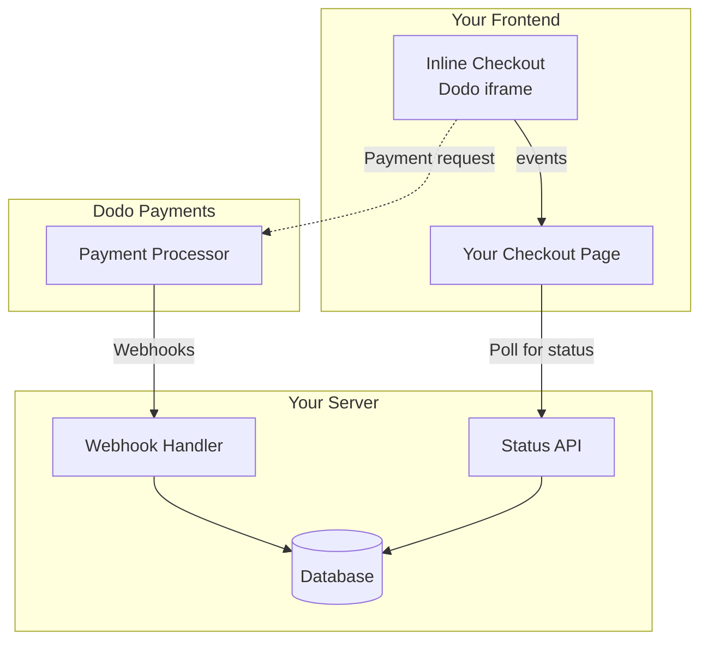

## نظرة عامة

تتيح لك عملية الدفع المباشر إنشاء تجارب دفع متكاملة تمامًا تتمازج بسلاسة مع موقعك الإلكتروني أو تطبيقك. على عكس [الدفع المنبثق](/developer-resources/overlay-checkout)، الذي يفتح كنافذة منبثقة فوق صفحتك، يقوم الدفع المباشر بتضمين نموذج الدفع مباشرة في تخطيط صفحتك.

باستخدام الدفع المباشر، يمكنك:

- إنشاء تجارب دفع متكاملة تمامًا مع تطبيقك أو موقعك الإلكتروني
- السماح لـ Dodo Payments بالتقاط معلومات العملاء والدفع بشكل آمن في إطار دفع محسن
- عرض العناصر، والمجموعات، ومعلومات أخرى من Dodo Payments على صفحتك
- استخدام طرق وأحداث SDK لبناء تجارب دفع متقدمة

<Frame>
    
</Frame>

## كيف يعمل

يعمل الدفع المباشر عن طريق تضمين إطار Dodo Payments الآمن في موقعك الإلكتروني أو تطبيقك.

يتولى إطار الدفع جمع معلومات العملاء والتقاط تفاصيل الدفع. تعرض صفحتك قائمة العناصر، والمجموعات، والخيارات لتغيير ما هو موجود في عملية الدفع. يسمح لك SDK بتفاعل صفحتك مع إطار الدفع.

تقوم Dodo Payments تلقائيًا بإنشاء اشتراك عند اكتمال عملية الدفع، جاهزًا للتوفير.

<Note>
يتولى إطار السحب المدمج معالجة جميع معلومات الدفع الحساسة بأمان، مما يضمن الامتثال لمعيار PCI دون الحاجة إلى شهادة إضافية من جانبك.
</Note>

## ما الذي يجعل الدفع المباشر جيدًا؟

من المهم أن يعرف العملاء من يشترون منه، وما الذي يشترونه، وكم يدفعون.

لبناء عملية دفع مباشرة متوافقة ومحسّنة للتحويل، يجب أن تتضمن تنفيذك:

{/* LOCKED_PATTERN_2c3203bfa100605bc2704d01e7dccd32 */}
    
</Frame>

1. **معلومات متكررة**: إذا كانت متكررة، كم مرة تتكرر والمبلغ المطلوب دفعه عند التجديد. إذا كانت تجربة مجانية، كم من الوقت تستمر التجربة.
2. **وصف العناصر**: وصف لما يتم شراؤه.
3. **مجموع المعاملات**: مجموع المعاملات، بما في ذلك المجموع الفرعي، والضرائب الإجمالية، والمجموع الكلي. تأكد من تضمين العملة أيضًا.
4. **تذييل Dodo Payments**: إطار الدفع المباشر الكامل، بما في ذلك تذييل الدفع الذي يحتوي على معلومات حول Dodo Payments، وشروط البيع، وسياسة الخصوصية الخاصة بنا.
5. **سياسة الاسترداد**: رابط إلى سياسة الاسترداد الخاصة بك، إذا كانت تختلف عن سياسة الاسترداد القياسية لـ Dodo Payments.

<Warning>
اعرض دائمًا الإطار الكامل للسحب المدمج، بما في ذلك التذييل. إن إزالة أو إخفاء المعلومات القانونية ينتهك متطلبات الامتثال.
</Warning>

## رحلة العميل

تحدد تكوين جلسة الدفع الخاصة بك تدفق عملية الدفع. اعتمادًا على كيفية تكوين جلسة الدفع، سيختبر العملاء عملية دفع قد تعرض جميع المعلومات في صفحة واحدة أو عبر خطوات متعددة.

<Steps>

يمكنك فتح الدفع الفوري عن طريق تمرير العناصر أو معاملة موجودة. استخدم SDK لعرض وتحديث المعلومات على الصفحة، وطرق SDK لتحديث العناصر بناءً على تفاعل العميل.
    

</Step>

{/* LOCKED_PATTERN_271a3373ec4ee2458dad7f9a80e26855 */}

يطلب الدفع المباشر أولاً من العملاء إدخال عنوان بريدهم الإلكتروني، واختيار بلدهم، و(حيثما كان مطلوبًا) إدخال الرمز البريدي أو الرمز البريدي. تجمع هذه الخطوة جميع المعلومات اللازمة لتحديد الضرائب وطرق الدفع المتاحة.

يمكنك ملء تفاصيل العملاء مسبقًا وعرض العناوين المحفوظة لتبسيط التجربة.

</Step>

{/* LOCKED_PATTERN_1234bf83f7f396022f1c91c09356f654 */}

بعد إدخال تفاصيلهم، يتم تقديم طرق الدفع المتاحة للعملاء ونموذج الدفع. قد تشمل الخيارات بطاقة ائتمان أو بطاقة خصم، PayPal، Apple Pay، Google Pay، وطرق دفع محلية أخرى بناءً على موقعهم.

عرض طرق الدفع المحفوظة إذا كانت متاحة لتسريع عملية الدفع.


</Step>

{/* LOCKED_PATTERN_3250600b8fe70b0b1b5c169861bc3240 */}

تقوم Dodo Payments بتوجيه كل عملية دفع إلى أفضل جهة إصدار لتلك المعاملة للحصول على أفضل فرصة للنجاح. يدخل العملاء في سير عمل النجاح الذي يمكنك بناؤه.


</Step>

{/* LOCKED_PATTERN_fe28b170edb53eebdbefd92e22425bda */}

تقوم Dodo Payments تلقائيًا بإنشاء اشتراك للعميل، جاهزًا للتوفير. يتم الاحتفاظ بطريقة الدفع التي استخدمها العميل في السجل للتجديدات أو تغييرات الاشتراك.


</Step>
</Steps>

## البداية السريعة

ابدأ مع الدفع الفوري من Dodo Payments في بضع أسطر من التعليمات البرمجية:

```typescript
import { DodoPayments } from "dodopayments-checkout";

// Initialize the SDK for inline mode
DodoPayments.Initialize({
  mode: "test",
  displayType: "inline",
  onEvent: (event) => {
    console.log("Checkout event:", event);
  },
});

// Open checkout in a specific container
DodoPayments.Checkout.open({
  checkoutUrl: "https://test.dodopayments.com/session/cks_123",
  elementId: "dodo-inline-checkout" // ID of the container element
});
```

<Tip>
تأكد من وجود عنصر حاوية يحتوي على `id` المقابل على صفحتك: `<div id="dodo-inline-checkout"></div>`.
</Tip>

## دليل التكامل خطوة بخطوة

<Steps>
{/* LOCKED_PATTERN_776027320500bde6b99bac6bed1cc64d */}

قم بتثبيت SDK الدفع من Dodo Payments:

<CodeGroup>

```bash npm
npm install dodopayments-checkout
```

```bash yarn
yarn add dodopayments-checkout
```

```bash pnpm
pnpm add dodopayments-checkout
```

</CodeGroup>

</Step>

{/* LOCKED_PATTERN_c9671e1641fc4b5a7d02836b54fde4a6 */}

Initialize the SDK and specify `displayType: 'inline'`. You should also listen for the `checkout.breakdown` event to update your UI with real-time tax and total calculations.

```typescript
import { DodoPayments } from "dodopayments-checkout";

DodoPayments.Initialize({
  mode: "test",
  displayType: "inline",
  onEvent: (event) => {
    if (event.event_type === "checkout.breakdown") {
      const breakdown = event.data?.message;
      // Update your UI with breakdown.subTotal, breakdown.tax, breakdown.total, etc.
    }
  },
});
```

</Step>

{/* LOCKED_PATTERN_7ddf8b1f0258fda183d82c15a3096a03 */}

أضف عنصرًا إلى HTML الخاص بك حيث سيتم حقن إطار الدفع:

```html
<div id="dodo-inline-checkout"></div>
```

</Step>

{/* LOCKED_PATTERN_4817384312c2fcbac3336846aa45db8f */}

استدعِ `DodoPayments.Checkout.open()` باستخدام `checkoutUrl` و `elementId` الخاصين بحاويتك:


```typescript
DodoPayments.Checkout.open({
  checkoutUrl: "https://test.dodopayments.com/session/cks_123",
  elementId: "dodo-inline-checkout"
});
```

</Step>

{/* LOCKED_PATTERN_97e1d34fe501fd0a9dd5e96c0a83886c */}

1. ابدأ خادم التطوير الخاص بك:

```bash
npm run dev
```

2. اختبر تدفق الدفع:
   - أدخل تفاصيل بريدك الإلكتروني والعنوان في الإطار الفوري.
   - تحقق من أن ملخص الطلب المخصص الخاص بك يتم تحديثه في الوقت الحقيقي.
   - اختبر تدفق الدفع باستخدام بيانات اعتماد الاختبار.
   - تأكد من أن عمليات إعادة التوجيه تعمل بشكل صحيح.

يجب أن ترى أحداث `checkout.breakdown` مسجلة في وحدة تحكم المتصفح إذا قمت بإضافة سجل وحدة تحكم في رد الاتصال `onEvent`.

</Step>

{/* LOCKED_PATTERN_b11a46166b3a72b09cb0a82966c3c591 */}

عندما تكون جاهزًا للإنتاج:

1. غيّر الوضع إلى `'live'`:

```typescript
DodoPayments.Initialize({
  mode: "live",
  displayType: "inline",
  onEvent: (event) => {
    // Handle events
  }
});
```

2. قم بتحديث عناوين URL للدفع الخاصة بك لاستخدام جلسات الدفع الحية من الخلفية الخاصة بك.
3. اختبر التدفق الكامل في الإنتاج.

</Step>
</Steps>

## مثال كامل على React

يوضح هذا المثال كيفية تنفيذ ملخص طلب مخصص إلى جانب السحب المدمج، مع إبقائهما متزامنين باستخدام حدث `checkout.breakdown`.

```tsx
"use client";

import { useEffect, useState } from 'react';
import { DodoPayments, CheckoutBreakdownData } from 'dodopayments-checkout';

export default function CheckoutPage() {
  const [breakdown, setBreakdown] = useState<Partial<CheckoutBreakdownData>>({});

  useEffect(() => {
    // 1. Initialize the SDK
    DodoPayments.Initialize({
      mode: 'test',
      displayType: 'inline',
      onEvent: (event) => {
        // 2. Listen for the 'checkout.breakdown' event
        if (event.event_type === "checkout.breakdown") {
          const message = event.data?.message as CheckoutBreakdownData;
          if (message) setBreakdown(message);
        }
      }
    });

    // 3. Open the checkout in the specified container
    DodoPayments.Checkout.open({
      checkoutUrl: 'https://test.dodopayments.com/session/cks_123',
      elementId: 'dodo-inline-checkout'
    });

    return () => DodoPayments.Checkout.close();
  }, []);

  const format = (amt: number | null | undefined, curr: string | null | undefined) => 
    amt != null && curr ? `${curr} ${(amt/100).toFixed(2)}` : '0.00';

  const currency = breakdown.currency ?? breakdown.finalTotalCurrency ?? '';

  return (
    <div className="flex flex-col md:flex-row min-h-screen">
      {/* Left Side - Checkout Form */}
      <div className="w-full md:w-1/2 flex items-center">
        <div id="dodo-inline-checkout" className='w-full' />
      </div>

      {/* Right Side - Custom Order Summary */}
      <div className="w-full md:w-1/2 p-8 bg-gray-50">
        <h2 className="text-2xl font-bold mb-4">Order Summary</h2>
        <div className="space-y-2">
          {breakdown.subTotal && (
            <div className="flex justify-between">
              <span>Subtotal</span>
              <span>{format(breakdown.subTotal, currency)}</span>
            </div>
          )}
          {breakdown.discount && (
            <div className="flex justify-between">
              <span>Discount</span>
              <span>{format(breakdown.discount, currency)}</span>
            </div>
          )}
          {breakdown.tax != null && (
            <div className="flex justify-between">
              <span>Tax</span>
              <span>{format(breakdown.tax, currency)}</span>
            </div>
          )}
          <hr />
          {(breakdown.finalTotal ?? breakdown.total) && (
            <div className="flex justify-between font-bold text-xl">
              <span>Total</span>
              <span>{format(breakdown.finalTotal ?? breakdown.total, breakdown.finalTotalCurrency ?? currency)}</span>
            </div>
          )}
        </div>
      </div>
    </div>
  );
}

```

## مرجع API

### التكوين

#### خيارات التهيئة

```typescript
interface InitializeOptions {
  mode: "test" | "live";
  displayType: "inline"; // Required for inline checkout
  onEvent: (event: CheckoutEvent) => void;
}
```

| الخيار | النوع | مطلوب | الوصف |
|--------|------|----------|-------------|
| `mode` | `"test" \| "live"` | Yes | وضع البيئة. |
| `displayType` | `"inline" \| "overlay"` | Yes | يجب تعيينه إلى `"inline"` لتضمين السحب. |
| `onEvent` | `function` | Yes | دالة رد الاتصال لمعالجة أحداث السحب. |

#### خيارات الدفع

```typescript
export type FontSize = "xs" | "sm" | "md" | "lg" | "xl" | "2xl";
export type FontWeight = "normal" | "medium" | "bold" | "extraBold";

interface CheckoutOptions {
  checkoutUrl: string;
  elementId: string; // Required for inline checkout
  options?: {
    showTimer?: boolean;
    showSecurityBadge?: boolean;
    manualRedirect?: boolean;
    themeConfig?: ThemeConfig;
    payButtonText?: string;
    fontSize?: FontSize;
    fontWeight?: FontWeight;
  };
}
```

| الخيار | النوع | مطلوب | الوصف |
|--------|------|----------|-------------|
| `checkoutUrl` | `string` | Yes | عنوان URL لجلسة السحب. |
| `elementId` | `string` | Yes | `id` لعنصر DOM حيث يجب عرض السحب. |
| `options.showTimer` | `boolean` | No | إظهار أو إخفاء مؤقت السحب. القيمة الافتراضية `true`. عند تعطيله، ستتلقى حدث `checkout.link_expired` عندما تنتهي الجلسة. |
| `options.showSecurityBadge` | `boolean` | No | إظهار أو إخفاء شارة الأمان. القيمة الافتراضية `true`. |
| `options.manualRedirect` | `boolean` | No | عند تمكينه، لن يعيد السحب التوجيه تلقائيًا بعد الإكمال. بدلًا من ذلك، ستتلقى أحداث `checkout.status` و `checkout.redirect_requested` للتعامل مع إعادة التوجيه بنفسك. |
| `options.themeConfig` | `ThemeConfig` | No | تكوين المظهر المخصص. |
| `options.payButtonText` | `string` | No | نص مخصص يظهر على زر الدفع. |
| `options.fontSize` | `FontSize` | No | حجم الخط العام للسحب. |
| `options.fontWeight` | `FontWeight` | No | سمك الخط العام للسحب. |

### الطرق

#### فتح الدفع

يفتح إطار الدفع في الحاوية المحددة.

```typescript
DodoPayments.Checkout.open({
  checkoutUrl: "https://test.dodopayments.com/session/cks_123",
  elementId: "dodo-inline-checkout"
});
```

يمكنك أيضًا تمرير خيارات إضافية لتخصيص سلوك الدفع:

```typescript
DodoPayments.Checkout.open({
  checkoutUrl: "https://test.dodopayments.com/session/cks_123",
  elementId: "dodo-inline-checkout",
  options: {
    showTimer: false,
    showSecurityBadge: false,
    manualRedirect: true,
    payButtonText: "Pay Now",
  },
});
```

عند استخدام `manualRedirect`، عالج إكمال السحب في رد الاتصال `onEvent` الخاص بك:

```typescript
DodoPayments.Initialize({
  mode: "test",
  displayType: "inline",
  onEvent: (event) => {
    if (event.event_type === "checkout.status") {
      const status = event.data?.message?.status;
      // Handle status: "succeeded", "failed", or "processing"
    }
    if (event.event_type === "checkout.redirect_requested") {
      const redirectUrl = event.data?.message?.redirect_to;
      // Redirect the customer manually
      window.location.href = redirectUrl;
    }
    if (event.event_type === "checkout.link_expired") {
      // Handle expired checkout session
    }
  },
});
```

#### إغلاق عملية الدفع

يتم إزالة إطار الدفع برمجيًا وتنظيف مستمعي الأحداث.

```typescript
DodoPayments.Checkout.close();
```

#### تحقق من الحالة

يعود ما إذا كان إطار الدفع مدرجًا حاليًا.

```typescript
const isOpen = DodoPayments.Checkout.isOpen();
// Returns: boolean
```

### الأحداث

يوفر SDK أحداثًا في الوقت الحقيقي من خلال رد الاتصال `onEvent`. بالنسبة للسحب المدمج، فإن `checkout.breakdown` مفيد بشكل خاص لمزامنة واجهة المستخدم الخاصة بك.

| نوع الحدث | الوصف |
|------------|-------------|
| `checkout.opened` | تم تحميل إطار السحب. |
| `checkout.form_ready` | استمارة السحب جاهزة لتلقي إدخال المستخدم. مفيد لإخفاء حالات التحميل وإظهار واجهة السحب. |
| `checkout.breakdown` | يُطلق عندما يتم تحديث الأسعار أو الضرائب أو الخصومات. |
| `checkout.customer_details_submitted` | تم إرسال بيانات العميل. |
| `checkout.pay_button_clicked` | يُطلق عندما ينقر العميل على زر الدفع. مفيد للتحليلات وتتبع قنوات التحويل. |
| `checkout.redirect` | سيقوم السحب بإجراء إعادة توجيه (على سبيل المثال، إلى صفحة بنك). |
| `checkout.error` | حدث خطأ أثناء السحب. |
| `checkout.link_expired` | يُطلق عندما تنتهي صلاحية جلسة السحب. يُستقبل فقط عندما يتم تعيين `showTimer` إلى `false`. |
| `checkout.status` | يُطلق عندما يتم تمكين `manualRedirect`. يحتوي على حالة السحب (`succeeded`، `failed`، أو `processing`). |
| `checkout.redirect_requested` | يُطلق عندما يتم تمكين `manualRedirect`. يحتوي على عنوان URL لإعادة توجيه العميل إليه. |

#### بيانات تفصيل عملية الدفع

يوفر حدث `checkout.breakdown` البيانات التالية:

```typescript
interface CheckoutBreakdownData {
  subTotal?: number;          // Amount in cents
  discount?: number;         // Amount in cents
  tax?: number;              // Amount in cents
  total?: number;            // Amount in cents
  currency?: string;         // e.g., "USD"
  finalTotal?: number;       // Final amount including adjustments
  finalTotalCurrency?: string; // Currency for the final total
}
```

#### بيانات حدث حالة الدفع

عند تمكين `manualRedirect`، تتلقى حدث `checkout.status` بالبيانات التالية:

```typescript
interface CheckoutStatusEventData {
  message: {
    status?: "succeeded" | "failed" | "processing";
  };
}
```

#### بيانات حدث إعادة توجيه الدفع المطلوبة

عند تمكين `manualRedirect`، تتلقى حدث `checkout.redirect_requested` بالبيانات التالية:

```typescript
interface CheckoutRedirectRequestedEventData {
  message: {
    redirect_to?: string;
  };
}
```

#### فهم حدث التفصيل

يعد حدث `checkout.breakdown` الطريقة الأساسية لمزامنة واجهة تطبيقك مع حالة السحب في Dodo Payments.

**عندما يتم إطلاقه:**
- **عند التهيئة**: مباشرة بعد تحميل إطار الدفع واستعداده.
- **عند تغيير العنوان**: كلما اختار العميل دولة أو أدخل رمزًا بريديًا يؤدي إلى إعادة حساب الضرائب.

**تفاصيل الحقول:**

| الحقل | الوصف |
|-------|-------------|
| `subTotal` | مجموع جميع العناصر في الجلسة قبل تطبيق أي خصومات أو ضرائب. |
| `discount` | القيمة الإجمالية لجميع الخصومات المطبقة. |
| `tax` | مبلغ الضرائب المحسوب. في وضع `inline`، يتم تحديثه ديناميكيًا أثناء تفاعل المستخدم مع حقول العنوان. |
| `total` | النتيجة الحسابية لـ `subTotal - discount + tax` بعملة الأساس للجلسة. |
| `currency` | رمز العملة ISO (على سبيل المثال، `"USD"`) للمجاميع الفرعية القياسية، والخصومات، والضرائب. |
| `finalTotal` | المبلغ الفعلي الذي يتم تحصيله من العميل. قد يشمل تعديلات إضافية في سعر الصرف أو رسوم طرق الدفع المحلية التي لا تُعد جزءًا من تفصيل السعر الأساسي. |
| `finalTotalCurrency` | العملة التي يدفع بها العميل فعليًا. قد تختلف عن `currency` إذا كان هناك تعادل في القوة الشرائية أو تحويل عملة محلية. |

**نصائح تكامل رئيسية:**

1. **تنسيق العملة**: يتم إرجاع الأسعار دائمًا كأعداد صحيحة بوحدة العملة الأصغر (على سبيل المثال، سنتات لعملة USD، ين لعملة JPY). لعرضها، اقسم على 100 (أو القوة المناسبة من 10) أو استخدم مكتبة تنسيق مثل `Intl.NumberFormat`.
2. **معالجة الحالات الأولية**: عندما يتم تحميل السحب لأول مرة، قد تكون `tax` و `discount` `0` أو `null` حتى يقدم المستخدم معلومات الفوترة أو يطبق رمزًا. يجب على واجهة المستخدم الخاصة بك التعامل مع هذه الحالات بسلاسة (مثل عرض شَرطة `—` أو إخفاء الصف).
3. **«الإجمالي النهائي» مقابل «الإجمالي»**: بينما يمنحك `total` حساب السعر القياسي، فإن `finalTotal` هو مصدر الحقيقة للمعاملة. إذا كان `finalTotal` موجودًا، فإنه يعكس بالضبط ما سيتم تحصيله من بطاقة العميل، بما في ذلك أي تعديلات ديناميكية.
4. **التغذية الراجعة في الوقت الحقيقي**: استخدم حقل `tax` لإظهار أن الضرائب يتم حسابها في الوقت الحقيقي. هذا يوفر شعورًا «حيًا» لصفحة السحب ويقلل الاحتكاك أثناء خطوة إدخال العنوان.

## خيارات التنفيذ

### تثبيت عبر مدير الحزم

قم بالتثبيت عبر npm أو yarn أو pnpm كما هو موضح في [دليل التكامل خطوة بخطوة](#step-by-step-integration-guide).

### تنفيذ CDN

للتكامل السريع دون خطوة بناء، يمكنك استخدام CDN الخاص بنا:

```html
<!DOCTYPE html>
<html lang="en">
<head>
    <meta charset="UTF-8">
    <meta name="viewport" content="width=device-width, initial-scale=1.0">
    <title>Dodo Payments Inline Checkout</title>
    
    <!-- Load DodoPayments -->
    <script src="https://cdn.jsdelivr.net/npm/dodopayments-checkout@latest/dist/index.js"></script>
    <script>
        // Initialize the SDK
        DodoPaymentsCheckout.DodoPayments.Initialize({
            mode: "test",
            displayType: "inline",
            onEvent: (event) => {
                console.log('Checkout event:', event);
            }
        });
    </script>
</head>
<body>
    <div id="dodo-inline-checkout"></div>

    <script>
        // Open the checkout
        DodoPaymentsCheckout.DodoPayments.Checkout.open({
            checkoutUrl: "https://test.dodopayments.com/session/cks_123",
            elementId: "dodo-inline-checkout"
        });
    </script>
</body>
</html>
```

### تخصيص السمة

يمكنك تخصيص مظهر السحب عن طريق تمرير كائن `themeConfig` في معلمة `options` عند فتح السحب. يدعم تكوين المظهر وضعي الضوء والظلام، مما يتيح لك تخصيص الألوان والحواف والنصوص والأزرار ونصف القطر.

<Info>
يغطي هذا القسم **تكوين المظهر من جانب العميل** باستخدام SDK للسحب. يمكنك أيضًا تكوين المظاهر **من جانب الخادم** عند إنشاء جلسة سحب عبر واجهة برمجة التطبيقات باستخدام معلمة `theme_config`. اطّلع على [Checkout Theme Customization](/features/checkout#checkout-theme-customization) للتكوين على مستوى واجهة برمجة التطبيقات.
</Info>

#### التكوين الأساسي للمظهر

```typescript
DodoPayments.Checkout.open({
  checkoutUrl: "https://checkout.dodopayments.com/session/cks_123",
  options: {
    themeConfig: {
      light: {
        bgPrimary: "#FFFFFF",
        textPrimary: "#344054",
        buttonPrimary: "#A6E500",
      },
      dark: {
        bgPrimary: "#0D0D0D",
        textPrimary: "#FFFFFF",
        buttonPrimary: "#A6E500",
      },
      radius: "8px",
    },
  },
});
```

#### التكوين الكامل للمظهر

جميع خصائص المظهر المتاحة:

```typescript
DodoPayments.Checkout.open({
  checkoutUrl: "https://checkout.dodopayments.com/session/cks_123",
  options: {
    themeConfig: {
      light: {
        // Background colors
        bgPrimary: "#FFFFFF",        // Primary background color
        bgSecondary: "#F9FAFB",      // Secondary background color (e.g., tabs)
        
        // Border colors
        borderPrimary: "#D0D5DD",     // Primary border color
        borderSecondary: "#6B7280",  // Secondary border color
        inputFocusBorder: "#D0D5DD", // Input focus border color
        
        // Text colors
        textPrimary: "#344054",       // Primary text color
        textSecondary: "#6B7280",    // Secondary text color
        textPlaceholder: "#667085",  // Placeholder text color
        textError: "#D92D20",        // Error text color
        textSuccess: "#10B981",      // Success text color
        
        // Button colors
        buttonPrimary: "#A6E500",           // Primary button background
        buttonPrimaryHover: "#8CC500",      // Primary button hover state
        buttonTextPrimary: "#0D0D0D",       // Primary button text color
        buttonSecondary: "#F3F4F6",         // Secondary button background
        buttonSecondaryHover: "#E5E7EB",     // Secondary button hover state
        buttonTextSecondary: "#344054",     // Secondary button text color
      },
      dark: {
        // Background colors
        bgPrimary: "#0D0D0D",
        bgSecondary: "#1A1A1A",
        
        // Border colors
        borderPrimary: "#323232",
        borderSecondary: "#D1D5DB",
        inputFocusBorder: "#323232",
        
        // Text colors
        textPrimary: "#FFFFFF",
        textSecondary: "#909090",
        textPlaceholder: "#9CA3AF",
        textError: "#F97066",
        textSuccess: "#34D399",
        
        // Button colors
        buttonPrimary: "#A6E500",
        buttonPrimaryHover: "#8CC500",
        buttonTextPrimary: "#0D0D0D",
        buttonSecondary: "#2A2A2A",
        buttonSecondaryHover: "#3A3A3A",
        buttonTextSecondary: "#FFFFFF",
      },
      radius: "8px", // Border radius for inputs, buttons, and tabs
    },
  },
});
```

#### الوضع الفاتح فقط

إذا كنت تريد تخصيص المظهر الفاتح فقط:

```typescript
DodoPayments.Checkout.open({
  checkoutUrl: "https://checkout.dodopayments.com/session/cks_123",
  options: {
    themeConfig: {
      light: {
        bgPrimary: "#FFFFFF",
        textPrimary: "#000000",
        buttonPrimary: "#0070F3",
      },
      radius: "12px",
    },
  },
});
```

#### الوضع الداكن فقط

إذا كنت تريد تخصيص المظهر الداكن فقط:

```typescript
DodoPayments.Checkout.open({
  checkoutUrl: "https://checkout.dodopayments.com/session/cks_123",
  options: {
    themeConfig: {
      dark: {
        bgPrimary: "#000000",
        textPrimary: "#FFFFFF",
        buttonPrimary: "#0070F3",
      },
      radius: "12px",
    },
  },
});
```

#### تجاوز جزئي للمظهر

يمكنك تجاوز خصائص محددة فقط. سيستخدم السحب القيم الافتراضية للخصائص التي لا تحددها:

```typescript
DodoPayments.Checkout.open({
  checkoutUrl: "https://checkout.dodopayments.com/session/cks_123",
  options: {
    themeConfig: {
      light: {
        buttonPrimary: "#FF6B6B", // Only override primary button color
      },
      radius: "16px", // Override border radius
    },
  },
});
```

#### تكوين المظهر مع خيارات أخرى

يمكنك دمج تكوين المظهر مع خيارات السحب الأخرى:

```typescript
DodoPayments.Checkout.open({
  checkoutUrl: "https://checkout.dodopayments.com/session/cks_123",
  options: {
    showTimer: true,
    showSecurityBadge: true,
    manualRedirect: false,
    themeConfig: {
      light: {
        bgPrimary: "#FFFFFF",
        buttonPrimary: "#A6E500",
      },
      dark: {
        bgPrimary: "#0D0D0D",
        buttonPrimary: "#A6E500",
      },
      radius: "8px",
    },
  },
});
```

#### أنواع TypeScript

بالنسبة لمستخدمي TypeScript، تم تصدير جميع أنواع تكوين المظهر:

```typescript
import { ThemeConfig, ThemeModeConfig } from "dodopayments-checkout";

const themeConfig: ThemeConfig = {
  light: {
    bgPrimary: "#FFFFFF",
    // ... other properties
  },
  dark: {
    bgPrimary: "#0D0D0D",
    // ... other properties
  },
  radius: "8px",
};
```

## تحديث طريقة الدفع

يدعم السحب المدمج **تحديثات طريقة الدفع** للاشتراكات. عندما يحتاج العميل إلى تحديث طريقة الدفع — سواءً لاشتراك نشط أو لإعادة تفعيل اشتراك موقوف — يمكنك عرض مسار التحديث مباشرةً داخل تخطيط صفحتك.

### كيف يعمل

1. استدعِ [Update Payment Method API](/features/subscription#update-payment-method-for-active-subscription) للحصول على `payment_link`:

```typescript
const response = await client.subscriptions.updatePaymentMethod('sub_123', {
  type: 'new',
  return_url: 'https://example.com/return'
});
```

2. مرِّر `payment_link` المسترجَعة كـ `checkoutUrl` لفتح السحب المدمج:

```typescript
DodoPayments.Checkout.open({
  checkoutUrl: response.payment_link,
  elementId: "dodo-inline-checkout"
});
```

يعرض الإطار المدمج فقط نموذج جمع طريقة الدفع. يمكن للعملاء إدخال تفاصيل بطاقة جديدة أو اختيار طريقة دفع محفوظة دون مغادرة صفحتك.

### بالنسبة للاشتراكات المعلقة

عند تحديث طريقة الدفع لاشتراك في حالة `on_hold`، تقوم Dodo Payments تلقائيًا بإنشاء رسم لأي مستحقات متبقية. راقب الويب هوك `payment.succeeded` و `subscription.active` لتأكيد إعادة التنشيط.

```typescript
const response = await client.subscriptions.updatePaymentMethod('sub_123', {
  type: 'new',
  return_url: 'https://example.com/return'
});

if (response.payment_id) {
  // Charge created for remaining dues
  // Open inline checkout for payment collection
  DodoPayments.Checkout.open({
    checkoutUrl: response.payment_link,
    elementId: "dodo-inline-checkout"
  });
}
```

<Tip>
يمكنك أيضًا استخدام طريقة دفع محفوظة موجودة بدلًا من جمع تفاصيل جديدة عن طريق تمرير `type: 'existing'` مع `payment_method_id` إلى واجهة تحديث طريقة الدفع.
</Tip>

## التعامل مع الأخطاء

يوفر SDK معلومات مفصلة عن الأخطاء من خلال نظام الأحداث. نفّذ دائمًا معالجة الأخطاء المناسبة في رد الاتصال `onEvent` الخاص بك:

```typescript
DodoPayments.Initialize({
  mode: "test",
  displayType: "inline",
  onEvent: (event: CheckoutEvent) => {
    if (event.event_type === "checkout.error") {
      console.error("Checkout error:", event.data?.message);
      // Handle error appropriately
    }
  }
});
```

تعامل دائمًا مع حدث `checkout.error` لتوفير تجربة مستخدم جيدة عند حدوث مشكلات.

## أفضل الممارسات

1. **التصميم المتجاوب**: تأكد من أن عنصر الحاوية لديه عرض وارتفاع كافيان. سيتوسع الإطار عادةً ليملأ الحاوية.
2. **المزامنة**: استخدم حدث `checkout.breakdown` للحفاظ على تزامن ملخص الطلب المخصص أو جداول الأسعار مع ما يراه المستخدم في إطار السحب.
3. **حالات الهيكل العظمي**: اعرض مؤشر تحميل في حاويتك حتى يتم إطلاق حدث `checkout.opened`.
4. **التنظيف**: استدعِ `DodoPayments.Checkout.close()` عندما تتم إزالة المكون الخاص بك لتنظيف الإطار والمستمعين للأحداث.

<Info>
بالنسبة لتنفيذات الوضع الداكن، يُوصى باستخدام `#0d0d0d` كلون خلفية لتحقيق تكامل بصري مثالي مع إطار السحب المدمج.
</Info>

## التحقق من حالة الدفع

<Warning>
لا تعتمد فقط على أحداث السحب المدمج لتحديد نجاح أو فشل الدفع. نفّذ دائمًا تحققًا من جانب الخادم باستخدام الويب هوك و/أو الاستطلاع.
</Warning>

### لماذا التحقق من جانب الخادم ضروري

بينما توفر أحداث السحب المدمج مثل `checkout.status` تغذية راجعة في الوقت الحقيقي، يجب ألا تكون مصدر الحقيقة الوحيد لتحديد حالة الدفع. قد تتسبب مشاكل الشبكة أو تعطل المتصفح أو إغلاق المستخدم للصفحة في فقدان الأحداث. لضمان تحقق موثوق من الدفع:

1. **يجب أن يستمع خادمك لأحداث الويب هوك** - ترسل Dodo Payments ويب هوكس لتغييرات حالة الدفع
2. **نفّذ آلية استطلاع** - يجب أن يستطلع الواجهات الأمامية خادمك للحصول على تحديثات الحالة
3. **ادمج كلا النهجين** - استخدم الويب هوك كمصدر أساسي والاستطلاع كخطة احتياطية

### البنية الموصى بها



### خطوات التنفيذ

**1. استمع لأحداث السحب** - عندما ينقر المستخدم على الدفع، ابدأ في الاستعداد للتحقق من الحالة:

```typescript
onEvent: (event) => {
  if (event.event_type === 'checkout.status') {
    // Start polling your server for confirmed status
    startPolling();
  }
}
```

**2. استطلع خادمك** - أنشئ نقطة نهاية تتحقق من قاعدة البيانات الخاصة بك للحصول على حالة الدفع (يتم تحديثها بواسطة الويب هوك):

```typescript
// Poll every 2 seconds until status is confirmed
const interval = setInterval(async () => {
  const { status } = await fetch(`/api/payments/${paymentId}/status`).then(r => r.json());
  if (status === 'succeeded' || status === 'failed') {
    clearInterval(interval);
    handlePaymentResult(status);
  }
}, 2000);
```

**3. تعامل مع الويب هوك من جانب الخادم** - حدّث قاعدة البيانات الخاصة بك عندما ترسل Dodo ويب هوك `payment.succeeded` أو `payment.failed`. راجع [Webhooks documentation](/developer-resources/webhooks) للحصول على التفاصيل.

### معالجة إعادة التوجيه (3DS، Google Pay، UPI)

عند استخدام `manualRedirect: true`، تتطلب بعض طرق الدفع إعادة توجيه المستخدم بعيدًا عن صفحتك للمصادقة:

- **3D Secure (3DS)** - مصادقة البطاقة
- **Google Pay** - مصادقة المحفظة في بعض التدفقات
- **UPI** - عمليات إعادة توجيه لطريقة الدفع الهندية

عندما تكون إعادة التوجيه مطلوبة، ستتلقى حدث `checkout.redirect_requested`. أعد توجيه المستخدم إلى عنوان URL المقدم:

```typescript
if (event.event_type === 'checkout.redirect_requested') {
  const redirectUrl = event.data?.message?.redirect_to;
  // Save payment ID before redirect, then redirect
  sessionStorage.setItem('pendingPaymentId', paymentId);
  window.location.href = redirectUrl;
}
```

بعد اكتمال المصادقة (نجاحًا أو فشلًا)، يعود المستخدم إلى صفحتك. **لا تفترض النجاح لمجرد عودة المستخدم.** بدلاً من ذلك:

1. تحقق مما إذا كان المستخدم عائدًا من إعادة توجيه (على سبيل المثال، عبر `sessionStorage`)
2. ابدأ في استطلاع خادمك للحصول على حالة الدفع المؤكدة
3. اعرض حالة «جارٍ التحقق من الدفع...» أثناء الاستطلاع
4. اعرض واجهة مستخدم للنجاح/الفشل بناءً على الحالة المؤكدة من الخادم

<Tip>
تحقق دائمًا من حالة الدفع من جانب الخادم بعد إعادة التوجيه. يعني عودة المستخدم إلى صفحتك فقط أن المصادقة اكتملت—لا يعني ما إذا كان الدفع ناجحًا أو فشل.
</Tip>

## استكشاف الأخطاء وإصلاحها

<AccordionGroup>
{/* LOCKED_PATTERN_93cff808dfbc871be9b4fbc9b88bb642 */}
- تحقق من أن `elementId` يتطابق مع `id` لعنصر `div` موجود فعليًا في DOM.
- تأكد من أن `displayType: 'inline'` قد تم تمريرها إلى `Initialize`.
- تحقق من أن `checkoutUrl` صالح.
</Accordion>

{/* LOCKED_PATTERN_05b89b97a7f9c53e2d9d7a4e480e2342 */}
- تأكد من أنك تستمع إلى حدث `checkout.breakdown`.
- لا يتم حساب الضرائب إلا بعد أن يدخل المستخدم دولة ورمزًا بريديًا صالحين في إطار السحب.
</Accordion>
</AccordionGroup>

## تمكين المحافظ الرقمية

لمزيد من المعلومات التفصيلية حول إعداد Apple Pay وGoogle Pay والمحافظ الرقمية الأخرى، راجع صفحة <a href="/features/payment-methods/digital-wallets">المحافظ الرقمية</a>.

### إعداد سريع لـ Apple Pay

<Steps>
{/* LOCKED_PATTERN_052fb22f687ef020f4d37c90a8329c23 */}
حمّل [ملف ارتباط مجال Apple Pay](http://checkout.dodopayments.com/.well-known/apple-developer-merchantid-domain-association).
</Step>

{/* LOCKED_PATTERN_3a44bb73d2b6657e3ef8dfb6df5437c3 */}
أرسل بريدًا إلكترونيًا إلى **support@dodopayments.com** مع عنوان نطاق الإنتاج الخاص بك واطلب تفعيل Apple Pay.
</Step>

{/* LOCKED_PATTERN_f4cb4ca481d047ba1b29ad7a11be722d */}
بمجرد التأكيد، تحقق من ظهور Apple Pay في السحب واختبر التدفق الكامل.
</Step>
</Steps>

<Warning>
يتطلب Apple Pay التحقق من النطاق قبل ظهوره في الإنتاج. اتصل بالدعم قبل إطلاق الخدمة إذا كنت تخطط لتقديم Apple Pay.
</Warning>

## دعم المتصفحات

يدعم SDK للسحب من Dodo Payments المتصفحات التالية:

- Chrome (latest)
- Firefox (latest)
- Safari (latest)
- Edge (latest)
- IE11+

## السحب المدمج مقابل السحب العلوي

اختر نوع السحب المناسب لحالة الاستخدام الخاصة بك:

| الميزة | السحب المدمج | السحب العلوي |
|---------|-----------------|------------------|
| عمق التكامل | مدمج بالكامل داخل الصفحة | نافذة منبثقة فوق الصفحة |
| التحكم في التخطيط | تحكم كامل | محدود |
| العلامة التجارية | سلس | منفصل عن الصفحة |
| جهد التنفيذ | أعلى | أقل |
| الأفضل لـ | صفحات سحب مخصصة، وتدفقات عالية التحويل | التكامل السريع، الصفحات الموجودة |

<Tip>
استخدم **السحب المدمج** عندما تريد أقصى درجة من التحكم في تجربة السحب وتكاملًا سلسًا مع العلامة التجارية. استخدم **السحب العلوي** للتكامل أسرع مع تغييرات طفيفة على صفحاتك الحالية.
</Tip>

## الموارد ذات الصلة

{/* LOCKED_PATTERN_bd3b9ce11ef978f59c6eb5461169b62d */}
{/* LOCKED_PATTERN_03192cb7afa497d816218ee2e453c19b */}
    استخدم السحب العلوي للتكامل السريع المستند إلى النوافذ المنبثقة.
{/* LOCKED_PATTERN_4ceaf3811b39bde3b7bfedbcf0487a0b */}

{/* LOCKED_PATTERN_5e9b3579ee53b9305eb4a383d135b798 */}
    أنشئ جلسات سحب لتشغيل تجارب السحب الخاصة بك.
{/* LOCKED_PATTERN_4ceaf3811b39bde3b7bfedbcf0487a0b */}

{/* LOCKED_PATTERN_4fdc255b113f889a339d4227d31c920b */}
    تعامل مع أحداث الدفع من جانب الخادم باستخدام الويب هوك.
{/* LOCKED_PATTERN_4ceaf3811b39bde3b7bfedbcf0487a0b */}

{/* LOCKED_PATTERN_4389e7f71e1a171de8ea420860f91acc */}
    الدليل الكامل لدمج Dodo Payments.
{/* LOCKED_PATTERN_4ceaf3811b39bde3b7bfedbcf0487a0b */}
{/* LOCKED_PATTERN_639ec37665c9a30d7ddbd3a284a688a5 */}

لمزيد من المساعدة، زر [مجتمع Discord](https://discord.gg/bYqAp4ayYh) أو تواصل مع فريق دعم المطورين لدينا.
