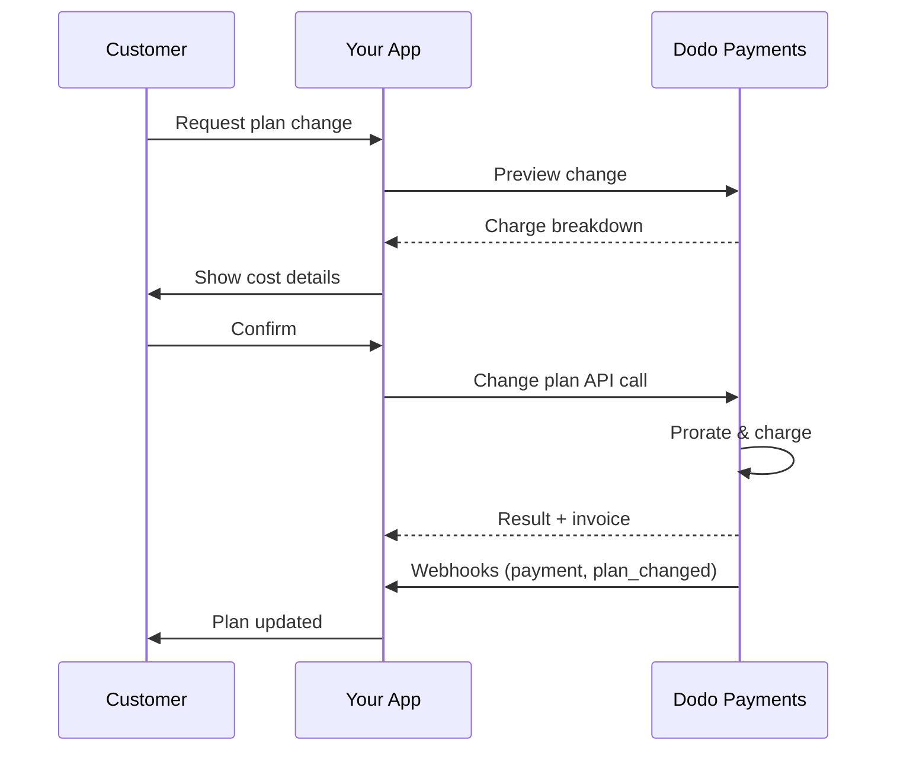
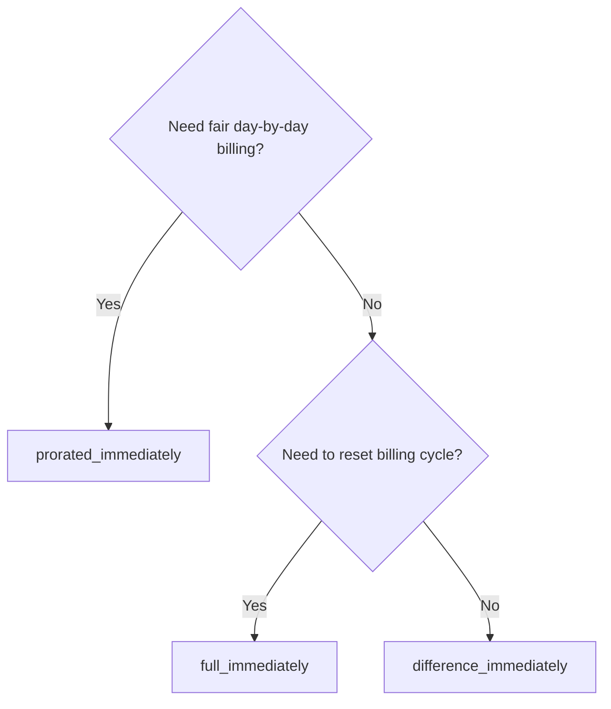
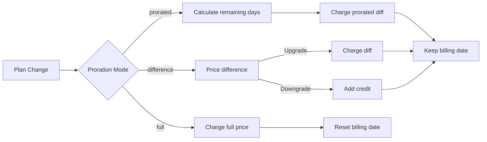

<CardGroup cols={3}>
<Card title="Change Plan API" icon="code" href="/api-reference/subscriptions/change-plan">
  Full API docs for updating subscriptions.
</Card>
<Card title="Plan Change Preview" icon="eye" href="/api-reference/subscriptions/preview-change-plan">
  See charge amounts before changing plans.
</Card>
<Card title="Integration Guide" icon="book" href="/developer-resources/subscription-integration-guide">
  Step-by-step subscription setup.
</Card>
</CardGroup>


## What is a subscription upgrade or downgrade?

Changing plans lets you move a customer between subscription tiers or quantities. Use it to:
- Align pricing with usage or features
- Move from monthly to annual (or vice versa)
- Adjust quantity for seat-based products

<Info>
Plan changes can trigger an immediate charge depending on the proration mode you choose.
</Info>

## When to use plan changes

- Upgrade when a customer needs more features, usage, or seats
- Downgrade when usage decreases
- Migrate users to a new product or price without cancelling their subscription

## Plan Change Flow



## Prerequisites

Before implementing subscription plan changes, ensure you have:

- A Dodo Payments merchant account with active subscription products
- API credentials (API key and webhook secret key) from the dashboard
- An existing active subscription to modify
- Webhook endpoint configured to handle subscription events

<Info>
For detailed setup instructions, see our [Integration Guide](/developer-resources/integration-guide#dashboard-setup).
</Info>

## Step-by-Step Implementation Guide

Follow this comprehensive guide to implement subscription plan changes in your application:

<Steps>
<Step title="Understand Plan Change Requirements">
Before implementing, determine:
- Which subscription products can be changed to which others
- What proration mode fits your business model
- How to handle failed plan changes gracefully
- Which webhook events to track for state management

<Tip>
Test plan changes thoroughly in test mode before implementing in production.
</Tip>
</Step>

<Step title="Choose Your Proration Strategy">
Select the billing approach that aligns with your business needs:

<Tabs>
<Tab title="prorated_immediately">
Best for: SaaS applications wanting to charge fairly for unused time
- Calculates exact prorated amount based on remaining cycle time
- Charges a prorated amount based on unused time remaining in the cycle
- Provides transparent billing to customers
</Tab>

<Tab title="difference_immediately">
Best for: Clear upgrade/downgrade scenarios
- Upgrade: Charge immediate difference (e.g., $30→$80 = charge $50)
- Downgrade: Credit remaining value for future renewals
- Simplifies billing logic and customer communication
</Tab>

<Tab title="full_immediately">
Best for: When you want to reset the billing cycle
- Charges full amount of new plan immediately
- Ignores remaining time from old plan
- Useful for annual to monthly transitions
</Tab>
</Tabs>
</Step>

<Step title="Implement the Change Plan API">
Use the Change Plan API to modify subscription details:

<ParamField path="subscription_id" type="string" required>
The ID of the active subscription to modify.
</ParamField>

<ParamField path="product_id" type="string" required>
The new product ID to change the subscription to.
</ParamField>

<ParamField path="quantity" type="integer" default="1">
Number of units for the new plan (for seat-based products).
</ParamField>

<ParamField path="proration_billing_mode" type="string" required>
How to handle immediate billing: `prorated_immediately`, `full_immediately`, or `difference_immediately`.
</ParamField>

<ParamField path="addons" type="array">
Optional addons for the new plan. Leaving this empty removes any existing addons.
</ParamField>

<ParamField path="on_payment_failure" type="string">
Controls behavior when the plan change payment fails:
- `prevent_change`: Keep subscription on current plan until payment succeeds
- `apply_change` (default): Apply plan change immediately regardless of payment outcome

If not specified, uses the business-level default setting.
</ParamField>
</Step>

<Step title="Handle Webhook Events">
Set up webhook handling to track plan change outcomes:

- `subscription.active`: Plan change successful, subscription updated
- `subscription.plan_changed`: Subscription plan changed (upgrade/downgrade/addon update)
- `subscription.on_hold`: Plan change charge failed, subscription paused
- `payment.succeeded`: Immediate charge for plan change succeeded
- `payment.failed`: Immediate charge failed

<Warning>
Always verify webhook signatures and implement idempotent event processing.
</Warning>
</Step>

<Step title="Update Your Application State">
Based on webhook events, update your application:
- Grant/revoke features based on new plan
- Update customer dashboard with new plan details
- Send confirmation emails about plan changes
- Log billing changes for audit purposes
</Step>

<Step title="Test and Monitor">
Thoroughly test your implementation:
- Test all proration modes with different scenarios
- Verify webhook handling works correctly
- Monitor plan change success rates
- Set up alerts for failed plan changes

<Check>
Your subscription plan change implementation is now ready for production use.
</Check>
</Step>
</Steps>

## Preview Plan Changes

Before committing to a plan change, use the Preview API to show customers exactly what they'll be charged:

<Tabs>
<Tab title="Node.js SDK">
```javascript
const preview = await client.subscriptions.previewChangePlan('sub_123', {
  product_id: 'prod_pro',
  quantity: 1,
  proration_billing_mode: 'prorated_immediately'
});

// Show customer the charge before confirming
console.log('Immediate charge:', preview.immediate_charge.summary);
console.log('New plan details:', preview.new_plan);
```
</Tab>

<Tab title="Python SDK">
```python
preview = client.subscriptions.preview_change_plan(
    subscription_id="sub_123",
    product_id="prod_pro",
    quantity=1,
    proration_billing_mode="prorated_immediately"
)

# Show customer the charge before confirming
print("Immediate charge:", preview.immediate_charge.summary)
print("New plan details:", preview.new_plan)
```
</Tab>
</Tabs>

<Tip>
Use the preview API to build confirmation dialogs that show customers the exact amount they'll be charged before they confirm a plan change.
</Tip>

## Change Plan API

Use the Change Plan API to modify product, quantity, and proration behavior for an active subscription.

### Quick start examples

<Tabs>
  <Tab title="Node.js SDK">
    ```javascript
    import DodoPayments from 'dodopayments';

    const client = new DodoPayments({
      bearerToken: process.env.DODO_PAYMENTS_API_KEY,
      environment: 'test_mode', // defaults to 'live_mode'
    });

    async function changePlan() {
      const result = await client.subscriptions.changePlan('sub_123', {
        product_id: 'prod_new',
        quantity: 3,
        proration_billing_mode: 'prorated_immediately',
        on_payment_failure: 'prevent_change', // Optional: control behavior on payment failure
      });
      console.log(result.status, result.invoice_id, result.payment_id);
    }

    changePlan();
    ```
  </Tab>
  <Tab title="Python SDK">
    ```python
    import os
    from dodopayments import DodoPayments

    client = DodoPayments(
        bearer_token=os.environ.get("DODO_PAYMENTS_API_KEY"),
        environment="test_mode",  # defaults to "live_mode"
    )

    result = client.subscriptions.change_plan(
        subscription_id="sub_123",
        product_id="prod_new",
        quantity=3,
        proration_billing_mode="prorated_immediately",
        on_payment_failure="prevent_change",  # Optional: control behavior on payment failure
    )
    print(result.status, result.get("invoice_id"), result.get("payment_id"))
    ```
  </Tab>
  <Tab title="Go SDK">
    ```go
    package main

    import (
      "context"
      "fmt"
      "github.com/dodopayments/dodopayments-go"
      "github.com/dodopayments/dodopayments-go/option"
    )

    func main() {
      client := dodopayments.NewClient(option.WithBearerToken("YOUR_TOKEN"))
      res, err := client.Subscriptions.ChangePlan(context.TODO(), dodopayments.SubscriptionChangePlanParams{
        SubscriptionID: dodopayments.F("sub_123"),
        ProductID:             dodopayments.F("prod_new"),
        Quantity:              dodopayments.F(int64(3)),
        ProrationBillingMode:  dodopayments.F(dodopayments.SubscriptionChangePlanParamsProrationBillingModeProratedImmediately),
        OnPaymentFailure:      dodopayments.F(dodopayments.OnPaymentFailurePreventChange), // Optional
      })
      if err != nil { panic(err) }
      fmt.Println(res.Status, res.InvoiceID, res.PaymentID)
    }
    ```
  </Tab>
  <Tab title="HTTP">
    ```bash
    curl -X POST "$DODO_API_BASE/subscriptions/sub_123/change-plan" \
      -H "Authorization: Bearer $DODO_PAYMENTS_API_KEY" \
      -H "Content-Type: application/json" \
      -d '{
        "product_id": "prod_new",
        "quantity": 3,
        "proration_billing_mode": "prorated_immediately",
        "on_payment_failure": "prevent_change"
      }'
    ```
  </Tab>
</Tabs>

```json Success
{
  "status": "processing",
  "subscription_id": "sub_123",
  "invoice_id": "inv_789",
  "payment_id": "pay_456",
  "proration_billing_mode": "prorated_immediately"
}
```
<Note>
Fields like <code>invoice_id</code> and <code>payment_id</code> are returned only when an immediate charge and/or invoice is created during the plan change. Always rely on webhook events (e.g., <code>payment.succeeded</code>, <code>subscription.plan_changed</code>) to confirm outcomes.
</Note>


<Warning>
If the immediate charge fails, the subscription may move to `subscription.on_hold` until payment succeeds.
</Warning>

## Managing Addons

When changing subscription plans, you can also modify addons:

```javascript
// Add addons to the new plan
await client.subscriptions.changePlan('sub_123', {
  product_id: 'prod_new',
  quantity: 1,
  proration_billing_mode: 'difference_immediately',
  addons: [
    { addon_id: 'addon_123', quantity: 2 }
  ]
});

// Remove all existing addons
await client.subscriptions.changePlan('sub_123', {
  product_id: 'prod_new',
  quantity: 1,
  proration_billing_mode: 'difference_immediately',
  addons: [] // Empty array removes all existing addons
});
```

<Info>
Addons are included in the proration calculation and will be charged according to the selected proration mode.
</Info>

## Proration modes

Choose how to bill the customer when changing plans:

#### `prorated_immediately`
- Charges for the partial difference in the current cycle
- If in trial, charges immediately and switches to the new plan now
- Downgrade: may generate a prorated credit applied to future renewals

#### `full_immediately`
- Charges the full amount of the new plan immediately
- Ignores remaining time from the old plan

<Info>
Credits created by downgrades using <code>difference_immediately</code> are subscription-scoped and distinct from <a href="/features/customer-credit">Customer Credits</a>. They automatically apply to future renewals of the same subscription and are not transferable between subscriptions.
</Info>

#### `difference_immediately`
- Upgrade: immediately charge the price difference between old and new plans
- Downgrade: add remaining value as internal credit to the subscription and auto-apply on renewals

| Feature | `prorated_immediately` | `difference_immediately` | `full_immediately` |
|---------|----------------------|------------------------|-------------------|
| **Upgrade charge** | Prorated difference for remaining days | Full price difference between plans | Full new plan price |
| **Downgrade credit** | Prorated credit for remaining days | Full price difference as credit | No credit |
| **Billing cycle** | Unchanged | Unchanged | Resets to today |
| **Trial behavior** | Ends trial, charges immediately | Ends trial, charges immediately | Ends trial, charges full amount |
| **Best for** | Fair time-based billing | Simple upgrade/downgrade math | Resetting billing cycles |
| **Complexity** | Medium (day calculation) | Low (simple subtraction) | Low (full charge) |




### Example scenarios

Use these canonical numbers consistently:
- Current plan: **Basic** at **$30/month**
- Upgrade target: **Pro** at **$80/month**
- Downgrade target (from Pro): **Starter** at **$20/month**
- Billing cycle: **30 days**, started on **January 1**
- Plan change happens on **January 16** (15 days remaining, 15 days used)

<AccordionGroup>
  <Accordion title="Upgrade: Basic ($30) → Pro ($80) with prorated_immediately">

    ```
    Step 1: Calculate unused credit from current plan
      Unused days = 15 out of 30 days
      Credit = $30 × (15/30) = $15.00

    Step 2: Calculate prorated cost of new plan
      Remaining days = 15 out of 30 days
      New plan cost = $80 × (15/30) = $40.00

    Step 3: Calculate immediate charge
      Charge = New plan cost − Credit
      Charge = $40.00 − $15.00 = $25.00

    → Customer pays $25.00 now
    → Next renewal (Feb 1): $80.00/month
    ```

    ```javascript
    await client.subscriptions.changePlan('sub_123', {
      product_id: 'prod_pro',
      quantity: 1,
      proration_billing_mode: 'prorated_immediately'
    })
    ```
  </Accordion>

  <Accordion title="Downgrade: Pro ($80) → Starter ($20) with prorated_immediately">

    ```
    Step 1: Calculate unused credit from current plan
      Unused days = 15 out of 30 days
      Credit = $80 × (15/30) = $40.00

    Step 2: Calculate prorated cost of new plan
      Remaining days = 15 out of 30 days
      New plan cost = $20 × (15/30) = $10.00

    Step 3: Calculate credit balance
      Credit = $40.00 − $10.00 = $30.00

    → No charge — $30.00 credit added to subscription
    → Credit auto-applies to future renewals
    → Next renewal (Feb 1): $20.00 − $30.00 credit = $0.00
    → Following renewal (Mar 1): $20.00 − $10.00 remaining credit = $10.00
    ```

    ```javascript
    await client.subscriptions.changePlan('sub_123', {
      product_id: 'prod_starter',
      quantity: 1,
      proration_billing_mode: 'prorated_immediately'
    })
    ```
  </Accordion>

  <Accordion title="Upgrade: Basic ($30) → Pro ($80) with difference_immediately">
    ```
    Immediate charge = New plan price − Old plan price
                     = $80 − $30
                     = $50.00

    → Customer pays $50.00 now (regardless of cycle position)
    → Next renewal (Feb 1): $80.00/month
    ```

    ```javascript
    await client.subscriptions.changePlan('sub_123', {
      product_id: 'prod_pro',
      quantity: 1,
      proration_billing_mode: 'difference_immediately'
    })
    ```
  </Accordion>

  <Accordion title="Downgrade: Pro ($80) → Starter ($20) with difference_immediately">
    ```
    Credit = Old plan price − New plan price
           = $80 − $20
           = $60.00

    → No charge — $60.00 credit added to subscription
    → Credit auto-applies to future renewals
    → Next renewal: $20.00 − $20.00 (from credit) = $0.00
    → Following renewal: $20.00 − $20.00 (from credit) = $0.00
    → Third renewal: $20.00 − $20.00 (from remaining credit) = $0.00
    ```

    ```javascript
    await client.subscriptions.changePlan('sub_123', {
      product_id: 'prod_starter',
      quantity: 1,
      proration_billing_mode: 'difference_immediately'
    })
    ```
  </Accordion>

  <Accordion title="Upgrade: Basic ($30) → Pro ($80) with full_immediately">
    ```
    Immediate charge = Full new plan price = $80.00

    → Customer pays $80.00 now
    → No credit for unused time on old plan
    → Billing cycle resets to today (January 16)
    → Next renewal: February 16 at $80.00/month
    ```

    ```javascript
    await client.subscriptions.changePlan('sub_123', {
      product_id: 'prod_pro',
      quantity: 1,
      proration_billing_mode: 'full_immediately'
    })
    ```
  </Accordion>

  <Accordion title="Mid-cycle upgrade with add-ons using prorated_immediately">

    ```
    Current: Basic plan ($30/month), no add-ons
    New: Pro plan ($80/month) + Extra Seats add-on ($10/seat × 3 seats = $30/month)
    Change on day 16 of 30 (15 days remaining)

    Step 1: Credit from current plan
      Credit = $30 × (15/30) = $15.00

    Step 2: Prorated cost of new plan + add-ons
      New plan = $80 × (15/30) = $40.00
      Add-ons = $30 × (15/30) = $15.00
      Total new = $55.00

    Step 3: Immediate charge
      Charge = $55.00 − $15.00 = $40.00

    → Customer pays $40.00 now
    → Next renewal: $80.00 + $30.00 = $110.00/month
    ```

    ```javascript
    await client.subscriptions.changePlan('sub_123', {
      product_id: 'prod_pro',
      quantity: 1,
      proration_billing_mode: 'prorated_immediately',
      addons: [
        { addon_id: 'addon_seats', quantity: 3 }
      ]
    })
    ```
  </Accordion>
</AccordionGroup>


### How each mode processes billing




<Tip>
Pick `prorated_immediately` for fair-time accounting; choose `full_immediately` to restart billing; use `difference_immediately` for simple upgrades and automatic credit on downgrades.
</Tip>

## Handling Payment Failures

Control what happens when a plan change payment fails using the `on_payment_failure` parameter.

### Payment Failure Modes

<Tabs>
<Tab title="prevent_change (Recommended for critical upgrades)">
**Behavior**: Keep the subscription on its current plan until payment succeeds.

- Plan change is marked as "pending"
- Customer retains access to their current plan
- Subscription moves to `active` state only after successful payment
- Useful when you want to ensure payment before granting upgraded features

```javascript
await client.subscriptions.changePlan('sub_123', {
  product_id: 'prod_pro',
  quantity: 1,
  proration_billing_mode: 'prorated_immediately',
  on_payment_failure: 'prevent_change'
});
```
</Tab>

<Tab title="apply_change (Default)">
**Behavior**: Apply the plan change immediately regardless of payment outcome.

- Plan change is applied even if payment fails
- Customer gets immediate access to the new plan
- Subscription may move to `on_hold` if payment fails
- Good for non-critical upgrades or when you trust the customer

```javascript
await client.subscriptions.changePlan('sub_123', {
  product_id: 'prod_pro',
  quantity: 1,
  proration_billing_mode: 'prorated_immediately',
  on_payment_failure: 'apply_change' // This is the default
});
```
</Tab>
</Tabs>

<Info>
If not specified, the `on_payment_failure` parameter uses your business-level default setting configured in the dashboard.
</Info>

### When to Use Each Mode

| Scenario | Recommended Mode | Reason |
|----------|------------------|--------|
| Upgrading to premium features | `prevent_change` | Ensure payment before granting access |
| Quantity increase (more seats) | `prevent_change` | Prevent usage without payment |
| Downgrading plans | `apply_change` | Customer is reducing spend |
| Trusted enterprise customers | `apply_change` | Lower risk of non-payment |
| Trial to paid conversion | `prevent_change` | Critical payment moment |

## Handling webhooks

Track subscription state through webhooks to confirm plan changes and payments.

### Event types to handle
- `subscription.active`: subscription activated
- `subscription.plan_changed`: subscription plan changed (upgrade/downgrade/addon changes)
- `subscription.on_hold`: charge failed, subscription paused
- `subscription.renewed`: renewal succeeded
- `payment.succeeded`: payment for plan change or renewal succeeded
- `payment.failed`: payment failed

<Info>
We recommend driving business logic from subscription events and using payment events for confirmation and reconciliation.
</Info>

### Verify signatures and handle intents

<Tabs>
  <Tab title="Next.js Route Handler">
    ```javascript
    import { NextRequest, NextResponse } from 'next/server';
    
    export async function POST(req) {
      const webhookId = req.headers.get('webhook-id');
      const webhookSignature = req.headers.get('webhook-signature');
      const webhookTimestamp = req.headers.get('webhook-timestamp');
      const secret = process.env.DODO_WEBHOOK_SECRET;
    
      const payload = await req.text();
      // verifySignature is a placeholder – in production, use a Standard Webhooks library
      const { valid, event } = await verifySignature(
        payload,
        { id: webhookId, signature: webhookSignature, timestamp: webhookTimestamp },
        secret
      );
      if (!valid) return NextResponse.json({ error: 'Invalid signature' }, { status: 400 });
    
      switch (event.type) {
        case 'subscription.active':
          // mark subscription active in your DB
          break;
        case 'subscription.plan_changed':
          // refresh entitlements and reflect the new plan in your UI
          break;
        case 'subscription.on_hold':
          // notify user to update payment method
          break;
        case 'subscription.renewed':
          // extend access window
          break;
        case 'payment.succeeded':
          // reconcile payment for plan change
          break;
        case 'payment.failed':
          // log and alert
          break;
        default:
          // ignore unknown events
          break;
      }
    
      return NextResponse.json({ received: true });
    }
    ```
  </Tab>
  <Tab title="Express.js">
    ```javascript
    import express from 'express';
    
    const app = express();
    app.post('/webhooks/dodo', express.raw({ type: 'application/json' }), async (req, res) => {
      const webhookId = req.header('webhook-id');
      const webhookSignature = req.header('webhook-signature');
      const webhookTimestamp = req.header('webhook-timestamp');
      const secret = process.env.DODO_WEBHOOK_SECRET;
      const payload = req.body.toString('utf8');
    
      const { valid, event } = await verifySignature(
        payload,
        { id: webhookId, signature: webhookSignature, timestamp: webhookTimestamp },
        secret
      );
      if (!valid) return res.status(400).send('Invalid signature');
    
      // handle events like above
      res.json({ received: true });
    });
    
    app.listen(3000);
    ```
  </Tab>
</Tabs>

<Note>
For detailed payload schemas, see the <a href="/developer-resources/webhooks/intents/subscription">Subscription webhook payloads</a> and <a href="/developer-resources/webhooks/intents/payment">Payment webhook payloads</a>.
</Note>

## Best Practices

Follow these recommendations for reliable subscription plan changes:

### Plan Change Strategy
- **Test thoroughly**: Always test plan changes in test mode before production
- **Choose proration carefully**: Select the proration mode that aligns with your business model
- **Handle failures gracefully**: Implement proper error handling and retry logic
- **Monitor success rates**: Track plan change success/failure rates and investigate issues

### Webhook Implementation
- **Verify signatures**: Always validate webhook signatures to ensure authenticity
- **Implement idempotency**: Handle duplicate webhook events gracefully
- **Process asynchronously**: Don't block webhook responses with heavy operations
- **Log everything**: Maintain detailed logs for debugging and audit purposes

### User Experience
- **Communicate clearly**: Inform customers about billing changes and timing
- **Provide confirmations**: Send email confirmations for successful plan changes
- **Handle edge cases**: Consider trial periods, prorations, and failed payments
- **Update UI immediately**: Reflect plan changes in your application interface

## Common Issues and Solutions

Resolve typical problems encountered during subscription plan changes:

<AccordionGroup>
<Accordion title="Charge created but subscription not updated">
**Symptoms**: API call succeeds but subscription remains on old plan

**Common causes**:
- Webhook processing failed or was delayed
- Application state not updated after receiving webhooks
- Database transaction issues during state update

**Solutions**:
- Implement robust webhook handling with retry logic
- Use idempotent operations for state updates
- Add monitoring to detect and alert on missed webhook events
- Verify webhook endpoint is accessible and responding correctly
</Accordion>

<Accordion title="Credits not applied after downgrade">
**Symptoms**: Customer downgrades but doesn't see credit balance

**Common causes**:
- Proration mode expectations: downgrades credit the full plan price difference with `difference_immediately`, while `prorated_immediately` creates a prorated credit based on remaining time in the cycle
- Credits are subscription-specific and don't transfer between subscriptions
- Credit balance not visible in customer dashboard

**Solutions**:
- Use `difference_immediately` for downgrades when you want automatic credits
- Explain to customers that credits apply to future renewals of the same subscription
- Implement customer portal to show credit balances
- Check next invoice preview to see applied credits
</Accordion>

<Accordion title="Webhook signature verification fails">
**Symptoms**: Webhook events rejected due to invalid signature

**Common causes**:
- Incorrect webhook secret key
- Raw request body modified before signature verification
- Wrong signature verification algorithm

**Solutions**:
- Verify you're using the correct `DODO_WEBHOOK_SECRET` from dashboard
- Read raw request body before any JSON parsing middleware
- Use the standard webhook verification library for your platform
- Test webhook signature verification in development environment
</Accordion>

<Accordion title="Plan change fails with 422 error">
**Symptoms**: API returns 422 Unprocessable Entity error

**Common causes**:
- Invalid subscription ID or product ID
- Subscription not in active state
- Missing required parameters
- Product not available for plan changes

**Solutions**:
- Verify subscription exists and is active
- Check product ID is valid and available
- Ensure all required parameters are provided
- Review API documentation for parameter requirements
</Accordion>

<Accordion title="Immediate charge fails during plan change">
**Symptoms**: Plan change initiated but immediate charge fails

**Common causes**:
- Insufficient funds on customer's payment method
- Payment method expired or invalid
- Bank declined the transaction
- Fraud detection blocked the charge

**Solutions**:
- Handle `payment.failed` webhook events appropriately
- Notify customer to update payment method
- Implement retry logic for temporary failures
- Consider allowing plan changes with failed immediate charges
</Accordion>

<Accordion title="Subscription on hold after plan change">
**Symptoms**: Plan change charge fails and subscription moves to `on_hold` state

**What happens**:
When a plan change charge fails, the subscription is automatically placed in `on_hold` state. The subscription will not renew automatically until the payment method is updated.

**Solution**: Update the payment method to reactivate the subscription

To reactivate a subscription from `on_hold` state after a failed plan change:

1. **Update the payment method** using the Update Payment Method API
2. **Automatic charge creation**: The API automatically creates a charge for remaining dues
3. **Invoice generation**: An invoice is generated for the charge
4. **Payment processing**: The payment is processed using the new payment method
5. **Reactivation**: Upon successful payment, the subscription is reactivated to `active` state

<CodeGroup>
```javascript Node.js
// Reactivate subscription from on_hold after failed plan change
async function reactivateAfterFailedPlanChange(subscriptionId) {
  // Update payment method - automatically creates charge for remaining dues
  const response = await client.subscriptions.updatePaymentMethod(subscriptionId, {
    type: 'new',
    return_url: 'https://example.com/return'
  });
  
  if (response.payment_id) {
    console.log('Charge created for remaining dues:', response.payment_id);
    console.log('Payment link:', response.payment_link);
    
    // Redirect customer to payment_link to complete payment
    // Monitor webhooks for:
    // 1. payment.succeeded - charge succeeded
    // 2. subscription.active - subscription reactivated
  }
  
  return response;
}

// Or use existing payment method if available
async function reactivateWithExistingPaymentMethod(subscriptionId, paymentMethodId) {
  const response = await client.subscriptions.updatePaymentMethod(subscriptionId, {
    type: 'existing',
    payment_method_id: paymentMethodId
  });
  
  // Monitor webhooks for payment.succeeded and subscription.active
  return response;
}
```

```python Python
# Reactivate subscription from on_hold after failed plan change
def reactivate_after_failed_plan_change(subscription_id):
    # Update payment method - automatically creates charge for remaining dues
    response = client.subscriptions.update_payment_method(
        subscription_id=subscription_id,
        type="new",
        return_url="https://example.com/return"
    )
    
    if response.payment_id:
        print("Charge created for remaining dues:", response.payment_id)
        print("Payment link:", response.payment_link)
        
        # Redirect customer to payment_link to complete payment
        # Monitor webhooks for:
        # 1. payment.succeeded - charge succeeded
        # 2. subscription.active - subscription reactivated
    
    return response

# Or use existing payment method if available
def reactivate_with_existing_payment_method(subscription_id, payment_method_id):
    response = client.subscriptions.update_payment_method(
        subscription_id=subscription_id,
        type="existing",
        payment_method_id=payment_method_id
    )
    
    # Monitor webhooks for payment.succeeded and subscription.active
    return response
```
</CodeGroup>

**Webhook events to monitor**:
- `subscription.on_hold`: Subscription placed on hold (received when plan change charge fails)
- `payment.succeeded`: Payment for remaining dues succeeded (after updating payment method)
- `subscription.active`: Subscription reactivated after successful payment

**Best practices**:
- Notify customers immediately when a plan change charge fails
- Provide clear instructions on how to update their payment method
- Monitor webhook events to track reactivation status
- Consider implementing automatic retry logic for temporary payment failures

<Card title="Update Payment Method API Reference" icon="code" href="/api-reference/subscriptions/update-payment-method">
View the complete API documentation for updating payment methods and reactivating subscriptions.
</Card>
</Accordion>
</AccordionGroup>

## Testing Your Implementation

Follow these steps to thoroughly test your subscription plan change implementation:

<Steps>
<Step title="Set up test environment">
- Use test API keys and test products
- Create test subscriptions with different plan types
- Configure test webhook endpoint
- Set up monitoring and logging
</Step>

<Step title="Test different proration modes">
- Test `prorated_immediately` with various billing cycle positions
- Test `difference_immediately` for upgrades and downgrades
- Test `full_immediately` to reset billing cycles
- Verify credit calculations are correct
</Step>

<Step title="Test webhook handling">
- Verify all relevant webhook events are received
- Test webhook signature verification
- Handle duplicate webhook events gracefully
- Test webhook processing failure scenarios
</Step>

<Step title="Test error scenarios">
- Test with invalid subscription IDs
- Test with expired payment methods
- Test network failures and timeouts
- Test with insufficient funds
</Step>

<Step title="Monitor in production">
- Set up alerts for failed plan changes
- Monitor webhook processing times
- Track plan change success rates
- Review customer support tickets for plan change issues
</Step>
</Steps>

## Error Handling

Handle common API errors gracefully in your implementation:

### HTTP Status Codes

<AccordionGroup>
<Accordion title="200 OK">
Plan change request processed successfully. The subscription is being updated and payment processing has begun.
</Accordion>

<Accordion title="400 Bad Request">
Invalid request parameters. Check that all required fields are provided and properly formatted.
</Accordion>

<Accordion title="401 Unauthorized">
Invalid or missing API key. Verify your `DODO_PAYMENTS_API_KEY` is correct and has proper permissions.
</Accordion>

<Accordion title="404 Not Found">
Subscription ID not found or doesn't belong to your account.
</Accordion>

<Accordion title="422 Unprocessable Entity">
The subscription cannot be changed (e.g., already cancelled, product not available, etc.).
</Accordion>

<Accordion title="500 Internal Server Error">
Server error occurred. Retry the request after a brief delay.
</Accordion>
</AccordionGroup>

### Error Response Format
```json
{
  "error": {
    "code": "subscription_not_found",
    "message": "The subscription with ID 'sub_123' was not found",
    "details": {
      "subscription_id": "sub_123"
    }
  }
}
```

## Next steps

- Review the <a href="/api-reference/subscriptions/change-plan">Change Plan API</a>
- Explore <a href="/features/customer-credit">Customer Credits</a>
- Implement alerts for `subscription.on_hold`
- Check out our <a href="/developer-resources/webhooks">Webhook Integration Guide</a>


