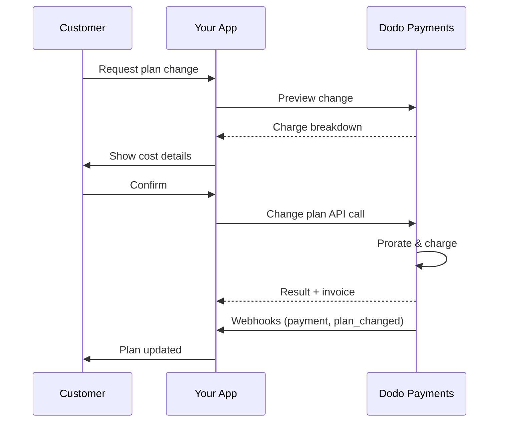
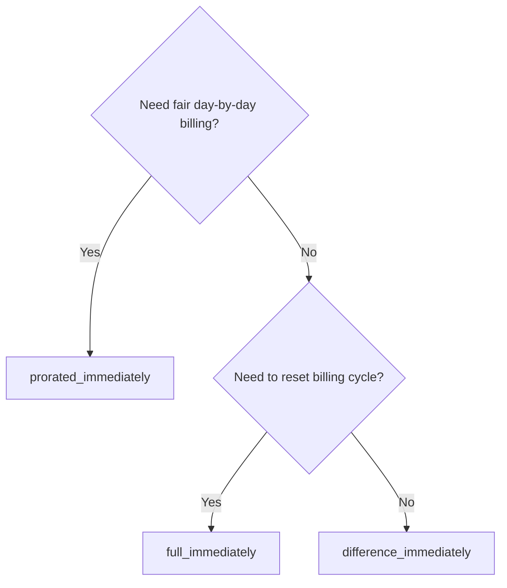
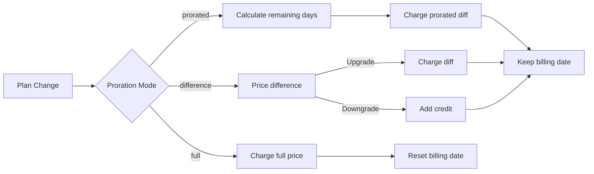

{/* LOCKED_PATTERN_6d744560e4135463c359b094ae69cd5f */}
{/* LOCKED_PATTERN_e019618386b2aca726eb1801e3e74076 */}
  الوثائق الكاملة لواجهة برمجة التطبيقات لتحديث الاشتراكات.
</Card>
{/* LOCKED_PATTERN_1e8b2499d330dcc44e5e284a3600fd11 */}
  راجع مبالغ الرسوم قبل تغيير الخطط.
</Card>
{/* LOCKED_PATTERN_782a37ccd4cc5a4159c5497e7f1d4c54 */}
  إعداد الاشتراك خطوة بخطوة.
</Card>
</CardGroup>

## ما هو ترقية أو تخفيض الاشتراك؟

يتيح لك تغيير الخطط نقل العميل بين مستويات الاشتراك أو الكميات. استخدمه لـ:
- مزامنة التسعير مع الاستخدام أو الميزات
- التحول من الاشتراك الشهري إلى السنوي (أو العكس)
- تعديل الكمية للمنتجات المعتمدة على المقاعد

<Info>
يمكن أن تؤدي تغييرات الخطة إلى فرض رسوم فورية حسب وضع الحساب النسبي الذي تختاره.
</Info>

## متى تستخدم تغييرات الخطط

- قم بالترقية عندما يحتاج العميل إلى المزيد من الميزات أو الاستخدام أو المقاعد
- قم بالتخفيض عندما ينخفض الاستخدام
- انقل المستخدمين إلى منتج أو سعر جديد دون إلغاء اشتراكهم

## سير تغيير الخطة



## المتطلبات الأساسية

قبل تنفيذ تغييرات خطة الاشتراك، تأكد من أن لديك:

- حساب تاجر Dodo Payments مع منتجات اشتراك نشطة
- بيانات اعتماد واجهة برمجة التطبيقات (مفتاح API ومفتاح سر الويب هوك) من لوحة التحكم
- اشتراك نشط موجود لتعديله
- نقطة نهاية الويب هوك مكونة للتعامل مع أحداث الاشتراك

<Info>
للحصول على تعليمات إعداد مفصلة، راجع [دليل التكامل](/developer-resources/integration-guide#dashboard-setup).
</Info>

## دليل التنفيذ خطوة بخطوة

اتبع هذا الدليل الشامل لتنفيذ تغييرات خطة الاشتراك في تطبيقك:

<Steps>
{/* LOCKED_PATTERN_b0d6d45bb453480975a9fb2d18d04caf */}
قبل التنفيذ، حدد:
- المنتجات التي يمكن تغيير اشتراكاتها إلى أخرى
- وضع الحساب النسبي المناسب لنموذج عملك
- كيفية التعامل بسلاسة مع تغييرات الخطط الفاشلة
- الأحداث التي يجب تتبعها عبر الويب هوك لإدارة الحالة


<Tip>
اختبر تغييرات الخطط بدقة في وضع الاختبار قبل التنفيذ في بيئة الإنتاج.
</Tip>
</Step>

{/* LOCKED_PATTERN_44f780199a4b76d6c063b33d8f599e9a */}
اختر نهج الفوترة الذي يتماشى مع احتياجات عملك:

<Tabs>
<Tab title="prorated_immediately">
الأفضل لتطبيقات SaaS التي ترغب في تحصيل رسوم عادلة عن الوقت غير المستخدم
- يحسب الفرق النسبي الدقيق بناءً على الوقت المتبقي من الدورة
- يفرض مبلغًا نسبيًا بناءً على الوقت غير المستخدم المتبقي في الدورة
- يوفر فوترة شفافة للعملاء
</Tab>

<Tab title="difference_immediately">
الأفضل لحالات الترقية/التخفيض الواضحة
- الترقية: فرض الفرق الفوري (مثلاً، $30→$80 = تحصيل $50)
- التخفيض: إضافة رصيد للقيمة المتبقية للتجديدات المستقبلية
- يبسط منطق الفوترة والتواصل مع العملاء
</Tab>

<Tab title="full_immediately">
الأفضل عندما ترغب في إعادة ضبط دورة الفوترة
- يفرض المبلغ الكامل للخطة الجديدة فورًا
- يتجاهل الوقت المتبقي من الخطة القديمة
- مفيد عند التحول من السنوي إلى الشهري
</Tab>
</Tabs>
</Step>

{/* LOCKED_PATTERN_62685552c5becb87cfeddbb400a3e69b */}
استخدم واجهة برمجة تطبيقات تغيير الخطة لتعديل تفاصيل الاشتراك:

<ParamField path="subscription_id" type="string" required>
معرّف الاشتراك النشط الذي سيتم تعديله.
</ParamField>

<ParamField path="product_id" type="string" required>
معرّف المنتج الجديد لتغيير الاشتراك إليه.
</ParamField>

<ParamField path="quantity" type="integer" default="1">
عدد الوحدات للخطة الجديدة (للمنتجات المعتمدة على المقاعد).
</ParamField>

<ParamField path="proration_billing_mode" type="string" required>
كيفية التعامل مع الفوترة الفورية: `prorated_immediately`، `full_immediately`، أو `difference_immediately`.
</ParamField>

<ParamField path="addons" type="array">
إضافات اختيارية للخطة الجديدة. ترك هذا الحقل فارغًا يزيل أي إضافات حالية.
</ParamField>

{/* LOCKED_PATTERN_dbe6ce0c854d65ccfe8e10a6cd58e3a8 */}
يتحكم بالسلوك عند فشل دفع تغيير الخطة:
- `prevent_change`: إبقاء الاشتراك على الخطة الحالية حتى تنجح الدفعة
- `apply_change` (افتراضي): تطبيق تغيير الخطة فورًا بغض النظر عن نتيجة الدفع

إذا لم يتم تحديده، يتم استخدام الإعداد الافتراضي على مستوى العمل.
</ParamField>
</Step>

{/* LOCKED_PATTERN_5c8c73c93c2f49c93ec60fbfa164dd3a */}
قم بإعداد معالجة الويب هوك لتتبع نتائج تغييرات الخطط:

- `subscription.active`: تم تغيير الخطة بنجاح، وتم تحديث الاشتراك
- `subscription.plan_changed`: تم تغيير خطة الاشتراك (ترقية/تخفيض/تحديث إضافات)
- `subscription.on_hold`: فشل تحصيل رسوم تغيير الخطة، تم إيقاف الاشتراك مؤقتًا
- `payment.succeeded`: نجحت الرسوم الفورية لتغيير الخطة
- `payment.failed`: فشل الرسوم الفورية

<Warning>
تحقق دائمًا من توقيعات الويب هوك وطبق معالجة أحداث متكررة بطريقة آمنة.
</Warning>
</Step>

{/* LOCKED_PATTERN_df7c84793753eaba82a0d637e200faa6 */}
استنادًا إلى أحداث الويب هوك، حدّث تطبيقك:
- منح/سحب الميزات بناءً على الخطة الجديدة
- تحديث لوحة تحكم العميل بتفاصيل الخطة الجديدة
- إرسال رسائل تأكيد عن تغييرات الخطة
- تسجيل تغييرات الفوترة لأغراض التدقيق
</Step>

{/* LOCKED_PATTERN_bee75f9c04c9720f2dc211cbed62a7c6 */}
اختبر تنفيذك بدقة:
- اختبر جميع أوضاع الحساب النسبي في سيناريوهات مختلفة
- تحقق من أن معالجة الويب هوك تعمل بشكل صحيح
- راقب معدلات نجاح تغييرات الخطة
- قم بإعداد تنبيهات عند فشل تغييرات الخطة


<Check>
أصبح تنفيذ تغيير خطة الاشتراك جاهزًا للاستخدام في الإنتاج.
</Check>
</Step>
</Steps>

## معاينة تغييرات الخطة

قبل الالتزام بتغيير خطة، استخدم واجهة المعاينة لعرض المبلغ الذي سيتحمله العملاء بالضبط:

<Tabs>
<Tab title="Node.js SDK">

```javascript
const preview = await client.subscriptions.previewChangePlan('sub_123', {
  product_id: 'prod_pro',
  quantity: 1,
  proration_billing_mode: 'prorated_immediately'
});

// Show customer the charge before confirming
console.log('Immediate charge:', preview.immediate_charge.summary);
console.log('New plan details:', preview.new_plan);
```

</Tab>

<Tab title="Python SDK">

```python
preview = client.subscriptions.preview_change_plan(
    subscription_id="sub_123",
    product_id="prod_pro",
    quantity=1,
    proration_billing_mode="prorated_immediately"
)

# Show customer the charge before confirming
print("Immediate charge:", preview.immediate_charge.summary)
print("New plan details:", preview.new_plan)
```

</Tab>
</Tabs>

<Tip>
استخدم واجهة المعاينة لبناء مربعات التأكيد التي تظهر للعملاء المبلغ الدقيق الذي سيُحصّل قبل تأكيد تغيير الخطة.
</Tip>

## واجهة برمجة تطبيقات تغيير الخطة

استخدم واجهة برمجة تطبيقات تغيير الخطة لتعديل المنتج والكمية وسلوك الحساب النسبي للاشتراك النشط.

### أمثلة البدء السريع

<Tabs>
  <Tab title="Node.js SDK">

    ```javascript
    import DodoPayments from 'dodopayments';

    const client = new DodoPayments({
      bearerToken: process.env.DODO_PAYMENTS_API_KEY,
      environment: 'test_mode', // defaults to 'live_mode'
    });

    async function changePlan() {
      const result = await client.subscriptions.changePlan('sub_123', {
        product_id: 'prod_new',
        quantity: 3,
        proration_billing_mode: 'prorated_immediately',
        on_payment_failure: 'prevent_change', // Optional: control behavior on payment failure
      });
      console.log(result.status, result.invoice_id, result.payment_id);
    }

    changePlan();
    ```

  </Tab>
  <Tab title="Python SDK">

    ```python
    import os
    from dodopayments import DodoPayments

    client = DodoPayments(
        bearer_token=os.environ.get("DODO_PAYMENTS_API_KEY"),
        environment="test_mode",  # defaults to "live_mode"
    )

    result = client.subscriptions.change_plan(
        subscription_id="sub_123",
        product_id="prod_new",
        quantity=3,
        proration_billing_mode="prorated_immediately",
        on_payment_failure="prevent_change",  # Optional: control behavior on payment failure
    )
    print(result.status, result.get("invoice_id"), result.get("payment_id"))
    ```

  </Tab>
  <Tab title="Go SDK">

    ```go
    package main

    import (
      "context"
      "fmt"
      "github.com/dodopayments/dodopayments-go"
      "github.com/dodopayments/dodopayments-go/option"
    )

    func main() {
      client := dodopayments.NewClient(option.WithBearerToken("YOUR_TOKEN"))
      res, err := client.Subscriptions.ChangePlan(context.TODO(), dodopayments.SubscriptionChangePlanParams{
        SubscriptionID: dodopayments.F("sub_123"),
        ProductID:             dodopayments.F("prod_new"),
        Quantity:              dodopayments.F(int64(3)),
        ProrationBillingMode:  dodopayments.F(dodopayments.SubscriptionChangePlanParamsProrationBillingModeProratedImmediately),
        OnPaymentFailure:      dodopayments.F(dodopayments.OnPaymentFailurePreventChange), // Optional
      })
      if err != nil { panic(err) }
      fmt.Println(res.Status, res.InvoiceID, res.PaymentID)
    }
    ```

  </Tab>
  <Tab title="HTTP">

    ```bash
    curl -X POST "$DODO_API_BASE/subscriptions/sub_123/change-plan" \
      -H "Authorization: Bearer $DODO_PAYMENTS_API_KEY" \
      -H "Content-Type: application/json" \
      -d '{
        "product_id": "prod_new",
        "quantity": 3,
        "proration_billing_mode": "prorated_immediately",
        "on_payment_failure": "prevent_change"
      }'
    ```

  </Tab>
</Tabs>

```json Success
{
  "status": "processing",
  "subscription_id": "sub_123",
  "invoice_id": "inv_789",
  "payment_id": "pay_456",
  "proration_billing_mode": "prorated_immediately"
}
```

<Note>
تعاد الحقول مثل <code>invoice_id</code> و<code>payment_id</code> فقط عندما يتم إنشاء رسم فوري و/أو فاتورة أثناء تغيير الخطة. اعتمد دائمًا على أحداث الويب هوك (مثل <code>payment.succeeded</code>، <code>subscription.plan_changed</code>) لتأكيد النتائج.
</Note>

<Warning>
إذا فشل الرسم الفوري، فقد ينتقل الاشتراك إلى `subscription.on_hold` حتى تنجح الدفعة.
</Warning>

## إدارة الإضافات

عند تغيير خطط الاشتراك، يمكنك أيضًا تعديل الإضافات:

```javascript
// Add addons to the new plan
await client.subscriptions.changePlan('sub_123', {
  product_id: 'prod_new',
  quantity: 1,
  proration_billing_mode: 'difference_immediately',
  addons: [
    { addon_id: 'addon_123', quantity: 2 }
  ]
});

// Remove all existing addons
await client.subscriptions.changePlan('sub_123', {
  product_id: 'prod_new',
  quantity: 1,
  proration_billing_mode: 'difference_immediately',
  addons: [] // Empty array removes all existing addons
});
```

<Info>
تُدرَج الإضافات في حساب القيمة النسبية وسيتم تحصيلها وفقًا لوضع الحساب النسبي المحدد.
</Info>

## أوضاع الحساب النسبي

اختر كيفية فوترة العميل عند تغيير الخطط:

#### `prorated_immediately`
- يفرض الرسوم عن الفرق الجزئي في الدورة الحالية
- إذا كان في الفترة التجريبية، يفرض الرسوم فورًا وينتقل إلى الخطة الجديدة الآن
- عند التخفيض: قد يُنشئ رصيدًا نسبيًا يُطبّق على التجديدات المستقبلية

#### `full_immediately`
- يفرض المبلغ الكامل للخطة الجديدة فورًا
- يتجاهل الوقت المتبقي من الخطة القديمة

<Info>
تُعد الاعتمادات التي يتم إنشاؤها عند التخفيض باستخدام <code>difference_immediately</code> خاصة بالاشتراك ومتميزة عن <a href="/features/customer-credit">اعتمادات العملاء</a>. تُطبّق تلقائيًا على التجديدات المستقبلية لنفس الاشتراك ولا يمكن نقلها بين الاشتراكات.
</Info>

#### `difference_immediately`
- الترقية: يفرض الفرق بين الخطة القديمة والجديدة فورًا
- التخفيض: يضيف القيمة المتبقية كرِصيد داخلي للاشتراك ويُطبّق تلقائيًا عند التجديدات

| الميزة | `prorated_immediately` | `difference_immediately` | `full_immediately` |
|---------|----------------------|------------------------|-------------------|
| **رسوم الترقية** | الفرق النسبي للأيام المتبقية | الفرق الكامل بين الخطة القديمة والجديدة | السعر الكامل للخطة الجديدة |
| **رصيد التخفيض** | رصيد نسبي للأيام المتبقية | فرق السعر الكامل كرصيد | لا يوجد رصيد |
| **دورة الفوترة** | دون تغيير | دون تغيير | يُعاد ضبطها على اليوم |
| **سلوك الفترة التجريبية** | ينهي الفترة التجريبية ويحصّل الرسوم فورًا | ينهي الفترة التجريبية ويحصّل الرسوم فورًا | ينهي الفترة التجريبية ويحصّل المبلغ الكامل |
| **الأفضل لـ** | فوترة عادلة تعتمد على الوقت | حسابات ترقية/تخفيض بسيطة | إعادة ضبط دورات الفوترة |
| **التعقيد** | متوسط (حساب الأيام) | منخفض (طرح بسيط) | منخفض (تحصيل كامل) |



### سيناريوهات مثال

استخدم هذه الأرقام القياسية باستمرار:
- الخطة الحالية: **Basic** بسعر **$30/شهريًا**
- هدف الترقية: **Pro** بسعر **$80/شهريًا**
- هدف التخفيض (من Pro): **Starter** بسعر **$20/شهريًا**
- دورة الفوترة: **30 يومًا**، بدأت في **1 يناير**
- يحدث تغيير الخطة في **16 يناير** (15 يومًا متبقية، 15 يومًا مستخدمة)

<AccordionGroup>
  {/* LOCKED_PATTERN_1a58b4dbcc060de029ff28c82c80a6fe */}

    ```
    Step 1: Calculate unused credit from current plan
      Unused days = 15 out of 30 days
      Credit = $30 × (15/30) = $15.00

    Step 2: Calculate prorated cost of new plan
      Remaining days = 15 out of 30 days
      New plan cost = $80 × (15/30) = $40.00

    Step 3: Calculate immediate charge
      Charge = New plan cost − Credit
      Charge = $40.00 − $15.00 = $25.00

    → Customer pays $25.00 now
    → Next renewal (Feb 1): $80.00/month
    ```

    ```javascript
    await client.subscriptions.changePlan('sub_123', {
      product_id: 'prod_pro',
      quantity: 1,
      proration_billing_mode: 'prorated_immediately'
    })
    ```

  </Accordion>

  {/* LOCKED_PATTERN_807a82fa1b52ee9a606ce1f9c1d8b613 */}

    ```
    Step 1: Calculate unused credit from current plan
      Unused days = 15 out of 30 days
      Credit = $80 × (15/30) = $40.00

    Step 2: Calculate prorated cost of new plan
      Remaining days = 15 out of 30 days
      New plan cost = $20 × (15/30) = $10.00

    Step 3: Calculate credit balance
      Credit = $40.00 − $10.00 = $30.00

    → No charge — $30.00 credit added to subscription
    → Credit auto-applies to future renewals
    → Next renewal (Feb 1): $20.00 − $30.00 credit = $0.00
    → Following renewal (Mar 1): $20.00 − $10.00 remaining credit = $10.00
    ```

    ```javascript
    await client.subscriptions.changePlan('sub_123', {
      product_id: 'prod_starter',
      quantity: 1,
      proration_billing_mode: 'prorated_immediately'
    })
    ```

  </Accordion>

  {/* LOCKED_PATTERN_67905dd0e892a1412bd0f1a567dd0a62 */}

    ```
    Immediate charge = New plan price − Old plan price
                     = $80 − $30
                     = $50.00

    → Customer pays $50.00 now (regardless of cycle position)
    → Next renewal (Feb 1): $80.00/month
    ```

    ```javascript
    await client.subscriptions.changePlan('sub_123', {
      product_id: 'prod_pro',
      quantity: 1,
      proration_billing_mode: 'difference_immediately'
    })
    ```

  </Accordion>

  {/* LOCKED_PATTERN_b17ed67d3062fadb798904adf781b844 */}

    ```
    Credit = Old plan price − New plan price
           = $80 − $20
           = $60.00

    → No charge — $60.00 credit added to subscription
    → Credit auto-applies to future renewals
    → Next renewal: $20.00 − $20.00 (from credit) = $0.00
    → Following renewal: $20.00 − $20.00 (from credit) = $0.00
    → Third renewal: $20.00 − $20.00 (from remaining credit) = $0.00
    ```

    ```javascript
    await client.subscriptions.changePlan('sub_123', {
      product_id: 'prod_starter',
      quantity: 1,
      proration_billing_mode: 'difference_immediately'
    })
    ```

  </Accordion>

  {/* LOCKED_PATTERN_0cb1a5657302a3970059ca925841dcd5 */}

    ```
    Immediate charge = Full new plan price = $80.00

    → Customer pays $80.00 now
    → No credit for unused time on old plan
    → Billing cycle resets to today (January 16)
    → Next renewal: February 16 at $80.00/month
    ```

    ```javascript
    await client.subscriptions.changePlan('sub_123', {
      product_id: 'prod_pro',
      quantity: 1,
      proration_billing_mode: 'full_immediately'
    })
    ```

  </Accordion>

  {/* LOCKED_PATTERN_6edab7762bdaeaf6cef5f85bafdb8832 */}

    ```
    Current: Basic plan ($30/month), no add-ons
    New: Pro plan ($80/month) + Extra Seats add-on ($10/seat × 3 seats = $30/month)
    Change on day 16 of 30 (15 days remaining)

    Step 1: Credit from current plan
      Credit = $30 × (15/30) = $15.00

    Step 2: Prorated cost of new plan + add-ons
      New plan = $80 × (15/30) = $40.00
      Add-ons = $30 × (15/30) = $15.00
      Total new = $55.00

    Step 3: Immediate charge
      Charge = $55.00 − $15.00 = $40.00

    → Customer pays $40.00 now
    → Next renewal: $80.00 + $30.00 = $110.00/month
    ```

    ```javascript
    await client.subscriptions.changePlan('sub_123', {
      product_id: 'prod_pro',
      quantity: 1,
      proration_billing_mode: 'prorated_immediately',
      addons: [
        { addon_id: 'addon_seats', quantity: 3 }
      ]
    })
    ```

  </Accordion>
</AccordionGroup>

### كيف يعالج كل وضع الفوترة



<Tip>
اختر `prorated_immediately` للمحاسبة العادلة حسب الوقت؛ اختر `full_immediately` لإعادة تشغيل الفوترة؛ واستخدم `difference_immediately` للترقيات البسيطة والرصيد التلقائي عند التخفيضات.
</Tip>

## التعامل مع فشل الدفعات

تحكم فيما يحدث عند فشل دفع تغيير الخطة باستخدام معلمة `on_payment_failure`.

### أوضاع فشل الدفع

<Tabs>
{/* LOCKED_PATTERN_9a289e347ae0d2762cd8b5bae425d96d */}
**السلوك**: إبقاء الاشتراك في خطته الحالية حتى تنجح الدفعة.

- يتم وضع علامة "قيد الانتظار" على تغيير الخطة
- يحتفظ العميل بالوصول إلى خطته الحالية
- ينتقل الاشتراك إلى الحالة `active` فقط بعد نجاح الدفعة
- مفيد عندما تريد التأكد من الدفع قبل منح الميزات المتقدمة

```javascript
await client.subscriptions.changePlan('sub_123', {
  product_id: 'prod_pro',
  quantity: 1,
  proration_billing_mode: 'prorated_immediately',
  on_payment_failure: 'prevent_change'
});
```

</Tab>

{/* LOCKED_PATTERN_389bf4efb62466ceba65070629169973 */}
**السلوك**: تطبيق تغيير الخطة فورًا بغض النظر عن نتيجة الدفع.

- يتم تطبيق تغيير الخطة حتى إن فشلت الدفعة
- يحصل العميل على وصول فوري إلى الخطة الجديدة
- قد ينتقل الاشتراك إلى الحالة `on_hold` إذا فشلت الدفعة
- مناسب للترقيات غير الحرجة أو عند الثقة بالعميل

```javascript
await client.subscriptions.changePlan('sub_123', {
  product_id: 'prod_pro',
  quantity: 1,
  proration_billing_mode: 'prorated_immediately',
  on_payment_failure: 'apply_change' // This is the default
});
```

</Tab>
</Tabs>

<Info>
إذا لم يتم تحديده، تستخدم معلمة `on_payment_failure` إعدادك الافتراضي على مستوى العمل المُهيأ في اللوحة.
</Info>

### متى تستخدم كل وضع

| السيناريو | الوضع الموصى به | السبب |
|----------|------------------|--------|
| الترقية إلى الميزات المميزة | `prevent_change` | ضمان الدفع قبل منح الوصول |
| زيادة الكمية (مزيد من المقاعد) | `prevent_change` | منع الاستخدام دون دفع |
| تخفيض الخطط | `apply_change` | يقلل العميل من الإنفاق |
| العملاء المؤسسيون الموثوق بهم | `apply_change` | انخفاض مخاطر عدم الدفع |
| التحويل من التجربة إلى المدفوع | `prevent_change` | لحظة دفع حاسمة |


## التعامل مع الويب هوك

تابع حالة الاشتراك عبر الويب هوك لتأكيد تغييرات الخطط والمدفوعات.

### أنواع الأحداث التي يجب التعامل معها
- `subscription.active`: تفعيل الاشتراك
- `subscription.plan_changed`: تغيير خطة الاشتراك (ترقية/تخفيض/تغييرات إضافات)
- `subscription.on_hold`: فشل التحصيل، تم إيقاف الاشتراك مؤقتًا
- `subscription.renewed`: نجح التجديد
- `payment.succeeded`: نجحت الدفعة لتغيير الخطة أو التجديد
- `payment.failed`: فشلت الدفعة

<Info>
ننصح بتشغيل منطق العمل من أحداث الاشتراك واستخدام أحداث الدفع للتأكيد والتسوية.
</Info>

### التحقق من التوقيعات ومعالجة النوايا

<Tabs>
  {/* LOCKED_PATTERN_ad56e9578b99d8d029bf3ec794be6fc4 */}

    ```javascript
    import { NextRequest, NextResponse } from 'next/server';
    
    export async function POST(req) {
      const webhookId = req.headers.get('webhook-id');
      const webhookSignature = req.headers.get('webhook-signature');
      const webhookTimestamp = req.headers.get('webhook-timestamp');
      const secret = process.env.DODO_WEBHOOK_SECRET;
    
      const payload = await req.text();
      // verifySignature is a placeholder – in production, use a Standard Webhooks library
      const { valid, event } = await verifySignature(
        payload,
        { id: webhookId, signature: webhookSignature, timestamp: webhookTimestamp },
        secret
      );
      if (!valid) return NextResponse.json({ error: 'Invalid signature' }, { status: 400 });
    
      switch (event.type) {
        case 'subscription.active':
          // mark subscription active in your DB
          break;
        case 'subscription.plan_changed':
          // refresh entitlements and reflect the new plan in your UI
          break;
        case 'subscription.on_hold':
          // notify user to update payment method
          break;
        case 'subscription.renewed':
          // extend access window
          break;
        case 'payment.succeeded':
          // reconcile payment for plan change
          break;
        case 'payment.failed':
          // log and alert
          break;
        default:
          // ignore unknown events
          break;
      }
    
      return NextResponse.json({ received: true });
    }
    ```

  </Tab>
  <Tab title="Express.js">

    ```javascript
    import express from 'express';
    
    const app = express();
    app.post('/webhooks/dodo', express.raw({ type: 'application/json' }), async (req, res) => {
      const webhookId = req.header('webhook-id');
      const webhookSignature = req.header('webhook-signature');
      const webhookTimestamp = req.header('webhook-timestamp');
      const secret = process.env.DODO_WEBHOOK_SECRET;
      const payload = req.body.toString('utf8');
    
      const { valid, event } = await verifySignature(
        payload,
        { id: webhookId, signature: webhookSignature, timestamp: webhookTimestamp },
        secret
      );
      if (!valid) return res.status(400).send('Invalid signature');
    
      // handle events like above
      res.json({ received: true });
    });
    
    app.listen(3000);
    ```

  </Tab>
</Tabs>

<Note>
للاطلاع على مخططات الحمولات التفصيلية، راجع <a href="/developer-resources/webhooks/intents/subscription">حمولات ويب هوك الاشتراك</a> و<a href="/developer-resources/webhooks/intents/payment">حمولات ويب هوك الدفع</a>.
</Note>

## أفضل الممارسات

اتبع هذه التوصيات لتغييرات اشتراك موثوقة:

### استراتيجية تغيير الخطة
- **اختبر بدقة**: اختبر تغييرات الخطط دائمًا في وضع الاختبار قبل الإنتاج
- **اختر الحساب النسبي بعناية**: حدد وضع الحساب النسبي الذي يتماشى مع نموذج عملك
- **تعامل مع الفشل بسلاسة**: طبّق معالجة أخطاء مناسبة ومنطق إعادة المحاولة
- **راقب معدلات النجاح**: تتبع معدلات نجاح/فشل تغييرات الخطة وابحث عن المشاكل


### تنفيذ الويب هوك
- **تحقق من التوقيعات**: تحقق دائمًا من توقيعات الويب هوك لضمان الأصالة
- **نفّذ عدم التكرار**: تعامل مع أحداث الويب هوك المكررة بشكل سلس
- **عالج بشكل غير متزامن**: لا تعرقل ردود الويب هوك بعمليات ثقيلة
- **سجّل كل شيء**: احتفظ بسجلات مفصلة للتتبع والتدقيق


### تجربة المستخدم
- **تواصل بوضوح**: أخبر العملاء بتغييرات الفوترة والتوقيت
- **قدّم تأكيدات**: أرسل تأكيدات بريد إلكتروني عند نجاح تغييرات الخطة
- **تعامل مع الحالات الحدية**: ضع في اعتبارك فترات التجربة والحساب النسبي والمدفوعات الفاشلة
- **حدّث واجهة المستخدم فورًا**: عكس تغييرات الخطة في واجهة تطبيقك


## المشاكل الشائعة والحلول

حل المشاكل النموذجية التي قد تواجهها أثناء تغييرات خطة الاشتراك:

<AccordionGroup>
{/* LOCKED_PATTERN_112861435a085998aa537e347e24f368 */}
**الأعراض**: تنجح استدعاءات واجهة برمجة التطبيقات لكن الاشتراك يبقى على الخطة القديمة

**الأسباب الشائعة**:
- فشلت معالجة الويب هوك أو تأخرت
- لم يتم تحديث حالة التطبيق بعد استلام الويب هوك
- مشاكل في معاملات قاعدة البيانات أثناء تحديث الحالة

**الحلول**:
- طبّق معالجة ويب هوك موثوقة مع منطق إعادة المحاولة
- استخدم عمليات غير متكررة لتحديث الحالة
- أضف مراقبة لاكتشاف وتنبيه عند فقدان أحداث الويب هوك
- تحقق من أن نقطة نهاية الويب هوك متاحة وتستجيب بشكل صحيح
</Accordion>

{/* LOCKED_PATTERN_653656c823b0f191581a523ab18f0f3f */}
**الأعراض**: يخفض العميل الخطة ولا يرى رصيدًا


**الأسباب الشائعة**:
- توقعات وضع الحساب النسبي: يعطي التخفيض رصيد فرق السعر الكامل مع `difference_immediately`، بينما يُنشئ `prorated_immediately` رصيدًا نسبيًا بناءً على الوقت المتبقي في الدورة
- الاعتمادات خاصة بالاشتراك ولا تنتقل بين الاشتراكات
- رصيد الاعتماد غير مرئي في لوحة تحكم العميل


**الحلول**:
- استخدم `difference_immediately` للتخفيضات عندما تريد اعتمادات تلقائية
- وضّح للعملاء أن الاعتمادات تُطبّق على التجديدات المستقبلية لنفس الاشتراك
- نفّذ بوابة عملاء لعرض أرصدة الاعتمادات
- تحقق من معاينة الفاتورة التالية لرؤية الاعتمادات المطبقة
</Accordion>

{/* LOCKED_PATTERN_1b0516ec68b4083dc4d6ae9b330f3f1a */}
**الأعراض**: يتم رفض أحداث الويب هوك بسبب توقيع غير صالح

**الأسباب الشائعة**:
- مفتاح سر الـ webhook غير صحيح
- تم تعديل جسم الطلب الخام قبل التحقق من التوقيع
- خوارزمية التحقق من التوقيع خاطئة

**الحلول**:
- تأكد من استخدام `DODO_WEBHOOK_SECRET` الصحيح من اللوحة
- اقرأ جسم الطلب الخام قبل أي وسيط لتحليل JSON
- استخدم مكتبة التحقق القياسية للويب هوك لمنصتك
- اختبر التحقق من التوقيع في بيئة التطوير
</Accordion>

{/* LOCKED_PATTERN_638d7c911003cceda8c7d34ff8a2c381 */}
**الأعراض**: تُرجع الواجهة 422 خطأ كيان غير قابل للمعالجة

**الأسباب الشائعة**:
- معرف الاشتراك أو المنتج غير صالح
- الاشتراك غير في حالة نشطة
- نقص المعلمات المطلوبة
- المنتج غير متاح لتغيير الخطط


**الحلول**:
- تحقّق من وجود الاشتراك ونشاطه
- تأكد من أن معرف المنتج صالح ومتاح
- ضمّن كل المعلمات المطلوبة
- راجع توثيق الواجهة لمعرفة متطلبات المعلمات
</Accordion>

{/* LOCKED_PATTERN_7917a64bf4b26c933f2e4649e9278a56 */}
**الأعراض**: تم بدء تغيير الخطة لكن فشل الرسم الفوري

**الأسباب الشائعة**:
- رصيد غير كافٍ على وسيلة الدفع الخاصة بالعميل
- انتهت صلاحية وسيلة الدفع أو أصبحت غير صالحة
- رفض البنك للمعاملة
- اكتشاف الاحتيال منع التحصيل


**الحلول**:
- تعامل مع أحداث `payment.failed` بشكل مناسب
- أبلغ العميل لتحديث وسيلة الدفع
- نفّذ منطق إعادة المحاولة للفشل المؤقت
- فكر في السماح بتغييرات الخطة مع فشل الرسوم الفورية
</Accordion>

{/* LOCKED_PATTERN_20276630e99e95ac9f5cdd0b347713bb */}
**الأعراض**: فشل رسم تغيير الخطة وانتقل الاشتراك إلى حالة `on_hold`

**ما يحدث**:
عندما يفشل رسم تغيير الخطة، يتم وضع الاشتراك تلقائيًا في حالة `on_hold`. لن يتم تجديد الاشتراك تلقائيًا حتى يتم تحديث وسيلة الدفع.

**الحل**: حدّث وسيلة الدفع لإعادة تفعيل الاشتراك

لإعادة تفعيل الاشتراك من حالة `on_hold` بعد فشل تغيير الخطة:

1. **حدّث وسيلة الدفع** باستخدام واجهة تحديث وسيلة الدفع
2. **إنشاء رسوم تلقائي**: تنشئ الواجهة رسومًا تلقائيًا للمستحقات المتبقية
3. **إنشاء فاتورة**: تُنشَأ فاتورة للرسوم
4. **معالجة الدفع**: تُعالج الدفعة باستخدام وسيلة الدفع الجديدة
5. **إعادة التفعيل**: عند نجاح الدفعة، يُعاد الاشتراك إلى حالة `active`


<CodeGroup>

```javascript Node.js
// Reactivate subscription from on_hold after failed plan change
async function reactivateAfterFailedPlanChange(subscriptionId) {
  // Update payment method - automatically creates charge for remaining dues
  const response = await client.subscriptions.updatePaymentMethod(subscriptionId, {
    type: 'new',
    return_url: 'https://example.com/return'
  });
  
  if (response.payment_id) {
    console.log('Charge created for remaining dues:', response.payment_id);
    console.log('Payment link:', response.payment_link);
    
    // Redirect customer to payment_link to complete payment
    // Monitor webhooks for:
    // 1. payment.succeeded - charge succeeded
    // 2. subscription.active - subscription reactivated
  }
  
  return response;
}

// Or use existing payment method if available
async function reactivateWithExistingPaymentMethod(subscriptionId, paymentMethodId) {
  const response = await client.subscriptions.updatePaymentMethod(subscriptionId, {
    type: 'existing',
    payment_method_id: paymentMethodId
  });
  
  // Monitor webhooks for payment.succeeded and subscription.active
  return response;
}
```

```python Python
# Reactivate subscription from on_hold after failed plan change
def reactivate_after_failed_plan_change(subscription_id):
    # Update payment method - automatically creates charge for remaining dues
    response = client.subscriptions.update_payment_method(
        subscription_id=subscription_id,
        type="new",
        return_url="https://example.com/return"
    )
    
    if response.payment_id:
        print("Charge created for remaining dues:", response.payment_id)
        print("Payment link:", response.payment_link)
        
        # Redirect customer to payment_link to complete payment
        # Monitor webhooks for:
        # 1. payment.succeeded - charge succeeded
        # 2. subscription.active - subscription reactivated
    
    return response

# Or use existing payment method if available
def reactivate_with_existing_payment_method(subscription_id, payment_method_id):
    response = client.subscriptions.update_payment_method(
        subscription_id=subscription_id,
        type="existing",
        payment_method_id=payment_method_id
    )
    
    # Monitor webhooks for payment.succeeded and subscription.active
    return response
```

</CodeGroup>

**أحداث الويب هوك التي يجب مراقبتها**:
- `subscription.on_hold`: وُضع الاشتراك في الانتظار (يُستلم عند فشل رسوم تغيير الخطة)
- `payment.succeeded`: نجحت الدفعة للمستحقات المتبقية (بعد تحديث وسيلة الدفع)
- `subscription.active`: أعيد تفعيل الاشتراك بعد نجاح الدفعة

**أفضل الممارسات**:
- أبلغ العملاء فورًا عندما تفشل رسوم تغيير الخطة
- قدّم تعليمات واضحة لتحديث وسيلة الدفع
- راقب أحداث الويب هوك لتتبع حالة إعادة التفعيل
- فكر في تنفيذ منطق إعادة المحاولة التلقائية للفشل المؤقت


{/* LOCKED_PATTERN_d215ea1d00e95d5e9d5b4b6085f2443f */}
اطلع على وثائق واجهة برمجة التطبيقات كاملة لتحديث وسائل الدفع وإعادة تفعيل الاشتراكات.
</Card>
</Accordion>
</AccordionGroup>

## اختبار التنفيذ

اتبع هذه الخطوات لاختبار تنفيذ تغيير خطة الاشتراك بدقة:

<Steps>
{/* LOCKED_PATTERN_f5ce79c6f425de558f6fdd6cea5793f5 */}
- استخدم مفاتيح واجهة برمجة التطبيقات التجريبية والمنتجات التجريبية
- أنشئ اشتراكات تجريبية بأنواع مختلفة من الخطط
- قم بتكوين نقطة نهاية ويب هوك تجريبية
- أعد إعداد المراقبة والتسجيل
</Step>

{/* LOCKED_PATTERN_3705b8701c8873992c57281c42adf8d6 */}
- اختبر `prorated_immediately` مع مواضع مختلفة ضمن دورة الفوترة
- اختبر `difference_immediately` للترقيات والتخفيضات
- اختبر `full_immediately` لإعادة ضبط دورات الفوترة
- تحقق من صحة حسابات الاعتمادات
</Step>

{/* LOCKED_PATTERN_9fb1eaf73e8951f61d7daf19366cdfdf */}
- تحقق من استلام جميع أحداث الويب هوك ذات الصلة
- اختبر التحقق من توقيعات الويب هوك
- تعامل مع أحداث الويب هوك المكررة بسلاسة
- اختبر سيناريوهات فشل معالجة الويب هوك
</Step>

{/* LOCKED_PATTERN_7d448c9309210902a86e740b08deae34 */}
- اختبر باستخدام معرفات اشتراك غير صالحة
- اختبر باستخدام وسائل دفع منتهية الصلاحية
- اختبر حالات فشل الشبكة والمهلات
- اختبر بحالات رصيد غير كافٍ
</Step>

{/* LOCKED_PATTERN_099bec4eb7633497929a085e7b0160cd */}
- أنشئ تنبيهات لتغييرات الخطط الفاشلة
- راقب أوقات معالجة الويب هوك
- تتبع معدلات نجاح تغييرات الخطة
- راجع طلبات دعم العملاء المتعلقة بالتغييرات
</Step>
</Steps>

## معالجة الأخطاء

تعامل مع أخطاء واجهة برمجة التطبيقات الشائعة بسلاسة في تنفيذك:

### رموز حالة HTTP

<AccordionGroup>
<Accordion title="200 OK">
تمت معالجة طلب تغيير الخطة بنجاح. يجري تحديث الاشتراك وبدء معالجة الدفع.
</Accordion>

<Accordion title="400 Bad Request">
معلمات الطلب غير صحيحة. تأكد من توفير كل الحقول المطلوبة وتنسيقها بشكل صحيح.
</Accordion>

{/* LOCKED_PATTERN_618fe88bddcc0059b0b92c4342a4dcfc */}
مفتاح واجهة برمجة التطبيقات غير صالح أو مفقود. تحقق من أن `DODO_PAYMENTS_API_KEY` صحيح ويتمتع بالأذونات المناسبة.
</Accordion>

<Accordion title="404 Not Found">
لم يتم العثور على معرف الاشتراك أو لا ينتمي إلى حسابك.
</Accordion>

<Accordion title="422 Unprocessable Entity">
لا يمكن تغيير الاشتراك (مثلاً، مُلغى بالفعل، المنتج غير متاح، إلخ).
</Accordion>

<Accordion title="500 Internal Server Error">
حدث خطأ في الخادم. أعد المحاولة بعد وقت قصير.
</Accordion>
</AccordionGroup>

### تنسيق استجابة الخطأ

```json
{
  "error": {
    "code": "subscription_not_found",
    "message": "The subscription with ID 'sub_123' was not found",
    "details": {
      "subscription_id": "sub_123"
    }
  }
}
```

## الخطوات التالية

- راجع <a href="/api-reference/subscriptions/change-plan">واجهة برمجة تطبيقات تغيير الخطة</a>
- استكشف <a href="/features/customer-credit">اعتمادات العملاء</a>
- نفّذ تنبيهات لـ `subscription.on_hold`
- اطلع على <a href="/developer-resources/webhooks">دليل تكامل الويب هوك</a>
