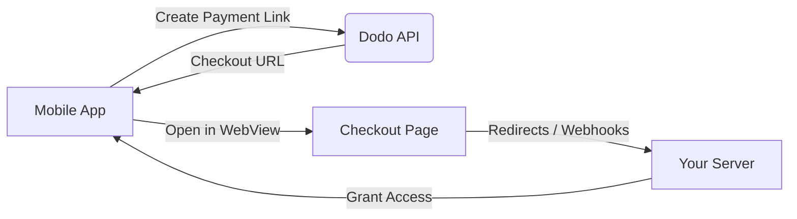

## المقدمة

تمكن مدفوعات Dodo المطورين من بيع السلع والخدمات الرقمية في تطبيقات iOS، مع التعامل مع جوانب معقدة مثل الامتثال الضريبي، تحويل العملات، والمدفوعات. يوضح هذا الدليل الشامل كيفية دمج مدفوعات Dodo في تطبيق iOS الخاص بك، وخاصة لأدوات SaaS، اشتراكات المحتوى، والمرافق الرقمية.

## نظرة عامة

تعمل مدفوعات Dodo كـ **تاجر السجل (MoR)** الخاص بك، حيث تدير الجوانب الحيوية لعملك الرقمي:

<Tabs>
<Tab title="ما نتعامل معه">
- جمع الضرائب وتحويلها (ضريبة القيمة المضافة، ضريبة السلع والخدمات، وغيرها من الضرائب الإقليمية)
- المدفوعات العالمية وفقًا للسياسات وطرق الدفع المحلية
- تحويل العملات وسعر الصرف
- استرداد المدفوعات ومنع الاحتيال
- الفواتير والإيصالات للعملاء النهائيين
- الامتثال للوائح الإقليمية
</Tab>

<Tab title="ما تحصل عليه">
- واجهة برمجة تطبيقات موحدة للويب والهواتف المحمولة
- دعم لعمليات الدفع داخل التطبيق (UPI، بطاقات، محافظ، BNPL)
- دعم المدفوعات العالمية (Payoneer، Wise، التحويلات البنكية المحلية)
- لوحة تحكم للتحليلات والتقارير
- معالجة مدفوعات آمنة
</Tab>
</Tabs>

## حالات الاستخدام

<CardGroup cols={2}>
<Card title="الاشتراكات" icon="repeat">
- الوصول إلى محتوى أو ميزات مميزة
- الفوترة المتكررة مع خيارات مرنة، تجارب مجانية، تقسيط، أو ترقيات وتخفيضات
</Card>

<Card title="الدورات والتعلم" icon="graduation-cap">
- الوصول بالدفع لكل دورة
- حزم محتوى مجمعة
- تراخيص مدى الحياة أو قابلة للتجديد
- تكامل تتبع التقدم
</Card>

<Card title="التنزيلات الرقمية" icon="download">
- عمليات الشراء لمرة واحدة (PDFs، موسيقى، أدوات)
- تسليم الأصول الرقمية
- إدارة مفاتيح الترخيص
</Card>

<Card title="أدوات SaaS" icon="screwdriver-wrench">
- اشتراكات البرمجيات كخدمة
- الفوترة بناءً على الاستخدام
- خطط الفرق والمؤسسات
</Card>
</CardGroup>

## تدفق التكامل

يمكنك دمج مدفوعات Dodo في تطبيقك باستخدام حل الدفع المستضاف أو متصفح داخل التطبيق.

### خطوات التكامل

<Steps>
<Step title="تطبيق الهاتف المحمول إلى واجهة برمجة تطبيقات Dodo">
تبدأ العملية بإنشاء تطبيق الهاتف المحمول لرابط الدفع من خلال التفاعل مع واجهة برمجة تطبيقات Dodo.
</Step>

<Step title="واجهة برمجة تطبيقات Dodo إلى تطبيق الهاتف المحمول">
تستجيب واجهة برمجة تطبيقات Dodo من خلال توفير عنوان URL للدفع مرة أخرى إلى تطبيق الهاتف المحمول.
</Step>

<Step title="تطبيق الهاتف المحمول إلى صفحة الدفع">
يفتح تطبيق الهاتف المحمول بعد ذلك عنوان URL للدفع داخل WebView، مما يقود المستخدم إلى صفحة الدفع.
</Step>

<Step title="صفحة الدفع إلى خادمك">
عند الانتهاء من عملية الدفع، تتواصل صفحة الدفع مع خادمك من خلال إعادة التوجيه أو الويب هوكس.
</Step>

<Step title="خادمك إلى تطبيق الهاتف المحمول">
أخيرًا، يمنح خادمك الوصول إلى المحتوى أو الخدمة المشتراة، مما يكمل دورة المعاملة مرة أخرى في تطبيق الهاتف المحمول.
</Step>
</Steps>

<Card title="دليل تكامل الهاتف المحمول" icon="mobile" href="/developer-resources/mobile-integration">
للحصول على مسار شامل للمطورين، استكشف دليل تكامل الهاتف المحمول الخاص بنا.
</Card>

## التوافر الإقليمي

تمكن مدفوعات Dodo تدفقات شراء داخل التطبيق البديلة فقط في مناطق متجر التطبيقات حيث تسمح Apple صراحةً بالمدفوعات الخارجية، أو حيث يفرض ذلك أمر تنظيمي أو قضائي.

### المناطق المدعومة

<AccordionGroup>
<Accordion title="الولايات المتحدة">
مدعوم إلى الحد الذي تسمح به الأوامر القضائية الحالية وإرشادات Apple المحدثة.

- متاح بموجب أحكام محددة مفروضة قضائيًا
- خاضع لامتثال Apple للمتطلبات القانونية
- يجب اتباع إرشادات تنفيذ Apple
</Accordion>

<Accordion title="متجر تطبيقات الاتحاد الأوروبي (EU)">
مدعوم من خلال شروط Apple البديلة في الاتحاد الأوروبي وامتياز الشراء الخارجي.

- مفعل من خلال شروط Apple البديلة في الاتحاد الأوروبي
- يتطلب موافقة امتياز الشراء الخارجي
- يجب الامتثال لمتطلبات قانون الأسواق الرقمية في الاتحاد الأوروبي
</Accordion>

<Accordion title="كوريا الجنوبية">
مدعوم من خلال امتياز الشراء الخارجي لـ StoreKit للثنائيات الخاصة بكوريا فقط.

- متاح من خلال امتياز الشراء الخارجي لـ StoreKit
- يتطلب ثنائية تطبيق خاصة بكوريا
- يجب الامتثال لقانون الاتصالات الكورية
</Accordion>
</AccordionGroup>

<Warning>
راجع دائمًا وامتثل لامتيازات Apple الخاصة بالمناطق ومتطلبات App Store Connect قبل تمكين مدفوعات Dodo لأي واجهة متجر. قد يؤدي استخدام تدفقات الدفع البديلة في المناطق غير المدعومة إلى رفض التطبيق أو إزالته.
</Warning>

<Note>
بالنسبة لبعض نماذج الأعمال - مثل الخدمات أو فئات معينة من المحتوى - قد لا تتطلب Apple استخدام الشراء داخل التطبيق (IAP) على الإطلاق. تدعم مدفوعات Dodo هذه النماذج أيضًا. تحقق دائمًا من تصنيف تطبيقك وإرشادات Apple الأخيرة لتحديد ما إذا كان IAP إلزاميًا لحالة الاستخدام الخاصة بك.
</Note>

### تعرف على المزيد

للحصول على تحليل مفصل للسياسات العالمية، السوابق القانونية، والنهج الاستراتيجية لتجاوز رسوم متجر التطبيقات، راجع دليلنا الشامل:

<Card title="تجاوز رسوم متجر التطبيقات ومتجر Play: دليل استراتيجي وقانوني" icon="shield-check" href="/features/bypassing-app-store-fees">
تعلم أين وكيف يمكنك تنفيذ تدفقات الدفع البديلة بشكل قانوني، مع إرشادات إقليمية محدثة ونصائح للامتثال.
</Card>