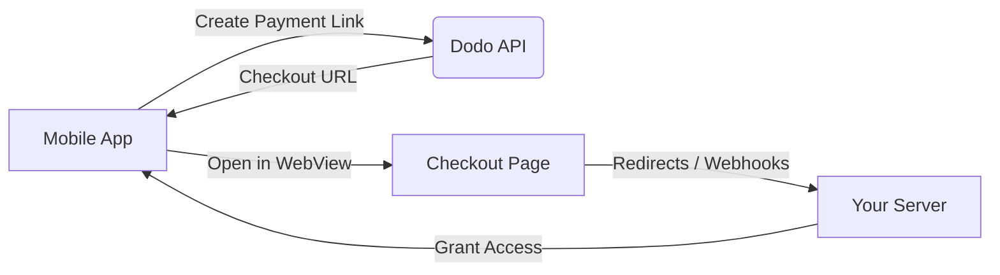

## المقدمة

تمكن مدفوعات Dodo المطورين من بيع السلع والخدمات الرقمية في تطبيقات iOS، مع التعامل مع جوانب معقدة مثل الامتثال الضريبي، تحويل العملات، والمدفوعات. يوضح هذا الدليل الشامل كيفية دمج مدفوعات Dodo في تطبيق iOS الخاص بك، وخاصة لأدوات SaaS، اشتراكات المحتوى، والمرافق الرقمية.

## نظرة عامة

تعمل مدفوعات Dodo كـ **تاجر السجل (MoR)** الخاص بك، حيث تدير الجوانب الحيوية لعملك الرقمي:

<Tabs>
{/* LOCKED_PATTERN_7b95db5ad22ff10e01a4218d7aa6d6be */}
- جمع الضرائب وتحويلها (ضريبة القيمة المضافة، ضريبة السلع والخدمات، وغيرها من الضرائب الإقليمية)
- المدفوعات العالمية وفق السياسات وطرق الدفع المحلية
- تحويل العملات وتبادل العملات الأجنبية
- إلغاء المدفوعات ومنع الاحتيال
- فواتير العملاء النهائيين والإيصالات
- الامتثال للتنظيمات الإقليمية
</Tab>

{/* LOCKED_PATTERN_da399a11cc5287c02436800c294d28be */}
- واجهة برمجة تطبيقات موحدة للويب والمنصات المحمولة
- دعم إجراءات الدفع داخل التطبيق (UPI، البطاقات، المحافظ، اشتر الآن وادفع لاحقًا)
- دعم المدفوعات العالمية (Payoneer، Wise، التحويلات المصرفية المحلية)
- لوحة تحليلات وتقارير
- معالجة مدفوعات آمنة
</Tab>
</Tabs>

## حالات الاستخدام

<CardGroup cols={2}>
{/* LOCKED_PATTERN_25273516451e819dcf5729a5b31c3fb9 */}
- الوصول إلى المحتوى أو الميزات المميزة
- الفوترة المتكررة بخيارات مرنة، التجارب المجانية، التسوية النسبية، أو الترقية والتخفيض
</Card>

{/* LOCKED_PATTERN_032df751886a698341277e548837215d */}
- دفع مقابل كل دورة
- حزم محتوى مجمعة
- تراخيص مدى الحياة أو قابلة للتجديد
- تكامل تتبع التقدم
</Card>

{/* LOCKED_PATTERN_88cb7887605391efc00e89ceac393617 */}
- عمليات شراء لمرة واحدة (ملفات PDF، موسيقى، أدوات)
- تسليم الأصول الرقمية
- إدارة مفاتيح الترخيص
</Card>

{/* LOCKED_PATTERN_53b689678a845fbab7f78be1484fe51d */}
- اشتراكات البرمجيات كخدمة
- الفوترة بناءً على الاستخدام
- خطط الفرق والمؤسسات
</Card>
</CardGroup>

## تدفق التكامل

يمكنك دمج مدفوعات Dodo في تطبيقك باستخدام حل الدفع المستضاف أو متصفح داخل التطبيق.

### خطوات التكامل

<Steps>
{/* LOCKED_PATTERN_eaf7186d297d5feae774885072c1deff */}
تبدأ العملية بإنشاء التطبيق المحمول رابط دفع عبر التفاعل مع واجهة برمجة تطبيقات Dodo.
</Step>

{/* LOCKED_PATTERN_b32fbf0225071fa4e66b7da8eafe9ef9 */}
تستجيب واجهة برمجة تطبيقات Dodo عبر توفير عنوان URL لصفحة الدفع يُعاد إلى التطبيق المحمول.
</Step>

{/* LOCKED_PATTERN_d976b5e50a0a8a20a8206d907f16914f */}
ثم يفتح التطبيق المحمول هذا العنوان داخل WebView، مما يوجه المستخدم إلى صفحة الدفع.
</Step>

{/* LOCKED_PATTERN_44d5bb8ba746348cda77bbdfc76b7fa5 */}
عند اكتمال عملية الدفع، تتواصل صفحة الدفع مع الخادم الخاص بك عبر إعادة التوجيه أو webhooks.
</Step>

{/* LOCKED_PATTERN_5f4ad8be947cf24adc5f501029294d3c */}
أخيرًا، يمنح خادمك الوصول إلى المحتوى أو الخدمة المشترية، مستكملًا دورة المعاملة مرة أخرى في التطبيق المحمول.
</Step>
</Steps>

{/* LOCKED_PATTERN_b9b6430ebe2f8c301db006aee204f66d */}
لمرحلة كاملة للمطورين، استكشف دليل تكامل المحمول الخاص بنا.
</Card>

## التوافر الإقليمي

تمكن مدفوعات Dodo تدفقات شراء داخل التطبيق البديلة فقط في مناطق متجر التطبيقات حيث تسمح Apple صراحةً بالمدفوعات الخارجية، أو حيث يفرض ذلك أمر تنظيمي أو قضائي.

### المناطق المدعومة

<AccordionGroup>
{/* LOCKED_PATTERN_2d6a072cfe841357c870b65ab28b5291 */
مدعوم بالقدر الذي تسمح به الأوامر القضائية الحالية وإرشادات Apple المحدثة.

- متاح بموجب أحكام محددة مفروضة قضائيًا
- خاضع لامتثال Apple للمتطلبات القانونية
- يجب اتباع إرشادات تنفيذ Apple
</Accordion>

{/* LOCKED_PATTERN_4ec7a4d0b0e955daa950f2acd6b96083 */}
مدعوم عبر شروط Apple البديلة للاتحاد الأوروبي واستحقاق الشراء الخارجي.

- ممكَّن من خلال شروط Apple البديلة للاتحاد الأوروبي
- يتطلب موافقة استحقاق الشراء الخارجي
- يجب الامتثال لمتطلبات قانون الأسواق الرقمية في الاتحاد الأوروبي
</Accordion>

{/* LOCKED_PATTERN_6bb22099c6c9aa7ba0a1c7dba319d124 */}
مدعوم عبر استحقاق الشراء الخارجي StoreKit للبرمجيات الثنائية المخصصة لكوريا فقط.

- متاح عبر استحقاق الشراء الخارجي StoreKit
- يتطلب برنامجًا ثنائيًا خاصًا بكوريا
- يجب الامتثال لقانون الاتصالات الكوري
</Accordion>
</AccordionGroup>

<Warning>
راجع دائمًا واستوفِ متطلبات الاستحقاقات الخاصة بكل منطقة وإعدادات App Store Connect من Apple قبل تمكين مدفوعات Dodo على أي واجهة متجر. قد يؤدي استخدام مسارات دفع بديلة في مناطق غير مدعومة إلى رفض التطبيق أو إزالته.
</Warning>

<Note>
بالنسبة لبعض نماذج الأعمال — مثل الخدمات أو فئات معينة من المحتوى — قد لا تطلب Apple استخدام الشراء داخل التطبيق (IAP) مطلقًا. تدعم مدفوعات Dodo هذه النماذج أيضًا. تحقق دائمًا من تصنيف تطبيقك وآخر إرشادات Apple لتحديد ما إذا كان الشراء داخل التطبيق إلزاميًا لحالة الاستخدام الخاصة بك.
</Note>

### تعرف على المزيد

للحصول على تحليل مفصل للسياسات العالمية، السوابق القانونية، والنهج الاستراتيجية لتجاوز رسوم متجر التطبيقات، راجع دليلنا الشامل:

{/* LOCKED_PATTERN_4c4ef7dc147bdbe9f5385b01ed7a302b */}
تعرّف على المكان والطريقة التي يمكنك من خلالها تنفيذ مسارات دفع بديلة بشكل قانوني، مع إرشادات إقليمية محدثة ونصائح للامتثال.
</Card>