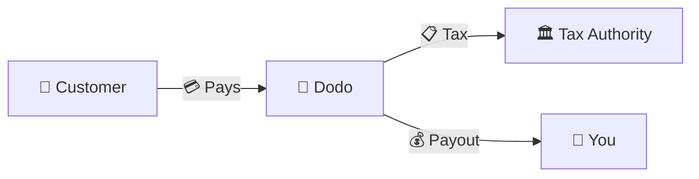
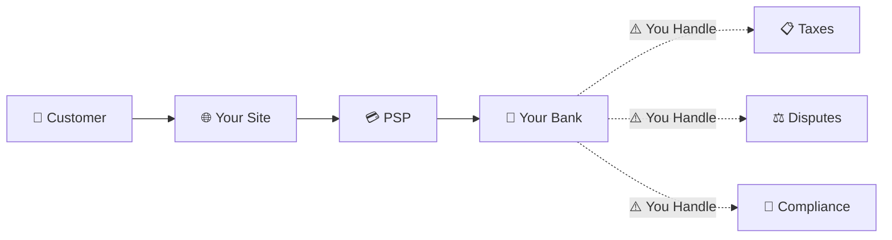
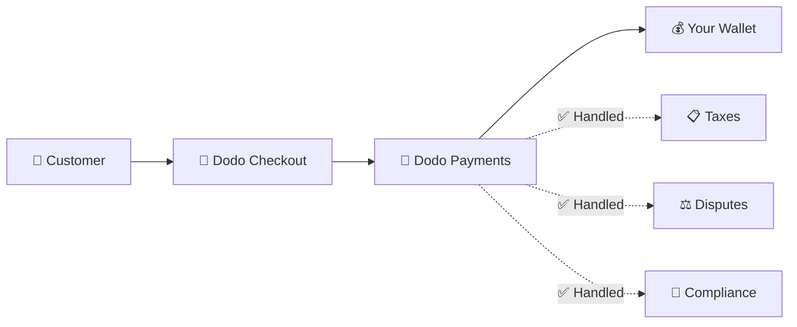
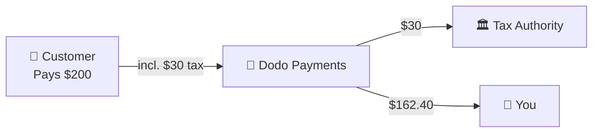

تعمل Dodo Payments كـ **Merchant of Record (MoR)** — نصبح البائع القانوني لمنتجاتك الرقمية، ونتولى مسؤولية المدفوعات، والضرائب، والاحتيال، والامتثال حتى تتمكن من التركيز تمامًا على بناء منتجك.

<CardGroup cols={3}>
<Card title="220+ منطقة" icon="globe">
الامتثال الضريبي يتم تلقائيًا
</Card>

<Card title="30+ طريقة دفع" icon="credit-card">
بطاقات، ومحافظ، وطرق محلية
</Card>

<Card title="عدم وجود تقديم ضريبي" icon="file-invoice">
نحن نتولى جميع التحويلات
</Card>
</CardGroup>

## ما هو Merchant of Record؟

**Merchant of Record** هو الكيان القانوني الذي يظهر على بيان بطاقة الائتمان لعميلك ويتحمل مسؤولية المعاملة. عندما تستخدم Dodo Payments كـ MoR:

- **نحن البائع القانوني** — تظهر Dodo على بيانات البنك والإيصالات
- **أنت منشئ المنتج** — أنت تبني، وتحدد السعر، وتقدم منتجك
- **نحن نتولى الأعمال الخلفية** — الضرائب، والنزاعات، والامتثال، ودعم الفواتير
- **أنت تتلقى المدفوعات الصافية** — يتم إيداع الإيرادات مباشرة في حسابك

<Note>
فكر في Merchant of Record كأنك تستأجر فريقًا ماليًا عالميًا يتولى الفوترة، والضرائب، والفواتير في كل بلد — دون أن ترفع إصبعك.
</Note>

## لماذا تستخدم Merchant of Record؟

بيع المنتجات الرقمية عالميًا يعني التنقل عبر ضريبة القيمة المضافة في أوروبا، وضريبة السلع والخدمات في أستراليا، وضريبة المبيعات في الولايات المتحدة، والعديد من المتطلبات الأخرى. كل ولاية قضائية لديها قواعد، ومعدلات، وحدود، ومواعيد نهائية مختلفة.

| مسؤوليتك | بدون MoR | مع Dodo كـ MoR |
|---------------------|:-----------:|:----------------:|
| تسجيل ضريبة القيمة المضافة/ضريبة السلع والخدمات | ❌ أنت | ✅ Dodo |
| حساب الضريبة | ❌ أنت | ✅ Dodo |
| تقديم الضريبة والتحويل | ❌ أنت | ✅ Dodo |
| مسؤولية استرداد المبالغ | ❌ أنت | ✅ Dodo |
| الامتثال لمعايير PCI | ❌ أنت | ✅ Dodo |
| دعم العملات المتعددة | ❌ معقد | ✅ مدمج |
| طرق الدفع المحلية | ❌ دمج كل منها | ✅ 30+ مضمونة |

<Tip>
**مثال**: بيع اشتراك بقيمة 50 يورو شهريًا لعميل فرنسي؟

**بدون MoR**: سجل لضريبة القيمة المضافة الفرنسية، وفرض 60 يورو (20% ضريبة القيمة المضافة)، وتقديم إقرارات ربع سنوية فرنسية، والتعامل مع التدقيق — باللغة الفرنسية.

**مع Dodo**: نجمع 60 يورو، وندفع 10 يورو كضريبة قيمة مضافة إلى فرنسا، وندفع لك 50 يورو ناقص الرسوم. أنت تكتب الكود.
</Tip>

## PSP مقابل MoR: الفروقات الرئيسية

فهم الفرق بين **مزود خدمة الدفع** (مثل Stripe) و**Merchant of Record** أمر ضروري.

### مزود خدمة الدفع (PSP)

يقوم PSP بمعالجة المعاملات ولكنه يتركك كبائع قانوني:

<Warning>
مع PSP، **أنت** مسؤول عن تسجيل الضرائب، والتحصيل، والتقديم، والتحويل في كل ولاية قضائية حيث لديك عملاء.
</Warning>

### Merchant of Record (Dodo)

يصبح MoR البائع القانوني، ويتولى الامتثال من البداية إلى النهاية:

<Check>
مع Dodo كـ MoR، نحن نتولى الضرائب، والنزاعات، والامتثال. تتلقى المدفوعات الصافية بدون أي أوراق.
</Check>

### مقارنة جنبًا إلى جنب

| الجانب | PSP (Stripe، إلخ) | MoR (Dodo) |
|--------|:------------------:|:----------:|
| البائع القانوني | شركتك | Dodo |
| على بيان العميل | اسمك | Dodo |
| تسجيل الضرائب | ❌ أنت | ✅ Dodo |
| حساب الضرائب | ❌ أنت | ✅ Dodo |
| تحويل الضرائب | ❌ أنت | ✅ Dodo |
| مخاطر استرداد المبالغ | ❌ أنت | ✅ Dodo |
| الامتثال لمعايير PCI | ❌ أنت | ✅ Dodo |
| الإعداد عالميًا | معقد | بسيط |

<Info>
**مهم**: كل من PSPs وMoRs يتعاملون مع معالجة المدفوعات. الفرق الرئيسي هو **من هو المسؤول قانونيًا** عن الامتثال الضريبي ومسؤولية المعاملات.
</Info>

## كيف يعمل الامتثال الضريبي

تتعامل Dodo مع دورة حياة الضرائب بالكامل تلقائيًا:

<Steps>
<Step title="موقع العميل">
نحن نكتشف بلد العميل ونحدد القواعد الضريبية التي تنطبق — ضريبة القيمة المضافة، ضريبة السلع والخدمات، ضريبة المبيعات، أو متطلبات محلية أخرى.
</Step>

<Step title="حساب المعدل">
يتم حساب معدل الضريبة الصحيح بناءً على نوع المنتج، وموقع العميل، وحالة B2B/B2C. يحصل عملاء الأعمال في الاتحاد الأوروبي الذين لديهم أرقام ضريبة قيمة مضافة صالحة على تطبيق عكس الشحن تلقائيًا.
</Step>

<Step title="التحصيل عند الخروج">
تظهر الضريبة بوضوح ويتم تحصيلها عند الخروج. يرى العملاء بالضبط ما يدفعونه.
</Step>

<Step title="التقديم والتحويل">
نقوم بتقديم الإقرارات ودفع الضرائب المحصلة للسلطات المعنية في الوقت المحدد. لن ترى أبدًا نموذج ضريبي.
</Step>
</Steps>

## تدفق الإيرادات

إليك كيف تتحرك الأموال من العميل إلى حسابك:

### مثال على توزيع المدفوعات

| بند | المبلغ |
|-----------|-------:|
| دفعة العميل | $200.00 |
| ضريبة المبيعات (15% ضريبة القيمة المضافة) | −$30.00 |
| رسوم منصة Dodo (4%) | −$8.00 |
| معالجة الدفع | −$0.60 |
| **مدفوعاتك** | **$162.40** |

## متى تختار MoR مقابل PSP

<Tabs>
<Tab title="اختر Dodo (MoR)">
**Dodo Payments مثالية إذا كنت:**

- تبيع منتجات رقمية، أو SaaS، أو اشتراكات
- لديك عملاء في دول متعددة
- تريد تجنب صداع تسجيل الضرائب
- تفضل الامتثال الخارجي القابل للتنبؤ
- تقدر السرعة في السوق على أقصى تحكم
- لا تريد إدارة النزاعات والاحتيال
</Tab>

<Tab title="فكر في PSP">
**قد يناسبك PSP إذا كنت:**

- تعمل بشكل أساسي في دولة واحدة
- لديك فرق مالية وامتثال داخلية
- تحتاج إلى تحكم مطلق في تجربة الخروج
- تعمل بهوامش ربح ضئيلة للغاية
- تبيع سلعًا مادية (تركز MoRs على الرقمية)
</Tab>
</Tabs>

<Note>
تبدأ العديد من الشركات باستخدام PSP ثم تنتقل إلى MoR مع توسعها دوليًا. تقدم Dodo دعمًا للهجرة لجعل هذا الانتقال سلسًا.
</Note>

## الأسئلة الشائعة

<AccordionGroup>
<Accordion title="ما الذي يظهر على بيان بطاقة الائتمان لعملي؟">
تظهر Dodo Payments كتاجر. نحن ندرج مرجع منتجك/علامتك التجارية حيثما تسمح حدود الأحرف، ويتلقى العملاء إيصالات مفصلة تظهر معلومات منتجك.
</Accordion>

<Accordion title="هل لا زلت أملك علاقة العميل؟">
نعم. تتحكم في التسعير، والعلامة التجارية، وتسليم المنتج، والتواصل المباشر. تتولى Dodo آليات الفوترة، لكن العملاء يعرفون أنهم يشترون منك. تظهر علامتك التجارية بشكل بارز في الخروج، والبريد الإلكتروني، والفواتير.
</Accordion>

<Accordion title="كيف تعمل ضريبة القيمة المضافة العكسية في B2B؟">
بالنسبة لمبيعات B2B في الاتحاد الأوروبي، يمكن للعملاء إدخال رقم ضريبة القيمة المضافة الخاص بهم عند الخروج. نحن نتحقق منه ونطبق العكس تلقائيًا — تنتقل الضريبة إلى إقرار ضريبة القيمة المضافة للمشتري بدلاً من جمعها.
</Accordion>

<Accordion title="هل يمكنني استخدام معالج الدفع الخاص بي؟">
تعمل Dodo كحل كامل باستخدام بنية الدفع الخاصة بنا. هذه التكامل هو ما يسمح لنا بتحمل المسؤولية عن الضرائب والاحتيال. نحن نعمل على توفير تكامل مع معالجات دفع أخرى في المستقبل.
</Accordion>

<Accordion title="كيف تعمل الاستردادات؟">
ابدأ الاستردادات من لوحة التحكم الخاصة بك. نقوم بمعالجة الاسترداد باستخدام طريقة الدفع الأصلية للعميل وعملته. يتم ضبط مبالغ الضرائب تلقائيًا وتسويتها.
</Accordion>

<Accordion title="ماذا عن ضريبة الدخل الخاصة بي؟">
تتعامل Dodo مع **ضرائب المبيعات** (ضريبة القيمة المضافة، ضريبة السلع والخدمات، ضريبة المبيعات) على معاملات العملاء. تظل مسؤولاً عن ضريبة الدخل الخاصة بعملك، وضريبة الشركات، والالتزامات الضريبية على المدفوعات التي تتلقاها.
</Accordion>

<Accordion title="إلى أي البلدان يمكنني البيع؟">
نقبل المدفوعات من 220+ دولة ومنطقة مع توسع مستمر. انظر القائمة الكاملة:

<Card title="المناطق المدعومة" icon="globe" href="/miscellaneous/list-of-countries-we-accept-payments-from">
عرض جميع 220+ دولة ومنطقة حيث نقبل المدفوعات.
</Card>
</Accordion>
</AccordionGroup>

## ابدأ الآن

<CardGroup cols={2}>
<Card title="إنشاء حساب" icon="rocket" href="https://app.dodopayments.com/signup">
سجل مجانًا وقم بقبول المدفوعات العالمية في دقائق.
</Card>

<Card title="تحليل MoR مقابل PG" icon="scale-balanced" href="/features/mor-vs-pg">
مقارنة مفصلة مع أمثلة وحالات استخدام.
</Card>

<Card title="سياسة القبول" icon="building-shield" href="/miscellaneous/merchant-acceptance">
تعرف على الأعمال التي ندعمها.
</Card>

<Card title="تحدث إلينا" icon="envelope" href="mailto:founders@dodopayments.com">
احصل على إرشادات شخصية من فريقنا.
</Card>
</CardGroup>
