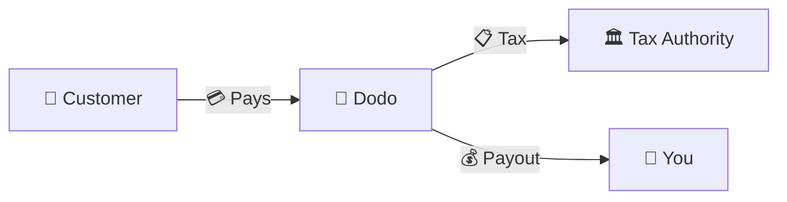
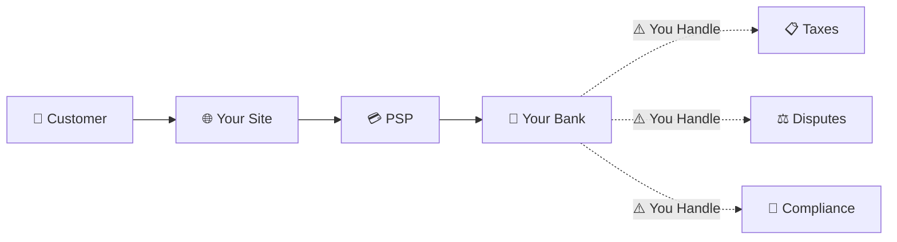
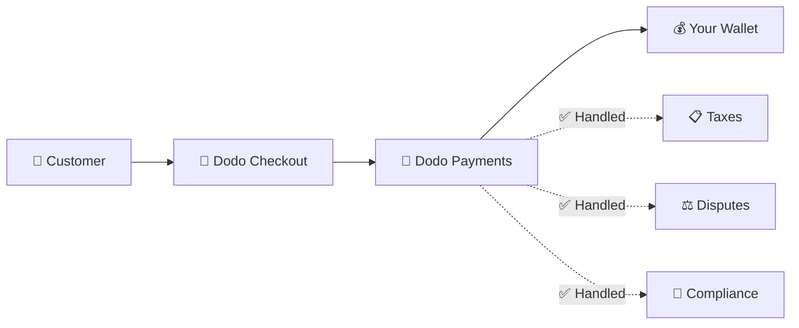
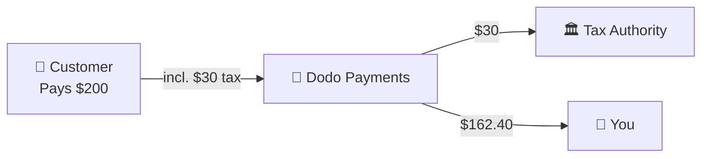

تعمل Dodo Payments كـ **Merchant of Record (MoR)** — نصبح البائع القانوني لمنتجاتك الرقمية، ونتولى مسؤولية المدفوعات، والضرائب، والاحتيال، والامتثال حتى تتمكن من التركيز تمامًا على بناء منتجك.

<CardGroup cols={3}>
{/* LOCKED_PATTERN_0dfe8c9e68953181aad63120292193bb */}
الامتثال الضريبي مُدار تلقائيًا
</Card>

{/* LOCKED_PATTERN_a7f32ee62695527a537b82d99f01c4bc */}
البطاقات والمحافظ والطرق المحلية
</Card>

{/* LOCKED_PATTERN_cb6e35d755bb02c3f1254b1c5a9c4c73 */}
نتولى جميع التحويلات
</Card>
</CardGroup>

## ما هو Merchant of Record؟

**Merchant of Record** هو الكيان القانوني الذي يظهر على بيان بطاقة الائتمان لعميلك ويتحمل مسؤولية المعاملة. عندما تستخدم Dodo Payments كـ MoR:

- **نحن البائع القانوني** — تظهر Dodo على بيانات البنك والإيصالات
- **أنت منشئ المنتج** — أنت تبني، وتحدد السعر، وتقدم منتجك
- **نحن نتولى الأعمال الخلفية** — الضرائب، والنزاعات، والامتثال، ودعم الفواتير
- **أنت تتلقى المدفوعات الصافية** — يتم إيداع الإيرادات مباشرة في حسابك

<Note>
فكر في التاجر المعتمد كأنك تستأجر فريق مالي عالمي يتولى الفواتير والضرائب والفوترة في كل بلد — دون أن ترفع إصبعًا.
</Note>

## لماذا تستخدم Merchant of Record؟

بيع المنتجات الرقمية عالميًا يعني التنقل عبر ضريبة القيمة المضافة في أوروبا، وضريبة السلع والخدمات في أستراليا، وضريبة المبيعات في الولايات المتحدة، والعديد من المتطلبات الأخرى. كل ولاية قضائية لديها قواعد، ومعدلات، وحدود، ومواعيد نهائية مختلفة.

| مسؤوليتك | بدون MoR | مع Dodo كـ MoR |
|---------------------|:-----------:|:----------------:|
| تسجيل ضريبة القيمة المضافة/ضريبة السلع والخدمات | ❌ أنت | ✅ Dodo |
| حساب الضريبة | ❌ أنت | ✅ Dodo |
| تقديم الضريبة والتحويل | ❌ أنت | ✅ Dodo |
| مسؤولية استرداد المبالغ | ❌ أنت | ✅ Dodo |
| الامتثال لمعايير PCI | ❌ أنت | ✅ Dodo |
| دعم العملات المتعددة | ❌ معقد | ✅ مدمج |
| طرق الدفع المحلية | ❌ دمج كل منها | ✅ 30+ مضمونة |

<Tip>
**مثال**: تبيع اشتراكًا بقيمة 50 يورو في الشهر لعميل فرنسي؟

**بدون MoR**: سجل لضريبة القيمة المضافة الفرنسية، وفرض 60 يورو (20% ضريبة القيمة المضافة)، وتقديم إقرارات ربع سنوية فرنسية، والتعامل مع التدقيق — باللغة الفرنسية.

**مع دودو**: نجمع 60 يورو، نحيل 10 يورو ضريبة قيمة مضافة إلى فرنسا، وندفع لك 50 يورو ناقص الرسوم. أنت تكتب الشيفرة.
</Tip>

## PSP مقابل MoR: الفروقات الرئيسية

فهم الفرق بين **مزود خدمة الدفع** (مثل Stripe) و**Merchant of Record** أمر ضروري.

### مزود خدمة الدفع (PSP)

يقوم PSP بمعالجة المعاملات ولكنه يتركك كبائع قانوني:

<Warning>
مع مزود خدمات الدفع، **أنت** المسؤول عن تسجيل الضرائب وجمعها وتقديم الإقرارات وتحويلها في كل سلطة قضائية تتواجد فيها عملاء.
</Warning>

### Merchant of Record (Dodo)

يصبح MoR البائع القانوني، ويتولى الامتثال من البداية إلى النهاية:

<Check>
مع دودو كتاجر معتمد، نتولى الضرائب والنزاعات والامتثال. تتلقى المدفوعات الصافية بدون أي أوراق.
</Check>

### مقارنة جنبًا إلى جنب

| الجانب | PSP (Stripe، إلخ) | MoR (Dodo) |
|--------|:------------------:|:----------:|
| البائع القانوني | شركتك | Dodo |
| على بيان العميل | اسمك | Dodo |
| تسجيل الضرائب | ❌ أنت | ✅ Dodo |
| حساب الضرائب | ❌ أنت | ✅ Dodo |
| تحويل الضرائب | ❌ أنت | ✅ Dodo |
| مخاطر استرداد المبالغ | ❌ أنت | ✅ Dodo |
| الامتثال لمعايير PCI | ❌ أنت | ✅ Dodo |
| الإعداد عالميًا | معقد | بسيط |

<Info>
**مهم**: كلا من مزودي خدمات الدفع والتجار المعتمدين يتولون معالجة الدفع. الفرق الرئيسي هو **من المسؤول قانونيًا** عن الامتثال الضريبي ومسؤولية المعاملات.
</Info>

## كيف يعمل الامتثال الضريبي

تتعامل Dodo مع دورة حياة الضرائب بالكامل تلقائيًا:

<Steps>
{/* LOCKED_PATTERN_9939f53f87faa28f5e85c7bcd4aa5d90 */}
نحدد دولة العميل ونقرر أي قواعد ضريبية تنطبق — ضريبة القيمة المضافة، ضريبة السلع والخدمات، ضريبة المبيعات، أو متطلبات محلية أخرى.
</Step>

{/* LOCKED_PATTERN_70142fc485c0e1d535a43e599b490143 */}
يتم حساب معدل الضريبة الصحيح بناءً على نوع المنتج وموقع العميل وحالة الأعمال/المستهلك. يحصل العملاء التجاريون في الاتحاد الأوروبي الذين لديهم أرقام ضريبة قيمة مضافة صالحة على تطبيق التحويل العكسي.
</Step>

{/* LOCKED_PATTERN_44b82b1d71e9f255cf562f67916ee9b7 */}
تُعرض الضريبة بوضوح ويتم تحصيلها عند الدفع. يرى العملاء بالضبط ما يدفعونه.
</Step>

{/* LOCKED_PATTERN_1a778e95cb3812007334c0b47194f9ac */}
نقدم الإقرارات ونُدفع الضرائب المحصلة إلى الجهات المختصة في المواعيد المحددة. لن ترى نموذجًا ضريبيًا أبدًا.
</Step>
</Steps>

## تدفق الإيرادات

إليك كيف تتحرك الأموال من العميل إلى حسابك:

### مثال على توزيع المدفوعات

| بند | المبلغ |
|-----------|-------:|
| دفعة العميل | $200.00 |
| ضريبة المبيعات (15% ضريبة القيمة المضافة) | −$30.00 |
| رسوم منصة Dodo (4%) | −$8.00 |
| معالجة الدفع | −$0.60 |
| **مدفوعاتك** | **$162.40** |

## متى تختار MoR مقابل PSP

<Tabs>
{/* LOCKED_PATTERN_1d2e428d12b1ee53f2d946d9302bede1 */}
**دودو بايمنتس مثالي إذا كنت:**

- تبيع منتجات رقمية أو خدمات SaaS أو اشتراكات
- لديك عملاء عبر عدة دول
- ترغب في تجنب متاعب تسجيل الضرائب
- تفضل امتثالًا متوقعًا وموكلًا للخارج
- تُقدر السرعة في الوصول إلى السوق على التحكم الأقصى
- لا ترغب في إدارة النزاعات والاحتيال
</Tab>

{/* LOCKED_PATTERN_9020967e8e2c9a3ebc575f4072e18e76 */}
**قد يناسبك مزود خدمات الدفع إذا كنت:**

- تعمل أساسًا في بلد واحد
- لديك فرق مالية وامتثال داخلية
- تحتاج إلى سيطرة مطلقة على تجربة الخروج
- تعمل بهوامش ربح ضئيلة جدًا
- تبيع سلعًا مادية (يركز التجار المعتمدون على الرقمي)
</Tab>
</Tabs>

<Note>
تبدأ العديد من الشركات بمزود خدمات دفع ثم تنتقل إلى تاجر معتمد أثناء توسعها دوليًا. تقدم دودو دعمًا للانتقال لجعل هذه العملية سلسة.
</Note>

## الأسئلة الشائعة

<AccordionGroup>
{/* LOCKED_PATTERN_03db007d1397fc75cc7c059a12f7514d */}
تظهر دودو بايمنتس كتاجر. ندرج مرجع منتجك/علامتك التجارية حيثما تسمح حدود الأحرف، ويتلقى العملاء إيصالات مفصلة تُظهر معلومات منتجك.
</Accordion>

{/* LOCKED_PATTERN_14efbd55af6b9971cc9bb290118d1ce5 */}
نعم. أنت تتحكم في التسعير والعلامة التجارية وتسليم المنتج والتواصل المباشر. تتولى دودو آليات الفوترة، لكن العملاء يعرفون أنهم يشترون منك. تظهر علامتك بشكل بارز في صفحة الدفع والبريد الإلكتروني والفواتير.
</Accordion>

{/* LOCKED_PATTERN_5e87ff5ce15f8c25ec293008878ec1c8 */}
بالنسبة للمبيعات بين الأعمال في الاتحاد الأوروبي، يمكن للعملاء إدخال رقم ضريبة القيمة المضافة عند الدفع. نتحقق منه ونطبق التحويل العكسي تلقائيًا — تنتقل الضريبة إلى الإقرار الضريبي للمشتري بدلًا من جمعها.
</Accordion>

{/* LOCKED_PATTERN_828a96aed23c294d40585d542017c689 */}
تعمل دودو كحل كامل باستخدام بنية الدفع الخاصة بنا. هذا التكامل هو ما يتيح لنا تحمل مسؤولية الضرائب والاحتيال. نعمل على تقديم تكامل مع معالجات دفع أخرى في المستقبل.
</Accordion>

{/* LOCKED_PATTERN_7d718a1b657f28e952148f962ca6593e */}
ابدأ عمليات الاسترداد من لوحة التحكم الخاصة بك. نعالج الاسترداد بطريقة الدفع الأصلية للعملاء وبعملتهم. يتم ضبط مبالغ الضرائب ومطابقتها تلقائيًا.
</Accordion>

{/* LOCKED_PATTERN_dc7f113144600495109fc2c229c89f70 */}
تتولى دودو **ضرائب المبيعات** (ضريبة القيمة المضافة، ضريبة السلع والخدمات، ضريبة المبيعات) على معاملات العملاء. تظل مسؤولًا عن ضريبة دخل شركتك وضريبة الشركات والالتزامات الضريبية على المدفوعات التي تتلقاها.
</Accordion>

{/* LOCKED_PATTERN_04ec30ba2875e1ca25e9a1ae1dcc112d */}
نقبل المدفوعات من أكثر من 220 دولة ومنطقة مع توسع مستمر. راجع القائمة الكاملة:
</Accordion>

{/* LOCKED_PATTERN_1baa59aa331aff639990872bb61046bd */}
عرض كل أكثر من 220 دولة ومنطقة نقبل منها المدفوعات.
</Card>
</Accordion>
</AccordionGroup>

## ابدأ الآن

<CardGroup cols={2}>
{/* LOCKED_PATTERN_a6e00712f4bf1e0645985bccec8d5def */}
سجل مجانًا واستقبل المدفوعات العالمية في دقائق.
</Card>

{/* LOCKED_PATTERN_d858044e80838a32f52c51b21b17f5eb */}
مقارنة مفصلة مع أمثلة وحالات استخدام.
</Card>

{/* LOCKED_PATTERN_4e501d9df0a1b75ab7c08a16b87219c5 */}
تعرف على الشركات التي ندعمها.
</Card>

{/* LOCKED_PATTERN_6053eaa23d9fa4210c02c58e94af8536 */}
احصل على إرشاد مخصص من فريقنا.
</Card>
</CardGroup>
