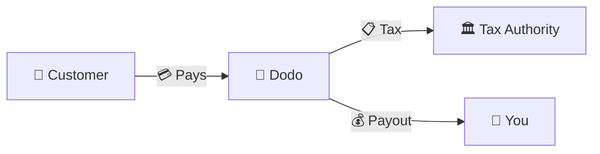
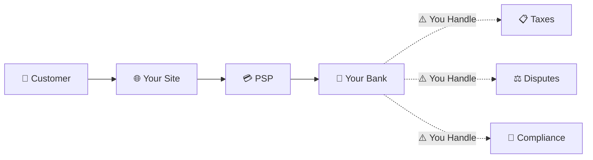
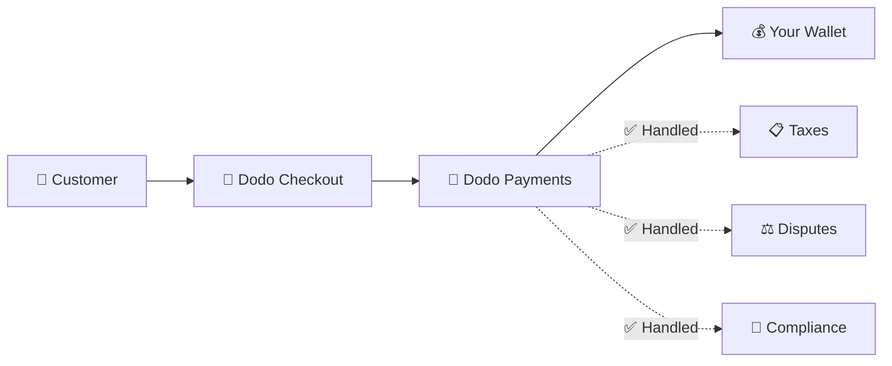
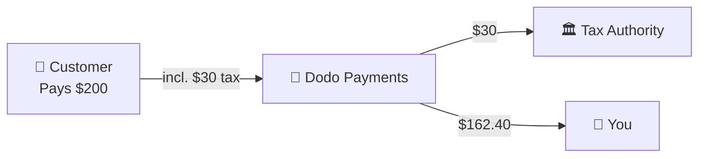

Dodo Payments operates as a **Merchant of Record (MoR)** — we become the legal seller of your digital products, taking on the responsibility for payments, taxes, fraud, and compliance so you can focus entirely on building your product.

<CardGroup cols={3}>
<Card title="220+ Regions" icon="globe">
Tax compliance handled automatically
</Card>

<Card title="30+ Payment Methods" icon="credit-card">
Cards, wallets, and local methods
</Card>

<Card title="Zero Tax Filing" icon="file-invoice">
We handle all remittance
</Card>
</CardGroup>

## What Is a Merchant of Record?

A **Merchant of Record** is the legal entity that appears on your customer's credit card statement and assumes responsibility for the transaction. When you use Dodo Payments as your MoR:

- **We are the legal seller** — Dodo appears on bank statements and receipts
- **You are the product creator** — You build, price, and deliver your product
- **We handle the back office** — Taxes, disputes, compliance, and billing support
- **You receive net payouts** — Revenue deposited directly to your account

<Note>
Think of a Merchant of Record as hiring a global finance team that handles invoicing, taxes, and billing in every country — without you lifting a finger.
</Note>

## Why Use a Merchant of Record?

Selling digital products globally means navigating VAT in Europe, GST in Australia, Sales Tax in the US, and countless other requirements. Each jurisdiction has different rules, rates, thresholds, and filing deadlines.

| Your Responsibility | Without MoR | With Dodo as MoR |
|---------------------|:-----------:|:----------------:|
| VAT/GST Registration | ❌ You | ✅ Dodo |
| Tax Calculation | ❌ You | ✅ Dodo |
| Tax Filing & Remittance | ❌ You | ✅ Dodo |
| Chargeback Liability | ❌ You | ✅ Dodo |
| PCI Compliance | ❌ You | ✅ Dodo |
| Multi-Currency Support | ❌ Complex | ✅ Built-in |
| Local Payment Methods | ❌ Integrate Each | ✅ 30+ Included |

<Tip>
**Example**: Selling a €50/month subscription to a French customer?

**Without MoR**: Register for French VAT, charge €60 (20% VAT), file quarterly French returns, handle audits—in French.

**With Dodo**: We collect €60, remit €10 VAT to France, and pay you €50 minus fees. You write code.
</Tip>

## PSP vs. MoR: Key Differences

Understanding the difference between a **Payment Service Provider** (like Stripe) and a **Merchant of Record** is essential.

### Payment Service Provider (PSP)

A PSP processes transactions but leaves you as the legal seller:

<Warning>
With a PSP, **you** are responsible for tax registration, collection, filing, and remittance in every jurisdiction where you have customers.
</Warning>

### Merchant of Record (Dodo)

An MoR becomes the legal seller, handling compliance end-to-end:

<Check>
With Dodo as MoR, we handle taxes, disputes, and compliance. You receive net payouts with zero paperwork.
</Check>

### Side-by-Side Comparison

| Aspect | PSP (Stripe, etc.) | MoR (Dodo) |
|--------|:------------------:|:----------:|
| Legal Seller | Your Company | Dodo |
| On Customer Statement | Your Name | Dodo |
| Tax Registration | ❌ You | ✅ Dodo |
| Tax Calculation | ❌ You | ✅ Dodo |
| Tax Remittance | ❌ You | ✅ Dodo |
| Chargeback Risk | ❌ You | ✅ Dodo |
| PCI Compliance | ❌ You | ✅ Dodo |
| Setup for Global | Complex | Simple |

<Info>
**Important**: Both PSPs and MoRs handle payment processing. The key difference is **who is legally responsible** for tax compliance and transaction liability.
</Info>

## How Tax Compliance Works

Dodo handles the entire tax lifecycle automatically:

<Steps>
<Step title="Customer Location">
We detect the customer's country and determine which tax rules apply — VAT, GST, Sales Tax, or other local requirements.
</Step>

<Step title="Rate Calculation">
The correct tax rate is calculated based on product type, customer location, and B2B/B2C status. EU business customers with valid VAT numbers get reverse charge applied.
</Step>

<Step title="Collection at Checkout">
Tax is clearly displayed and collected at checkout. Customers see exactly what they're paying.
</Step>

<Step title="Filing & Remittance">
We file returns and pay collected taxes to the relevant authorities on schedule. You never see a tax form.
</Step>
</Steps>

## Revenue Flow

Here's how money moves from customer to your account:

### Example Payout Breakdown

| Line Item | Amount |
|-----------|-------:|
| Customer Payment | $200.00 |
| Sales Tax (15% VAT) | −$30.00 |
| Dodo Platform Fee (4%) | −$8.00 |
| Payment Processing | −$0.60 |
| **Your Payout** | **$162.40** |

## When to Choose MoR vs. PSP

<Tabs>
<Tab title="Choose Dodo (MoR)">
**Dodo Payments is ideal if you:**

- Sell digital products, SaaS, or subscriptions
- Have customers across multiple countries
- Want to avoid tax registration headaches
- Prefer predictable, outsourced compliance
- Value speed to market over maximum control
- Don't want to manage disputes and fraud
</Tab>

<Tab title="Consider a PSP">
**A PSP might suit you if you:**

- Operate primarily in one country
- Have in-house finance and compliance teams
- Need absolute control over checkout UX
- Work with extremely thin margins
- Sell physical goods (MoRs focus on digital)
</Tab>
</Tabs>

<Note>
Many businesses start with a PSP and switch to an MoR as they scale internationally. Dodo offers migration support to make this transition seamless.
</Note>

## Frequently Asked Questions

<AccordionGroup>
<Accordion title="What appears on my customer's credit card statement?">
Dodo Payments appears as the merchant. We include your product/brand reference where character limits allow, and customers receive detailed receipts showing your product information.
</Accordion>

<Accordion title="Do I still own the customer relationship?">
Yes. You control pricing, branding, product delivery, and direct communication. Dodo handles billing mechanics, but customers know they're buying from you. Your brand appears prominently in checkout, emails, and invoices.
</Accordion>

<Accordion title="How does B2B VAT reverse charge work?">
For B2B sales in the EU, customers can enter their VAT number at checkout. We validate it and apply reverse charge automatically — the tax shifts to the buyer's VAT return instead of being collected.
</Accordion>

<Accordion title="Can I use my own payment processor?">
Dodo operates as a complete solution using our payment infrastructure. This integration is what allows us to assume tax and fraud liability. We are working on providing an integration with other payment processors in the future.
</Accordion>

<Accordion title="How do refunds work?">
Initiate refunds from your dashboard. We process the refund in the customer's original payment method and currency. Tax amounts are automatically adjusted and reconciled.
</Accordion>

<Accordion title="What about my income tax?">
Dodo handles **sales taxes** (VAT, GST, Sales Tax) on customer transactions. You remain responsible for your business's income tax, corporate tax, and tax obligations on the payouts you receive.
</Accordion>

<Accordion title="Which countries can I sell to?">
We accept payments from 220+ countries and regions with continuous expansion. See the full list:

<Card title="Supported Regions" icon="globe" href="/miscellaneous/list-of-countries-we-accept-payments-from">
View all 220+ countries and regions where we accept payments.
</Card>
</Accordion>
</AccordionGroup>

## Get Started

<CardGroup cols={2}>
<Card title="Create Account" icon="rocket" href="https://app.dodopayments.com/signup">
Sign up free and accept global payments in minutes.
</Card>

<Card title="MoR vs PG Deep Dive" icon="scale-balanced" href="/features/mor-vs-pg">
Detailed comparison with examples and use cases.
</Card>

<Card title="Acceptance Policy" icon="building-shield" href="/miscellaneous/merchant-acceptance">
Learn what businesses we support.
</Card>

<Card title="Talk to Us" icon="envelope" href="mailto:founders@dodopayments.com">
Get personalized guidance from our team.
</Card>
</CardGroup>
