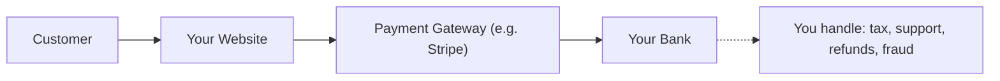
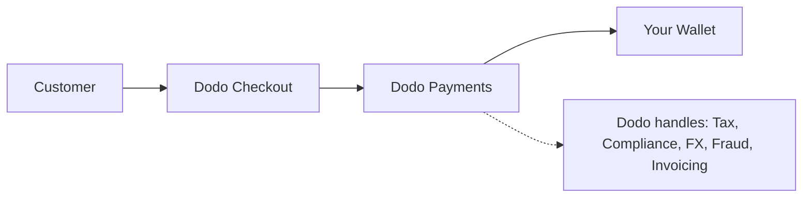

## المقدمة

هذا الدليل يقارن نموذج MoR مع نهج بوابة الدفع التقليدية، مما يساعدك على فهم المزايا التي تقدمها Dodo Payments لعملك.

## الفرق الأساسي

| الميزة                          | MoR (Dodo Payments)         | بوابة الدفع (PG التقليدية)           |
|----------------------------------|--------------------------------------------|--------------------------------------------|
| البائع القانوني                     | Dodo Payments (MoR)                        | شركتك                               |
| جمع الضرائب والتحويل     | يتم التعامل معه بواسطة Dodo                            | أنت المسؤول                        |
| عبء الامتثال والتنظيم  | تتحمل Dodo المسؤولية                     | أنت تتعامل مع القوانين المحلية والخصومات      |
| عملة التسوية             | USD، EUR، INR، وأكثر من 25 عملة أخرى مدعومة    | يعتمد على حساب التاجر الخاص بك           |
| إدارة المخاطر                 | حماية مدمجة من الاحتيال والخصومات   | أنت تقوم بإعداد أدواتك الخاصة (مثل Stripe Radar) |
| المدفوعات                         | مدفوعات عالمية مجمعة ومبسطة   | مباشرة من PG إليك، مع إعداد مصرفي     |

## ماذا يعني لك

مع **Dodo كـ MoR**، نصبح البائع القانوني لعملائك، مما يتيح لك:

- تخطي إعداد الكيانات المحلية
- تجنب التعامل مع ضريبة القيمة المضافة، أو ضريبة السلع والخدمات، أو ضريبة المبيعات
- تقديم المزيد من طرق الدفع عالميًا
- تقليل المخاطر القانونية
- الانطلاق بشكل أسرع في الأسواق الجديدة

<Note>
تخيل بيع اشتراك رقمي لمستخدم في فرنسا. مع Dodo Payments، نجمع المدفوعات، ونقدم ضريبة القيمة المضافة للسلطات الفرنسية، ونرسل لك الإيرادات الصافية. لا صداع ضريبي. لا محامون. فقط نمو.
</Note>

بالإضافة إلى ذلك، يبسط نموذج MoR مكتبك الخلفي بالكامل. بصفتك MoR الخاص بك، تتولى Dodo الامتثال لمعايير PCI، واكتشاف الاحتيال، وتحويل العملات، وحتى دعم فواتير العملاء، مما يحرر فريقك للتركيز على المنتج والنمو.

## مقارنة بصرية

**تدفق الإيرادات: بوابة الدفع**

**تدفق الإيرادات: تاجر السجل (Dodo)**

## لماذا يهم ذلك لشركات SaaS والأعمال الرقمية

مع توسع عملك، يمكن أن يصبح إدارة الضرائب، والامتثال، وتفضيلات الدفع العالمية أمرًا مرهقًا. مع بوابة الدفع، أنت مسؤول عن:

- تسجيل ضريبة القيمة المضافة/ضريبة السلع والخدمات وتقديمها في عدة ولايات قضائية
- إدارة تحويل العملات والخصومات
- توفير تجربة دفع محلية وطرق دفع مخصصة

مع Dodo Payments كـ MoR:
- يمكنك التوسع عالميًا دون إعداد كيانات محلية
- يتم حساب الضرائب وجمعها وتحويلها نيابة عنك
- تحصل على الوصول إلى مكتبة من طرق الدفع المصممة لعملائك
- نحن نعمل كحاجز قانوني وشريك تشغيلي لك

<Tip>
"فكر في بوابة الدفع كأنها نفق. الآن تخيل تاجر السجل كأنه نفق، قطار، سائق، وموظفي تذاكر جميعهم في واحد."
</Tip>

## من يجب أن يستخدم MoR؟

Dodo Payments مثالي لـ:
- شركات SaaS والمنتجات الرقمية
- المبدعين المستقلين ورواد الأعمال الفرديين
- الأعمال العالمية التي لديها عملاء في أكثر من 100 دولة
- الشركات التي لا ترغب في إدارة الضرائب والامتثال داخليًا

إذا كنت تتوسع دوليًا، أو تبيع اشتراكات، أو ترغب فقط في تقليل الصداع التشغيلي، فإن MoR هو الخيار الأكثر ذكاءً.

## متى يجب استخدام بوابة الدفع بدلاً من ذلك

هناك حالات قد يكون فيها استخدام بوابة الدفع فقط منطقيًا:
- عملك يعمل فقط في دولة واحدة
- لديك بالفعل موارد داخلية للمالية والامتثال
- تحتاج إلى السيطرة الكاملة على تجربة فواتير العملاء
- أنت حساس جدًا للتكاليف مع هوامش ربح ضئيلة عند النطاق

<Note>
بالنسبة للعديد من الشركات الناشئة، قد يكون استخدام بوابة الدفع كافيًا في البداية - ولكن مع زيادة التعقيد، يمكن أن يوفر التحول إلى MoR الوقت، ويقلل المخاطر، ويسرع النمو الدولي.
</Note>

## لماذا تختار Dodo Payments

تقدم Dodo Payments:
- مجموعة شاملة من المدفوعات والضرائب والامتثال
- دعم فوري للعملات المتعددة
- الوصول إلى أكثر من 30 طريقة دفع
- فواتير قائمة على المقاعد، اشتراكات، ومدفوعات لمرة واحدة
- معالجة الضرائب تلقائيًا في أكثر من 150 دولة
- منع الاحتيال المدمج والامتثال لمعايير PCI

سواء كنت مؤسسًا فرديًا أو فريق SaaS في مرحلة النمو، فإن Dodo تبسط تعقيدات البيع عالميًا.

## تعرف على المزيد

<CardGroup cols={2}>
<Card title="دعم العملات التكيفية" icon="money-bill-wave" href="/features/adaptive-currency">
تعرف على كيفية تقديم Dodo تلقائيًا الأسعار بعملات عملائك المحلية
</Card>

<Card title="طرق الدفع المدعومة" icon="credit-card" href="/features/payment-methods">
اكتشف أكثر من 30 طريقة دفع متاحة من خلال Dodo Payments
</Card>
</CardGroup>

## هل أنت مستعد للتبديل؟

انضم إلى أكثر من 3000 شركة رقمية تستخدم Dodo Payments للبيع عالميًا، دون حدود أو اختناقات.

<CardGroup cols={2}>
<Card title="سجل مجانًا" icon="user-plus" href="https://app.dodopayments.com/signup">
أنشئ حسابك في Dodo Payments وابدأ البيع عالميًا اليوم
</Card>

<Card title="تحدث إلى المبيعات" icon="envelope" href="mailto:founders@dodopayments.com">
احصل على إرشادات مخصصة من فريقنا
</Card>
</CardGroup>

<Tip>
دع Dodo تتولى الأمور الصعبة - حتى تتمكن من التركيز على بناء منتج رائع.
</Tip>