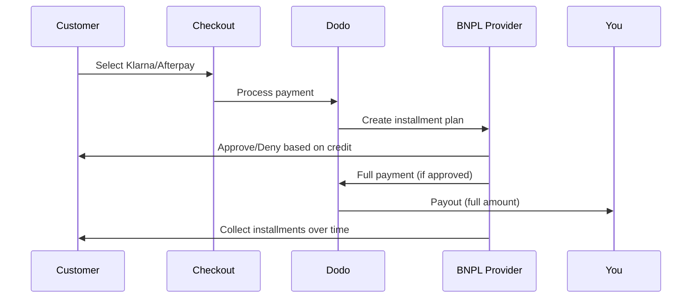

يتيح خيار اشتر الآن وادفع لاحقًا (BNPL) للعملاء تقسيم المشتريات إلى أقساط خالية من الفوائد، مما يزيد متوسط قيمة الطلب بنسبة 20-50٪ ومعدلات التحويل بنسبة 10-30٪ للمعاملات المؤهلة.

## لماذا تقديم BNPL؟

<CardGroup cols={3}>
<Card title="Higher AOV" icon="chart-line">
ينفق العملاء أكثر عندما يتمكنون من توزيع المدفوعات على مدى الزمن. يزيد متوسط قيمة الطلب بنسبة 20-50٪.
</Card>

<Card title="Better Conversion" icon="percent">
إزالة الاحتكاك في الدفع عند الخروج. تتحسن معدلات التحويل بنسبة 10-30٪ للسلع ذات القيمة العالية.
</Card>

<Card title="Zero Risk" icon="shield-check">
يتولى مقدمو BNPL مخاطر الائتمان والتحصيل. تتلقى الدفعة الكاملة مقدمًا.
</Card>
</CardGroup>

## المزودون المدعومون

### Klarna

| الميزة | التفاصيل |
| :------ | :------ |
| **التوفر** | الولايات المتحدة + 19 دولة أوروبية |
| **العملات** | USD، EUR، GBP، DKK، NOK، SEK، CZK، RON، PLN، CHF |
| **الحد الأدنى** | $50.01 (أو ما يعادله) |
| **الاشتراكات** | لا |

**الدول المدعومة:** النمسا، بلجيكا، جمهورية التشيك، الدنمارك، فنلندا، فرنسا، ألمانيا، اليونان، أيرلندا، إيطاليا، هولندا، النرويج، بولندا، البرتغال، رومانيا، إسبانيا، السويد، سويسرا، المملكة المتحدة، الولايات المتحدة

**خيارات الدفع:**
- **Pay in 4** — قسّم المدفوعات إلى 4 دفعات بدون فوائد
- **Pay in 30 days** — الدفع الكامل مستحق خلال 30 يومًا
- **Financing** — خطط تقسيط أطول أمدًا

### Afterpay (Clearpay)

| الميزة | التفاصيل |
| :------ | :------ |
| **التوفر** | الولايات المتحدة، المملكة المتحدة |
| **العملات** | USD، GBP |
| **الحد الأدنى** | $50.01 (أو ما يعادله) |
| **الاشتراكات** | لا |

**خيارات الدفع:**
- **Pay in 4** — أربع دفعات بدون فوائد كل أسبوعين

<Note>
في المملكة المتحدة، تعمل Afterpay باسم «Clearpay» لكنها تستخدم نفس نوع واجهة برمجة التطبيقات (`afterpay_clearpay`).
</Note>

### Billie

| الميزة | التفاصيل |
| :------ | :------ |
| **التوفر** | عالمي |
| **العملات** | GBP |
| **الحد الأدنى** | لا يوجد |
| **الاشتراكات** | لا |

**حول Billie:** Billie هي حل اشتر الآن وادفع لاحقًا موجه للشركات يتيح للأعمال تقديم شروط دفع مرنة لعملائها. صُمّم للتعاملات بين الشركات التي يحتاج فيها المشترون إلى خيارات دفع تستند إلى الفواتير.

**خيارات الدفع:**
- **Invoice Payment** — ادفع ضمن شروط الدفع المتفق عليها
- **Flexible Terms** — جداول دفع ودية للأعمال

## التكوين

### أنواع طرق واجهة برمجة التطبيقات

| النوع | المزود |
| :--- | :------- |
| `klarna` | Klarna |
| `afterpay_clearpay` | Afterpay / Clearpay |
| `billie` | Billie (B2B) |

### مثال

```javascript
const session = await client.checkoutSessions.create({
  product_cart: [{ product_id: 'prod_123', quantity: 1 }],
  allowed_payment_method_types: [
    'klarna',
    'afterpay_clearpay',
    'credit',
    'debit'
  ],
  customer: {
    email: 'customer@example.com',
    name: 'Jane Smith'
  },
  billing_address: {
    country: 'US',
    zipcode: '10001'
  },
  return_url: 'https://example.com/success'
});
```

<Warning>
تأكد دائمًا من تضمين `credit` و `debit` كحلول احتياطية. ليس كل العملاء مؤهلين لـ BNPL، والمعاملات التي تقل عن $50.01 لن تكون مؤهلة.
</Warning>

## الحد الأدنى لمبلغ المعاملة

**كلا من Klarna وAfterpay يتطلبان حدًا أدنى قدره 50.01 دولارًا أمريكيًا** (أو ما يعادله بالعملات المدعومة).

المعاملات التي تقل عن هذا الحد:
- لن تظهر خيارات BNPL عند الخروج
- لا يتم إظهار خطأ — فقط لن تظهر الخيارات
- تظل مدفوعات البطاقات متاحة

هذا سلوك متوقع. لا تُدرج BNPL في `allowed_payment_method_types` للمنتجات التي تقل عن 50 دولارًا.

## كيف تعمل الأقساط



**النقاط الأساسية:**
- تتلقى الدفعة الكاملة مقدمًا من مزود BNPL
- يتولى مزود BNPL مخاطر الائتمان والتحصيل
- يدفع العميل للمزود مباشرةً عبر 4 أقساط (عادةً)
- لا توجد استردادات من فشل الأقساط — فهذه مسؤولية المزود

## الاختبار

### بيانات اختبار Klarna

استخدم هذه التفاصيل في وضع الاختبار:

| الحقل | الموافق عليه | المرفوض |
| :---- | :------- | :----- |
| **تاريخ الميلاد** | 07-10-1970 | 07-10-1970 |
| **الاسم الأول** | Test | Test |
| **اسم العائلة** | Person-us | Person-us |
| **البريد الإلكتروني** | customer@email.us | customer+denied@email.us |
| **الشارع** | Amsterdam Ave | Amsterdam Ave |
| **رقم المنزل** | 509 | 509 |
| **المدينة** | New York | New York |
| **الولاية** | New York | New York |
| **الرمز البريدي** | 10024-3941 | 10024-3941 |
| **الهاتف** | +13106683312 | +13106354386 |

<Note>
يجب أن تكون المعاملة بقيمة 50 دولارًا على الأقل لكي تظهر Klarna كخيار.
</Note>

### اختبار Afterpay

<Steps>
<Step title="Select Afterpay">
اختر Afterpay في صفحة الخروج واضغط على دفع.
</Step>

<Step title="Successful payment">
استخدم أي بريد إلكتروني صالح وعنوان شحن.
</Step>

<Step title="Failed authentication">
لاختبار الفشل: أغلق نافذة Afterpay المنبثقة في صفحة إعادة التوجيه. يتحول وضع الدفع إلى `requires_payment_method`.
</Step>
</Steps>

## أفضل الممارسات

<AccordionGroup>
<Accordion title="Target high-ticket items">
يعمل BNPL بأفضل شكل مع المنتجات التي تتراوح قيمتها بين 100 و1000 دولار. تكون قيمة عرض «ادفع على مدى الزمن» أكثر إقناعًا في هذا النطاق.
</Accordion>

<Accordion title="Show installment amounts">
«4 دفعات بقيمة 25 دولارًا» أكثر جاذبية من «100 دولار مع Klarna». اعرض مبلغ كل دفعة عندما يكون ذلك ممكنًا.
</Accordion>

<Accordion title="Don't force BNPL for low-value products">
تحت 50 دولارًا، لن يظهر BNPL على أي حال. تحت 100 دولار، يفضل معظم العملاء البطاقات. ركّز ترويج BNPL على العناصر الأعلى سعرًا.
</Accordion>

<Accordion title="Collect billing address">
يتطلب مقدمو BNPL معلومات الفوترة لإجراء فحوصات الائتمان. تأكد من أن صفحة الخروج تجمع تفاصيل العنوان بالكامل.
</Accordion>

<Accordion title="Set clear expectations">
يجب أن يفهم العملاء أنهم يدخلون في اتفاقية ائتمان مع Klarna/Afterpay، وليس معك.
</Accordion>
</AccordionGroup>

## القيود

### لا توجد اشتراكات
طرق الدفع BNPL لا تدعم المدفوعات المتكررة. للمنتجات القائمة على الاشتراك، استخدم البطاقات أو غيرها من الطرق المتوافقة مع المدفوعات المتكررة.

### الموافقة القائمة على الائتمان
يقوم مزودو BNPL بإجراء فحوصات ائتمانية فورية. لن تتم الموافقة على جميع العملاء. تختلف معدلات الموافقة بناءً على:
- تاريخ العميل الائتماني لدى المزود
- مبلغ المعاملة
- موقع العميل

### خريطة العملة والدولة

كل عملة مقيدة بمنطقتها المقابلة:

| العملة | الدول المدعومة |
| :------- | :------------------ |
| **USD** | الولايات المتحدة فقط |
| **EUR** | جميع الدول الأوروبية المدعومة (النمسا، بلجيكا، جمهورية التشيك، الدنمارك، فنلندا، فرنسا، ألمانيا، اليونان، أيرلندا، إيطاليا، هولندا، النرويج، بولندا، البرتغال، رومانيا، إسبانيا، السويد، سويسرا) |
| **GBP** | المملكة المتحدة وجميع الدول الأوروبية المدعومة |

العملات الأخرى المدعومة من Klarna (DKK، NOK، SEK، CZK، RON، PLN، CHF) تعمل في بلدانها المعنية.

<Info>
على سبيل المثال، ستظهر خيارات BNPL لمعاملة بالدولار فقط للعملاء في الولايات المتحدة. ستظهر لمعاملة باليورو في جميع الدول الأوروبية المدعومة. ستظهر لمعاملة بالجنيه الإسترليني للعملاء في المملكة المتحدة وجميع الدول الأوروبية المدعومة.
</Info>

| المزود | العملات المدعومة |
| :------- | :------------------- |
| Klarna | USD، EUR، GBP، DKK، NOK، SEK، CZK، RON، PLN، CHF |
| Afterpay | USD (الولايات المتحدة)، GBP (المملكة المتحدة) |

## استكشاف الأخطاء وإصلاحها

<AccordionGroup>
<Accordion title="BNPL not appearing at checkout">
**تحقق:**
1. هل مبلغ المعاملة على الأقل $50.01؟
2. هل موقع العميل في دولة مدعومة؟
3. هل العملة مدعومة من مزود BNPL؟
4. هل تم تضمين طريقة BNPL في `allowed_payment_method_types`؟

**الحل:** في الغالب، المبلغ أقل من الحد الأدنى. تأكد من أن المبلغ يفي بحد $50.01.
</Accordion>

<Accordion title="Customer denied by BNPL provider">
**الأسباب:**
- سجل ائتماني غير كافٍ مع المزود
- عدد كبير من خطط الأقساط النشطة
- فشل التحقق من الهوية

**الحل:** هذا متوقع لبعض العملاء. تأكد من توفر خيارات البطاقات كبدائل. لا تكشف عن أسباب الرفض المحددة.
</Accordion>

<Accordion title="Payment stuck in pending">
**السبب:** لم يكمل العميل تدفق المصادقة مع مزود BNPL.

**الحل:** سينتهي الوقت وتفشل عملية الدفع. يمكن للعميل المحاولة مرة أخرى أو استخدام طريقة مختلفة.
</Accordion>
</AccordionGroup>

## الصفحات ذات الصلة

<CardGroup cols={2}>
<Card title="Payment Methods Overview" icon="credit-card" href="/features/payment-methods">
اطّلع على جميع طرق الدفع المدعومة.
</Card>

<Card title="Checkout Guide" icon="book" href="/developer-resources/checkout-session">
الدليل الكامل لتنفيذ صفحة الخروج.
</Card>

<Card title="Testing Process" icon="flask" href="/miscellaneous/testing-process">
جميع بيانات الاختبار لطرق الدفع.
</Card>

<Card title="Adaptive Currency" icon="globe" href="/features/adaptive-currency">
دعم العملة والتحويل.
</Card>
</CardGroup>