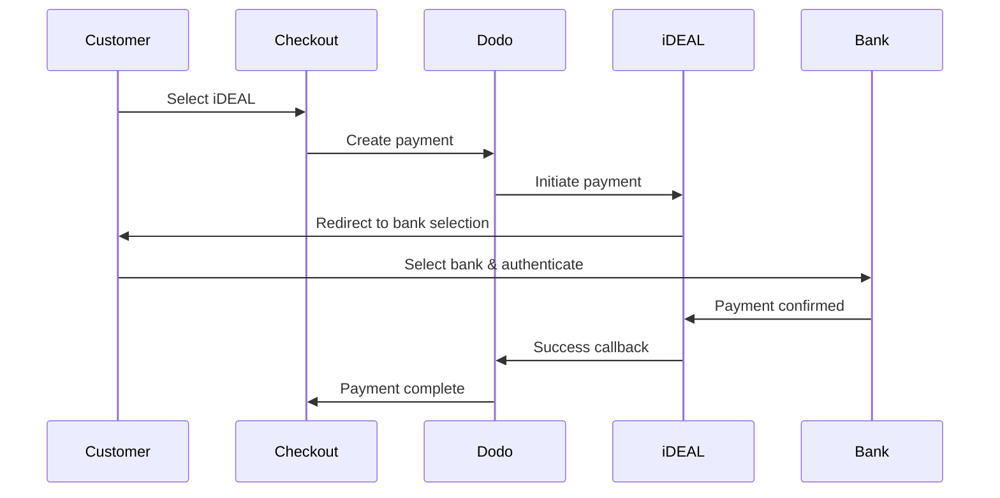

يفضل العملاء الأوروبيون بشدة طرق الدفع المحلية التي تندمج مع أنظمتهم المصرفية. يمكن أن يؤدي تقديم هذه الطرق إلى زيادة معدلات التحويل بنسبة 20-40٪ في الأسواق المستهدفة.

## لماذا طرق الدفع المحلية الأوروبية؟

<CardGroup cols={3}>
<Card title="Higher Conversion" icon="chart-line">
يجذب iDEAL حوالي 60٪ من المدفوعات الإلكترونية في هولندا. عدم تقديمه يعني خسارة العملاء.
</Card>

<Card title="Lower Fraud" icon="shield-check">
تتمتع المدفوعات المصادق عليها من البنك بمعدلات احتيال تكاد تكون صفرًا ولا توجد عمليات رد أموال.
</Card>

<Card title="Real-Time Settlement" icon="bolt">
توفر معظم الطرق الأوروبية تأكيدًا فوريًا للدفع.
</Card>
</CardGroup>

## الطرق المدعومة

| الطريقة | البلد | الحصة السوقية | العملة | الاشتراكات |
| :----- | :------ | :----------- | :------- | :-----------: |
| **iDEAL** | هولندا | ~60% | يورو | لا |
| **Bancontact** | بلجيكا | ~50% | يورو | لا |
| **EPS** | النمسا | ~30% | يورو | لا |
| **Multibanco** | البرتغال | ~40% | يورو | لا |

## iDEAL (هولندا)

يعد iDEAL طريقة الدفع الإلكترونية المهيمنة في هولندا، ويتصل مباشرة بجميع البنوك الهولندية الكبرى.

### كيف يعمل



### البنوك المدعومة

جميع البنوك الهولندية الكبرى مدعومة:
- ABN AMRO
- ASN Bank
- Bunq
- ING
- Knab
- Rabobank
- RegioBank
- Revolut
- SNS
- Triodos Bank
- Van Lanschot

### الإعداد

```javascript
const session = await client.checkoutSessions.create({
  product_cart: [{ product_id: 'prod_123', quantity: 1 }],
  allowed_payment_method_types: ['ideal', 'credit', 'debit'],
  billing_currency: 'EUR',
  billing_address: {
    country: 'NL',
    zipcode: '1012JS'
  },
  return_url: 'https://example.com/success'
});
```

## Bancontact (بلجيكا)

Bancontact هو نظام الدفع الوطني في بلجيكا، ويستخدمه تقريبًا جميع البنوك البلجيكية للمدفوعات الإلكترونية.

### الميزات
- يعمل مع بطاقات الخصم البلجيكية الحالية
- دعم تطبيق الهاتف المحمول (Payconiq بواسطة Bancontact)
- تأكيد فوري للدفع
- لا حاجة لتسجيل إضافي للعملاء

### الإعداد

```javascript
const session = await client.checkoutSessions.create({
  product_cart: [{ product_id: 'prod_123', quantity: 1 }],
  allowed_payment_method_types: ['bancontact_card', 'credit', 'debit'],
  billing_currency: 'EUR',
  billing_address: {
    country: 'BE',
    zipcode: '1000'
  },
  return_url: 'https://example.com/success'
});
```

## EPS (النمسا)

تمكّن EPS (المعيار الإلكتروني للدفع) التحويلات المصرفية المباشرة عبر الإنترنت للعملاء النمساويين.

### الميزات
- التكامل المباشر مع البنوك النمساوية
- تأكيد الدفع في الوقت الحقيقي
- ثقة عالية بين المستهلكين النمساويين
- لا عمليات رد أموال

### البنوك المدعومة

تشمل البنوك النمساوية الكبرى:
- Erste Bank
- Bank Austria
- Raiffeisen
- BAWAG
- Volksbank

### الإعداد

```javascript
const session = await client.checkoutSessions.create({
  product_cart: [{ product_id: 'prod_123', quantity: 1 }],
  allowed_payment_method_types: ['eps', 'credit', 'debit'],
  billing_currency: 'EUR',
  billing_address: {
    country: 'AT',
    zipcode: '1010'
  },
  return_url: 'https://example.com/success'
});
```

## Multibanco (البرتغال)

Multibanco هو الشبكة المصرفية البينية في البرتغال، ويوفر المدفوعات عبر الإنترنت والمدفوعات عبر أجهزة الصراف الآلي.

### خيارات الدفع

1. **الخدمات المصرفية عبر الإنترنت** — تحويل مصرفي مباشر عبر الخدمات المصرفية الإلكترونية
2. **الدفع عبر أجهزة الصراف الآلي** — يتلقى العميل مرجعًا للدفع في أي جهاز Multibanco
3. **الخدمات المصرفية عبر الهاتف المحمول** — الدفع عبر تطبيقات الهواتف المصرفية

### كيف يعمل الدفع عبر أجهزة الصراف الآلي

بالنسبة لمدفوعات أجهزة الصراف الآلي، يتلقى العملاء مرجع دفع:

```
Entity: 12345
Reference: 123 456 789
Amount: €50.00
Expiry: 24 hours
```

يمكن للعميل الدفع في أي جهاز صراف آلي برتغالي أو عبر الخدمات المصرفية عبر الإنترنت باستخدام هذا المرجع.

### الإعداد

```javascript
const session = await client.checkoutSessions.create({
  product_cart: [{ product_id: 'prod_123', quantity: 1 }],
  allowed_payment_method_types: ['multibanco', 'credit', 'debit'],
  billing_currency: 'EUR',
  billing_address: {
    country: 'PT',
    zipcode: '1000-001'
  },
  return_url: 'https://example.com/success'
});
```

<Note>
قد تستغرق مدفوعات Multibanco عبر أجهزة الصراف الآلي وقتًا بين إتمام السداد والدفع الفعلي. راقب Webhooks لتأكيد الدفع.
</Note>

## أنواع طرق API

| النوع | الطريقة | البلد |
| :--- | :----- | :------ |
| `ideal` | iDEAL | هولندا |
| `bancontact_card` | Bancontact | بلجيكا |
| `eps` | EPS | النمسا |
| `multibanco` | Multibanco | البرتغال |

## عملية دفع متعددة البلدان في أوروبا

بالنسبة للشركات التي تخدم عدة دول أوروبية، اشمل جميع الطرق الإقليمية:

```javascript
const session = await client.checkoutSessions.create({
  product_cart: [{ product_id: 'prod_123', quantity: 1 }],
  allowed_payment_method_types: [
    'ideal',           // Netherlands
    'bancontact_card', // Belgium
    'eps',             // Austria
    'multibanco',      // Portugal
    'credit',          // Fallback
    'debit'            // Fallback
  ],
  billing_currency: 'EUR',
  return_url: 'https://example.com/success'
});
```

تعرض Dodo تلقائيًا الطرق ذات الصلة استنادًا إلى موقع العميل. سيعرض العميل الهولندي iDEAL؛ وسيعرض العميل البلجيكي Bancontact.

## الاختبار

يمكن اختبار طرق الدفع الأوروبية في وضع الـ Sandbox. تقوم عملية الاختبار بمحاكاة عملية المصادقة المصرفية.

<Steps>
<Step title="Enable test mode">
استخدم مفاتيح API التجريبية من Dodo Payments.
</Step>

<Step title="Set appropriate billing address">
عيّن بلد عنوان الفوترة ليتطابق مع طريقة الدفع:
- `NL` لـ iDEAL
- `BE` لـ Bancontact
- `AT` لـ EPS
- `PT` لـ Multibanco
</Step>

<Step title="Complete the test flow">
اتبع تدفق المصادقة المصرفية المحاكاة في بيئة الاختبار.
</Step>
</Steps>

## أفضل الممارسات

<AccordionGroup>
<Accordion title="Always include regional methods for target markets">
إذا كنت تبيع للعملاء الهولنديين، اشمل iDEAL. عدم القيام بذلك يشبه عدم قبول Visa في الولايات المتحدة — ستفقد مبيعات كبيرة.
</Accordion>

<Accordion title="Match currency to region">
تتطلب طرق الدفع الأوروبية اليورو. تأكد من أن تسعيرك يدعم معاملات باليورو.
</Accordion>

<Accordion title="Handle redirects gracefully">
تنطوي جميع الطرق الأوروبية على إعادة توجيه إلى مواقع البنوك. تأكد من أن معالجة عناوين URL العائدة قوية وتراعي المستخدمين الذين يتركون التدفق في منتصفه.
</Accordion>

<Accordion title="Provide card fallbacks">
ليس لدى جميع العملاء الأوروبيين إمكانية الوصول إلى هذه الطرق الإقليمية (السياح، المغتربين، إلخ). اشمل دائمًا `credit` و`debit` كخيارات احتياطية.
</Accordion>

<Accordion title="Consider Multibanco timing">
قد تستغرق مدفوعات Multibanco عبر أجهزة الصراف الآلي ساعات لإتمامها. لا تعيق التنفيذ على الدفع الفوري — استخدم Webhooks للتأكيد غير المتزامن.
</Accordion>
</AccordionGroup>

## استكشاف الأخطاء وإصلاحها

<AccordionGroup>
<Accordion title="European method not appearing">
**تحقق:**
1. هل يتطابق بلد فوترة العميل مع بلد الطريقة؟
2. هل تم تعيين العملة إلى اليورو؟
3. هل الطريقة مدرجة في `allowed_payment_method_types`؟

**الحل:** الطرق الأوروبية إقليمية بصرامة. لن يرى العميل الذي بلد فوترة `DE` (ألمانيا) iDEAL، الذي يقتصر على هولندا.
</Accordion>

<Accordion title="Bank authentication failed">
**الأسباب:**
- ألغى العميل أثناء المصادقة المصرفية
- كان نظام المصادقة في البنك غير متاح مؤقتًا
- أدخل العميل بيانات اعتماد غير صحيحة

**الحل:** يجب على العميل إعادة المحاولة. إذا استمرت المشكلة، اقترح تجربة طريقة دفع مختلفة.
</Accordion>

<Accordion title="Redirect not completing">
**الأسباب:**
- أغلق العميل المتصفح أثناء إعادة التوجيه إلى البنك
- مشكلات الشبكة أثناء المصادقة
- تم تكوين عنوان URL العائد بشكل غير صحيح

**الحل:** تحقق من أن عنوان URL العائد صحيح ويمكن الوصول إليه. تأكد من أنه يتعامل مع حالات النجاح والفشل على حد سواء.
</Accordion>

<Accordion title="Multibanco payment pending">
**السبب:** تلقى العميل مرجع الدفع لكنه لم يدفع بعد.

**الحل:** هذا متوقع لمدفوعات الصراف الآلي. انتظر تأكيد Webhook. ينتهي صلاحية المرجع عادةً خلال 24-72 ساعة.
</Accordion>
</AccordionGroup>

## الامتثال لـ PSD2

تتوافق جميع طرق الدفع الأوروبية مع لوائح PSD2 (توجيه خدمات الدفع 2):

- **المصادقة القوية للعميل (SCA)** — مدمجة في تدفق المصادقة المصرفية
- **الاتصالات الآمنة** — يتم نقل جميع البيانات عبر قنوات آمنة
- **حماية المستهلك** — امتثال كامل لحقوق المستهلك في الاتحاد الأوروبي

## الصفحات ذات الصلة

<CardGroup cols={2}>
<Card title="Payment Methods Overview" icon="credit-card" href="/features/payment-methods">
راجع جميع طرق الدفع المدعومة.
</Card>

<Card title="Adaptive Currency" icon="globe" href="/features/adaptive-currency">
دعم العملة والتحويل التلقائي.
</Card>

<Card title="Checkout Guide" icon="book" href="/developer-resources/checkout-session">
دليل تنفيذ إتمام عملية الدفع الكامل.
</Card>

<Card title="Webhooks" icon="webhook" href="/developer-resources/webhooks">
تعامل مع تأكيدات الدفع بشكل غير متزامن.
</Card>
</CardGroup>