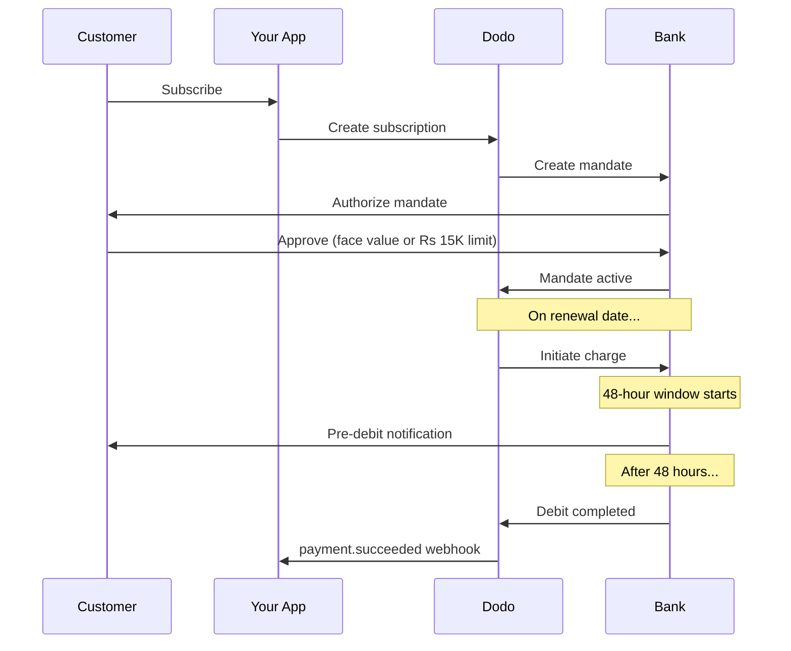

تمتلك الهند بنية تحتية دفع فريدة يهيمن عليها UPI (أكثر من 60% من المعاملات الرقمية) وبطاقات Rupay. تدعم Dodo Payments كلاهما مع الامتثال الكامل لتفويضات الاشتراك الخاصة بـ RBI.

## لماذا تهم طرق الدفع في الهند

<CardGroup cols={3}>
<Card title="UPI Dominance" icon="mobile">
يعالج UPI أكثر من 10 مليارات معاملة شهريًا. العديد من العملاء الهنود لا يملكون بطاقات دولية.
</Card>

<Card title="Low Transaction Costs" icon="indian-rupee-sign">
يمتاز UPI برسوم معاملات شبه معدومة. ممتاز للمعاملات ذات الحجم الكبير والقيمة المنخفضة.
</Card>

<Card title="Subscription Support" icon="repeat">
على عكس معظم طرق الدفع البديلة، يدعم كل من UPI وRupay الدفعات المتكررة عبر تفويضات RBI.
</Card>
</CardGroup>

## الطرق المدعومة

| الطريقة | النوع | الاشتراكات | الحد الأدنى |
| :----- | :--- | :-----------: | :--------- |
| **UPI Collect** | رمز QR / VPA | نعم* | ₹1 |
| **بطاقة Rupay الائتمانية** | بطاقة | نعم* | ₹1 |
| **بطاقة Rupay المدينة** | بطاقة | نعم* | ₹1 |

*تتطلب الاشتراكات تفويضات متوافقة مع RBI مع قواعد معالجة خاصة.

## التكوين

### أنواع طرق واجهة برمجة التطبيقات

| النوع | الوصف |
| :--- | :---------- |
| `upi_collect` | UPI عبر رمز QR أو إدخال VPA |
| `credit` | بطاقات الائتمان بما في ذلك Rupay |
| `debit` | بطاقات الخصم بما في ذلك Rupay |

### مثال: صفحة دفع موجهة للهند

```javascript
const session = await client.checkoutSessions.create({
  product_cart: [{ product_id: 'prod_123', quantity: 1 }],
  allowed_payment_method_types: [
    'upi_collect',
    'credit',
    'debit'
  ],
  billing_currency: 'INR',
  customer: {
    email: 'customer@example.in',
    name: 'Priya Sharma',
    phone_number: '+919876543210'
  },
  billing_address: {
    country: 'IN',
    zipcode: '560001'
  },
  return_url: 'https://example.com/success'
});
```

### متطلبات UPI

لكي يظهر UPI في صفحة الدفع:
1. **دولة الفوترة** يجب أن تكون الهند (`IN`)
2. **العملة** يجب أن تكون INR
3. للتجار غير الهنود: يجب تمكين **العملة التكيفية**

<Warning>
إذا كنت تاجرًا غير هندي ولم يتم تمكين العملة التكيفية، فلن تكون UPI متاحة لعملائك.
</Warning>

## الاشتراكات مع تفويضات RBI

تعمل اشتراكات طرق الدفع الهندية تحت لوائح RBI (بنك الاحتياطي الهندي) مع متطلبات فريدة.

### كيف تعمل التفويضات وفق RBI



### أنواع التفويض

| مبلغ الاشتراك | نوع التفويض | الحد |
| :------------------ | :----------- | :---- |
| **أقل من 15,000 روبية** | تفويض عند الطلب | 15,000 روبية |
| **15,000 روبية أو أكثر** | تفويض بمبلغ ثابت | مبلغ الاشتراك نفسه |

**مهم لتغييرات الخطة:** إذا أدى الترقية إلى تحميل مبلغ يتجاوز حد التفويض الحالي، ستفشل العملية ويجب على العميل إعادة التفويض.

### تأخير المعالجة البالغ 48 ساعة

هذا هو الفرق الأهم عن بطاقات الدفع الدولية:

<Steps>
<Step title="Charge Initiated (Day 0)">
في تاريخ التجديد المحدد، تقوم Dodo ببدء التحصيل من البنك.
</Step>

<Step title="Pre-Debit Notification">
يتلقى العميل إشعارًا من بنكه بشأن الخصم القادم.
</Step>

<Step title="48-Hour Window">
يمكن للعميل إلغاء التفويض خلال هذه الفترة عبر تطبيق البنك الخاص به.
</Step>

<Step title="Debit Completed (~48-51 hours)">
بعد 48 ساعة (زائد ما يصل إلى 3 ساعات إضافية لمعالجة البنك)، يتم الخصم الفعلي.
</Step>

<Step title="Webhook Sent">
يتم إرسال `payment.succeeded` webhook بعد الخصم الفعلي، وليس عند البدء.
</Step>
</Steps>

<Warning>
**لا تمنح المزايا عند بدء التحصيل.** انتظر وصول webhook `payment.succeeded`، الذي يصل بعد حوالي 48-51 ساعة من تاريخ التحصيل المحدد.
</Warning>

### التعامل مع نافذة الـ 48 ساعة

```javascript
// DON'T do this:
async function handleSubscriptionRenewal(subscription) {
  // ❌ Bad: Granting access immediately when charge is initiated
  grantPremiumAccess(subscription.customer_id);
}

// DO this:
async function handlePaymentWebhook(event) {
  if (event.type === 'payment.succeeded') {
    // ✅ Good: Only grant access after payment is confirmed
    grantPremiumAccess(event.data.customer_id);
  }
  
  if (event.type === 'payment.failed') {
    // Handle failed payment (mandate cancelled, insufficient funds)
    revokePremiumAccess(event.data.customer_id);
  }
}
```

### أحداث الويب هوك لاشتراكات الهند

| الحدث | متى | الإجراء |
| :---- | :--- | :----- |
| `subscription.created` | تم تفويض التفويض | تسجيل بدء الاشتراك |
| `payment.succeeded` | ~48 ساعة بعد تاريخ التحصيل | منح/استمرار الوصول |
| `payment.failed` | فشل الخصم | إخطار العميل، إيقاف الوصول |
| `subscription.on_hold` | فشل الدفع | مطالبة بتحديث وسيلة الدفع |
| `subscription.active` | تم إعادة التنشيط بعد الدفع | استعادة الوصول |

## الاختبار

### معرفات اختبار UPI

| الحالة | معرف UPI |
| :----- | :----- |
| نجاح | `success@upi` |
| فشل | `failure@upi` |

### أرقام بطاقات الائتمان الهندية للاختبار

| العلامة | السيناريو | رقم البطاقة | انتهاء الصلاحية | CVV |
| :---- | :------- | :---------- | :----- | :-- |
| فيزا | نجاح | `4576238912771450` | 06/32 | 123 |
| فيزا | مرفوضة | `4706131211212123` | 06/32 | 123 |
| ماستركارد | نجاح | `5409162669381034` | 06/32 | 123 |
| ماستركارد | مرفوضة | `5105105105105100` | 06/32 | 123 |

## أفضل الممارسات

<AccordionGroup>
<Accordion title="Plan for the 48-hour delay">
صمّم تطبيقك ليعالج الفجوة بين بدء التحصيل والدفع الفعلي. ضع في الاعتبار:
- فترات سماح للوصول إلى الاشتراك
- التواصل الواضح مع العملاء حول وقت المعالجة
- التلبية المعتمدة على الويب هوك، لا على التاريخ
</Accordion>

<Accordion title="Handle mandate cancellations">
يمكن للعملاء إلغاء التفويضات عبر تطبيقات بنوكهم في أي وقت. راقب webhooks `subscription.on_hold` واطلب من العملاء إعادة الاشتراك أو تحديث وسيلة الدفع.
</Accordion>

<Accordion title="Set appropriate mandate amounts">
بالنسبة لتسعير متغير (مثل التسعير حسب الاستخدام)، فكّر فيما إذا كان تفويض الطلب البالغ 15,000 روبية كافيًا. إذا كانت المبالغ قد تتجاوز هذا، سيتعين على العملاء إعادة التفويض.
</Accordion>

<Accordion title="Offer UPI prominently">
بالنسبة للعملاء الهنود، يجب أن يكون UPI الخيار الرئيسي للدفع. يفضّله العديد من المستخدمين على البطاقات نظرًا للألفة وقلة العقبات.
</Accordion>
</AccordionGroup>

## استكشاف الأخطاء وإصلاحها

<AccordionGroup>
<Accordion title="UPI not appearing at checkout">
**تحقق:**
1. هل تم تعيين دولة الفوترة إلى `IN`؟
2. هل تم تعيين العملة إلى `INR`؟
3. إذا كنت تاجرًا غير هندي: هل تم تمكين العملة التكيفية؟
4. هل تم تضمين `upi_collect` في `allowed_payment_method_types`؟

**الحل:** تحقق من أن عنوان الفوترة يحتوي على `country: "IN"` و`billing_currency: "INR"`.
</Accordion>

<Accordion title="Subscription charge failed after upgrade">
**السبب:** مبلغ التحصيل الجديد يتجاوز حد التفويض الحالي (عتبة 15,000 روبية).

**الحل:** يجب على العميل تحديث وسيلة الدفع لإنشاء تفويض جديد بالحد الصحيح.
</Accordion>

<Accordion title="Subscription on hold but customer claims they didn't cancel">
**السبب:** قد يكون العميل قد ألغى التفويض خلال نافذة الـ 48 ساعة، أو رفض بنكهم الخصم.

**الحل:** يحتاج العميل إلى إعادة تفويض العملية أو تحديث وسيلة الدفع.
</Accordion>

<Accordion title="Payment deduction delayed beyond 48 hours">
**السبب:** يمكن أن تؤدي تأخيرات واجهة برمجة التطبيق البنكية إلى تمديد المعالجة من ساعتين إلى ثلاث ساعات إضافية.

**الحل:** هذا متوقع. صمّم نظامك ليعالج التأخيرات المتغيرة التي تصل إلى حوالي 51 ساعة إجماليًا.
</Accordion>

<Accordion title="Mandate cancelled but subscription still active">
**السبب:** حالة هامشية في لوائح RBI — إلغاء التفويض خلال نافذة المعالجة لا يُلغي الاشتراك فورًا.

**الحل:** ستفشل العملية التالية وسينتقل الاشتراك إلى `on_hold`. راقب webhooks لـ `payment.failed`.
</Accordion>
</AccordionGroup>

## الصفحات ذات الصلة

<CardGroup cols={2}>
<Card title="Payment Methods Overview" icon="credit-card" href="/features/payment-methods">
اطلع على جميع طرق الدفع المدعومة.
</Card>

<Card title="Subscriptions" icon="repeat" href="/features/subscription">
توثيق الاشتراكات الكامل بما في ذلك تفويضات RBI.
</Card>

<Card title="Webhooks" icon="webhook" href="/developer-resources/webhooks">
معالجة الويب هوك لأحداث الدفع.
</Card>

<Card title="Testing Process" icon="flask" href="/miscellaneous/testing-process">
جميع بيانات الاختبار بما في ذلك معرفات UPI والبطاقات الهندية.
</Card>
</CardGroup>