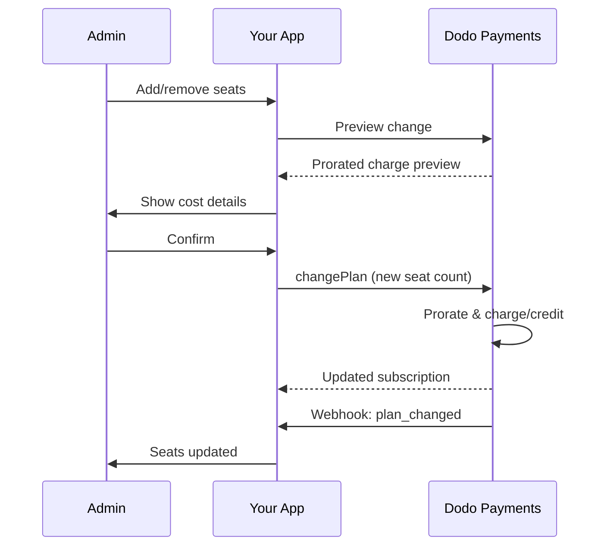

<Info>
تتيح الفوترة المعتمدة على المقاعد فرض رسوم على العملاء بناءً على عدد المستخدمين أو أعضاء الفريق أو التراخيص التي يحتاجونها. إنها نموذج التسعير القياسي لأدوات التعاون الجماعي، وبرمجيات المؤسسات، ومنتجات SaaS بين الشركات.
</Info>

<CardGroup cols={2}>
<Card title="Implementation Tutorial" icon="code" href="/developer-resources/seat-based-pricing">
  دليل خطوة بخطوة مع أمثلة تعليمات برمجية.
</Card>

<Card title="Add-ons Documentation" icon="puzzle" href="/features/addons">
  تعرف على نظام الإضافات الذي يغذي الفوترة المعتمدة على المقاعد.
</Card>

<Card title="Subscription Management" icon="repeat" href="/features/subscription">
  إدارة الاشتراكات المعتمدة على المقاعد وتغييرات الخطة.
</Card>

<Card title="Webhooks" icon="bell" href="/developer-resources/webhooks/intents/subscription">
  تتبع تغييرات المقاعد باستخدام ويب هوكس الاشتراك.
</Card>
</CardGroup>

---

## ما هي الفوترة المعتمدة على المقاعد؟

تفرض الفوترة المعتمدة على المقاعد (المعروفة أيضًا بالتسعير لكل مستخدم أو لكل مقعد) رسومًا على العملاء بناءً على عدد المستخدمين الذين يصلون إلى منتجك. بدلاً من رسم ثابت، يتزايد السعر مع حجم الفريق.

### حالات الاستخدام الشائعة

| الصناعة | المثال | نموذج التسعير |
|----------|---------|---------------|
| تعاون الفرق | Slack، Notion، Asana | لكل مستخدم نشط/شهر |
| أدوات المطورين | GitHub، GitLab، Jira | لكل مقعد/شهر |
| برامج إدارة علاقات العملاء | Salesforce، HubSpot | لكل ترخيص مستخدم |
| أدوات التصميم | Figma، Canva | لكل مقعد محرر |
| برامج الأمان | 1Password، Okta | لكل مستخدم/شهر |
| مؤتمرات الفيديو | Zoom، Teams | لكل ترخيص مضيف |

### فوائد التسعير المعتمد على المقاعد

**لعملك:**
- تتزايد الإيرادات بشكل طبيعي مع نمو العملاء
- تسعير يمكن التنبؤ به يمكن للعملاء وضع ميزانية له
- مسار ترقية واضح من الفرد إلى الفريق إلى المؤسسة
- قيمة عمرية أعلى مع توسع الفرق

**لعملائك:**
- الدفع فقط مقابل ما يستخدمونه
- سهل الفهم وتوقع التكاليف
- مرونة لإضافة/إزالة المستخدمين حسب الحاجة
- تسعير عادل يتناسب مع حجم الفريق

---

## كيف تعمل الفوترة المعتمدة على المقاعد في Dodo Payments

تقوم Dodo Payments بتنفيذ الفوترة المعتمدة على المقاعد باستخدام نظام **الإضافات**. إليك كيف يعمل:

### نظرة عامة على الهيكلية

يكلف اشتراك Team Pro 99 دولارًا شهريًا ويشمل 5 مقاعد. إذا كان لديك أكثر من 5 مستخدمين، تدفع 15 دولارًا إضافية شهريًا عن كل مقعد إضافي. 

على سبيل المثال، إذا كانت فرقك تحتاج 15 مقعدًا:
- الخطة الأساسية: 99 دولارًا شهريًا (تشمل 5 مقاعد)
- الإضافات: 10 مقاعد إضافية × 15 دولارًا شهريًا = 150 دولارًا شهريًا
- التكلفة الشهرية الإجمالية: 99 + 150 = 249 دولارًا مقابل 15 مقعدًا

### المكونات الرئيسية

| المكون | الغرض | المثال |
|-----------|---------|---------|
| المنتج الأساسي | الاشتراك الأساسي مع المقاعد المضمنة | "خطة الفريق - 99 دولارًا/شهر (5 مقاعد مضمنة)" |
| إضافة المقعد | رسوم لكل مقعد لمستخدمين إضافيين | "مقعد إضافي - 15 دولارًا/شهر لكل" |
| الكمية | عدد المقاعد الإضافية المشتراة | 10 مقاعد إضافية |

---

## استراتيجيات التسعير

اختر استراتيجية التسعير المعتمدة على المقاعد التي تناسب عملك:

### الاستراتيجية 1: خطة أساسية + إضافة لكل مقعد

قم بتضمين عدد محدد من المقاعد في الخطة الأساسية، وفرض رسوم على المقاعد الإضافية.

**مثال:**

```
Starter Plan: $49/month
├── Includes: 3 seats
├── Extra seats: $10/month each
└── 8 total seats = $49 + (5 × $10) = $99/month
```

**الأفضل لـ:** المنتجات التي يمكن أن تعمل فيها الفرق الصغيرة مع العرض الأساسي.

### الاستراتيجية 2: تسعير لكل مقعد فقط

فرض رسوم ثابتة لكل مقعد دون رسوم أساسية.

**مثال:**

```
Per User: $12/month
├── 5 users = $60/month
├── 20 users = $240/month
└── 100 users = $1,200/month
```

**التنفيذ:** تعيين سعر الخطة الأساسية إلى 0 دولار، واستخدام إضافة المقعد فقط.

**الأفضل لـ:** تسعير بسيط وشفاف؛ نماذج قائمة على الاستخدام.

### الاستراتيجية 3: تسعير مقاعد متدرجة

خطط أساسية مختلفة مع معدلات مختلفة لكل مقعد.

**مثال:**

```
Starter: $0/month base + $15/seat
├── Lower features, higher per-seat cost

Professional: $99/month base + $10/seat
├── More features, lower per-seat cost

Enterprise: $499/month base + $7/seat
└── All features, volume discount on seats
```

**التنفيذ:** إنشاء منتجات منفصلة لكل مستوى مع أسعار إضافات مختلفة.

**الأفضل لـ:** تشجيع الترقيات إلى مستويات أعلى؛ مبيعات المؤسسات.

### الاستراتيجية 4: حزم المقاعد

بيع المقاعد في حزم بدلاً من فردية.

**مثال:**

```
5-Seat Pack: $50/month ($10/seat)
10-Seat Pack: $80/month ($8/seat)
25-Seat Pack: $175/month ($7/seat)
```

**التنفيذ:** إنشاء إضافات متعددة لأحجام الحزم المختلفة.

**الأفضل لـ:** تبسيط قرارات الشراء؛ تشجيع الالتزامات الأكبر.

---

## إعداد الفوترة المعتمدة على المقاعد

### الخطوة 1: خطط لتسعيرك

قبل التنفيذ، حدد هيكل التسعير الخاص بك:

<Steps>
<Step title="Define Base Plan">
قرر ما يتم تضمينه في الاشتراك الأساسي:
- السعر الأساسي (يمكن أن يكون 0 دولار للاشتراك المعتمد كليًا على المقاعد)
- عدد المقاعد المشمولة
- الميزات المتاحة في هذا المستوى
</Step>

<Step title="Set Seat Pricing">
حدد تكلفة الإضافة لكل مقعد:
- السعر لكل مقعد إضافي
- أي خصومات على الكميات (عبر إضافات متعددة)
- الحد الأقصى للمقاعد المسموح بها (إن وُجد)
</Step>

<Step title="Consider Billing Frequency">
وافق تسعير المقاعد مع دورة الفوترة الخاصة بك:
- الاشتراكات الشهرية → رسوم مقاعد شهرية
- الاشتراكات السنوية → رسوم مقاعد سنوية (غالبًا مخفضة)
</Step>
</Steps>

### الخطوة 2: إنشاء إضافة المقعد

في لوحة معلومات Dodo Payments الخاصة بك:

1. انتقل إلى **المنتجات** → **الإضافات**
2. انقر على **إنشاء إضافة**
3. قم بتكوين الإضافة:

| الحقل | القيمة | الملاحظات |
|-------|-------|-------|
| الاسم | "مقعد إضافي" أو "عضو فريق" | اسم واضح وسهل الاستخدام |
| الوصف | "أضف عضو فريق آخر إلى مساحة العمل الخاصة بك" | اشرح ما يحصل عليه العملاء |
| السعر | سعر المقعد الخاص بك | على سبيل المثال، 10.00 دولار |
| العملة | تطابق منتجك الأساسي | يجب أن تكون نفس العملة |
| فئة الضريبة | نفس المنتج الأساسي | يضمن معالجة ضريبية متسقة |

<Tip>
أنشئ أسماء إضافات وصفية واضحة في الفواتير. "مقعد فريق إضافي" أوضح من "إضافة مقعد" للعملاء الذين يراجعون فواتيرهم.
</Tip>

### الخطوة 3: إنشاء الاشتراك الأساسي

قم بإنشاء منتج الاشتراك الخاص بك:

1. انتقل إلى **المنتجات** → **إنشاء منتج**
2. اختر **اشتراك**
3. قم بتكوين التسعير والتفاصيل
4. في قسم **الإضافات**، قم بإرفاق إضافة المقعد الخاصة بك

### الخطوة 4: ربط الإضافة بالمنتج

قم بربط إضافة المقعد باشتراكك:

1. قم بتحرير منتج الاشتراك الخاص بك
2. انتقل إلى قسم **الإضافات**
3. انقر على **إضافة إضافات**
4. اختر إضافة المقعد الخاصة بك
5. احفظ التغييرات

<Check>
يدعم منتج الاشتراك الخاص بك الآن التسعير المعتمد على المقاعد. يمكن للعملاء شراء أي كمية من المقاعد الإضافية أثناء إتمام عملية الدفع.
</Check>

---

## إدارة المقاعد

### إضافة مقاعد للاشتراكات الجديدة

عند إنشاء جلسة الخروج، حدد كمية المقاعد:

```typescript
const session = await client.checkoutSessions.create({
  product_cart: [{
    product_id: 'prod_team_plan',
    quantity: 1,
    addons: [{
      addon_id: 'addon_seat',
      quantity: 10  // 10 additional seats
    }]
  }],
  customer: { email: 'admin@company.com' },
  return_url: 'https://yourapp.com/success'
});
```

### تغيير عدد المقاعد في الاشتراكات الحالية

استخدم واجهة برمجة التطبيقات لتغيير الخطة لضبط المقاعد:

```typescript
// Add 5 more seats to existing subscription
await client.subscriptions.changePlan('sub_123', {
  product_id: 'prod_team_plan',
  quantity: 1,
  proration_billing_mode: 'prorated_immediately',
  addons: [{
    addon_id: 'addon_seat',
    quantity: 15  // New total: 15 additional seats
  }]
});
```

### إزالة المقاعد

لتقليل عدد المقاعد، حدد الكمية الأقل:

```typescript
// Reduce from 15 to 8 additional seats
await client.subscriptions.changePlan('sub_123', {
  product_id: 'prod_team_plan',
  quantity: 1,
  proration_billing_mode: 'difference_immediately',
  addons: [{
    addon_id: 'addon_seat',
    quantity: 8  // Reduced to 8 additional seats
  }]
});
```

### إزالة جميع المقاعد الإضافية

مرر مصفوفة إضافات فارغة لإزالة جميع الإضافات:

```typescript
// Remove all additional seats, keep only base plan seats
await client.subscriptions.changePlan('sub_123', {
  product_id: 'prod_team_plan',
  quantity: 1,
  proration_billing_mode: 'difference_immediately',
  addons: []  // Removes all add-ons
});
```

---

## التقسيم لتغييرات المقاعد

عندما يضيف العملاء أو يزيلون المقاعد في منتصف الدورة، يحدد التقسيم كيفية فرض الرسوم عليهم.



### أوضاع الحساب النسبي

| الوضع | إضافة مقاعد | إزالة مقاعد |
|------|-------------|----------------|
| `prorated_immediately` | تحصيل رسوم عن الأيام المتبقية في الدورة | رصيد عن الأيام غير المستخدمة |
| `difference_immediately` | تحصيل السعر الكامل للمقعد | يُطبق الرصيد على التجديدات المستقبلية |
| `full_immediately` | تحصيل السعر الكامل للمقعد، إعادة ضبط دورة الفوترة | لا يوجد رصيد |

### أمثلة على الحساب النسبي

**السيناريو: تبقى 15 يومًا في دورة الفوترة، إضافة 5 مقاعد بسعر 10 دولارات للمقعد**

<Tabs>
<Tab title="prorated_immediately">

```
Prorated charge = ($10 × 5 seats) × (15 days / 30 days)
                = $50 × 0.5
                = $25 immediate charge
```

يدفع العميل 25 دولارًا الآن، ثم 50 دولارًا شهريًا عند التجديد.
</Tab>

<Tab title="difference_immediately">

```
Immediate charge = $10 × 5 seats = $50
```

يدفع العميل 50 دولارًا كاملة الآن، بغض النظر عن موقع الدورة.
</Tab>

<Tab title="full_immediately">

```
Immediate charge = Full subscription + add-ons
Billing cycle resets to today
```

يدفع العميل المبلغ الكامل، وتبدأ دورة فوترة جديدة.
</Tab>
</Tabs>

**السيناريو: إزالة 3 مقاعد في منتصف الدورة باستخدام prorated_immediately**

```
Current: Team Plan ($99/month) + 10 extra seats × $10/seat = $199/month
Change: Remove 3 seats (10 → 7 extra seats) on day 20 of 30-day cycle
Remaining: 10 days

Credit for removed seats:
  = ($10 × 3 seats) × (10 days / 30 days)
  = $30 × 0.333
  = $10.00 credit

→ $10.00 credit added to subscription
→ Next renewal: $99 + (7 × $10) = $169.00/month
→ Credit auto-applies: $169.00 − $10.00 = $159.00 on next invoice
```

<Tip>
**تحديد وضع الحساب النسبي لتغييرات المقاعد**: استخدم `prorated_immediately` للفوترة العادلة بناءً على الأيام عندما تعدل الفرق المقاعد بشكل متكرر. استخدم `difference_immediately` للرياضيات الأبسط التي تحصيل أو تمنح رصيد بالسعر الكامل للمقعد. راجع [دليل الحساب النسبي](/developer-resources/subscription-upgrade-downgrade#proration-modes) للحصول على مقارنات مفصلة.
</Tip>

### المعاينة قبل التغيير

دوِّن دائمًا معاينة الحساب النسبي قبل إجراء التغييرات:

```typescript
const preview = await client.subscriptions.previewChangePlan('sub_123', {
  product_id: 'prod_team_plan',
  quantity: 1,
  proration_billing_mode: 'prorated_immediately',
  addons: [{ addon_id: 'addon_seat', quantity: 20 }]
});

console.log('Immediate charge:', preview.immediate_charge.summary);
// Show customer: "Adding 5 seats will cost $25 today"
```

---

## تتبع المقاعد عبر الويب هوكس

راقب تغييرات المقاعد بالاستماع إلى ويب هوكس الاشتراك:

### الأحداث ذات الصلة

| الحدث | موعد التشغيل | حالة الاستخدام |
|-------|----------------|----------|
| `subscription.active` | تم تفعيل اشتراك جديد | توفير المقاعد الأولية |
| `subscription.plan_changed` | تمت إضافة/إزالة مقاعد | تحديث عدد المقاعد في تطبيقك |
| `subscription.renewed` | تم تجديد الاشتراك | تأكيد عدم تغيير عدد المقاعد |
| `subscription.cancelled` | تم إلغاء الاشتراك | إلغاء توفير جميع المقاعد |

### مثال على معالج الويب هوك

```typescript
app.post('/webhooks/dodo', async (req, res) => {
  const event = req.body;

  switch (event.type) {
    case 'subscription.active':
      // New subscription - provision seats
      const seats = calculateTotalSeats(event.data);
      await provisionSeats(event.data.customer_id, seats);
      break;

    case 'subscription.plan_changed':
      // Seats changed - update access
      const newSeats = calculateTotalSeats(event.data);
      await updateSeatCount(event.data.subscription_id, newSeats);
      break;

    case 'subscription.cancelled':
      // Subscription cancelled - deprovision
      await deprovisionAllSeats(event.data.subscription_id);
      break;
  }

  res.json({ received: true });
});

function calculateTotalSeats(subscriptionData) {
  const baseSeats = 5;  // Included in plan
  const addonSeats = subscriptionData.addons?.reduce(
    (total, addon) => total + addon.quantity, 0
  ) || 0;
  return baseSeats + addonSeats;
}
```

---

## فرض حدود المقاعد

يجب على تطبيقك فرض حدود المقاعد. تتبع Dodo Payments الفوترة، لكنك تتحكم في الوصول.

### استراتيجيات التنفيذ

<Tabs>
<Tab title="Hard Limit">
منع إضافة مستخدمين يتجاوزون عدد المقاعد بدقة.

```typescript
async function inviteUser(teamId: string, email: string) {
  const team = await getTeam(teamId);
  const subscription = await getSubscription(team.subscriptionId);
  const totalSeats = calculateTotalSeats(subscription);
  const usedSeats = await countTeamMembers(teamId);

  if (usedSeats >= totalSeats) {
    throw new Error('No seats available. Please upgrade your plan.');
  }

  await sendInvitation(teamId, email);
}
```

</Tab>

<Tab title="Soft Limit with Warning">
السماح بالتجاوز مع تحذير وفترة سماح.

```typescript
async function inviteUser(teamId: string, email: string) {
  const team = await getTeam(teamId);
  const { totalSeats, usedSeats } = await getSeatInfo(team);

  if (usedSeats >= totalSeats) {
    // Allow but flag for billing
    await flagOverage(teamId, usedSeats - totalSeats + 1);
    await notifyAdmin(team.adminEmail, 'You have exceeded your seat limit');
  }

  await sendInvitation(teamId, email);
}
```

</Tab>

<Tab title="Auto-Upgrade">
إضافة المقاعد تلقائيًا عند بلوغ الحد.

```typescript
async function inviteUser(teamId: string, email: string) {
  const team = await getTeam(teamId);
  const { totalSeats, usedSeats, subscriptionId } = await getSeatInfo(team);

  if (usedSeats >= totalSeats) {
    // Automatically add a seat
    await client.subscriptions.changePlan(subscriptionId, {
      product_id: team.productId,
      quantity: 1,
      proration_billing_mode: 'prorated_immediately',
      addons: [{ addon_id: 'addon_seat', quantity: totalSeats - baseSeats + 1 }]
    });

    await notifyAdmin(team.adminEmail, 'A new seat was added to your plan');
  }

  await sendInvitation(teamId, email);
}
```

</Tab>
</Tabs>

---

## أنماط متقدمة

### أنواع المقاعد المختلفة

قدّم أنواع مقاعد مختلفة بأسعار مختلفة:

```
Full Seats: $20/month - Full access to all features
View-Only Seats: $5/month - Read-only access
Guest Seats: $0/month - Limited external collaborator access
```

**التنفيذ:** أنشئ إضافات منفصلة لكل نوع مقعد.

```typescript
const session = await client.checkoutSessions.create({
  product_cart: [{
    product_id: 'prod_team_plan',
    quantity: 1,
    addons: [
      { addon_id: 'addon_full_seat', quantity: 10 },
      { addon_id: 'addon_viewer_seat', quantity: 25 },
      { addon_id: 'addon_guest_seat', quantity: 50 }
    ]
  }]
});
```

### خصومات المقاعد السنوية

قدّم تسعيرًا مخفضًا للمقاعد السنوية:

```
Monthly: $15/seat/month
Annual: $12/seat/month (20% savings)
```

**التنفيذ:** أنشئ منتجات منفصلة للخطط الشهرية والسنوية مع أسعار إضافية مختلفة.

### متطلبات الحد الأدنى للمقاعد

اشترط عددًا أدنى من المقاعد لبعض الخطط:

```typescript
async function validateSeatCount(planId: string, seatCount: number) {
  const minimums = {
    'prod_starter': 1,
    'prod_team': 5,
    'prod_enterprise': 25
  };

  if (seatCount < minimums[planId]) {
    throw new Error(`${planId} requires at least ${minimums[planId]} seats`);
  }
}
```

---

## أفضل الممارسات

### أفضل ممارسات التسعير

- **التواصل الواضح**: اعرض تسعير كل مقعد بشكل بارز في صفحة التسعير الخاصة بك
- **المقاعد المشمولة**: فكر في تضمين بعض المقاعد في السعر الأساسي لتقليل الاحتكاك
- **خصومات الكميات**: قدم أسعارًا أقل لكل مقعد للفرق الكبيرة للفوز بصفقات المؤسسات
- **حوافز سنوية**: خفّض أسعار الخطط السنوية لتحسين التدفق النقدي والاحتفاظ

### أفضل الممارسات التقنية

- **تخزين مؤقت لأعداد المقاعد**: خزّن عدد المقاعد في الاشتراك محليًا لتجنب استدعاءات API عند كل طلب
- **المزامنة الدورية**: مزامنة عدد المقاعد المحلي مع Dodo Payments عبر API بشكل دوري
- **معالجة الفشل**: إذا فشل تغيير مقعد، عرض رسائل خطأ واضحة وخيارات إعادة المحاولة
- **سجل التدقيق**: سجل كل تغييرات المقاعد للنزاعات المتعلقة بالفوترة والامتثال

### أفضل ممارسات تجربة المستخدم

- **ردود فعل في الوقت الحقيقي**: اعرض أثر التكلفة الفوري عند تعديل المقاعد
- **خطوات التأكيد**: اشترِ التأكيد قبل تغيير الفوترة
- **شفافية الحساب النسبي**: اشرح الرسوم المحسوبة نسبيًا بوضوح قبل التطبيق
- **التخفيض السهل**: لا تجعل خفض المقاعد صعبًا (فهذا يبني الثقة)

---

## استكشاف الأخطاء وإصلاحها

<AccordionGroup>
<Accordion title="Seat count mismatch between app and billing">
**العارض**: يُظهِر تطبيقك عدد مقاعد مختلفًا عن الاشتراك.

**الأسباب**:
- لم يتم استقبال أو معالجة الويب هوك
- حالة سباق أثناء تغيير المقاعد
- لم يتم تحديث البيانات المخزنة مؤقتًا

**الحلول**:
1. نفّذ معالجات الويب هوك لـ `subscription.plan_changed`
2. أضف زرًا "المزامنة مع الفوترة" الذي يجلب الاشتراك الحالي
3. ضع مدة صلاحية ذاكرة مؤقتة لضمان التحديث المنتظم
</Accordion>

<Accordion title="Proration charges unexpected">
**العارض**: العميل مرتبك بسبب مبلغ الرسوم الوسطي.

**الأسباب**:
- لم يتم توضيح وضع الحساب النسبي بوضوح
- العميل لم ير المعاينة قبل التأكيد

**الحلول**:
1. استخدم دائمًا `previewChangePlan` قبل إجراء التغييرات
2. اعرض تفصيلًا واضحًا: "إضافة X مقاعد = Y دولارًا اليوم (محسوبة نسبيًا لمدة Z أيام)"
3. وثّق سياسة الحساب النسبي في مركز المساعدة
</Accordion>

<Accordion title="Add-on not appearing in checkout">
**العارض**: الإضافة الخاصة بالمقاعد غير متوفرة أثناء إتمام الدفع.

**الأسباب**:
- الإضافة غير مرتبطة بالمنتج
- تم أرشفة الإضافة أو حذفها
- عدم تطابق العملة بين المنتج والإضافة

**الحلول**:
1. تحقق من أن الإضافة مرتبطة في إعدادات المنتج
2. تحقق من حالة الإضافة في لوحة إضافات
3. تأكد من تطابق العملات تمامًا
</Accordion>

<Accordion title="Cannot reduce seats below current usage">
**العارض**: العميل يريد تقليل المقاعد لكن هناك مستخدمين معينين.

**الحلول**:
1. اعرض المستخدمين الذين يجب إزالتهم قبل تقليل المقاعد
2. نفّذ سير عمل: إزالة المستخدمين → تقليل المقاعد
3. فكّر في فترة سماح قبل فرض تقليل المقاعد
</Accordion>
</AccordionGroup>

---

## الوثائق ذات الصلة

<CardGroup cols={2}>
<Card title="Seat-Based Pricing Tutorial" icon="code" href="/developer-resources/seat-based-pricing">
  دليل تنفيذ كامل مع الشيفرة.
</Card>

<Card title="Add-ons" icon="puzzle" href="/features/addons">
  افهم نظام الإضافات بعمق.
</Card>

<Card title="Plan Changes & Proration" icon="arrows-rotate" href="/developer-resources/subscription-upgrade-downgrade">
  تعامل مع تعديلات الاشتراك.
</Card>

<Card title="Subscription Webhooks" icon="bell" href="/developer-resources/webhooks/intents/subscription">
  تتبع أحداث الاشتراك.
</Card>
</CardGroup>
