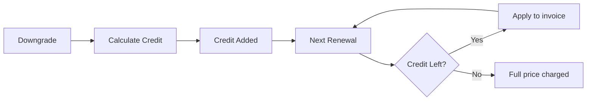

<Info>
تتيح الاشتراكات لك بيع وصول مستمر مع تجديدات آلية. استخدم دورات فوترة مرنة، تجارب مجانية، تغييرات الخطة، والإضافات لتخصيص التسعير لكل عميل.
</Info>

<CardGroup cols={2}>
<Card title="Upgrade & Downgrade" icon="repeat" href="/developer-resources/subscription-upgrade-downgrade">
تحكم في تغييرات الخطة باستخدام النسبة وتحديثات الكمية.
</Card>

<Card title="On‑Demand Subscriptions" icon="bolt" href="/developer-resources/ondemand-subscriptions">
فوض تفويضًا الآن وادفع لاحقًا بمبالغ مخصصة.
</Card>

<Card title="Customer Portal" icon="id-card" href="/features/customer-portal">
دع العملاء يديرون الخطط والفوترة والإلغاءات.
</Card>

<Card title="Subscription Webhooks" icon="code" href="/developer-resources/webhooks/intents/subscription">
تفاعل مع أحداث دورة الحياة مثل الإنشاء والتجديد والإلغاء.
</Card>
</CardGroup>

## ما هي الاشتراكات؟

الاشتراكات هي منتجات متكررة يشتريها العملاء وفق جدول زمني. إنها مثالية لـ:

- **ترخيص SaaS**: التطبيقات، واجهات برمجة التطبيقات، أو الوصول إلى المنصات
- **العضويات**: المجتمعات، البرامج، أو الأندية
- **المحتوى الرقمي**: الدورات، الوسائط، أو المحتوى المتميز
- **خطط الدعم**: اتفاقيات مستوى الخدمة، حزم النجاح، أو الصيانة

## الفوائد الرئيسية

- **إيرادات متوقعة**: فواتير متكررة مع تجديدات تلقائية
- **دورات مرنة**: شهرية، سنوية، فترات مخصصة، وتجارب
- **مرونة الخطط**: تقسيط للترقيات والتخفيضات
- **إضافات ومقاعد**: أضف ترقيات اختيارية وقابلة للقياس
- **تجربة دفع سلسة**: دفع مستضاف وبوابة العملاء
- **موجه للمطورين**: واجهات برمجة تطبيقات واضحة لإنشاء، تغييرات، وتتبع الاستخدام

## إنشاء الاشتراكات

قم بإنشاء منتجات الاشتراك في لوحة معلومات مدفوعات Dodo الخاصة بك، ثم قم ببيعها من خلال الدفع أو واجهة برمجة التطبيقات الخاصة بك. يفصل المنتجات عن الاشتراكات النشطة مما يتيح لك إصدار أسعار، إرفاق إضافات، وتتبع الأداء بشكل مستقل.

### إنشاء منتج الاشتراك

قم بتكوين الحقول في لوحة المعلومات لتعريف كيفية بيع اشتراكك، تجديده، وفوترة. الأقسام أدناه تتطابق مباشرة مع ما تراه في نموذج الإنشاء.

#### تفاصيل المنتج

- **اسم المنتج** (مطلوب): الاسم المعروض في الدفع، بوابة العملاء، والفواتير.
- **وصف المنتج** (مطلوب): بيان قيمة واضح يظهر في الدفع والفواتير.
- **صورة المنتج** (مطلوب): PNG/JPG/WebP حتى 3 ميغابايت. تستخدم في الدفع والفواتير.
- **العلامة التجارية**: ربط المنتج بعلامة تجارية معينة للتصميم والبريد الإلكتروني.
- **فئة الضريبة** (مطلوب): اختر الفئة (على سبيل المثال، SaaS) لتحديد قواعد الضريبة.

<Tip>
اختر فئة الضريبة الأكثر دقة لضمان جمع الضريبة الصحيح لكل منطقة.
</Tip>

#### التسعير

- **نوع التسعير**: اختر <b>الاشتراك</b> (هذا الدليل). البدائل هي الدفع لمرة واحدة والفوترة بناءً على الاستخدام.
- **السعر** (مطلوب): السعر الأساسي المتكرر مع العملة.
- **نسبة الخصم المطبقة (%)**: نسبة الخصم الاختيارية المطبقة على السعر الأساسي؛ تظهر في صفحة الدفع والفواتير.
- **تكرار الدفع كل** (مطلوب): الفاصل الزمني للتجديدات، على سبيل المثال، كل شهر واحد. اختر التكرار (شهور أو سنوات) والكمية.
- **مدة الاشتراك** (مطلوب): المدة الإجمالية التي يظل فيها الاشتراك نشطًا (على سبيل المثال، 10 سنوات). بعد انتهاء هذه الفترة، تتوقف التجديدات ما لم يتم تمديدها.
- **أيام فترة التجربة** (مطلوب): حدد طول فترة التجربة بالأيام. استخدم 0 لتعطيل التجارب. يتم فرض الرسوم الأولى تلقائيًا عند انتهاء فترة التجربة.
- **اختر الإضافة**: أرفق ما يصل إلى 10 إضافات يمكن للعملاء شراؤها جنبًا إلى جنب مع الخطة الأساسية.

<Warning>
يؤثر تغيير التسعير على منتج نشط على المشتريات الجديدة. تتبع الاشتراكات الحالية إعدادات تغيير الخطة والنسبة الخاصة بك.
</Warning>

<Info>
الإضافات مثالية للميزات القابلة للقياس مثل المقاعد أو التخزين. يمكنك التحكم في الكميات المسموح بها وسلوك النسبة عندما يغيرها العملاء.
</Info>

#### الإعدادات المتقدمة

- **تسعير شامل للضرائب**: عرض الأسعار شاملة الضرائب المطبقة. لا يزال حساب الضريبة النهائي يختلف حسب موقع العميل.
- **إنشاء مفاتيح الترخيص**: إصدار مفتاح فريد لكل عميل بعد الشراء. راجع دليل <a href="/features/license-keys">مفاتيح الترخيص</a>.
- **تسليم المنتج الرقمي**: تسليم الملفات أو المحتوى تلقائيًا بعد الشراء. تعرف على المزيد في <a href="/features/digital-product-delivery">تسليم المنتج الرقمي</a>.
- **البيانات الوصفية**: إرفاق أزواج مفتاح-قيمة مخصصة للتصنيف الداخلي أو تكاملات العملاء. راجع <a href="/api-reference/metadata">البيانات الوصفية</a>.

<Tip>
استخدم البيانات الوصفية لتخزين المعرفات من نظامك (على سبيل المثال accountId) حتى تتمكن من تسوية الأحداث والفواتير لاحقًا.
</Tip>

## تجارب الاشتراك

تتيح التجارب للعملاء الوصول إلى الاشتراكات دون دفع فوري. يتم فرض الرسوم الأولى تلقائيًا عند انتهاء التجربة.

### تكوين التجارب

قم بتعيين **أيام الفترة التجريبية** في قسم تسعير المنتج (استخدم `0` لتعطيلها). يمكنك تجاوز هذا عند إنشاء الاشتراكات:

```typescript
// Via subscription creation
const subscription = await client.subscriptions.create({
  customer_id: 'cus_123',
  product_id: 'prod_monthly',
  trial_period_days: 14  // Overrides product's trial period
});

// Via checkout session
const session = await client.checkoutSessions.create({
  product_cart: [{ product_id: 'prod_monthly', quantity: 1 }],
  subscription_data: { trial_period_days: 14 }
});
```

<Warning>
يجب أن تكون القيمة `trial_period_days` بين 0 و10,000 يوم.
</Warning>

### اكتشاف حالة التجربة

<Warning>
حاليًا لا يوجد حقل مباشر لاكتشاف حالة الفترة التجريبية. الحل البديل التالي يتطلب استعلامًا عن المدفوعات، وهو أمر غير فعال. نحن نعمل على حل أكثر كفاءة.
</Warning>

لتحديد ما إذا كان الاشتراك في فترة تجربة، استرجع قائمة المدفوعات للاشتراك. إذا كان هناك دفعة واحدة فقط بمبلغ 0، فإن الاشتراك في فترة التجربة:

```typescript
const subscription = await client.subscriptions.retrieve('sub_123');
const payments = await client.payments.list({
  subscription_id: subscription.subscription_id
});

// Check if subscription is in trial
const isInTrial = payments.items.length === 1 && 
                  payments.items[0].total_amount === 0;
```

### تحديث فترة التجربة

مدد الفترة التجريبية بتحديث `next_billing_date`:

```typescript
await client.subscriptions.update('sub_123', {
  next_billing_date: '2025-02-15T00:00:00Z'  // New trial end date
});
```

<Warning>
لا يمكنك تعيين `next_billing_date` إلى وقت ماضي. يجب أن يكون التاريخ في المستقبل.
</Warning>

## تغييرات خطة الاشتراك

تتيح تغييرات الخطط لك ترقية أو تخفيض الاشتراكات، تعديل الكميات، أو الانتقال إلى منتجات مختلفة. كل تغيير يؤدي إلى فرض رسوم فورية بناءً على وضع التقسيط الذي تختاره.

<Tip>
يمكنك تغيير خطط الاشتراك وتحديث تاريخ الفوترة التالي مباشرة من لوحة تحكم Dodo Payments. يوفر ذلك وسيلة سريعة لتعديل الاشتراكات لطلبات دعم العملاء أو الترقيات الترويجية أو انتقالات الخطط دون استدعاء واجهة برمجة التطبيقات.
</Tip>

<Tip>
**تمكين تغييرات الخطة بالخدمة الذاتية:** هل تريد أن يقوم العملاء بترقية أو تخفيض اشتراكاتهم عبر بوابة العملاء؟ أضف منتجات الاشتراك إلى مجموعة منتجات وقم بتمكين "السماح بتحديثات الاشتراك" في إعدادات الاشتراك.

```mermaid
sequenceDiagram
    participant C as Customer
    participant A as Your App
    participant D as Dodo Payments
    C->>A: Request plan change
    A->>D: Preview change (optional)
    D-->>A: Charge breakdown
    A->>C: Show cost
    C->>A: Confirm
    A->>D: changePlan API
    D->>D: Prorate & charge
    D-->>A: Result
    D->>A: Webhook: plan_changed
    A->>C: Access updated
```

</Tip>



<Card title="Product Collections" icon="layer-group" href="/features/product-collections">
  جمع المنتجات ذات الصلة في مجموعات لتمكين مسارات ترقية/تخفيض سلسة في بوابة العملاء.
</Card>

### أوضاع النسبة

اختر كيف يتم محاسبة العملاء عند تغيير الخطط:

<Info>
**مقارنة سريعة بين أوضاع النسبة الثلاثة:**

| | `prorated_immediately` | `difference_immediately` | `full_immediately` |
|---|---|---|---|
| **Upgrade** | تحصيل مبلغ محسوب بالنسبة للأيام المتبقية | تحصيل فرق السعر الكامل | تحصيل سعر الخطة الجديدة بالكامل |
| **Downgrade** | اعتماد محسوب للأيام المتبقية | فرق السعر الكامل كرصيد | لا يوجد اعتماد، تحصيل كامل |
| **Billing cycle** | تبقى كما هي | تبقى كما هي | تعود إلى اليوم |
| **Best for** | فوترة عادلة تعتمد على الوقت | تغييرات مستوى بسيطة | إعادة تعيين دورة الفوترة |
</Info>

#### `prorated_immediately`
تحصل على المبلغ المحسوب بناءً على الوقت المتبقي في دورة الفوترة الحالية. الأفضل للفوترة العادلة التي تأخذ في الحسبان الوقت غير المستخدم.

```typescript
await client.subscriptions.changePlan('sub_123', {
  product_id: 'prod_pro',
  quantity: 1,
  proration_billing_mode: 'prorated_immediately'
});
```

#### `difference_immediately`
تحصل على فرق السعر فورًا (عند الترقية) أو تضيف رصيدًا للتجديدات المستقبلية (عند التخفيض). الأفضل للسيناريوهات البسيطة للترقية/التخفيض.

```typescript
// Upgrade: charges $50 (difference between $30 and $80)
// Downgrade: credits remaining value, auto-applied to renewals
await client.subscriptions.changePlan('sub_123', {
  product_id: 'prod_pro',
  quantity: 1,
  proration_billing_mode: 'difference_immediately'
});
```

<Info>
يُعدّ الاعتمادات من التخفيضات باستخدام `difference_immediately` مخصصة للاشتراك وتُطبق تلقائيًا على التجديدات المستقبلية. وهي تختلف عن <a href="/features/customer-credit">اعتمادات العملاء</a>.
</Info>

عندما يخفض العميل باستخدام `difference_immediately`، تصبح القيمة غير المستخدمة رصيدًا مخصصًا للاشتراك يعوض التجديدات المستقبلية تلقائيًا:



#### `full_immediately`
تحصل على مبلغ الخطة الجديدة بالكامل فورًا، متجاهلًا الوقت المتبقي. الأفضل لإعادة تعيين دورات الفوترة.

```typescript
await client.subscriptions.changePlan('sub_123', {
  product_id: 'prod_monthly',
  quantity: 1,
  proration_billing_mode: 'full_immediately'
});
```

<AccordionGroup>
<Accordion title="Example: Prorated upgrade calculation">

**السيناريو**: العميل في الخطة الأساسية (30 دولارًا/شهرًا) يترقى إلى الخطة الاحترافية (80 دولارًا/شهرًا) في اليوم 16 من دورة مدتها 30 يومًا باستخدام `prorated_immediately`.

```
Unused credit from Basic = $30 × (15 remaining / 30 total) = $15.00
Prorated cost of Pro     = $80 × (15 remaining / 30 total) = $40.00
────────────────────────────────────────────────────────────────────
Immediate charge         = $40.00 − $15.00 = $25.00
```

التجديد التالي في تاريخ الفوترة الأصلي: **80.00 دولارًا/شهرًا**.

<Tip>
للحصول على مزيد من أمثلة الحساب والحالات الخاصة، راجع [دليل الترقية والتخفيض](/developer-resources/subscription-upgrade-downgrade) الكامل.
</Tip>

</Accordion>
<Accordion title="Example: Downgrade credit calculation">

**السيناريو**: العميل في الخطة الاحترافية (80 دولارًا/شهرًا) يخفض إلى الخطة المبتدئة (20 دولارًا/شهرًا) باستخدام `difference_immediately`.

```
Credit = Old plan − New plan = $80 − $20 = $60.00
```

يتم تطبيق رصيد 60 دولارًا تلقائيًا على التجديدات المستقبلية:
- التجديد 1: 20 دولارًا − 20 دولارًا (رصيد) = **0.00 دولارًا** (يتبقى 40 دولارًا رصيدًا)
- التجديد 2: 20 دولارًا − 20 دولارًا (رصيد) = **0.00 دولارًا** (يتبقى 20 دولارًا رصيدًا)  
- التجديد 3: 20 دولارًا − 20 دولارًا (رصيد) = **0.00 دولارًا** (تم استنفاد الرصيد)
- التجديد 4: **20.00 دولارًا** (السعر الكامل)

<Info>
تعرف على المزيد حول كيفية إدارة الاعتمادات في [دليل الترقية والتخفيض](/developer-resources/subscription-upgrade-downgrade).
</Info>

</Accordion>
</AccordionGroup>

### تغيير الخطط مع الإضافات

قم بتعديل الإضافات عند تغيير الخطط. تُدرج الإضافات في حسابات النسبة:

```typescript
await client.subscriptions.changePlan('sub_123', {
  product_id: 'prod_pro',
  quantity: 1,
  proration_billing_mode: 'difference_immediately',
  addons: [{ addon_id: 'addon_extra_seats', quantity: 2 }]  // Add add-ons
  // addons: []  // Empty array removes all existing add-ons
});
```

<Info>
تحفز تغييرات الخطة رسومًا فورية. قد تنقل الرسوم الفاشلة الاشتراك إلى حالة `on_hold`. تتبع التغييرات عبر أحداث webhook الخاصة بـ `subscription.plan_changed`.
</Info>

### معاينة تغييرات الخطة

قبل الالتزام بتغيير الخطة، عاين الرسوم الدقيقة والاشتراك الناتج:

```typescript
const preview = await client.subscriptions.previewChangePlan('sub_123', {
  product_id: 'prod_pro',
  quantity: 1,
  proration_billing_mode: 'prorated_immediately'
});

// Show customer the charge before confirming
console.log('You will be charged:', preview.immediate_charge.summary);
```

<Card title="Preview Change Plan API" icon="eye" href="/api-reference/subscriptions/preview-change-plan">
  عاين تغييرات الخطة قبل الالتزام بها.
</Card>

## حالات الاشتراك

يمكن أن تكون الاشتراكات في حالات مختلفة طوال دورة حياتها:

- **`active`**: الاشتراك نشط وسيتم تجديده تلقائيًا
- **`on_hold`**: الاشتراك متوقف مؤقتًا بسبب فشل الدفع. يلزم تحديث وسيلة الدفع لإعادة التفعيل
- **`cancelled`**: الاشتراك ملغى ولن يجدد
- **`expired`**: بلغ الاشتراك تاريخ انتهائه
- **`pending`**: يجري إنشاء الاشتراك أو معالجته

### حالة التوقف المؤقت

يدخل الاشتراك حالة `on_hold` عندما:

- يفشل دفع التجديد (أموال غير كافية، بطاقة منتهية الصلاحية، إلخ)
- تفشل رسوم تغيير الخطة
- تفشل صلاحية وسيلة الدفع

<Warning>
عندما يكون الاشتراك في حالة `on_hold`، فلن يتجدد تلقائيًا. عليك تحديث وسيلة الدفع لإعادة تنشيط الاشتراك.
</Warning>

### إعادة التنشيط من حالة التوقف المؤقت

لإعادة تنشيط الاشتراك من حالة `on_hold`، حدّث وسيلة الدفع. يقوم ذلك تلقائيًا بـ:

1. إنشاء رسوم للمستحقات المتبقية
2. إنشاء فاتورة
3. معالجة الدفع باستخدام وسيلة الدفع الجديدة
4. إعادة تنشيط الاشتراك إلى حالة `active` عند نجاح الدفع

```typescript
// Reactivate subscription from on_hold
const response = await client.subscriptions.updatePaymentMethod('sub_123', {
  type: 'new',
  return_url: 'https://example.com/return'
});

// For on_hold subscriptions, a charge is automatically created
if (response.payment_id) {
  console.log('Charge created:', response.payment_id);
  // Redirect customer to response.payment_link to complete payment
  // Monitor webhooks for payment.succeeded and subscription.active
}
```

<Info>
بعد تحديث وسيلة الدفع بنجاح لاشتراك في حالة `on_hold`، ستتلقى أحداث webhook `payment.succeeded` تليها `subscription.active`.
</Info>

## إدارة واجهة برمجة التطبيقات

<AccordionGroup>
<Accordion title="Create subscriptions">
استخدم `POST /subscriptions` لإنشاء الاشتراكات برمجيًا من المنتجات، مع تجارب وإضافات اختيارية.


<Card title="API Reference" icon="code" href="/api-reference/subscriptions/post-subscriptions">
اطلع على واجهة برمجة تطبيقات إنشاء الاشتراك.
</Card>
</Accordion>

<Accordion title="Update subscriptions">
استخدم `PATCH /subscriptions/{id}` لتحديث الكميات أو الإلغاء في تاريخ الفوترة التالي أو تعديل البيانات الوصفية.


<Card title="API Reference" icon="code" href="/api-reference/subscriptions/patch-subscriptions">
تعرّف على كيفية تحديث تفاصيل الاشتراك.
</Card>
</Accordion>

<Accordion title="Change plans (proration)">
غيّر المنتج النشط والكميات مع ضوابط النسبة.


<Card title="API Reference" icon="code" href="/api-reference/subscriptions/change-plan">
راجع خيارات تغيير الخطة.
</Card>
</Accordion>

<Accordion title="On‑demand charges">
بالنسبة للاشتراكات حسب الطلب، قم بتحصيل مبالغ محددة عند الطلب.


<Card title="API Reference" icon="code" href="/api-reference/subscriptions/create-charge">
قم بتحصيل اشتراك حسب الطلب.
</Card>
</Accordion>

<Accordion title="List and retrieve">
استخدم `GET /subscriptions` لسرد جميع الاشتراكات و`GET /subscriptions/{id}` لاسترجاع أحدها.


<Card title="API Reference" icon="code" href="/api-reference/subscriptions/get-subscriptions">
تصفح واجهات برمجة التطبيقات للقوائم والاسترجاع.
</Card>
</Accordion>

<Accordion title="Usage history">
استرجع الاستخدام المسجل لنماذج التسعير حسب القياس أو المختلطة.


<Card title="API Reference" icon="code" href="/api-reference/subscriptions/get-usage-history">
اطّلع على واجهة برمجة تطبيقات سجل الاستخدام.
</Card>
</Accordion>

<Accordion title="Update payment method">
قم بتحديث وسيلة الدفع للاشتراك. بالنسبة للاشتراكات النشطة، يقوم ذلك بتحديث وسيلة الدفع للتجديدات المستقبلية. بالنسبة للاشتراكات في حالة `on_hold`، يعيد ذلك تنشيط الاشتراك من خلال إنشاء رسوم للمستحقات المتبقية.


<Card title="API Reference" icon="code" href="/api-reference/subscriptions/update-payment-method">
تعرّف على كيفية تحديث وسائل الدفع وإعادة تنشيط الاشتراكات.
</Card>
</Accordion>
</AccordionGroup>

## حالات الاستخدام الشائعة

- **SaaS and APIs**: وصول متدرج مع إضافات للمقاعد أو الاستخدام
- **Content and media**: وصول شهري مع تجارب تقديمية
- **B2B support plans**: عقود سنوية مع إضافات دعم متميزة
- **Tools and plugins**: مفاتيح ترخيص وإصدارات ذات نسخ

## أمثلة على التكامل

### جلسات الدفع (الاشتراكات)
عند إنشاء جلسات الدفع، أدرج منتج الاشتراك الخاص بك والإضافات الاختيارية:

```typescript
const session = await client.checkoutSessions.create({
  product_cart: [
    {
      product_id: 'prod_subscription',
      quantity: 1
    }
  ]
});
```

### تغييرات الخطط مع النسبة
قم بترقية أو تخفيض الاشتراك وتحكم في سلوك النسبة:

```typescript
await client.subscriptions.changePlan('sub_123', {
  product_id: 'prod_new',
  quantity: 1,
  proration_billing_mode: 'difference_immediately'
});
```

### الإلغاء في تاريخ الفوترة التالي
جدول إلغاء يسري في نهاية دورة الفوترة الحالية:

```typescript
await client.subscriptions.update('sub_123', {
  cancel_at_next_billing_date: true
});
```

### الاشتراكات حسب الطلب
أنشئ اشتراكًا حسب الطلب واحتسب الرسوم لاحقًا حسب الحاجة:

```typescript
const onDemand = await client.subscriptions.create({
  customer_id: 'cus_123',
  product_id: 'prod_on_demand',
  on_demand: true
});

await client.subscriptions.createCharge(onDemand.id, {
  amount: 4900,
  currency: 'USD',
  description: 'Extra usage for September'
});
```

### تحديث وسيلة الدفع للاشتراك النشط
حدّث وسيلة الدفع للاشتراك النشط:

```typescript
// Update with new payment method
const response = await client.subscriptions.updatePaymentMethod('sub_123', {
  type: 'new',
  return_url: 'https://example.com/return'
});

// Or use existing payment method
await client.subscriptions.updatePaymentMethod('sub_123', {
  type: 'existing',
  payment_method_id: 'pm_abc123'
});
```

### إعادة تنشيط الاشتراك من حالة on_hold
أعد تنشيط اشتراك تم وضعه في حالة التوقف المؤقت بسبب فشل الدفع:

```typescript
// Update payment method - automatically creates charge for remaining dues
const response = await client.subscriptions.updatePaymentMethod('sub_123', {
  type: 'new',
  return_url: 'https://example.com/return'
});

if (response.payment_id) {
  // Charge created for remaining dues
  // Redirect customer to response.payment_link
  // Monitor webhooks: payment.succeeded → subscription.active
}
```

## الاشتراكات المتوافقة مع تفويضات RBI

  تعمل اشتراكات UPI وبطاقات الهند تحت تنظيمات بنك الاحتياطي الهندي (RBI) مع متطلبات تفويض محددة:

  ### حدود التفويض

  يعتمد نوع المندوب والمبلغ على رسوم الاشتراك المتكررة:

  - **الرسوم أقل من 15,000 روبية:** ننشئ تفويضًا حسب الطلب بمبلغ 15,000 روبية هندية. يتم تحصيل مبلغ الاشتراك دوريًا وفقًا لتكرار الاشتراك، حتى حد التفويض.
  - **الرسوم 15,000 روبية أو أكثر:** ننشئ تفويض اشتراك (أو تفويض حسب الطلب) بالمبلغ الدقيق للاشتراك.

للحصول على معلومات مفصلة حول التفويضات المتوافقة مع RBI لطرق الدفع الهندية، راجع صفحة <a href="/features/payment-methods/india">طرق الدفع في الهند</a>.

  ### اعتبارات الترقية والتخفيض

  **مهم:** عند ترقية أو تخفيض الاشتراكات، ضع حدود التفويض في الاعتبار بعناية:

  - إذا أدت ترقية أو تخفيض إلى مبلغ رسوم يتجاوز 15,000 روبية وتجاوز حد الدفع حسب الطلب الحالي، فقد تفشل المعاملة.
  - في مثل هذه الحالات، قد يحتاج العميل إلى تحديث وسيلة الدفع أو تغيير الاشتراك مرة أخرى لإنشاء تفويض جديد بالحد الصحيح.

  ### التفويض للرسوم العالية

  بالنسبة لرسوم الاشتراك التي تبلغ 15,000 روبية أو أكثر:

  - سيُطلب من العميل من قبل البنك تفويض المعاملة.
  - إذا فشل العميل في تفويض المعاملة، ستفشل المعاملة وسيُعلق الاشتراك.

  ### تأخير المعالجة لمدة 48 ساعة

  **الجدول الزمني للمعالجة:** تتبع الرسوم المتكررة على البطاقات الهندية واشتراكات UPI نمط معالجة فريدًا:

  - يتم **بدء** الرسوم في التاريخ المجدول وفقًا لتكرار الاشتراك.
  - يتم **خصم** المبلغ من حساب العميل فقط بعد **48 ساعة** من بدء الدفع.
  - قد تمتد نافذة الـ48 ساعة هذه حتى **ساعتين إلى ثلاث إضافيتين** حسب استجابة واجهات برمجة تطبيقات البنك.

  ### نافذة إلغاء التفويض

  خلال نافذة المعالجة التي تمتد لـ48 ساعة:

  - يمكن للعملاء إلغاء التفويض عبر تطبيقات البنك الخاصة بهم.
  - إذا ألغى العميل التفويض خلال هذه الفترة، سيبقى الاشتراك **نشطًا** (هذه حالة غير معتادة خاصة باشتراكات البطاقات الهندية وUPI AutoPay).
  - مع ذلك، قد يفشل الخصم الفعلي، وفي هذه الحالة سنضع الاشتراك **في حالة التوقف المؤقت**.

  **معالجة الحالات الخاصة:** إذا قدمت مزايا أو اعتمادات أو استخدام الاشتراك للعملاء فور بدء العملية، تحتاج إلى التعامل مع نافذة الـ48 ساعة هذه بشكل مناسب في تطبيقك. ضع في الاعتبار:

  - تأخير تفعيل المزايا حتى تأكيد الدفع
  - تنفيذ فترات سماح أو وصول مؤقت
  - مراقبة حالة الاشتراك لإلغاء التفويضات
  - التعامل مع حالات التوقف المؤقت في منطق التطبيق الخاص بك

  <Tip>
  راقب webhooks الاشتراك لتتبع تغييرات حالة الدفع والتعامل مع الحالات الخاصة التي يتم فيها إلغاء التفويضات خلال نافذة الـ48 ساعة.
  </Tip>

## أفضل الممارسات

- **ابدأ بطبقات واضحة**: خطتان أو ثلاث بخلافات واضحة
- **واصل التواصل حول التسعير**: أظهر الإجماليات والنسبة والتجديد التالي
- **استخدم التجارب بعناية**: حوّلها من خلال التهيئة، لا بالاعتماد على الوقت فقط
- **استفد من الإضافات**: احتفظ بالخطط الأساسية بسيطة وقدم الإضافات للترقية
- **اختبر التغييرات**: تحقق من تغييرات الخطة والنسبة في وضع الاختبار

<Info>
الاشتراكات أساس مرن للإيرادات المتكررة. ابدأ ببساطة، اختبر بدقة، وعدّل بناءً على مقاييس التبني والارتداد والتوسع.
</Info>