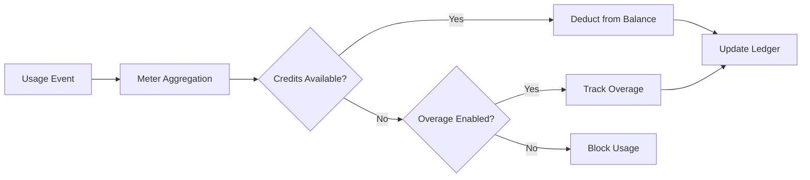

<Info>
تقوم العدادات بتحويل الأحداث الخام إلى كميات قابلة للفوترة. تقوم بتصفية الأحداث وتطبيق دوال التجميع (Count، Sum، Max، Last) لحساب الاستخدام لكل عميل.
</Info>

<Frame>

</Frame>

## موارد API

<AccordionGroup>
<Accordion title="View Meter API References">
<CardGroup cols={2}>
<Card title="Create Meter" icon="plus" href="/api-reference/meters/create-meter">
قم بإنشاء العدادات برمجيًا عبر واجهة برمجة التطبيقات.
</Card>

<Card title="List Meters" icon="list" href="/api-reference/meters/get-meters">
استرجع كل العدادات في حسابك.
</Card>

<Card title="Get Meter" icon="eye" href="/api-reference/meters/retrieve-meter">
احصل على تفاصيل عداد معين بواسطة المعرف.
</Card>

<Card title="Archive Meter" icon="arrow-rotate-right" href="/api-reference/meters/archive-meter">
أرشف عدادًا لإيقاف تتبُّع الاستخدام.
</Card>

<Card title="Unarchive Meter" icon="arrow-rotate-left" href="/api-reference/meters/unarchive-meter">
استعد عدادًا مؤرشفًا لاستئناف التتبع.
</Card>
</CardGroup>
</Accordion>
</AccordionGroup>

## إنشاء مقياس

<Steps>
<Step title="Basic Information">
<ParamField path="Meter Name" type="string" required>
اسم وصفي (مثل "طلبات API"، "استخدام الرموز")
</ParamField>

<ParamField path="Event Name" type="string" required>
اسم الحدث الدقيق للمطابقة (حساس لحالة الخط). أمثلة: `api.call`، `image.generated`
</ParamField>
</Step>

<Step title="Aggregation">
<ParamField path="Aggregation Type" type="string" required>
اختر كيفية تجميع الأحداث:

- **Count**: إجمالي عدد الأحداث (استدعاءات API، التحميلات)
- **Sum**: جمع القيم الرقمية (الرموز، البايتات)
- **Max**: أعلى قيمة في الفترة (أعلى عدد مستخدمين)
- **Last**: أحدث قيمة
</ParamField>

<ParamField path="Over Property" type="string">
مفتاح البيانات الوصفية للتجميع (مطلوب لجميع الأنواع ما عدا Count). أمثلة: `tokens`، `bytes`، `duration_ms`
</ParamField>

<ParamField path="Measurement Unit" type="string" required>
تسمية الوحدة للفواتير. أمثلة: `calls`، `tokens`، `GB`، `hours`
</ParamField>
</Step>

<Step title="Filtering (Optional)">
<Frame>

</Frame>

أضف شروطاً لتصفية الأحداث التي يتم احتسابها:
- **منطق AND**: يجب أن تتطابق جميع الشروط
- **منطق OR**: يمكن أن تتطابق أي شرط

**المقارنات**: يساوي، لا يساوي، أكبر من، أقل من، يحتوي على

فعّل التصفية، اختر المنطق، أضف شروطًا بمفتاح الخاصية والمقارن والقيمة.
</Step>

<Step title="Create">
راجع التكوين واضغط **Create Meter**.
</Step>
</Steps>

## عرض التحليلات

<Frame>

</Frame>

تظهر لوحة معلومات المقياس لديك:
- **نظرة عامة**: إجمالي الاستخدام ومخطط الاستخدام
- **الأحداث**: الأحداث الفردية المستلمة
- **العملاء**: الاستخدام والرسوم لكل عميل

## الفوترة بالاعتمادات بدلاً من العملات

بشكلٍ افتراضي، تقوم العدادات بتحصيل رسوم لكل وحدة بالدولار (أو العملة التي قمت بتكوينها). يمكنك بدلاً من ذلك تكوين عداد لـ **الخصم من رصيد اعتمادات** - بحيث يستهلك الاستخدام الاعتمادات بدلاً من توليد رسوم مالية.

<Info>
يتطلب الخصم المستند إلى الاعتمادات [أهلية الاعتماد](/features/credit-based-billing) المرتبطة بنفس المنتج. أنشئ الاعتماد أولاً، ثم اربطه بالعداد.
</Info>

### متى تستخدم الخصم المستند إلى الاعتمادات

| السيناريو | القياسي (العملة) | المستند إلى الاعتمادات |
|----------|-------------------|--------------|
| تسعير بسيط لكل وحدة ($0.01/مكالمة) | ✅ الأنسب | عبء غير ضروري |
| حزم اعتماد مدفوعة مقدمًا (اشترِ 10K رمز، استخدمها مع الوقت) | ❌ لا يمكن التعبير عنه | ✅ الأنسب |
| الاستخدام المدمج مع الاشتراكات (خطة Pro تتضمن 100K مكالمة) | ممكن عبر الحد المجاني | ✅ أفضل - الاعتمادات تُنقل، تنتهي صلاحيتها، تظهر في البوابة |
| منتجات متعددة العدادات تتشارك في مجموعة اعتماد واحدة | ❌ كل عداد يفوتر بشكل منفصل | ✅ جميع العدادات تخصم من رصيد واحد |

### تكوين عداد لخصم الاعتمادات

<Steps>
{/* LOCKED_PATTERN_2f001d4cc191a503bfa27e2b02a887d3 */}
ابدأ بإنشاء اعتماد في **Products → Credits**. عرّف الوحدة (مثل "API Calls"، "Tokens"), الدقة، وإعدادات دورة الحياة (انتهاء الصلاحية، الترحيل، التجاوز).

اطّلع على [دليل الفوترة المستندة إلى الاعتمادات](/features/credit-based-billing) للحصول على تعليمات مفصلة.
</Step>

{/* LOCKED_PATTERN_e56c2bce14c9ffc41b822106f30b9344 */}
اذهب إلى منتجك المستند إلى الاستخدام وافتح قسم تكوين **Meter**.
</Step>

{/* LOCKED_PATTERN_0e1120cd860a229dcc6f92a517f37ac6 */}
انقر على زر **+** لإرفاق عداد. قم بتكوين اسم الحدث، نوع التجميع، ووحدة القياس كالمعتاد.
</Step>

{/* LOCKED_PATTERN_5742803ec5f5aba6317bae5a7cd68e62 */}
فعّل خاصية **Bill usage in Credits** في تكوين العداد. سيُظهر هذا إعدادات الاعتماد التالية:

{/* LOCKED_PATTERN_5164565eee83d03235035c7c8b6b2680 */}

</Frame>

{/* LOCKED_PATTERN_643db6bd6419b3403905cdf5351f1450 */}
حدد أي أهلية اعتماد يجب أن يخصم منها هذا العداد.
</ParamField>

{/* LOCKED_PATTERN_f350d049ff7e758408e63c7b8b7766de */}
عدد وحدات الاستخدام المطلوبة لخصم اعتماد واحد. على سبيل المثال:
- `1` = كل حدث عداد يخصم اعتمادًا واحدًا
- `100` = 100 حدث عداد يخصمان اعتمادًا واحدًا
- `1000` = 1,000 مكالمة API تستهلك اعتمادًا واحدًا
</ParamField>
</Step>

{/* LOCKED_PATTERN_6b77ac14c64de04b72ad44281724bb0c */}
ما زال **الحد المجاني** ساريًا - الأحداث التي تقع تحت هذا الحد لا تخصم اعتمادات.

**مثال**: مع حد مجاني قدره 1,000 ووحدات العداد لكل اعتماد تساوي 1:
- يستخدم العميل 2,500 مكالمة API
- أول 1,000 مجانية
- يتم خصم 1,500 اعتماد من رصيدهم
</Step>
</Steps>

### كيف يعمل خصم الاعتمادات

بمجرد تكوينه، يعمل خط أنابيب الخصم تلقائيًا:

1. **وصول الأحداث** - يرسل تطبيقك أحداث الاستخدام عبر [Event Ingestion API](/features/usage-based-billing/event-ingestion)
2. **تجميع العداد** - تُجمّع الأحداث وفقًا لتكوين العداد (Count, Sum, Max, Last)
3. **معالجة عامل الخلفية** - كل دقيقة، يسترجع العامل الأحداث الجديدة منذ آخر نقطة تحقق
4. **يتم خصم الاعتمادات** - يتم تحويل الاستخدام المجمع إلى اعتمادات باستخدام معدل `meter_units_per_credit` ويُخصم باستخدام **ترتيب FIFO** (تُستهلك المنح الأقدم أولاً)
5. **تتبع التجاوز** - إذا وصل الرصيد إلى الصفر وتم تفعيل التجاوز، يستمر الاستخدام ويتم التعامل مع التجاوز وفق السلوك المُكوَّن (يُسامح عند إعادة التعيين، يُفوترة في الفاتورة التالية، أو يُحمل كعجز)

{/* LOCKED_PATTERN_4907e9f6f7fbd509120d7a87afc829e9 */}
يعمل خصم الاعتمادات بشكل غير متزامن (كل دقيقة تقريبًا). قد يكون هناك تأخير بسيط بين إدخال الحدث وخصم الرصيد. صمم تطبيقك ليتعامل مع هذا التأخير - لا تعتمد على التحقق من الرصيد في الوقت الحقيقي للتحكم بالوصول لطلبات فردية.
{/* LOCKED_PATTERN_176d815432e7554ac558e8631b2bc397 */}

### عدة عدادات، مجموعة اعتماد واحدة

يمكنك ربط عدة عدادات على نفس المنتج بـ **أهلية اعتماد واحدة**. جميع العدادات تخصم من رصيد مشترك واحد.

**مثال**: منصة ذكاء اصطناعي تحتوي على عدادين:
- `text.generation` - اعتماد واحد لكل 1,000 رمز
- `image.generation` - 10 اعتمادات لكل صورة

كلاهما يخصم من نفس تجمع "اعتمادات الذكاء الاصطناعي". يرى العميل رصيدًا موحدًا واحدًا في بوابته.

{/* LOCKED_PATTERN_317ec56569e36d0c9e56c2648890a76e */}
استخدم معدلات `meter_units_per_credit` مختلفة عبر العدادات للتعبير عن التكاليف النسبية. العمليات المكلفة (توليد الصور) تستهلك وحدات عداد أقل لكل اعتماد من العمليات الرخيصة (استكمال النص).
{/* LOCKED_PATTERN_4dec52ce04aa8849a8a60508baae30ae */}

<CardGroup cols={2}>
{/* LOCKED_PATTERN_2e110f22e0f3741250f140b212ae466d */}
اطّلع على السجل الكامل لخصم الاعتمادات لعميل.
</Card>
{/* LOCKED_PATTERN_83b4a13ef9031c5fd9378a998aeaa952 */}
تحقق من رصيد الاعتمادات الحالي لعميل عبر واجهة برمجة التطبيقات.
</Card>
</CardGroup>

## استكشاف الأخطاء وإصلاحها

<AccordionGroup>
<Accordion title="Events not appearing">
- يجب أن يتطابق اسم الحدث تمامًا (حساس لحالة الأحرف)
- تأكد من أن مصفيات العداد لا تستبعد الأحداث
- تحقق من وجود معرفات العملاء
- عطل المصفيات مؤقتًا للاختبار
</Accordion>

<Accordion title="Aggregation not working">
- تأكد من أن خاصية Over تتطابق مع مفتاح البيانات الوصفية تمامًا
- استخدم الأرقام، وليس السلاسل: `tokens: 150` وليس `"150"`
- أدرج الخصائص المطلوبة في جميع الأحداث
</Accordion>

<Accordion title="Filters not working">
- طابق الحالة تمامًا
- استخدم العمليات الصحيحة لنوع البيانات
- تأكد من أن الأحداث تتضمن الخصائص التي يتم تصفيتها
</Accordion>

<Accordion title="Wrong usage totals">
- تحقق من تبويب الأحداث لحساب عدد الأحداث الفعلية المستلمة
- تحقق من نوع التجميع (Count مقابل Sum)
- تأكد من أن القيم رقمية للـ Sum/Max
</Accordion>
</AccordionGroup>

## الخطوات التالية

<CardGroup cols={2}>

<Card title="Send Events" icon="bolt" href="/features/usage-based-billing/event-ingestion">
ابدأ في إرسال أحداث الاستخدام من تطبيقك إلى عداداتك.
</Card>

<Card title="View Blueprints" icon="copy" href="/features/usage-based-billing/ingestion-blueprints">
استخدم تكوينات عدادات جاهزة لحالات الاستخدام الشائعة.
</Card>
</CardGroup>
