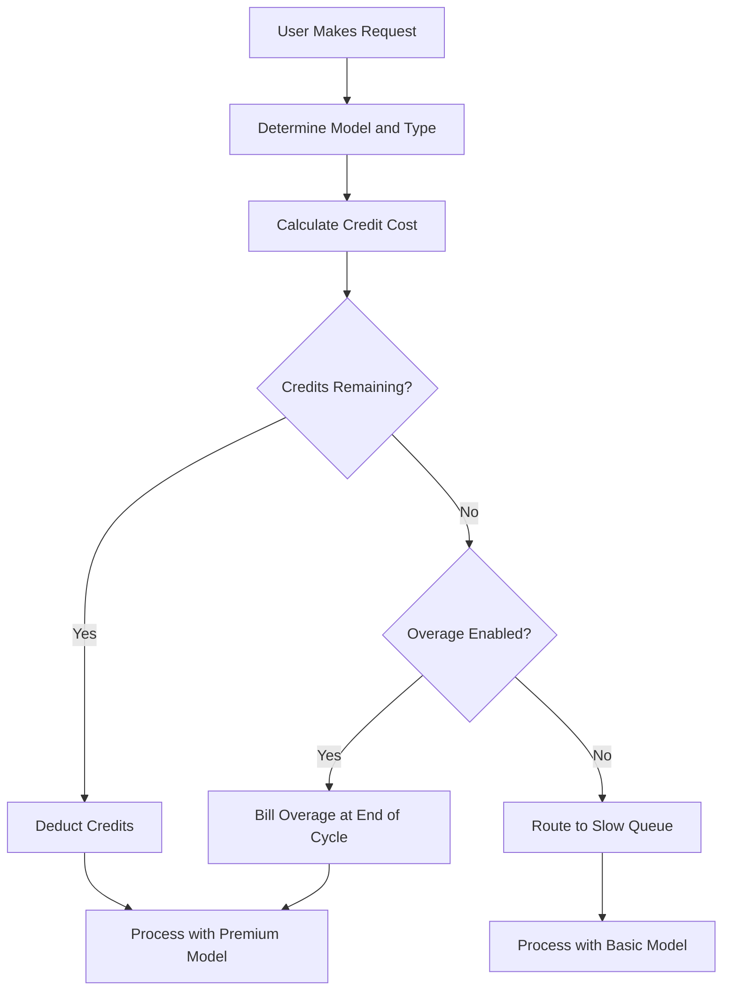

## Cursor 如何计费

Cursor 使用结合月度订阅和递减积分池的混合模型。该方法在管理不同 AI 模型的可变成本的同时，为用户提供可预测的价格。

**定价层级**：Cursor 提供从 Hobby 到 Ultra 的多个层级，在高级访问与标准访问之间平衡，以适应不同的工作流程。

| 计划 | 价格 | 高级请求 | 慢速请求 |
| :--- | :--- | :--- | :--- |
| Hobby | 免费 | 50/月 | 无限 |
| Pro | \$20/月 | 500/月 | 无限 |
| Pro+ | \$60/月 | 无限制的高级请求 | - |
| Ultra | \$200/月 | 无限制的高级请求 | - |

**模型加权消耗**：不同的请求会根据底层模型的成本消耗不同数量的积分。这样，Cursor 可以提供涵盖多个供应商的单一订阅，并确保昂贵的操作得到准确计费。

| 请求类型 | 模型 | 消耗积分 |
| :--- | :--- | :--- |
| Tab Completion | 默认 | 0 |
| Chat | GPT-4o Mini | 1 |
| Chat | Claude 3.5 Sonnet | 1 |
| Composer | GPT-4o | 5 |
| Agent | Claude 3.5 Sonnet | 10 |
| Agent | o1-preview | 25 |

**积分耗尽与超额计费**：当积分用完后，用户会转入使用更便宜模型的“慢速”队列，而不是被立即断开。或者，他们可以启用基于使用量的超额计费，以固定的每次请求成本继续维持高级访问。



4. **企业与商务**：团队使用共享的积分池，整个组织共享一个积分桶。这简化了管理，并确保高消耗用户不会触及个人限制，而其他人仍有剩余容量。

## 它的独特之处

Cursor 的模型通过解决传统 SaaS 计费模型难以应对的问题，在用户体验与基础设施成本之间取得平衡。
- **提供商抽象**：单一订阅包含多个大型语言模型提供商（如 OpenAI 和 Anthropic），在后台处理复杂的定价和 API 密钥。
- **加权消耗**：通过对强大模型收取更多费用，使成本与价值保持一致，让所有用户感受到公平透明的定价。
- **优雅降级**：“慢速”队列防止硬性断开，让用户仍能留在产品中，并在不惩罚的前提下鼓励他们升级。
- **共享积分**：团队级别的积分桶通过让整个组织高效共享资源，为企业客户减少摩擦。

## 使用 Dodo Payments 构建此方案

您可以使用 Dodo Payments 的积分授权和基于使用量的计费来完全复刻该模型。以下步骤将指导您完成实施。

<Steps>
  <Step title="Create a Custom Unit Credit Entitlement">
    首先，在 Dodo 仪表板中定义积分系统。此授权将代表用户订阅所获得的“高级请求”。

    *   **积分类型：** 自定义单位
    *   **单位名称：** “高级请求” 
    *   **精度：** 0（因为无法使用半个请求）
    *   **积分过期：** 30 天（确保每个计费周期积分重置）
    *   **结转：** 禁用（未使用的请求不会结转到下个月）
    *   **超额：** 启用
    *   **每单位价格：** \$0.04（初始配额耗尽后的每次请求成本）
    *   **超额行为：** 在结算时计入超额（将超额费用添加到下一张发票）

    该配置确保用户每月拥有固定的请求池，并在需要时可以支付额外费用获取更多请求。它是混合计费模型的基础。
  </Step>

  <Step title="Create Subscription Products">
    为每个层级创建独立产品。将相同的积分授权附加到每个产品，但设置不同的额度。这样，您可以通过单一积分系统管理所有层级，便于用户升级或降级。

    *   **Hobby：** \$0/月，50 积分/周期
    *   **Pro：** \$20/月，500 积分/周期
    *   **Pro+：** \$60/月，5000 积分/周期（对大多数用户相当于无限制）
    *   **Ultra：** \$200/月，50000 积分/周期（相当于无限制）

    当用户订阅其中某个产品时，Dodo 会自动向其账户分配相应数量的积分。此过程即时完成，提供无缝的入门体验。
  </Step>

  <Step title="Create a Usage Meter Linked to Credits">
    创建一个名为 `ai.request` 的计量器，针对 `credit_cost` 属性使用 **Sum** 聚合。通过启用“以积分计费”的切换，将此计量器链接到您的积分授权。将每个积分的计量单位设置为 1。

    为了处理模型加权消耗，您需要在应用层管理积分成本。当用户发起请求时，您的应用根据模型或操作类型确定所需消耗。

    ```typescript
    import DodoPayments from 'dodopayments';
    
    /**
     * Determines the credit cost for a given request type and model.
     * This logic lives in your application and can be updated without
     * changing your billing configuration.
     */
    function getCreditCost(requestType: string, model: string): number {
      const costs: Record<string, Record<string, number>> = {
        'tab_completion': { 'default': 0 },
        'chat': { 'gpt-4o-mini': 1, 'gpt-4o': 1, 'claude-sonnet': 1 },
        'composer': { 'gpt-4o-mini': 2, 'gpt-4o': 5, 'claude-sonnet': 5 },
        'agent': { 'gpt-4o': 10, 'claude-sonnet': 10, 'o1': 25 }
      };
      
      // Default to 1 credit if the combination isn't found
      return costs[requestType]?.[model] ?? 1;
    }
    
    /**
     * Ingests usage events into Dodo Payments.
     * For weighted requests, we send multiple events or use a sum aggregation.
     */
    async function trackRequest(customerId: string, requestType: string, model: string) {
      const creditCost = getCreditCost(requestType, model);
      
      // Tab completions are free, so we don't need to track them for billing
      if (creditCost === 0) return;
      
      const client = new DodoPayments({
        bearerToken: process.env.DODO_PAYMENTS_API_KEY,
      });
      
      await client.usageEvents.ingest({
        events: [{
          event_id: `req_${Date.now()}_${Math.random().toString(36).slice(2)}`,
          customer_id: customerId,
          event_name: 'ai.request',
          timestamp: new Date().toISOString(),
          metadata: {
            request_type: requestType,
            model: model,
            credit_cost: creditCost
          }
        }]
      });
    }
    ```

    <Tip>
      如果希望使用单一事件记录加权请求，请将计量器聚合设置为 **Sum**，并使用类似 `credit_cost` 的属性作为求和值。这在高并发摄取场景下通常更高效，并简化了应用逻辑。
    </Tip>
  </Step>

  <Step title="Handle Credit Exhaustion (Slow Queue)">
    监听来自 Dodo 的 `credit.balance_low` Webhook。当用户积分接近零时，您可以在应用中将其切换到慢速队列。这就是实现“优雅降级”逻辑的位置。

    ```typescript
    import DodoPayments from 'dodopayments';
    import express from 'express';
    
    const app = express();
    app.use(express.raw({ type: 'application/json' }));
    
    const client = new DodoPayments({
      bearerToken: process.env.DODO_PAYMENTS_API_KEY,
      webhookKey: process.env.DODO_PAYMENTS_WEBHOOK_KEY,
    });
    
    app.post('/webhooks/dodo', async (req, res) => {
      try {
        const event = client.webhooks.unwrap(req.body.toString(), {
          headers: {
            'webhook-id': req.headers['webhook-id'] as string,
            'webhook-signature': req.headers['webhook-signature'] as string,
            'webhook-timestamp': req.headers['webhook-timestamp'] as string,
          },
        });
        
        if (event.type === 'credit.balance_low') {
          const customerId = event.data.customer_id;
          await updateUserTier(customerId, 'slow');
          await notifyUser(customerId, 'You have used most of your premium requests. Switching to standard models.');
        }
        
        res.json({ received: true });
      } catch (error) {
        res.status(401).json({ error: 'Invalid signature' });
      }
    });
    
    /**
     * Routes a request based on the user's current tier.
     * This function is called before every AI request to determine the model and queue.
     */
    async function routeRequest(customerId: string, requestType: string) {
      const tier = await getUserTier(customerId);
      
      if (tier === 'slow') {
        // Route to a cheaper model and a lower priority queue
        // This saves costs while keeping the user active in the product
        return { model: 'gpt-4o-mini', queue: 'standard' };
      }
      
      // Premium routing for users with remaining credits
      // This provides the best possible performance and model quality
      return { model: 'claude-sonnet', queue: 'priority' };
    }
    ```

  </Step>

  <Step title="Create Checkout">
    最后，为用户生成结账会话以订阅计划。Dodo 会自动处理支付、税务合规以及积分分配。

    ```typescript
    import DodoPayments from 'dodopayments';
    
    const client = new DodoPayments({
      bearerToken: process.env.DODO_PAYMENTS_API_KEY,
    });
    
    /**
     * Creates a checkout session for a new subscription.
     * This is typically called when a user clicks an "Upgrade" button.
     */
    const session = await client.checkoutSessions.create({
      product_cart: [
        { product_id: 'prod_cursor_pro', quantity: 1 }
      ],
      customer: { email: 'developer@example.com' },
      return_url: 'https://yourapp.com/dashboard'
    });
    ```

  </Step>
</Steps>

## 使用 LLM 摄取蓝图加速

上述加权积分计费涵盖了核心变现。要进一步分析不同提供商实际的 token 消耗，[LLM 摄取蓝图](/developer-resources/ingestion-blueprints/llm) 可以与积分系统同时运行。

```bash
npm install @dodopayments/ingestion-blueprints
```

```typescript
import { createLLMTracker } from '@dodopayments/ingestion-blueprints';
import OpenAI from 'openai';
import Anthropic from '@anthropic-ai/sdk';

// Track raw token usage for analytics alongside credit-weighted billing
const openaiTracker = createLLMTracker({
  apiKey: process.env.DODO_PAYMENTS_API_KEY,
  environment: 'live_mode',
  eventName: 'analytics.openai_tokens',
});

const anthropicTracker = createLLMTracker({
  apiKey: process.env.DODO_PAYMENTS_API_KEY,
  environment: 'live_mode',
  eventName: 'analytics.anthropic_tokens',
});

const openai = new OpenAI({ apiKey: process.env.OPENAI_API_KEY });
const anthropic = new Anthropic({ apiKey: process.env.ANTHROPIC_API_KEY });

// Wrap each provider separately
const trackedOpenAI = openaiTracker.wrap({ client: openai, customerId: 'customer_123' });
const trackedAnthropic = anthropicTracker.wrap({ client: anthropic, customerId: 'customer_123' });

// Token tracking is automatic, credit deduction still uses your weighted system
const response = await trackedOpenAI.chat.completions.create({
  model: 'gpt-4o',
  messages: [{ role: 'user', content: 'Hello!' }],
});
```

这样您就拥有了两层数据：用于变现的加权积分计费以及用于成本分析和利润跟踪的原始 token 计数。

<Tip>
LLM 蓝图支持 OpenAI、Anthropic、Groq、Google Gemini 等。查看 [完整蓝图文档](/developer-resources/ingestion-blueprints/llm) 了解所有支持的提供商。
</Tip>

## 团队共享积分（企业版）

Cursor 的 Business 和 Enterprise 计划允许团队共享积分。您可以在 Dodo 中通过为整个组织创建一个订阅而非单个用户来实现这一点。这确保团队的使用汇总并作为一个实体进行管理，这是大型客户的主要需求之一。

### 实施策略

1.  **组织级客户：** 在 Dodo 中为整个组织创建一个 `customer_id`。该客户代表团队的计费实体，并持有共享积分池。所有发票和积分分配都与此 ID 相关联。
2.  **基于席位的计费：** 使用 Dodo 的附加组件收取每位用户的平台费用。当团队添加新成员时，更新“席位”附加组件的数量。这样您的收入会随着用户数量增长，同时保持积分池的独立。这是处理多维计费的清晰方式。
3.  **共享使用跟踪：** 所有团队成员的请求都使用组织的 `customer_id` 进行摄取。这确保任何成员的每次请求都会消耗同一个中央积分池。您仍可以通过在事件元数据中包含 `user_id` 来跟踪单个用户的使用情况，以用于内部报告和分析。

这种方法让您同时获得两方面优势：为平台提供可预测的单用户费用，并为昂贵的 AI 资源保留共享积分池。这也简化了团队成员的体验，因为他们不需要管理自己的个人限制。

## 与传统 SaaS 计费的对比

传统 SaaS 计费通常包含固定层级（例如每月 \$10 可获得 100 单位）。如果用户需要 101 单位，他们通常不得不升级到每月 \$50 的层级。这会造成“悬崖”效应，让用户感到沮丧并导致流失。它也无法考虑不同使用类型的可变成本，而这在 AI 领域至关重要。

由 Dodo 提供支持的 Cursor 模型更加灵活与公平：

*   **无“悬崖”效应：** 用户不需要因为达到限制而升级。他们可以为超额付费或接受较慢的性能。这样可以让他们留在产品中并降低摩擦，从而提升客户满意度并减少流失。
*   **成本匹配：** 您的收入与基础设施成本直接挂钩。如果用户使用昂贵模型，他们会支付更多（通过积分或超额）。这保护了您的利润，并让您能可持续地提供高成本功能，而不会危及商业模式。
*   **更佳留存：** 不断开用户后，即便他们达到限制也能继续使用产品。这让他们能继续工作，从而建立长期的忠诚度并提高客户生命周期价值。对用户和服务提供商来说都是双赢。

## 应对模型更新与演进

AI 计费面临的挑战之一是模型不断更新或被替代。新模型可能具有不同的成本结构或性能特征。借助 Dodo 的积分系统，您可以在应用层优雅地处理这些变化，而无需迁移计费数据。

如果您引入新模型，这类模型成本更高，只需更新 `getCreditCost` 函数以为其分配更高的成本。您无需更改计费配置或更新现有订阅。这种将计费逻辑与应用逻辑解耦的做法是一大优势，使您能够以 AI 速度迭代产品，而不会受制于计费系统。

## 用户通知与透明度

为了提供出色的用户体验，保持用户了解其积分使用情况非常重要。透明度建立信任，并帮助用户有效管理成本。您可以使用 Dodo 的 Webhook 在不同阈值（例如 50%、80%、100% 使用）触发通知。

这些通知可以通过邮件、应用内提醒或 Slack 消息发送。通过提供实时使用反馈，您鼓励用户在到达“慢速队列”之前管理消耗或升级计划。这种主动方式减少支持工单并提升整体用户体验，让您的产品更显专业、以用户为中心。

## 安全与防欺诈

在实施积分系统时，必须考虑安全与防欺诈。由于积分具有直接的货币价值，它们可能成为滥用目标。

*   **幂等性：** 在摄取使用事件时始终使用唯一的 `event_id`，以防重复计数。只要您提供唯一 ID，Dodo 的摄取 API 就会自动处理幂等性，确保网络重试不会重复计费。
*   **速率限制：** 在应用层实施速率限制，防止单个用户过快耗尽积分（或您的 API 预算）。这可以保护您的基础设施和用户钱包。
*   **监控：** 监控使用模式以发现可能表明账户共享或自动化滥用的异常。Dodo 的分析功能可以帮助您识别这些模式，从而在问题扩大之前采取行动。

## 积分系统最佳实践

在构建积分计费系统时，请牢记以下最佳实践：

1.  **保持简洁：** 不要让积分系统过于复杂。用户应该能轻松理解请求成本和剩余积分。
2.  **提供价值：** 确保积分为用户带来真实价值。若请求成本过高，用户会觉得自己被小气地收费。
3.  **保持透明：** 始终向用户展示当前积分余额和使用历史。这建立信任并减少困惑。
4.  **实现全面自动化：** 使用 Dodo 的 Webhook 和 API 自动化尽可能多的计费流程。这减少人工操作并确保计费始终准确。

## 使用的关键 Dodo 功能

<CardGroup cols={2}>
  <Card title="Credit-Based Billing" icon="coins" href="/features/credit-based-billing">
    管理递减积分池与超额。
  </Card>
  <Card title="Subscriptions" icon="calendar" href="/features/subscription">
    为不同层级设置集成积分的定期计费。
  </Card>
  <Card title="Usage-Based Billing" icon="chart-line" href="/features/usage-based-billing/introduction">
    追踪事件并实时根据消耗计费。
  </Card>
  <Card title="Event Ingestion" icon="bolt" href="/features/usage-based-billing/event-ingestion">
    低延迟地向 Dodo 发送高容量使用数据。
  </Card>
  <Card title="Webhooks" icon="webhook" href="/developer-resources/webhooks/intents/credit">
    对积分余额变化做出反应并自动化用户分层。
  </Card>
  <Card title="LLM Ingestion Blueprint" icon="brain-circuit" href="/developer-resources/ingestion-blueprints/llm">
    跨多个大型语言模型提供商实现自动 token 跟踪。
  </Card>
</CardGroup>
