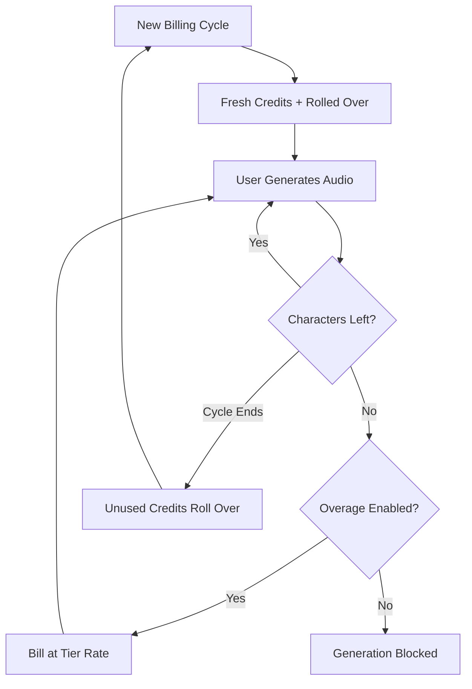

ElevenLabs 在 AI 语音领域建立了强势地位，其计费方式与语音合成一样灵活。其模型围绕一个单一的价值单位：字符。无论生成文本转语音、克隆声音或为视频配音，均从统一的字符额度池中扣减。

## ElevenLabs 的计费方式

ElevenLabs 的定价结构使用与订阅等级绑定的固定月度额度。随着用户升级到更高档位，他们会获得更多字符并可访问更高级功能，如专业语音克隆或商业使用权。

| 计划 | 价格 | 月度字符 | 超额费率 |
| :--- | :--- | :--- | :--- |
| 免费 | \$0 | 10,000 | 不可用 |
| 入门 | \$5/月 | 30,000 | ~\$0.30/1K 字符 |
| 创作者 | \$22/月 | 100,000 | ~\$0.24/1K 字符 |
| 专业 | \$99/月 | 500,000 | ~\$0.15/1K 字符 |
| 规模 | \$330/月 | 2,000,000 | ~\$0.10/1K 字符 |

1. **基于字符的定价**：字符是平台上的通用货币。文本转语音、视频配音与声音克隆均从同一余额扣减，简化了使用跟踪。
2. **结转机制**：未使用的字符会结转到下一个计费周期，而不是过期。ElevenLabs 设置上限以防止无限累积，确保用户能保留订阅价值。
3. **分层超额**：超额费用根据订阅等级处理。低等级默认禁用超额以保障安全，而高级等级则允许用户选择启用超额以保持服务连续性。

## 独特之处

一些战略性选择让 ElevenLabs 的计费模型在留住用户和促成升级方面尤其有效。

- **字符结转**：结转额度降低“用或失”焦虑，将未使用的投资带到下一个周期，即使在使用量较低期间也保持订阅价值。
- **分层超额定价**：随着方案规模增长，超额费率下降，为升级提供强烈激励。由于额外使用成本更低，用户通常认为更高档位更具吸引力。
- **统一消费**：所有服务共享单一字符池，免除了管理多个额度的认知负担。用户只需跟踪一个数字即可了解剩余容量。
- **超额选择**：专业用户可以启用超额以保证服务不中断，而普通用户则享有硬性上限带来的安全感。



## 使用 Dodo Payments 构建该模型

你可以使用 Dodo Payments 的基于额度的计费与使用度量来复制这一复杂模型。

<Steps>
<Step title="Create a Custom Unit Credit Entitlement">
首先定义“字符”这一单位，它将作为你平台的货币。

1. 转到 Dodo 控制台中的 **权益**。
2. 创建一个新的 **积分权益**。
3. 将 **积分类型** 设置为 **自定义单位**。
4. 将该单位命名为“字符”。
5. 将 **精度** 设置为 0，因为字符始终为整数单位。
6. 将 **积分过期** 设置为 30 天，以匹配每月计费周期。
7. 启用 **结转** 并设置如下：
    - **最大结转百分比**：100%（允许所有未使用字符结转）。
    - **结转时间范围**：1 个月。
    - **最大结转次数**：1（积分只能结转一次，随后过期）。
</Step>

<Step title="Create Tiered Subscription Products">
创建五个订阅产品。你会将相同的“字符”权益附加到每个产品，但针对每个等级进行不同配置。

| 产品 | 价格 | 每周期积分 | 是否启用超额 | 超额价格（每 1K 字符） |
| :--- | :--- | :--- | :--- | :--- |
| 免费 | \$0/月 | 10,000 | 否 | - |
| 入门 | \$5/月 | 30,000 | 是（需要选择） | \$0.30 |
| 创作者 | \$22/月 | 100,000 | 是 | \$0.24 |
| 专业 | \$99/月 | 500,000 | 是 | \$0.15 |
| 规模 | \$330/月 | 2,000,000 | 是 | \$0.10 |

当你将积分权益附加到每个产品时，取消勾选 **导入默认积分设置**。这样你才能为该等级设置特定的 **单价**。将 **超额行为** 设置为 **在计费时收取超额** 并配置 **低余额阈值** 为该等级额度的 10%。
</Step>

<Step title="Create a Usage Meter">
使用度量器将应用中的活动与积分系统连接起来。

1. 创建名为 `tts.characters` 的新度量器。
2. 将 **聚合** 设置为 **求和**。这会累加你发送的每个事件中的 `characters` 属性。
3. 将此度量器链接到你的“字符”积分权益。
4. 将 **每积分的度量单位** 设置为 1。确保应用中使用的一个字符等同于余额中扣减一个积分。
</Step>

<Step title="Send Usage Events">
将使用跟踪集成到你的应用代码中。每当用户生成音频时，向 Dodo 发送一个事件。

```typescript
import DodoPayments from 'dodopayments';

async function trackGeneration(
  customerId: string,
  text: string, 
  service: 'tts' | 'dubbing' | 'cloning'
) {
  const characterCount = text.length;

  const client = new DodoPayments({
    bearerToken: process.env.DODO_PAYMENTS_API_KEY,
  });

  await client.usageEvents.ingest({
    events: [{
      event_id: `gen_${Date.now()}_${Math.random().toString(36).slice(2)}`,
      customer_id: customerId,
      event_name: 'tts.characters',
      timestamp: new Date().toISOString(),
      metadata: {
        characters: characterCount,
        service: service,
        voice_id: 'voice_abc123'
      }
    }]
  });
}
```

</Step>

<Step title="Handle Low Balance and Overage">
使用 webhook 让用户了解他们的字符使用情况。

```typescript
import DodoPayments from 'dodopayments';
import express from 'express';

const app = express();
app.use(express.raw({ type: 'application/json' }));

const client = new DodoPayments({
  bearerToken: process.env.DODO_PAYMENTS_API_KEY,
  webhookKey: process.env.DODO_PAYMENTS_WEBHOOK_KEY,
});

app.post('/webhooks/dodo', async (req, res) => {
  try {
    const event = client.webhooks.unwrap(req.body.toString(), {
      headers: {
        'webhook-id': req.headers['webhook-id'] as string,
        'webhook-signature': req.headers['webhook-signature'] as string,
        'webhook-timestamp': req.headers['webhook-timestamp'] as string,
      },
    });

    switch (event.type) {
      case 'credit.balance_low':
        await notifyUser(event.data.customer_id, 
          'You are running low on characters. Consider upgrading your plan for more characters and lower overage rates.'
        );
        break;
      case 'credit.deducted':
        await logUsage(event.data);
        break;
      case 'credit.overage_charged':
        await notifyUser(event.data.customer_id,
          'You have exceeded your character quota. Overage charges will appear on your next invoice.'
        );
        break;
    }

    res.json({ received: true });
  } catch (error) {
    res.status(401).json({ error: 'Invalid signature' });
  }
});
```

</Step>

<Step title="Create Checkout">
当用户准备订阅时，为所选档位创建一个结账会话。

```typescript
const session = await client.checkoutSessions.create({
  product_cart: [
    { product_id: 'prod_elevenlabs_pro', quantity: 1 }
  ],
  customer: { email: 'creator@example.com' },
  return_url: 'https://yourapp.com/dashboard'
});
```

</Step>
</Steps>

## 使用流摄取蓝图加速

在跟踪音频输出与基于字符计费的同时，[流摄取蓝图](/developer-resources/ingestion-blueprints/stream) 提供了一种精简的方式来度量带宽消耗。

```bash
npm install @dodopayments/ingestion-blueprints
```

```typescript
import { Ingestion, trackStreamBytes } from '@dodopayments/ingestion-blueprints';

const ingestion = new Ingestion({
  apiKey: process.env.DODO_PAYMENTS_API_KEY,
  environment: 'live_mode',
  eventName: 'tts.audio_bytes',
});

// After generating audio, track the output size
const audioBuffer = await generateSpeech(text, voiceId);

await trackStreamBytes(ingestion, {
  customerId: customerId,
  bytes: audioBuffer.byteLength,
  metadata: {
    voice_id: voiceId,
    service: 'tts',
    format: 'mp3',
  },
});
```

使用流蓝图在你的基于字符的积分系统旁追踪音频带宽。这使你能够了解每次生成的实际基础设施成本。

<Tip>
流蓝图还支持高流量场景的批处理。请参阅 [完整蓝图文档](/developer-resources/ingestion-blueprints/stream) 以了解高级用法。 
</Tip>

## 升级激励：分层超额定价

ElevenLabs 模型最巧妙之处在于如何利用超额费率促成升级。通过让更高级的档位每字符成本更低，他们将对话从“我需要多少？”转变为“我能节省多少？”。

| 档位 | 包含字符 | 超额（每 1K） | 500K 字符时的有效成本 |
| :--- | :--- | :--- | :--- |
| 创作者 | 100,000 | \$0.24 | \$22 + (400 * \$0.24) = \$118 |
| 专业 | 500,000 | \$0.15 | \$99（无超额） |

在创作者计划下，常规使用 500,000 字符的用户每月需支付 \$118 的订阅加超额费用。升级到专业计划即可覆盖相同使用量，仅需 \$99，每月节省 \$19。更高档位更低的超额费率意味着随着使用量增长，升级成为显而易见的经济决策。

在 Dodo Payments 中，通过在将积分附加到订阅产品时取消勾选 **导入默认积分设置** 来实现。这让你可以完全掌控每个档位的 **单价**，从而用最优费率奖励付费最高的客户。

## 使用的关键 Dodo 功能

<CardGroup cols={2}>
  <Card title="Credit-Based Billing" icon="coins" href="/features/credit-based-billing">
    管理字符配额、结转与过期。
  </Card>
  <Card title="Subscriptions" icon="calendar" href="/features/subscription">
    设置提供月度字符额度的递归级别。
  </Card>
  <Card title="Usage-Based Billing" icon="chart-line" href="/features/usage-based-billing/introduction">
    跟踪各项服务的实时字符消耗。
  </Card>
  <Card title="Event Ingestion" icon="bolt" href="/features/usage-based-billing/event-ingestion">
    以极低延迟向 Dodo 发送高容量使用数据。
  </Card>
  <Card title="Webhooks" icon="webhook" href="/developer-resources/webhooks/intents/credit">
    实时响应低余额与超额事件。
  </Card>
  <Card title="Stream Ingestion Blueprint" icon="tower-broadcast" href="/developer-resources/ingestion-blueprints/stream">
    跟踪音频流带宽以支持基于使用的计费。
  </Card>
</CardGroup>
