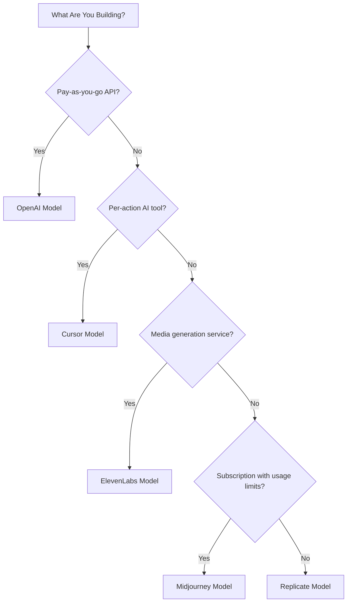

## 五种模型

| 应用 | 主要指标 | 独特创新 | Dodo 功能 |
| :--- | :--- | :--- | :--- |
| OpenAI | 代币（法币计价） | 预付法币积分且余额永不过期 | 基于积分的计费（法币积分） |
| Cursor | 高级请求 | 按模型权重扣减积分（不同模型成本不同） | 基于积分的计费（自定义单位） |
| ElevenLabs | 字符数 | 字符额度可结转 + 分层超额定价 | 基于积分的计费（结转 + 超额） |
| Midjourney | GPU 时间 | “放松模式”配额后提供无限后备 | 订阅 + 使用计量 |
| Replicate | 执行秒数 | 按秒、按硬件的纯计量 | 纯使用量计费 |

## 理解积分模式

| 模式 | 示例 | Dodo 功能 | 单位类型 |
| :--- | :--- | :--- | :--- |
| 预付法币积分 | OpenAI API（$5 积分充值，不可提现） | 基于积分的计费（法币积分） | 以美元计价的虚拟单位 |
| 虚拟使用积分 | Cursor 高级请求、ElevenLabs 字符 | 基于积分的计费（自定义单位） | 任意单位（请求、字符） |
| 纯消耗计量 | Replicate 按秒计费 | 基于使用量的计费（计量表） | 直接测量（秒、字节） |
| 订阅 + 计量超额 | Midjourney Fast Hours 配合 Relax 后备 | 订阅 + 使用计量 | 基于时间且设有免费门槛 |

<Info>
Dodo 的基于积分计费中的法币积分代表平台计价的美元数值，在您的生态系统外没有货币价值。客户无法将其提现为现金。
</Info>

## 你应该使用哪种模型？

- 构建按用量付费的 API 平台：OpenAI 模型（法币积分）
- 构建按操作计费的 AI 工具：Cursor 模型（自定义单位积分）
- 构建媒体生成服务：ElevenLabs 模型（结转积分）
- 构建带使用限额的订阅服务：Midjourney 模型（订阅 + 使用计量）
- 构建基础设施/计算平台：Replicate 模型（纯计量）

<CardGroup cols={2}>
  <Card title="OpenAI" icon="/images/logos/openai.svg" href="/developer-resources/billing-deconstructions/openai">
    复制基于代币的预付积分模型。
  </Card>
  <Card title="Cursor" icon="/images/logos/cursor.svg" href="/developer-resources/billing-deconstructions/cursor">
    构建按模型权重的使用限制。
  </Card>
  <Card title="ElevenLabs" icon="/images/logos/elevenlabs.svg" href="/developer-resources/billing-deconstructions/elevenlabs">
    实施具有结转与超额费用的字符额度。
  </Card>
  <Card title="Midjourney" icon="/images/logos/midjourney.svg" href="/developer-resources/billing-deconstructions/midjourney">
    将订阅与基于使用的后备结合。
  </Card>
  <Card title="Replicate" icon="/images/logos/replicate.svg" href="/developer-resources/billing-deconstructions/replicate">
    设置纯按秒消耗的计量。
  </Card>
</CardGroup>

## Dodo 功能

<CardGroup cols={2}>
  <Card title="Credit-Based Billing" href="/features/credit-based-billing">
    管理预付积分和虚拟单位。
  </Card>
  <Card title="Usage-Based Billing" href="/features/usage-based-billing/introduction">
    实时计量消耗。
  </Card>
  <Card title="Subscriptions" href="/features/subscription">
    处理周期性计费和方案管理。
  </Card>
  <Card title="Hybrid Billing" href="/features/hybrid-billing">
    结合多种计费模型以实现最高灵活性。
  </Card>
</CardGroup>

## Ingestion Blueprints

每个解构内容都包含与 Dodo 的 [Ingestion Blueprints](/features/usage-based-billing/ingestion-blueprints) 的整合，该预构建 SDK 可以自动处理事件跟踪。无需手动构建使用事件，使用蓝图即可在几分钟内获得可投入生产的计量。

<CardGroup cols={3}>
  <Card title="LLM Blueprint" icon="brain-circuit" href="/developer-resources/ingestion-blueprints/llm">
    可为 OpenAI、Anthropic、Groq 等提供自动的代币跟踪。
  </Card>
  <Card title="Stream Blueprint" icon="tower-broadcast" href="/developer-resources/ingestion-blueprints/stream">
    跟踪音视频流的带宽。
  </Card>
  <Card title="Time Range Blueprint" icon="clock" href="/developer-resources/ingestion-blueprints/time-range">
    按计算时长（精确到毫秒）计费。
  </Card>
</CardGroup>
