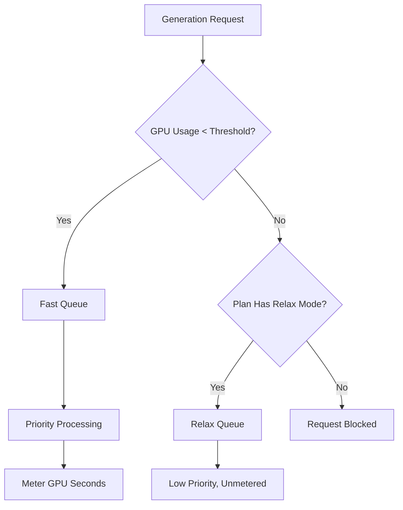

Midjourney 是一个生成式 AI 平台，采用基于 GPU 时间而非简单按图像数量的独特计费模型。这种方式确保复杂、高分辨率的渲染比快速、低分辨率的草图收费更高。

## Midjourney 如何收费

Midjourney 的订阅计划每月授予用户一定数量的“快速 GPU 小时”。这些小时代表您生成所消耗的实际计算时间。

| Plan | Price | Fast GPU Hours | Relax Mode | Stealth Mode |
| :--- | :--- | :--- | :--- | :--- |
| Basic | \$10/month | ~3.3 hrs | No | No |
| Standard | \$30/month | 15 hrs | Unlimited | No |
| Pro | \$60/month | 30 hrs | Unlimited | Yes |
| Mega | \$120/month | 60 hrs | Unlimited | Yes |

1. **价格层级**：Midjourney 提供四个订阅等级，价格从 \$10 到 \$120 每月不等，每个等级提供一定数量的快速 GPU 小时。
2. **Relax 模式**：Standard 及以上计划在快速小时耗尽后通过低优先级队列提供无限生成，确保用户不会遇到硬性使用上限。
3. **额外 GPU 小时**：如果在月度配额用尽后需要即时结果，用户可以以约 \$4/小时的价格购买额外的快速 GPU 时间。
4. **以 GPU 秒计量**：使用情况按生成所花费的实际计算时间追踪，因此复杂渲染的费用高于简单草图。
5. **社区循环**：活跃用户可以通过对画廊中的图像评分赚取额外 GPU 小时，这有助于训练模型并奖励社区。
## 它的独特之处

Midjourney 模型之所以有效，是因为它将成本与价值和资源使用率对齐。

* **GPU 时间计费** 将成本与资源使用对齐，确保复杂渲染相比简单草图收费更加公平。
* **Relax 模式** 提供了一个无限制的后备选项，即使在达到每月上限后也能保持服务访问，从而降低流失率。
* **快速与 Relax 区分** 通过为看重速度和即时结果的用户提供优先处理来激励升级。
* **额外 GPU 小时** 为需要在月中获得额外高优先级容量的重度用户提供灵活的加值选项。

## 使用 Dodo Payments 构建此模型

通过将订阅与使用计量器和应用层逻辑结合，您可以使用 Dodo Payments 复制此模型。

<Steps>

<Step title="Create a Usage Meter">

首先，创建一个计量器来跟踪每位客户使用的 GPU 秒数。

* **计量器名称**：`gpu.fast_seconds`
* **聚合方式**：**求和**（汇总每个事件中的 `gpu_seconds` 属性）

您只需要追踪生成模式为“fast”的事件。Relax 模式的生成不用于计费。

</Step>

<Step title="Create Subscription Products with Usage Pricing">

创建订阅产品并将计量器绑定到具有免费阈值的产品中。

| Product | Base Price | Free Threshold (seconds) | Overage Rate |
| :--- | :--- | :--- | :--- |
| Basic | \$10/month | 12,000 (3.3 hrs) | N/A (Hard Cap) |
| Standard | \$30/month | 54,000 (15 hrs) | \$0.00 (Relax Mode) |
| Pro | \$60/month | 108,000 (30 hrs) | \$0.00 (Relax Mode) |
| Mega | \$120/month | 216,000 (60 hrs) | \$0.00 (Relax Mode) |

对 Basic 计划禁用超额计费以强制执行硬性上限。对于其他计划，当计量器显示超出阈值时，Relax 模式由应用逻辑处理。

</Step>

<Step title="Implement Application-Level Relax Mode">

核心洞察在于 Relax 模式不是一个计费功能。当 Dodo 使用计量器显示阈值达到时，您的应用会将请求路由到较慢的队列。

```typescript
async function handleGenerationRequest(customerId: string, prompt: string) {
  const usage = await getCustomerUsage(customerId, 'gpu.fast_seconds');
  const subscription = await getSubscription(customerId);
  const threshold = getThresholdForPlan(subscription.product_id);
  
  if (usage.current >= threshold) {
    if (subscription.product_id === 'prod_basic') {
      throw new Error('Fast GPU hours exhausted. Upgrade to Standard for Relax Mode.');
    }
    
    // Relax Mode. Route to low-priority queue
    return await queueGeneration(customerId, prompt, {
      priority: 'low',
      mode: 'relax',
      model: 'standard'
    });
  }
  
  // Fast Mode. Priority processing
  return await queueGeneration(customerId, prompt, {
    priority: 'high',
    mode: 'fast',
    model: 'premium'
  });
}
```

</Step>

<Step title="Send Usage Events (Fast Mode Only)">

只有在执行 Fast 模式生成时才向 Dodo 发送使用事件。

```typescript
import DodoPayments from 'dodopayments';

async function trackFastGeneration(customerId: string, gpuSeconds: number, jobId: string) {
  // Only track Fast mode generations. Relax mode is free and unlimited
  const client = new DodoPayments({
    bearerToken: process.env.DODO_PAYMENTS_API_KEY,
  });

  await client.usageEvents.ingest({
    events: [{
      event_id: `gen_${jobId}`,
      customer_id: customerId,
      event_name: 'gpu.fast_seconds',
      timestamp: new Date().toISOString(),
      metadata: {
        gpu_seconds: gpuSeconds,
        resolution: '1024x1024',
        mode: 'fast'
      }
    }]
  });
}
```

</Step>

<Step title="Sell Extra Fast Hours (One-Time Top-Up)">

为“额外快速 GPU 小时”创建一次性支付产品，价格为 \$4。当客户购买时，您可以在应用中授予额外阈值或积分。

```typescript
// After customer purchases extra hours
const session = await client.checkoutSessions.create({
  product_cart: [
    { product_id: 'prod_extra_gpu_hour', quantity: 5 }
  ],
  customer: { customer_id: customerId },
  return_url: 'https://yourapp.com/dashboard'
});
```

</Step>

<Step title="Create Checkout for Subscription">

最后，为订阅计划创建一个结账会话。

```typescript
const session = await client.checkoutSessions.create({
  product_cart: [
    { product_id: 'prod_mj_standard', quantity: 1 }
  ],
  customer: { email: 'artist@example.com' },
  return_url: 'https://yourapp.com/studio'
});
```

</Step>

</Steps>

## 借助时间范围摄取蓝图加速

[时间范围摄取蓝图](/developer-resources/ingestion-blueprints/time-range) 通过为基于时长的计费提供专用助手来简化 GPU 时间追踪。

```bash
npm install @dodopayments/ingestion-blueprints
```

```typescript
import { Ingestion, trackTimeRange } from '@dodopayments/ingestion-blueprints';

const ingestion = new Ingestion({
  apiKey: process.env.DODO_PAYMENTS_API_KEY,
  environment: 'live_mode',
  eventName: 'gpu.fast_seconds',
});

// Track generation time after a Fast mode job completes
const startTime = Date.now();
const result = await runGeneration(prompt, settings);
const durationMs = Date.now() - startTime;

await trackTimeRange(ingestion, {
  customerId: customerId,
  durationMs: durationMs,
  metadata: {
    mode: 'fast',
    resolution: '1024x1024',
  },
});
```

该蓝图处理时长转换和事件格式化。您只需提供客户 ID 和所用时间。

<Tip>
时间范围蓝图支持毫秒、秒和分钟。有关所有时长选项和最佳实践，请参见[完整蓝图文档](/developer-resources/ingestion-blueprints/time-range)。
</Tip>

## 快速与 Relax 架构

该双队列系统通过基于当前使用状态的请求路由来运作。



1. 所有请求都通过您的应用。
2. 应用将 Dodo 使用计量器与计划的免费阈值进行比较。
3. 如果使用量低于阈值，请求进入快速队列并进行计量。
4. 如果使用量超过阈值，请求进入 Relax 队列，该队列不计量且优先级较低。
5. Basic 计划没有 Relax 后备，因此一旦达到限制，请求将被阻止。

<Info>
Relax 模式是一种应用级模式，而非 Dodo 的计费功能。Dodo 跟踪您的快速 GPU 使用情况并在阈值超出时告知您。您的应用决定是阻止用户还是将其路由到较慢队列。
</Info>

## 使用到的关键 Dodo 功能

<CardGroup cols={2}>
  <Card title="Subscriptions" icon="calendar" href="/features/subscription">
    管理循环计费和计划层级。
  </Card>
  <Card title="Usage-Based Billing" icon="bolt" href="/features/usage-based-billing/introduction">
    根据实际资源消耗跟踪并计费。
  </Card>
  <Card title="Event Ingestion" icon="input-pipe" href="/features/usage-based-billing/event-ingestion">
    向 Dodo API 发送大批量使用事件。
  </Card>
  <Card title="Meters" icon="gauge" href="/features/usage-based-billing/meters">
    定义使用事件的聚合和计费方式。
  </Card>
  <Card title="One-Time Payments" icon="credit-card" href="/features/one-time-payment-products">
    将额外小时或加值包作为一次性购买销售。
  </Card>
  <Card title="Time Range Blueprint" icon="clock" href="/developer-resources/ingestion-blueprints/time-range">
    使用基于时长的助手简化 GPU 时间追踪。
  </Card>
</CardGroup>
