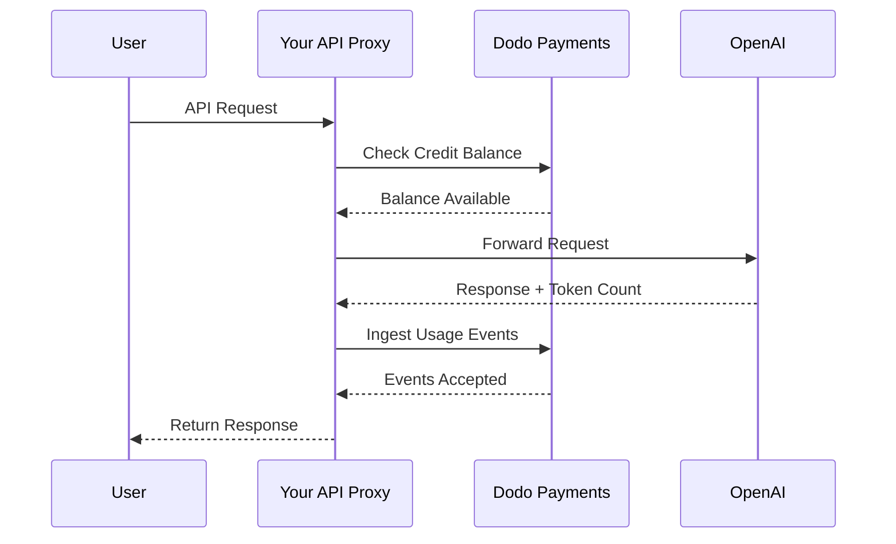
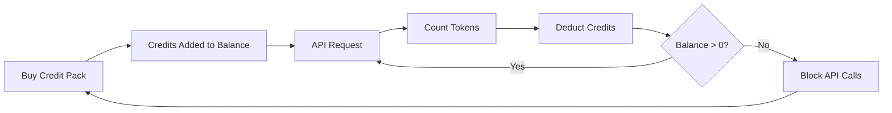

OpenAI 的计费模式是 AI 公司的黄金标准。它将 API 使用的预付法币积分与面向消费产品的统一费率订阅相结合。这种混合方式在确保可预测收入的同时，也让开发者能够无摩擦地扩展他们的使用量。

## 为什么 OpenAI 的模式是行业标准

AI 行业面临着许多传统 SaaS 计费无法完全应对的独特挑战。OpenAI 的计费模式同时解决了其中的几个问题。

1. **可预测的收入与低风险**：通过要求 API 使用者预付积分，OpenAI 消除了用户积累无法支付的巨额账单的风险。你能提前收款，用户则在使用服务时消耗积分。
2. **对开发者的可扩展性**：5 美元的充值门槛很低。随着应用增长，开发者可以自动充值或购买更大的礼包。启动的摩擦几乎为零，但增长的上限是无限的。
3. **用户心理学**：将积分以法币（美元）计价而不是抽象的“令牌”或“点数”，让价值更加清晰。这就像为 AI 服务设置的银行账户，有助于建立信任并让公司更容易预算。

## OpenAI 如何计费

OpenAI 采用两种不同的计费模式，以满足不同用户的需求。

1. **API（按使用计费）**：API 使用预付法币计价的积分。用户可以为账户充值 5 美元、10 美元、50 美元或更多。虽然积分显示为美元金额，但在 OpenAI 之外没有货币价值。OpenAI 按令牌计费，输入和输出令牌采用不同费率。积分永不过期，当用户余额降至 0 美元时，他们的 API 调用会立即失败。
2. **ChatGPT Plus、Team 与 Enterprise**：这些是统一费率订阅。ChatGPT Plus 每月 20 美元，Team 计划为每位用户每月 25 美元。这些计划有软使用上限，用户会降级为较小模型，而不是完全被阻止。
3. **基于消费的费率层级**：随着你累计消费更多金额，会解锁更高的 API 限率。这是一种基于信任的访问扩展系统，直接与账单历史挂钩。

| 模型 | 价格 | 输入令牌 | 输出令牌 |
| :--- | :--- | :--- | :--- |
| GPT-4o | 按使用计费 | \$2.50 / 1M | \$10.00 / 1M |
| GPT-4o-mini | 按使用计费 | \$0.15 / 1M | \$0.60 / 1M |
| o1 | 按使用计费 | \$15.00 / 1M | \$60.00 / 1M |

| 套餐 | 价格 | 类型 |
| :--- | :--- | :--- |
| 免费 | \$0 | 限制访问 |
| Plus | \$20 / 月 | 具有软上限的订阅 |
| Team | \$25 / 用户 / 月 | 按席位订阅 |
| Enterprise | 定制 | 开具发票的计费 |
## 使其与众不同的地方

OpenAI 的计费策略具备多个关键特性，使其在 AI 服务领域极其有效。

- **法币计价积分**：积分以美元计价，因此感觉就像是钱，让定价对开发者而言透明且易于理解。
- **永不过期**：永不过期的余额减少了“用或失去”的压力。用户更愿意充值更多金额，因为他们知道价值不会消失。
- **多维度计量**：输入和输出令牌分别跟踪，但从同一积分余额中扣除。这让 OpenAI 可以将昂贵的输出令牌与较便宜的输入令牌设定不同价格。
- **信任层级**：将速率限制与累计消费挂钩，鼓励用户留在平台，并用更好的性能奖励长期客户。
## 战略优势

该模型创造了强大的正反馈循环。低门槛吸引开发者。预付积分带来即时现金流。按使用量计费确保开发者成功即 OpenAI 成功。订阅部分为非开发者提供稳定、可预测的收入基线。

## 使用 Dodo Payments 构建

你可以使用 Dodo Payments 复刻 OpenAI 的计费模式。我们将使用基于积分的计费来处理 API，使用标准订阅来覆盖 ChatGPT Plus 端。

<Steps>
  <Step title="Create a Fiat Credit Entitlement">
    从 Dodo Payments 仪表板开始创建一个积分授权。这将作为用户的核心余额。


    * **积分类型：** 法币积分（USD）
    * **积分到期：** 永不过期
    * **结转：** 不需要（因为它们永不过期）
    * **超额消费：** 已禁用

    禁用超额消费可确保余额为 0 时 API 调用会失败，正如 OpenAI 所做的那样。
  </Step>

  <Step title="Create Top-Up Products">
    为不同的积分包创建一次性付款产品。你可以提供 5 美元、10 美元、50 美元和 100 美元选项。将你的法币积分授权附加到每个产品。


    将每个产品发放的积分以美分为单位设置。例如 50 美元礼包会发放 5000 积分。


    ```typescript
    import DodoPayments from 'dodopayments';

    const client = new DodoPayments({
      bearerToken: process.env.DODO_PAYMENTS_API_KEY,
    });

    const session = await client.checkoutSessions.create({
      product_cart: [
        { product_id: 'prod_credit_pack_50', quantity: 1 }
      ],
      customer: { email: 'developer@example.com' },
      return_url: 'https://yourapp.com/dashboard'
    });
    ```

  </Step>

  <Step title="Create Usage Meters">
    创建两个独立的计量器来跟踪令牌使用量。


    * `llm.input_tokens`：在 `tokens` 属性上使用求和聚合。
    * `llm.output_tokens`：在 `tokens` 属性上使用求和聚合。


    将两个计量器都链接到你的法币积分授权。你需要为每个计量器配置“每积分计量单位”。


    ### 计算每积分计量单位

    为了匹配 OpenAI 的 GPT-4o 定价（每 1M 输入令牌 2.50 美元），你需要计算 1 美元（100 美分）等于多少令牌。


    * **输入令牌：** 1,000,000 令牌 / \$2.50 = 每 \$1 400,000 令牌。
    * **输出令牌：** 1,000,000 令牌 / \$10.00 = 每 \$1 100,000 令牌。


    在 Dodo 仪表板中，你会将输入的“每积分计量单位”设置为 400,000，输出设置为 100,000。
  </Step>

  <Step title="Send Usage Events">
    在每次 LLM 请求之后，将使用数据发送到 Dodo Payments。你可以在一次请求中同时发送输入和输出事件。


    ```typescript
    await client.usageEvents.ingest({
      events: [{
        event_id: `req_${requestId}`,
        customer_id: customerId,
        event_name: 'llm.input_tokens',
        timestamp: new Date().toISOString(),
        metadata: {
          model: 'gpt-4o',
          tokens: 1500
        }
      }, {
        event_id: `req_${requestId}_out`,
        customer_id: customerId,
        event_name: 'llm.output_tokens',
        timestamp: new Date().toISOString(),
        metadata: {
          model: 'gpt-4o',
          tokens: 800
        }
      }]
    });
    ```

  </Step>

  <Step title="Handle Balance Depletion">
    在处理 API 请求之前应检查用户余额。如果余额为零或负数，则返回 402 错误。


    ```typescript
    async function checkCreditsBeforeRequest(customerId: string) {
      const balance = await client.creditEntitlements.balances.retrieve(customerId, {
        credit_entitlement_id: 'credit_entitlement_id',
      });

      if (balance.available <= 0) {
        throw new Error('Insufficient credits. Please top up your account.');
      }
    }
    ```

    ### 处理低余额 Webhook

    不要等到用户余额为 0 时才通知他们。使用 Webhook 在余额降到某个阈值时触发电子邮件或应用内通知。


    ```typescript
    import DodoPayments from 'dodopayments';
    import express from 'express';

    const app = express();
    app.use(express.raw({ type: 'application/json' }));

    const client = new DodoPayments({
      bearerToken: process.env.DODO_PAYMENTS_API_KEY,
      webhookKey: process.env.DODO_PAYMENTS_WEBHOOK_KEY,
    });

    app.post('/webhooks/dodo', async (req, res) => {
      try {
        const event = client.webhooks.unwrap(req.body.toString(), {
          headers: {
            'webhook-id': req.headers['webhook-id'] as string,
            'webhook-signature': req.headers['webhook-signature'] as string,
            'webhook-timestamp': req.headers['webhook-timestamp'] as string,
          },
        });

        if (event.type === 'credit.balance_low') {
          const { customer_id, available_balance } = event.data;
          await sendLowBalanceEmail(customer_id, available_balance);
        }

        res.json({ received: true });
      } catch (error) {
        res.status(401).json({ error: 'Invalid signature' });
      }
    });
    ```

    <Tip>
      当用户余额接近耗尽时，OpenAI 会发送这些邮件，给他们时间在不中断服务的情况下充值。
    </Tip>
  </Step>

  <Step title="Build the ChatGPT Subscription Side (Optional)">
    如果你想提供类似 ChatGPT Plus 的订阅计划，请在 Dodo Payments 中创建一个单独的订阅产品。这些产品不需要积分授权。


    对于 Team 计划，通过添加附加组件来实现基于席位的计费，以覆盖每个额外用户。


    ```typescript
    const session = await client.checkoutSessions.create({
      product_cart: [
        { product_id: 'prod_plus_subscription', quantity: 1 }
      ],
      customer: { email: 'user@example.com' },
      return_url: 'https://yourapp.com/billing'
    });
    ```

    ### 实施软上限

    要复制 OpenAI 的软上限，可以针对订阅用户使用相同的计量器跟踪使用情况，但不将其链接到积分授权。在你的应用逻辑中，检查当前计费周期的使用量。


    ```typescript
    async function checkSubscriptionUsage(customerId: string) {
      const usage = await getUsageForCurrentPeriod(customerId);
      
      if (usage > SOFT_CAP_THRESHOLD) {
        // Route to a smaller model instead of blocking
        return 'gpt-4o-mini';
      }
      
      return 'gpt-4o';
    }
    ```

  </Step>
</Steps>

## 使用 LLM 摄取蓝图加速

上面的步骤展示了如何手动构建和发送使用事件。对于生产部署，[LLM 摄取蓝图](/developer-resources/ingestion-blueprints/llm) 提供自动令牌跟踪功能，可直接包装你的 OpenAI 客户端。

```bash
npm install @dodopayments/ingestion-blueprints
```

```typescript
import { createLLMTracker } from '@dodopayments/ingestion-blueprints';
import OpenAI from 'openai';

const openai = new OpenAI({ apiKey: process.env.OPENAI_API_KEY });

const tracker = createLLMTracker({
  apiKey: process.env.DODO_PAYMENTS_API_KEY,
  environment: 'live_mode',
  eventName: 'llm.chat_completion',
});

const trackedClient = tracker.wrap({
  client: openai,
  customerId: customerId,
});

// Every API call now automatically tracks token usage
const response = await trackedClient.chat.completions.create({
  model: 'gpt-4o',
  messages: [{ role: 'user', content: prompt }],
});

// inputTokens, outputTokens, and totalTokens are sent automatically
console.log('Tokens used:', response.usage);
```

该蓝图从每次 API 响应中捕获 `inputTokens`、`outputTokens` 和 `totalTokens`，并将它们作为事件元数据发送。请配置你的计量器以在相应的令牌属性上进行聚合。

<Tip>
LLM 蓝图支持 OpenAI、Anthropic、Groq、Google Gemini、OpenRouter 和 Vercel AI SDK。有关供应商特定示例和高级配置，请参阅[完整蓝图文档](/developer-resources/ingestion-blueprints/llm)。
</Tip>

## 实施基于消费的费率层级

OpenAI 的费率层级是管理容量的强大方式。你可以通过跟踪客户的累计消费来实现这一点。

1. **跟踪累计消费：** 监听 `payment.succeeded` Webhook，并在数据库中更新该客户的 `total_spend` 字段。
2. **定义层级：** 创建消费金额与速率限制的映射。
   * 第 1 层：\$0 - \$50 消费 -> 每分钟 3 次
   * 第 2 层：\$50 - \$250 消费 -> 每分钟 10 次
   * 第 3 层：\$250 以上消费 -> 每分钟 50 次
3. **执行限制：** 在你的 API 中间件中检查客户的层级，并施加相应的速率限制。

```typescript
async function getRateLimitForCustomer(customerId: string) {
  const customer = await db.customers.findUnique({ where: { id: customerId } });
  const totalSpend = customer.total_spend;

  if (totalSpend >= 25000) return TIER_3_LIMITS; // $250.00
  if (totalSpend >= 5000) return TIER_2_LIMITS;  // $50.00
  return TIER_1_LIMITS;
}
```

## 完整实现示例：API 代理

在真实场景中，你很可能会有一个位于用户与 LLM 提供方之间的 API 代理。该代理负责认证、积分检查和使用上报。



```typescript
import DodoPayments from 'dodopayments';
import OpenAI from 'openai';

const client = new DodoPayments({
  bearerToken: process.env.DODO_PAYMENTS_API_KEY,
});
const openai = new OpenAI({ apiKey: process.env.OPENAI_API_KEY });

export async function handleApiRequest(req, res) {
  const { customerId, prompt, model } = req.body;

  try {
    // 1. Check credit balance
    const balance = await client.creditEntitlements.balances.retrieve(customerId, {
      credit_entitlement_id: 'credit_entitlement_id',
    });

    if (balance.available <= 0) {
      return res.status(402).json({ error: 'Insufficient credits. Please top up.' });
    }

    // 2. Call OpenAI
    const completion = await openai.chat.completions.create({
      model: model,
      messages: [{ role: 'user', content: prompt }],
    });

    const { prompt_tokens, completion_tokens } = completion.usage;

    // 3. Ingest usage events to Dodo
    await client.usageEvents.ingest({
      events: [
        {
          event_id: `req_${completion.id}_in`,
          customer_id: customerId,
          event_name: 'llm.input_tokens',
          timestamp: new Date().toISOString(),
          metadata: { model, tokens: prompt_tokens }
        },
        {
          event_id: `req_${completion.id}_out`,
          customer_id: customerId,
          event_name: 'llm.output_tokens',
          timestamp: new Date().toISOString(),
          metadata: { model, tokens: completion_tokens }
        }
      ]
    });

    // 4. Return response to user
    res.json(completion);

  } catch (error) {
    console.error('API Error:', error);
    res.status(500).json({ error: 'Internal server error' });
  }
}
```

## 处理边缘情况

构建像 OpenAI 这样复杂的计费系统时，你会遇到需要细致处理的多个边缘情况。

### 竞态条件

如果用户余额非常低并同时发送多个请求，他们可能会在第一条事件处理完成前就超过积分限制。为防止这种情况，你可以实现一个小“缓冲”区，或在请求期间对客户的余额使用分布式锁。

### 事件摄取延迟

Dodo Payments 异步处理事件。这意味着 API 调用与积分扣除之间可能会有轻微延迟。对于大多数使用场景这是可以接受的。如果你需要严格的实时执行，可以维护一个用户余额的本地缓存，并乐观更新它。

### 退款处理

如果你为积分包购买退款，Dodo Payments 会在配置好后自动处理积分授权。然而，你应确保应用逻辑立即反映此更改，以防止用户使用他们已不再拥有的积分。

### 多模型支持

如果你支持多个定价不同的模型，有两个选择：
1. **分离计量器：** 为每个模型创建独立的计量器（例如 `gpt-4o.input_tokens`、`gpt-4o-mini.input_tokens`）。
2. **权重事件：** 使用单个计量器，但在发送到 Dodo 之前将 `tokens` 值乘以一个权重。例如，如果 GPT-4o 的价格是 GPT-4o-mini 的 10 倍，你可以为 GPT-4o 请求发送 10 倍的令牌数。

OpenAI 在内部使用分离计量器的方法，以保持每个模型使用记录的清晰。

## 架构概览



这些计量器会根据你配置的费率跟踪令牌，并从用户的积分余额中扣除相应的价值。

## 结论

使用 Dodo Payments 复刻 OpenAI 的计费模式，可以同时获得按使用量计费的灵活性与预付积分的可预测性。按照本指南操作，你可以构建一个随着用户增长而扩展、同时保护利润的计费系统。

无论你是在构建下一个大型 LLM 还是一个小众 AI 工具，这些模式都将帮助你打造一个专业且对开发者友好的体验。这样的方式确保你的计费基础设施与交付给客户的 AI 模型一样，可扩展且可靠。

## 使用的关键 Dodo 功能

探索使该实现成为可能的功能。

<CardGroup cols={2}>
  <Card title="Credit-Based Billing" icon="coins" href="/features/credit-based-billing">
    管理预付法币积分和用户授权。
  </Card>
  <Card title="Usage-Based Billing" icon="chart-line" href="/features/usage-based-billing/introduction">
    跟踪细粒度的使用量（如令牌）并实时计费。
  </Card>
  <Card title="One-Time Payments" icon="credit-card" href="/features/one-time-payment-products">
    通过简单的结账流程售卖积分包和充值。
  </Card>
  <Card title="Event Ingestion" icon="bolt" href="/features/usage-based-billing/event-ingestion">
    轻松向 Dodo Payments 发送高流量使用数据。
  </Card>
  <Card title="Webhooks" icon="webhook" href="/developer-resources/webhooks/intents/credit">
    随时了解积分余额变化和低余额警报。
  </Card>
  <Card title="LLM Ingestion Blueprint" icon="brain-circuit" href="/developer-resources/ingestion-blueprints/llm">
    为 OpenAI 和其他 LLM 提供商提供自动令牌跟踪。
  </Card>
</CardGroup>
