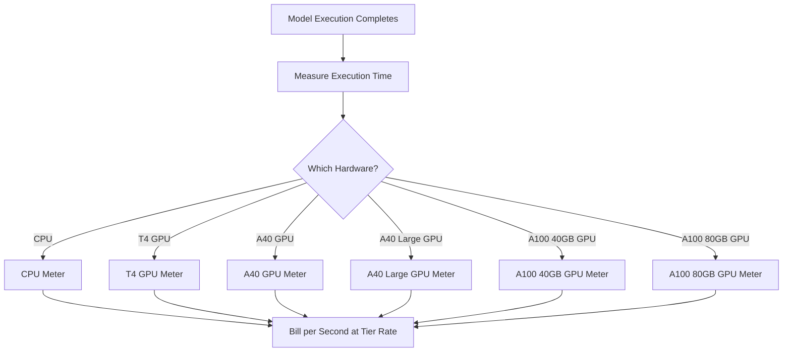

Replicate 是一个在云端运行开源机器学习模型的平台。他们的计费模型是 AI 行业中最纯粹的用量计费示例之一。没有月度订阅费，也没有按模型运行次数收取的统一费率。相反，他们根据实际消耗的计算时间按秒计费，并且根据底层硬件不同而有不同的费率。

这种方式非常适合 AI 工作负载，因为执行时间难以预测。单个用户可能只运行几秒钟的轻量模型，也可能运行几个分钟的大型生成模型。通过将费用与计算资源绑定而不是模型本身，Replicate 保持了定价的透明度和可扩展性。

## Replicate 的计费方式

Replicate 的定价与运行的具体模型无关。无论你是在用 SDXL 生成图像，还是运行 Llama 3，计费都由硬件层级和执行时长决定。这使他们能够托管成千上万个开源模型，而无需为每个模型制定单独的定价方案。

| 硬件 | 每秒价格 | 每小时价格 |
| :--- | :--- | :--- |
| NVIDIA CPU | \$0.000100 | \$0.36 |
| NVIDIA T4 GPU | \$0.000225 | \$0.81 |
| NVIDIA A40 GPU | \$0.000575 | \$2.07 |
| NVIDIA A40（大）GPU | \$0.000725 | \$2.61 |
| NVIDIA A100（40GB）GPU | \$0.001150 | \$4.14 |
| NVIDIA A100（80GB）GPU | \$0.001400 | \$5.04 |



1. **硬件特定费率**：每秒成本取决于所需的计算资源。每个硬件层级都有不同的价格点。
2. **纯用量计费模型**：没有月费、没有超出费用、也没有限制。用户按精确的计算时间计费（例如“在 A100 上运行了 12.4 秒”），而不是按生成次数。 
3. **按秒粒度**：传统云服务商按小时或分钟计费，导致短时间任务浪费。而按秒计费消除这一低效，既适用于小规模实验，也适用于大规模生产工作负载。

<Info>
冷启动也会计费。模型的第一次请求通常需要 10–30 秒将模型加载到内存中。这个加载时间按与执行时间相同的费率计费。
</Info>
## 独特之处

* **硬件特定计量：** 相同模型在更高端硬件上成本更高。用户可以在速度与成本之间做出选择。T4 GPU 适用于对时间不敏感的任务，而 A100 适用于实时应用。
* **按秒粒度：** 计费精确到秒，因此短任务不会被多收费用。
* **无订阅：** 开始无需任何承诺。费用随用量无限扩展，适合初创公司和开发者尝试不同模型。
* **与模型无关：** 无论是图像生成、文本处理、音频转录还是视频合成，计费逻辑保持一致。这使平台可以支持庞大的模型生态系统，而无需复杂的价格表。

## 使用 Dodo Payments 构建该模型

你可以使用 Dodo Payments 的用量计费功能复刻该计费模型。关键在于使用多个计量器来跟踪不同的硬件层级，并将它们附加到单个产品上。

<Steps>
  <Step title="Create Usage Meters (One Per Hardware Class)">
    为每个硬件层级创建独立的计量器。每种硬件类型的每秒费用不同，独立计量使 Dodo 能为各层级定价并提供明细账单。

    | 计量器名称 | 事件名称 | 聚合方式 | 属性 |
    | :--- | :--- | :--- | :--- |
    | CPU Compute | `compute.cpu` | Sum | `execution_seconds` |
    | GPU T4 Compute | `compute.gpu_t4` | Sum | `execution_seconds` |
    | GPU A40 Compute | `compute.gpu_a40` | Sum | `execution_seconds` |
    | GPU A40 Large Compute | `compute.gpu_a40_large` | Sum | `execution_seconds` |
    | GPU A100 40GB Compute | `compute.gpu_a100_40` | Sum | `execution_seconds` |
    | GPU A100 80GB Compute | `compute.gpu_a100_80` | Sum | `execution_seconds` |

    `Sum` 聚合方式对 `execution_seconds` 属性进行运算，计算每个硬件层级在计费周期内的总计算时间。
  </Step>

  <Step title="Create a Usage-Based Product">
    在 Dodo Payments 控制面板中创建一个新产品：

    * **定价类型：** 用量计费
    * **基础价格：** \$0/月（无订阅费）
    * **计费频率：** 每月

    附加所有计量器及其每单位定价：

    | 计量器 | 每单位价格（每秒） |
    | :--- | :--- |
    | compute.cpu | \$0.000100 |
    | compute.gpu_t4 | \$0.000225 |
    | compute.gpu_a40 | \$0.000575 |
    | compute.gpu_a40_large | \$0.000725 |
    | compute.gpu_a100_40 | \$0.001150 |
    | compute.gpu_a100_80 | \$0.001400 |

    将所有计量器的 **免费阈值** 设置为 0。每一秒的执行时间都将被计费。
  </Step>

  <Step title="Send Usage Events">
    每次模型执行完成时向 Dodo 发送用量事件。为每次预测包含唯一的 `event_id` 以确保幂等性。

    ```typescript
    import DodoPayments from 'dodopayments';

    type HardwareTier = 'cpu' | 'gpu_t4' | 'gpu_a40' | 'gpu_a40_large' | 'gpu_a100_40' | 'gpu_a100_80';

    const client = new DodoPayments({
      bearerToken: process.env.DODO_PAYMENTS_API_KEY,
    });

    async function trackModelExecution(
      customerId: string,
      modelId: string,
      hardware: HardwareTier,
      executionSeconds: number,
      predictionId: string
    ) {
      const eventName = `compute.${hardware}`;

      await client.usageEvents.ingest({
        events: [{
          event_id: `pred_${predictionId}`,
          customer_id: customerId,
          event_name: eventName,
          timestamp: new Date().toISOString(),
          metadata: {
            execution_seconds: executionSeconds,
            model_id: modelId,
            hardware: hardware
          }
        }]
      });
    }

    // Example: SDXL image generation on A100
    await trackModelExecution(
      'cus_abc123',
      'stability-ai/sdxl',
      'gpu_a100_80',
      8.3,  // 8.3 seconds of A100 time
      'pred_xyz789'
    );
    ```

  </Step>

  <Step title="Measure Execution Time Precisely">
    使用 `performance.now()` 精确计时模型执行。按最接近的十分之一秒四舍五入以便计费。

    ```typescript
    async function runModelWithMetering(
      customerId: string,
      modelId: string,
      hardware: HardwareTier,
      input: Record<string, unknown>
    ) {
      const predictionId = `pred_${Date.now()}`;
      const startTime = performance.now();

      try {
        const result = await executeModel(modelId, input, hardware);
        const executionSeconds = (performance.now() - startTime) / 1000;
        const billedSeconds = Math.round(executionSeconds * 10) / 10;

        await trackModelExecution(
          customerId,
          modelId,
          hardware,
          billedSeconds,
          predictionId
        );

        return result;
      } catch (error) {
        // Still bill for compute time even on failure
        const executionSeconds = (performance.now() - startTime) / 1000;
        if (executionSeconds > 1) {
          await trackModelExecution(
            customerId,
            modelId,
            hardware,
            Math.round(executionSeconds * 10) / 10,
            predictionId
          );
        }
        throw error;
      }
    }
    ```

  </Step>

  <Step title="Create Checkout">
    当用户注册时，为该用量计费产品创建结账会话。Dodo 会自动处理周期性计费和发票。

    ```typescript
    const session = await client.checkoutSessions.create({
      product_cart: [
        { product_id: 'prod_compute_payg', quantity: 1 }
      ],
      customer: { email: 'ml-engineer@company.com' },
      return_url: 'https://yourplatform.com/dashboard'
    });
    ```

  </Step>
</Steps>

## 使用时间范围摄取蓝图加速

[时间范围摄取蓝图](/developer-resources/ingestion-blueprints/time-range) 简化了按秒计算跟踪。为每个硬件层级创建一个摄取实例，并使用 `trackTimeRange` 提交更清晰的事件。

```bash
npm install @dodopayments/ingestion-blueprints
```

```typescript
import { Ingestion, trackTimeRange } from '@dodopayments/ingestion-blueprints';

// Create one ingestion instance per hardware tier
function createHardwareIngestion(hardware: string) {
  return new Ingestion({
    apiKey: process.env.DODO_PAYMENTS_API_KEY,
    environment: 'live_mode',
    eventName: `compute.${hardware}`,
  });
}

const ingestions: Record<string, Ingestion> = {
  cpu: createHardwareIngestion('cpu'),
  gpu_t4: createHardwareIngestion('gpu_t4'),
  gpu_a40: createHardwareIngestion('gpu_a40'),
  gpu_a40_large: createHardwareIngestion('gpu_a40_large'),
  gpu_a100_40: createHardwareIngestion('gpu_a100_40'),
  gpu_a100_80: createHardwareIngestion('gpu_a100_80'),
};

// Track execution after a model run completes
const startTime = performance.now();
const result = await executeModel(modelId, input, hardware);
const durationMs = performance.now() - startTime;

await trackTimeRange(ingestions[hardware], {
  customerId: customerId,
  durationMs: durationMs,
  metadata: {
    model_id: modelId,
    hardware: hardware,
  },
});
```

该蓝图负责持续时间格式化和事件构建。结合每个硬件的摄取实例，这一模式可以清晰地映射到 Replicate 的多层级计量。

<Tip>
对于长时间运行任务，将时间范围蓝图与基于间隔的心跳跟踪结合使用。有关高级模式，请参阅[完整蓝图文档](/developer-resources/ingestion-blueprints/time-range)。
</Tip>

## 用户成本估算

由于用量计费可能难以预测，请在用户运行模型前提供成本估算。这可以减少意外账单并建立信任。

### 成本示例计算

| 模型 | 硬件 | 平均时间 | 每次运行成本 |
| :--- | :--- | :--- | :--- |
| SDXL（图像） | A100 80GB | ~8 秒 | ~\$0.0112 |
| Llama 3（文本） | A100 40GB | ~3 秒 | ~\$0.0035 |
| Whisper（音频） | GPU T4 | ~15 秒 | ~\$0.0034 |

### 构建成本计算器

```typescript
function estimateCost(hardware: HardwareTier, estimatedSeconds: number): number {
  const rates: Record<HardwareTier, number> = {
    'cpu': 0.000100,
    'gpu_t4': 0.000225,
    'gpu_a40': 0.000575,
    'gpu_a40_large': 0.000725,
    'gpu_a100_40': 0.001150,
    'gpu_a100_80': 0.001400
  };

  return Number((rates[hardware] * estimatedSeconds).toFixed(4));
}

// Show the user before running: "This will cost approximately $0.0098"
const estimate = estimateCost('gpu_a100_80', 8.5);
```

## 企业版：保留容量

对于需要保证可用性且无冷启动的企业客户，Replicate 提供按固定小时费率的“私有实例”。

使用 Dodo Payments，可将其建模为订阅产品：

* **产品类型：** 订阅
* **价格：** 固定月费（例如“保留的 A100 实例 - \$500/月”）
* **计费周期：** 每月

你仍可以发送用量事件进行监控和分析，但订阅覆盖了费用。随着用户使用量增长，从按需计费切换到保留容量通常更具成本效益。

## 高级：心跳计量

对于需要几分钟或数小时的任务，仅在结束时发送一次事件风险较高。如果过程崩溃，就会丢失用量数据。更好的做法是在执行过程中每 30-60 秒发送一次用量事件。

```typescript
async function runLongTaskWithHeartbeat(
  customerId: string,
  modelId: string,
  hardware: HardwareTier
) {
  const predictionId = `pred_${Date.now()}`;
  let totalSeconds = 0;

  const heartbeatInterval = setInterval(async () => {
    try {
      await trackModelExecution(
        customerId,
        modelId,
        hardware,
        30,
        `${predictionId}_${totalSeconds}`
      );
      totalSeconds += 30;
    } catch (error) {
      console.error('Heartbeat tracking failed:', error, { predictionId, totalSeconds });
    }
  }, 30000);

  try {
    await executeLongTask();
  } finally {
    clearInterval(heartbeatInterval);
  }
}
```

## 关键 Dodo 功能

<CardGroup cols={2}>
  <Card title="Usage-Based Billing" icon="chart-line" href="/features/usage-based-billing/introduction">
    设置基于消费的产品。
  </Card>
  <Card title="Meters" icon="gauge" href="/features/usage-based-billing/meters">
    定义你希望跟踪和计费的指标。
  </Card>
  <Card title="Event Ingestion" icon="bolt" href="/features/usage-based-billing/event-ingestion">
    实时向 Dodo 发送用量数据。
  </Card>
  <Card title="Subscriptions" icon="calendar" href="/features/subscription">
    管理保留容量和企业计划的周期性计费。
  </Card>
  <Card title="Time Range Blueprint" icon="clock" href="/developer-resources/ingestion-blueprints/time-range">
    利用持续时间助手实现按秒的计算跟踪。
  </Card>
</CardGroup>
