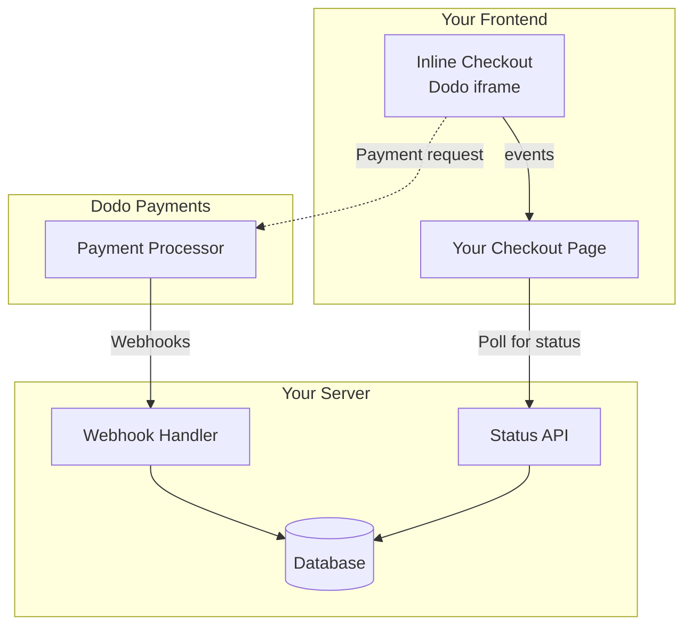

## Overview

Inline checkout lets you create fully integrated checkout experiences that blend seamlessly with your website or application. Unlike the [overlay checkout](/developer-resources/overlay-checkout), which opens as a modal on top of your page, inline checkout embeds the payment form directly into your page layout.

Using inline checkout, you can:

- Create checkout experiences that are fully integrated with your app or website
- Let Dodo Payments securely capture customer and payment information in an optimized checkout frame
- Display items, totals, and other information from Dodo Payments on your page
- Use SDK methods and events to build advanced checkout experiences

<Frame>
    
</Frame>

## How It Works

Inline checkout works by embedding a secure Dodo Payments frame into your website or app.

The checkout frame handles collecting customer information and capturing payment details. Your page displays the items list, totals, and options for changing what's on the checkout. The SDK lets your page and the checkout frame interact with each other.

Dodo Payments automatically creates a subscription when a checkout completes, ready for you to provision.

<Note>
The inline checkout frame securely handles all sensitive payment information, ensuring PCI compliance without additional certification on your end.
</Note>

## What Makes a Good Inline Checkout?

It's important that customers know who they're buying from, what they're buying, and how much they're paying.

To build an inline checkout that's compliant and optimized for conversion, your implementation must include:

<Frame caption="Example inline checkout layout showing required elements">
    
</Frame>

1. **Recurring information**: If recurring, how often it recurs and the total to pay on renewal. If a trial, how long the trial lasts.
2. **Item descriptions**: A description of what's being purchased.
3. **Transaction totals**: Transaction totals, including subtotal, total tax, and grand total. Be sure to include the currency too.
4. **Dodo Payments footer**: The full inline checkout frame, including the checkout footer that has information about Dodo Payments, our terms of sale, and our privacy policy.
5. **Refund policy**: A link to your refund policy, if it differs from the Dodo Payments standard refund policy.

<Warning>
Always display the complete inline checkout frame, including the footer. Removing or hiding legal information violates compliance requirements.
</Warning>

## Customer Journey

The checkout flow is determined by your checkout session configuration. Depending on how you configure the checkout session, customers will experience a checkout that may present all information on a single page or across multiple steps.

<Steps>
<Step title="Customer opens checkout">

You can open inline checkout by passing items or an existing transaction. Use the SDK to show and update on-page information, and SDK methods to update items based on customer interaction.
    

</Step>

<Step title="Customer enters their details">

Inline checkout first asks customers to enter their email address, select their country, and (where required) enter their ZIP or postal code. This step gathers all necessary information to determine taxes and available payment options.

You can prefill customer details and present saved addresses to streamline the experience.

</Step>

<Step title="Customer selects payment method">

After entering their details, customers are presented with available payment methods and the payment form. Options may include credit or debit card, PayPal, Apple Pay, Google Pay, and other local payment methods based on their location.

Display saved payment methods if available to speed up checkout.


</Step>

<Step title="Checkout completed">

Dodo Payments routes every payment to the best acquirer for that sale to get the best possible chance of success. Customers enter a success workflow that you can build.


</Step>

<Step title="Dodo Payments creates subscription">

Dodo Payments automatically creates a subscription for the customer, ready for you to provision. The payment method the customer used is held on file for renewals or subscription changes.


</Step>
</Steps>

## Quick Start

Get started with the Dodo Payments Inline Checkout in just a few lines of code:

```typescript
import { DodoPayments } from "dodopayments-checkout";

// Initialize the SDK for inline mode
DodoPayments.Initialize({
  mode: "test",
  displayType: "inline",
  onEvent: (event) => {
    console.log("Checkout event:", event);
  },
});

// Open checkout in a specific container
DodoPayments.Checkout.open({
  checkoutUrl: "https://test.dodopayments.com/session/cks_123",
  elementId: "dodo-inline-checkout" // ID of the container element
});
```

<Tip>
Ensure you have a container element with the corresponding `id` on your page: `<div id="dodo-inline-checkout"></div>`.
</Tip>

## Step-by-Step Integration Guide

<Steps>
<Step title="Install the SDK">

Install the Dodo Payments Checkout SDK:

<CodeGroup>

```bash npm
npm install dodopayments-checkout
```

```bash yarn
yarn add dodopayments-checkout
```

```bash pnpm
pnpm add dodopayments-checkout
```

</CodeGroup>

</Step>

<Step title="Initialize the SDK for Inline Display">

Initialize the SDK and specify `displayType: 'inline'`. You should also listen for the `checkout.breakdown` event to update your UI with real-time tax and total calculations.

```typescript
import { DodoPayments } from "dodopayments-checkout";

DodoPayments.Initialize({
  mode: "test",
  displayType: "inline",
  onEvent: (event) => {
    if (event.event_type === "checkout.breakdown") {
      const breakdown = event.data?.message;
      // Update your UI with breakdown.subTotal, breakdown.tax, breakdown.total, etc.
    }
  },
});
```

</Step>

<Step title="Create a Container Element">

Add an element to your HTML where the checkout frame will be injected:

```html
<div id="dodo-inline-checkout"></div>
```

</Step>

<Step title="Open the Checkout">

Call `DodoPayments.Checkout.open()` with the `checkoutUrl` and the `elementId` of your container:

```typescript
DodoPayments.Checkout.open({
  checkoutUrl: "https://test.dodopayments.com/session/cks_123",
  elementId: "dodo-inline-checkout"
});
```

</Step>

<Step title="Test Your Integration">

1. Start your development server:

```bash
npm run dev
```

2. Test the checkout flow:
   - Enter your email and address details in the inline frame.
   - Verify that your custom order summary updates in real-time.
   - Test the payment flow using test credentials.
   - Confirm redirects work correctly.

<Check>
You should see `checkout.breakdown` events logged in your browser console if you added a console log in the `onEvent` callback.
</Check>

</Step>

<Step title="Go Live">

When you're ready for production:

1. Change the mode to `'live'`:

```typescript
DodoPayments.Initialize({
  mode: "live",
  displayType: "inline",
  onEvent: (event) => {
    // Handle events
  }
});
```

2. Update your checkout URLs to use live checkout sessions from your backend.
3. Test the complete flow in production.

</Step>
</Steps>

## Complete React Example

This example demonstrates how to implement a custom order summary alongside the inline checkout, keeping them in sync using the `checkout.breakdown` event.

```tsx
"use client";

import { useEffect, useState } from 'react';
import { DodoPayments, CheckoutBreakdownData } from 'dodopayments-checkout';

export default function CheckoutPage() {
  const [breakdown, setBreakdown] = useState<Partial<CheckoutBreakdownData>>({});

  useEffect(() => {
    // 1. Initialize the SDK
    DodoPayments.Initialize({
      mode: 'test',
      displayType: 'inline',
      onEvent: (event) => {
        // 2. Listen for the 'checkout.breakdown' event
        if (event.event_type === "checkout.breakdown") {
          const message = event.data?.message as CheckoutBreakdownData;
          if (message) setBreakdown(message);
        }
      }
    });

    // 3. Open the checkout in the specified container
    DodoPayments.Checkout.open({
      checkoutUrl: 'https://test.dodopayments.com/session/cks_123',
      elementId: 'dodo-inline-checkout'
    });

    return () => DodoPayments.Checkout.close();
  }, []);

  const format = (amt: number | null | undefined, curr: string | null | undefined) => 
    amt != null && curr ? `${curr} ${(amt/100).toFixed(2)}` : '0.00';

  const currency = breakdown.currency ?? breakdown.finalTotalCurrency ?? '';

  return (
    <div className="flex flex-col md:flex-row min-h-screen">
      {/* Left Side - Checkout Form */}
      <div className="w-full md:w-1/2 flex items-center">
        <div id="dodo-inline-checkout" className='w-full' />
      </div>

      {/* Right Side - Custom Order Summary */}
      <div className="w-full md:w-1/2 p-8 bg-gray-50">
        <h2 className="text-2xl font-bold mb-4">Order Summary</h2>
        <div className="space-y-2">
          {breakdown.subTotal && (
            <div className="flex justify-between">
              <span>Subtotal</span>
              <span>{format(breakdown.subTotal, currency)}</span>
            </div>
          )}
          {breakdown.discount && (
            <div className="flex justify-between">
              <span>Discount</span>
              <span>{format(breakdown.discount, currency)}</span>
            </div>
          )}
          {breakdown.tax != null && (
            <div className="flex justify-between">
              <span>Tax</span>
              <span>{format(breakdown.tax, currency)}</span>
            </div>
          )}
          <hr />
          {(breakdown.finalTotal ?? breakdown.total) && (
            <div className="flex justify-between font-bold text-xl">
              <span>Total</span>
              <span>{format(breakdown.finalTotal ?? breakdown.total, breakdown.finalTotalCurrency ?? currency)}</span>
            </div>
          )}
        </div>
      </div>
    </div>
  );
}

```

## API Reference

### Configuration

#### Initialize Options

```typescript
interface InitializeOptions {
  mode: "test" | "live";
  displayType: "inline"; // Required for inline checkout
  onEvent: (event: CheckoutEvent) => void;
}
```

| Option | Type | Required | Description |
|--------|------|----------|-------------|
| `mode` | `"test" \| "live"` | Yes | Environment mode. |
| `displayType` | `"inline" \| "overlay"` | Yes | Must be set to `"inline"` to embed the checkout. |
| `onEvent` | `function` | Yes | Callback function for handling checkout events. |

#### Checkout Options

```typescript
export type FontSize = "xs" | "sm" | "md" | "lg" | "xl" | "2xl";
export type FontWeight = "normal" | "medium" | "bold" | "extraBold";

interface CheckoutOptions {
  checkoutUrl: string;
  elementId: string; // Required for inline checkout
  options?: {
    showTimer?: boolean;
    showSecurityBadge?: boolean;
    manualRedirect?: boolean;
    payButtonText?: string;
    fontSize?: FontSize;
    fontWeight?: FontWeight;
  };
}
```

| 选项 | 类型 | 必需 | 描述 |
|--------|------|----------|-------------|
| `checkoutUrl` | `string` | Yes | 结账会话 URL。 |
| `elementId` | `string` | Yes | 结账应呈现的 DOM 元素的 `id`。 |
| `options.showTimer` | `boolean` | No | 显示或隐藏结账计时器。默认为 `true`。禁用时，会在会话过期时收到 `checkout.link_expired` 事件。 |
| `options.showSecurityBadge` | `boolean` | No | 显示或隐藏安全徽章。默认为 `true`。 |
| `options.manualRedirect` | `boolean` | No | 启用后，结账完成后不会自动重定向。相反，你会收到 `checkout.status` 和 `checkout.redirect_requested` 事件，以便自行处理重定向。 |
| `options.payButtonText` | `string` | No | 支付按钮上显示的自定义文本。 |
| `options.fontSize` | `FontSize` | No | 结账的全局字体大小。 |
| `options.fontWeight` | `FontWeight` | No | 结账的全局字体粗细。 |

### Methods

#### Open Checkout

Opens the checkout frame in the specified container.

```typescript
DodoPayments.Checkout.open({
  checkoutUrl: "https://test.dodopayments.com/session/cks_123",
  elementId: "dodo-inline-checkout"
});
```

You can also pass additional options to customize the checkout behavior:

```typescript
DodoPayments.Checkout.open({
  checkoutUrl: "https://test.dodopayments.com/session/cks_123",
  elementId: "dodo-inline-checkout",
  options: {
    showTimer: false,
    showSecurityBadge: false,
    manualRedirect: true,
    payButtonText: "Pay Now",
  },
});
```

When using `manualRedirect`, handle the checkout completion in your `onEvent` callback:

```typescript
DodoPayments.Initialize({
  mode: "test",
  displayType: "inline",
  onEvent: (event) => {
    if (event.event_type === "checkout.status") {
      const status = event.data?.message?.status;
      // Handle status: "succeeded", "failed", or "processing"
    }
    if (event.event_type === "checkout.redirect_requested") {
      const redirectUrl = event.data?.message?.redirect_to;
      // Redirect the customer manually
      window.location.href = redirectUrl;
    }
    if (event.event_type === "checkout.link_expired") {
      // Handle expired checkout session
    }
  },
});
```

#### Close Checkout

Programmatically removes the checkout frame and cleans up event listeners.

```typescript
DodoPayments.Checkout.close();
```

#### Check Status

Returns whether the checkout frame is currently injected.

```typescript
const isOpen = DodoPayments.Checkout.isOpen();
// Returns: boolean
```

### Events

The SDK provides real-time events through the `onEvent` callback. For inline checkout, `checkout.breakdown` is particularly useful for syncing your UI.

| Event Type | Description |
|------------|-------------|
| `checkout.opened` | Checkout frame has been loaded. |
| `checkout.form_ready` | Checkout form is ready to receive user input. Useful for hiding loading states and showing the checkout UI. |
| `checkout.breakdown` | Fired when prices, taxes, or discounts are updated. |
| `checkout.customer_details_submitted` | Customer details have been submitted. |
| `checkout.pay_button_clicked` | Fired when the customer clicks the pay button. Useful for analytics and tracking conversion funnels. |
| `checkout.redirect` | Checkout will perform a redirect (e.g., to a bank page). |
| `checkout.error` | An error occurred during checkout. |
| `checkout.link_expired` | Fired when the checkout session expires. Only received when `showTimer` is set to `false`. |
| `checkout.status` | Fired when `manualRedirect` is enabled. Contains the checkout status (`succeeded`, `failed`, or `processing`). |
| `checkout.redirect_requested` | Fired when `manualRedirect` is enabled. Contains the URL to redirect the customer to. |

#### Checkout Breakdown Data

The `checkout.breakdown` event provides the following data:

```typescript
interface CheckoutBreakdownData {
  subTotal?: number;          // Amount in cents
  discount?: number;         // Amount in cents
  tax?: number;              // Amount in cents
  total?: number;            // Amount in cents
  currency?: string;         // e.g., "USD"
  finalTotal?: number;       // Final amount including adjustments
  finalTotalCurrency?: string; // Currency for the final total
}
```

#### Checkout Status Event Data

When `manualRedirect` is enabled, you receive the `checkout.status` event with the following data:

```typescript
interface CheckoutStatusEventData {
  message: {
    status?: "succeeded" | "failed" | "processing";
  };
}
```

#### Checkout Redirect Requested Event Data

When `manualRedirect` is enabled, you receive the `checkout.redirect_requested` event with the following data:

```typescript
interface CheckoutRedirectRequestedEventData {
  message: {
    redirect_to?: string;
  };
}
```

#### Understanding the Breakdown Event

The `checkout.breakdown` event is the primary way to keep your application's UI in sync with the Dodo Payments checkout state.

**When it fires:**
- **On initialization**: Immediately after the checkout frame is loaded and ready.
- **On address change**: Whenever the customer selects a country or enters a postal code that results in a tax recalculation.

**Field Details:**

| Field | Description |
|-------|-------------|
| `subTotal` | The sum of all line items in the session before any discounts or taxes are applied. |
| `discount` | The total value of all applied discounts. |
| `tax` | The calculated tax amount. In `inline` mode, this updates dynamically as the user interacts with the address fields. |
| `total` | The mathematical result of `subTotal - discount + tax` in the session's base currency. |
| `currency` | The ISO currency code (e.g., `"USD"`) for the standard subtotal, discount, and tax values. |
| `finalTotal` | The actual amount the customer is charged. This may include additional foreign exchange adjustments or local payment method fees that aren't part of the basic price breakdown. |
| `finalTotalCurrency` | The currency in which the customer is actually paying. This can differ from `currency` if purchasing power parity or local currency conversion is active. |

**Key Integration Tips:**

1.  **Currency Formatting**: Prices are always returned as integers in the smallest currency unit (e.g., cents for USD, yen for JPY). To display them, divide by 100 (or the appropriate power of 10) or use a formatting library like `Intl.NumberFormat`.
2.  **Handling Initial States**: When the checkout first loads, `tax` and `discount` may be `0` or `null` until the user provides their billing information or applies a code. Your UI should handle these states gracefully (e.g., showing a dash `—` or hiding the row).
3.  **The "Final Total" vs "Total"**: While `total` gives you the standard price calculation, `finalTotal` is the source of truth for the transaction. If `finalTotal` is present, it reflects exactly what will be charged to the customer's card, including any dynamic adjustments.
4.  **Real-time Feedback**: Use the `tax` field to show users that taxes are being calculated in real-time. This provides a "live" feel to your checkout page and reduces friction during the address entry step.

## Implementation Options

### Package Manager Installation

Install via npm, yarn, or pnpm as shown in the [Step-by-Step Integration Guide](#step-by-step-integration-guide).

### CDN Implementation

For quick integration without a build step, you can use our CDN:

```html
<!DOCTYPE html>
<html lang="en">
<head>
    <meta charset="UTF-8">
    <meta name="viewport" content="width=device-width, initial-scale=1.0">
    <title>Dodo Payments Inline Checkout</title>
    
    <!-- Load DodoPayments -->
    <script src="https://cdn.jsdelivr.net/npm/dodopayments-checkout@latest/dist/index.js"></script>
    <script>
        // Initialize the SDK
        DodoPaymentsCheckout.DodoPayments.Initialize({
            mode: "test",
            displayType: "inline",
            onEvent: (event) => {
                console.log('Checkout event:', event);
            }
        });
    </script>
</head>
<body>
    <div id="dodo-inline-checkout"></div>

    <script>
        // Open the checkout
        DodoPaymentsCheckout.DodoPayments.Checkout.open({
            checkoutUrl: "https://test.dodopayments.com/session/cks_123",
            elementId: "dodo-inline-checkout"
        });
    </script>
</body>
</html>
```

## 更新支付方式

内联结账支持订阅的**支付方式更新**。当客户需要更新支付方式——无论是针对活动订阅还是重新激活搁置的订阅——你都可以在页面布局中直接呈现更新流程。

### 工作原理

1. 调用 [更新支付方式 API](/features/subscription#update-payment-method-for-active-subscription) 来获取 `payment_link`：

```typescript
const response = await client.subscriptions.updatePaymentMethod('sub_123', {
  type: 'new',
  return_url: 'https://example.com/return'
});
```

2. 将返回的 `payment_link` 作为 `checkoutUrl` 传递，以打开内联结账：

```typescript
DodoPayments.Checkout.open({
  checkoutUrl: response.payment_link,
  elementId: "dodo-inline-checkout"
});
```

内联框架仅呈现支付方式收集表单。客户可以在不离开你的页面的情况下输入新卡片信息或选择保存的支付方式。

### 针对搁置订阅

当为 `on_hold` 状态的订阅更新支付方式时，Dodo Payments 会自动为任何剩余费用创建一笔收费。监控 `payment.succeeded` 和 `subscription.active` Webhook 以确认重新激活。

```typescript
const response = await client.subscriptions.updatePaymentMethod('sub_123', {
  type: 'new',
  return_url: 'https://example.com/return'
});

if (response.payment_id) {
  // Charge created for remaining dues
  // Open inline checkout for payment collection
  DodoPayments.Checkout.open({
    checkoutUrl: response.payment_link,
    elementId: "dodo-inline-checkout"
  });
}
```

<Tip>
你也可以传递 `type: 'existing'` 和 `payment_method_id` 给更新支付方式 API，使用已保存的支付方式而不是收集新信息。
</Tip>

## 错误处理

SDK 通过事件系统提供详细的错误信息。请务必在你的 `onEvent` 回调中实施适当的错误处理：

```typescript
DodoPayments.Initialize({
  mode: "test",
  displayType: "inline",
  onEvent: (event: CheckoutEvent) => {
    if (event.event_type === "checkout.error") {
      console.error("Checkout error:", event.data?.message);
      // Handle error appropriately
    }
  }
});
```

<Warning>
在出现问题时，请务必处理 `checkout.error` 事件，以提供良好的用户体验。
</Warning>

## 最佳实践

1. **响应式设计**：确保容器元素有足够的宽度和高度。iframe 通常会扩展以填充其容器。
2. **同步**：使用 `checkout.breakdown` 事件，使你的自定义订单摘要或定价表与结账框架中的内容保持一致。
3. **骨架状态**：在容器中显示加载指示器，直到触发 `checkout.opened` 事件。
4. **清理**：在组件卸载时调用 `DodoPayments.Checkout.close()`，以清理 iframe 和事件监听器。

<Info>
对于深色模式实现，建议使用 `#0d0d0d` 作为背景色，以便与内联结账框架达到最佳视觉融合。
</Info>

## 支付状态验证

<Warning>
不要仅依赖内联结账事件来判断支付成功或失败。务必使用 webhook 和/或轮询实现服务器端验证。
</Warning>

### 为什么必须进行服务器端验证

虽然类似 `checkout.status` 的内联结账事件能提供实时反馈，但它们不应成为你判断支付状态的唯一依据。网络问题、浏览器崩溃或用户关闭页面可能导致事件丢失。为确保支付验证可靠：

1. **你的服务器应监听 webhook 事件** - Dodo Payments 会为支付状态更改发送 webhook
2. **实施轮询机制** - 你的前端应轮询服务器以获取状态更新
3. **结合两种方式** - 将 webhook 作为主要来源，轮询作为备用

### 推荐架构



### 实施步骤

**1. 监听结账事件** - 当用户点击支付时，开始准备验证状态：

```typescript
onEvent: (event) => {
  if (event.event_type === 'checkout.status') {
    // Start polling your server for confirmed status
    startPolling();
  }
}
```

**2. 轮询你的服务器** - 创建一个端点来检查数据库中的支付状态（由 webhook 更新）：

```typescript
// Poll every 2 seconds until status is confirmed
const interval = setInterval(async () => {
  const { status } = await fetch(`/api/payments/${paymentId}/status`).then(r => r.json());
  if (status === 'succeeded' || status === 'failed') {
    clearInterval(interval);
    handlePaymentResult(status);
  }
}, 2000);
```

**3. 服务器端处理 webhook** - 当 Dodo 发送 `payment.succeeded` 或 `payment.failed` webhook 时更新数据库。详情请参阅我们的 [Webhook 文档](/developer-resources/webhooks)。

### 处理重定向（3DS、Google Pay、UPI）

在使用 `manualRedirect: true` 时，某些支付方式需要将用户重定向离开你的页面以进行认证：

- **3D 安全 (3DS)** - 卡片认证
- **Google Pay** - 某些流程下的钱包认证
- **UPI** - 印度支付方式重定向

需要重定向时，你会收到 `checkout.redirect_requested` 事件。将用户重定向到指定的 URL：

```typescript
if (event.event_type === 'checkout.redirect_requested') {
  const redirectUrl = event.data?.message?.redirect_to;
  // Save payment ID before redirect, then redirect
  sessionStorage.setItem('pendingPaymentId', paymentId);
  window.location.href = redirectUrl;
}
```

认证完成（成功或失败）后，用户会返回你的页面。不要仅因为用户返回就假设成功。相反：

1. 检查用户是否从重定向返回（例如，通过 `sessionStorage`）
2. 开始轮询你的服务器以获取已确认的支付状态
3. 在轮询期间显示“正在验证付款...”状态
4. 根据服务器确认的状态显示成功/失败的 UI

<Tip>
重定向后请始终在服务器端验证支付状态。用户返回你的页面仅意味着认证完成——并不表示支付成功或失败。
</Tip>

## 故障排除

<AccordionGroup>
<Accordion title="Checkout frame is not appearing">
- 确保 `elementId` 与实际存在于 DOM 中的 `div` 的 `id` 匹配。
- 确保 `displayType: 'inline'` 已传递给 `Initialize`。
- 检查 `checkoutUrl` 是否有效。
</Accordion>

<Accordion title="Taxes are not updating in my UI">
- 确保你正在监听 `checkout.breakdown` 事件。
- 只有在用户在结账框架中输入有效的国家和邮政编码之后，才会计算税费。
</Accordion>
</AccordionGroup>

## 启用数字钱包

有关设置 Apple Pay、Google Pay 及其他数字钱包的详细信息，请参阅 <a href="/features/payment-methods/digital-wallets">数字钱包</a> 页面。

### Apple Pay 快速设置

<Steps>
<Step title="Download domain association file">
下载[Apple Pay 域关联文件](http://checkout.dodopayments.com/.well-known/apple-developer-merchantid-domain-association)。
</Step>

<Step title="Request activation">
将你的生产域名 URL 邮件发送至 **support@dodopayments.com** 并请求激活 Apple Pay。
</Step>

<Step title="Test after confirmation">
确认后，验证 Apple Pay 是否出现在结账中并测试完整流程。
</Step>
</Steps>

<Warning>
Apple Pay 在进入生产环境前需要域验证。如果你计划提供 Apple Pay，请在上线前与支持团队联系。
</Warning>

## 浏览器支持

Dodo Payments Checkout SDK 支持以下浏览器：

- Chrome (latest)
- Firefox (latest)
- Safari (latest)
- Edge (latest)
- IE11+

## 内联结账与覆盖式结账

为你的用例选择合适的结账类型：

| 功能 | 内联结账 | 覆盖式结账 |
|---------|-----------------|------------------|
| 集成深度 | 完全嵌入页面 | 页面之上的模态 |
| 布局控制 | 完全控制 | 有限 |
| 品牌呈现 | 无缝 | 与页面分离 |
| 实施工作量 | 较高 | 较低 |
| 适用场景 | 自定义结账页、高转化流程 | 快速集成、已有页面 |

<Tip>
当你希望最大限度控制结账体验并实现无缝品牌呈现时，请使用 **内联结账**。需要快速集成、只做最小更改时，请使用 **覆盖式结账**。
</Tip>

## 相关资源

<CardGroup cols={2}>
<Card title="Overlay Checkout" icon="layer-group" href="/developer-resources/overlay-checkout">
    使用覆盖式结账实现快速的基于模态的集成。
</Card>

<Card title="Checkout Sessions API" icon="code" href="/api-reference/checkout-sessions/create">
    创建结账会话以驱动你的结账体验。
</Card>

<Card title="Webhooks" icon="webhook" href="/developer-resources/webhooks">
    使用 webhook 在服务器端处理支付事件。
</Card>

<Card title="Integration Guide" icon="book" href="/developer-resources/integration-guide">
    完整的 Dodo Payments 集成指南。
</Card>
</CardGroup>

如需更多帮助，请访问我们的 [Discord 社区](https://discord.gg/bYqAp4ayYh) 或联系我们的开发者支持团队。
