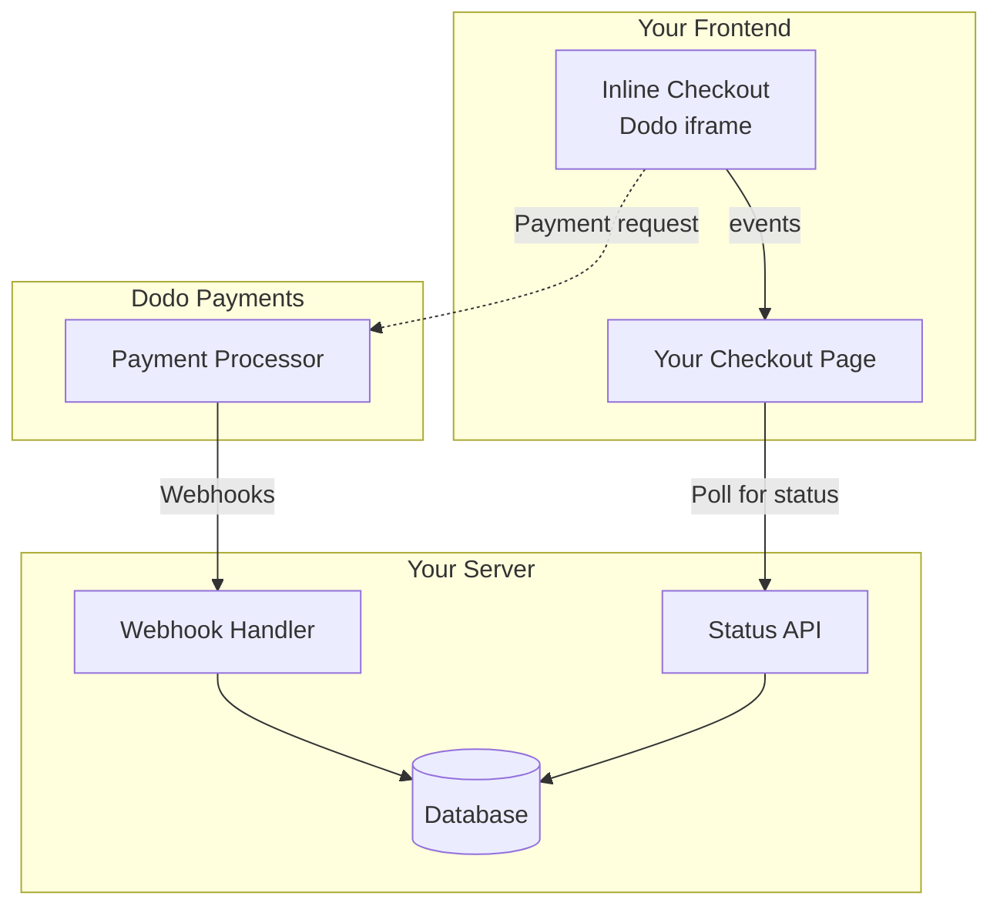

## 概述

内嵌结账让您创建与您的网站或应用程序无缝集成的结账体验。与 [覆盖结账](/developer-resources/overlay-checkout) 不同，后者在您的页面上以模态窗口的形式打开，内嵌结账将支付表单直接嵌入到您的页面布局中。

使用内嵌结账，您可以：

- 创建与您的应用或网站完全集成的结账体验
- 让 Dodo Payments 安全地捕获客户和支付信息，提供优化的结账框架
- 在您的页面上显示来自 Dodo Payments 的商品、总额和其他信息
- 使用 SDK 方法和事件构建高级结账体验

<Frame>
    
</Frame>

## 工作原理

内嵌结账通过将安全的 Dodo Payments 框架嵌入到您的网站或应用中来工作。

结账框架处理收集客户信息和捕获支付细节。您的页面显示商品列表、总额和更改结账内容的选项。SDK 允许您的页面与结账框架相互交互。

Dodo Payments 在结账完成时自动创建订阅，准备供您配置。

<Note>
内联结账帧安全处理所有敏感支付信息，确保符合 PCI 要求，无需您额外认证。
</Note>

## 什么是好的内嵌结账？

客户需要知道他们从谁那里购买、购买了什么以及支付了多少。

要构建一个合规且优化转化的内嵌结账，您的实现必须包括：

{/* LOCKED_PATTERN_2c3203bfa100605bc2704d01e7dccd32 */}
    
</Frame>

1. **定期信息**：如果是定期的，说明其频率和续订时的总额。如果是试用，说明试用期的时长。
2. **商品描述**：对所购买商品的描述。
3. **交易总额**：交易总额，包括小计、总税和总计。确保也包括货币。
4. **Dodo Payments 页脚**：完整的内嵌结账框架，包括有关 Dodo Payments 的信息、我们的销售条款和隐私政策的结账页脚。
5. **退款政策**：如果您的退款政策与 Dodo Payments 的标准退款政策不同，请提供退款政策的链接。

<Warning>
始终显示完整的内联结账框架，包括页脚。移除或隐藏法律信息会违反合规要求。
</Warning>

## 客户旅程

结账流程由您的结账会话配置决定。根据您如何配置结账会话，客户将体验到可能在单个页面或多个步骤中呈现所有信息的结账。

<Steps>
<Step title="客户打开结账">

您可以通过传递商品或现有交易来打开内联结账。使用 SDK 显示和更新页面信息，并使用 SDK 方法根据客户交互更新商品。
    

</Step>

<Step title="客户输入他们的详细信息">

内嵌结账首先要求客户输入他们的电子邮件地址、选择他们的国家，并（如有必要）输入他们的邮政编码。此步骤收集所有必要的信息以确定税费和可用的支付选项。

您可以预填客户详细信息并提供已保存的地址，以简化体验。

</Step>

<Step title="客户选择支付方式">

在输入详细信息后，客户将看到可用的支付方式和支付表单。选项可能包括信用卡或借记卡、PayPal、Apple Pay、Google Pay，以及根据他们的位置提供的其他本地支付方式。

如果有可用的已保存支付方式，请显示以加快结账速度。


</Step>

<Step title="结账完成">

Dodo Payments 将每笔支付路由到最佳收单方，以获得最佳的成功机会。客户进入您可以构建的成功工作流。


</Step>

{/* LOCKED_PATTERN_fe28b170edb53eebdbefd92e22425bda */}

Dodo Payments 自动为客户创建订阅，准备供您配置。客户使用的支付方式将被保留以供续订或订阅更改。


</Step>
</Steps>

## 快速开始

只需几行代码即可开始使用 Dodo Payments 内联结账：

```typescript
import { DodoPayments } from "dodopayments-checkout";

// Initialize the SDK for inline mode
DodoPayments.Initialize({
  mode: "test",
  displayType: "inline",
  onEvent: (event) => {
    console.log("Checkout event:", event);
  },
});

// Open checkout in a specific container
DodoPayments.Checkout.open({
  checkoutUrl: "https://test.dodopayments.com/session/cks_123",
  elementId: "dodo-inline-checkout" // ID of the container element
});
```

<Tip>
确保页面上有一个容器元素，其具有相应的 `id`：`<div id="dodo-inline-checkout"></div>`。
</Tip>

## 分步集成指南

<Steps>
{/* LOCKED_PATTERN_776027320500bde6b99bac6bed1cc64d */}

安装 Dodo Payments 结账 SDK：

<CodeGroup>

```bash npm
npm install dodopayments-checkout
```

```bash yarn
yarn add dodopayments-checkout
```

```bash pnpm
pnpm add dodopayments-checkout
```

</CodeGroup>

</Step>

{/* LOCKED_PATTERN_c9671e1641fc4b5a7d02836b54fde4a6 */}

初始化 SDK 并指定 `displayType: 'inline'`。您还应该监听 `checkout.breakdown` 事件，以便使用实时税费和总计计算更新 UI。

```typescript
import { DodoPayments } from "dodopayments-checkout";

DodoPayments.Initialize({
  mode: "test",
  displayType: "inline",
  onEvent: (event) => {
    if (event.event_type === "checkout.breakdown") {
      const breakdown = event.data?.message;
      // Update your UI with breakdown.subTotal, breakdown.tax, breakdown.total, etc.
    }
  },
});
```

</Step>

{/* LOCKED_PATTERN_7ddf8b1f0258fda183d82c15a3096a03 */}

在您的 HTML 中添加一个元素，以便结账框架将被注入：

```html
<div id="dodo-inline-checkout"></div>
```

</Step>

{/* LOCKED_PATTERN_4817384312c2fcbac3336846aa45db8f */}

调用 `DodoPayments.Checkout.open()`，并传入 `checkoutUrl` 以及您容器的 `elementId`：

```typescript
DodoPayments.Checkout.open({
  checkoutUrl: "https://test.dodopayments.com/session/cks_123",
  elementId: "dodo-inline-checkout"
});
```

</Step>

{/* LOCKED_PATTERN_97e1d34fe501fd0a9dd5e96c0a83886c */}

1. 启动您的开发服务器：

```bash
npm run dev
```

2. 测试结账流程：
   - 在内联框架中输入您的电子邮件和地址详细信息。
   - 验证您的自定义订单摘要是否实时更新。
   - 使用测试凭据测试支付流程。
   - 确认重定向是否正常工作。

<Check>
如果您在 `onEvent` 回调中添加了 console log，浏览器控制台应会记录 `checkout.breakdown` 事件。
</Check>

</Step>

<Step title="上线">

当您准备好进行生产时：

1. 将模式更改为 `'live'`：

```typescript
DodoPayments.Initialize({
  mode: "live",
  displayType: "inline",
  onEvent: (event) => {
    // Handle events
  }
});
```

2. 更新您的结账 URL，以使用来自后端的实时结账会话。
3. 在生产环境中测试完整流程。

</Step>
</Steps>

## 完整的 React 示例

此示例演示如何在内联结账旁边实现自定义订单摘要，并使用 `checkout.breakdown` 事件保持同步。

```tsx
"use client";

import { useEffect, useState } from 'react';
import { DodoPayments, CheckoutBreakdownData } from 'dodopayments-checkout';

export default function CheckoutPage() {
  const [breakdown, setBreakdown] = useState<Partial<CheckoutBreakdownData>>({});

  useEffect(() => {
    // 1. Initialize the SDK
    DodoPayments.Initialize({
      mode: 'test',
      displayType: 'inline',
      onEvent: (event) => {
        // 2. Listen for the 'checkout.breakdown' event
        if (event.event_type === "checkout.breakdown") {
          const message = event.data?.message as CheckoutBreakdownData;
          if (message) setBreakdown(message);
        }
      }
    });

    // 3. Open the checkout in the specified container
    DodoPayments.Checkout.open({
      checkoutUrl: 'https://test.dodopayments.com/session/cks_123',
      elementId: 'dodo-inline-checkout'
    });

    return () => DodoPayments.Checkout.close();
  }, []);

  const format = (amt: number | null | undefined, curr: string | null | undefined) => 
    amt != null && curr ? `${curr} ${(amt/100).toFixed(2)}` : '0.00';

  const currency = breakdown.currency ?? breakdown.finalTotalCurrency ?? '';

  return (
    <div className="flex flex-col md:flex-row min-h-screen">
      {/* Left Side - Checkout Form */}
      <div className="w-full md:w-1/2 flex items-center">
        <div id="dodo-inline-checkout" className='w-full' />
      </div>

      {/* Right Side - Custom Order Summary */}
      <div className="w-full md:w-1/2 p-8 bg-gray-50">
        <h2 className="text-2xl font-bold mb-4">Order Summary</h2>
        <div className="space-y-2">
          {breakdown.subTotal && (
            <div className="flex justify-between">
              <span>Subtotal</span>
              <span>{format(breakdown.subTotal, currency)}</span>
            </div>
          )}
          {breakdown.discount && (
            <div className="flex justify-between">
              <span>Discount</span>
              <span>{format(breakdown.discount, currency)}</span>
            </div>
          )}
          {breakdown.tax != null && (
            <div className="flex justify-between">
              <span>Tax</span>
              <span>{format(breakdown.tax, currency)}</span>
            </div>
          )}
          <hr />
          {(breakdown.finalTotal ?? breakdown.total) && (
            <div className="flex justify-between font-bold text-xl">
              <span>Total</span>
              <span>{format(breakdown.finalTotal ?? breakdown.total, breakdown.finalTotalCurrency ?? currency)}</span>
            </div>
          )}
        </div>
      </div>
    </div>
  );
}

```

## API 参考

### 配置

#### 初始化选项

```typescript
interface InitializeOptions {
  mode: "test" | "live";
  displayType: "inline"; // Required for inline checkout
  onEvent: (event: CheckoutEvent) => void;
}
```

| 选项 | 类型 | 必填 | 描述 |
|--------|------|------|-------------|
| `mode` | `"test" \| "live"` | 是 | 环境模式。 |
| `displayType` | `"inline" \| "overlay"` | 是 | 必须设置为 `"inline"` 以嵌入结账。 |
| `onEvent` | `function` | 是 | 用于处理结账事件的回调函数。 |

#### 结账选项

```typescript
export type FontSize = "xs" | "sm" | "md" | "lg" | "xl" | "2xl";
export type FontWeight = "normal" | "medium" | "bold" | "extraBold";

interface CheckoutOptions {
  checkoutUrl: string;
  elementId: string; // Required for inline checkout
  options?: {
    showTimer?: boolean;
    showSecurityBadge?: boolean;
    manualRedirect?: boolean;
    themeConfig?: ThemeConfig;
    payButtonText?: string;
    fontSize?: FontSize;
    fontWeight?: FontWeight;
  };
}
```

| 选项 | 类型 | 必填 | 描述 |
|--------|------|------|-------------|
| `checkoutUrl` | `string` | 是 | 结账会话 URL。 |
| `elementId` | `string` | 是 | 要渲染结账的 DOM 元素的 `id`。 |
| `options.showTimer` | `boolean` | 否 | 显示或隐藏结账计时器。默认值为 `true`。禁用时，您会在会话过期时收到 `checkout.link_expired` 事件。 |
| `options.showSecurityBadge` | `boolean` | 否 | 显示或隐藏安全徽章。默认值为 `true`。 |
| `options.manualRedirect` | `boolean` | 否 | 启用后，结账完成后不会自动重定向。相反，您会收到 `checkout.status` 和 `checkout.redirect_requested` 事件，以便自行处理重定向。 |
| `options.themeConfig` | `ThemeConfig` | 否 | 自定义主题配置。 |
| `options.payButtonText` | `string` | 否 | 支付按钮上显示的自定义文本。 |
| `options.fontSize` | `FontSize` | 否 | 结账的全局字体大小。 |
| `options.fontWeight` | `FontWeight` | 否 | 结账的全局字体粗细。 |

### 方法

#### 打开结账

在指定的容器中打开结账框架。

```typescript
DodoPayments.Checkout.open({
  checkoutUrl: "https://test.dodopayments.com/session/cks_123",
  elementId: "dodo-inline-checkout"
});
```

您还可以传递其他选项以自定义结账行为：

```typescript
DodoPayments.Checkout.open({
  checkoutUrl: "https://test.dodopayments.com/session/cks_123",
  elementId: "dodo-inline-checkout",
  options: {
    showTimer: false,
    showSecurityBadge: false,
    manualRedirect: true,
    payButtonText: "Pay Now",
  },
});
```

使用 `manualRedirect` 时，在 `onEvent` 回调中处理结账完成：

```typescript
DodoPayments.Initialize({
  mode: "test",
  displayType: "inline",
  onEvent: (event) => {
    if (event.event_type === "checkout.status") {
      const status = event.data?.message?.status;
      // Handle status: "succeeded", "failed", or "processing"
    }
    if (event.event_type === "checkout.redirect_requested") {
      const redirectUrl = event.data?.message?.redirect_to;
      // Redirect the customer manually
      window.location.href = redirectUrl;
    }
    if (event.event_type === "checkout.link_expired") {
      // Handle expired checkout session
    }
  },
});
```

#### 关闭结账

以编程方式移除结账框架并清理事件监听器。

```typescript
DodoPayments.Checkout.close();
```

#### 检查状态

返回结账框架当前是否已注入。

```typescript
const isOpen = DodoPayments.Checkout.isOpen();
// Returns: boolean
```

### 事件

SDK 通过 `onEvent` 回调提供实时事件。对于内联结账，`checkout.breakdown` 事件尤其适合同步 UI。

| 事件类型 | 描述 |
|------------|-------------|
| `checkout.opened` | 结账框架已加载。 |
| `checkout.form_ready` | 结账表单已准备好接收用户输入。可用于隐藏加载状态并显示结账 UI。 |
| `checkout.breakdown` | 在价格、税费或折扣更新时触发。 |
| `checkout.customer_details_submitted` | 客户详细信息已提交。 |
| `checkout.pay_button_clicked` | 客户点击支付按钮时触发。适用于分析和追踪转化漏斗。 |
| `checkout.redirect` | 结账将执行重定向（例如重定向至银行页面）。 |
| `checkout.error` | 结账过程中发生错误。 |
| `checkout.link_expired` | 结账会话过期时触发。仅当 `showTimer` 设置为 `false` 时收到。 |
| `checkout.status` | 启用 `manualRedirect` 时触发。包含结账状态（`succeeded`、`failed` 或 `processing`）。 |
| `checkout.redirect_requested` | 启用 `manualRedirect` 时触发。包含用于重定向客户的网址。 |

#### 结账明细数据

`checkout.breakdown` 事件提供以下数据：

```typescript
interface CheckoutBreakdownData {
  subTotal?: number;          // Amount in cents
  discount?: number;         // Amount in cents
  tax?: number;              // Amount in cents
  total?: number;            // Amount in cents
  currency?: string;         // e.g., "USD"
  finalTotal?: number;       // Final amount including adjustments
  finalTotalCurrency?: string; // Currency for the final total
}
```

#### 结账状态事件数据

启用 `manualRedirect` 后，会收到附带以下数据的 `checkout.status` 事件：

```typescript
interface CheckoutStatusEventData {
  message: {
    status?: "succeeded" | "failed" | "processing";
  };
}
```

#### 结账重定向请求事件数据

启用 `manualRedirect` 后，会收到附带以下数据的 `checkout.redirect_requested` 事件：

```typescript
interface CheckoutRedirectRequestedEventData {
  message: {
    redirect_to?: string;
  };
}
```

#### 理解明细事件

`checkout.breakdown` 事件是将应用 UI 与 Dodo Payments 结账状态同步的主要方式。

**触发时机：**
- **初始化时**：结账框架加载并准备好后立即。
- **地址更改时**：每当客户选择一个国家或输入一个导致税费重新计算的邮政编码时。

**字段详细信息：**

| 字段 | 描述 |
|-------|-------------|
| `subTotal` | 会话中所有订单项在应用任何折扣或税费之前的总和。 |
| `discount` | 所有已应用折扣的总价值。 |
| `tax` | 计算出的税额。在 `inline` 模式下，当用户与地址字段交互时，会动态更新。 |
| `total` | 会话基础货币中 `subTotal - discount + tax` 的数学结果。 |
| `currency` | 标准小计、折扣和税费值所使用的 ISO 货币代码（例如 `"USD"`）。 |
| `finalTotal` | 客户实际被收取的金额。可能包括额外的外汇调整或不属于基础价格拆分的本地支付方式费用。 |
| `finalTotalCurrency` | 客户实际支付的货币。若启用购买力平价或本地货币转换，可能与 `currency` 不同。 |

**关键集成提示：**

1.  **货币格式化**：价格始终以最小货币单位的整数形式返回（例如 USD 使用美分，JPY 使用日元）。要展示价格，请除以 100（或适当的 10 的幂），或使用例如 `Intl.NumberFormat` 这样的格式化库。
2.  **处理初始状态**：当结账首次加载时，`tax` 和 `discount` 在用户提供账单信息或应用优惠码之前可能是 `0` 或 `null`。您的 UI 应优雅地处理这些状态（例如显示破折号 `—` 或隐藏该行）。
3.  **“最终总计”与“总计”**：虽然 `total` 为您提供标准价格计算，但 `finalTotal` 是交易的真实依据。如果存在 `finalTotal`，说明它准确反映了将向客户卡片收取的金额，包括任何动态调整。
4.  **实时反馈**：使用 `tax` 字段向用户展示税费正在实时计算。这会为结账页面提供“实时”感，降低用户在填写地址时的阻力。

## 实施选项

### 包管理器安装

通过 npm、yarn 或 pnpm 安装，如 [逐步集成指南](#step-by-step-integration-guide) 所示。

### CDN 实施

为了快速集成而无需构建步骤，您可以使用我们的 CDN：

```html
<!DOCTYPE html>
<html lang="en">
<head>
    <meta charset="UTF-8">
    <meta name="viewport" content="width=device-width, initial-scale=1.0">
    <title>Dodo Payments Inline Checkout</title>
    
    <!-- Load DodoPayments -->
    <script src="https://cdn.jsdelivr.net/npm/dodopayments-checkout@latest/dist/index.js"></script>
    <script>
        // Initialize the SDK
        DodoPaymentsCheckout.DodoPayments.Initialize({
            mode: "test",
            displayType: "inline",
            onEvent: (event) => {
                console.log('Checkout event:', event);
            }
        });
    </script>
</head>
<body>
    <div id="dodo-inline-checkout"></div>

    <script>
        // Open the checkout
        DodoPaymentsCheckout.DodoPayments.Checkout.open({
            checkoutUrl: "https://test.dodopayments.com/session/cks_123",
            elementId: "dodo-inline-checkout"
        });
    </script>
</body>
</html>
```

### 主题自定义

您可以在打开结账时通过 `options` 参数传入 `themeConfig` 对象来自定义结账外观。主题配置同时支持浅色和深色模式，允许您自定义颜色、边框、文本、按钮和圆角。

<Info>
本节涵盖使用 Checkout SDK 的**客户端**主题配置。您也可以在通过 API 创建结账会话时使用 `theme_config` 参数进行**服务端**主题配置。有关 API 级配置，请参阅 [Checkout Theme Customization](/features/checkout#checkout-theme-customization)。
</Info>

#### 基本主题配置

```typescript
DodoPayments.Checkout.open({
  checkoutUrl: "https://checkout.dodopayments.com/session/cks_123",
  options: {
    themeConfig: {
      light: {
        bgPrimary: "#FFFFFF",
        textPrimary: "#344054",
        buttonPrimary: "#A6E500",
      },
      dark: {
        bgPrimary: "#0D0D0D",
        textPrimary: "#FFFFFF",
        buttonPrimary: "#A6E500",
      },
      radius: "8px",
    },
  },
});
```

#### 完整主题配置

所有可用的主题属性：

```typescript
DodoPayments.Checkout.open({
  checkoutUrl: "https://checkout.dodopayments.com/session/cks_123",
  options: {
    themeConfig: {
      light: {
        // Background colors
        bgPrimary: "#FFFFFF",        // Primary background color
        bgSecondary: "#F9FAFB",      // Secondary background color (e.g., tabs)
        
        // Border colors
        borderPrimary: "#D0D5DD",     // Primary border color
        borderSecondary: "#6B7280",  // Secondary border color
        inputFocusBorder: "#D0D5DD", // Input focus border color
        
        // Text colors
        textPrimary: "#344054",       // Primary text color
        textSecondary: "#6B7280",    // Secondary text color
        textPlaceholder: "#667085",  // Placeholder text color
        textError: "#D92D20",        // Error text color
        textSuccess: "#10B981",      // Success text color
        
        // Button colors
        buttonPrimary: "#A6E500",           // Primary button background
        buttonPrimaryHover: "#8CC500",      // Primary button hover state
        buttonTextPrimary: "#0D0D0D",       // Primary button text color
        buttonSecondary: "#F3F4F6",         // Secondary button background
        buttonSecondaryHover: "#E5E7EB",     // Secondary button hover state
        buttonTextSecondary: "#344054",     // Secondary button text color
      },
      dark: {
        // Background colors
        bgPrimary: "#0D0D0D",
        bgSecondary: "#1A1A1A",
        
        // Border colors
        borderPrimary: "#323232",
        borderSecondary: "#D1D5DB",
        inputFocusBorder: "#323232",
        
        // Text colors
        textPrimary: "#FFFFFF",
        textSecondary: "#909090",
        textPlaceholder: "#9CA3AF",
        textError: "#F97066",
        textSuccess: "#34D399",
        
        // Button colors
        buttonPrimary: "#A6E500",
        buttonPrimaryHover: "#8CC500",
        buttonTextPrimary: "#0D0D0D",
        buttonSecondary: "#2A2A2A",
        buttonSecondaryHover: "#3A3A3A",
        buttonTextSecondary: "#FFFFFF",
      },
      radius: "8px", // Border radius for inputs, buttons, and tabs
    },
  },
});
```

#### 仅限浅色模式

如果只想定制浅色主题：

```typescript
DodoPayments.Checkout.open({
  checkoutUrl: "https://checkout.dodopayments.com/session/cks_123",
  options: {
    themeConfig: {
      light: {
        bgPrimary: "#FFFFFF",
        textPrimary: "#000000",
        buttonPrimary: "#0070F3",
      },
      radius: "12px",
    },
  },
});
```

#### 仅限深色模式

如果只想定制深色主题：

```typescript
DodoPayments.Checkout.open({
  checkoutUrl: "https://checkout.dodopayments.com/session/cks_123",
  options: {
    themeConfig: {
      dark: {
        bgPrimary: "#000000",
        textPrimary: "#FFFFFF",
        buttonPrimary: "#0070F3",
      },
      radius: "12px",
    },
  },
});
```

#### 部分主题覆盖

您可以仅覆盖特定属性。未指定的属性将使用默认值：

```typescript
DodoPayments.Checkout.open({
  checkoutUrl: "https://checkout.dodopayments.com/session/cks_123",
  options: {
    themeConfig: {
      light: {
        buttonPrimary: "#FF6B6B", // Only override primary button color
      },
      radius: "16px", // Override border radius
    },
  },
});
```

#### 与其他选项结合的主题配置

您可以将主题配置与其他结账选项结合使用：

```typescript
DodoPayments.Checkout.open({
  checkoutUrl: "https://checkout.dodopayments.com/session/cks_123",
  options: {
    showTimer: true,
    showSecurityBadge: true,
    manualRedirect: false,
    themeConfig: {
      light: {
        bgPrimary: "#FFFFFF",
        buttonPrimary: "#A6E500",
      },
      dark: {
        bgPrimary: "#0D0D0D",
        buttonPrimary: "#A6E500",
      },
      radius: "8px",
    },
  },
});
```

#### TypeScript 类型

对于 TypeScript 用户，所有主题配置类型都已导出：

```typescript
import { ThemeConfig, ThemeModeConfig } from "dodopayments-checkout";

const themeConfig: ThemeConfig = {
  light: {
    bgPrimary: "#FFFFFF",
    // ... other properties
  },
  dark: {
    bgPrimary: "#0D0D0D",
    // ... other properties
  },
  radius: "8px",
};
```

## 更新支付方式

内联结账支持 **支付方式更新**，适用于订阅。当客户需要更新支付方式——无论是现有订阅还是重新激活处于暂停状态的订阅——都可以在页面布局中直接渲染更新流程。

### 工作方式

1. 调用 [更新支付方式 API](/features/subscription#update-payment-method-for-active-subscription) 以获取 `payment_link`：

```typescript
const response = await client.subscriptions.updatePaymentMethod('sub_123', {
  type: 'new',
  return_url: 'https://example.com/return'
});
```

2. 将返回的 `payment_link` 作为 `checkoutUrl` 传入以打开内联结账：

```typescript
DodoPayments.Checkout.open({
  checkoutUrl: response.payment_link,
  elementId: "dodo-inline-checkout"
});
```

内联框架仅呈现支付方式收集表单。客户可以在不离开页面的情况下输入新卡信息或选择已保存的支付方式。

### 针对待处理的订阅

当为处于 `on_hold` 状态的订阅更新支付方式时，Dodo Payments 会自动为剩余欠款创建一笔费用。请监控 `payment.succeeded` 和 `subscription.active` webhook 以确认重新激活。

```typescript
const response = await client.subscriptions.updatePaymentMethod('sub_123', {
  type: 'new',
  return_url: 'https://example.com/return'
});

if (response.payment_id) {
  // Charge created for remaining dues
  // Open inline checkout for payment collection
  DodoPayments.Checkout.open({
    checkoutUrl: response.payment_link,
    elementId: "dodo-inline-checkout"
  });
}
```

<Tip>
您也可以通过传递 `type: 'existing'` 及一个 `payment_method_id` 给更新支付方式 API，使用现有的保存支付方式而无需收集新信息。
</Tip>

## 错误处理

SDK 通过事件系统提供详细错误信息。请始终在 `onEvent` 回调中实现适当的错误处理：

```typescript
DodoPayments.Initialize({
  mode: "test",
  displayType: "inline",
  onEvent: (event: CheckoutEvent) => {
    if (event.event_type === "checkout.error") {
      console.error("Checkout error:", event.data?.message);
      // Handle error appropriately
    }
  }
});
```

<Warning>
发生问题时，务必处理 `checkout.error` 事件，以提供良好的用户体验。
</Warning>

## 最佳实践

1. **响应式设计**：确保您的容器元素具有足够的宽度和高度。iframe 通常会扩展以填充其容器。
2. **同步**：使用 `checkout.breakdown` 事件让您的自定义订单摘要或价格表与用户在结账框架中看到的内容保持一致。
3. **骨架状态**：在容器中显示加载指示器，直到 `checkout.opened` 事件触发。
4. **清理**：组件卸载时调用 `DodoPayments.Checkout.close()` 以清除 iframe 和事件监听器。

<Info>
对于深色模式的实现，建议使用 `#0d0d0d` 作为背景颜色，以实现与内联结账框架的最佳视觉融合。
</Info>

## 支付状态验证

<Warning>
不要只依赖内联结账事件来判断支付成功或失败。请始终结合 Webhook 和/或轮询执行服务端验证。
</Warning>

### 为什么服务端验证至关重要

虽然像 `checkout.status` 这样的内联结账事件可以提供实时反馈，但它们不应成为您判断支付状态的唯一依据。网络问题、浏览器崩溃或用户关闭页面都可能导致事件丢失。为确保可靠的支付验证：

1. **您的服务器应监听 webhook 事件** – Dodo Payments 会发送支付状态变更的 webhook。
2. **实现轮询机制** – 前端应向服务器轮询状态更新。
3. **结合两种方法** – 将 webhook 作为主要来源，以轮询作为备用。

### 推荐架构



### 实施步骤

**1. 监听结账事件** – 当用户点击支付后，开始准备验证状态：

```typescript
onEvent: (event) => {
  if (event.event_type === 'checkout.status') {
    // Start polling your server for confirmed status
    startPolling();
  }
}
```

**2. 向服务器轮询** – 创建一个检查数据库中支付状态（由 webhook 更新） 的端点：

```typescript
// Poll every 2 seconds until status is confirmed
const interval = setInterval(async () => {
  const { status } = await fetch(`/api/payments/${paymentId}/status`).then(r => r.json());
  if (status === 'succeeded' || status === 'failed') {
    clearInterval(interval);
    handlePaymentResult(status);
  }
}, 2000);
```

**3. 在服务器端处理 webhook** – 当 Dodo 发送 `payment.succeeded` 或 `payment.failed` webhook 时更新数据库。详情请参阅我们的 [Webhooks documentation](/developer-resources/webhooks)。

### 处理重定向（3DS、Google Pay、UPI）

使用 `manualRedirect: true` 时，某些支付方式需要将用户重定向离开页面进行身份验证：
- **3D Secure (3DS)** - 卡片身份验证
- **Google Pay** - 某些流程中的钱包身份验证
- **UPI** - 印度支付方式重定向

<Steps>
<Step title="下载并上传 Apple Pay 域关联文件">

当需要重定向时，您会收到 `checkout.redirect_requested` 事件。将用户重定向到提供的 URL：

```typescript
if (event.event_type === 'checkout.redirect_requested') {
  const redirectUrl = event.data?.message?.redirect_to;
  // Save payment ID before redirect, then redirect
  sessionStorage.setItem('pendingPaymentId', paymentId);
  window.location.href = redirectUrl;
}
```

身份验证完成后（无论成功与否），用户会返回页面。**不要仅因用户返回就认为支付成功。**相反：

1. 检查用户是否从重定向返回（例如通过 `sessionStorage`）
2. 开始轮询服务器以获取已确认的支付状态
3. 在轮询期间显示“正在验证支付…”状态
4. 根据服务器确认的状态显示成功/失败 UI

<Tip>
重定向后务必在服务端验证支付状态。用户返回您的页面仅意味着身份验证已完成——并不表示支付已成功或失败。
</Tip>

## 故障排除

<AccordionGroup>
{/* LOCKED_PATTERN_93cff808dfbc871be9b4fbc9b88bb642 */}
- 验证 `elementId` 是否与 DOM 中实际存在的 `div` 的 `id` 相匹配。
- 确保 `displayType: 'inline'` 已传递给 `Initialize`。
- 检查 `checkoutUrl` 是否有效。
</Accordion>

{/* LOCKED_PATTERN_05b89b97a7f9c53e2d9d7a4e480e2342 */}
- 确保您正在监听 `checkout.breakdown` 事件。
- 只有在用户在结账帧中输入有效的国家/地区和邮政编码后才会计算税费。
</Accordion>
</AccordionGroup>

## 启用数字钱包

有关设置 Apple Pay、Google Pay 及其他数字钱包的详细信息，请参阅 <a href="/features/payment-methods/digital-wallets">Digital Wallets</a> 页面。

### Apple Pay 的快速设置

<Steps>
{/* LOCKED_PATTERN_052fb22f687ef020f4d37c90a8329c23 */}
下载 [Apple Pay 域关联文件](http://checkout.dodopayments.com/.well-known/apple-developer-merchantid-domain-association)。
</Step>

{/* LOCKED_PATTERN_3a44bb73d2b6657e3ef8dfb6df5437c3 */}
将您的生产域 URL 通过电子邮件发送至 **support@dodopayments.com** 并请求启用 Apple Pay。
</Step>

{/* LOCKED_PATTERN_f4cb4ca481d047ba1b29ad7a11be722d */}
确认后，验证 Apple Pay 是否出现在结账中并测试完整流程。
</Step>
</Steps>

<Warning>
Apple Pay 在生产环境中出现之前需要域验证。如果打算提供 Apple Pay，请在上线前联系支持。
</Warning>

## 浏览器支持

Dodo Payments Checkout SDK 支持以下浏览器：
- Chrome（最新版本）
- Firefox（最新版本）
- Safari（最新版本）
- Edge（最新版本）
- IE11+

- Chrome (latest)
- Firefox (latest)
- Safari (latest)
- Edge (latest)
- IE11+

## 内联结账 vs 覆盖式结账

根据您的用例选择合适的结账类型：

| 功能 | 内联结账 | 覆盖式结账 |
|---------|-----------------|------------------|
| 集成深度 | 完全嵌入页面 | 覆盖在页面之上 |
| 布局控制 | 完全控制 | 有限 |
| 品牌化 | 无缝 | 与页面分离 |
| 实施工作量 | 较高 | 较低 |
| 最佳应用 | 自定义结账页面、高转化流程 | 快速集成、现有页面 |

<Tip>
当您希望最大程度地掌控结账体验并实现无缝品牌延展时，使用 **内联结账**。如果想快速集成并对现有页面做最少修改，则使用 **覆盖式结账**。
</Tip>

## 相关资源

{/* LOCKED_PATTERN_bd3b9ce11ef978f59c6eb5461169b62d */}
{/* LOCKED_PATTERN_03192cb7afa497d816218ee2e453c19b */}
    使用覆盖式结账以实现基于模态的快速集成。
{/* LOCKED_PATTERN_4ceaf3811b39bde3b7bfedbcf0487a0b */}

{/* LOCKED_PATTERN_5e9b3579ee53b9305eb4a383d135b798 */}
    创建结账会话以驱动您的结账体验。
{/* LOCKED_PATTERN_4ceaf3811b39bde3b7bfedbcf0487a0b */}

{/* LOCKED_PATTERN_4fdc255b113f889a339d4227d31c920b */}
    通过 Webhook 在服务端处理支付事件。
{/* LOCKED_PATTERN_4ceaf3811b39bde3b7bfedbcf0487a0b */}

{/* LOCKED_PATTERN_4389e7f71e1a171de8ea420860f91acc */}
    全面掌握 Dodo Payments 集成。
{/* LOCKED_PATTERN_4ceaf3811b39bde3b7bfedbcf0487a0b */}
{/* LOCKED_PATTERN_639ec37665c9a30d7ddbd3a284a688a5 */}

如需更多帮助，请访问我们的 [Discord 社区](https://discord.gg/bYqAp4ayYh) 或联系开发者支持团队。
