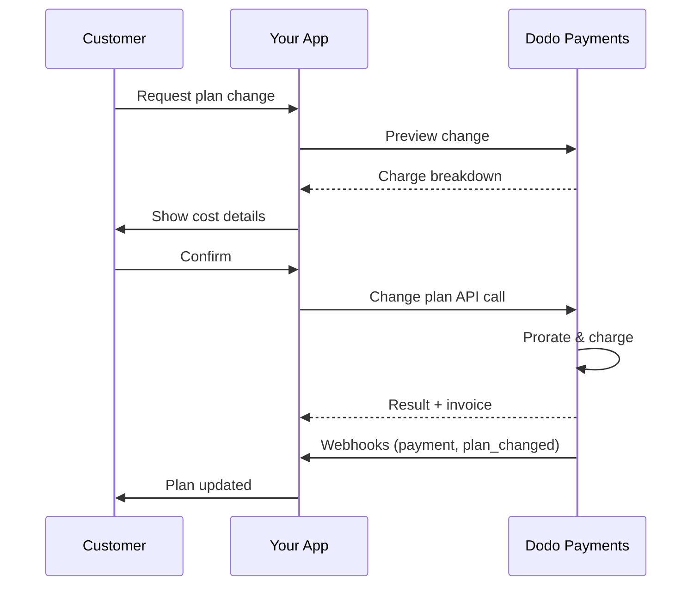
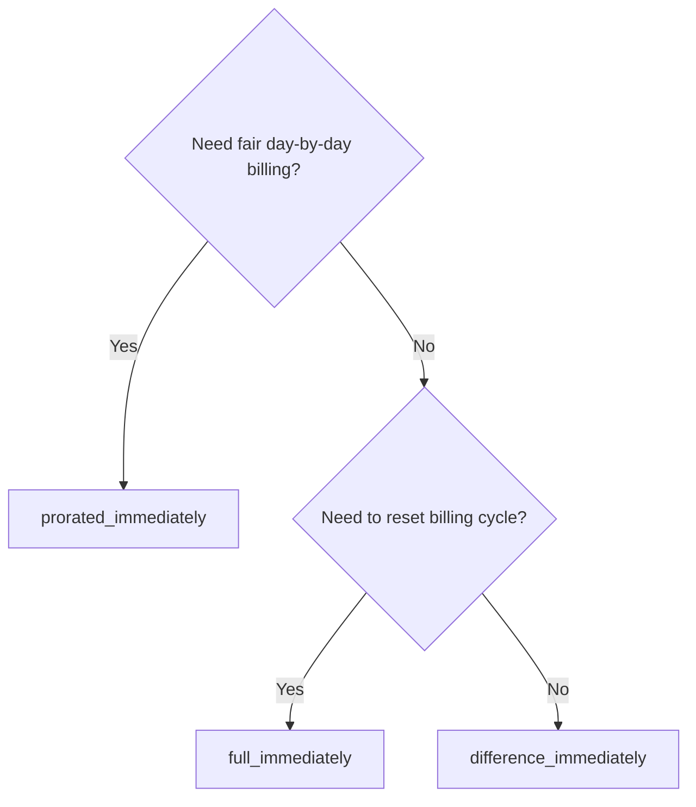
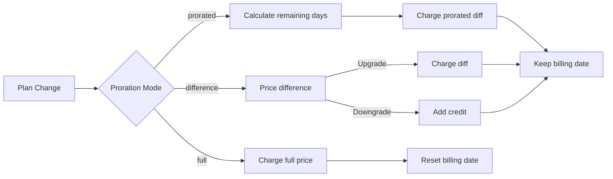

{/* LOCKED_PATTERN_6d744560e4135463c359b094ae69cd5f */}
{/* LOCKED_PATTERN_e019618386b2aca726eb1801e3e74076 */}
  用于更新订阅的完整 API 文档。
</Card>
{/* LOCKED_PATTERN_1e8b2499d330dcc44e5e284a3600fd11 */}
  在更改计划前查看收费金额。
</Card>
{/* LOCKED_PATTERN_782a37ccd4cc5a4159c5497e7f1d4c54 */}
  逐步订阅设置指南。
</Card>
</CardGroup>

## 什么是订阅升级或降级？

更改计划可以让客户在订阅层级或数量之间转换。可用于：
- 使定价与使用量或功能保持一致
- 在按月和按年之间转换（或反之）
- 调整基于席位的产品数量

<Info>
计划更改可能会根据所选的分摊模式触发即时收费。
</Info>

## 何时使用计划更改

- 当客户需要更多功能、使用量或席位时进行升级
- 当使用量减少时降级
- 在不取消订阅的情况下将用户迁移到新产品或价格

## 计划更改流程



## 前提条件

在实施订阅计划变更之前，请确保您拥有：

- 一个具有活跃订阅产品的 Dodo Payments 商户账户
- 从仪表板获取的 API 凭证（API 密钥和 Webhook 密钥）
- 一个现有的活跃订阅以进行修改
- 配置好的 Webhook 端点以处理订阅事件

<Info>
如需详细设置说明，请参阅我们的[集成指南](/developer-resources/integration-guide#dashboard-setup)。
</Info>

## 分步实施指南

按照此综合指南在您的应用程序中实施订阅计划变更：

<Steps>
{/* LOCKED_PATTERN_b0d6d45bb453480975a9fb2d18d04caf */}
在实施之前，请确定：
- 哪些订阅产品可以更改为其他产品
- 哪种分摊模式适合您的商业模型
- 如何优雅地处理计划更改失败
- 需要追踪哪些 webhook 事件以管理状态

<Tip>
在投入生产之前，请在测试模式下彻底测试计划更改。
</Tip>
</Step>

{/* LOCKED_PATTERN_44f780199a4b76d6c063b33d8f599e9a */}
选择符合您业务需求的计费方式：

<Tabs>
<Tab title="prorated_immediately">
最适合：希望对未使用时间实现公平收费的 SaaS 应用
- 根据剩余周期时间计算精确的分摊金额
- 根据周期中剩余的未使用时间收取分摊费用
- 向客户提供透明的计费
</Tab>

<Tab title="difference_immediately">
最适合：明确的升级/降级场景
- 升级：立即收取差额（例如 $30→$80 = 收取 $50）
- 降级：将剩余价值记为未来续费的积分
- 简化计费逻辑和客户沟通
</Tab>

<Tab title="full_immediately">
最适合：当您想重置计费周期时
- 立即收取新计划的全部金额
- 忽略旧计划的剩余时间
- 适用于从年度转为按月的情况
</Tab>
</Tabs>
</Step>

{/* LOCKED_PATTERN_62685552c5becb87cfeddbb400a3e69b */}
使用更改计划 API 修改订阅详情：

<ParamField path="subscription_id" type="string" required>
要修改的活动订阅的 ID。
</ParamField>

<ParamField path="product_id" type="string" required>
要更改为的新产品 ID。
</ParamField>

<ParamField path="quantity" type="integer" default="1">
新计划的单位数量（适用于基于席位的产品）。
</ParamField>

<ParamField path="proration_billing_mode" type="string" required>
如何处理即时计费：`prorated_immediately`、`full_immediately` 或 `difference_immediately`。
</ParamField>

<ParamField path="addons" type="array">
新计划的可选附加组件。留空则移除任何现有附加组件。
</ParamField>

{/* LOCKED_PATTERN_dbe6ce0c854d65ccfe8e10a6cd58e3a8 */}
控制计划更改付款失败时的行为：
- `prevent_change`：在付款成功前保持订阅在当前计划
- `apply_change`（默认）：无论付款结果如何都立即应用计划更改

如果未指定，则使用业务层级的默认设置。
</ParamField>
</Step>

{/* LOCKED_PATTERN_5c8c73c93c2f49c93ec60fbfa164dd3a */}
设置 webhook 处理以跟踪计划更改结果：

- `subscription.active`：计划更改成功，订阅已更新
- `subscription.plan_changed`：订阅计划已更改（升级/降级/附加组件更新）
- `subscription.on_hold`：计划更改收费失败，订阅暂停
- `payment.succeeded`：计划更改的立即收费成功
- `payment.failed`：立即收费失败

<Warning>
始终验证 webhook 签名并实现幂等事件处理。
</Warning>
</Step>

{/* LOCKED_PATTERN_df7c84793753eaba82a0d637e200faa6 */}
根据 webhook 事件，更新您的应用：
- 根据新计划授予/撤销功能
- 在客户仪表板上更新新计划详情
- 发送有关计划更改的确认邮件
- 记录账单更改以备审计
</Step>

{/* LOCKED_PATTERN_bee75f9c04c9720f2dc211cbed62a7c6 */}
彻底测试您的实现：
- 使用不同场景测试所有分摊模式
- 验证 webhook 处理是否正常
- 监控计划更改成功率
- 设置计划更改失败的告警
<Check>

<Check>
您的订阅计划更改实现现已准备好投入生产使用。
</Check>
</Step>
</Steps>

## 预览计划更改

在确认计划更改之前，请使用预览 API 向客户展示他们将被收费的确切金额：

<Tabs>

<Tab title="Node.js SDK">

```javascript
const preview = await client.subscriptions.previewChangePlan('sub_123', {
  product_id: 'prod_pro',
  quantity: 1,
  proration_billing_mode: 'prorated_immediately'
});

// Show customer the charge before confirming
console.log('Immediate charge:', preview.immediate_charge.summary);
console.log('New plan details:', preview.new_plan);
```

</Tab>

<Tab title="Python SDK">

```python
preview = client.subscriptions.preview_change_plan(
    subscription_id="sub_123",
    product_id="prod_pro",
    quantity=1,
    proration_billing_mode="prorated_immediately"
)

# Show customer the charge before confirming
print("Immediate charge:", preview.immediate_charge.summary)
print("New plan details:", preview.new_plan)
```

</Tab>
</Tabs>
使用预览 API 创建确认对话框，在客户确认计划更改之前向其展示确切的收费金额。
</Tip>

## 更改计划 API

使用更改计划 API 修改活动订阅的产品、数量和分摊行为。

### 快速入门示例

<Tabs>

  <Tab title="Node.js SDK">

    ```javascript
    import DodoPayments from 'dodopayments';

    const client = new DodoPayments({
      bearerToken: process.env.DODO_PAYMENTS_API_KEY,
      environment: 'test_mode', // defaults to 'live_mode'
    });

    async function changePlan() {
      const result = await client.subscriptions.changePlan('sub_123', {
        product_id: 'prod_new',
        quantity: 3,
        proration_billing_mode: 'prorated_immediately',
        on_payment_failure: 'prevent_change', // Optional: control behavior on payment failure
      });
      console.log(result.status, result.invoice_id, result.payment_id);
    }

    changePlan();
    ```

  </Tab>
  <Tab title="Python SDK">

    ```python
    import os
    from dodopayments import DodoPayments

    client = DodoPayments(
        bearer_token=os.environ.get("DODO_PAYMENTS_API_KEY"),
        environment="test_mode",  # defaults to "live_mode"
    )

    result = client.subscriptions.change_plan(
        subscription_id="sub_123",
        product_id="prod_new",
        quantity=3,
        proration_billing_mode="prorated_immediately",
        on_payment_failure="prevent_change",  # Optional: control behavior on payment failure
    )
    print(result.status, result.get("invoice_id"), result.get("payment_id"))
    ```

  </Tab>
  <Tab title="Go SDK">

    ```go
    package main

    import (
      "context"
      "fmt"
      "github.com/dodopayments/dodopayments-go"
      "github.com/dodopayments/dodopayments-go/option"
    )

    func main() {
      client := dodopayments.NewClient(option.WithBearerToken("YOUR_TOKEN"))
      res, err := client.Subscriptions.ChangePlan(context.TODO(), dodopayments.SubscriptionChangePlanParams{
        SubscriptionID: dodopayments.F("sub_123"),
        ProductID:             dodopayments.F("prod_new"),
        Quantity:              dodopayments.F(int64(3)),
        ProrationBillingMode:  dodopayments.F(dodopayments.SubscriptionChangePlanParamsProrationBillingModeProratedImmediately),
        OnPaymentFailure:      dodopayments.F(dodopayments.OnPaymentFailurePreventChange), // Optional
      })
      if err != nil { panic(err) }
      fmt.Println(res.Status, res.InvoiceID, res.PaymentID)
    }
    ```

  </Tab>
  <Tab title="HTTP">

    ```bash
    curl -X POST "$DODO_API_BASE/subscriptions/sub_123/change-plan" \
      -H "Authorization: Bearer $DODO_PAYMENTS_API_KEY" \
      -H "Content-Type: application/json" \
      -d '{
        "product_id": "prod_new",
        "quantity": 3,
        "proration_billing_mode": "prorated_immediately",
        "on_payment_failure": "prevent_change"
      }'
    ```

  </Tab>
</Tabs>

```json Success
{
  "status": "processing",
  "subscription_id": "sub_123",
  "invoice_id": "inv_789",
  "payment_id": "pay_456",
  "proration_billing_mode": "prorated_immediately"
}
```

<Note>
诸如 <code>invoice_id</code> 和 <code>payment_id</code> 之类的字段仅在计划更改过程中创建立即收费和/或发票时返回。始终依赖 webhook 事件（例如 <code>payment.succeeded</code>、<code>subscription.plan_changed</code>）来确认结果。
</Note>

<Warning>
如果立即收费失败，订阅可能会移动到 `subscription.on_hold` 状态，直到付款成功。
</Warning>

## 管理附加组件

在更改订阅计划时，您还可以修改附加组件：

```javascript
// Add addons to the new plan
await client.subscriptions.changePlan('sub_123', {
  product_id: 'prod_new',
  quantity: 1,
  proration_billing_mode: 'difference_immediately',
  addons: [
    { addon_id: 'addon_123', quantity: 2 }
  ]
});

// Remove all existing addons
await client.subscriptions.changePlan('sub_123', {
  product_id: 'prod_new',
  quantity: 1,
  proration_billing_mode: 'difference_immediately',
  addons: [] // Empty array removes all existing addons
});
```

<Info>
附加组件包含在分摊计算中，并将根据所选分摊模式收费。
</Info>

## 分摊模式

选择在更改计划时如何向客户收费：

#### `prorated_immediately`
- 对当前周期的部分差额收费
- 如果处于试用期，立即收费并切换到新计划
- 降级：可能生成应用于未来续费的分摊积分

#### `full_immediately`
- 立即收取新计划的全部金额
- 忽略旧计划的剩余时间

<Info>
使用 <code>difference_immediately</code> 进行降级时创建的积分是针对订阅的，与<a href="/features/customer-credit">客户积分</a>区分开来。它们会自动应用于同一订阅的未来续费，不能在订阅之间转移。
</Info>

#### `difference_immediately`
- 升级：立即收取新旧计划之间的价格差
- 降级：将剩余价值作为内部积分添加到订阅中，并在续费时自动应用

| 功能 | `prorated_immediately` | `difference_immediately` | `full_immediately` |
|---------|----------------------|------------------------|-------------------|
| **升级收费** | 按剩余天数分摊的差额 | 计划之间差价的全部金额 | 新计划的全额价格 |
| **降级积分** | 按剩余天数分摊的积分 | 作为积分的计划差价全部金额 | 无积分 |
| **计费周期** | 不变 | 不变 | 重置为今天 |
| **试用行为** | 结束试用，立即收费 | 结束试用，立即收费 | 结束试用，收取全部金额 |
| **最适合** | 公平的基于时间的计费 | 简单的升级/降级计算 | 重置计费周期 |
| **复杂度** | 中等（需要计算天数） | 低（简单减法） | 低（全额收费） |



### 示例场景

始终使用以下标准数值：
- 当前计划：**Basic**，费用为 **$30/月**
- 升级目标：**Pro**，费用为 **$80/月**
- 降级目标（从 Pro）：**Starter**，费用为 **$20/月**
- 计费周期：**30 天**，从 **1 月 1 日** 开始
- 计划更改发生在 **1 月 16 日**（剩余 15 天，已使用 15 天）

<AccordionGroup>
  {/* LOCKED_PATTERN_1a58b4dbcc060de029ff28c82c80a6fe */}

    ```
    Step 1: Calculate unused credit from current plan
      Unused days = 15 out of 30 days
      Credit = $30 × (15/30) = $15.00

    Step 2: Calculate prorated cost of new plan
      Remaining days = 15 out of 30 days
      New plan cost = $80 × (15/30) = $40.00

    Step 3: Calculate immediate charge
      Charge = New plan cost − Credit
      Charge = $40.00 − $15.00 = $25.00

    → Customer pays $25.00 now
    → Next renewal (Feb 1): $80.00/month
    ```

    ```javascript
    await client.subscriptions.changePlan('sub_123', {
      product_id: 'prod_pro',
      quantity: 1,
      proration_billing_mode: 'prorated_immediately'
    })
    ```

  </Accordion>

  {/* LOCKED_PATTERN_807a82fa1b52ee9a606ce1f9c1d8b613 */}

    ```
    Step 1: Calculate unused credit from current plan
      Unused days = 15 out of 30 days
      Credit = $80 × (15/30) = $40.00

    Step 2: Calculate prorated cost of new plan
      Remaining days = 15 out of 30 days
      New plan cost = $20 × (15/30) = $10.00

    Step 3: Calculate credit balance
      Credit = $40.00 − $10.00 = $30.00

    → No charge — $30.00 credit added to subscription
    → Credit auto-applies to future renewals
    → Next renewal (Feb 1): $20.00 − $30.00 credit = $0.00
    → Following renewal (Mar 1): $20.00 − $10.00 remaining credit = $10.00
    ```

    ```javascript
    await client.subscriptions.changePlan('sub_123', {
      product_id: 'prod_starter',
      quantity: 1,
      proration_billing_mode: 'prorated_immediately'
    })
    ```

  </Accordion>

  {/* LOCKED_PATTERN_67905dd0e892a1412bd0f1a567dd0a62 */}

    ```
    Immediate charge = New plan price − Old plan price
                     = $80 − $30
                     = $50.00

    → Customer pays $50.00 now (regardless of cycle position)
    → Next renewal (Feb 1): $80.00/month
    ```

    ```javascript
    await client.subscriptions.changePlan('sub_123', {
      product_id: 'prod_pro',
      quantity: 1,
      proration_billing_mode: 'difference_immediately'
    })
    ```

  </Accordion>

  {/* LOCKED_PATTERN_b17ed67d3062fadb798904adf781b844 */}

    ```
    Credit = Old plan price − New plan price
           = $80 − $20
           = $60.00

    → No charge — $60.00 credit added to subscription
    → Credit auto-applies to future renewals
    → Next renewal: $20.00 − $20.00 (from credit) = $0.00
    → Following renewal: $20.00 − $20.00 (from credit) = $0.00
    → Third renewal: $20.00 − $20.00 (from remaining credit) = $0.00
    ```

    ```javascript
    await client.subscriptions.changePlan('sub_123', {
      product_id: 'prod_starter',
      quantity: 1,
      proration_billing_mode: 'difference_immediately'
    })
    ```

  </Accordion>

  {/* LOCKED_PATTERN_0cb1a5657302a3970059ca925841dcd5 */}

    ```
    Immediate charge = Full new plan price = $80.00

    → Customer pays $80.00 now
    → No credit for unused time on old plan
    → Billing cycle resets to today (January 16)
    → Next renewal: February 16 at $80.00/month
    ```

    ```javascript
    await client.subscriptions.changePlan('sub_123', {
      product_id: 'prod_pro',
      quantity: 1,
      proration_billing_mode: 'full_immediately'
    })
    ```

  </Accordion>

  {/* LOCKED_PATTERN_6edab7762bdaeaf6cef5f85bafdb8832 */}

    ```
    Current: Basic plan ($30/month), no add-ons
    New: Pro plan ($80/month) + Extra Seats add-on ($10/seat × 3 seats = $30/month)
    Change on day 16 of 30 (15 days remaining)

    Step 1: Credit from current plan
      Credit = $30 × (15/30) = $15.00

    Step 2: Prorated cost of new plan + add-ons
      New plan = $80 × (15/30) = $40.00
      Add-ons = $30 × (15/30) = $15.00
      Total new = $55.00

    Step 3: Immediate charge
      Charge = $55.00 − $15.00 = $40.00

    → Customer pays $40.00 now
    → Next renewal: $80.00 + $30.00 = $110.00/month
    ```

    ```javascript
    await client.subscriptions.changePlan('sub_123', {
      product_id: 'prod_pro',
      quantity: 1,
      proration_billing_mode: 'prorated_immediately',
      addons: [
        { addon_id: 'addon_seats', quantity: 3 }
      ]
    })
    ```

  </Accordion>
</AccordionGroup>

### 各种模式如何处理计费



<Tip>
选择 `prorated_immediately` 实现公平时间计费；选择 `full_immediately` 以重新启动计费；使用 `difference_immediately` 以简化升级并在降级时自动记入积分。
</Tip>

## 处理支付失败

使用 `on_payment_failure` 参数控制计划更改付款失败时的处理流程。

### 支付失败模式

<Tabs>
{/* LOCKED_PATTERN_9a289e347ae0d2762cd8b5bae425d96d */}
**行为**：在付款成功之前保持订阅在当前计划上。

- 计划更改会被标记为“待定”
- 客户继续使用当前计划权限
- 只有在付款成功后，订阅才会转到 `active` 状态
- 在授予升级功能前确保付款有助于使用它

```javascript
await client.subscriptions.changePlan('sub_123', {
  product_id: 'prod_pro',
  quantity: 1,
  proration_billing_mode: 'prorated_immediately',
  on_payment_failure: 'prevent_change'
});
```

</Tab>

{/* LOCKED_PATTERN_389bf4efb62466ceba65070629169973 */}
**行为**：无论付款结果如何，都立即应用计划更改。

- 即使付款失败，也会应用计划更改
- 客户立即获得新计划访问权限
- 如果付款失败，订阅可能会转到 `on_hold`
- 适用于非关键升级或您信任的客户

```javascript
await client.subscriptions.changePlan('sub_123', {
  product_id: 'prod_pro',
  quantity: 1,
  proration_billing_mode: 'prorated_immediately',
  on_payment_failure: 'apply_change' // This is the default
});
```

</Tab>
</Tabs>

<Info>
如果未指定，则 `on_payment_failure` 参数将使用您在仪表板中配置的业务级默认设置。
</Info>

### 每种模式的适用场景

| 场景 | 推荐模式 | 原因 |
|----------|------------------|--------|
| 升级到高级功能 | `prevent_change` | 在授予访问权限前确保付款 |
| 增加数量（更多席位） | `prevent_change` | 防止在未付款时使用 |
| 降级计划 | `apply_change` | 客户在减少支出 |
| 信任的企业客户 | `apply_change` | 降低未付款风险 |
| 试用转正付费 | `prevent_change` | 关键的付款时刻 |

## 处理 webhook

通过 webhook 跟踪订阅状态，以确认计划更改和付款。

### 需要处理的事件类型
- `subscription.active`：订阅已激活
- `subscription.plan_changed`：订阅计划已更改（升级/降级/附加组件更改）
- `subscription.on_hold`：收费失败，订阅暂停
- `subscription.renewed`：续费成功
- `payment.succeeded`：计划更改或续费的支付成功
- `payment.failed`：支付失败

<Info>
我们建议以订阅事件驱动业务逻辑，并使用支付事件进行确认与对账。
</Info>

### 验证签名并处理意图

<Tabs>
  {/* LOCKED_PATTERN_ad56e9578b99d8d029bf3ec794be6fc4 */}

    ```javascript
    import { NextRequest, NextResponse } from 'next/server';
    
    export async function POST(req) {
      const webhookId = req.headers.get('webhook-id');
      const webhookSignature = req.headers.get('webhook-signature');
      const webhookTimestamp = req.headers.get('webhook-timestamp');
      const secret = process.env.DODO_WEBHOOK_SECRET;
    
      const payload = await req.text();
      // verifySignature is a placeholder – in production, use a Standard Webhooks library
      const { valid, event } = await verifySignature(
        payload,
        { id: webhookId, signature: webhookSignature, timestamp: webhookTimestamp },
        secret
      );
      if (!valid) return NextResponse.json({ error: 'Invalid signature' }, { status: 400 });
    
      switch (event.type) {
        case 'subscription.active':
          // mark subscription active in your DB
          break;
        case 'subscription.plan_changed':
          // refresh entitlements and reflect the new plan in your UI
          break;
        case 'subscription.on_hold':
          // notify user to update payment method
          break;
        case 'subscription.renewed':
          // extend access window
          break;
        case 'payment.succeeded':
          // reconcile payment for plan change
          break;
        case 'payment.failed':
          // log and alert
          break;
        default:
          // ignore unknown events
          break;
      }
    
      return NextResponse.json({ received: true });
    }
    ```

  </Tab>
  <Tab title="Express.js">

    ```javascript
    import express from 'express';
    
    const app = express();
    app.post('/webhooks/dodo', express.raw({ type: 'application/json' }), async (req, res) => {
      const webhookId = req.header('webhook-id');
      const webhookSignature = req.header('webhook-signature');
      const webhookTimestamp = req.header('webhook-timestamp');
      const secret = process.env.DODO_WEBHOOK_SECRET;
      const payload = req.body.toString('utf8');
    
      const { valid, event } = await verifySignature(
        payload,
        { id: webhookId, signature: webhookSignature, timestamp: webhookTimestamp },
        secret
      );
      if (!valid) return res.status(400).send('Invalid signature');
    
      // handle events like above
      res.json({ received: true });
    });
    
    app.listen(3000);
    ```

  </Tab>
</Tabs>

<Note>
有关详细的有效负载模式，请参阅<a href="/developer-resources/webhooks/intents/subscription">订阅 webhook 有效负载</a>和<a href="/developer-resources/webhooks/intents/payment">支付 webhook 有效负载</a>。
</Note>

## 最佳实践

遵循以下建议以可靠地进行订阅计划更改：

### 计划更改策略
- **彻底测试**：在生产环境前务必在测试模式下测试计划更改
- **谨慎选择分摊模式**：选择与您的商业模式相符的分摊方式
- **优雅处理失败**：实现适当的错误处理和重试逻辑
- **监控成功率**：跟踪计划更改的成功/失败率并调查问题

### Webhook 实施
- **验证签名**：始终验证 webhook 签名以确保真实性
- **实现幂等性**：优雅处理重复的 webhook 事件
- **异步处理**：不要用繁重操作阻塞 webhook 响应
- **记录全部**：保留详细日志以便调试和审核

### 用户体验
- **清晰沟通**：告知客户关于计费变更及时间的情况
- **提供确认**：发送计划更改成功的邮件确认
- **处理边缘情况**：考虑试用期、分摊和支付失败
- **立即更新 UI**：在应用界面中反映计划更改

## 常见问题与解决方案

解决订阅计划更改过程中常见的问题：

<AccordionGroup>
{/* LOCKED_PATTERN_112861435a085998aa537e347e24f368 */}
**症状**：API 调用成功但订阅仍停留在旧计划

**常见原因**：
- webhook 处理失败或延迟
- 接收到 webhook 后应用状态未更新
- 状态更新时的数据库事务问题

**解决方案**：
- 实现具备重试逻辑的稳健 webhook 处理
- 对状态更新使用幂等操作
- 添加监控以检测并提醒遗漏的 webhook 事件
- 确认 webhook 端点可访问且响应正常
</Accordion>

{/* LOCKED_PATTERN_653656c823b0f191581a523ab18f0f3f */}
**症状**：客户降级后未看到积分余额

**常见原因**：
- 分摊模式预期不同：使用 `difference_immediately` 时降级会自动积分整笔差价，而 `prorated_immediately` 会根据周期剩余时间计算分摊积分
- 积分是针对订阅的，不能在订阅之间转移
- 客户仪表板中未显示积分余额

**解决方案**：
- 想要自动积分时，在降级中使用 `difference_immediately`
- 向客户解释积分适用于同一订阅的未来续费
- 实现客户门户以显示积分余额
- 查看下一张预览发票确认所应用的积分
</Accordion>

{/* LOCKED_PATTERN_1b0516ec68b4083dc4d6ae9b330f3f1a */}
**症状**：Webhook 事件因签名无效而被拒绝

**常见原因**：
- 使用了错误的 webhook 密钥
- 在验证签名前修改了原始请求体
- 签名验证算法错误

**解决方案**：
- 确认使用的是仪表板中的正确 `DODO_WEBHOOK_SECRET`
- 在任何 JSON 解析中间件之前读取原始请求体
- 使用适配您平台的标准 webhook 验证库
- 在开发环境测试 webhook 签名验证

</Accordion>

{/* LOCKED_PATTERN_638d7c911003cceda8c7d34ff8a2c381 */}
**症状**：API 返回 422 Unprocessable Entity 错误

**常见原因**：
- 无效的订阅 ID 或产品 ID
- 订阅未处于活动状态
- 缺少必填参数
- 产品不支持计划更改

**解决方案**：
- 验证订阅存在且处于活动状态
- 检查产品 ID 是否有效且可用
- 确保提供了所有必填参数
- 查看 API 文档了解参数要求
</Accordion>

{/* LOCKED_PATTERN_7917a64bf4b26c933f2e4649e9278a56 */}
**症状**：计划更改已发起但立即收费失败

**常见原因**：
- 客户支付方式余额不足
- 支付方式已过期或无效
- 银行拒绝交易
- 欺诈检测阻止收费

**解决方案**：
- 适当处理 `payment.failed` 事件
- 通知客户更新支付方式
- 为临时失败实施重试逻辑
- 考虑允许在立即收费失败情况下更改计划
</Accordion>

{/* LOCKED_PATTERN_20276630e99e95ac9f5cdd0b347713bb */}
**症状**：计划更改收费失败且订阅转入 `on_hold` 状态

**发生了什么**：
当计划更改收费失败时，订阅会自动进入 `on_hold` 状态。在更新支付方式之前，该订阅不会自动续费。

**解决方案**：更新支付方式以重新激活订阅

要在计划更改失败后将订阅从 `on_hold` 状态重新激活：
1. **使用更新支付方式 API** 更新支付方式
2. **自动创建收费**：API 会自动为剩余应付金额创建收费
3. **生成发票**：为该收费生成发票
4. **处理支付**：使用新的支付方式处理付款
5. **重新激活**：付款成功后，订阅会重新激活至 `active` 状态

<CodeGroup>

```javascript Node.js
// Reactivate subscription from on_hold after failed plan change
async function reactivateAfterFailedPlanChange(subscriptionId) {
  // Update payment method - automatically creates charge for remaining dues
  const response = await client.subscriptions.updatePaymentMethod(subscriptionId, {
    type: 'new',
    return_url: 'https://example.com/return'
  });
  
  if (response.payment_id) {
    console.log('Charge created for remaining dues:', response.payment_id);
    console.log('Payment link:', response.payment_link);
    
    // Redirect customer to payment_link to complete payment
    // Monitor webhooks for:
    // 1. payment.succeeded - charge succeeded
    // 2. subscription.active - subscription reactivated
  }
  
  return response;
}

// Or use existing payment method if available
async function reactivateWithExistingPaymentMethod(subscriptionId, paymentMethodId) {
  const response = await client.subscriptions.updatePaymentMethod(subscriptionId, {
    type: 'existing',
    payment_method_id: paymentMethodId
  });
  
  // Monitor webhooks for payment.succeeded and subscription.active
  return response;
}
```

```python Python
# Reactivate subscription from on_hold after failed plan change
def reactivate_after_failed_plan_change(subscription_id):
    # Update payment method - automatically creates charge for remaining dues
    response = client.subscriptions.update_payment_method(
        subscription_id=subscription_id,
        type="new",
        return_url="https://example.com/return"
    )
    
    if response.payment_id:
        print("Charge created for remaining dues:", response.payment_id)
        print("Payment link:", response.payment_link)
        
        # Redirect customer to payment_link to complete payment
        # Monitor webhooks for:
        # 1. payment.succeeded - charge succeeded
        # 2. subscription.active - subscription reactivated
    
    return response

# Or use existing payment method if available
def reactivate_with_existing_payment_method(subscription_id, payment_method_id):
    response = client.subscriptions.update_payment_method(
        subscription_id=subscription_id,
        type="existing",
        payment_method_id=payment_method_id
    )
    
    # Monitor webhooks for payment.succeeded and subscription.active
    return response
```

</CodeGroup>

**需监控的 webhook 事件**：
- `subscription.on_hold`：计划更改收费失败时订阅被暂停
- `payment.succeeded`：更新支付方式后剩余欠款的支付成功
- `subscription.active`：付款成功后订阅重新激活

**最佳实践**：
- 在计划更改收费失败时立即通知客户
- 提供清晰的更新支付方式指南
- 监控 webhook 事件以跟踪重新激活状态
- 考虑为临时支付失败实现自动重试逻辑

{/* LOCKED_PATTERN_d215ea1d00e95d5e9d5b4b6085f2443f */}
查看用于更新支付方式和重新激活订阅的完整 API 文档。
</Card>
</Accordion>
</AccordionGroup>

## 测试您的实现

按照以下步骤彻底测试订阅计划更改实现：

<Steps>
{/* LOCKED_PATTERN_f5ce79c6f425de558f6fdd6cea5793f5 */}
- 使用测试 API 密钥和测试产品
- 创建具有不同计划类型的测试订阅
- 配置测试 webhook 端点
- 设置监控与日志记录
</Step>

{/* LOCKED_PATTERN_3705b8701c8873992c57281c42adf8d6 */}
- 在不同的计费周期位置测试 `prorated_immediately`
- 对升级和降级测试 `difference_immediately`
- 测试 `full_immediately` 以重置计费周期
- 核实积分计算是否正确
</Step>

{/* LOCKED_PATTERN_9fb1eaf73e8951f61d7daf19366cdfdf */}
- 验证获取了所有相关 webhook 事件
- 测试 webhook 签名验证
- 优雅处理重复的 webhook 事件
- 测试 webhook 处理失败的场景
</Step>

{/* LOCKED_PATTERN_7d448c9309210902a86e740b08deae34 */}
- 使用无效的订阅 ID 进行测试
- 测试已过期的支付方式
- 测试网络故障和超时
- 测试余额不足情况
</Step>

{/* LOCKED_PATTERN_099bec4eb7633497929a085e7b0160cd */}
- 为失败计划更改设置告警
- 监控 webhook 处理时间
- 跟踪计划更改成功率
- 检查客户支持相关计划更改的问题单
</Step>
</Steps>

## 错误处理

在实现中对常见 API 错误进行优雅处理：

### HTTP 状态码

<AccordionGroup>
<Accordion title="200 OK">
计划更改请求已成功处理。订阅正在更新，支付处理已经开始。
</Accordion>

<Accordion title="400 Bad Request">
请求参数无效。请检查是否提供了所有必填字段且格式正确。
</Accordion>

{/* LOCKED_PATTERN_618fe88bddcc0059b0b92c4342a4dcfc */}
API 密钥无效或缺失。确认您的 `DODO_PAYMENTS_API_KEY` 正确且具有适当权限。
</Accordion>

<Accordion title="404 Not Found">
未找到订阅 ID，或该订阅不属于您的帐户。
</Accordion>

<Accordion title="422 Unprocessable Entity">
该订阅无法更改（例如：已取消、产品不可用等）。
</Accordion>

<Accordion title="500 Internal Server Error">
发生服务器错误。请稍后重试该请求。
</Accordion>
</AccordionGroup>

### 错误响应格式

```json
{
  "error": {
    "code": "subscription_not_found",
    "message": "The subscription with ID 'sub_123' was not found",
    "details": {
      "subscription_id": "sub_123"
    }
  }
}
```

## 后续步骤

- 查看 <a href="/api-reference/subscriptions/change-plan">更改计划 API</a>
- 探索 <a href="/features/customer-credit">客户积分</a>
- 为 `subscription.on_hold` 实现告警
- 参阅我们的 <a href="/developer-resources/webhooks">Webhook 集成指南</a>
