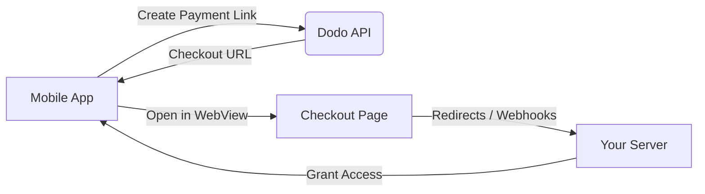

## 介绍

Dodo Payments 使开发者能够在 iOS 应用中销售数字商品和服务，处理复杂的方面，如税务合规、货币转换和支付。此综合指南详细说明了如何将 Dodo Payments 集成到您的 iOS 应用中，特别是针对 SaaS 工具、内容订阅和数字实用程序。

## 概述

Dodo Payments 作为您的 **Merchant of Record (MoR)**，管理您数字业务的关键方面：

<Tabs>
<Tab title="What We Handle">
- 税收征收与缴纳（增值税、商品及服务税及其他地区税）
- 根据政策和本地支付方式进行全球支付
- 货币兑换与外汇
- 拒付与防欺诈
- 最终客户开票与收据
- 遵守地区法规
</Tab>

<Tab title="What You Get">
- 提供统一的 Web 与移动平台 API
- 支持应用内结账（UPI、卡片、钱包、先买后付）
- 支持全球支付（Payoneer、Wise、本地银行转账）
- 分析与报告仪表盘
- 安全的支付处理
</Tab>
</Tabs>

## 使用案例

<CardGroup cols={2}>
<Card title="Subscriptions" icon="repeat">
- 高级内容或功能访问
- 提供灵活选项的周期性计费、免费试用、按比例计费、升级或降级
</Card>

<Card title="Courses and Learning" icon="graduation-cap">
- 按课程付费访问
- 捆绑内容包
- 终身或可续订许可
- 进度跟踪集成
</Card>

<Card title="Digital Downloads" icon="download">
- 一次性购买（PDF、音乐、工具）
- 数字资产交付
- 许可证密钥管理
</Card>

<Card title="SaaS Tools" icon="screwdriver-wrench">
- 软件即服务订阅
- 基于使用量计费
- 团队与企业计划
</Card>
</CardGroup>

## 集成流程

您可以使用我们的托管结账或应用内浏览器解决方案将 Dodo Payments 集成到您的应用中。

### 集成步骤

<Steps>
<Step title="Mobile App to Dodo API">
流程始于移动应用通过与 Dodo API 交互创建支付链接。
</Step>

<Step title="Dodo API to Mobile App">
Dodo API 将一个结账 URL 返回给移动应用。
</Step>

<Step title="Mobile App to Checkout Page">
移动应用随后在 WebView 中打开此结账 URL，引导用户进入结账页面。
</Step>

<Step title="Checkout Page to Your Server">
完成结账流程后，结账页面通过重定向或 webhook 与您的服务器通信。
</Step>

<Step title="Your Server to Mobile App">
最后，您的服务器授予所购内容或服务的访问权限，将交易周期在移动应用中完成。
</Step>
</Steps>

<Card title="Mobile Integration Guide" icon="mobile" href="/developer-resources/mobile-integration">
如需完整的开发者演练，请参阅我们的移动集成指南。
</Card>

## 区域可用性

Dodo Payments 仅在 Apple 明确允许外部支付的 App Store 区域，或在监管机构或法院命令要求的情况下启用替代应用内购买流程。

### 支持的区域

<AccordionGroup>
<Accordion title="United States">
在当前法院命令和 Apple 更新指南允许的范围内提供支持。

- 在特定法院授权条款下可用
- 取决于 Apple 是否符合法律要求
- 必须遵循 Apple 的实施指南
</Accordion>

<Accordion title="European Union (EU) App Store">
通过 Apple 的欧盟替代条款和外部购买授权提供支持。

- 通过 Apple 的欧盟替代条款启用
- 需获得外部购买授权批准
- 必须满足欧盟数字市场法案的要求
</Accordion>

<Accordion title="South Korea">
通过针对韩国专用二进制文件的 StoreKit 外部购买授权提供支持。

- 可通过 StoreKit 外部购买授权获得
- 需要适用于韩国的应用二进制文件
- 必须遵守韩国电信法
</Accordion>
</AccordionGroup>

<Warning>
在为任何店面启用 Dodo Payments 之前，请务必审查并遵守 Apple 的地区性授权和 App Store Connect 要求。在不支持的地区使用替代支付流程可能导致应用被拒绝或下架。
</Warning>

<Note>
对于某些商业模式（如服务或特定类别内容），Apple 可能根本不要求使用应用内购买（IAP）。Dodo Payments 也支持这些模式。请始终核实您的应用分类及 Apple 的最新指南，以判断 IAP 是否对您的使用情景为强制要求。
</Note>

### 了解更多

有关全球政策、法律先例和绕过 App Store 费用的战略方法的详细信息，请参阅我们的综合指南：

<Card title="Bypassing App Store & Play Store Fees: A Strategic and Legal Playbook" icon="shield-check" href="/features/bypassing-app-store-fees">
了解在何处以及如何合法实施替代支付流程，并获取最新的地区指南与合规提示。
</Card>