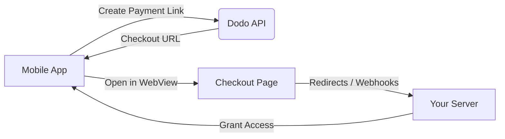

## 介绍

Dodo Payments 使开发者能够在 iOS 应用中销售数字商品和服务，处理复杂的方面，如税务合规、货币转换和支付。此综合指南详细说明了如何将 Dodo Payments 集成到您的 iOS 应用中，特别是针对 SaaS 工具、内容订阅和数字实用程序。

## 概述

Dodo Payments 作为您的 **Merchant of Record (MoR)**，管理您数字业务的关键方面：

<Tabs>
<Tab title="我们处理的内容">
- 税收收集和汇款（增值税、商品和服务税及其他地区税）
- 根据政策和当地支付方式进行全球支付
- 货币转换和外汇
- 退款和防欺诈
- 最终客户发票和收据
- 遵守地区法规
</Tab>

<Tab title="您获得的内容">
- 适用于网页和移动平台的统一 API
- 支持应用内结账（UPI、卡、钱包、BNPL）
- 全球支付支持（Payoneer、Wise、本地银行转账）
- 分析和报告仪表板
- 安全的支付处理
</Tab>
</Tabs>

## 使用案例

<CardGroup cols={2}>
<Card title="订阅" icon="repeat">
- 高级内容或功能访问
- 灵活选项的定期计费，免费试用、按比例计费或升级和降级
</Card>

<Card title="课程和学习" icon="graduation-cap">
- 按课程付费访问
- 捆绑内容包
- 终身或可续订许可证
- 进度跟踪集成
</Card>

<Card title="数字下载" icon="download">
- 一次性购买（PDF、音乐、工具）
- 数字资产交付
- 许可证密钥管理
</Card>

<Card title="SaaS 工具" icon="screwdriver-wrench">
- 软件即服务订阅
- 基于使用的计费
- 团队和企业计划
</Card>
</CardGroup>

## 集成流程

您可以使用我们的托管结账或应用内浏览器解决方案将 Dodo Payments 集成到您的应用中。

### 集成步骤

<Steps>
<Step title="移动应用到 Dodo API">
该过程从移动应用通过与 Dodo API 交互创建支付链接开始。
</Step>

<Step title="Dodo API 到移动应用">
Dodo API 通过向移动应用提供结账 URL 进行响应。
</Step>

<Step title="移动应用到结账页面">
移动应用随后在 WebView 中打开此结账 URL，引导用户到结账页面。
</Step>

<Step title="结账页面到您的服务器">
完成结账过程后，结账页面通过重定向或 Webhook 与您的服务器进行通信。
</Step>

<Step title="您的服务器到移动应用">
最后，您的服务器授予对购买内容或服务的访问权限，完成移动应用中的交易周期。
</Step>
</Steps>

<Card title="移动集成指南" icon="mobile" href="/developer-resources/mobile-integration">
有关完整的开发者指南，请查看我们的移动集成指南。
</Card>

## 区域可用性

Dodo Payments 仅在 Apple 明确允许外部支付的 App Store 区域，或在监管机构或法院命令要求的情况下启用替代应用内购买流程。

### 支持的区域

<AccordionGroup>
<Accordion title="美国">
在当前法院命令和 Apple 更新的指南允许的范围内支持。

- 根据特定法院命令的规定提供
- 受限于 Apple 的法律合规性
- 必须遵循 Apple 的实施指南
</Accordion>

<Accordion title="欧盟 (EU) App Store">
通过 Apple 的 EU 替代条款和外部购买权利支持。

- 通过 Apple 的 EU 替代条款启用
- 需要外部购买权利的批准
- 必须遵守 EU 数字市场法的要求
</Accordion>

<Accordion title="韩国">
通过 StoreKit 外部购买权利支持仅限于韩国的二进制文件。

- 通过 StoreKit 外部购买权利提供
- 需要特定于韩国的应用二进制文件
- 必须遵守韩国电信法
</Accordion>
</AccordionGroup>

<Warning>
在为任何商店启用 Dodo Payments 之前，请始终审查并遵守 Apple 的区域特定权利和 App Store Connect 要求。在不支持的区域使用替代支付流程可能导致应用被拒绝或删除。
</Warning>

<Note>
对于某些商业模型 - 例如服务或某些类别的内容 - Apple 可能根本不要求使用应用内购买 (IAP)。Dodo Payments 也支持这些模型。始终验证您的应用分类和 Apple 最新指南，以确定 IAP 是否对您的用例是强制性的。
</Note>

### 了解更多

有关全球政策、法律先例和绕过 App Store 费用的战略方法的详细信息，请参阅我们的综合指南：

<Card title="绕过 App Store 和 Play Store 费用：战略和法律手册" icon="shield-check" href="/features/bypassing-app-store-fees">
了解您可以合法实施替代支付流程的地点和方式，并获取最新的区域指导和合规提示。
</Card>