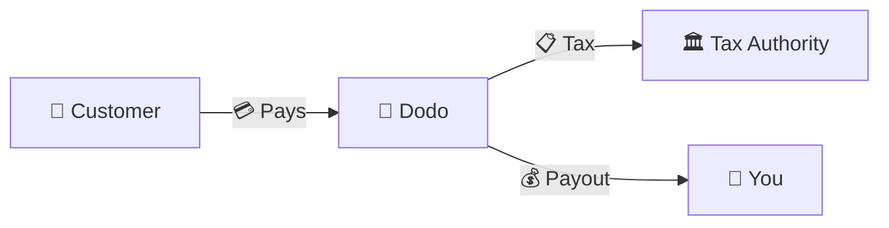
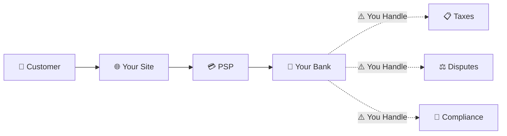
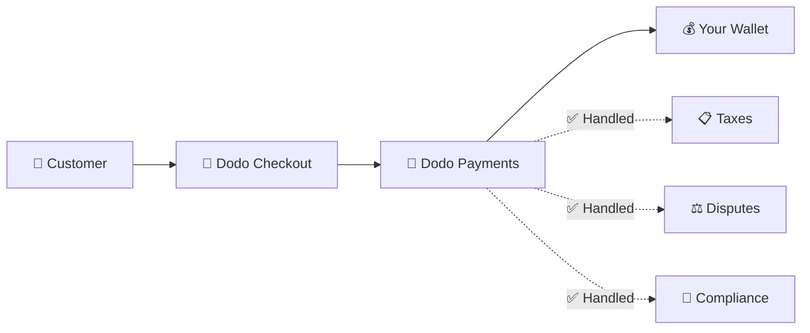
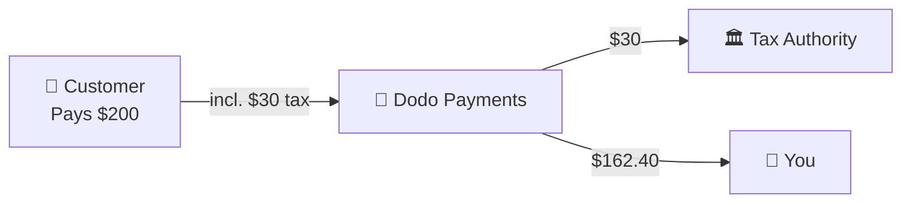

Dodo Payments 作为 **记录商 (MoR)** 运营——我们成为您数字产品的合法销售者，承担支付、税务、欺诈和合规的责任，让您可以完全专注于构建您的产品。

<CardGroup cols={3}>
<Card title="220+ 个地区" icon="globe">
税务合规自动处理
</Card>

<Card title="30+ 种支付方式" icon="credit-card">
卡片、钱包和本地支付方式
</Card>

<Card title="零税务申报" icon="file-invoice">
我们处理所有汇款
</Card>
</CardGroup>

## 什么是记录商？

**记录商** 是出现在您客户信用卡账单上的法律实体，并承担交易的责任。当您使用 Dodo Payments 作为您的 MoR 时：

- **我们是合法销售者** — Dodo 出现在银行对账单和收据上
- **您是产品创建者** — 您构建、定价和交付您的产品
- **我们处理后台事务** — 税务、争议、合规和账单支持
- **您收到净支付** — 收入直接存入您的账户

<Note>
将记录商视为雇佣一个全球财务团队，处理每个国家的开票、税务和账单——而您无需动手。
</Note>

## 为什么使用记录商？

在全球销售数字产品意味着要应对欧洲的增值税 (VAT)、澳大利亚的商品及服务税 (GST)、美国的销售税以及无数其他要求。每个管辖区都有不同的规则、税率、门槛和申报截止日期。

| 您的责任 | 没有 MoR | 使用 Dodo 作为 MoR |
|---------------------|:-----------:|:----------------:|
| VAT/GST 注册 | ❌ 您 | ✅ Dodo |
| 税务计算 | ❌ 您 | ✅ Dodo |
| 税务申报与汇款 | ❌ 您 | ✅ Dodo |
| 退单责任 | ❌ 您 | ✅ Dodo |
| PCI 合规 | ❌ 您 | ✅ Dodo |
| 多币种支持 | ❌ 复杂 | ✅ 内置 |
| 本地支付方式 | ❌ 每个集成 | ✅ 30+ 包含 |

<Tip>
**示例**：向法国客户销售 €50/月的订阅？

**没有 MoR**：注册法国增值税，收取 €60（20% 增值税），每季度提交法国申报，处理审计——用法语。

**使用 Dodo**：我们收取 €60，向法国汇款 €10 增值税，并支付给您 €50 减去费用。您只需编写代码。
</Tip>

## PSP 与 MoR：关键区别

了解 **支付服务提供商**（如 Stripe）与 **记录商** 之间的区别至关重要。

### 支付服务提供商 (PSP)

PSP 处理交易，但将您留作合法销售者：

<Warning>
使用 PSP 时，**您** 负责在每个有客户的管辖区进行税务注册、收集、申报和汇款。
</Warning>

### 记录商 (Dodo)

MoR 成为合法销售者，端到端处理合规：

<Check>
使用 Dodo 作为 MoR，我们处理税务、争议和合规。您收到净支付，无需任何文书工作。
</Check>

### 并排比较

| 方面 | PSP (Stripe 等) | MoR (Dodo) |
|--------|:------------------:|:----------:|
| 合法销售者 | 您的公司 | Dodo |
| 在客户账单上 | 您的名字 | Dodo |
| 税务注册 | ❌ 您 | ✅ Dodo |
| 税务计算 | ❌ 您 | ✅ Dodo |
| 税务汇款 | ❌ 您 | ✅ Dodo |
| 退单风险 | ❌ 您 | ✅ Dodo |
| PCI 合规 | ❌ 您 | ✅ Dodo |
| 全球设置 | 复杂 | 简单 |

<Info>
**重要**：PSP 和 MoR 都处理支付处理。关键区别在于 **谁对税务合规和交易责任负责**。
</Info>

## 税务合规如何运作

Dodo 自动处理整个税务生命周期：

<Steps>
<Step title="客户位置">
我们检测客户的国家并确定适用的税务规则——增值税、商品及服务税、销售税或其他本地要求。
</Step>

<Step title="税率计算">
根据产品类型、客户位置和 B2B/B2C 状态计算正确的税率。拥有有效增值税号码的欧盟商业客户将适用反向收费。
</Step>

<Step title="结账时收集">
税务在结账时清晰显示并收集。客户确切知道他们支付的金额。
</Step>

<Step title="申报与汇款">
我们按计划提交申报并向相关当局支付收集的税款。您从未见过税务表格。
</Step>
</Steps>

## 收入流动

以下是资金从客户流向您账户的方式：

### 示例支付明细

| 项目 | 金额 |
|-----------|-------:|
| 客户支付 | $200.00 |
| 销售税 (15% 增值税) | −$30.00 |
| Dodo 平台费用 (4%) | −$8.00 |
| 支付处理 | −$0.60 |
| **您的支付** | **$162.40** |

## 何时选择 MoR 与 PSP

<Tabs>
<Tab title="选择 Dodo (MoR)">
**如果您：**

- 销售数字产品、SaaS 或订阅
- 在多个国家有客户
- 想避免税务注册的麻烦
- 更喜欢可预测的外包合规
- 重视快速上市而非最大控制
- 不想管理争议和欺诈
</Tab>

<Tab title="考虑 PSP">
**如果您：**

- 主要在一个国家运营
- 拥有内部财务和合规团队
- 需要对结账用户体验的绝对控制
- 在极薄的利润中工作
- 销售实物商品（MoR 专注于数字产品）
</Tab>
</Tabs>

<Note>
许多企业从 PSP 开始，随着国际扩展转向 MoR。Dodo 提供迁移支持，使这一过渡无缝进行。
</Note>

## 常见问题

<AccordionGroup>
<Accordion title="我客户的信用卡账单上会显示什么？">
Dodo Payments 作为商家出现。我们在字符限制允许的情况下包含您的产品/品牌参考，客户会收到显示您产品信息的详细收据。
</Accordion>

<Accordion title="我仍然拥有客户关系吗？">
是的。您控制定价、品牌、产品交付和直接沟通。Dodo 处理账单机制，但客户知道他们是向您购买的。您的品牌在结账、电子邮件和发票中显著显示。
</Accordion>

<Accordion title="B2B 增值税反向收费如何运作？">
对于欧盟的 B2B 销售，客户可以在结账时输入他们的增值税号码。我们验证并自动应用反向收费——税务转移到买方的增值税申报中，而不是被收取。
</Accordion>

<Accordion title="我可以使用自己的支付处理器吗？">
Dodo 作为一个完整的解决方案，使用我们的支付基础设施。这种集成使我们能够承担税务和欺诈责任。我们正在努力在未来提供与其他支付处理器的集成。
</Accordion>

<Accordion title="退款如何处理？">
从您的仪表板发起退款。我们以客户原始支付方式和货币处理退款。税务金额会自动调整和对账。
</Accordion>

<Accordion title="我的所得税怎么办？">
Dodo 处理客户交易的 **销售税**（增值税、商品及服务税、销售税）。您仍然负责您企业的所得税、公司税和您收到的支付的税务义务。
</Accordion>

<Accordion title="我可以向哪些国家销售？">
我们接受来自 220 多个国家和地区的支付，并持续扩展。查看完整列表：

<Card title="支持的地区" icon="globe" href="/miscellaneous/list-of-countries-we-accept-payments-from">
查看我们接受支付的 220 多个国家和地区。
</Card>
</Accordion>
</AccordionGroup>

## 开始使用

<CardGroup cols={2}>
<Card title="创建账户" icon="rocket" href="https://app.dodopayments.com/signup">
免费注册并在几分钟内接受全球支付。
</Card>

<Card title="MoR 与 PG 深入分析" icon="scale-balanced" href="/features/mor-vs-pg">
详细比较及示例和用例。
</Card>

<Card title="接受政策" icon="building-shield" href="/miscellaneous/merchant-acceptance">
了解我们支持的企业。
</Card>

<Card title="与我们联系" icon="envelope" href="mailto:founders@dodopayments.com">
获得我们团队的个性化指导。
</Card>
</CardGroup>
