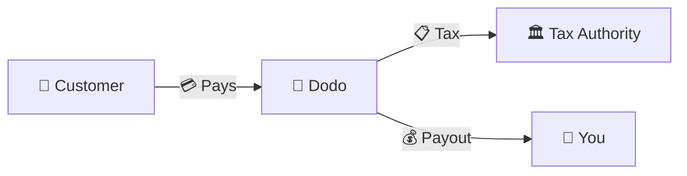
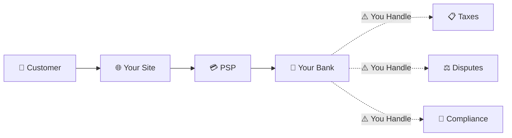
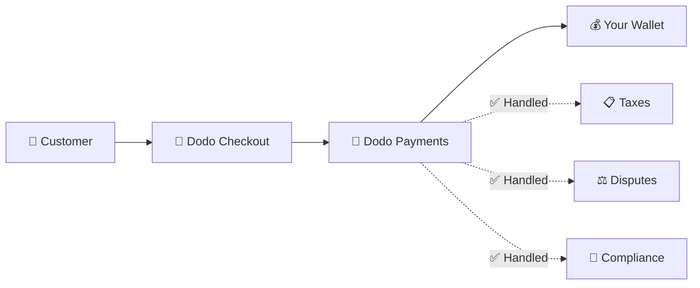
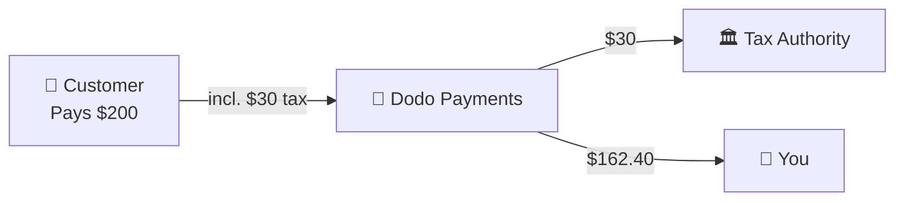

Dodo Payments 作为 **记录商 (MoR)** 运营——我们成为您数字产品的合法销售者，承担支付、税务、欺诈和合规的责任，让您可以完全专注于构建您的产品。

<CardGroup cols={3}>
<Card title="220+ Regions" icon="globe">
自动处理税务合规
</Card>

<Card title="30+ Payment Methods" icon="credit-card">
卡片、钱包和本地支付方式
</Card>

<Card title="Zero Tax Filing" icon="file-invoice">
我们处理所有的汇款
</Card>
</CardGroup>

## 什么是记录商？

**记录商** 是出现在您客户信用卡账单上的法律实体，并承担交易的责任。当您使用 Dodo Payments 作为您的 MoR 时：

- **我们是合法销售者** — Dodo 出现在银行对账单和收据上
- **您是产品创建者** — 您构建、定价和交付您的产品
- **我们处理后台事务** — 税务、争议、合规和账单支持
- **您收到净支付** — 收入直接存入您的账户

<Note>
把商户记录看作是雇佣了一个全球财务团队，他们在每个国家处理开票、税务和结算——而你无需动一根手指。
</Note>

## 为什么使用记录商？

在全球销售数字产品意味着要应对欧洲的增值税 (VAT)、澳大利亚的商品及服务税 (GST)、美国的销售税以及无数其他要求。每个管辖区都有不同的规则、税率、门槛和申报截止日期。

| 您的责任 | 没有 MoR | 使用 Dodo 作为 MoR |
|---------------------|:-----------:|:----------------:|
| VAT/GST 注册 | ❌ 您 | ✅ Dodo |
| 税务计算 | ❌ 您 | ✅ Dodo |
| 税务申报与汇款 | ❌ 您 | ✅ Dodo |
| 退单责任 | ❌ 您 | ✅ Dodo |
| PCI 合规 | ❌ 您 | ✅ Dodo |
| 多币种支持 | ❌ 复杂 | ✅ 内置 |
| 本地支付方式 | ❌ 每个集成 | ✅ 30+ 包含 |

<Tip>
**示例**：向一位法国客户销售 50 欧元/月的订阅？

**没有 MoR**：注册法国增值税，收取 €60（20% 增值税），每季度提交法国申报，处理审计——用法语。

**使用 Dodo**：我们收取 60 欧元，向法国缴纳 10 欧元的增值税，并支付给你扣除费用后的 50 欧元。你编写代码。
</Tip>

## PSP 与 MoR：关键区别

了解 **支付服务提供商**（如 Stripe）与 **记录商** 之间的区别至关重要。

### 支付服务提供商 (PSP)

PSP 处理交易，但将您留作合法销售者：

<Warning>
使用 PSP 时，**你**需要在所有有客户的司法辖区负责税务登记、征收、申报和缴纳。
</Warning>

### 记录商 (Dodo)

MoR 成为合法销售者，端到端处理合规：

<Check>
选择 Dodo 作为 MoR 后，我们负责税务、争议和合规。你收到的是净额付款，无需任何文书工作。
</Check>

### 并排比较

| 方面 | PSP (Stripe 等) | MoR (Dodo) |
|--------|:------------------:|:----------:|
| 合法销售者 | 您的公司 | Dodo |
| 在客户账单上 | 您的名字 | Dodo |
| 税务注册 | ❌ 您 | ✅ Dodo |
| 税务计算 | ❌ 您 | ✅ Dodo |
| 税务汇款 | ❌ 您 | ✅ Dodo |
| 退单风险 | ❌ 您 | ✅ Dodo |
| PCI 合规 | ❌ 您 | ✅ Dodo |
| 全球设置 | 复杂 | 简单 |

<Info>
**重要提示**：PSP 和 MoR 都负责支付处理。关键区别在于**谁在法律上承担**税务合规和交易责任。
</Info>

## 税务合规如何运作

Dodo 自动处理整个税务生命周期：

<Steps>
<Step title="Customer Location">
我们识别客户所在国家，并确定适用的税务规则——增值税、商品及服务税、销售税或其他本地要求。
</Step>

<Step title="Rate Calculation">
根据产品类型、客户所在地以及 B2B/B2C 状态计算正确的税率。拥有有效 VAT 号的欧盟企业客户会自动应用反向收费。
</Step>

<Step title="Collection at Checkout">
税费在结账时清晰显示并收取。客户可以准确看到他们所支付的金额。
</Step>

<Step title="Filing & Remittance">
我们按计划提交申报表并将征收的税款支付给相关机构。你永远不会看到税务表格。
</Step>
</Steps>

## 收入流动

以下是资金从客户流向您账户的方式：

### 示例支付明细

| 项目 | 金额 |
|-----------|-------:|
| 客户支付 | $200.00 |
| 销售税 (15% 增值税) | −$30.00 |
| Dodo 平台费用 (4%) | −$8.00 |
| 支付处理 | −$0.60 |
| **您的支付** | **$162.40** |

## 何时选择 MoR 与 PSP

<Tabs>
<Tab title="Choose Dodo (MoR)">
**如果你满足以下条件，Dodo Payments 是理想选择：**

- 销售数字产品、SaaS 或订阅
- 拥有多个国家的客户
- 希望避免税务登记的麻烦
- 偏好可预测的外包合规
- 重视快速进入市场而不是最大化控制
- 不想处理争议和欺诈
</Tab>

<Tab title="Consider a PSP">
**PSP 可能更适合你，如果你：**

- 主要在一个国家运营
- 拥有内部财务和合规团队
- 需要对结账体验保持绝对控制
- 在极其微薄的利润下运营
- 销售实物商品（MoR 专注于数字产品）
</Tab>
</Tabs>

<Note>
许多企业在初期使用 PSP，随着国际化扩展再切换到 MoR。Dodo 提供迁移支持，使这一过渡无缝衔接。
</Note>

## 常见问题

<AccordionGroup>
<Accordion title="What appears on my customer's credit card statement?">
Dodo Payments 显示为商户。我们在字符限制允许的情况下包含你的产品/品牌引用，客户会收到包含你产品信息的详细收据。
</Accordion>

<Accordion title="Do I still own the customer relationship?">
是的。你控制定价、品牌、产品交付和直接沟通。Dodo 负责账单机制，但客户知道他们是在向你购买。你的品牌在结账、邮件和发票中显著展示。
</Accordion>

<Accordion title="How does B2B VAT reverse charge work?">
对于欧盟的 B2B 销售，客户可以在结账时输入他们的 VAT 号。我们会验证并自动应用反向收费——税款转由买方在其 VAT 报表中申报，而不是由我们征收。
</Accordion>

<Accordion title="Can I use my own payment processor?">
Dodo 使用我们的支付基础设施作为完整解决方案运作。正是这种集成使我们能够承担税务和欺诈责任。我们正在努力在未来提供与其他支付处理商的集成。
</Accordion>

<Accordion title="How do refunds work?">
在你的控制面板中发起退款。我们以客户原始支付方式和货币处理退款。税额会自动调整并对账。
</Accordion>

<Accordion title="What about my income tax?">
Dodo 处理客户交易中的**销售税**（VAT、GST、销售税）。你仍需对公司收入税、企业税以及你收到的付款所涉及的税务义务负责。
</Accordion>

<Accordion title="Which countries can I sell to?">
我们接受来自 220+ 个国家和地区的付款，并持续扩展。查看完整列表：

<Card title="Supported Regions" icon="globe" href="/miscellaneous/list-of-countries-we-accept-payments-from">
查看我们接受支付的所有 220+ 个国家和地区。
</Card>
</Accordion>
</AccordionGroup>

## 开始使用

<CardGroup cols={2}>
<Card title="Create Account" icon="rocket" href="https://app.dodopayments.com/signup">
免费注册，几分钟内接受全球付款。
</Card>

<Card title="MoR vs PG Deep Dive" icon="scale-balanced" href="/features/mor-vs-pg">
提供带示例和用例的详细对比。
</Card>

<Card title="Acceptance Policy" icon="building-shield" href="/miscellaneous/merchant-acceptance">
了解我们支持的企业。
</Card>

<Card title="Talk to Us" icon="envelope" href="mailto:founders@dodopayments.com">
获得我们团队的个性化指导。
</Card>
</CardGroup>
