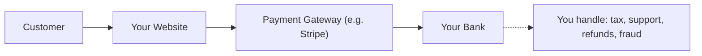
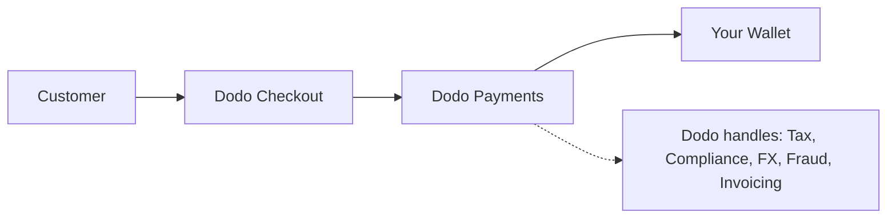

## 介绍

本指南比较了 MoR 模式与传统支付网关方法，帮助您了解 Dodo Payments 为您的业务带来的优势。

## 核心区别

| 特性                          | MoR (Dodo Payments)         | 支付网关 (传统 PG)           |
|----------------------------------|--------------------------------------------|--------------------------------------------|
| 法律卖方                     | Dodo Payments (MoR)                        | 您的公司                               |
| 税收收集与汇款     | 由 Dodo 处理                            | 您负责                        |
| 合规与监管负担  | Dodo 承担责任                     | 您处理当地法律和退款      |
| 结算货币             | 支持 USD、EUR、INR 及 25+ 其他货币    | 取决于您的商户账户           |
| 风险管理                 | 内置欺诈和退款保护   | 您自行设置工具（例如 Stripe Radar） |
| 支付                         | 聚合和简化的全球支付   | 直接从 PG 到您，需银行设置     |

## 这对您意味着什么

使用 **Dodo 作为 MoR**，我们成为您客户的法律卖方，让您可以：

- 跳过设置当地实体
- 避免处理增值税、商品及服务税或销售税
- 在全球范围内提供更多支付方式
- 降低法律风险
- 更快地在新市场推出

<Note>
想象一下向法国用户销售数字订阅。使用 Dodo Payments，我们收款、向法国当局申报增值税，并将净收入汇给您。没有税务烦恼。无需律师。只有增长。
</Note>

此外，MoR 模式简化了您整个后端办公室。作为您的 MoR，Dodo 处理 PCI 合规、欺诈检测、货币转换，甚至客户账单支持，让您的团队可以专注于产品和增长。

## 视觉比较

**收入流：支付网关**

**收入流：记录商 (Dodo)**

## 为什么这对 SaaS 和数字企业很重要

随着您的业务扩展，管理税务、合规和全球支付偏好可能会变得令人不堪重负。使用支付网关时，您需要负责：

- 在多个司法管辖区注册和申报增值税/商品及服务税
- 管理货币转换和退款
- 提供本地化的结账和支付方式

使用 Dodo Payments 作为您的 MoR：
- 您可以在不设置当地实体的情况下全球扩展
- 税务由我们为您计算、收集和汇款
- 您可以访问针对客户量身定制的支付方式库
- 我们充当您的法律缓冲和运营合作伙伴

<Tip>
“把支付网关想象成一条隧道。现在再想象一下，Merchant of Record 就像一个集隧道、列车、司机和售票员于一体的整体。”
</Tip>

## 谁应该使用 MoR？

Dodo Payments 非常适合：
- SaaS 和数字产品公司
- 独立创作者和个体创业者
- 在 100 多个国家拥有客户的全球企业
- 不想在内部管理税务和合规的公司

如果您正在国际扩展、销售订阅，或者只是想减少运营烦恼，MoR 是更明智的选择。

## 何时使用支付网关而不是 MoR

在某些情况下，仅使用支付网关可能更合适：
- 您的业务仅在一个国家运营
- 您已经拥有内部财务和合规资源
- 您需要完全控制客户账单体验
- 您对成本非常敏感，利润微薄

<Note>
对于许多初创公司来说，最初使用网关可能就足够了——但随着复杂性的增加，转向 MoR 可以节省时间、降低风险并加速国际增长。
</Note>

## 为什么选择 Dodo Payments

Dodo Payments 提供：
- 一体化的支付、税务和合规解决方案
- 实时外汇和多币种支持
- 访问 30 多种支付方式
- 基于座位的计费、订阅和一次性支付
- 在 150 多个国家的自动税务处理
- 内置的欺诈预防和 PCI 合规

无论您是独立创始人还是正在扩展的 SaaS 团队，Dodo 都简化了全球销售的复杂性。

## 了解更多

<CardGroup cols={2}>
{/* LOCKED_PATTERN_255f37658964531eef93d79ee5d8bb7a */}
了解 Dodo 如何自动以客户本地货币显示价格
</Card>

{/* LOCKED_PATTERN_9bf5b254a8af251551af21558f3421ad */}
探索通过 Dodo Payments 可使用的 30 多种支付方式
</Card>
</CardGroup>

## 准备好切换了吗？

加入 3,000 多家使用 Dodo Payments 在全球销售的数字企业，无需边界或瓶颈。

<CardGroup cols={2}>
{/* LOCKED_PATTERN_2d2ae952f85e9d3c5861b83c7818a666 */}
创建您的 Dodo Payments 账户，立即开始全球销售
</Card>

{/* LOCKED_PATTERN_f3b5e9c6689a9ef5e4b14f5eeed286a7 */}
获取来自我们团队的个性化指导
</Card>
</CardGroup>

<Tip>
让 Dodo 处理繁重事务——这样您就可以专注于打造出色的产品。
</Tip>