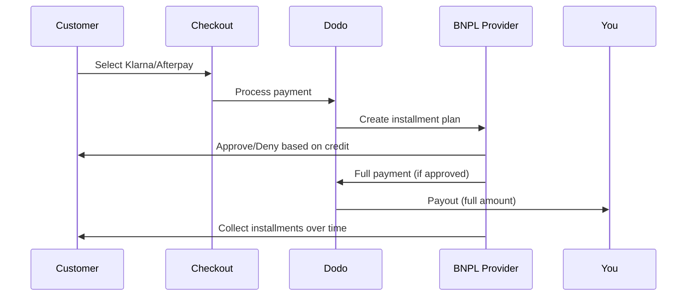

先买后付（BNPL）使客户能够将购买分成无利息的分期付款，这样可以将平均订单价值提高20-50%，并使合格交易的转化率提高10-30%。

## 为什么要提供BNPL？

<CardGroup cols={3}>
<Card title="Higher AOV" icon="chart-line">
当顾客可以分期付款时，他们会花更多钱。平均订单价值增加20-50%。
</Card>

<Card title="Better Conversion" icon="percent">
在结账时移除支付障碍。高价商品的转化率提高10-30%。
</Card>

<Card title="Zero Risk" icon="shield-check">
BNPL提供商负责信用风险与催收。您可以提前收到全额付款。
</Card>
</CardGroup>

## 支持的提供商

### Klarna

| 特性 | 详情 |
| :------ | :------ |
| **可用性** | 美国 + 19个欧洲国家 |
| **货币** | 美元（USD）、欧元（EUR）、英镑（GBP）、丹麦克朗（DKK）、挪威克朗（NOK）、瑞典克朗（SEK）、捷克克朗（CZK）、罗马尼亚列伊（RON）、波兰兹罗提（PLN）、瑞士法郎（CHF） |
| **最低金额** | $50.01（或等值） |
| **订阅** | 否 |

**支持的国家：** 奥地利、比利时、捷克共和国、丹麦、芬兰、法国、德国、希腊、爱尔兰、意大利、荷兰、挪威、波兰、葡萄牙、罗马尼亚、西班牙、瑞典、瑞士、英国、美国

**支付选项：**
- **分4期付款** — 分为4个无息付款
- **30天内付款** — 30天内全额付款到期
- **融资** — 更长期的分期付款计划

### Afterpay (Clearpay)

| 特性 | 详情 |
| :------ | :------ |
| **可用性** | 美国、英国 |
| **货币** | 美元（USD）、英镑（GBP） |
| **最低金额** | $50.01（或等值） |
| **订阅** | 否 |

**支付选项：**
- **分4期付款** — 每两周分4个无息付款

<Note>
在英国，Afterpay以“Clearpay”运营，但使用相同的API类型 (`afterpay_clearpay`)。
</Note>

### Billie

| 特性 | 详情 |
| :------ | :------ |
| **可用性** | 全球 |
| **货币** | 英镑（GBP） |
| **最低金额** | 无 |
| **订阅** | 否 |

**关于Billie：**
Billie是一个B2B的先买后付解决方案，使企业能够为客户提供灵活的付款条款。它旨在用于买家需要基于发票的付款选项的商业交易。

**支付选项：**
- **发票付款** — 在约定的付款条款内付款
- **灵活条款** — 对企业友好的付款计划

## 配置

### API方法类型

| 类型 | 提供商 |
| :--- | :------- |
| `klarna` | Klarna |
| `afterpay_clearpay` | Afterpay / Clearpay |
| `billie` | Billie (B2B) |

### 示例

```javascript
const session = await client.checkoutSessions.create({
  product_cart: [{ product_id: 'prod_123', quantity: 1 }],
  allowed_payment_method_types: [
    'klarna',
    'afterpay_clearpay',
    'credit',
    'debit'
  ],
  customer: {
    email: 'customer@example.com',
    name: 'Jane Smith'
  },
  billing_address: {
    country: 'US',
    zipcode: '10001'
  },
  return_url: 'https://example.com/success'
});
```

<Warning>
始终包括 `credit` 和 `debit` 作为兜底。不所有顾客都有资格使用 BNPL，低于 $50.01 的交易不符合条件。
</Warning>

## 最低交易金额

**Klarna和Afterpay均要求最低为$50.01 USD**（或在支持的货币中等值）。

低于此阈值的交易：
- 在结账时不会显示BNPL选项
- 不会抛出错误 — 选项只是不会显示
- 信用卡支付仍然可用

这是预期行为。对于低于 $50 的商品，别在 `allowed_payment_method_types` 中包含 BNPL。

## 分期付款如何运作



**关键要点：**
- 您会从BNPL提供商那里收到**全额付款**
- BNPL提供商处理**信用风险和催收**
- 客户直接向提供商支付**4期付款**（通常）
- **无因分期失败而产生的拒付** — 那是提供商的风险

## 测试

### Klarna测试数据

在测试模式下使用这些详细信息：

| 字段 | 批准 | 拒绝 |
| :---- | :------- | :----- |
| **出生日期** | 07-10-1970 | 07-10-1970 |
| **名** | Test | Test |
| **姓** | Person-us | Person-us |
| **电子邮件** | customer@email.us | customer+denied@email.us |
| **街道** | Amsterdam Ave | Amsterdam Ave |
| **门牌号** | 509 | 509 |
| **城市** | 纽约 | 纽约 |
| **州** | 纽约 | 纽约 |
| **邮政编码** | 10024-3941 | 10024-3941 |
| **电话** | +13106683312 | +13106354386 |

<Note>
交易必须至少 $50，Klarna 才会作为一个选项出现。
</Note>

### Afterpay测试

<Steps>
<Step title="Select Afterpay">
在结账时选择 Afterpay 并点击支付。
</Step>

<Step title="Successful payment">
使用任意有效的电子邮件和送货地址。
</Step>

<Step title="Failed authentication">
要测试失败：在重定向页面关闭 Afterpay 模态窗口。付款状态将转换为 `requires_payment_method`。
</Step>
</Steps>

## 最佳实践

<AccordionGroup>
<Accordion title="Target high-ticket items">
BNPL 最适合 $100-$1000 的商品。在该价格范围内，“分期付款”的价值主张最具吸引力。
</Accordion>

<Accordion title="Show installment amounts">
“4 次支付 $25”比“$100 用 Klarna”更吸引人。尽可能显示每次付款金额。
</Accordion>

<Accordion title="Don't force BNPL for low-value products">
低于 $50 时，BNPL 根本不会出现。低于 $100 时，大多数顾客更喜欢信用卡。应将 BNPL 推广集中在高价商品上。
</Accordion>

<Accordion title="Collect billing address">
BNPL 提供商需要账单信息用于信用检查。确保结账时收集完整地址详情。
</Accordion>

<Accordion title="Set clear expectations">
顾客应理解他们是在与 Klarna/Afterpay 签订信用协议，而不是与您。
</Accordion>
</AccordionGroup>

## 限制

### 不支持订阅
BNPL付款方式**不支持定期付款**。对于订阅产品，请使用信用卡或其他兼容的定期付款方式。

### 基于信用的批准
BNPL提供商会进行即时信用检查。并非所有客户都会获得批准。批准率取决于：
- 客户与提供商的信用历史
- 交易金额
- 客户位置

### 货币与国家映射

每种货币都限定于其对应地区：

| 货币 | 支持国家 |
| :------- | :------------------ |
| **USD** | 仅限美国 |
| **EUR** | 所有支持的欧洲国家（Austria, Belgium, Czech Republic, Denmark, Finland, France, Germany, Greece, Ireland, Italy, Netherlands, Norway, Poland, Portugal, Romania, Spain, Sweden, Switzerland） |
| **GBP** | 英国以及所有支持的欧洲国家 |

Klarna 支持的其他货币（DKK, NOK, SEK, CZK, RON, PLN, CHF）在其各自国家有效。

<Info>
例如，USD 交易仅会向美国客户显示 BNPL 选项。EUR 交易会在所有支持的欧洲国家显示 BNPL 选项。GBP 交易会向英国及所有支持的欧洲国家的客户显示 BNPL 选项。
</Info>

| 供应商 | 支持货币 |
| :------- | :------------------- |
| Klarna | USD, EUR, GBP, DKK, NOK, SEK, CZK, RON, PLN, CHF |
| Afterpay | USD (US), GBP (UK) |

## 故障排查

<AccordionGroup>
<Accordion title="BNPL not appearing at checkout">
**检查：**
1. 交易金额至少为 $50.01？
2. 顾客所在地点是否在支持国家？
3. 货币是否被 BNPL 提供商支持？
4. BNPL 方式是否包含在 `allowed_payment_method_types` 中？

**解决方案：**最常见的情况是交易低于最低值。请确认金额达到 $50.01。
</Accordion>

<Accordion title="Customer denied by BNPL provider">
**原因：**
- 与提供商的信用历史不足
- 活跃分期计划过多
- 身份验证失败

**解决方案：**这对某些客户是预期情况。请确保提供信用卡兜底。不要透露具体拒绝原因。
</Accordion>

<Accordion title="Payment stuck in pending">
**原因：**客户未完成与 BNPL 提供商的认证流程。

**解决方案：**付款会超时并失败。客户可重试或使用其他方式。
</Accordion>
</AccordionGroup>

## 相关页面

<CardGroup cols={2}>
<Card title="Payment Methods Overview" icon="credit-card" href="/features/payment-methods">
查看所有支持的支付方式。
</Card>

<Card title="Checkout Guide" icon="book" href="/developer-resources/checkout-session">
完整的结账实施指南。
</Card>

<Card title="Testing Process" icon="flask" href="/miscellaneous/testing-process">
支付方式的所有测试数据。
</Card>

<Card title="Adaptive Currency" icon="globe" href="/features/adaptive-currency">
货币支持与兑换。
</Card>
</CardGroup>