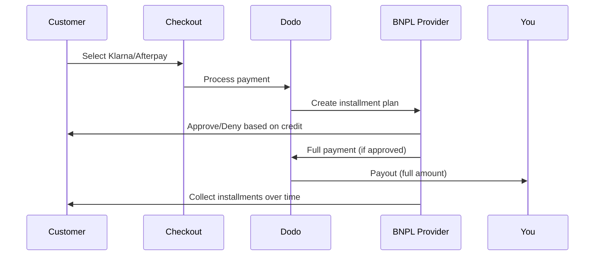

先买后付（BNPL）使客户能够将购买分成无利息的分期付款，这样可以将平均订单价值提高20-50%，并使合格交易的转化率提高10-30%。

## 为什么要提供BNPL？

<CardGroup cols={3}>
<Card title="更高的平均订单价值" icon="chart-line">
当客户可以分期付款时，他们花费更多。平均订单价值增加20-50%。
</Card>

<Card title="更好的转化率" icon="percent">
消除结账时的支付障碍。高票商品的转化率提高10-30%。
</Card>

<Card title="零风险" icon="shield-check">
BNPL提供商负责信用风险和催收。您立即收到全额付款。
</Card>
</CardGroup>

## 支持的提供商

### Klarna

| 特性 | 详情 |
| :------ | :------ |
| **可用性** | 美国 + 19个欧洲国家 |
| **货币** | 美元（USD）、欧元（EUR）、英镑（GBP）、丹麦克朗（DKK）、挪威克朗（NOK）、瑞典克朗（SEK）、捷克克朗（CZK）、罗马尼亚列伊（RON）、波兰兹罗提（PLN）、瑞士法郎（CHF） |
| **最低金额** | $50.01（或等值） |
| **订阅** | 否 |

**支持的国家：** 奥地利、比利时、捷克共和国、丹麦、芬兰、法国、德国、希腊、爱尔兰、意大利、荷兰、挪威、波兰、葡萄牙、罗马尼亚、西班牙、瑞典、瑞士、英国、美国

**支付选项：**
- **分4期付款** — 分为4个无息付款
- **30天内付款** — 30天内全额付款到期
- **融资** — 更长期的分期付款计划

### Afterpay (Clearpay)

| 特性 | 详情 |
| :------ | :------ |
| **可用性** | 美国、英国 |
| **货币** | 美元（USD）、英镑（GBP） |
| **最低金额** | $50.01（或等值） |
| **订阅** | 否 |

**支付选项：**
- **分4期付款** — 每两周分4个无息付款

<Note>
在英国，Afterpay以“Clearpay”运营，但使用相同的API类型（`afterpay_clearpay`）。
</Note>

### Billie

| 特性 | 详情 |
| :------ | :------ |
| **可用性** | 全球 |
| **货币** | 英镑（GBP） |
| **最低金额** | 无 |
| **订阅** | 否 |

**关于Billie：**
Billie是一个B2B的先买后付解决方案，使企业能够为客户提供灵活的付款条款。它旨在用于买家需要基于发票的付款选项的商业交易。

**支付选项：**
- **发票付款** — 在约定的付款条款内付款
- **灵活条款** — 对企业友好的付款计划

## 配置

### API方法类型

| 类型 | 提供商 |
| :--- | :------- |
| `klarna` | Klarna |
| `afterpay_clearpay` | Afterpay / Clearpay |
| `billie` | Billie (B2B) |

### 示例

```javascript
const session = await client.checkoutSessions.create({
  product_cart: [{ product_id: 'prod_123', quantity: 1 }],
  allowed_payment_method_types: [
    'klarna',
    'afterpay_clearpay',
    'credit',
    'debit'
  ],
  customer: {
    email: 'customer@example.com',
    name: 'Jane Smith'
  },
  billing_address: {
    country: 'US',
    zipcode: '10001'
  },
  return_url: 'https://example.com/success'
});
```

<Warning>
始终包括`credit`和`debit`作为后备。不所有客户都符合BNPL资格，且低于$50.01的交易将不符合资格。
</Warning>

## 最低交易金额

**Klarna和Afterpay均要求最低为$50.01 USD**（或在支持的货币中等值）。

低于此阈值的交易：
- 在结账时不会显示BNPL选项
- 不会抛出错误 — 选项只是不会显示
- 信用卡支付仍然可用

这是预期行为。不要在`allowed_payment_method_types`中包含BNPL，针对低于$50的产品。

## 分期付款如何运作



**关键要点：**
- 您会从BNPL提供商那里收到**全额付款**
- BNPL提供商处理**信用风险和催收**
- 客户直接向提供商支付**4期付款**（通常）
- **无因分期失败而产生的拒付** — 那是提供商的风险

## 测试

### Klarna测试数据

在测试模式下使用这些详细信息：

| 字段 | 批准 | 拒绝 |
| :---- | :------- | :----- |
| **出生日期** | 07-10-1970 | 07-10-1970 |
| **名** | Test | Test |
| **姓** | Person-us | Person-us |
| **电子邮件** | customer@email.us | customer+denied@email.us |
| **街道** | Amsterdam Ave | Amsterdam Ave |
| **门牌号** | 509 | 509 |
| **城市** | 纽约 | 纽约 |
| **州** | 纽约 | 纽约 |
| **邮政编码** | 10024-3941 | 10024-3941 |
| **电话** | +13106683312 | +13106354386 |

<Note>
交易必须至少为$50才能将Klarna作为选项显示。
</Note>

### Afterpay测试

<Steps>
<Step title="选择Afterpay">
在结账时选择Afterpay并点击支付。
</Step>

<Step title="成功付款">
使用任何有效的电子邮件和地址。
</Step>

<Step title="身份验证失败">
测试失败：在重定向页面上关闭Afterpay模态。支付状态将转为`requires_payment_method`。
</Step>
</Steps>

## 最佳实践

<AccordionGroup>
<Accordion title="目标高价值商品">
BNPL最适合价格在$100到$1000之间的产品。"分期付款"的价值主张在这个范围内最具吸引力。
</Accordion>

<Accordion title="显示分期付款金额">
"4期每笔$25"比"用Klarna支付$100"更具吸引力。尽可能显示每期付款金额。
</Accordion>

<Accordion title="不要强迫低价值产品使用BNPL">
价格低于$50，BNPL无论如何不会出现。低于$100，大多数客户更喜欢使用信用卡。将BNPL推广集中在高票商品上。
</Accordion>

<Accordion title="收集账单地址">
BNPL提供商要求账单信息以进行信用检查。确保您的结账收集完整的地址信息。
</Accordion>

<Accordion title="设置明确期望">
客户应理解，他们是与Klarna/Afterpay，而不是与您签订信用协议。
</Accordion>
</AccordionGroup>

## 限制

### 不支持订阅
BNPL付款方式**不支持定期付款**。对于订阅产品，请使用信用卡或其他兼容的定期付款方式。

### 基于信用的批准
BNPL提供商会进行即时信用检查。并非所有客户都会获得批准。批准率取决于：
- 客户与提供商的信用历史
- 交易金额
- 客户位置

### 货币限制
| 提供商 | 货币 |
| :------- | :--------- |
| Klarna | 美元（USD）、欧元（EUR）、英镑（GBP）、丹麦克朗（DKK）、挪威克朗（NOK）、瑞典克朗（SEK）、捷克克朗（CZK）、罗马尼亚列伊（RON）、波兰兹罗提（PLN）、瑞士法郎（CHF） |
| Afterpay | 美元（USD）、英镑（GBP） |

## 故障排除

<AccordionGroup>
<Accordion title="结账时BNPL未出现">
**检查：**
1. 交易金额是否至少为$50.01？
2. 客户位置是否在支持的国家？
3. 货币是否为BNPL提供商支持的货币？
4. BNPL方法是否包含在`allowed_payment_method_types`中？

**解决方案：** 最常见的是交易低于最低要求。验证金额是否满足$50.01的阈值。
</Accordion>

<Accordion title="客户被BNPL提供商拒绝">
**原因：**
- 与提供商的信用历史不足
- 活跃的分期付款计划过多
- 身份验证失败

**解决方案：** 对某些客户而言，这种情况是预期的。确保信用卡后备可用。不要暴露具体拒绝原因。
</Accordion>

<Accordion title="支付处于待处理状态">
**原因：** 客户未完成与BNPL提供商的身份验证流程。

**解决方案：** 支付将超时并失败。客户可以重试或使用其他方式。 
</Accordion>
</AccordionGroup>

## 相关页面

<CardGroup cols={2}>
<Card title="支付方式概述" icon="credit-card" href="/features/payment-methods">
查看所有支持的支付方式。
</Card>

<Card title="结账指南" icon="book" href="/developer-resources/checkout-session">
完整的结账实现指南。
</Card>

<Card title="测试过程" icon="flask" href="/miscellaneous/testing-process">
所有支付方式的测试数据。
</Card>

<Card title="自适应货币" icon="globe" href="/features/adaptive-currency">
货币支持和转换。
</Card>
</CardGroup>