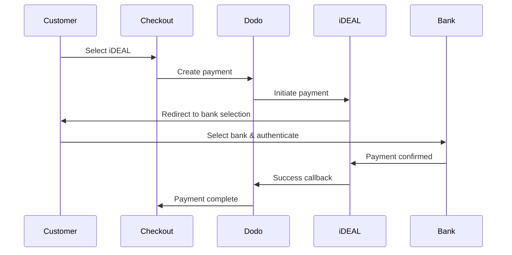

European customers strongly prefer local payment methods that integrate with their banking systems. Offering these methods can increase conversion rates by 20-40% in target markets.

## Why Local European Payment Methods?

<CardGroup cols={3}>
<Card title="Higher Conversion" icon="chart-line">
iDEAL captures ~60% of Dutch online payments. Not offering it means losing customers.
</Card>

<Card title="Lower Fraud" icon="shield-check">
Bank-authenticated payments have near-zero fraud rates and no chargebacks.
</Card>

<Card title="Real-Time Settlement" icon="bolt">
Most European methods provide instant payment confirmation.
</Card>
</CardGroup>

## Supported Methods

| Method | Country | Market Share | Currency | Subscriptions |
| :----- | :------ | :----------- | :------- | :-----------: |
| **iDEAL** | Netherlands | ~60% | EUR | No |
| **Bancontact** | Belgium | ~50% | EUR | No |
| **EPS** | Austria | ~30% | EUR | No |
| **Multibanco** | Portugal | ~40% | EUR | No |

## iDEAL (Netherlands)

iDEAL is the dominant online payment method in the Netherlands, connecting directly to all major Dutch banks.

### How It Works



### Supported Banks

All major Dutch banks are supported:
- ABN AMRO
- ASN Bank
- Bunq
- ING
- Knab
- Rabobank
- RegioBank
- Revolut
- SNS
- Triodos Bank
- Van Lanschot

### Configuration

```javascript
const session = await client.checkoutSessions.create({
  product_cart: [{ product_id: 'prod_123', quantity: 1 }],
  allowed_payment_method_types: ['ideal', 'credit', 'debit'],
  billing_currency: 'EUR',
  billing_address: {
    country: 'NL',
    zipcode: '1012JS'
  },
  return_url: 'https://example.com/success'
});
```

## Bancontact (Belgium)

Bancontact is Belgium's national payment scheme, used by virtually all Belgian banks for online payments.

### Features
- Works with existing Belgian debit cards
- Mobile app support (Payconiq by Bancontact)
- Instant payment confirmation
- No additional registration needed for customers

### Configuration

```javascript
const session = await client.checkoutSessions.create({
  product_cart: [{ product_id: 'prod_123', quantity: 1 }],
  allowed_payment_method_types: ['bancontact_card', 'credit', 'debit'],
  billing_currency: 'EUR',
  billing_address: {
    country: 'BE',
    zipcode: '1000'
  },
  return_url: 'https://example.com/success'
});
```

## EPS (Austria)

EPS (Electronic Payment Standard) enables direct online bank transfers for Austrian customers.

### Features
- Direct integration with Austrian banks
- Real-time payment confirmation
- High trust among Austrian consumers
- No chargebacks

### Supported Banks

Major Austrian banks including:
- Erste Bank
- Bank Austria
- Raiffeisen
- BAWAG
- Volksbank

### Configuration

```javascript
const session = await client.checkoutSessions.create({
  product_cart: [{ product_id: 'prod_123', quantity: 1 }],
  allowed_payment_method_types: ['eps', 'credit', 'debit'],
  billing_currency: 'EUR',
  billing_address: {
    country: 'AT',
    zipcode: '1010'
  },
  return_url: 'https://example.com/success'
});
```

## Multibanco (Portugal)

Multibanco is Portugal's interbank network, offering both online payments and ATM-based payments.

### Payment Options

1. **Online Banking** — Direct bank transfer via internet banking
2. **ATM Payment** — Customer receives a reference to pay at any Multibanco ATM
3. **Mobile Banking** — Payment via bank mobile apps

### How ATM Payment Works

For ATM payments, customers receive a payment reference:

```
Entity: 12345
Reference: 123 456 789
Amount: €50.00
Expiry: 24 hours
```

Customer can pay at any Portuguese ATM or via online banking using this reference.

### Configuration

```javascript
const session = await client.checkoutSessions.create({
  product_cart: [{ product_id: 'prod_123', quantity: 1 }],
  allowed_payment_method_types: ['multibanco', 'credit', 'debit'],
  billing_currency: 'EUR',
  billing_address: {
    country: 'PT',
    zipcode: '1000-001'
  },
  return_url: 'https://example.com/success'
});
```

<Note>
Multibanco ATM payments may have a delay between checkout and actual payment. Monitor webhooks for payment confirmation.
</Note>

## API Method Types

| Type | Method | Country |
| :--- | :----- | :------ |
| `ideal` | iDEAL | Netherlands |
| `bancontact_card` | Bancontact | Belgium |
| `eps` | EPS | Austria |
| `multibanco` | Multibanco | Portugal |

## Multi-Country European Checkout

For businesses serving multiple European countries, include all regional methods:

```javascript
const session = await client.checkoutSessions.create({
  product_cart: [{ product_id: 'prod_123', quantity: 1 }],
  allowed_payment_method_types: [
    'ideal',           // Netherlands
    'bancontact_card', // Belgium
    'eps',             // Austria
    'multibanco',      // Portugal
    'credit',          // Fallback
    'debit'            // Fallback
  ],
  billing_currency: 'EUR',
  return_url: 'https://example.com/success'
});
```

Dodo automatically shows only the relevant methods based on customer location. A Dutch customer will see iDEAL; a Belgian customer will see Bancontact.

## Testing

European payment methods can be tested in sandbox mode. The test flow simulates the bank authentication process.

<Steps>
<Step title="Enable test mode">
Use your Dodo Payments test API keys.
</Step>

<Step title="Set appropriate billing address">
Set the billing address country to match the payment method:
- `NL` for iDEAL
- `BE` for Bancontact
- `AT` for EPS
- `PT` for Multibanco
</Step>

<Step title="Complete the test flow">
Follow the simulated bank authentication flow in the test environment.
</Step>
</Steps>

## Best Practices

<AccordionGroup>
<Accordion title="Always include regional methods for target markets">
If you sell to Dutch customers, include iDEAL. Not doing so is like not accepting Visa in the US — you'll lose significant sales.
</Accordion>

<Accordion title="Match currency to region">
European payment methods require EUR. Ensure your pricing supports Euro transactions.
</Accordion>

<Accordion title="Handle redirects gracefully">
All European methods involve redirects to bank sites. Ensure your return URL handling is robust and accounts for users who abandon mid-flow.
</Accordion>

<Accordion title="Provide card fallbacks">
Not all European customers have access to these regional methods (tourists, expats, etc.). Always include `credit` and `debit` as fallbacks.
</Accordion>

<Accordion title="Consider Multibanco timing">
Multibanco ATM payments may take hours to complete. Don't block fulfillment on immediate payment — use webhooks for async confirmation.
</Accordion>
</AccordionGroup>

## Troubleshooting

<AccordionGroup>
<Accordion title="European method not appearing">
**Check:**
1. Customer billing country matches method's country?
2. Currency set to EUR?
3. Method included in `allowed_payment_method_types`?

**Solution:** European methods are strictly regional. A customer with billing country `DE` (Germany) won't see iDEAL, which is Netherlands-only.
</Accordion>

<Accordion title="Bank authentication failed">
**Causes:**
- Customer cancelled during bank authentication
- Bank's authentication system temporarily unavailable
- Customer entered incorrect credentials

**Solution:** Customer should retry. If persistent, suggest trying a different payment method.
</Accordion>

<Accordion title="Redirect not completing">
**Causes:**
- Customer closed browser during bank redirect
- Network issues during authentication
- Return URL misconfigured

**Solution:** Verify return URL is correct and accessible. Ensure it handles both success and failure states.
</Accordion>

<Accordion title="Multibanco payment pending">
**Cause:** Customer received payment reference but hasn't paid yet.

**Solution:** This is expected for ATM-based payments. Wait for webhook confirmation. Reference typically expires in 24-72 hours.
</Accordion>
</AccordionGroup>

## PSD2 Compliance

All European payment methods comply with PSD2 (Payment Services Directive 2) regulations:

- **Strong Customer Authentication (SCA)** — Built into the bank authentication flow
- **Secure Communication** — All data transmitted via secure channels
- **Consumer Protection** — Full compliance with EU consumer rights

## Related Pages

<CardGroup cols={2}>
<Card title="Payment Methods Overview" icon="credit-card" href="/features/payment-methods">
See all supported payment methods.
</Card>

<Card title="Adaptive Currency" icon="globe" href="/features/adaptive-currency">
Currency support and automatic conversion.
</Card>

<Card title="Checkout Guide" icon="book" href="/developer-resources/checkout-session">
Complete checkout implementation guide.
</Card>

<Card title="Webhooks" icon="webhook" href="/developer-resources/webhooks">
Handle payment confirmations asynchronously.
</Card>
</CardGroup>