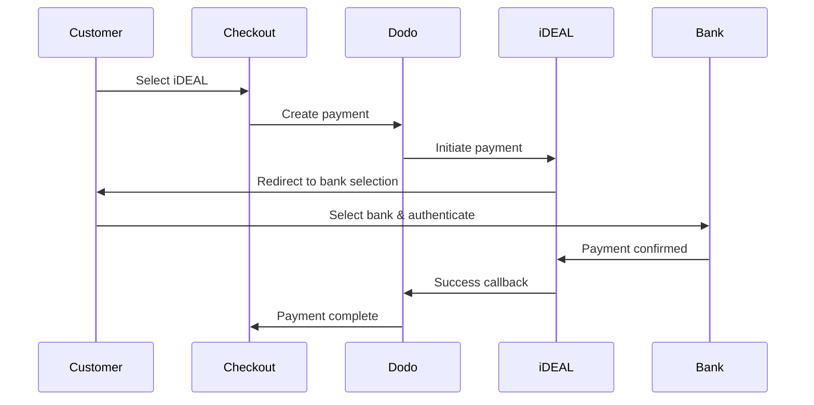

欧洲客户强烈偏好与其银行系统集成的本地支付方式。在目标市场提供这些支付方式可使转化率提高 20-40%。

## 为什么选择欧洲本地支付方式？

<CardGroup cols={3}>
<Card title="Higher Conversion" icon="chart-line">
iDEAL 占据荷兰线上支付的约 60%。如果不提供它，就意味着会失去客户。
</Card>

<Card title="Lower Fraud" icon="shield-check">
银行认证的支付几乎没有欺诈率，也没有拒付。
</Card>

<Card title="Real-Time Settlement" icon="bolt">
大多数欧洲支付方式提供即时支付确认。
</Card>
</CardGroup>

## 支持的支付方式

| 支付方式 | 国家 | 市场份额 | 货币 | 订阅 |
| :----- | :------ | :----------- | :------- | :-----------: |
| **iDEAL** | Netherlands | ~60% | EUR | No |
| **Bancontact** | Belgium | ~50% | EUR | No |
| **EPS** | Austria | ~30% | EUR | No |
| **Multibanco** | Portugal | ~40% | EUR | No |

## iDEAL（荷兰）

iDEAL 是荷兰主导的线上支付方式，直接连接到所有主要的荷兰银行。

### 其工作方式



### 支持的银行

所有主要的荷兰银行均受支持：
- ABN AMRO
- ASN Bank
- Bunq
- ING
- Knab
- Rabobank
- RegioBank
- Revolut
- SNS
- Triodos Bank
- Van Lanschot

### 配置

```javascript
const session = await client.checkoutSessions.create({
  product_cart: [{ product_id: 'prod_123', quantity: 1 }],
  allowed_payment_method_types: ['ideal', 'credit', 'debit'],
  billing_currency: 'EUR',
  billing_address: {
    country: 'NL',
    zipcode: '1012JS'
  },
  return_url: 'https://example.com/success'
});
```

## Bancontact（比利时）

Bancontact 是比利时的国家支付方案，几乎所有比利时银行都用于线上支付。

### 特性
- 兼容现有的比利时借记卡
- 支持移动应用（Payconiq by Bancontact）
- 即时支付确认
- 客户无需额外注册

### 配置

```javascript
const session = await client.checkoutSessions.create({
  product_cart: [{ product_id: 'prod_123', quantity: 1 }],
  allowed_payment_method_types: ['bancontact_card', 'credit', 'debit'],
  billing_currency: 'EUR',
  billing_address: {
    country: 'BE',
    zipcode: '1000'
  },
  return_url: 'https://example.com/success'
});
```

## EPS（奥地利）

EPS（电子支付标准）使奥地利客户能够进行直接的线上银行转账。

### 特性
- 与奥地利银行直接集成
- 实时支付确认
- 奥地利消费者高度信任
- 无拒付

### 支持的银行

包括以下主要奥地利银行：
- Erste Bank
- Bank Austria
- Raiffeisen
- BAWAG
- Volksbank

### 配置

```javascript
const session = await client.checkoutSessions.create({
  product_cart: [{ product_id: 'prod_123', quantity: 1 }],
  allowed_payment_method_types: ['eps', 'credit', 'debit'],
  billing_currency: 'EUR',
  billing_address: {
    country: 'AT',
    zipcode: '1010'
  },
  return_url: 'https://example.com/success'
});
```

## Multibanco（葡萄牙）

Multibanco 是葡萄牙的银行间网络，提供线上支付和基于 ATM 的支付。

### 支付选项

1. **网上银行** — 通过互联网银行进行直接转账
2. **ATM 支付** — 客户收到参考号，可在任意 Multibanco ATM 支付
3. **移动银行** — 通过银行移动应用支付

### ATM 支付如何运作

对于 ATM 支付，客户会收到一个支付参考：

```
Entity: 12345
Reference: 123 456 789
Amount: €50.00
Expiry: 24 hours
```

客户可以使用此参考在任意葡萄牙 ATM 或通过网上银行支付。

### 配置

```javascript
const session = await client.checkoutSessions.create({
  product_cart: [{ product_id: 'prod_123', quantity: 1 }],
  allowed_payment_method_types: ['multibanco', 'credit', 'debit'],
  billing_currency: 'EUR',
  billing_address: {
    country: 'PT',
    zipcode: '1000-001'
  },
  return_url: 'https://example.com/success'
});
```

<Note>
Multibanco ATM 支付在结账与实际支付之间可能存在延迟。请监控 webhook 以获取支付确认。
</Note>

## API 方法类型

| 类型 | 方法 | 国家 |
| :--- | :----- | :------ |
| `ideal` | iDEAL | Netherlands |
| `bancontact_card` | Bancontact | Belgium |
| `eps` | EPS | Austria |
| `multibanco` | Multibanco | Portugal |

## 多国家欧洲结账

对于服务多个欧洲国家的企业，请包含所有区域性支付方式：

```javascript
const session = await client.checkoutSessions.create({
  product_cart: [{ product_id: 'prod_123', quantity: 1 }],
  allowed_payment_method_types: [
    'ideal',           // Netherlands
    'bancontact_card', // Belgium
    'eps',             // Austria
    'multibanco',      // Portugal
    'credit',          // Fallback
    'debit'            // Fallback
  ],
  billing_currency: 'EUR',
  return_url: 'https://example.com/success'
});
```

Dodo 会根据客户位置自动显示相关的支付方式。荷兰客户将看到 iDEAL；比利时客户将看到 Bancontact。

## 测试

欧洲支付方式可以在沙盒模式中测试。测试流程会模拟银行认证过程。

<Steps>
<Step title="Enable test mode">
使用您的 Dodo Payments 测试 API 密钥。
</Step>

<Step title="Set appropriate billing address">
将账单地址国家设置为与支付方式匹配：
- `NL`（适用于 iDEAL）
- `BE`（适用于 Bancontact）
- `AT`（适用于 EPS）
- `PT`（适用于 Multibanco）
</Step>

<Step title="Complete the test flow">
在测试环境中遵循模拟的银行认证流程。
</Step>
</Steps>

## 最佳实践

<AccordionGroup>
<Accordion title="Always include regional methods for target markets">
如果您面向荷兰客户销售，请务必包含 iDEAL。不这样做就像在美国不接受 Visa 一样——您会失去大量销售。
</Accordion>

<Accordion title="Match currency to region">
欧洲支付方式需要欧元。请确认您的定价支持欧元交易。
</Accordion>

<Accordion title="Handle redirects gracefully">
所有欧洲支付方式都会重定向至银行网站。请确保您的返回 URL 处理稳健，并考虑在流程中途放弃的用户。
</Accordion>

<Accordion title="Provide card fallbacks">
并非所有欧洲客户都可以使用这些地区支付方式（游客、外籍人士等）。务必将 `credit` 和 `debit` 作为备选。
</Accordion>

<Accordion title="Consider Multibanco timing">
Multibanco ATM 支付可能需要数小时才能完成。不要因等待即时支付而阻止履约——请使用 webhook 进行异步确认。
</Accordion>
</AccordionGroup>

## 故障排除

<AccordionGroup>
<Accordion title="European method not appearing">
**检查：**
1. 客户账单国家是否与支付方式国家匹配？
2. 是否设置为欧元？
3. 支付方式是否包含在 `allowed_payment_method_types` 中？

**解决方案：** 欧洲支付方式严格按区域划分。账单国家为 `DE`（德国）的客户不会看到仅限荷兰的 iDEAL。
</Accordion>

<Accordion title="Bank authentication failed">
**原因：**
- 客户在银行认证过程中取消
- 银行认证系统临时不可用
- 客户输入了错误的凭据

**解决方案：** 客户应重试。如问题持续，建议尝试其他支付方式。
</Accordion>

<Accordion title="Redirect not completing">
**原因：**
- 客户在银行重定向期间关闭浏览器
- 认证过程中网络出现问题
- 返回 URL 配置错误

**解决方案：** 确认返回 URL 正确且可访问。确保其处理成功和失败状态。

<Accordion title="Multibanco payment pending">
**原因：** 客户已收到支付参考但尚未付款。

**解决方案：** 这种情况在基于 ATM 的支付中是预期的。请等待 webhook 确认。参考号通常在 24-72 小时内过期。
</Accordion>
</AccordionGroup>

## PSD2 合规

所有欧洲支付方式均符合 PSD2（支付服务指令 2）法规：

- **强客户认证（SCA）** — 内置于银行认证流程中
- **安全通信** — 所有数据通过安全通道传输
- **消费者保护** — 完全遵守欧盟消费者权益

## 相关页面

<CardGroup cols={2}>
<Card title="Payment Methods Overview" icon="credit-card" href="/features/payment-methods">
查看所有支持的支付方式。
</Card>

<Card title="Adaptive Currency" icon="globe" href="/features/adaptive-currency">
货币支持和自动兑换。
</Card>

<Card title="Checkout Guide" icon="book" href="/developer-resources/checkout-session">
完整的结账实施指南。
</Card>

<Card title="Webhooks" icon="webhook" href="/developer-resources/webhooks">
异步处理支付确认。
</Card>
</CardGroup>