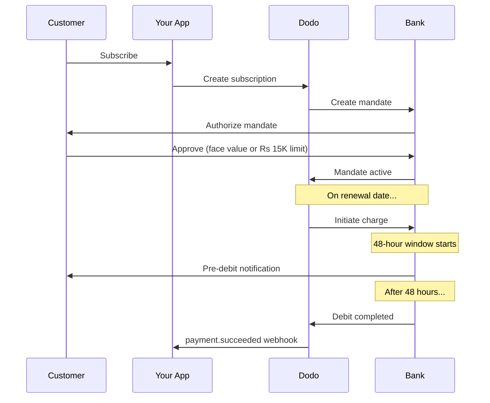

印度有独特的支付基础设施，以UPI（占数字交易的60%以上）和Rupay卡为主。Dodo Payments支持这两者，并完全符合RBI的订阅授权要求。

## 为什么印度支付方式重要

<CardGroup cols={3}>
<Card title="UPI Dominance" icon="mobile">
UPI 每月处理超 100 亿笔交易。许多印度客户没有国际卡。
</Card>

<Card title="Low Transaction Costs" icon="indian-rupee-sign">
UPI 的交易费用几乎为零。非常适合高频、低额交易。
</Card>

<Card title="Subscription Support" icon="repeat">
与大多数替代支付方式不同，UPI 和 Rupay 可通过 RBI 授权支持定期付款。
</Card>
</CardGroup>

## 支持的方法

| 方法 | 类型 | 订阅 | 最小金额 |
| :----- | :--- | :-----------: | :--------- |
| **UPI收款** | 二维码 / VPA | 是* | ₹1 |
| **Rupay信用卡** | 卡 | 是* | ₹1 |
| **Rupay借记卡** | 卡 | 是* | ₹1 |

*订阅需要符合RBI的授权，并具有特殊处理规则。

## 配置

### API方法类型

| 类型 | 描述 |
| :--- | :---------- |
| `upi_collect` | 通过二维码或 VPA 输入使用 UPI |
| `credit` | 包括 Rupay 的信用卡 |
| `debit` | 包括 Rupay 的借记卡 |

### 示例：印度专用结账

```javascript
const session = await client.checkoutSessions.create({
  product_cart: [{ product_id: 'prod_123', quantity: 1 }],
  allowed_payment_method_types: [
    'upi_collect',
    'credit',
    'debit'
  ],
  billing_currency: 'INR',
  customer: {
    email: 'customer@example.in',
    name: 'Priya Sharma',
    phone_number: '+919876543210'
  },
  billing_address: {
    country: 'IN',
    zipcode: '560001'
  },
  return_url: 'https://example.com/success'
});
```

### UPI的要求

要在结账时显示 UPI：
1. **账单国家/地区** 必须为印度 (`IN`)
2. **货币** 必须是 INR
3. 对于非印度商户：必须启用 **自适应货币**

<Warning>
如果您是非印度商户且未启用自适应货币，则您的客户无法使用 UPI。
</Warning>

## 带有RBI授权的订阅

印度支付方式的订阅在RBI（印度储备银行）规定下运行，有独特的要求。

### RBI授权的工作原理



### 授权类型

| 订阅金额 | 授权类型 | 限制 |
| :------------------ | :----------- | :---- |
| **低于₹15,000** | 按需授权 | ₹15,000 |
| **₹15,000或以上** | 固定金额授权 | 精确订阅金额 |

**对于计划更改非常重要：**如果升级导致费用超过现有授权限制，则费用将失败，客户必须重新授权。

### 48小时处理延迟

这是与国际卡支付最大的不同：

<Steps>
<Step title="Charge Initiated (Day 0)">
在计划的续订日期，Dodo 会与银行发起扣费。
</Step>

<Step title="Pre-Debit Notification">
客户会从其银行收到即将扣款的通知。
</Step>

<Step title="48-Hour Window">
客户可以在此期间通过银行应用取消授权。
</Step>

<Step title="Debit Completed (~48-51 hours)">
48 小时后（加上最多 3 小时的银行处理时间），款项将被扣除。
</Step>

<Step title="Webhook Sent">
`payment.succeeded` webhook 在实际扣款后发送，而非发起时。
</Step>
</Steps>

<Warning>
**不要在发起扣费时给予权益。**请等待 `payment.succeeded` webhook，它会在计划扣费日期后约 48-51 小时到达。
</Warning>

### 处理48小时窗口

```javascript
// DON'T do this:
async function handleSubscriptionRenewal(subscription) {
  // ❌ Bad: Granting access immediately when charge is initiated
  grantPremiumAccess(subscription.customer_id);
}

// DO this:
async function handlePaymentWebhook(event) {
  if (event.type === 'payment.succeeded') {
    // ✅ Good: Only grant access after payment is confirmed
    grantPremiumAccess(event.data.customer_id);
  }
  
  if (event.type === 'payment.failed') {
    // Handle failed payment (mandate cancelled, insufficient funds)
    revokePremiumAccess(event.data.customer_id);
  }
}
```

### 为印度订阅处理Webhook事件

| 事件 | 时间 | 操作 |
| :---- | :--- | :----- |
| `subscription.active` | 委托授权已批准 | 记录订阅开始 |
| `payment.succeeded` | 收费日期后约 48 小时 | 授予/继续访问 |
| `payment.failed` | 扣款失败 | 通知客户，暂停访问 |
| `subscription.on_hold` | 付款失败 | 提示更新付款方式 |
| `subscription.active` | 付款后重新激活 | 恢复访问 |

## 测试

### UPI测试ID

| 状态 | UPI ID |
| :----- | :----- |
| 成功 | `success@upi` |
| 失败 | `failure@upi` |

### 印度卡测试号码

| 品牌 | 场景 | 卡号 | 到期 | CVV |
| :---- | :------- | :---------- | :----- | :-- |
| Visa | 成功 | `4576238912771450` | 06/32 | 123 |
| Visa | 被拒 | `4706131211212123` | 06/32 | 123 |
| Mastercard | 成功 | `5409162669381034` | 06/32 | 123 |
| Mastercard | 被拒 | `5105105105105100` | 06/32 | 123 |

## 最佳实践

<AccordionGroup>
<Accordion title="Plan for the 48-hour delay">
构建您的应用以应对扣费发起与实际付款之间的时间差。请考虑：
- 订阅访问的宽限期
- 清晰告知客户处理时间
- 基于 webhook 的履约，而非基于日期
</Accordion>

<Accordion title="Handle mandate cancellations">
客户可以随时通过其银行应用取消授权。监控 `subscription.on_hold` webhook，并提示客户重新订阅或更新付款方式。
</Accordion>

<Accordion title="Set appropriate mandate amounts">
对于可变定价（例如基于使用量），请评估 Rs 15,000 的按需授权额度是否足够。如果费用可能高于此额度，客户需要重新授权。
</Accordion>

<Accordion title="Offer UPI prominently">
对于印度客户，UPI 应为首选支付方式。由于熟悉度更高且摩擦更少，许多用户更偏爱它而非卡片。
</Accordion>
</AccordionGroup>

## 故障排除

<AccordionGroup>
<Accordion title="UPI not appearing at checkout">
**检查：**
1. 账单国家/地区设置为 `IN`？
2. 货币设置为 `INR`？
3. 如果为非印度商户：是否启用了自适应货币？
4. `upi_collect` 是否包含在 `allowed_payment_method_types` 中？

**解决方案：** 验证账单地址是否有 `country: "IN"` 和 `billing_currency: "INR"`。
</Accordion>

<Accordion title="Subscription charge failed after upgrade">
**原因：** 新扣款金额超过现有授权限额（Rs 15,000 阈值）。

**解决方案：** 客户必须更新付款方式，以建立具有正确限额的新授权。
</Accordion>

<Accordion title="Subscription on hold but customer claims they didn't cancel">
**原因：** 客户可能在 48 小时窗口期间取消了授权，或其银行拒绝了扣款。

**解决方案：** 客户需要重新授权或更新付款方式。
</Accordion>

<Accordion title="Payment deduction delayed beyond 48 hours">
**原因：** 银行 API 延迟可能会使处理时间延长 2-3 小时。

**解决方案：** 这是预期内的。构建系统以处理最长约 51 小时的可变延迟。
</Accordion>

<Accordion title="Mandate cancelled but subscription still active">
**原因：** 根据 RBI 规定的边缘情况——在处理窗口期间取消授权并不会立即取消订阅。

**解决方案：** 下一次扣款将失败，订阅将转入 `on_hold`。监控 `payment.failed` webhook。
</Accordion>
</AccordionGroup>

## 相关页面

<CardGroup cols={2}>
<Card title="Payment Methods Overview" icon="credit-card" href="/features/payment-methods">
查看所有支持的支付方式。
</Card>

<Card title="Subscriptions" icon="repeat" href="/features/subscription">
查看包含 RBI 授权的完整订阅文档。
</Card>

<Card title="Webhooks" icon="webhook" href="/developer-resources/webhooks">
处理支付事件的 webhook。
</Card>

<Card title="Testing Process" icon="flask" href="/miscellaneous/testing-process">
所有测试数据，包括 UPI ID 和印度卡片。
</Card>
</CardGroup>