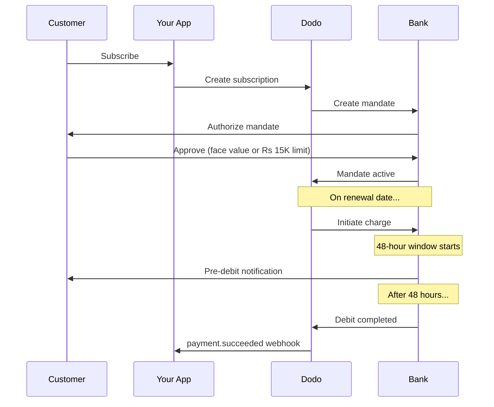

印度有独特的支付基础设施，以UPI（占数字交易的60%以上）和Rupay卡为主。Dodo Payments支持这两者，并完全符合RBI的订阅授权要求。

## 为什么印度支付方式重要

<CardGroup cols={3}>
<Card title="UPI主导地位" icon="mobile">
UPI每月处理超过100亿笔交易。许多印度客户没有国际卡。
</Card>

<Card title="低交易成本" icon="indian-rupee-sign">
UPI几乎没有交易费用。非常适合高交易量、低价值的交易。
</Card>

<Card title="订阅支持" icon="repeat">
与大多数替代支付方式不同，UPI和Rupay支持通过RBI授权的定期付款。
</Card>
</CardGroup>

## 支持的方法

| 方法 | 类型 | 订阅 | 最小金额 |
| :----- | :--- | :-----------: | :--------- |
| **UPI收款** | 二维码 / VPA | 是* | ₹1 |
| **Rupay信用卡** | 卡 | 是* | ₹1 |
| **Rupay借记卡** | 卡 | 是* | ₹1 |

*订阅需要符合RBI的授权，并具有特殊处理规则。

## 配置

### API方法类型

| 类型 | 描述 |
| :--- | :---------- |
| `upi_collect` | 通过二维码或VPA输入的UPI |
| `credit` | 包括Rupay的信用卡 |
| `debit` | 包括Rupay的借记卡 |

### 示例：印度专用结账

```javascript
const session = await client.checkoutSessions.create({
  product_cart: [{ product_id: 'prod_123', quantity: 1 }],
  allowed_payment_method_types: [
    'upi_collect',
    'credit',
    'debit'
  ],
  billing_currency: 'INR',
  customer: {
    email: 'customer@example.in',
    name: 'Priya Sharma',
    phone_number: '+919876543210'
  },
  billing_address: {
    country: 'IN',
    zipcode: '560001'
  },
  return_url: 'https://example.com/success'
});
```

### UPI的要求

为了在结账时显示UPI：
1. **账单国家**必须是印度 (`IN`)
2. **货币**必须是INR
3. 对于非印度商家：**自适应货币**必须启用

<Warning>
如果您是非印度商家且未启用自适应货币，UPI将无法提供给您的客户。
</Warning>

## 带有RBI授权的订阅

印度支付方式的订阅在RBI（印度储备银行）规定下运行，有独特的要求。

### RBI授权的工作原理



### 授权类型

| 订阅金额 | 授权类型 | 限制 |
| :------------------ | :----------- | :---- |
| **低于₹15,000** | 按需授权 | ₹15,000 |
| **₹15,000或以上** | 固定金额授权 | 精确订阅金额 |

**对于计划更改非常重要：**如果升级导致费用超过现有授权限制，则费用将失败，客户必须重新授权。

### 48小时处理延迟

这是与国际卡支付最大的不同：

<Steps>
<Step title="费用发起（第0天）">
在计划续订日期，Dodo与银行发起费用。
</Step>

<Step title="预扣通知">
客户收到来自其银行的即将扣款的通知。
</Step>

<Step title="48小时窗口">
客户可以在此期间通过其银行应用程序取消授权。
</Step>

<Step title="扣款完成（约48-51小时）">
在48小时之后（加上最多3个小时的银行处理时间），资金被扣款。
</Step>

<Step title="Webhook发送">
`payment.succeeded` webhook在实际扣款后发送，而不是在发起时。
</Step>
</Steps>

<Warning>
**请勿在费用发起时授予权益。** 请等待`payment.succeeded` webhook，它在计划扣款日期后大约48-51小时到达。
</Warning>

### 处理48小时窗口

```javascript
// DON'T do this:
async function handleSubscriptionRenewal(subscription) {
  // ❌ Bad: Granting access immediately when charge is initiated
  grantPremiumAccess(subscription.customer_id);
}

// DO this:
async function handlePaymentWebhook(event) {
  if (event.type === 'payment.succeeded') {
    // ✅ Good: Only grant access after payment is confirmed
    grantPremiumAccess(event.data.customer_id);
  }
  
  if (event.type === 'payment.failed') {
    // Handle failed payment (mandate cancelled, insufficient funds)
    revokePremiumAccess(event.data.customer_id);
  }
}
```

### 为印度订阅处理Webhook事件

| 事件 | 时间 | 操作 |
| :---- | :--- | :----- |
| `subscription.created` | 授权签署 | 记录订阅开始 |
| `payment.succeeded` | 约48小时后费用日期 | 授予/继续访问 |
| `payment.failed` | 扣款失败 | 通知客户，暂停访问 |
| `subscription.on_hold` | 付款失败 | 提示更新支付方式 |
| `subscription.active` | 付款后重新激活 | 恢复访问 |

## 测试

### UPI测试ID

| 状态 | UPI ID |
| :----- | :----- |
| 成功 | `success@upi` |
| 失败 | `failure@upi` |

### 印度卡测试号码

| 品牌 | 场景 | 卡号 | 到期 | CVV |
| :---- | :------- | :---------- | :----- | :-- |
| Visa | 成功 | `4576238912771450` | 06/32 | 123 |
| Visa | 拒绝 | `4706131211212123` | 06/32 | 123 |
| Mastercard | 成功 | `5409162669381034` | 06/32 | 123 |
| Mastercard | 拒绝 | `5105105105105100` | 06/32 | 123 |

## 最佳实践

<AccordionGroup>
<Accordion title="计划48小时延迟">
构建您的应用程序以处理费用发起与实际付款之间的间隔。考虑：
- 订阅访问的宽限期
- 清晰地向客户沟通处理时间
- 基于Webhook的履行，而不是基于日期
</Accordion>

<Accordion title="处理授权取消">
客户可以随时通过其银行应用程序取消授权。监控`subscription.on_hold` webhook，并提示客户重新订阅或更新支付方式。
</Accordion>

<Accordion title="设置适当的授权金额">
对于可变定价（例如，基于使用），考虑是否₹15,000的按需授权足够。如果费用可能超过此金额，客户需要重新授权。
</Accordion>

<Accordion title="突出提供UPI">
对于印度客户，UPI应为主要支付选项。许多用户由于熟悉度和较低摩擦，更倾向于使用UPI而不是卡。
</Accordion>
</AccordionGroup>

## 故障排除

<AccordionGroup>
<Accordion title="UPI未出现在结账时">
**检查：**
1. 账单国家设置为`IN`？
2. 货币设置为`INR`？
3. 如果是非印度商家：自适应货币启用了吗？
4. `upi_collect` 包含在 `allowed_payment_method_types` 中吗？

**解决方案：** 验证账单地址已包含`country: "IN"`和`billing_currency: "INR"`。
</Accordion>

<Accordion title="升级后订阅费用失败">
**原因：** 新费用金额超过现有授权限制（₹15,000阈值）。

**解决方案：** 客户必须更新支付方式，以建立具有正确限制的新授权。
</Accordion>

<Accordion title="订阅被暂停，但客户声称他们没有取消">
**原因：** 客户可能在48小时窗口中取消了授权，或者其银行拒绝了扣款。

**解决方案：** 客户需要重新授权该授权或更新其支付方式。
</Accordion>

<Accordion title="付款扣款延迟超过48小时">
**原因：** 银行API延迟可能会将处理时间延长2-3个小时。

**解决方案：** 这是预期的。构建您的系统以处理总长达约51小时的可变延迟。
</Accordion>

<Accordion title="授权被取消但订阅仍然活跃">
**原因：** 在RBI规定中的边缘情况 — 在处理窗口期间取消授权不会立即取消订阅。

**解决方案：** 下一次扣款将失败并且订阅将移动至`on_hold`。监控`payment.failed`的webhooks。
</Accordion>
</AccordionGroup>

## 相关页面

<CardGroup cols={2}>
<Card title="支付方式概述" icon="credit-card" href="/features/payment-methods">
查看所有支持的支付方式。
</Card>

<Card title="订阅" icon="repeat" href="/features/subscription">
完整的订阅文档，包括RBI授权。
</Card>

<Card title="Webhook" icon="webhook" href="/developer-resources/webhooks">
支付事件的Webhook处理。
</Card>

<Card title="测试过程" icon="flask" href="/miscellaneous/testing-process">
所有测试数据，包括UPI ID和印度卡。
</Card>
</CardGroup>