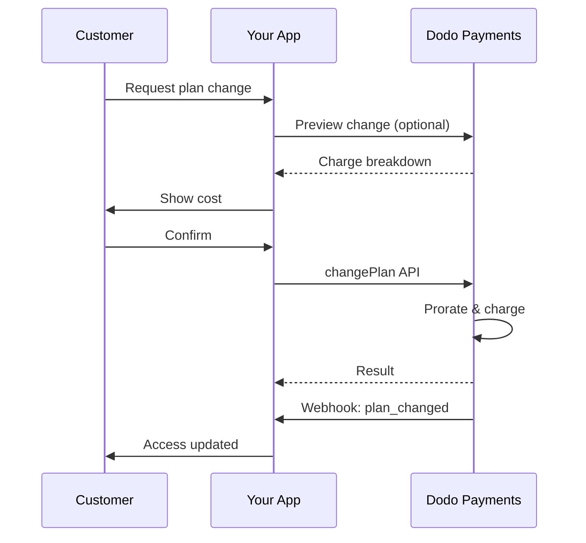
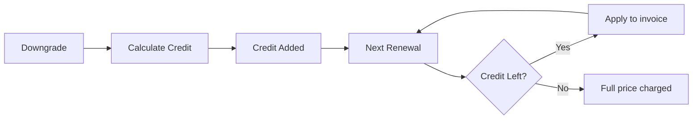

<Info>
订阅让您销售持续访问并自动续订。使用灵活的计费周期、免费试用、计划变更和附加组件，为每位客户定制价格。
</Info>

<CardGroup cols={2}>
<Card title="Upgrade & Downgrade" icon="repeat" href="/developer-resources/subscription-upgrade-downgrade">
通过按比例计费和数量更新来控制计划变更。
</Card>

<Card title="On‑Demand Subscriptions" icon="bolt" href="/developer-resources/ondemand-subscriptions">
现在授权 mandate，稍后按照自定义金额收费。
</Card>

<Card title="Customer Portal" icon="id-card" href="/features/customer-portal">
让客户自行管理计划、计费和取消。
</Card>

<Card title="Subscription Webhooks" icon="code" href="/developer-resources/webhooks/intents/subscription">
响应诸如创建、续订和取消等生命周期事件。
</Card>
</CardGroup>

## 什么是订阅？

订阅是客户按计划购买的定期产品。它们非常适合：

- **SaaS 许可证**：应用程序、API 或平台访问
- **会员**：社区、项目或俱乐部
- **数字内容**：课程、媒体或高级内容
- **支持计划**：服务水平协议、成功包或维护

## 主要好处

- **可预测的收入**：定期计费与自动续订
- **灵活的周期**：每月、每年、自定义间隔和试用
- **计划灵活性**：升级和降级的按比例计费
- **附加选项和席位**：附加可选的、可量化的升级
- **无缝结账**：托管结账和客户门户
- **以开发者为先**：清晰的 API 用于创建、变更和使用跟踪

## 创建订阅

在您的 Dodo Payments 仪表板中创建订阅产品，然后通过结账或 API 销售它们。将产品与活动订阅分开可以让您独立版本定价、附加选项和跟踪性能。

### 订阅产品创建

在仪表板中配置字段，以定义您的订阅如何销售、续订和计费。以下部分直接映射到您在创建表单中看到的内容。

#### 产品详情

- **产品名称**（必填）：在结账、客户门户和发票中显示的名称。
- **产品描述**（必填）：在结账和发票中显示的清晰价值声明。
- **产品图片**（必填）：PNG/JPG/WebP，最大 3 MB。用于结账和发票。
- **品牌**：将产品与特定品牌关联，以便于主题和电子邮件。
- **税务类别**（必填）：选择类别（例如，SaaS）以确定税务规则。

<Tip>
选择最准确的税收类别，以确保按地区正确征税。
</Tip>

#### 定价

- **定价类型**：选择 <b>订阅</b>（本指南）。其他选项包括一次性付款和基于使用的计费。
- **价格**（必填）：基础定期价格及其货币。
- **适用折扣 (%)**：可选的百分比折扣，适用于基础价格；在结账和发票中反映。
- **每次重复付款**（必填）：续订的间隔，例如，每 1 个月。选择节奏（按月或按年）和数量。
- **订阅期限**（必填）：订阅保持有效的总期限（例如，10 年）。在此期限结束后，除非延长，否则续订将停止。
- **试用期天数**（必填）：设置试用长度（以天为单位）。使用 0 禁用试用。试用结束时会自动进行第一次收费。
- **选择附加组件**：最多附加 10 个客户可以与基础计划一起购买的附加组件。

<Warning>
更改活动产品的定价会影响新购买。现有订阅将遵循您的计划变更和按比例设定。
</Warning>

<Info>
附加组件非常适合可量化的额外项目，如席位或存储。您可以在客户更改时控制允许的数量和按比例行为。
</Info>

#### 高级设置

- **含税定价**：显示包含适用税款的价格。最终税款计算仍然因客户位置而异。
- **生成许可证密钥**：在购买后向每位客户发放唯一密钥。请参阅 <a href="/features/license-keys">许可证密钥</a> 指南。
- **数字产品交付**：在购买后自动交付文件或内容。了解更多信息，请参阅 <a href="/features/digital-product-delivery">数字产品交付</a>。
- **元数据**：附加自定义键值对以进行内部标记或客户集成。请参阅 <a href="/api-reference/metadata">元数据</a>。

<Tip>
使用元数据存储来自您系统的标识符（例如 accountId），以便稍后对事件和发票进行对账。
</Tip>

## 订阅试用

试用让客户在没有立即付款的情况下访问订阅。试用结束时会自动进行第一次收费。

### 配置试用

在产品定价部分设置 **Trial Period Days**（使用 `0` 以禁用）。创建订阅时可以覆盖此设置：

```typescript
// Via subscription creation
const subscription = await client.subscriptions.create({
  customer_id: 'cus_123',
  product_id: 'prod_monthly',
  trial_period_days: 14  // Overrides product's trial period
});

// Via checkout session
const session = await client.checkoutSessions.create({
  product_cart: [{ product_id: 'prod_monthly', quantity: 1 }],
  subscription_data: { trial_period_days: 14 }
});
```

<Warning>
`trial_period_days` 的值必须介于 0 到 10,000 天之间。
</Warning>

### 检测试用状态

<Warning>
目前没有直接字段来检测试用状态。以下是一个需要查询付款的解决方法，效率较低。我们正在研究更高效的方案。
</Warning>

要确定订阅是否在试用中，请检索该订阅的付款列表。如果有且仅有一笔金额为 0 的付款，则该订阅处于试用期：

```typescript
const subscription = await client.subscriptions.retrieve('sub_123');
const payments = await client.payments.list({
  subscription_id: subscription.subscription_id
});

// Check if subscription is in trial
const isInTrial = payments.items.length === 1 && 
                  payments.items[0].total_amount === 0;
```

### 更新试用期

通过更新 `next_billing_date` 来延长试用期：

```typescript
await client.subscriptions.update('sub_123', {
  next_billing_date: '2025-02-15T00:00:00Z'  // New trial end date
});
```

<Warning>
不能将 `next_billing_date` 设置为过去的时间。日期必须位于未来。
</Warning>

## 订阅计划变更

计划变更让您可以升级或降级订阅、调整数量或迁移到不同的产品。每次变更都会根据您选择的按比例计费模式触发立即收费。

<Tip>
您可以直接在 Dodo Payments 仪表板更改订阅计划并更新下一次账单日期。这为客户支持请求、促销升级或计划迁移提供了一种无需调用 API 的快速调整方式。
</Tip>

<Tip>
**启用自助计划变更：** 想让客户通过客户门户自行升级或降级订阅？将订阅产品添加到产品集合，并在订阅设置中启用“允许订阅更新”。
</Tip>



<Card title="Product Collections" icon="layer-group" href="/features/product-collections">
  将相关产品分组到集合中，以在客户门户中实现无缝的升级/降级路径。
</Card>

### 按比例模式

选择客户更改计划时的计费方式：

<Info>
**三种按比例模式的快速比较：**
| | `prorated_immediately` | `difference_immediately` | `full_immediately` |
|---|---|---|---|
| **Upgrade** | Prorated charge for remaining days | Full price difference charged | Full new plan price charged |
| **Downgrade** | Prorated credit for remaining days | Full price difference as credit | No credit, full charge |
| **Billing cycle** | Stays the same | Stays the same | Resets to today |
| **Best for** | Fair time-based billing | Simple tier changes | Billing cycle resets |
</Info>

<Info>
使用 `difference_immediately` 降级所获得的信用是订阅范围内的，并会自动应用于未来的续订。它们与 <a href="/features/customer-credit">客户信用</a> 不同。
</Info>

#### `prorated_immediately`
根据当前账单周期剩余时间按比例计费。最适合基于剩余时间的公平计费。

```typescript
await client.subscriptions.changePlan('sub_123', {
  product_id: 'prod_pro',
  quantity: 1,
  proration_billing_mode: 'prorated_immediately'
});
```

#### `difference_immediately`
立即收取价格差额（升级）或为未来续订增加信用（降级）。最适合简单的升级/降级场景。

```typescript
// Upgrade: charges $50 (difference between $30 and $80)
// Downgrade: credits remaining value, auto-applied to renewals
await client.subscriptions.changePlan('sub_123', {
  product_id: 'prod_pro',
  quantity: 1,
  proration_billing_mode: 'difference_immediately'
});
```

<Info>
使用 `difference_immediately` 降级获得的额度是订阅范围内的，并会自动应用于未来的续订。它们与<a href="/features/credit-based-billing">Credit-Based Billing</a> 的权益不同。
</Info>

当客户使用 `difference_immediately` 降级时，未使用的价值会成为订阅范围内的信用，自动抵消未来续订：



#### `full_immediately`
立即收取新计划全额，忽略剩余时间。最适合重置计费周期。

```typescript
await client.subscriptions.changePlan('sub_123', {
  product_id: 'prod_monthly',
  quantity: 1,
  proration_billing_mode: 'full_immediately'
});
```

<AccordionGroup>
<Accordion title="Example: Prorated upgrade calculation">

**场景**：处于基础计划（$30/月）的客户在 30 天周期的第 16 天使用 `prorated_immediately` 升级到专业计划（$80/月）。

```
Unused credit from Basic = $30 × (15 remaining / 30 total) = $15.00
Prorated cost of Pro     = $80 × (15 remaining / 30 total) = $40.00
────────────────────────────────────────────────────────────────────
Immediate charge         = $40.00 − $15.00 = $25.00
```

下一次续订在原始账单日期：**$80.00/月**。

<Tip>
有关更详细的计算示例和边缘情况，请参阅完整的 [Upgrade & Downgrade Guide](/developer-resources/subscription-upgrade-downgrade)。
</Tip>

</Accordion>
<Accordion title="Example: Downgrade credit calculation">

**场景**：处于专业计划（$80/月）的客户使用 `difference_immediately` 降级到入门计划（$20/月）。

```
Credit = Old plan − New plan = $80 − $20 = $60.00
```

这 $60 的信用会自动应用于未来续订：
- 续订 1：$20 − $20（信用）= **$0.00**（剩余 $40 信用）
- 续订 2：$20 − $20（信用）= **$0.00**（剩余 $20 信用）  
- 续订 3：$20 − $20（信用）= **$0.00**（信用消耗完毕）
- 续订 4：**$20.00**（全额）

<Info>
了解有关信用如何管理的更多信息，请参阅 [Upgrade & Downgrade Guide](/developer-resources/subscription-upgrade-downgrade)。
</Info>

</Accordion>
</AccordionGroup>

### 附加组件计划变更

在更改计划时修改附加组件。附加组件包含在按比例计算中：

```typescript
await client.subscriptions.changePlan('sub_123', {
  product_id: 'prod_pro',
  quantity: 1,
  proration_billing_mode: 'difference_immediately',
  addons: [{ addon_id: 'addon_extra_seats', quantity: 2 }]  // Add add-ons
  // addons: []  // Empty array removes all existing add-ons
});
```

<Info>
计划变更会触发即时收费。收费失败可能会将订阅移动到 `on_hold` 状态。通过 `subscription.plan_changed` webhook 事件跟踪更改。
</Info>

### 预览计划变更

在提交计划变更之前，预览确切的费用和结果订阅：

```typescript
const preview = await client.subscriptions.previewChangePlan('sub_123', {
  product_id: 'prod_pro',
  quantity: 1,
  proration_billing_mode: 'prorated_immediately'
});

// Show customer the charge before confirming
console.log('You will be charged:', preview.immediate_charge.summary);
```

<Card title="Preview Change Plan API" icon="eye" href="/api-reference/subscriptions/preview-change-plan">
  在提交之前预览计划变更。
</Card>

## 订阅状态

订阅在其生命周期中可能处于不同状态：

- **`active`**：订阅处于活跃状态并会自动续订
- **`on_hold`**：由于付款失败而暂停订阅。需要更新付款方式以重新激活
- **`cancelled`**：订阅已取消，不会续订
- **`expired`**：订阅已达到结束日期
- **`pending`**：订阅正在创建或处理中

### 挂起状态

订阅在以下情况下进入 `on_hold` 状态：

- 续订付款失败（资金不足、卡片过期等）
- 计划变更收费失败
- 支付方式授权失败

<Warning>
当订阅处于 `on_hold` 状态时，将不会自动续订。必须更新付款方式才能重新激活订阅。
</Warning>

### 从挂起状态重新激活

要重新激活处于 `on_hold` 状态的订阅，请更新付款方式。这会自动：

1. 为剩余欠款创建收费
2. 生成发票
3. 使用新的付款方式处理付款
4. 在付款成功后将订阅重新激活为 `active` 状态

```typescript
// Reactivate subscription from on_hold
const response = await client.subscriptions.updatePaymentMethod('sub_123', {
  type: 'new',
  return_url: 'https://example.com/return'
});

// For on_hold subscriptions, a charge is automatically created
if (response.payment_id) {
  console.log('Charge created:', response.payment_id);
  // Redirect customer to response.payment_link to complete payment
  // Monitor webhooks for payment.succeeded and subscription.active
}
```

<Info>
成功更新 `on_hold` 订阅的付款方式后，您将收到 `payment.succeeded`，随后是 `subscription.active` webhook 事件。
</Info>

## API 管理

<AccordionGroup>
<Accordion title="Create subscriptions">
使用 `POST /subscriptions` 以可选试用和附加组件的方式从产品中以编程方式创建订阅。

<Card title="API Reference" icon="code" href="/api-reference/subscriptions/post-subscriptions">
查看创建订阅 API。
</Card>
</Accordion>

<Accordion title="Update subscriptions">
使用 `PATCH /subscriptions/{id}` 更新数量、在下一计费日期取消或修改元数据。

<Card title="API Reference" icon="code" href="/api-reference/subscriptions/patch-subscriptions">
了解如何更新订阅详细信息。
</Card>
</Accordion>

<Accordion title="Change plans (proration)">
更改活动产品和数量，并具有按比例控制。

<Card title="API Reference" icon="code" href="/api-reference/subscriptions/change-plan">
查看计划变更选项。
</Card>
</Accordion>

<Accordion title="On‑demand charges">
对于按需订阅，按需收取特定金额。

<Card title="API Reference" icon="code" href="/api-reference/subscriptions/create-charge">
对按需订阅收费。
</Card>
</Accordion>

<Accordion title="List and retrieve">
使用 `GET /subscriptions` 列出所有订阅，使用 `GET /subscriptions/{id}` 检索单个订阅。

<Card title="API Reference" icon="code" href="/api-reference/subscriptions/get-subscriptions">
浏览列出和检索 API。
</Card>
</Accordion>

<Accordion title="Usage history">
获取计量或混合定价模型的记录使用量。

<Card title="API Reference" icon="code" href="/api-reference/subscriptions/get-usage-history">
查看使用历史 API。
</Card>
</Accordion>

<Accordion title="Update payment method">
更新订阅的付款方式。对于活跃订阅，这会更新未来续订的付款方式。对于处于 `on_hold` 状态的订阅，这会通过为剩余欠款创建收费来重新激活订阅。

<Card title="API Reference" icon="code" href="/api-reference/subscriptions/update-payment-method">
了解如何更新付款方式并重新激活订阅。
</Card>
</Accordion>
</AccordionGroup>

## 常见用例

- **SaaS 和 API**：使用附加组件（如席位或使用量）提供分层访问
- **内容和媒体**：提供带有入门试用的月度访问
- **B2B 支持计划**：带有高级支持附加组件的年度合同
- **工具和插件**：许可密钥和分版本发布

## 集成示例

### 结账会话（订阅）
创建结账会话时，包括您的订阅产品和可选附加组件：

```typescript
const session = await client.checkoutSessions.create({
  product_cart: [
    {
      product_id: 'prod_subscription',
      quantity: 1
    }
  ]
});
```

### 带按比例的计划变更
升级或降级订阅并控制按比例行为：

```typescript
await client.subscriptions.changePlan('sub_123', {
  product_id: 'prod_new',
  quantity: 1,
  proration_billing_mode: 'difference_immediately'
});
```

### 于下一账单日期取消
安排在当前账单周期结束时生效的取消：

```typescript
await client.subscriptions.update('sub_123', {
  cancel_at_next_billing_date: true
});
```

### 按需订阅
创建按需订阅，并根据需要稍后收费：

```typescript
const onDemand = await client.subscriptions.create({
  customer_id: 'cus_123',
  product_id: 'prod_on_demand',
  on_demand: true
});

await client.subscriptions.createCharge(onDemand.id, {
  amount: 4900,
  currency: 'USD',
  description: 'Extra usage for September'
});
```

### 更新活跃订阅的付款方式
更新活跃订阅的付款方式：

```typescript
// Update with new payment method
const response = await client.subscriptions.updatePaymentMethod('sub_123', {
  type: 'new',
  return_url: 'https://example.com/return'
});

// Or use existing payment method
await client.subscriptions.updatePaymentMethod('sub_123', {
  type: 'existing',
  payment_method_id: 'pm_abc123'
});
```

### 从 on_hold 重新激活订阅
重新激活因付款失败而进入挂起的订阅：

```typescript
// Update payment method - automatically creates charge for remaining dues
const response = await client.subscriptions.updatePaymentMethod('sub_123', {
  type: 'new',
  return_url: 'https://example.com/return'
});

if (response.payment_id) {
  // Charge created for remaining dues
  // Redirect customer to response.payment_link
  // Monitor webhooks: payment.succeeded → subscription.active
}
```

## 符合 RBI 要求的订阅授权

  UPI 和印度卡订阅在 RBI（印度储备银行）监管下运行，具有特定的授权要求：

  ### 授权限额

  授权类型和金额取决于您的订阅经常性收费：

  - **低于 15,000 卢比的收费：** 我们为 15,000 印度卢比创建一个按需授权。订阅金额会根据您的订阅频率定期收费，最高不超过该授权限额。
  - **15,000 卢比及以上的收费：** 我们为确切的订阅金额创建一个订阅授权（或按需授权）。

有关符合 RBI 要求的印度支付方式授权的详细信息，请参阅 <a href="/features/payment-methods/india">India Payment Methods</a> 页面。

  ### 升级和降级需考虑事项

  **重要：** 在升级或降级订阅时，请谨慎考虑授权限额：

  - 如果升级/降级导致收费金额超过 15,000 卢比，并超出现有按需支付限额，交易可能失败。
  - 在这种情况下，客户可能需要更新付款方式或再次更改订阅以建立具有正确限额的新授权。

  ### 高额收费授权

  - 客户的银行会提示其授权交易。
  - 如果客户未能授权，交易将失败，订阅将被挂起。

  - The customer will be prompted by their bank to authorize the transaction.
  - If the customer fails to authorize the transaction, the transaction will fail and the subscription will be put on hold.

  ### 48 小时处理延迟

  **处理时间线：** 印度卡和 UPI 订阅的经常性收费遵循独特的处理模式：

  - 根据您的订阅频率，在预定日期**启动**收费。
  - 客户账户的实际**扣款**仅在付款启动后**48 小时**发生。
  - 这个 48 小时窗口可能会根据银行 API 响应额外延长**2-3 小时**。

  ### 授权取消窗口

  在 48 小时处理窗口期间：

  - 客户可以通过他们的银行应用取消授权。
  - 如果客户在此期间取消授权，订阅将保持**活跃**（这是印度卡和 UPI 自动支付订阅的一个特殊情况）。
  - 然而，实际扣款可能失败，在这种情况下，我们会将订阅**挂起**。

  **特殊情况处理：** 如果您在收费启动后立即向客户提供权益、信用或订阅使用，必须在应用中适当地处理这个 48 小时窗口。考虑：

  - 延迟权益激活，直到确认付款
  - 实施宽限期或临时访问
  - 监控订阅状态以应对授权取消
  - 在应用逻辑中处理订阅挂起状态

  <Tip>
  监控订阅 webhook 以跟踪付款状态变化并处理在 48 小时窗口期间授权被取消的边缘情况。
  </Tip>

## 最佳实践

- **从清晰的层级开始**：2-3 个差异明显的计划
- **传达定价**：显示总额、按比例金额和下一次续订
- **深思熟虑地使用试用期**：通过入门流程推动转化，而不仅仅是时间
- **利用附加组件**：保持基本计划简洁，并额外销售附加项
- **测试变更**：在测试模式中验证计划变更和按比例计费

<Info>
订阅是经常性收入的灵活基础。保持简单，全面测试，并根据采纳率、流失率和拓展指标进行迭代。
</Info>