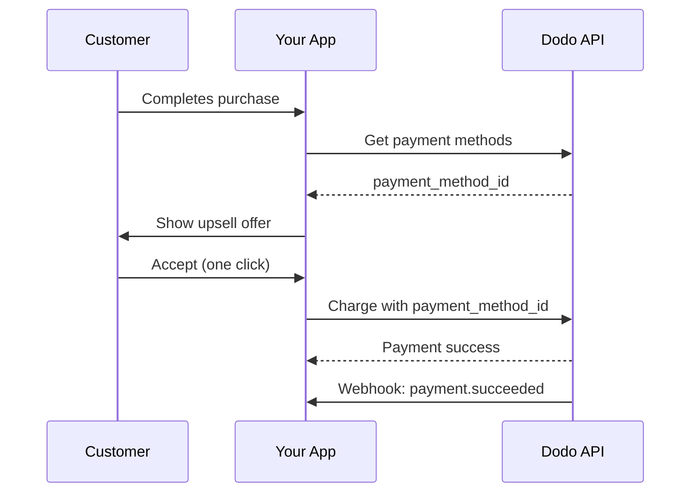
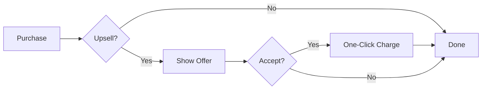
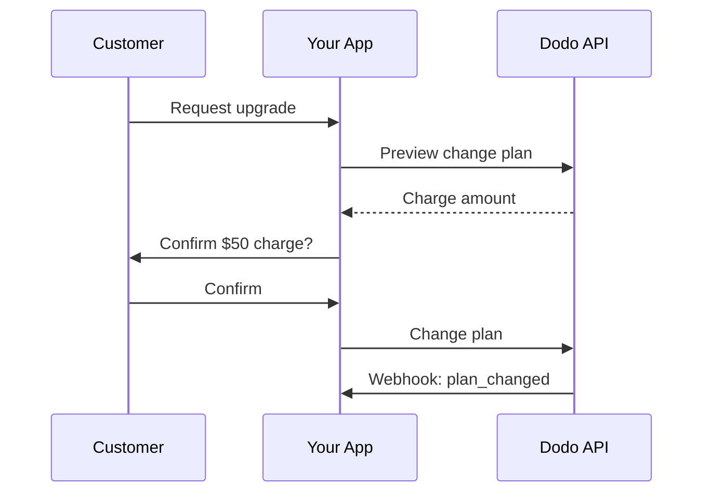
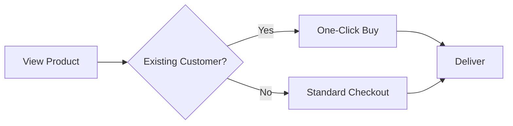

<Info>
追加销售和降级销售允许您使用客户已保存的支付方式提供附加产品或计划更改。这使得可以实现跳过支付收集的一键购买，从而显著提高转化率。
</Info>

<CardGroup cols={3}>
<Card title="Post-Purchase Upsells" icon="cart-plus">
  使用一键购买在结账后立即提供互补产品。
</Card>

<Card title="Subscription Upgrades" icon="arrow-up">
  利用自动比例分配和即时结算将客户迁移到更高层级。
</Card>

<Card title="Cross-Sells" icon="grid-2-plus">
  向现有客户添加相关产品，无需重新输入支付信息。
</Card>
</CardGroup>

## 概述

追加销售和降级销售是强大的营收优化策略：

- **追加销售**：提供更高价值的产品或升级（例如将基本计划升级到专业计划）
- **降级销售**：当客户拒绝或降级时提供低价替代选项
- **交叉销售**：建议互补产品（例如附加组件、相关商品）

Dodo Payments 通过 `payment_method_id` 参数启用这些流程，该参数使您可以在无需客户重新输入卡片详细信息的情况下收取其已保存的支付方式。

### 主要收益

| 收益 | 影响 |
|---------|--------|
| **一键购买** | 完全跳过返回客户的支付表单 |
| **更高转化率** | 在决策时刻减少摩擦 |
| **即时处理** | 使用 `confirm: true` 立即处理费用 |
| **无缝用户体验** | 客户在整个流程中始终留在您的应用内 |

## 工作原理



## 前提条件

在实施追加销售和降级销售之前，请确保您已完成以下准备工作：

<Steps>
<Step title="Customer with Saved Payment Method">
  客户必须至少完成一次购买。客户完成结账后，支付方式会自动保存。
</Step>

<Step title="Products Configured">
  在 Dodo Payments 仪表板中创建您的追加销售产品。这些可以是一次性付款、订阅或附加组件。
</Step>

<Step title="Webhook Endpoint">
  设置 Webhook 以处理 `payment.succeeded`、`payment.failed` 和 `subscription.plan_changed` 事件。
</Step>
</Steps>

## 获取客户支付方式

在提供追加销售之前，请检索客户已保存的支付方式：

<Tabs>
<Tab title="TypeScript">

```typescript
import DodoPayments from 'dodopayments';

const client = new DodoPayments({
  bearerToken: process.env.DODO_PAYMENTS_API_KEY,
  environment: 'live_mode',
});

async function getPaymentMethods(customerId: string) {
  const paymentMethods = await client.customers.listPaymentMethods(customerId);
  
  // Returns array of saved payment methods
  // Each has: payment_method_id, type, card (last4, brand, exp_month, exp_year)
  return paymentMethods;
}

// Example usage
const methods = await getPaymentMethods('cus_123');
console.log('Available payment methods:', methods);

// Use the first available method for upsell
const primaryMethod = methods[0]?.payment_method_id;
```

</Tab>

<Tab title="Python">

```python
import os
from dodopayments import DodoPayments

client = DodoPayments(
    bearer_token=os.environ.get("DODO_PAYMENTS_API_KEY"),
    environment="live_mode",
)

def get_payment_methods(customer_id: str):
    payment_methods = client.customers.list_payment_methods(customer_id)
    
    # Returns list of saved payment methods
    # Each has: payment_method_id, type, card (last4, brand, exp_month, exp_year)
    return payment_methods

# Example usage
methods = get_payment_methods("cus_123")
print("Available payment methods:", methods)

# Use the first available method for upsell
primary_method = methods[0].payment_method_id if methods else None
```

</Tab>

<Tab title="Go">

```go
package main

import (
    "context"
    "fmt"
    "github.com/dodopayments/dodopayments-go"
    "github.com/dodopayments/dodopayments-go/option"
)

func getPaymentMethods(customerID string) ([]dodopayments.PaymentMethod, error) {
    client := dodopayments.NewClient(
        option.WithBearerToken(os.Getenv("DODO_PAYMENTS_API_KEY")),
    )
    
    methods, err := client.Customers.ListPaymentMethods(
        context.TODO(),
        customerID,
    )
    if err != nil {
        return nil, err
    }
    
    return methods, nil
}

func main() {
    methods, err := getPaymentMethods("cus_123")
    if err != nil {
        panic(err)
    }
    
    fmt.Println("Available payment methods:", methods)
    
    // Use the first available method for upsell
    if len(methods) > 0 {
        primaryMethod := methods[0].PaymentMethodID
        fmt.Println("Primary method:", primaryMethod)
    }
}
```

</Tab>
</Tabs>

<Info>
支付方式在客户完成结账后会自动保存。您无需手动保存。
</Info>

## 购后的一键追加销售

在成功购买后立即提供附加产品。客户可以一键接受，因为他们的支付方式已保存。



### 实施

<Tabs>
<Tab title="TypeScript">

```typescript
import DodoPayments from 'dodopayments';

const client = new DodoPayments({
  bearerToken: process.env.DODO_PAYMENTS_API_KEY,
  environment: 'live_mode',
});

async function createOneClickUpsell(
  customerId: string,
  paymentMethodId: string,
  upsellProductId: string
) {
  // Create checkout session with saved payment method
  // confirm: true processes the payment immediately
  const session = await client.checkoutSessions.create({
    product_cart: [
      {
        product_id: upsellProductId,
        quantity: 1
      }
    ],
    customer: {
      customer_id: customerId
    },
    payment_method_id: paymentMethodId,
    confirm: true,  // Required when using payment_method_id
    return_url: 'https://yourapp.com/upsell-success',
    feature_flags: {
      redirect_immediately: true  // Skip success page
    },
    metadata: {
      upsell_source: 'post_purchase',
      original_order_id: 'order_123'
    }
  });

  return session;
}

// Example: Offer premium add-on after initial purchase
async function handlePostPurchaseUpsell(customerId: string) {
  // Get customer's payment methods
  const methods = await client.customers.listPaymentMethods(customerId);
  
  if (methods.length === 0) {
    console.log('No saved payment methods available');
    return null;
  }

  // Create the upsell with one-click checkout
  const upsell = await createOneClickUpsell(
    customerId,
    methods[0].payment_method_id,
    'prod_premium_addon'
  );

  console.log('Upsell processed:', upsell.session_id);
  return upsell;
}
```

</Tab>

<Tab title="Python">

```python
import os
from dodopayments import DodoPayments

client = DodoPayments(
    bearer_token=os.environ.get("DODO_PAYMENTS_API_KEY"),
    environment="live_mode",
)

def create_one_click_upsell(
    customer_id: str,
    payment_method_id: str,
    upsell_product_id: str
):
    """Create a one-click upsell using saved payment method."""
    
    # Create checkout session with saved payment method
    # confirm=True processes the payment immediately
    session = client.checkout_sessions.create(
        product_cart=[
            {
                "product_id": upsell_product_id,
                "quantity": 1
            }
        ],
        customer={
            "customer_id": customer_id
        },
        payment_method_id=payment_method_id,
        confirm=True,  # Required when using payment_method_id
        return_url="https://yourapp.com/upsell-success",
        feature_flags={
            "redirect_immediately": True  # Skip success page
        },
        metadata={
            "upsell_source": "post_purchase",
            "original_order_id": "order_123"
        }
    )
    
    return session

def handle_post_purchase_upsell(customer_id: str):
    """Offer premium add-on after initial purchase."""
    
    # Get customer's payment methods
    methods = client.customers.list_payment_methods(customer_id)
    
    if not methods:
        print("No saved payment methods available")
        return None
    
    # Create the upsell with one-click checkout
    upsell = create_one_click_upsell(
        customer_id=customer_id,
        payment_method_id=methods[0].payment_method_id,
        upsell_product_id="prod_premium_addon"
    )
    
    print(f"Upsell processed: {upsell.session_id}")
    return upsell
```

</Tab>

<Tab title="Go">

```go
package main

import (
    "context"
    "fmt"
    "os"
    
    "github.com/dodopayments/dodopayments-go"
    "github.com/dodopayments/dodopayments-go/option"
)

func createOneClickUpsell(
    customerID string,
    paymentMethodID string,
    upsellProductID string,
) (*dodopayments.CheckoutSession, error) {
    client := dodopayments.NewClient(
        option.WithBearerToken(os.Getenv("DODO_PAYMENTS_API_KEY")),
    )
    
    // Create checkout session with saved payment method
    // Confirm: true processes the payment immediately
    session, err := client.CheckoutSessions.Create(context.TODO(), dodopayments.CheckoutSessionCreateParams{
        ProductCart: dodopayments.F([]dodopayments.CheckoutSessionCreateParamsProductCart{
            {
                ProductID: dodopayments.F(upsellProductID),
                Quantity:  dodopayments.F(int64(1)),
            },
        }),
        Customer: dodopayments.F(dodopayments.CheckoutSessionCreateParamsCustomer{
            CustomerID: dodopayments.F(customerID),
        }),
        PaymentMethodID: dodopayments.F(paymentMethodID),
        Confirm:         dodopayments.F(true), // Required when using payment_method_id
        ReturnURL:       dodopayments.F("https://yourapp.com/upsell-success"),
        FeatureFlags: dodopayments.F(dodopayments.CheckoutSessionCreateParamsFeatureFlags{
            RedirectImmediately: dodopayments.F(true), // Skip success page
        }),
        Metadata: dodopayments.F(map[string]string{
            "upsell_source":     "post_purchase",
            "original_order_id": "order_123",
        }),
    })
    
    return session, err
}

func handlePostPurchaseUpsell(customerID string) (*dodopayments.CheckoutSession, error) {
    client := dodopayments.NewClient(
        option.WithBearerToken(os.Getenv("DODO_PAYMENTS_API_KEY")),
    )
    
    // Get customer's payment methods
    methods, err := client.Customers.ListPaymentMethods(context.TODO(), customerID)
    if err != nil {
        return nil, err
    }
    
    if len(methods) == 0 {
        fmt.Println("No saved payment methods available")
        return nil, nil
    }
    
    // Create the upsell with one-click checkout
    upsell, err := createOneClickUpsell(
        customerID,
        methods[0].PaymentMethodID,
        "prod_premium_addon",
    )
    if err != nil {
        return nil, err
    }
    
    fmt.Printf("Upsell processed: %s\n", upsell.SessionID)
    return upsell, nil
}
```

</Tab>
</Tabs>

<Warning>
使用 `payment_method_id` 时，您必须设置 `confirm: true` 并提供现有的 `customer_id`。支付方式必须属于该客户。
</Warning>

## 订阅升级

通过自动比例分配处理，将客户迁移到更高层级的订阅计划。



### 承诺前预览

始终预览计划更改，让客户明确知道将被收取的费用：

<Tabs>
<Tab title="TypeScript">

```typescript
async function previewUpgrade(
  subscriptionId: string,
  newProductId: string
) {
  const preview = await client.subscriptions.previewChangePlan(subscriptionId, {
    product_id: newProductId,
    quantity: 1,
    proration_billing_mode: 'difference_immediately'
  });

  return {
    immediateCharge: preview.immediate_charge?.summary,
    newPlan: preview.new_plan,
    effectiveDate: preview.effective_date
  };
}

// Show customer the charge before confirming
const preview = await previewUpgrade('sub_123', 'prod_pro_plan');
console.log(`Upgrade will charge: ${preview.immediateCharge}`);
```

</Tab>

<Tab title="Python">

```python
def preview_upgrade(subscription_id: str, new_product_id: str):
    preview = client.subscriptions.preview_change_plan(
        subscription_id=subscription_id,
        product_id=new_product_id,
        quantity=1,
        proration_billing_mode="difference_immediately"
    )
    
    return {
        "immediate_charge": preview.immediate_charge.summary if preview.immediate_charge else None,
        "new_plan": preview.new_plan,
        "effective_date": preview.effective_date
    }

# Show customer the charge before confirming
preview = preview_upgrade("sub_123", "prod_pro_plan")
print(f"Upgrade will charge: {preview['immediate_charge']}")
```

</Tab>

<Tab title="Go">

```go
func previewUpgrade(subscriptionID string, newProductID string) (map[string]interface{}, error) {
    client := dodopayments.NewClient(
        option.WithBearerToken(os.Getenv("DODO_PAYMENTS_API_KEY")),
    )
    
    preview, err := client.Subscriptions.PreviewChangePlan(
        context.TODO(),
        subscriptionID,
        dodopayments.SubscriptionPreviewChangePlanParams{
            ProductID:             dodopayments.F(newProductID),
            Quantity:              dodopayments.F(int64(1)),
            ProrationBillingMode:  dodopayments.F(dodopayments.ProrationBillingModeDifferenceImmediately),
        },
    )
    if err != nil {
        return nil, err
    }
    
    return map[string]interface{}{
        "immediate_charge": preview.ImmediateCharge.Summary,
        "new_plan":         preview.NewPlan,
        "effective_date":   preview.EffectiveDate,
    }, nil
}
```

</Tab>
</Tabs>

### 执行升级

<Tabs>
<Tab title="TypeScript">

```typescript
async function upgradeSubscription(
  subscriptionId: string,
  newProductId: string,
  prorationMode: 'prorated_immediately' | 'difference_immediately' | 'full_immediately' = 'difference_immediately'
) {
  const result = await client.subscriptions.changePlan(subscriptionId, {
    product_id: newProductId,
    quantity: 1,
    proration_billing_mode: prorationMode
  });

  return {
    status: result.status,
    subscriptionId: result.subscription_id,
    paymentId: result.payment_id,
    invoiceId: result.invoice_id
  };
}

// Upgrade from Basic ($30) to Pro ($80)
// With difference_immediately: charges $50 instantly
const upgrade = await upgradeSubscription('sub_123', 'prod_pro_plan');
console.log('Upgrade status:', upgrade.status);
```

</Tab>

<Tab title="Python">

```python
def upgrade_subscription(
    subscription_id: str,
    new_product_id: str,
    proration_mode: str = "difference_immediately"
):
    result = client.subscriptions.change_plan(
        subscription_id=subscription_id,
        product_id=new_product_id,
        quantity=1,
        proration_billing_mode=proration_mode
    )
    
    return {
        "status": result.status,
        "subscription_id": result.subscription_id,
        "payment_id": result.payment_id,
        "invoice_id": result.invoice_id
    }

# Upgrade from Basic ($30) to Pro ($80)
# With difference_immediately: charges $50 instantly
upgrade = upgrade_subscription("sub_123", "prod_pro_plan")
print(f"Upgrade status: {upgrade['status']}")
```

</Tab>

<Tab title="Go">

```go
func upgradeSubscription(
    subscriptionID string,
    newProductID string,
    prorationMode dodopayments.ProrationBillingMode,
) (*dodopayments.SubscriptionChangePlanResponse, error) {
    client := dodopayments.NewClient(
        option.WithBearerToken(os.Getenv("DODO_PAYMENTS_API_KEY")),
    )
    
    result, err := client.Subscriptions.ChangePlan(
        context.TODO(),
        subscriptionID,
        dodopayments.SubscriptionChangePlanParams{
            ProductID:            dodopayments.F(newProductID),
            Quantity:             dodopayments.F(int64(1)),
            ProrationBillingMode: dodopayments.F(prorationMode),
        },
    )
    
    return result, err
}

// Upgrade from Basic ($30) to Pro ($80)
// With DifferenceImmediately: charges $50 instantly
upgrade, err := upgradeSubscription(
    "sub_123",
    "prod_pro_plan",
    dodopayments.ProrationBillingModeDifferenceImmediately,
)
if err != nil {
    panic(err)
}
fmt.Printf("Upgrade status: %s\n", upgrade.Status)
```

</Tab>
</Tabs>

### 比例分配模式

选择升级时如何向客户收费：

| 模式 | 行为 | 适用场景 |
|------|----------|----------|
| `difference_immediately` | 即时收取价格差（$30→$80 = $50） | 简单升级 |
| `prorated_immediately` | 按结算周期剩余时间计费 | 公平的基于时间计费 |
| `full_immediately` | 收取全新的计划价格，忽略剩余时间 | 重置计费周期 |

<Tip>
对于直接的升级流程，请使用 `difference_immediately`。若想考虑当前计划尚未使用的时间，请使用 `prorated_immediately`。
</Tip>

## 交叉销售

向现有客户添加互补产品，无需重新输入支付信息。



### 实施

<Tabs>
<Tab title="TypeScript">

```typescript
async function createCrossSell(
  customerId: string,
  paymentMethodId: string,
  productId: string,
  quantity: number = 1
) {
  // Create a one-time payment using saved payment method
  const payment = await client.payments.create({
    product_cart: [
      {
        product_id: productId,
        quantity: quantity
      }
    ],
    customer_id: customerId,
    payment_method_id: paymentMethodId,
    return_url: 'https://yourapp.com/purchase-complete',
    metadata: {
      purchase_type: 'cross_sell',
      source: 'product_recommendation'
    }
  });

  return payment;
}

// Example: Customer bought a course, offer related ebook
async function offerRelatedProduct(customerId: string, relatedProductId: string) {
  const methods = await client.customers.listPaymentMethods(customerId);
  
  if (methods.length === 0) {
    // Fall back to standard checkout
    return client.checkoutSessions.create({
      product_cart: [{ product_id: relatedProductId, quantity: 1 }],
      customer: { customer_id: customerId },
      return_url: 'https://yourapp.com/purchase-complete'
    });
  }

  // One-click purchase
  return createCrossSell(customerId, methods[0].payment_method_id, relatedProductId);
}
```

</Tab>

<Tab title="Python">

```python
def create_cross_sell(
    customer_id: str,
    payment_method_id: str,
    product_id: str,
    quantity: int = 1
):
    """Create a one-time payment using saved payment method."""
    
    payment = client.payments.create(
        product_cart=[
            {
                "product_id": product_id,
                "quantity": quantity
            }
        ],
        customer_id=customer_id,
        payment_method_id=payment_method_id,
        return_url="https://yourapp.com/purchase-complete",
        metadata={
            "purchase_type": "cross_sell",
            "source": "product_recommendation"
        }
    )
    
    return payment

def offer_related_product(customer_id: str, related_product_id: str):
    """Offer related product with one-click purchase if possible."""
    
    methods = client.customers.list_payment_methods(customer_id)
    
    if not methods:
        # Fall back to standard checkout
        return client.checkout_sessions.create(
            product_cart=[{"product_id": related_product_id, "quantity": 1}],
            customer={"customer_id": customer_id},
            return_url="https://yourapp.com/purchase-complete"
        )
    
    # One-click purchase
    return create_cross_sell(customer_id, methods[0].payment_method_id, related_product_id)
```

</Tab>

<Tab title="Go">

```go
func createCrossSell(
    customerID string,
    paymentMethodID string,
    productID string,
    quantity int64,
) (*dodopayments.Payment, error) {
    client := dodopayments.NewClient(
        option.WithBearerToken(os.Getenv("DODO_PAYMENTS_API_KEY")),
    )
    
    payment, err := client.Payments.Create(context.TODO(), dodopayments.PaymentCreateParams{
        ProductCart: dodopayments.F([]dodopayments.PaymentCreateParamsProductCart{
            {
                ProductID: dodopayments.F(productID),
                Quantity:  dodopayments.F(quantity),
            },
        }),
        CustomerID:      dodopayments.F(customerID),
        PaymentMethodID: dodopayments.F(paymentMethodID),
        ReturnURL:       dodopayments.F("https://yourapp.com/purchase-complete"),
        Metadata: dodopayments.F(map[string]string{
            "purchase_type": "cross_sell",
            "source":        "product_recommendation",
        }),
    })
    
    return payment, err
}

func offerRelatedProduct(customerID string, relatedProductID string) (interface{}, error) {
    client := dodopayments.NewClient(
        option.WithBearerToken(os.Getenv("DODO_PAYMENTS_API_KEY")),
    )
    
    methods, err := client.Customers.ListPaymentMethods(context.TODO(), customerID)
    if err != nil {
        return nil, err
    }
    
    if len(methods) == 0 {
        // Fall back to standard checkout
        return client.CheckoutSessions.Create(context.TODO(), dodopayments.CheckoutSessionCreateParams{
            ProductCart: dodopayments.F([]dodopayments.CheckoutSessionCreateParamsProductCart{
                {ProductID: dodopayments.F(relatedProductID), Quantity: dodopayments.F(int64(1))},
            }),
            Customer:  dodopayments.F(dodopayments.CheckoutSessionCreateParamsCustomer{CustomerID: dodopayments.F(customerID)}),
            ReturnURL: dodopayments.F("https://yourapp.com/purchase-complete"),
        })
    }
    
    // One-click purchase
    return createCrossSell(customerID, methods[0].PaymentMethodID, relatedProductID, 1)
}
```

</Tab>
</Tabs>

## 订阅降级

当客户希望转到更低层级计划时，请通过自动抵扣优雅处理过渡。

### 降级如何运作

1. 客户申请降级（专业版 → 基础版）
2. 系统计算当前计划剩余价值
3. 将信用额度添加到订阅以用于未来续订
4. 客户立即迁移到新计划

<Tabs>
<Tab title="TypeScript">

```typescript
async function downgradeSubscription(
  subscriptionId: string,
  newProductId: string
) {
  // Preview the downgrade first
  const preview = await client.subscriptions.previewChangePlan(subscriptionId, {
    product_id: newProductId,
    quantity: 1,
    proration_billing_mode: 'difference_immediately'
  });

  console.log('Credit to be applied:', preview.credit_amount);

  // Execute the downgrade
  const result = await client.subscriptions.changePlan(subscriptionId, {
    product_id: newProductId,
    quantity: 1,
    proration_billing_mode: 'difference_immediately'
  });

  // Credits are automatically applied to future renewals
  return result;
}

// Downgrade from Pro ($80) to Basic ($30)
// $50 credit added to subscription, auto-applied on next renewal
const downgrade = await downgradeSubscription('sub_123', 'prod_basic_plan');
```

</Tab>

<Tab title="Python">

```python
def downgrade_subscription(subscription_id: str, new_product_id: str):
    # Preview the downgrade first
    preview = client.subscriptions.preview_change_plan(
        subscription_id=subscription_id,
        product_id=new_product_id,
        quantity=1,
        proration_billing_mode="difference_immediately"
    )
    
    print(f"Credit to be applied: {preview.credit_amount}")
    
    # Execute the downgrade
    result = client.subscriptions.change_plan(
        subscription_id=subscription_id,
        product_id=new_product_id,
        quantity=1,
        proration_billing_mode="difference_immediately"
    )
    
    # Credits are automatically applied to future renewals
    return result

# Downgrade from Pro ($80) to Basic ($30)
# $50 credit added to subscription, auto-applied on next renewal
downgrade = downgrade_subscription("sub_123", "prod_basic_plan")
```

</Tab>

<Tab title="Go">

```go
func downgradeSubscription(subscriptionID string, newProductID string) (*dodopayments.SubscriptionChangePlanResponse, error) {
    client := dodopayments.NewClient(
        option.WithBearerToken(os.Getenv("DODO_PAYMENTS_API_KEY")),
    )
    
    // Preview the downgrade first
    preview, err := client.Subscriptions.PreviewChangePlan(
        context.TODO(),
        subscriptionID,
        dodopayments.SubscriptionPreviewChangePlanParams{
            ProductID:            dodopayments.F(newProductID),
            Quantity:             dodopayments.F(int64(1)),
            ProrationBillingMode: dodopayments.F(dodopayments.ProrationBillingModeDifferenceImmediately),
        },
    )
    if err != nil {
        return nil, err
    }
    
    fmt.Printf("Credit to be applied: %v\n", preview.CreditAmount)
    
    // Execute the downgrade
    result, err := client.Subscriptions.ChangePlan(
        context.TODO(),
        subscriptionID,
        dodopayments.SubscriptionChangePlanParams{
            ProductID:            dodopayments.F(newProductID),
            Quantity:             dodopayments.F(int64(1)),
            ProrationBillingMode: dodopayments.F(dodopayments.ProrationBillingModeDifferenceImmediately),
        },
    )
    
    return result, err
}
```

</Tab>
</Tabs>

<Info>
使用 `difference_immediately` 的降级所产生的信用额度是订阅范围内的，并会自动应用于未来续订。它们不同于 [Customer Credits](/features/customer-credit)。
</Info>

## 完整示例：购后追加销售流程

以下是一个完整实现，展示如何在成功购买后提供追加销售：

<Tabs>
<Tab title="TypeScript">

```typescript
import DodoPayments from 'dodopayments';
import express from 'express';

const client = new DodoPayments({
  bearerToken: process.env.DODO_PAYMENTS_API_KEY,
  environment: 'live_mode',
});

const app = express();

// Store for tracking upsell eligibility (use your database in production)
const eligibleUpsells = new Map<string, { customerId: string; productId: string }>();

// Webhook handler for initial purchase success
app.post('/webhooks/dodo', express.raw({ type: 'application/json' }), async (req, res) => {
  const event = JSON.parse(req.body.toString());
  
  switch (event.type) {
    case 'payment.succeeded':
      // Check if customer is eligible for upsell
      const customerId = event.data.customer_id;
      const productId = event.data.product_id;
      
      // Define upsell rules (e.g., bought Basic, offer Pro)
      const upsellProduct = getUpsellProduct(productId);
      
      if (upsellProduct) {
        eligibleUpsells.set(customerId, {
          customerId,
          productId: upsellProduct
        });
      }
      break;
      
    case 'payment.failed':
      console.log('Payment failed:', event.data.payment_id);
      // Handle failed upsell payment
      break;
  }
  
  res.json({ received: true });
});

// API endpoint to check upsell eligibility
app.get('/api/upsell/:customerId', async (req, res) => {
  const { customerId } = req.params;
  const upsell = eligibleUpsells.get(customerId);
  
  if (!upsell) {
    return res.json({ eligible: false });
  }
  
  // Get payment methods
  const methods = await client.customers.listPaymentMethods(customerId);
  
  if (methods.length === 0) {
    return res.json({ eligible: false, reason: 'no_payment_method' });
  }
  
  // Get product details for display
  const product = await client.products.retrieve(upsell.productId);
  
  res.json({
    eligible: true,
    product: {
      id: product.product_id,
      name: product.name,
      price: product.price,
      currency: product.currency
    },
    paymentMethodId: methods[0].payment_method_id
  });
});

// API endpoint to accept upsell
app.post('/api/upsell/:customerId/accept', async (req, res) => {
  const { customerId } = req.params;
  const upsell = eligibleUpsells.get(customerId);
  
  if (!upsell) {
    return res.status(400).json({ error: 'No upsell available' });
  }
  
  try {
    const methods = await client.customers.listPaymentMethods(customerId);
    
    // Create one-click purchase
    const session = await client.checkoutSessions.create({
      product_cart: [{ product_id: upsell.productId, quantity: 1 }],
      customer: { customer_id: customerId },
      payment_method_id: methods[0].payment_method_id,
      confirm: true,
      return_url: `${process.env.APP_URL}/upsell-success`,
      feature_flags: { redirect_immediately: true },
      metadata: { upsell: 'true', source: 'post_purchase' }
    });
    
    // Clear the upsell offer
    eligibleUpsells.delete(customerId);
    
    res.json({ success: true, sessionId: session.session_id });
  } catch (error) {
    console.error('Upsell failed:', error);
    res.status(500).json({ error: 'Upsell processing failed' });
  }
});

// Helper function to determine upsell product
function getUpsellProduct(purchasedProductId: string): string | null {
  const upsellMap: Record<string, string> = {
    'prod_basic_plan': 'prod_pro_plan',
    'prod_starter_course': 'prod_complete_bundle',
    'prod_single_license': 'prod_team_license'
  };
  
  return upsellMap[purchasedProductId] || null;
}

app.listen(3000);
```

</Tab>

<Tab title="Python">

```python
import os
from flask import Flask, request, jsonify
from dodopayments import DodoPayments

client = DodoPayments(
    bearer_token=os.environ.get("DODO_PAYMENTS_API_KEY"),
    environment="live_mode",
)

app = Flask(__name__)

# Store for tracking upsell eligibility (use your database in production)
eligible_upsells = {}

@app.route('/webhooks/dodo', methods=['POST'])
def webhook_handler():
    event = request.json
    
    if event['type'] == 'payment.succeeded':
        # Check if customer is eligible for upsell
        customer_id = event['data']['customer_id']
        product_id = event['data']['product_id']
        
        # Define upsell rules
        upsell_product = get_upsell_product(product_id)
        
        if upsell_product:
            eligible_upsells[customer_id] = {
                'customer_id': customer_id,
                'product_id': upsell_product
            }
    
    elif event['type'] == 'payment.failed':
        print(f"Payment failed: {event['data']['payment_id']}")
    
    return jsonify({'received': True})

@app.route('/api/upsell/<customer_id>', methods=['GET'])
def check_upsell(customer_id):
    upsell = eligible_upsells.get(customer_id)
    
    if not upsell:
        return jsonify({'eligible': False})
    
    # Get payment methods
    methods = client.customers.list_payment_methods(customer_id)
    
    if not methods:
        return jsonify({'eligible': False, 'reason': 'no_payment_method'})
    
    # Get product details for display
    product = client.products.retrieve(upsell['product_id'])
    
    return jsonify({
        'eligible': True,
        'product': {
            'id': product.product_id,
            'name': product.name,
            'price': product.price,
            'currency': product.currency
        },
        'payment_method_id': methods[0].payment_method_id
    })

@app.route('/api/upsell/<customer_id>/accept', methods=['POST'])
def accept_upsell(customer_id):
    upsell = eligible_upsells.get(customer_id)
    
    if not upsell:
        return jsonify({'error': 'No upsell available'}), 400
    
    try:
        methods = client.customers.list_payment_methods(customer_id)
        
        # Create one-click purchase
        session = client.checkout_sessions.create(
            product_cart=[{'product_id': upsell['product_id'], 'quantity': 1}],
            customer={'customer_id': customer_id},
            payment_method_id=methods[0].payment_method_id,
            confirm=True,
            return_url=f"{os.environ['APP_URL']}/upsell-success",
            feature_flags={'redirect_immediately': True},
            metadata={'upsell': 'true', 'source': 'post_purchase'}
        )
        
        # Clear the upsell offer
        del eligible_upsells[customer_id]
        
        return jsonify({'success': True, 'session_id': session.session_id})
    
    except Exception as error:
        print(f"Upsell failed: {error}")
        return jsonify({'error': 'Upsell processing failed'}), 500

def get_upsell_product(purchased_product_id: str) -> str:
    """Determine upsell product based on purchased product."""
    upsell_map = {
        'prod_basic_plan': 'prod_pro_plan',
        'prod_starter_course': 'prod_complete_bundle',
        'prod_single_license': 'prod_team_license'
    }
    return upsell_map.get(purchased_product_id)

if __name__ == '__main__':
    app.run(port=3000)
```

</Tab>
</Tabs>

## 最佳实践

<AccordionGroup>
<Accordion title="Time Your Upsells Strategically">
在成功购买后立即提供追加销售是最佳时机，因为此时客户处于购买心态。其他有效时机包括：
- 达到功能使用里程碑后
- 接近计划额度限制时
- 完成入职时
</Accordion>

<Accordion title="Validate Payment Method Eligibility">
在尝试一键收费之前，请验证支付方式：
- 是否与产品币种兼容
- 是否未过期
- 是否属于该客户

API 会验证这些，但事先检查可提升用户体验。
</Accordion>

<Accordion title="Handle Failures Gracefully">
当一键收费失败时：
1. 回退到标准结账流程
2. 向客户发送清晰的提示
3. 提供更新支付方式的选项
4. 切勿反复尝试失败的收费
</Accordion>

<Accordion title="Provide Clear Value Proposition">
当客户了解价值时，追加销售的转化率更高：
- 展示他们将获得的内容与当前计划的对比
- 强调价格差异，而非总价
- 利用社会认同（例如：“最受欢迎的升级”）
</Accordion>

<Accordion title="Respect Customer Choice">
- 始终提供简单的拒绝方式
- 拒绝后不要反复展示相同的追加销售
- 跟踪并分析哪些追加销售转化，以优化提案
</Accordion>
</AccordionGroup>

## 需要监控的 Webhook

跟踪以下 Webhook 事件，以支持追加销售和降级流程：

| 事件 | 触发 | 操作 |
|-------|---------|--------|
| `payment.succeeded` | 追加销售/交叉销售支付完成 | 发放产品，更新访问权限 |
| `payment.failed` | 一键收费失败 | 显示错误，提供重试或回退 |
| `subscription.plan_changed` | 升级/降级完成 | 更新功能，发送确认 |
| `subscription.active` | 计划变更后订阅重新激活 | 授予新层级访问权限 |

<Card title="Webhook Integration Guide" icon="webhook" href="/developer-resources/webhooks">
  了解如何设置和验证 Webhook 端点。
</Card>

## 相关资源

{/* LOCKED_PATTERN_bd3b9ce11ef978f59c6eb5461169b62 */}
<Card title="Subscription Upgrade Guide" icon="arrows-rotate" href="/developer-resources/subscription-upgrade-downgrade">
  关于计划更改、比例分配模式以及处理失败的详细指南。
</Card>

<Card title="Checkout Sessions" icon="cart-shopping" href="/developer-resources/checkout-session">
  创建包含所有选项的结账会话的完整参考。
</Card>

<Card title="Customer Payment Methods API" icon="credit-card" href="/api-reference/customers/get-customer-payment-methods">
  列出客户支付方式的 API 参考。
</Card>

<Card title="Add-ons" icon="puzzle-piece" href="/features/addons">
  使用灵活附加组件增强订阅以获取更多营收。
</Card>
</CardGroup>
