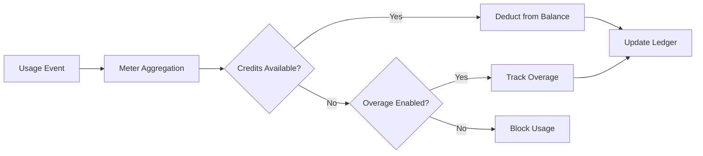

<Info>
计量器将原始事件转换为可计费数量。它们会过滤事件并应用聚合函数（Count、Sum、Max、Last）来计算每个客户的使用量。
</Info>

<Frame>

</Frame>

## API 资源

<AccordionGroup>
<Accordion title="View Meter API References">
<CardGroup cols={2}>
<Card title="Create Meter" icon="plus" href="/api-reference/meters/create-meter">
通过 API 以编程方式创建计量器。
</Card>

<Card title="List Meters" icon="list" href="/api-reference/meters/get-meters">
检索您帐户中的所有计量器。
</Card>

<Card title="Get Meter" icon="eye" href="/api-reference/meters/retrieve-meter">
按 ID 获取特定计量器的详细信息。
</Card>

<Card title="Archive Meter" icon="arrow-rotate-right" href="/api-reference/meters/archive-meter">
归档计量器以停止追踪使用量。
</Card>

<Card title="Unarchive Meter" icon="arrow-rotate-left" href="/api-reference/meters/unarchive-meter">
恢复已归档的计量器以继续追踪。
</Card>
</CardGroup>
</Accordion>
</AccordionGroup>

## 创建计量器

<Steps>
<Step title="Basic Information">
<ParamField path="Meter Name" type="string" required>
描述性名称（例如“API Requests”、“Token Usage”）
</ParamField>

<ParamField path="Event Name" type="string" required>
需要匹配的精确事件名称（区分大小写）。例如：`api.call`、`image.generated`
</ParamField>
</Step>

<Step title="Aggregation">
<ParamField path="Aggregation Type" type="string" required>
选择事件的聚合方式：

- **Count**：事件总数（API 调用、上传）
- **Sum**：将数值相加（tokens、bytes）
- **Max**：期间内的最高值（峰值用户）
- **Last**：最近的值
</ParamField>

<ParamField path="Over Property" type="string">
用于聚合的元数据键（除 Count 外所有类型均需要）。示例：`tokens`、`bytes`、`duration_ms`
</ParamField>

<ParamField path="Measurement Unit" type="string" required>
发票的单位标签。示例：`calls`、`tokens`、`GB`、`hours`
</ParamField>
</Step>

<Step title="Filtering (Optional)">
<Frame>

</Frame>

添加条件以过滤计入的事件：
- **与逻辑**：所有条件必须匹配
- **或逻辑**：任何条件都可以匹配

**比较器**：等于、不等于、大于、小于、包含

启用过滤，选择逻辑，添加具有属性键、比较符和值的条件。
</Step>

<Step title="Create">
审查配置并点击 **Create Meter**。
</Step>
</Steps>

## 查看分析

<Frame>

</Frame>

您的计量器仪表板显示：
- **概述**：总使用量和使用图表
- **事件**：接收到的单个事件
- **客户**：每个客户的使用情况和费用

## 以积分计费而非货币

默认情况下，计量器按美元（或您配置的货币）对每单位进行收费。您也可以配置计量器**从余额积分中扣除**——这样使用量就会消耗积分，而不是产生货币费用。

<Info>
基于积分的扣费需要一个附属于同一产品的[积分权益](/features/credit-based-billing)。先创建您的积分，再将其链接到计量器。
</Info>

### 何时使用基于积分的扣费

| 场景 | 标准（货币） | 基于积分 |
|----------|-------------------|--------------|
| 简单按单位定价（每次调用 $0.01） | ✅ 最适合 | 不必要的额外开销 |
| 预付积分包（购买 10K 令牌，随时间使用） | ❌ 无法表达 | ✅ 最适合 |
| 订阅包含捆绑使用量（专业版计划包括 100K 次调用） | 通过免费阈值可实现 | ✅ 更佳 - 积分可结转、过期，并在门户中显示 |
| 共享积分池的多计量器产品 | ❌ 每个计量器单独计费 | ✅ 所有计量器均从同一余额扣除 |

### 配置计量器以扣除积分

<Steps>
<Step title="Create a Credit Entitlement">
首先，在**产品 → 积分**中创建一个积分。定义单位（例如“API 调用”、“令牌”）、精度以及生命周期设置（过期、结转、超额）。

详见[基于积分的计费指南](/features/credit-based-billing)了解详细说明。
</Step>

<Step title="Create or Edit a Usage-Based Product">
进入您的基于使用量的产品，然后打开**计量器**配置部分。
</Step>

<Step title="Add a Meter">
点击**+**按钮以附加计量器。按常规配置事件名称、聚合类型和度量单位。
</Step>

<Step title="Enable 'Bill Usage in Credits'">
在计量器配置中切换**以积分计费**。这会显示积分设置：

<Frame caption="Toggle 'Bill usage in Credits' to switch from currency-based to credit-based deduction.">

</Frame>

<ParamField path="Credit Entitlement" type="string" required>
选择这个计量器应从中扣除积分的权益。
</ParamField>

<ParamField path="Meter units per credit" type="number" required>
每扣除 1 个积分所需的使用单位数量。例如：
- `1` = 每个计量器事件扣除 1 个积分
- `100` = 100 个计量器事件扣除 1 个积分
- `1000` = 1,000 次 API 调用消耗 1 个积分
</ParamField>
</Step>

<Step title="Set the Free Threshold">
**免费阈值**依旧适用——低于此阈值的事件不会扣除积分。

**示例**：免费阈值为 1,000，计量器单位与积分比为 1：
- 客户使用了 2,500 次 API 调用
- 前 1,000 次免费
- 剩余 1,500 次从其余额中扣除 1,500 个积分
</Step>
</Steps>

### 积分扣除如何运作

配置完成后，扣除管道会自动运行：

1. **事件到达** - 您的应用通过[事件摄取 API](/features/usage-based-billing/event-ingestion)发送使用事件
2. **计量器聚合** - 事件根据您的计量器配置进行聚合（Count、Sum、Max、Last）
3. **后台工作进程处理** - 每分钟，一个工作进程会获取自上一个检查点以来的新事件
4. **积分扣除** - 聚合使用量通过 `meter_units_per_credit` 费率转换为积分，并使用**FIFO 顺序**扣除（先消耗最旧的权益）
5. **记录超额** - 如果余额归零且启用了超额，使用将继续，并根据配置的行为（在重置时豁免、在下一张发票中计费或作为赤字结转）处理超额

<Warning>
积分扣除是异步运行的（约每分钟一次）。事件摄取与余额扣除之间可能会有短暂延迟。请在应用中考虑此延迟——不要依赖实时余额检查来控制单个请求的访问权限。
</Warning>

### 多计量器，共用一个积分池

您可以将同一产品上的多个计量器链接到**相同的积分权益**。所有计量器均从一个共享的余额中扣除。

**示例**：一个 AI 平台有两个计量器：
- `text.generation` - 每 1,000 个令牌扣除 1 个积分
- `image.generation` - 每张图像扣除 10 个积分

两者均从同一个“AI 积分”池中扣除。客户在其门户中看到一个统一的余额。

<Tip>
在不同计量器间使用不同的 `meter_units_per_credit` 费率以表达相对成本。昂贵的操作（图像生成）每积分所需的计量器单位比廉价的操作（文本补全）少。
</Tip>

<CardGroup cols={2}>
<Card title="List Customer Ledger" icon="scroll" href="/api-reference/credit-entitlements/list-customer-ledger">
查看客户的完整积分扣除历史。
</Card>
<Card title="Get Customer Balance" icon="wallet" href="/api-reference/credit-entitlements/get-customer-balance">
通过 API 检查客户当前的积分余额。
</Card>
</CardGroup>

## 故障排除

<AccordionGroup>
<Accordion title="Events not appearing">
- 事件名称必须完全匹配（区分大小写）
- 检查计量器过滤器是否排除了事件
- 验证客户 ID 是否存在
- 暂时禁用过滤器进行测试
</Accordion>

<Accordion title="Aggregation not working">
- 验证 Over Property 是否与元数据键完全匹配
- 使用数字而非字符串：`tokens: 150`，而不是 `"150"`
- 在所有事件中包含必需的属性
</Accordion>

<Accordion title="Filters not working">
- 完全匹配大小写
- 对数据类型使用正确的运算符
- 确保事件包含被过滤的属性
</Accordion>

<Accordion title="Wrong usage totals">
- 检查“事件”选项卡以统计实际接收的事件
- 验证聚合类型（Count 与 Sum）
- 确保 Sum/Max 的值为数字
</Accordion>
</AccordionGroup>

## 下一步

<CardGroup cols={2}>

<Card title="Send Events" icon="bolt" href="/features/usage-based-billing/event-ingestion">
开始从您的应用向计量器发送使用事件。
</Card>

<Card title="View Blueprints" icon="copy" href="/features/usage-based-billing/ingestion-blueprints">
使用现成的计量器配置满足常见用例。
</Card>
</CardGroup>
