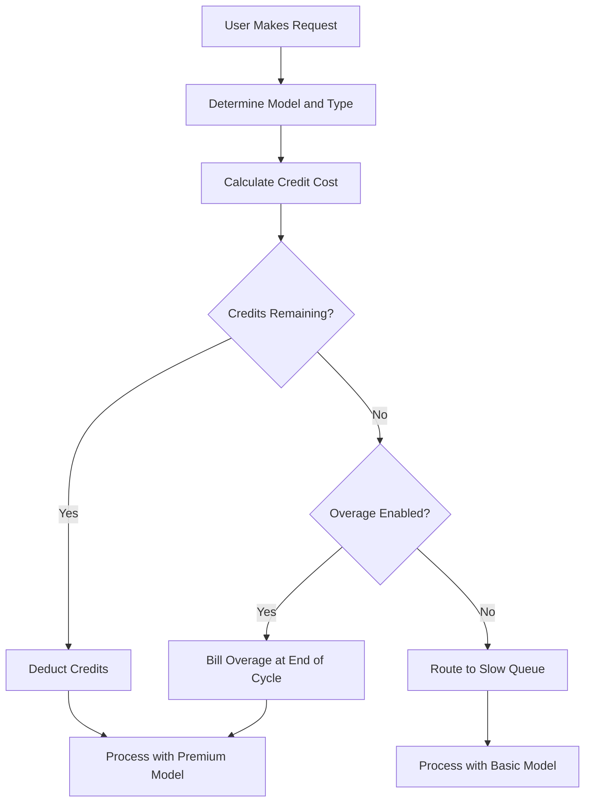

## Wie Cursor abrechnet

Cursor verwendet ein hybrides Modell, das ein monatliches Abonnement mit einem schrumpfenden Guthabenspool kombiniert. Dieser Ansatz bietet den Nutzern einen vorhersehbaren Preis, während die variablen Kosten unterschiedlicher KI-Modelle gesteuert werden.

**Preisstufen**: Cursor bietet Stufen von Hobby bis Ultra und bringt Premium- und Standardzugang in Einklang, um unterschiedliche Workflows abzudecken.

| Plan | Preis | Premium-Anfragen | Langsame Anfragen |
| :--- | :--- | :--- | :--- |
| Hobby | Kostenlos | 50/Monat | Unbegrenzt |
| Pro | \$20/Monat | 500/Monat | Unbegrenzt |
| Pro+ | \$60/Monat | Unbegrenzte Premium-Anfragen | - |
| Ultra | \$200/Monat | Unbegrenzte Premium-Anfragen | - |

**Modellgewichtete Erschöpfung**: Verschiedene Anfragen verbrauchen je nach zugrunde liegendem Modell unterschiedlich viele Credits. Dadurch kann Cursor ein einzelnes Abonnement anbieten, das mehrere Anbieter abdeckt und gleichzeitig teure Operationen berücksichtigt.

| Anfragetyp | Modell | Credit-Kosten |
| :--- | :--- | :--- |
| Tab Completion | Standard | 0 |
| Chat | GPT-4o Mini | 1 |
| Chat | Claude 3.5 Sonnet | 1 |
| Composer | GPT-4o | 5 |
| Agent | Claude 3.5 Sonnet | 10 |
| Agent | o1-preview | 25 |

**Guthabenerschöpfung und Überziehungen**: Wenn die Credits aufgebraucht sind, wechseln die Nutzer in eine „Slow“-Warteschlange mit günstigeren Modellen, statt komplett abgeschnitten zu werden. Alternativ können sie über nutzungsbasierte Überziehungen einen fortlaufenden Premium-Zugang zu einem festen Preis pro Anfrage aktivieren.



4. **Enterprise und Business**: Teams verwenden gemeinsam genutzte Nutzungen, bei denen die gesamte Organisation einen einzigen Credit-Pool teilt. Das vereinfacht das Management und stellt sicher, dass starke Nutzer nicht auf individuelle Limits stoßen, während andere noch ungenutzte Kapazität haben.

## Was es besonders macht

Cursors Modell bringt Benutzerfreundlichkeit und Infrastrukturkosten in Einklang, indem es Probleme löst, mit denen traditionelle SaaS-Abrechnungsmodelle zu kämpfen haben.
- **Anbieterabstraktion**: Ein einziges Abonnement fasst mehrere LLM-Anbieter wie OpenAI und Anthropic zusammen und kümmert sich im Hintergrund um komplexe Preise und API-Schlüssel.
- **Gewichtete Erschöpfung**: Die Kosten orientieren sich am Wert, indem für leistungsstarke Modelle mehr berechnet wird. So wirkt die Preisgestaltung für alle Nutzer fair und transparent.
- **Sanfter Abfall**: Die „Slow“-Warteschlange verhindert harte Abschaltungen, hält Nutzer im Produkt und fördert Upgrades, ohne bestrafend zu wirken.
- **Geteilte Credits**: Teamweite Pools reduzieren Reibungsverluste für Unternehmenskunden, indem sie eine effiziente Ressourcenteilung über die gesamte Organisation erlauben.

## So bauen Sie das mit Dodo Payments auf

Sie können dieses Modell exakt mit Dodo Payments‘ Credit-Entitlements und nutzungsbasierter Abrechnung nachbilden. Die folgenden Schritte führen Sie durch die Umsetzung.

<Steps>
  <Step title="Create a Custom Unit Credit Entitlement">
    Definieren Sie zuerst das Credit-System im Dodo-Dashboard. Dieses Entitlement repräsentiert die „Premium-Anfragen“, die Nutzer mit ihrem Abonnement erhalten.

    *   **Credit-Typ:** Custom Unit
    *   **Einheitenname:** "Premium Requests"
    *   **Präzision:** 0 (da eine Anfrage nicht halb verwendet werden kann)
    *   **Gültigkeit des Credits:** 30 Tage (damit Credits mit jedem Abrechnungszyklus zurückgesetzt werden)
    *   **Rollover:** Deaktiviert (nicht genutzte Anfragen werden nicht in den nächsten Monat übertragen)
    *   **Überziehung:** Aktiviert
    *   **Preis pro Einheit:** \$0.04 (die Kosten für jede Anfrage nach Erschöpfung des anfänglichen Pools)
    *   **Überziehungsverhalten:** Überziehungen bei Abrechnung verrechnen (das fügt die Überziehungskosten zur nächsten Rechnung hinzu)

    Diese Konfiguration sorgt dafür, dass Nutzer jeden Monat ein festes Anfragekontingent haben und bei Bedarf zusätzliche Anfragen bezahlen können. Sie bildet die Grundlage für das hybride Abrechnungsmodell.
  </Step>

  <Step title="Create Subscription Products">
    Erstellen Sie separate Produkte für jede Stufe. Verknüpfen Sie dasselbe Credit-Entitlement mit jedem Produkt, aber mit unterschiedlichen Mengen. So können Sie alle Stufen über ein einzelnes Credit-System verwalten, was Upgrades oder Downgrades für Nutzer erleichtert.

    *   **Hobby:** \$0/Monat, 50 Credits/Zyklus
    *   **Pro:** \$20/Monat, 500 Credits/Zyklus
    *   **Pro+:** \$60/Monat, 5000 Credits/Zyklus (de facto unbegrenzt für die meisten)
    *   **Ultra:** \$200/Monat, 50000 Credits/Zyklus (de facto unbegrenzt)

    Wenn sich ein Nutzer für eines dieser Produkte anmeldet, weist Dodo ihm automatisch die entsprechende Anzahl an Credits zu. Dies geschieht sofort und sorgt für ein nahtloses Onboarding.
  </Step>

  <Step title="Create a Usage Meter Linked to Credits">
    Erstellen Sie einen Meter mit dem Namen `ai.request` und der **Sum**-Aggregation auf der `credit_cost`-Eigenschaft. Verknüpfen Sie diesen Meter mit Ihrem Credit-Entitlement, indem Sie den Schalter „Bill usage in Credits“ aktivieren. Stellen Sie die Einheiten pro Credit auf 1 ein.

    Um die modellgewichtete Erschöpfung zu handhaben, verwalten Sie die Credit-Kosten auf Anwendungsebene. Wenn ein Nutzer eine Anfrage stellt, bestimmt Ihre App die Kosten basierend auf dem Modell oder Aktionstyp.

    ```typescript
    import DodoPayments from 'dodopayments';
    
    /**
     * Determines the credit cost for a given request type and model.
     * This logic lives in your application and can be updated without
     * changing your billing configuration.
     */
    function getCreditCost(requestType: string, model: string): number {
      const costs: Record<string, Record<string, number>> = {
        'tab_completion': { 'default': 0 },
        'chat': { 'gpt-4o-mini': 1, 'gpt-4o': 1, 'claude-sonnet': 1 },
        'composer': { 'gpt-4o-mini': 2, 'gpt-4o': 5, 'claude-sonnet': 5 },
        'agent': { 'gpt-4o': 10, 'claude-sonnet': 10, 'o1': 25 }
      };
      
      // Default to 1 credit if the combination isn't found
      return costs[requestType]?.[model] ?? 1;
    }
    
    /**
     * Ingests usage events into Dodo Payments.
     * For weighted requests, we send multiple events or use a sum aggregation.
     */
    async function trackRequest(customerId: string, requestType: string, model: string) {
      const creditCost = getCreditCost(requestType, model);
      
      // Tab completions are free, so we don't need to track them for billing
      if (creditCost === 0) return;
      
      const client = new DodoPayments({
        bearerToken: process.env.DODO_PAYMENTS_API_KEY,
      });
      
      await client.usageEvents.ingest({
        events: [{
          event_id: `req_${Date.now()}_${Math.random().toString(36).slice(2)}`,
          customer_id: customerId,
          event_name: 'ai.request',
          timestamp: new Date().toISOString(),
          metadata: {
            request_type: requestType,
            model: model,
            credit_cost: creditCost
          }
        }]
      });
    }
    ```

    <Tip>
      Wenn Sie ein einziges Ereignis für gewichtete Anfragen verwenden wollen, setzen Sie Ihre Meter-Aggregation auf **Sum** und verwenden Sie eine Eigenschaft wie `credit_cost` als den Wert, der summiert wird. Dies ist häufig effizienter für volumenstarke Ingestion und vereinfacht Ihre Anwendungslogik.
    </Tip>
  </Step>

  <Step title="Handle Credit Exhaustion (Slow Queue)">
    Hören Sie auf das `credit.balance_low`-Webhook von Dodo. Wenn die Credits eines Nutzers fast aufgebraucht sind, können Sie ihn in Ihrer Anwendung in eine langsame Warteschlange verschieben. Hier implementieren Sie die Logik zur „sanften Degradation“.

    ```typescript
    import DodoPayments from 'dodopayments';
    import express from 'express';
    
    const app = express();
    app.use(express.raw({ type: 'application/json' }));
    
    const client = new DodoPayments({
      bearerToken: process.env.DODO_PAYMENTS_API_KEY,
      webhookKey: process.env.DODO_PAYMENTS_WEBHOOK_KEY,
    });
    
    app.post('/webhooks/dodo', async (req, res) => {
      try {
        const event = client.webhooks.unwrap(req.body.toString(), {
          headers: {
            'webhook-id': req.headers['webhook-id'] as string,
            'webhook-signature': req.headers['webhook-signature'] as string,
            'webhook-timestamp': req.headers['webhook-timestamp'] as string,
          },
        });
        
        if (event.type === 'credit.balance_low') {
          const customerId = event.data.customer_id;
          await updateUserTier(customerId, 'slow');
          await notifyUser(customerId, 'You have used most of your premium requests. Switching to standard models.');
        }
        
        res.json({ received: true });
      } catch (error) {
        res.status(401).json({ error: 'Invalid signature' });
      }
    });
    
    /**
     * Routes a request based on the user's current tier.
     * This function is called before every AI request to determine the model and queue.
     */
    async function routeRequest(customerId: string, requestType: string) {
      const tier = await getUserTier(customerId);
      
      if (tier === 'slow') {
        // Route to a cheaper model and a lower priority queue
        // This saves costs while keeping the user active in the product
        return { model: 'gpt-4o-mini', queue: 'standard' };
      }
      
      // Premium routing for users with remaining credits
      // This provides the best possible performance and model quality
      return { model: 'claude-sonnet', queue: 'priority' };
    }
    ```

  </Step>

  <Step title="Create Checkout">
    Erstellen Sie abschließend eine Checkout-Session, damit der Nutzer ein Abonnement auswählt. Dodo übernimmt die Zahlungsabwicklung, Steuerkonformität und Credit-Zuweisung automatisch.

    ```typescript
    import DodoPayments from 'dodopayments';
    
    const client = new DodoPayments({
      bearerToken: process.env.DODO_PAYMENTS_API_KEY,
    });
    
    /**
     * Creates a checkout session for a new subscription.
     * This is typically called when a user clicks an "Upgrade" button.
     */
    const session = await client.checkoutSessions.create({
      product_cart: [
        { product_id: 'prod_cursor_pro', quantity: 1 }
      ],
      customer: { email: 'developer@example.com' },
      return_url: 'https://yourapp.com/dashboard'
    });
    ```

  </Step>
</Steps>

## Beschleunigen Sie mit der LLM-Ingestionsvorlage

Die kreditgewichtete Abrechnung oben deckt Ihre Kernmonetarisierung ab. Für tiefere Analysen des tatsächlichen Tokenverbrauchs über Anbieter hinweg kann die [LLM Ingestion Blueprint](/developer-resources/ingestion-blueprints/llm) parallel zu Ihrem Credit-System betrieben werden.

```bash
npm install @dodopayments/ingestion-blueprints
```

```typescript
import { createLLMTracker } from '@dodopayments/ingestion-blueprints';
import OpenAI from 'openai';
import Anthropic from '@anthropic-ai/sdk';

// Track raw token usage for analytics alongside credit-weighted billing
const openaiTracker = createLLMTracker({
  apiKey: process.env.DODO_PAYMENTS_API_KEY,
  environment: 'live_mode',
  eventName: 'analytics.openai_tokens',
});

const anthropicTracker = createLLMTracker({
  apiKey: process.env.DODO_PAYMENTS_API_KEY,
  environment: 'live_mode',
  eventName: 'analytics.anthropic_tokens',
});

const openai = new OpenAI({ apiKey: process.env.OPENAI_API_KEY });
const anthropic = new Anthropic({ apiKey: process.env.ANTHROPIC_API_KEY });

// Wrap each provider separately
const trackedOpenAI = openaiTracker.wrap({ client: openai, customerId: 'customer_123' });
const trackedAnthropic = anthropicTracker.wrap({ client: anthropic, customerId: 'customer_123' });

// Token tracking is automatic, credit deduction still uses your weighted system
const response = await trackedOpenAI.chat.completions.create({
  model: 'gpt-4o',
  messages: [{ role: 'user', content: 'Hello!' }],
});
```

Das gibt Ihnen zwei Datenschichten: kreditgewichtete Abrechnung für die Monetarisierung und rohe Token-Zählungen für Kostenanalysen und Margenverfolgung.

<Tip>
Die LLM-Vorlage unterstützt OpenAI, Anthropic, Groq, Google Gemini und mehr. Siehe die [vollständige Blueprint-Dokumentation](/developer-resources/ingestion-blueprints/llm) für alle unterstützten Anbieter.
</Tip>

## Geteilte Team-Credits (Enterprise)

Cursors Business- und Enterprise-Pläne bündeln Credits teamweit. Sie können dies mit Dodo umsetzen, indem Sie für die Organisation ein einziges Abonnement statt für einzelne Nutzer erstellen. So wird gewährleistet, dass die Nutzung des Teams konsolidiert und als Einheit verwaltet wird — ein zentrales Bedürfnis größerer Kunden.

### Implementierungsstrategie

1.  **Organisationsebene-Kunde:** Erstellen Sie einen einzigen `customer_id` in Dodo für die gesamte Organisation. Dieser Kunde repräsentiert die abrechnende Einheit für das Team und hält den gemeinsamen Credit-Pool. Alle Rechnungen und Credit-Zuweisungen sind an diese ID gebunden.
2.  **Seat-basierte Abrechnung:** Verwenden Sie Dodos Add-ons, um eine Plattformgebühr pro Nutzer zu berechnen. Wenn ein Team ein neues Mitglied hinzufügt, passen Sie die Menge des „Seat“-Add-ons an. So wächst Ihr Umsatz mit der Nutzerzahl, während der Credit-Pool getrennt bleibt. Das ist ein sauberer Weg, mehrdimensionale Abrechnung zu handhaben.
3.  **Gemeinsame Nutzungsverfolgung:** Die Anfragen aller Teammitglieder werden über den ORGANISATIONS_`customer_id` ingestiert. Dadurch wird sichergestellt, dass jede Anfrage eines Teammitglieds denselben zentralen Credit-Pool belastet. Sie können weiterhin die individuelle Nutzung verfolgen, indem Sie `user_id` in den Event-Metadaten für interne Berichte und Analysen aufnehmen.

Dieser Ansatz liefert Ihnen das Beste aus beiden Welten: eine vorhersehbare Gebühr pro Nutzer für die Plattform und einen gemeinsamen Credit-Pool für ressourcenintensive KI-Funktionen. Er vereinfacht ebenfalls das Nutzungserlebnis für Teammitglieder, da diese keine eigenen Limits verwalten müssen.

## Vergleich mit traditioneller SaaS-Abrechnung

Traditionelle SaaS-Abrechnung basiert häufig auf Flat-Rate-Stufen (z. B. \$10/Monat für 100 Einheiten). Wenn ein Nutzer 101 Einheiten benötigt, muss er oft auf eine \$50/Monat-Stufe wechseln. Das erzeugt „Cliff“-Effekte, die Nutzer frustrieren und zu Abwanderung führen können. Außerdem wird die variable Kostenstruktur unterschiedlicher Nutzungstypen nicht berücksichtigt, was im KI-Bereich kritisch ist.

Das Modell von Cursor, unterstützt durch Dodo, ist deutlich flexibler und fairer:

*   **Keine „Cliff“-Effekte:** Nutzer müssen nicht aufrüsten, nur weil sie ein Limit erreicht haben. Sie können für Überziehungen bezahlen oder langsamere Leistung akzeptieren. Das hält sie im Produkt und reduziert Reibungsverluste, was zu höherer Kundenzufriedenheit und geringerem Churn führt.
*   **Kostenabgleich:** Ihr Umsatz skaliert direkt mit Ihren Infrastrukturkosten. Wenn ein Nutzer teure Modelle nutzt, zahlt er mehr (entweder über Credits oder Überziehungen). Das schützt Ihre Margen und erlaubt es Ihnen, hochpreisige Features nachhaltig anzubieten, ohne Ihr Geschäftsmodell zu gefährden.
*   **Bessere Bindung:** Indem Sie Nutzer nicht komplett abschneiden, halten Sie sie auch nach Erreichen ihres Limits im Produkt. Sie können weiterarbeiten, was langfristige Loyalität aufbaut und den Customer Lifetime Value erhöht. Ein Gewinn für Nutzer und Anbieter.

## Umgang mit Modell-Updates und Weiterentwicklung

Eine Herausforderung bei KI-Abrechnung besteht darin, dass Modelle ständig aktualisiert oder ersetzt werden. Neue Modelle haben möglicherweise unterschiedliche Kostenstrukturen oder Leistungscharakteristika. Mit Dodos Credit-System können Sie das auf Anwendungsebene elegant handhaben, ohne Ihre Abrechnungsdaten migrieren zu müssen.

Wenn Sie ein neues, teureres Modell einführen, passen Sie einfach Ihre `getCreditCost`-Funktion an, um ihm höhere Kosten zuzuweisen. Sie müssen Ihre Abrechnungskonfiguration oder bestehende Abonnements nicht ändern. Diese Entkopplung von Abrechnung und Anwendungslogik ist ein großer Vorteil, da sie Ihnen ermöglicht, Ihr Produkt mit der Geschwindigkeit der KI weiterzuentwickeln, ohne durch das Abrechnungssystem eingeschränkt zu werden.

## Nutzerbenachrichtigungen und Transparenz

Für ein herausragendes Nutzererlebnis ist es wichtig, die Nutzer über ihren Credit-Verbrauch zu informieren. Transparenz schafft Vertrauen und hilft Nutzern, ihre Kosten effektiv zu steuern. Sie können Dodos Webhooks nutzen, um Benachrichtigungen bei verschiedenen Schwellenwerten (z. B. 50 %, 80 % und 100 % Nutzung) auszulösen.

Diese Benachrichtigungen können per E-Mail, In-App-Benachrichtigung oder Slack-Nachricht versendet werden. Indem Sie Echtzeit-Feedback zur Nutzung bereitstellen, motivieren Sie Nutzer dazu, ihren Verbrauch zu managen oder ihren Plan zu aktualisieren, bevor sie in die „Slow“-Warteschlange geraten. Dieser proaktive Ansatz reduziert Supportanfragen und verbessert das gesamte Nutzererlebnis, sodass Ihr Produkt professioneller und nutzerzentrierter wirkt.

## Sicherheit und Betrugsprävention

Beim Aufbau eines kreditbasierten Systems ist es wichtig, Sicherheit und Betrugsprävention zu berücksichtigen. Da Credits einen direkten Geldwert haben, sind sie potenzielle Ziele für Missbrauch.

*   **Idempotenz:** Verwenden Sie beim Ingestieren von Nutzungsereignissen immer eindeutige `event_id`s, um Doppelzählungen zu vermeiden. Dodos Ingestion-API übernimmt die Idempotenz automatisch, wenn Sie eine eindeutige ID bereitstellen, sodass ein Netzwerkwiederholungsversuch den Nutzer nicht doppelt belastet.
*   **Rate-Limiting:** Implementieren Sie auf Anwendungsebene Rate-Limits, um zu verhindern, dass ein einzelner Nutzer seine Credits (oder Ihr API-Budget) zu schnell verbraucht. Das schützt Ihre Infrastruktur und die Brieftasche des Nutzers.
*   **Monitoring:** Überwachen Sie Nutzungsmuster auf Anomalien, die auf Account-Sharing oder automatisierten Missbrauch hindeuten könnten. Dodos Analysefunktionen helfen Ihnen, solche Muster zu erkennen und Gegenmaßnahmen zu ergreifen, bevor sie zu einem größeren Problem werden.

## Best Practices für Credit-Systeme

Beim Aufbau eines kreditbasierten Abrechnungssystems sollten Sie diese Best Practices beachten:

1.  **Halten Sie es einfach:** Machen Sie Ihr Credit-System nicht zu kompliziert. Nutzer sollten leicht verstehen können, was eine Anfrage kostet und wie viele Credits noch übrig sind.
2.  **Bieten Sie Mehrwert:** Stellen Sie sicher, dass die Credits für den Nutzer echten Wert haben. Wenn eine Anfrage zu teuer ist, entsteht das Gefühl, dass man „für jede Kleinigkeit bezahlen muss“.
3.  **Seien Sie transparent:** Zeigen Sie dem Nutzer stets sein aktuelles Credit-Guthaben und die Nutzungshistorie. Das schafft Vertrauen und reduziert Verwirrung.
4.  **Automatisieren Sie alles:** Nutzen Sie Dodos Webhooks und APIs, um so viel wie möglich vom Abrechnungsprozess zu automatisieren. Das minimiert manuelle Arbeit und stellt sicher, dass Ihre Abrechnung stets korrekt ist.

## Zentrale Dodo-Funktionen im Einsatz

<CardGroup cols={2}>
  <Card title="Credit-Based Billing" icon="coins" href="/features/credit-based-billing">
    Verwalten Sie schrumpfende Credit-Pools und Überziehungen mit Custom Units.
  </Card>
  <Card title="Subscriptions" icon="calendar" href="/features/subscription">
    Richten Sie wiederkehrende Abrechnungen für verschiedene Stufen mit integrierten Credits ein.
  </Card>
  <Card title="Usage-Based Billing" icon="chart-line" href="/features/usage-based-billing/introduction">
    Erfassen Sie Ereignisse und berechnen Sie die Nutzung in Echtzeit.
  </Card>
  <Card title="Event Ingestion" icon="bolt" href="/features/usage-based-billing/event-ingestion">
    Senden Sie volumenstarke Nutzungsdaten mit niedriger Latenz an Dodo.
  </Card>
  <Card title="Webhooks" icon="webhook" href="/developer-resources/webhooks/intents/credit">
    Reagieren Sie auf Kreditguthabenänderungen und automatisieren Sie Nutzer-Tiering.
  </Card>
  <Card title="LLM Ingestion Blueprint" icon="brain-circuit" href="/developer-resources/ingestion-blueprints/llm">
    Automatische Tokenverfolgung über mehrere LLM-Anbieter hinweg.
  </Card>
</CardGroup>
