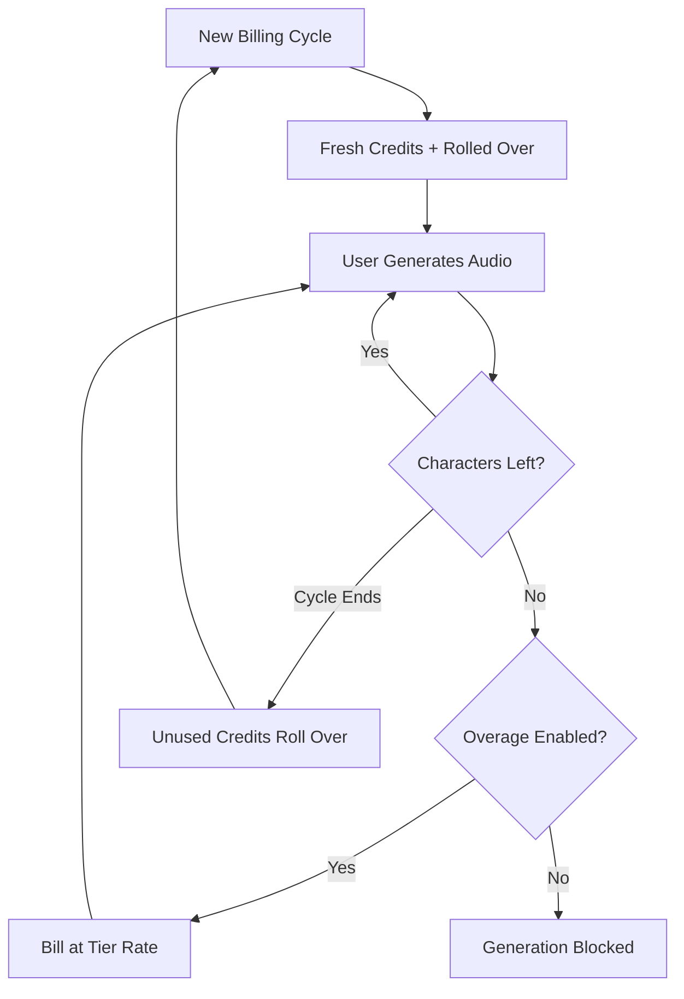

ElevenLabs hat im KI-Sprachbereich eine dominante Position erreicht, indem sie ihre Abrechnung so flüssig gestalten wie ihre Sprachsynthese. Ihr Modell basiert auf einer einzigen Werteinheit: dem Zeichen. Egal ob Sie Text-to-Speech erzeugen, eine Stimme klonen oder ein Video vertonen, Sie greifen auf einen einheitlichen Pool von Zeichen-Guthaben zu.

## So rechnet ElevenLabs ab

Die Preisstruktur von ElevenLabs verwendet feste monatliche Kontingente, die an die Abonnementstufen gekoppelt sind. Wenn Nutzer zu höheren Stufen wechseln, erhalten sie mehr Zeichen und Zugang zu fortgeschritteneren Funktionen wie professionellem Voice-Cloning oder kommerziellen Rechten.

| Plan | Preis | Zeichen/Monat | Überziehungsrate |
| :--- | :--- | :--- | :--- |
| Free | \$0 | 10.000 | Nicht verfügbar |
| Starter | \$5/Monat | 30.000 | ~\$0.30/1.000 Zeichen |
| Creator | \$22/Monat | 100.000 | ~\$0.24/1.000 Zeichen |
| Pro | \$99/Monat | 500.000 | ~\$0.15/1.000 Zeichen |
| Scale | \$330/Monat | 2.000.000 | ~\$0.10/1.000 Zeichen |

1. **Zeichenbasierte Preisgestaltung**: Zeichen sind die universelle Währung auf der gesamten Plattform. Text-to-Speech, Dubbing und Voice Cloning greifen alle auf diesen gleichen Bestand zu, was die Nutzungskontrolle vereinfacht.
2. **Rollover-Mechaniken**: Unbenutzte Zeichen werden in den nächsten Abrechnungszeitraum übertragen, anstatt zu verfallen. ElevenLabs setzt eine Obergrenze, um eine unendliche Akkumulation zu verhindern und sicherzustellen, dass Nutzer den Wert ihres Abonnements behalten.
3. **Gestaffelte Überziehungen**: Überziehungen werden anhand der Abonnementstufe behandelt. Niedrigere Pläne deaktivieren Überziehungen standardmäßig aus Sicherheitsgründen, während höhere Stufen eine manuelle Zustimmung für zusätzliche Gebühren ermöglichen, um die Servicekontinuität zu gewährleisten.

## Was es einzigartig macht

Mehrere strategische Entscheidungen machen das Abrechnungsmodell von ElevenLabs besonders effektiv, um Nutzer zu binden und zu Upgrades zu motivieren.

- **Zeichen-Rollover**: Rollover-Guthaben verringern das „nutze es oder verliere es“-Gefühl, indem ungenutzte Investitionen mitgenommen werden. Das erhält den Wert des Abonnements auch in Zeiten niedrigerer Aktivität.
- **Gestaffelte Überziehungsgebühren**: Die Überziehungsraten sinken mit wachsender Plan-Größe, was ein starkes Upgrade-Incentive schafft. Nutzer empfinden höhere Stufen häufig als attraktiver, da zusätzliche Nutzung günstiger wird.
- **Einheitlicher Verbrauch**: Ein einziger Zeichen-Pool für alle Dienste nimmt die kognitive Last ab, mehrere Kontingente zu verwalten. Nutzer müssen nur eine Zahl im Blick behalten, um ihre verbleibende Kapazität zu verstehen.
- **Opt-in-Überziehungen**: Professionelle Nutzer können Überziehungen aktivieren, um die Kontinuität zu gewährleisten, während Gelegenheitsnutzer von der Sicherheit einer festen Grenze profitieren.



## Das mit Dodo Payments aufbauen

Sie können dieses ausgeklügelte Modell mithilfe der kreditbasierten Abrechnung und Nutzungs-Messung von Dodo Payments nachbauen.

<Steps>
<Step title="Create a Custom Unit Credit Entitlement">
Definieren Sie zunächst die Einheit „Characters“, die als Währung Ihrer Plattform dient.

1. Gehen Sie in Ihrem Dodo-Dashboard zu **Entitlements**.
2. Erstellen Sie ein neues **Credit Entitlement**.
3. Setzen Sie den **Credit Type** auf **Custom Unit**.
4. Benennen Sie die Einheit „Characters“.
5. Stellen Sie die **Precision** auf 0, da Zeichen immer ganze Einheiten sind.
6. Legen Sie die **Credit Expiry** auf 30 Tage fest, um den monatlichen Abrechnungszyklus widerzuspiegeln.
7. Aktivieren Sie den **Rollover** mit folgenden Einstellungen:
    - **Max Rollover Percentage**: 100 % (erlaubt, dass alle ungenutzten Zeichen übertragen werden).
    - **Rollover Timeframe**: 1 Monat.
    - **Max Rollover Count**: 1 (Guthaben können einmal übertragen werden, danach verfallen sie).
</Step>

<Step title="Create Tiered Subscription Products">
Erstellen Sie fünf Abonnementprodukte. Sie werden jedem dasselbe „Characters“-Entitlement hinzufügen, jedoch mit unterschiedlichen Konfigurationen für jede Stufe.

| Produkt | Preis | Guthaben/Zyklus | Überziehung aktiviert | Überziehungs-Preis (pro 1.000 Zeichen) |
| :--- | :--- | :--- | :--- | :--- |
| Free | \$0/Monat | 10.000 | Nein | - |
| Starter | \$5/Monat | 30.000 | Ja (Opt-in) | \$0.30 |
| Creator | \$22/Monat | 100.000 | Ja | \$0.24 |
| Pro | \$99/Monat | 500.000 | Ja | \$0.15 |
| Scale | \$330/Monat | 2.000.000 | Ja | \$0.10 |

Wenn Sie das Credit Entitlement an jedes Produkt anhängen, deaktivieren Sie **Import Default Credit Settings**. So können Sie den spezifischen **Price Per Unit** für Überziehungen auf dieser Stufe festlegen. Stellen Sie das **Overage Behavior** auf **Bill overage at billing** ein und konfigurieren Sie einen **Low Balance Threshold** bei 10 % des Kontingents der jeweiligen Stufe.
</Step>

<Step title="Create a Usage Meter">
Der Usage Meter verbindet die Aktivitäten Ihrer Anwendung mit dem Credit-System.

1. Erstellen Sie einen neuen Meter mit dem Namen `tts.characters`.
2. Setzen Sie die **Aggregation** auf **Sum**. Dadurch wird die `characters`-Eigenschaft aus jedem gesendeten Ereignis addiert.
3. Verknüpfen Sie diesen Meter mit Ihrem „Characters“-Credit Entitlement.
4. Setzen Sie **Meter units per credit** auf 1. Dadurch entspricht ein verwendetes Zeichen in Ihrer App einem Guthaben, das vom Kontostand abgezogen wird.
</Step>

<Step title="Send Usage Events">
Integrieren Sie die Nutzungsverfolgung in Ihren Anwendungscode. Senden Sie jedes Mal, wenn ein Nutzer Audio erzeugt, ein Ereignis an Dodo.

```typescript
import DodoPayments from 'dodopayments';

async function trackGeneration(
  customerId: string,
  text: string, 
  service: 'tts' | 'dubbing' | 'cloning'
) {
  const characterCount = text.length;

  const client = new DodoPayments({
    bearerToken: process.env.DODO_PAYMENTS_API_KEY,
  });

  await client.usageEvents.ingest({
    events: [{
      event_id: `gen_${Date.now()}_${Math.random().toString(36).slice(2)}`,
      customer_id: customerId,
      event_name: 'tts.characters',
      timestamp: new Date().toISOString(),
      metadata: {
        characters: characterCount,
        service: service,
        voice_id: 'voice_abc123'
      }
    }]
  });
}
```

</Step>

<Step title="Handle Low Balance and Overage">
Verwenden Sie Webhooks, um Ihre Nutzer über ihren Zeichenverbrauch zu informieren.

```typescript
import DodoPayments from 'dodopayments';
import express from 'express';

const app = express();
app.use(express.raw({ type: 'application/json' }));

const client = new DodoPayments({
  bearerToken: process.env.DODO_PAYMENTS_API_KEY,
  webhookKey: process.env.DODO_PAYMENTS_WEBHOOK_KEY,
});

app.post('/webhooks/dodo', async (req, res) => {
  try {
    const event = client.webhooks.unwrap(req.body.toString(), {
      headers: {
        'webhook-id': req.headers['webhook-id'] as string,
        'webhook-signature': req.headers['webhook-signature'] as string,
        'webhook-timestamp': req.headers['webhook-timestamp'] as string,
      },
    });

    switch (event.type) {
      case 'credit.balance_low':
        await notifyUser(event.data.customer_id, 
          'You are running low on characters. Consider upgrading your plan for more characters and lower overage rates.'
        );
        break;
      case 'credit.deducted':
        await logUsage(event.data);
        break;
      case 'credit.overage_charged':
        await notifyUser(event.data.customer_id,
          'You have exceeded your character quota. Overage charges will appear on your next invoice.'
        );
        break;
    }

    res.json({ received: true });
  } catch (error) {
    res.status(401).json({ error: 'Invalid signature' });
  }
});
```

</Step>

<Step title="Create Checkout">
Wenn ein Nutzer bereit ist zu abonnieren, erstellen Sie eine Checkout-Session für die gewählte Stufe.

```typescript
const session = await client.checkoutSessions.create({
  product_cart: [
    { product_id: 'prod_elevenlabs_pro', quantity: 1 }
  ],
  customer: { email: 'creator@example.com' },
  return_url: 'https://yourapp.com/dashboard'
});
```

</Step>
</Steps>

## Beschleunigen Sie mit dem Stream Ingestion Blueprint

Um die Audioausgabe parallel zur zeichenbasierten Abrechnung zu verfolgen, bietet der [Stream Ingestion Blueprint](/developer-resources/ingestion-blueprints/stream) eine schlanke Möglichkeit, den Bandbreitenverbrauch zu messen.

```bash
npm install @dodopayments/ingestion-blueprints
```

```typescript
import { Ingestion, trackStreamBytes } from '@dodopayments/ingestion-blueprints';

const ingestion = new Ingestion({
  apiKey: process.env.DODO_PAYMENTS_API_KEY,
  environment: 'live_mode',
  eventName: 'tts.audio_bytes',
});

// After generating audio, track the output size
const audioBuffer = await generateSpeech(text, voiceId);

await trackStreamBytes(ingestion, {
  customerId: customerId,
  bytes: audioBuffer.byteLength,
  metadata: {
    voice_id: voiceId,
    service: 'tts',
    format: 'mp3',
  },
});
```

Nutzen Sie den Stream Blueprint, um die Audio-Bandbreite neben Ihrem zeichenbasierten Credit-System zu verfolgen. So erhalten Sie Transparenz über die tatsächlichen Infrastrukturkosten pro Generierung.

<Tip>
Der Stream Blueprint unterstützt auch Batching für Szenarien mit hohem Volumen. Weitere Details finden Sie in der [vollständigen Blueprint-Dokumentation](/developer-resources/ingestion-blueprints/stream) für fortgeschrittene Nutzungsmuster.
</Tip>

## Upgrade-Anreiz: Staffelpreise für Überziehungen

Der brillanteste Teil des ElevenLabs-Modells ist, wie es Überziehungsraten nutzt, um Upgrades anzutreiben. Indem der Preis pro Zeichen auf höheren Stufen günstiger wird, verschieben sie das Gespräch von „Wie viel brauche ich?“ zu „Wie viel kann ich sparen?“

| Stufe | Enthaltene Zeichen | Überziehung (pro 1.000) | Effektive Kosten bei 500.000 Zeichen |
| :--- | :--- | :--- | :--- |
| Creator | 100.000 | \$0.24 | \$22 + (400 * \$0.24) = \$118 |
| Pro | 500.000 | \$0.15 | \$99 (Keine Überziehung) |

Ein Nutzer, der regelmäßig 500.000 Zeichen im Creator-Plan verbraucht, zahlt \$118 pro Monat für Abonnement plus Überziehungen. Das Upgrade zum Pro-Plan deckt denselben Verbrauch für \$99 ab und spart \$19 pro Monat. Die niedrigere Überziehungsrate auf höheren Stufen bedeutet, dass mit zunehmender Nutzung ein Upgrade zur offensichtlichen finanziellen Entscheidung wird.

Mit Dodo Payments erreichen Sie dies, indem Sie beim Anhängen von Credits an Ihre Abonnementprodukte das Feld **Import Default Credit Settings** deaktivieren. So behalten Sie die volle Kontrolle über den **Price Per Unit** jeder spezifischen Stufe und können Ihren zahlungskräftigsten Kunden die besten Raten anbieten.

## Wichtige verwendete Dodo-Funktionen

<CardGroup cols={2}>
  <Card title="Credit-Based Billing" icon="coins" href="/features/credit-based-billing">
    Verwalten Sie Zeichenkontingente, Rollover und Ablaufdaten.
  </Card>
  <Card title="Subscriptions" icon="calendar" href="/features/subscription">
    Richten Sie die wiederkehrenden Stufen ein, die monatliche Zeichenkontingente bereitstellen.
  </Card>
  <Card title="Usage-Based Billing" icon="chart-line" href="/features/usage-based-billing/introduction">
    Verfolgen Sie den Echtzeitverbrauch von Zeichen über Ihre Services hinweg.
  </Card>
  <Card title="Event Ingestion" icon="bolt" href="/features/usage-based-billing/event-ingestion">
    Senden Sie hochvolumige Nutzungsdaten mit minimaler Latenz an Dodo.
  </Card>
  <Card title="Webhooks" icon="webhook" href="/developer-resources/webhooks/intents/credit">
    Reagieren Sie in Echtzeit auf niedrige Kontostände und Überziehungsereignisse.
  </Card>
  <Card title="Stream Ingestion Blueprint" icon="tower-broadcast" href="/developer-resources/ingestion-blueprints/stream">
    Verfolgen Sie Audio-Streaming-Bandbreite für nutzungsbasierte Abrechnung.
  </Card>
</CardGroup>
