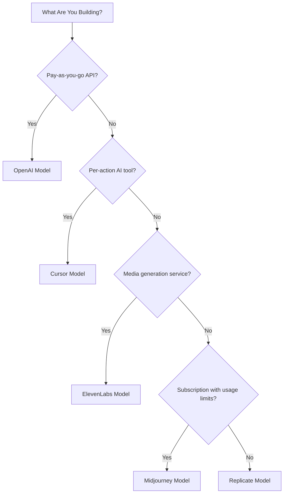

## Die fünf Modelle

| App | Primäre Metrik | Einzigartige Innovation | Dodo-Funktion |
| :--- | :--- | :--- | :--- |
| OpenAI | Tokens (fiat-denominiert) | Prepaid-Fiat-Guthaben mit nie ablaufendem Kontostand | Kreditbasierte Abrechnung (Fiat-Guthaben) |
| Cursor | Premium-Anfragen | Modellgewichtete Guthabenverringerung (unterschiedliche Kosten pro Modell) | Kreditbasierte Abrechnung (Benutzerdefinierte Einheit) |
| ElevenLabs | Zeichen | Zeichenkontingente mit Übertrag + gestaffelte Überziehungsgebühren | Kreditbasierte Abrechnung (Übertrag + Überziehung) |
| Midjourney | GPU-Zeit | "Relax-Modus" unbegrenzte Fallback-Nutzung nach Kontingent | Abonnement + Nutzungsmessung |
| Replicate | Ausführungssekunden | Hardware-spezifische Abrechnung pro Sekunde | Reine nutzungsabhängige Abrechnung |

| App | Primäre Metrik | Einzigartige Innovation | Dodo-Funktion |
| :--- | :--- | :--- | :--- |
| OpenAI | Tokens (fiat-denominiert) | Prepaid-Fiat-Guthaben mit nie ablaufendem Kontostand | Kreditbasierte Abrechnung (Fiat-Guthaben) |
| Cursor | Premium-Anfragen | Modellgewichtete Guthabenverringerung (unterschiedliche Kosten pro Modell) | Kreditbasierte Abrechnung (Benutzerdefinierte Einheit) |
| ElevenLabs | Zeichen | Zeichenkontingente mit Übertrag + gestaffelte Überziehungsgebühren | Kreditbasierte Abrechnung (Übertrag + Überziehung) |
| Midjourney | GPU-Zeit | "Relax-Modus" unbegrenzte Fallback-Nutzung nach Kontingent | Abonnement + Nutzungsmessung |
| Replicate | Ausführungssekunden | Hardware-spezifische Abrechnung pro Sekunde | Reine nutzungsabhängige Abrechnung |

## Verständnis von Kreditmustern

| Muster | Beispiel | Dodo-Funktion | Einheitstyp |
| :--- | :--- | :--- | :--- |
| Prepaid, fiat-denominierte Guthaben | OpenAI API (\$5 Guthabenaufladung, keine Auszahlung) | Kreditbasierte Abrechnung (Fiat-Guthaben) | Dollar-denominierte virtuelle Einheiten |
| Virtuelle Nutzungsguthaben | Cursor Premium-Anfragen, ElevenLabs-Zeichen | Kreditbasierte Abrechnung (Benutzerdefinierte Einheit) | Beliebige Einheiten (Anfragen, Zeichen) |
| Reine Verbrauchsmessung | Replicate-Abrechnung pro Sekunde | Nutzungsbasierte Abrechnung (Messgeräte) | Direkte Messung (Sekunden, Bytes) |
| Abonnement + gemessene Überziehung | Midjourney Fast Hours mit Relax-Fallback | Abonnement + Nutzungsmessung | Zeitbasiert mit kostenlosem Schwellenwert |

<Info>
Fiat-Guthaben in Dodos kreditbasierter Abrechnung repräsentieren plattformbezogene Dollarwerte ohne monetären Wert außerhalb Ihres Ökosystems. Kunden können diese nicht in Bargeld auszahlen lassen.
</Info>

## Welches Modell sollten Sie verwenden?

- Aufbau einer Pay-as-you-go API-Plattform: OpenAI-Modell (Fiat-Guthaben)
- Aufbau eines KI-Tools mit pro Aktion abgerechneten Preisen: Cursor-Modell (Guthaben in benutzerdefinierten Einheiten)
- Aufbau eines Mediagenerierungsdienstes: ElevenLabs-Modell (Übertragsguthaben)
- Aufbau eines Abonnementdienstes mit Nutzungslimits: Midjourney-Modell (Abonnement + Nutzungsmessung)
- Aufbau einer Infrastruktur-/Compute-Plattform: Replicate-Modell (Reine Verbrauchsmessung)

<CardGroup cols={2}>
  <Card title="OpenAI" icon="/images/logos/openai.svg" href="/developer-resources/billing-deconstructions/openai">
    Replizieren Sie das tokenbasierte Prepaid-Guthabenmodell.
  </Card>
  <Card title="Cursor" icon="/images/logos/cursor.svg" href="/developer-resources/billing-deconstructions/cursor">
    Erstellen Sie modellgewichtete Nutzungslimits.
  </Card>
  <Card title="ElevenLabs" icon="/images/logos/elevenlabs.svg" href="/developer-resources/billing-deconstructions/elevenlabs">
    Implementieren Sie Zeichenkontingente mit Übertrag und Überziehungen.
  </Card>
  <Card title="Midjourney" icon="/images/logos/midjourney.svg" href="/developer-resources/billing-deconstructions/midjourney">
    Kombinieren Sie Abonnements mit nutzungsbasiertem Fallback.
  </Card>
  <Card title="Replicate" icon="/images/logos/replicate.svg" href="/developer-resources/billing-deconstructions/replicate">
    Richten Sie eine reine Verbrauchsmessung pro Sekunde ein.
  </Card>
</CardGroup>

## Dodo-Funktionen

<CardGroup cols={2}>
  <Card title="Credit-Based Billing" href="/features/credit-based-billing">
    Verwalten Sie Prepaid-Guthaben und virtuelle Einheiten.
  </Card>
  <Card title="Usage-Based Billing" href="/features/usage-based-billing/introduction">
    Messen Sie den Verbrauch in Echtzeit.
  </Card>
  <Card title="Subscriptions" href="/features/subscription">
    Verwalten Sie wiederkehrende Abrechnungen und Tarifpläne.
  </Card>
  <Card title="Hybrid Billing" href="/features/hybrid-billing">
    Kombinieren Sie mehrere Abrechnungsmodelle für maximale Flexibilität.
  </Card>
</CardGroup>

## Ingestion-Blueprints

Jede Dekonstruktion beinhaltet die Integration mit Dodos [Ingestion Blueprints](/features/usage-based-billing/ingestion-blueprints), vorgefertigten SDKs, die das Event-Tracking automatisch übernehmen. Anstatt Nutzungsevents manuell zu erstellen, verwenden Sie ein Blueprint, um in Minuten produktionsbereite Messungen zu erhalten.

<CardGroup cols={3}>
  <Card title="LLM Blueprint" icon="brain-circuit" href="/developer-resources/ingestion-blueprints/llm">
    Automatisches Token-Tracking für OpenAI, Anthropic, Groq und mehr.
  </Card>
  <Card title="Stream Blueprint" icon="tower-broadcast" href="/developer-resources/ingestion-blueprints/stream">
    Verfolgen Sie Audio- und Video-Streaming-Bandbreite.
  </Card>
  <Card title="Time Range Blueprint" icon="clock" href="/developer-resources/ingestion-blueprints/time-range">
    Stellen Sie die Abrechnung nach Compute-Dauer bis auf Millisekunden genau sicher.
  </Card>
</CardGroup>
