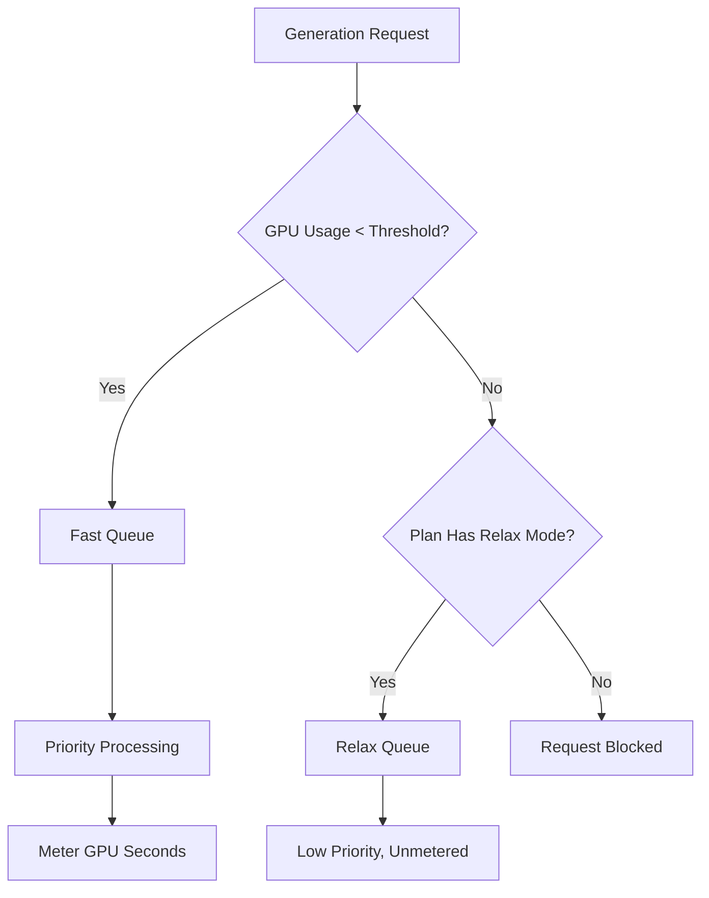

Midjourney ist eine generative KI-Plattform, die ein einzigartiges Abrechnungsmodell verwendet, das auf GPU-Zeit statt auf einer einfachen Bildanzahl basiert. Dieser Ansatz stellt sicher, dass komplexe, hochauflösende Renderings mehr kosten als schnelle, niedrigauflösende Entwürfe.

## Wie Midjourney abrechnet

Die Abonnementpläne von Midjourney gewähren den Nutzern jeden Monat eine bestimmte Anzahl von „Fast GPU Hours“. Diese Stunden repräsentieren die tatsächlich für Ihre Generierungen aufgewendete Rechenzeit.

| Plan | Preis | Fast GPU Hours | Relax Mode | Stealth Mode |
| :--- | :--- | :--- | :--- | :--- |
| Basic | \$10/month | ~3.3 hrs | No | No |
| Standard | \$30/month | 15 hrs | Unlimited | No |
| Pro | \$60/month | 30 hrs | Unlimited | Yes |
| Mega | \$120/month | 60 hrs | Unlimited | Yes |

1. **Pricing Tiers**: Midjourney bietet vier Abonnementstufen von \$10 bis \$120 pro Monat, wobei jede ein festgelegtes Kontingent an Fast-GPU-Stunden beinhaltet.
2. **Relax Mode**: Standard- und höhere Pläne erlauben unbegrenzte Generierungen über eine niedrigpriorisierte Warteschlange, sobald die Fast-Stunden verbraucht sind, sodass Nutzer niemals auf eine harte Nutzungsgrenze stoßen.
3. **Extra GPU Hours**: Nutzer können zusätzliche Fast-GPU-Zeit für ca. \$4 pro Stunde erwerben, wenn sie nach Verbrauch ihres monatlichen Kontingents sofortige Ergebnisse benötigen.
4. **Metering in GPU Seconds**: Die Nutzung wird anhand der tatsächlich für Generierungen aufgewendeten Rechenzeit verfolgt, sodass komplexe Renderings mehr kosten als einfache Entwürfe.
5. **Community Loop**: Aktive Nutzer können Bonus-GPU-Stunden verdienen, indem sie Bilder in der Galerie bewerten, was hilft, Modelle zu trainieren und gleichzeitig die Community belohnt.

Das Midjourney-Modell ist effektiv, weil es Kosten mit Wert und Ressourcennutzung in Einklang bringt.

* **GPU-time billing** bringt Kosten und Ressourcennutzung in Einklang, sodass komplexe Renderings fair im Vergleich zu einfachen Entwürfen verrechnet werden.
* **Relax Mode** bietet einen unbegrenzten Fallback, der die Abwanderung reduziert, indem er den Servicezugriff auch nach Erreichen monatlicher Limits sicherstellt.
* **The Fast vs Relax split** schafft Anreize für Upgrades, indem er priorisierte Verarbeitung für Nutzer bietet, die Geschwindigkeit und sofortige Ergebnisse schätzen.
* **Extra GPU Hours** liefern eine flexible Top-up-Option für Power-User, die mitten im Monat zusätzliche Hochprioritätskapazität benötigen.

## Dies mit Dodo Payments aufbauen

Sie können dieses Modell mit Dodo Payments nachbilden, indem Sie Abonnements mit Nutzungsmessern und anwendungsseitiger Logik kombinieren.

<Steps>

<Step title="Create a Usage Meter">

Erstellen Sie zunächst einen Meter, um die von jedem Kunden verwendeten GPU-Sekunden zu verfolgen.

* **Meter name**: `gpu.fast_seconds`
* **Aggregation**: **Summe** (addieren Sie die `gpu_seconds`-Eigenschaft aus jedem Ereignis)

Sie verfolgen nur Ereignisse, bei denen der Generierungsmodus „fast“ ist. Relax-Mode-Generierungen werden für Abrechnungszwecke nicht gemessen.

</Step>

<Step title="Create Subscription Products with Usage Pricing">

Erstellen Sie Ihre Abonnementprodukte und verknüpfen Sie den Nutzungsmesser mit einer freien Schwelle.

| Produkt | Basispreis | Kostenlose Schwelle (Sekunden) | Überschreitungsrate |
| :--- | :--- | :--- | :--- |
| Basic | \$10/month | 12,000 (3.3 hrs) | N/A (Hard Cap) |
| Standard | \$30/month | 54,000 (15 hrs) | \$0.00 (Relax Mode) |
| Pro | \$60/month | 108,000 (30 hrs) | \$0.00 (Relax Mode) |
| Mega | \$120/month | 216,000 (60 hrs) | \$0.00 (Relax Mode) |

Beim Basic-Plan deaktivieren Sie die Overage-Funktion, um eine harte Obergrenze durchzusetzen. Für die anderen Pläne wird der „Relax Mode“ durch Ihre Anwendungslogik gehandhabt, sobald der Meter anzeigt, dass die Schwelle überschritten wurde.

</Step>

<Step title="Implement Application-Level Relax Mode">

Die zentrale Erkenntnis ist, dass Relax Mode kein Abrechnungsmerkmal ist. Es handelt sich um Ihre Anwendung, die Anfragen beim Erreichen der Schwelle durch den Dodo-Nutzungsmesser in eine langsamere Warteschlange umleitet.

```typescript
async function handleGenerationRequest(customerId: string, prompt: string) {
  const usage = await getCustomerUsage(customerId, 'gpu.fast_seconds');
  const subscription = await getSubscription(customerId);
  const threshold = getThresholdForPlan(subscription.product_id);
  
  if (usage.current >= threshold) {
    if (subscription.product_id === 'prod_basic') {
      throw new Error('Fast GPU hours exhausted. Upgrade to Standard for Relax Mode.');
    }
    
    // Relax Mode. Route to low-priority queue
    return await queueGeneration(customerId, prompt, {
      priority: 'low',
      mode: 'relax',
      model: 'standard'
    });
  }
  
  // Fast Mode. Priority processing
  return await queueGeneration(customerId, prompt, {
    priority: 'high',
    mode: 'fast',
    model: 'premium'
  });
}
```

</Step>

<Step title="Send Usage Events (Fast Mode Only)">

Senden Sie nur dann Nutzungsevents an Dodo, wenn eine Generierung im Fast-Modus durchgeführt wird.

```typescript
import DodoPayments from 'dodopayments';

async function trackFastGeneration(customerId: string, gpuSeconds: number, jobId: string) {
  // Only track Fast mode generations. Relax mode is free and unlimited
  const client = new DodoPayments({
    bearerToken: process.env.DODO_PAYMENTS_API_KEY,
  });

  await client.usageEvents.ingest({
    events: [{
      event_id: `gen_${jobId}`,
      customer_id: customerId,
      event_name: 'gpu.fast_seconds',
      timestamp: new Date().toISOString(),
      metadata: {
        gpu_seconds: gpuSeconds,
        resolution: '1024x1024',
        mode: 'fast'
      }
    }]
  });
}
```

</Step>

<Step title="Sell Extra Fast Hours (One-Time Top-Up)">

Erstellen Sie ein einmaliges Zahlungsprodukt für die „Extra Fast GPU Hour“ zu \$4. Wenn ein Kunde dieses kauft, können Sie in Ihrer Anwendung zusätzliche Schwellen oder Guthaben gewähren.

```typescript
// After customer purchases extra hours
const session = await client.checkoutSessions.create({
  product_cart: [
    { product_id: 'prod_extra_gpu_hour', quantity: 5 }
  ],
  customer: { customer_id: customerId },
  return_url: 'https://yourapp.com/dashboard'
});
```

</Step>

<Step title="Create Checkout for Subscription">

Erstellen Sie abschließend eine Checkout-Sitzung für den Abonnementplan.

```typescript
const session = await client.checkoutSessions.create({
  product_cart: [
    { product_id: 'prod_mj_standard', quantity: 1 }
  ],
  customer: { email: 'artist@example.com' },
  return_url: 'https://yourapp.com/studio'
});
```

</Step>

</Steps>

## Mit dem Time Range Ingestion Blueprint beschleunigen

Der [Time Range Ingestion Blueprint](/developer-resources/ingestion-blueprints/time-range) vereinfacht die GPU-Zeiterfassung, indem er spezielle Helfer für abrechnungsbasierte Zeitspannen bereitstellt.

```bash
npm install @dodopayments/ingestion-blueprints
```

```typescript
import { Ingestion, trackTimeRange } from '@dodopayments/ingestion-blueprints';

const ingestion = new Ingestion({
  apiKey: process.env.DODO_PAYMENTS_API_KEY,
  environment: 'live_mode',
  eventName: 'gpu.fast_seconds',
});

// Track generation time after a Fast mode job completes
const startTime = Date.now();
const result = await runGeneration(prompt, settings);
const durationMs = Date.now() - startTime;

await trackTimeRange(ingestion, {
  customerId: customerId,
  durationMs: durationMs,
  metadata: {
    mode: 'fast',
    resolution: '1024x1024',
  },
});
```

Das Blueprint kümmert sich um die Dauerumrechnung und das Formatieren von Ereignissen. Sie müssen nur die Kunden-ID und die verstrichene Zeit angeben.

<Tip>
Der Time Range Blueprint unterstützt Millisekunden, Sekunden und Minuten. Siehe die [vollständige Blueprint-Dokumentation](/developer-resources/ingestion-blueprints/time-range) für alle Daueroptionen und Best Practices.
</Tip>

## Die Fast-vs-Relax-Architektur

Das Zwei-Warteschlangen-System funktioniert, indem es Anfragen basierend auf dem aktuellen Nutzungsstatus weiterleitet.



1. Alle Anfragen laufen über Ihre Anwendung.
2. Die Anwendung vergleicht den Dodo-Nutzungsmesser mit der freien Schwelle des Plans.
3. Wenn die Nutzung unter der Schwelle liegt, wird die Anfrage an die Fast-Warteschlange weitergeleitet und gemessen.
4. Wenn die Nutzung über der Schwelle liegt, wird die Anfrage an die Relax-Warteschlange weitergeleitet, die ungemessen ist und geringere Priorität hat.
5. Der Basic-Plan hat keinen Relax-Fallback, sodass Anfragen blockiert werden, sobald das Limit erreicht ist.

<Info>
Relax Mode ist ein anwendungsseitiges Muster, kein Dodo-Abrechnungsmerkmal. Dodo verfolgt Ihre Fast-GPU-Nutzung und informiert Sie, wenn die Schwelle überschritten wird. Ihre Anwendung entscheidet, ob der Nutzer blockiert oder in eine langsamere Warteschlange geleitet wird.
</Info>

## Wichtige verwendete Dodo-Funktionen

<CardGroup cols={2}>
  <Card title="Subscriptions" icon="calendar" href="/features/subscription">
    Verwalten Sie wiederkehrende Abrechnung und Planstufen.
  </Card>
  <Card title="Usage-Based Billing" icon="bolt" href="/features/usage-based-billing/introduction">
    Verfolgen und berechnen Sie basierend auf dem tatsächlichen Ressourcenverbrauch.
  </Card>
  <Card title="Event Ingestion" icon="input-pipe" href="/features/usage-based-billing/event-ingestion">
    Senden Sie hochvolumige Nutzungsevents an die Dodo-API.
  </Card>
  <Card title="Meters" icon="gauge" href="/features/usage-based-billing/meters">
    Definieren Sie, wie Nutzungsevents aggregiert und abgerechnet werden.
  </Card>
  <Card title="One-Time Payments" icon="credit-card" href="/features/one-time-payment-products">
    Verkaufen Sie zusätzliche Stunden oder Aufladungen als Einmalzahlungen.
  </Card>
  <Card title="Time Range Blueprint" icon="clock" href="/developer-resources/ingestion-blueprints/time-range">
    Vereinfachte GPU-Zeiterfassung mit dauerbasierten Helfern.
  </Card>
</CardGroup>
